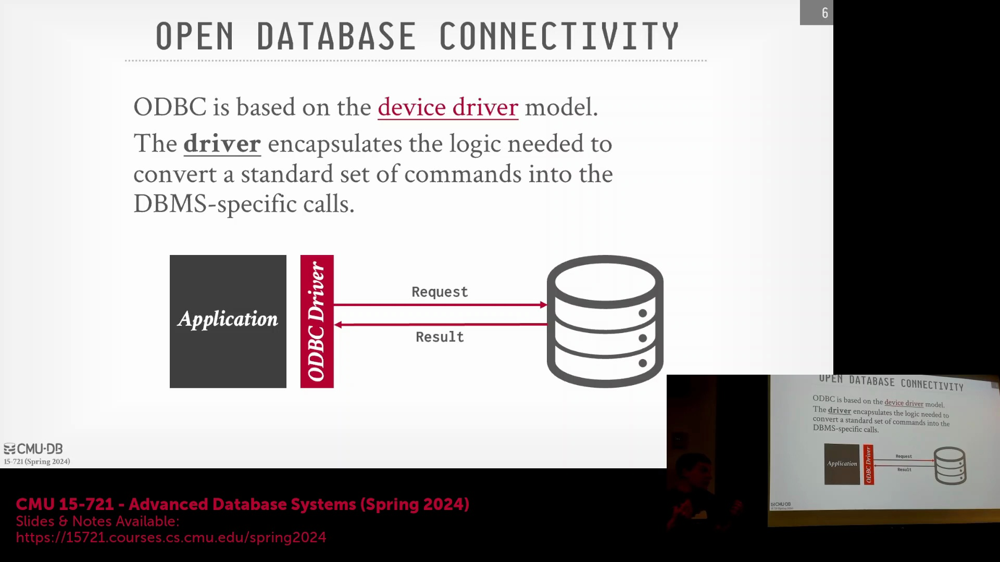
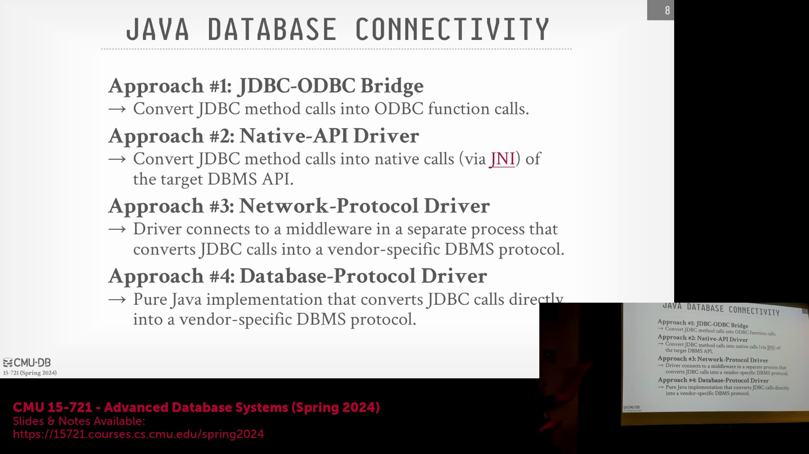
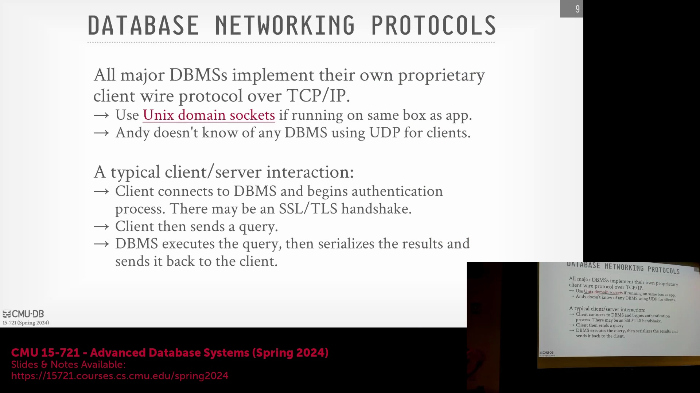

## ODBC 驱动模拟与网络协议焦点

ODBC 驱动程序能够模拟底层数据库可能原生不支持的功能，例如真正的服务器端游标(Server-Side Cursor)。若底层缺失某项功能，驱动程序可代为发送完整查询，将结果缓存至客户端，并向应用程序暴露标准的迭代游标接口。然而，本节课的重点将从驱动层的抽象转向网络协议(Wire Protocol)本身：即客户端应用程序与数据库服务器在请求与响应中传输的确切字节流。

## SQL 执行流程与 ODBC 标准化
使用 ODBC 时，开发者常有一个疑问：SQL 查询究竟在何处被解析与执行？ODBC 规范对客户端的 API 调用进行了标准化，涵盖了建立连接、准备语句(Prepared Statement)、执行查询、遍历结果集(Result Set)以及处理数据类型转换等环节。然而，SQL 查询字符串本身会原封不动地通过网络传输至服务器端。所有的语法解析(Parsing)、查询规划(Query Planning)与优化(Optimization)均在服务器端完成，通常由数据库厂商提供的底层 C API 处理。客户端 API 保持统一且与数据库无关(Database-Agnostic)，而服务器端则使用其原生的 SQL 方言(SQL Dialect)来解释并执行查询。

## JDBC 的兴起与跨平台连接

20 世纪 90 年代中期，Java 凭借其“一次编写，到处运行”(Write Once, Run Anywhere) 的 JVM(Java Virtual Machine) 架构，迅速成为主导级的企业编程语言。由于 ODBC 历史上具有 Windows 平台局限性，且与 C/C++ 紧密耦合，Sun Microsystems 开发了 JDBC(Java Database Connectivity)，旨在为 Java 生态提供标准化且与数据库无关(Database-Agnostic)的连接 API。JDBC 秉承了 ODBC 的核心理念：尽管底层 SQL 语法与服务器实现存在差异，它仍使开发者能够通过统一的 API 与各类数据库后端进行交互。

## JDBC 实现架构

为兼容现有的数据库生态系统，JDBC 规范最初定义了四种驱动实现类型(Driver Types)。类型 1 (Type 1) 充当 JDBC-ODBC 桥接器(JDBC-ODBC Bridge)，将 Java 调用封装为对原生 ODBC C 库的调用（目前基本已被弃用）。类型 2 (Type 2) 利用 JNI(Java Native Interface) 直接调用原生客户端 C API 进行网络通信。类型 3 (Type 3) 将 JDBC 调用路由至独立的中间件服务器(Middleware Server)，由该中间件负责与目标数据库通信。类型 4 (Type 4) 为纯 Java 实现(Pure Java Driver)，可直接与数据库厂商特定的网络协议进行通信。如今，类型 4 已成为主流数据库的行业标准，提供了最高效、可移植且最直接的连接路径。

## 网络协议：TCP/IP、Unix 套接字与 UDP

数据库系统主要依赖基于 TCP/IP 的专有网络协议进行客户端与服务器通信，这得益于 TCP/IP 内置的可靠性(Reliability)与确认机制(Acknowledgement)。虽然 Unix 域套接字(Unix Domain Socket) 可绕过完整的 TCP/IP 协议栈，从而在 Linux 系统上获得更优的本地进程间通信性能（PostgreSQL 支持该特性），但它并不适用于分布式或云原生架构。值得注意的是，由于 UDP(User Datagram Protocol) 缺乏可靠性保障，没有任何主流数据库会将其用于客户端与服务器的直接通信。然而，部分系统（如 Yellowbrick 或 PostgreSQL 内部的统计信息收集器）会在同一物理机的后端工作进程(Backend Worker Processes)之间使用 UDP 以最大化吞吐量(Throughput)，并通过实现自定义的重试逻辑(Retry Logic)来处理潜在的数据包丢失问题。

## 连接生命周期与结果序列化
标准的客户端-服务器(Client-Server)交互始于连接建立与身份验证握手(Authentication Handshake)，理想情况下应使用 SSL/TLS 进行加密，以防止网络数据包嗅探(Packet Sniffing)。身份验证成功后，客户端发送 SQL 查询，服务器端负责解析并执行该查询。随后，查询结果会被序列化为指定的网络传输格式，并通过网络返回给客户端。尽管部分传统系统支持基于游标的流式传输(Cursor-Based Streaming)以逐步返回结果，但许多现代云数据库倾向于等待查询完全执行完毕后，再将完整的数据集发送给客户端。这种传输策略高度依赖于查询执行计划(Execution Plan)；例如，包含 `LIMIT` 子句的 `ORDER BY` 操作必须先物化(Materialize)并全量排序所有数据行，随后才能安全地返回结果。

## 性能瓶颈与大型查询处理
在现代分析型工作负载(Analytical Workloads)中，实际的查询执行时间往往远小于将结果序列化并传输回客户端所需的网络开销。虽然 SQL 查询字符串通常体积很小，但在某些极端情况下也可能达到数 MB（例如 10 MB）。这种情况常见于数据仪表盘(Dashboard)应用，此类应用会根据用户的筛选条件动态生成包含海量值的 `IN` 子句。为高效处理此类请求，数据库引擎会避免低效的线性列表遍历，转而将庞大的 `IN` 子句物化为临时哈希表(Temporary Hash Table)。这在执行层面实质上将其转化为一次哈希连接(Hash Join)操作，从而优化内存使用、降低 CPU 开销并大幅提升数据查找效率。