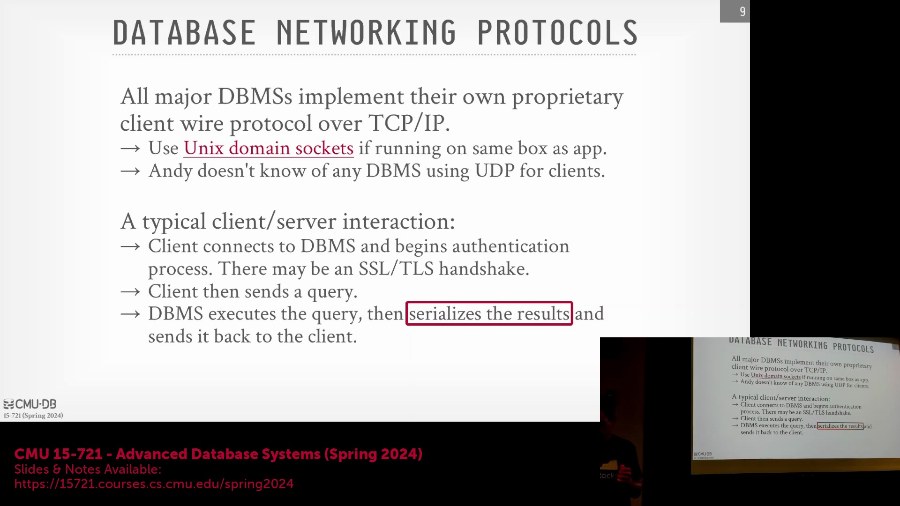
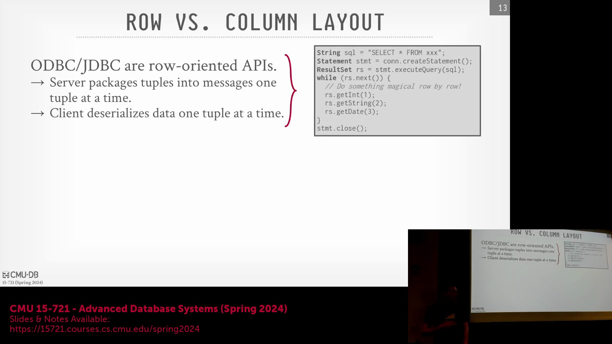
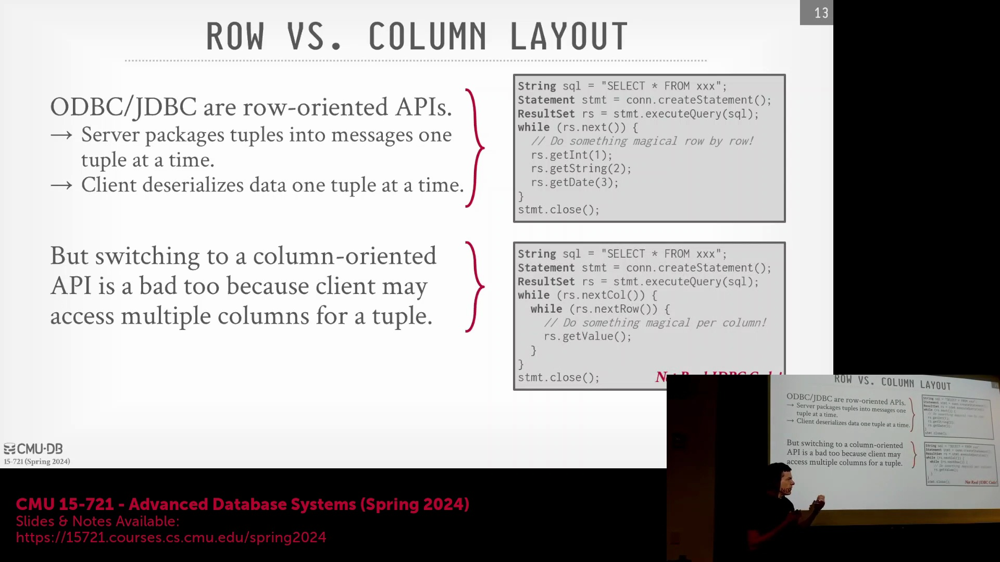
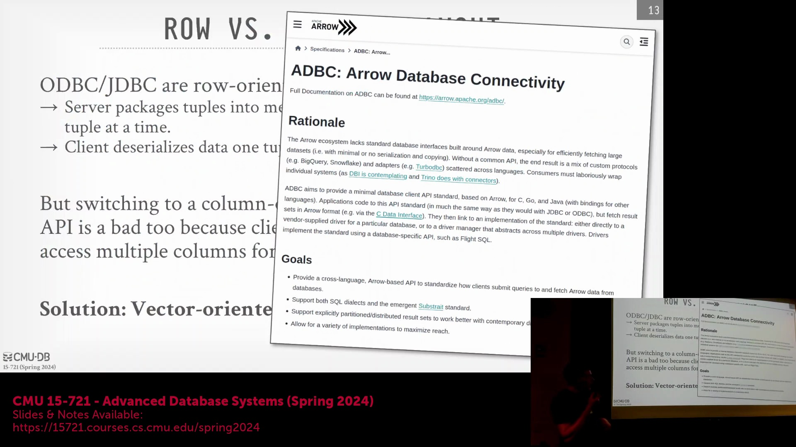
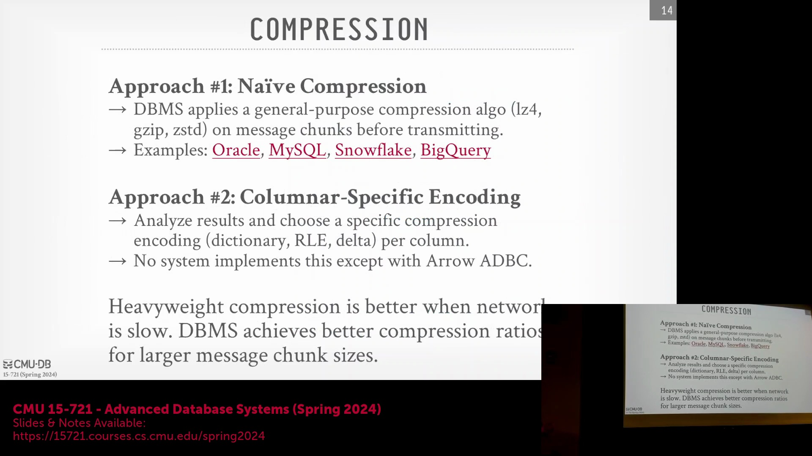

## 采用现有网络传输协议还是自研新协议

在设计新型数据库系统时，数据库架构师(Database Architects)面临一个根本性的选择：是从零开始研发专有的网络传输协议(Proprietary Network Transport Protocol)，还是直接采用现有的成熟协议。构建自定义协议(Custom Protocol)意味着需要自行开发并维护所有配套的客户端连接库(Client Libraries)与驱动程序(Drivers)。然而，现代数据库行业的标准做法是复用现有的成熟协议，如 MySQL、PostgreSQL 或 Redis 协议。采用此策略可使新系统立即接入成熟且跨语言的驱动生态系统(Cross-language Driver Ecosystem)。尽管仅实现网络协议层是建立连接的最基本要求，但若要实现真正的生态兼容性，数据库还必须完整支持系统目录(System Catalog)与元数据(Metadata)查询。如今，PostgreSQL 协议兼容性尤为流行。许多现代数据库系统（如 Neon、Amazon Redshift）会直接复用 PostgreSQL 的网络层代码，同时完全替换其底层的存储引擎(Storage Engine)。Snowflake 是一个显著的例外，它在 2010 年代初便自主研发了私有协议与专属的 SQL 方言(SQL Dialect)。但为了快速融入现有工具链与生态系统，复用成熟协议如今已成为绝对的行业主流。

## 客户端与服务器的协调挑战
在现代数据库架构中，一个关键瓶颈往往源于服务器端优化与客户端驱动程序之间所需的繁重协调(Coordination)工作。正如 MonetDB Light 论文（DuckDB 的前身）所探讨的，将大型数据集高效导出至 Pandas 或 R 等数据分析工具(Data Analytics Tools)时，常会受到客户端驱动程序碎片化(Driver Fragmentation)的严重阻碍。若服务器端对传输数据进行了压缩或将其转换为列式格式(Columnar Format)，则每一种编程语言对应的客户端驱动程序都必须独立实现相应的解压缩与数据重建逻辑(Data Reconstruction Logic)。这不仅带来了巨大的工程开销，还极易导致不同语言驱动之间的功能支持出现不一致。在无服务器环境(Serverless Environment)（如 AWS Lambda）中，这一问题尤为突出：应用实例需快速启动、执行数据库查询、处理返回结果并迅速销毁。在此类场景下，高昂的客户端反序列化操作(Deserialization)会直接推高计算成本并增加端到端延迟，这凸显了建立标准化、零拷贝数据交换格式(Zero-Copy Data Exchange Format)的必要性。

## 面向行的 API 与列式存储

ODBC 与 JDBC 等传统连接标准本质上是面向行的 API(Row-Oriented API)，其设计可追溯至 20 世纪 90 年代初，主要面向以获取单条记录或实体为主的联机事务处理(OLTP)工作负载。因此，即便数据库内部采用了高度优化的列式存储格式(Columnar Storage Format)，在通过网络传输查询结果前，也必须先将结果物化(Materialize)并逐行重组为传统的行式结构(Row-Major Format)。这种设计虽契合传统应用程序顺序遍历结果集(Result Set)的模式，但对于需要处理数百万乃至数十亿行的分析型工作负载(Analytical Workloads)而言，却引入了巨大的 CPU 计算与内存开销。网络传输层由此成为性能瓶颈，迫使列式数据库执行代价高昂的行数据重建(Row Reconstruction)操作，这在一定程度上违背了其底层架构设计的初衷。

## 向量化批处理与 Arrow 解决方案

对于标准应用程序而言，直接传输原始的列式数据往往效率低下，因为在客户端重组单个元组(Tuple)需要复杂且极易出错的拼接逻辑。最优的解决方案是引入向量化与批处理的数据模型(Vectorized Batch Processing Data Model)。数据库不再逐行发送数据或传输庞大的原始列数据块，而是将数据切分为易于管理的“数据批次”(Data Batches)或向量(Vectors)。这不仅确保了相关元组的数据在内存中保持物理连续性(Physical Locality)，还完整保留了列式布局(Columnar Layout)在数据压缩与顺序扫描(Sequential Scan)方面的优势。这一理念在 Apache Arrow 生态中通过 Arrow 数据库连接规范(Arrow Database Connectivity, ADBC)得到了正式确立与标准化。ADBC 提供了一套语言无关的 API(Language-Agnostic API)，允许应用程序执行 SQL 查询，并直接以原生 Arrow 内存格式(Native Arrow Memory Format)接收结果数据。该机制彻底消除了中间数据拷贝、序列化(Serialization)与反序列化(Deserialization)环节，实现了数据库与客户端分析工具之间无缝、零开销(Zero-Overhead)的数据直传。

## 网络传输中的压缩权衡

在优化数据传输格式之后，下一个关键的设计决策便涉及网络传输压缩(Network Transmission Compression)。数据库架构师必须在通用压缩算法(General-Purpose Compression Algorithms)（如 gzip、Snappy 或 Zstandard）与轻量级的专用数据编码(Specialized Data Encoding)之间进行权衡与选择。通用压缩算法通常将数据视为不透明的数据块(Opaque Data Blobs)进行处理，尽管其绝对压缩率较高，但往往以增加 CPU 占用率与传输延迟为代价。相比之下，专用编码则深度契合数据的统计特性(Statistical Properties)进行优化（例如针对字符串的字典编码(Dictionary Encoding)、针对时间戳或数值的差分编码(Delta Encoding)）。尽管通用压缩算法更易于在所有客户端驱动程序中统一集成，但专用编码通过同步降低网络带宽(Network Bandwidth)占用与序列化/解压缩所需的 CPU 周期，为高吞吐量分析型工作负载(High-Throughput Analytical Workloads)提供了更为卓越的整体性能。