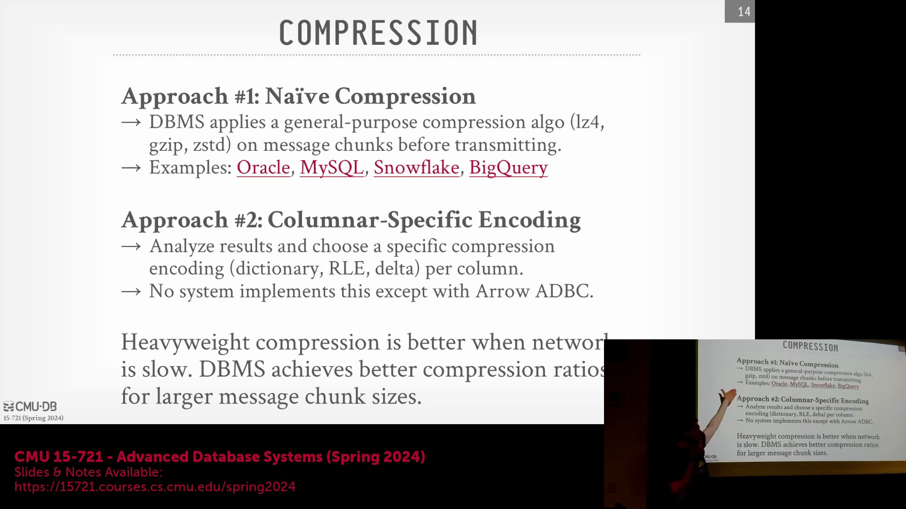
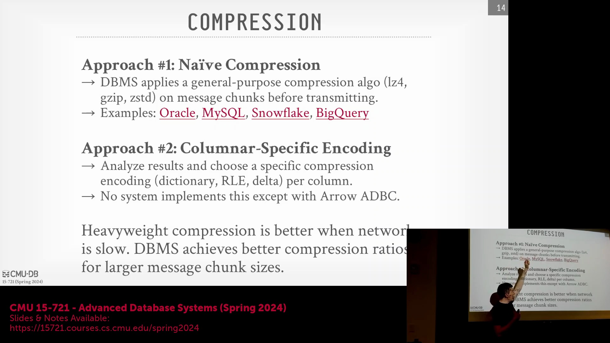
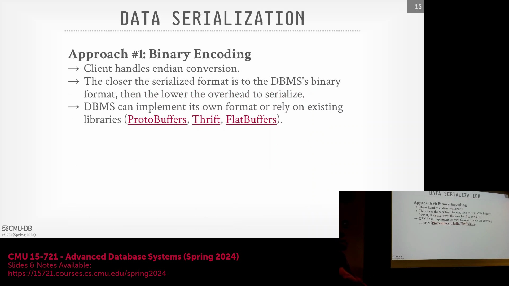
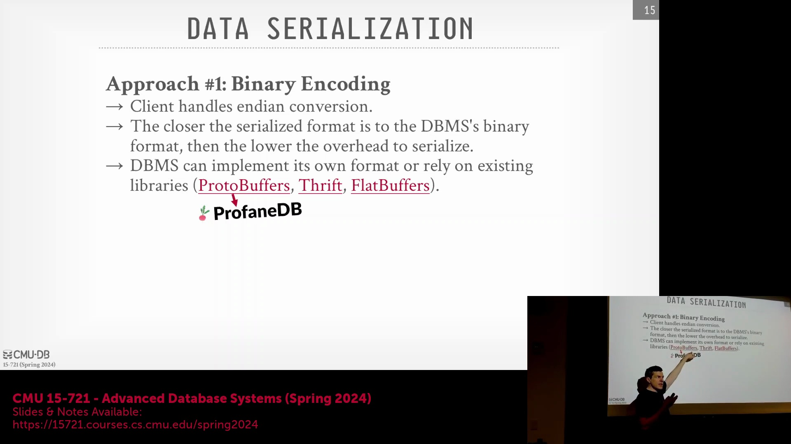
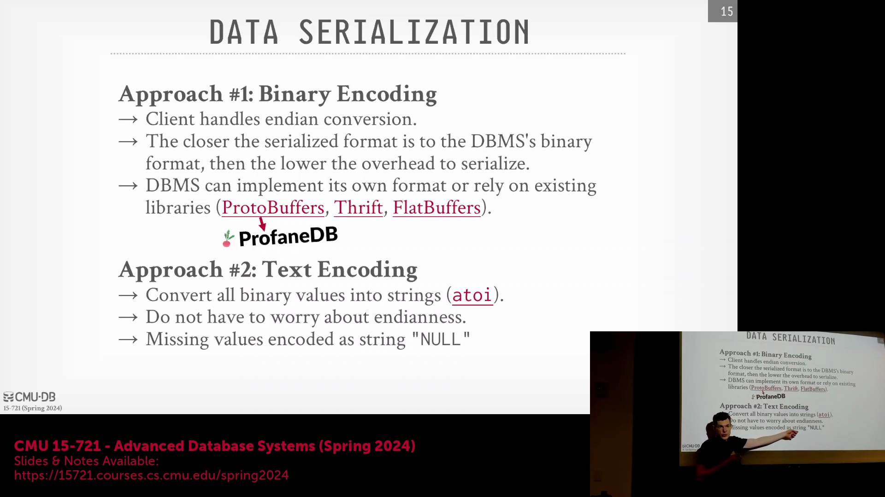
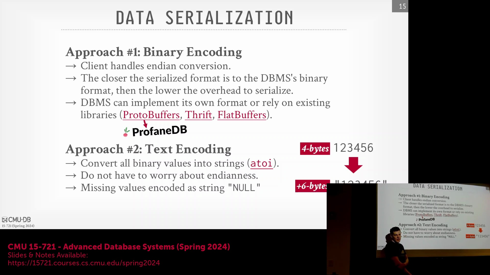

## 通用网络压缩

优化网络传输最直接的方法是在数据传输前，直接对网络协议数据包(Network Protocol Packets)应用 gzip、Snappy 或 Zstandard 等通用压缩算法(General-Purpose Compression Algorithms)。客户端在接收到数据后仅需执行解压(Decompression)操作。然而，主流数据库系统极少默认启用此功能。尽管 Oracle、MySQL 以及 BigQuery 等云平台（通常依赖 HTTP 应用层的 gzip 压缩）将其作为可选附加功能提供支持，但针对 PostgreSQL 底层协议的压缩开发进展缓慢，致使许多遗留系统(Legacy Systems)在网络协议层缺乏原生压缩(Native Compression)支持。

## 特定数据编码与客户端-服务器协商

作为通用压缩的替代方案，系统可直接对响应负载(Response Payload)应用数据感知型编码方案(Data-Aware Encoding Schemes)，例如字典编码(Dictionary Encoding)、游程编码(Run-Length Encoding, RLE)、差分编码(Delta Encoding)或基准编码(Frame-of-Reference Encoding)。尽管这些方案在理论上具备极高的效率，但在传统网络协议中却极少被原生实现。其核心瓶颈在于客户端驱动程序的碎片化(Driver Fragmentation)：每种编程语言对应的客户端驱动都需独立实现相应的解码器(Decoder)，这就要求在连接初始化阶段执行复杂的能力协商握手(Capability Negotiation Handshake)。此外，通用压缩与专用数据编码并非互斥(Mutually Exclusive)，二者完全可以叠加使用。当客户端与服务器间的网络链路(Network Link)成为性能瓶颈时，消耗 CPU 周期进行高强度压缩(High-Intensity Compression)是极具性价比的策略，尤其是在传输大型数据块(Data Blocks)且能获得显著压缩收益的场景下。

## 二进制序列化与库开销

在二进制数据传输(Binary Data Transmission)场景下，系统必须在自定义序列化格式(Custom Serialization Format)与采用成熟序列化库（如 Protocol Buffers、Apache Thrift 或 FlatBuffers）之间做出抉择。自定义格式虽能提供最大程度的控制权与最小的运行时开销，但通常缺乏内置的模式版本控制(Schema Versioning)机制。Protobuf 等序列化库能优雅地处理向后兼容性(Backward Compatibility)与 API 演进(API Evolution)，但往往会引入额外的元数据膨胀(Metadata Bloat)问题。Thrift 框架通常较为臃肿，常会强制引入线程池(Thread Pool)与缓冲区管理(Buffer Management)基础设施，而数据库系统通常更倾向于在引擎内部自主管理这些资源。相比之下，FlatBuffers 提供了一种更为轻量级的零拷贝(Zero-Copy)替代方案。在极少数边缘案例(Edge Cases)中（例如 ProtobufNDB 项目），数据库会在内存中以 Protobuf 格式直接存储数据，并通过网络原样传输，从而彻底消除序列化/反序列化(Serialization/Deserialization)成本。然而，这种做法通常被视为一种特定架构的优化特例，而非通用生产环境的标准实践。

## 基于文本编码的低效性

历史上，一种简单但极其低效的数据传输方式是采用基于文本的编码(Text-Based Encoding)，即在网络传输前将所有二进制数据类型强制转换为 ASCII 或 UTF-8 字符串。这种做法确实完全规避了跨平台字节序(Endianness)不匹配的问题，因为客户端仅需将人类可读的文本解析(Parsing)回其原生二进制格式即可。然而，文本编码会引入显著的数据歧义(Data Ambiguity)，尤其在处理空值(NULL Values)时。部分早期数据库系统（如 MonetDB）曾直接使用字面量字符串(Literal String) `"null"` 来表示数据库缺失值。若用户的实际业务数据中恰好包含单词 `"null"`，便会引发严重的解析冲突。

如今，文本编码已被业界广泛认定为现代分析型数据库(Analytical Databases)中糟糕的设计选择(Poor Design Choice)。将紧凑的 32 位或 64 位整数转换为变长字符串(Variable-Length String)会导致数据负载(Payload)体积急剧膨胀。例如，一个仅占 4 字节的整数转换为文本后可能变为 6 字节的字符串（若再计入长度前缀(Length Prefix)或空终止符(Null Terminator)），其实际存储空间占用将暴增 50% 甚至更多。

这种数据膨胀(Data Bloat)不仅会浪费宝贵的网络带宽(Network Bandwidth)，还会严重削弱下游压缩算法的效能。文本序列化(Text Serialization)破坏了原始数据固有的统计规律与分布特征，迫使系统传输冗长且压缩率极低的数据负载。因此，现代数据库系统严格倾向于采用紧凑的二进制格式(Compact Binary Format)，以此保留数据的原始内存布局(Memory Layout)，并最大化网络传输效率。