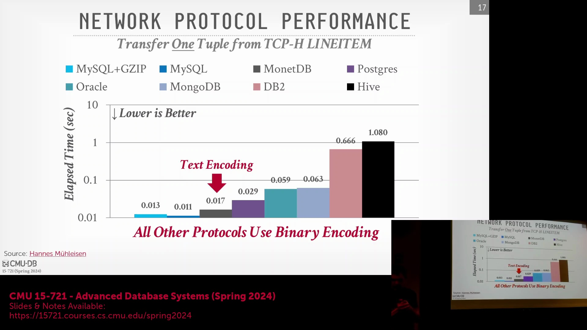
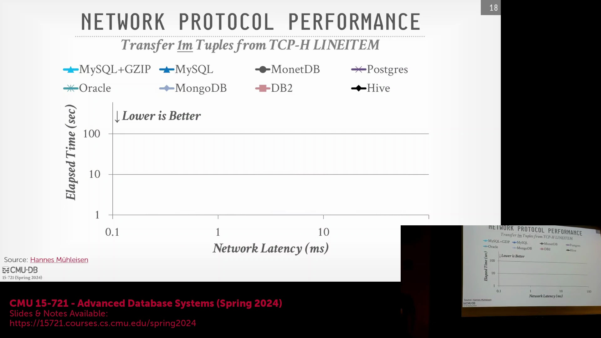
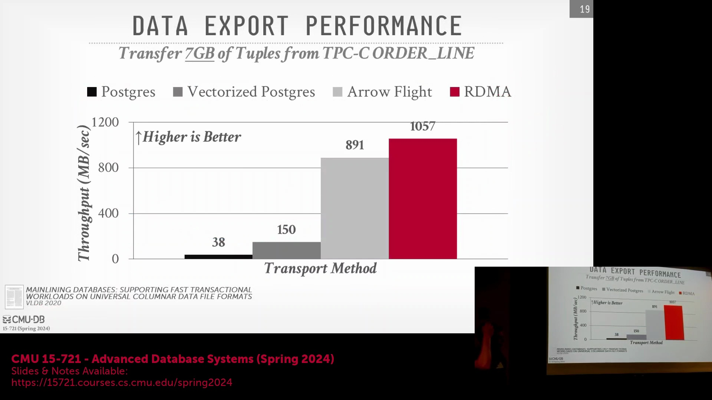
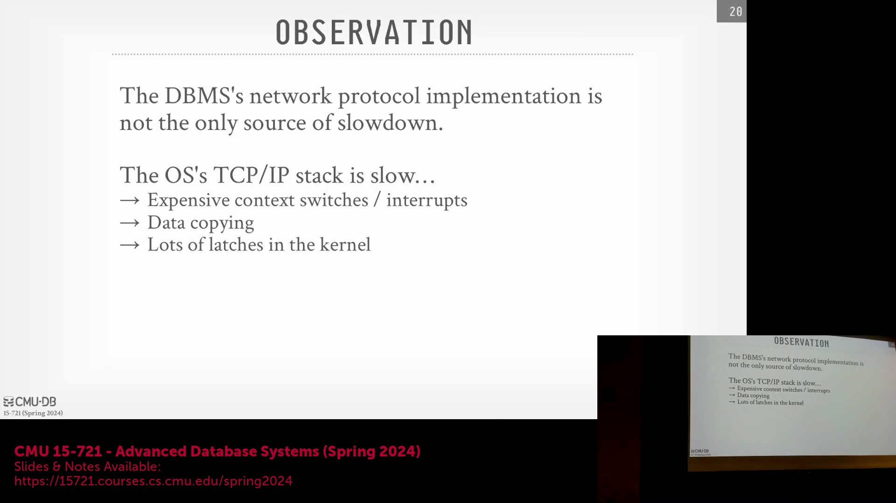

## 明确基准测试范围与 Hive 的历史遗留问题

讨论首先明确指出，性能指标(benchmarking metrics)严格聚焦于进出数据库的原始数据传输(raw data transmission)，而非完整的查询执行(query execution)或结果缓存(result caching)。Hive 表现显著不佳的原因需置于历史背景中理解：在 2000 年代末 Hadoop 和 MapReduce 获得业界关注时，Hive 作为过渡性方案(transitional solution)应运而生。尽管关系型数据库专家(Relational Database Experts)认为它只是重新发明了 20 世纪 90 年代的并行与分布式数据库(Parallel and Distributed Databases)概念，但 Hive 的创立初衷是为了将 SQL 转换为冗长的 Java MapReduce 作业(MapReduce Jobs)。这虽然缓解了手动编码(manual coding)的繁琐，但也引入了显著的协议与执行开销(protocol and execution overhead)，这也解释了为何现代系统已逐渐将其取代。

## 网络延迟与压缩的权衡

一项新的基准测试(benchmark)在传输 TPC-H 数据集(TPC-H dataset)的一百万个元组(tuples)时，逐步增加网络延迟(network latency)。对比启用与禁用 GZIP 压缩(GZIP compression)的 MySQL，揭示了清晰的性能权衡(performance trade-off)：在高速网络环境下，压缩会带来不必要的 CPU 开销(CPU overhead)；尽管传输的字节量更大，但禁用压缩的传输反而更快。然而，当网络延迟增至约 100 毫秒时，与传输延迟(transmission latency)相比，压缩所需的 CPU 成本(CPU cost)变得微不足道，此时传输压缩数据反而略快。将其他数据库系统纳入对比图表后，它们普遍遵循这一预期曲线，充分表明实际网络条件决定了最优的序列化与压缩策略(serialization and compression strategies)。

## 企业级数据库中的协议设计缺陷
在延迟扩展测试(latency scaling test)中，Oracle 与 DB2 表现出异常的性能模式(performance patterns)。Oracle 在高速网络上表现颇具竞争力，但随着延迟增加，性能下滑至倒数第二；而 DB2 在所有测试场景下均垫底，即便在低速网络中也落后于 Hive。推测其原因在于，这两款专有数据库系统(proprietary database systems)均在 TCP/IP 协议之上实现了冗余的应用层确认机制(application-layer acknowledgment mechanism)。由于 TCP 协议本身已负责数据包确认(packet acknowledgment)与流量控制(flow control)，这种额外的“频繁交互”(chatty)协议层引发了不必要的往返通信(round-trip communication)。随着网络延迟的增加，这些冗余确认逐渐成为主导开销(dominant overhead)，凸显了陈旧协议设计(legacy protocol design)所带来的性能惩罚(performance penalty)。

## 基于 Apache Arrow 和 RDMA 的零拷贝优化

针对 Peloton/NoisePage 系统的研究探索了如何最大化大规模数据传输（7GB TPC-C lineitem 表数据）的吞吐量(throughput)。该对比评估了四种传输方案：默认的 PostgreSQL 基于行的协议(row-based protocol)、采用 PAX 格式(Partition Attributes Across)的向量化 PostgreSQL、原生 Apache Arrow（通过早期的 ADBC(Arrow Database Connectivity)前身实现）以及 RDMA(Remote Direct Memory Access)。结果表明，得益于零拷贝语义(zero-copy semantics)，无需进行格式转换即可将 Apache Arrow 数据批处理块(Arrow data batches)直接原生推送至客户端的方案性能最为优异。RDMA 技术通过完全绕过操作系统内核(bypass the OS kernel)，实现内存数据从服务器直接传输至网卡(Network Interface Card, NIC)，进一步突破了性能瓶颈。核心结论表明：在系统内部采用 Arrow 等列式(columnar format)与向量化格式(vectorized format)进行数据存储与传输，能够彻底消除昂贵的序列化与格式转换开销(serialization and conversion overhead)。

## 绕过操作系统与 TCP/IP 协议栈的开销

除线路协议(wire protocol)与序列化(serialization)之外，操作系统的 TCP/IP 协议栈(TCP/IP protocol stack)已成为主要的性能瓶颈。传统网络架构依赖于中断驱动模型(interrupt-driven model)，该模型会触发高昂的上下文切换(context switch)，涉及内核线程调度(kernel thread scheduling)，并常伴随内部闩锁(latch)竞争。此外，抵达网卡的数据必须先拷贝至内核缓冲区(kernel buffer)，随后再次拷贝至用户空间内存(user-space memory)，致使数据移动的开销成倍增加。为实现极致的数据库网络性能，现代系统架构正日益倾向于完全绕过操作系统的网络协议栈。借助内核旁路(kernel bypass)与直接内存访问等技术最大限度地削减上下文切换与内存拷贝操作，数据库系统得以显著降低传输延迟(transmission latency)并大幅提升整体吞吐量。