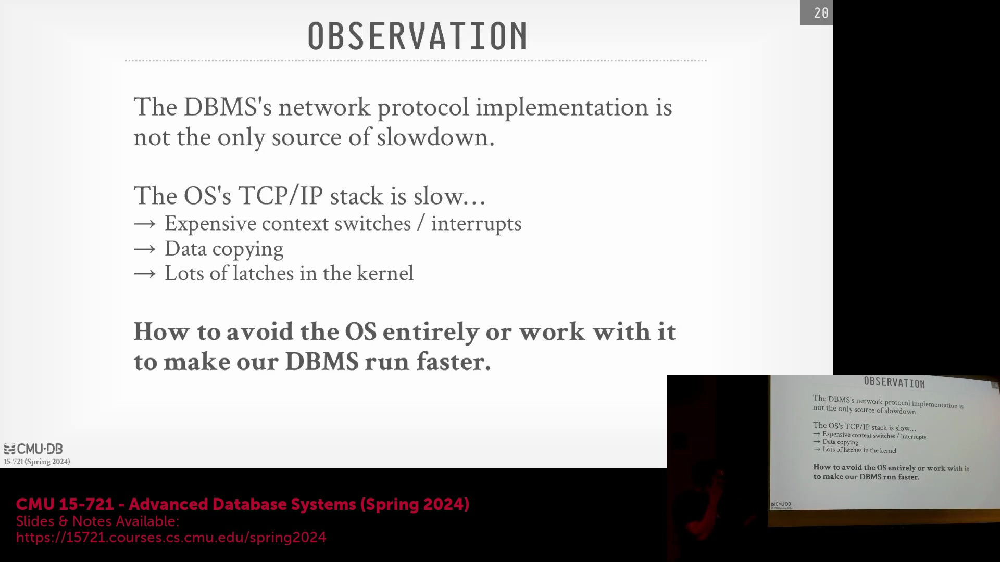
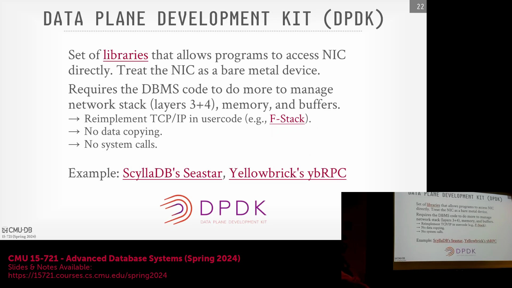
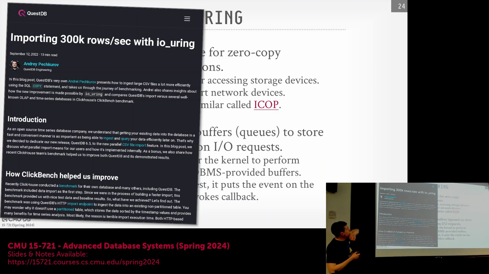

## 避开操作系统与内核旁路的必要性

尽管操作系统(Operating System)在内存分配(Memory Allocation)和进程调度(Process Scheduling)等基础任务中不可或缺，但高性能数据库系统在数据传输操作（尤其是网络与磁盘 I/O(I/O)）中会极力减少操作系统的介入。传统 Linux 架构作为分时系统(Time-sharing System)，高度依赖高昂的硬件中断(Hardware Interrupt)、上下文切换(Context Switch)和内核线程调度(Kernel Thread Scheduling)。这些机制会引入显著的开销与内部闩锁竞争(Internal Latch Contention)，随着核心数量的增加，不可避免地会成为性能瓶颈。为了规避这些低效问题，现代数据库采用内核旁路(Kernel Bypass)技术。其主要目标是将数据直接从网卡(Network Interface Card, NIC)等硬件组件传输至用户空间内存(User-space Memory)。该方法完全绕过了操作系统的 TCP/IP 协议栈(TCP/IP Protocol Stack)，消除了内核缓冲区(Kernel Buffer)与用户空间缓冲区(User-space Buffer)之间的冗余数据拷贝，并免除了对传统阻塞式系统调用(Blocking System Call)的依赖。

## DPDK/SPDK：用户空间直接与硬件交互
英特尔开发的 Data Plane Development Kit (DPDK) 及其面向存储的对应版本 Storage Performance Development Kit (SPDK)，提供了用户空间库(User-space Library)，使应用程序能够直接与底层硬件设备进行底层交互。通过将网卡和存储控制器(Storage Controller)视为原始的内存映射设备(Memory-mapped Device)，这些框架从根本上打破了传统 Unix 系统“一切皆文件”(Everything is a File)的抽象概念。然而，这种架构转变将管理网络协议的责任直接转移给了数据库引擎。在操作系统不再处理 TCP/IP 协议栈的情况下，应用程序必须手动实现网络逻辑，或集成 F-stack 等用户空间库来管理序列号(Sequence Number)、MAC 地址(MAC Address)和确认机制(Acknowledgment Mechanism)。尽管这保证了零拷贝数据传输(Zero-copy Data Transmission)并消除了系统调用开销(System Call Overhead)，但工程复杂度极高。 

著名的实现案例包括 ScyllaDB（基于 Seastar 框架构建）和 Yellowbrick。然而，维护自定义的用户空间网络栈已被证明极其困难。ScyllaDB 工程师曾公开表示，DPDK 的集成是一场“维护噩梦”，导致团队通常默认禁用该功能。这一经历凸显了系统工程中的一个常见议题(Recurring Theme)：虽然内核旁路承诺了理论上的极致性能，但现实世界中的维护负担和调试复杂性往往超过了边际吞吐量(Marginal Throughput)提升所带来的收益。

## RDMA：远程直接内存访问
远程直接内存访问(Remote Direct Memory Access, RDMA)提供了一种差异化的内核旁路策略，它允许应用程序像访问本地存储一样直接读写远程服务器的内存，其架构理念与 NVMe(Non-Volatile Memory Express) 存储高度相似。该方法需要严格的初始握手过程来注册内存区域(Memory Region Registration)、建立跨节点访问权限并验证地址稳定性，这带来了较高的前期配置复杂度。因此，RDMA 通常仅限于在严格控制的隔离环境中用于后端节点间通信(Backend Node-to-Node Communication)，而非面向公众的客户端连接。其安全性通过严格的网络隔离（如私有虚拟私有云(Virtual Private Cloud, VPC)或本地物理隔离机房部署）来保障。RDMA 历史上与 Mellanox 的专有 InfiniBand 硬件紧密绑定，如今正通过融合以太网上的远程直接内存访问(RDMA over Converged Ethernet, RoCE)在标准以太网和主流云平台上日益普及。Oracle Exadata 仍是企业级领域的重要采用者，在其集成一体机架构中利用 RDMA 实现了计算节点与存储机架之间超低延迟、高带宽的通信。

## io_uring：Linux 中的现代异步 I/O
一个更为务实且日益普及的替代方案是 `io_uring`，这是 Linux 内核的一项扩展，旨在现代化传统的异步输入/输出(Asynchronous I/O) API。`io_uring` 并非完全绕过内核，而是利用用户空间与内核空间之间共享的环形提交队列(Ring-based Submission Queue)与完成队列(Completion Queue)。应用程序将 I/O 请求提交至队列中，无需发起传统的阻塞式系统调用。操作系统随后使用专用内核线程异步处理这些请求，并将结果写入完成队列，应用程序可通过轮询(Polling)、事件驱动回调(Event-driven Callback)或轻量级锁机制(Lightweight Locking Mechanism)来获取结果。这种架构大幅降低了系统调用开销和上下文切换开销(Context Switch Overhead)，同时保留了操作系统强大的硬件管理、驱动兼容性(Driver Compatibility)和安全层。 

尽管在数据库网络领域仍属较新技术，但 QuestDB 等系统已成功将 `io_uring` 集成到存储和网络操作中，显著提升了吞吐量(Throughput)。该方案在原始性能与工程可维护性(Engineering Maintainability)之间取得了有效平衡，既避免了完全内核旁路带来的极高复杂度与系统脆弱性，又提供了能够与现代多核架构(Multi-core Architecture)良好扩展的显著 I/O 效率提升。