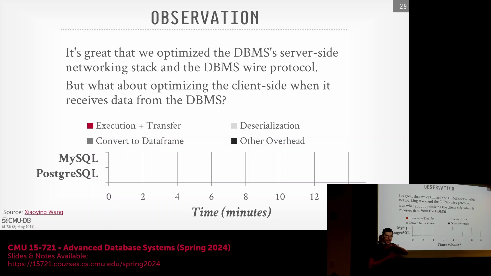
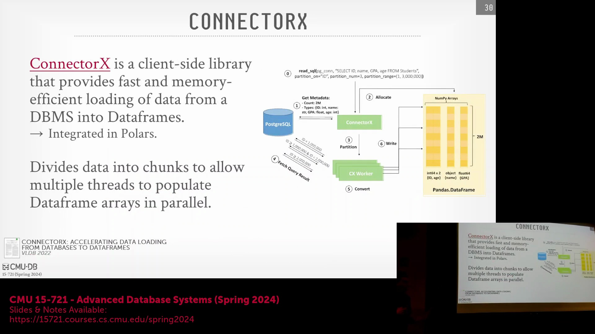
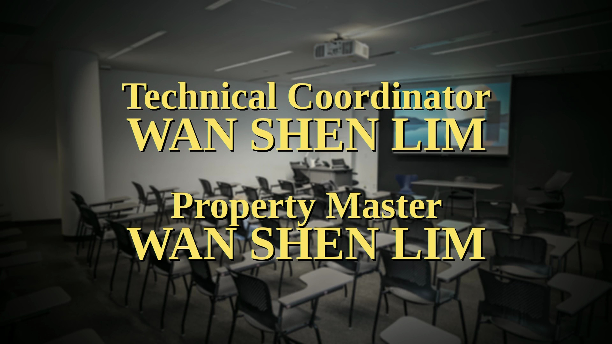
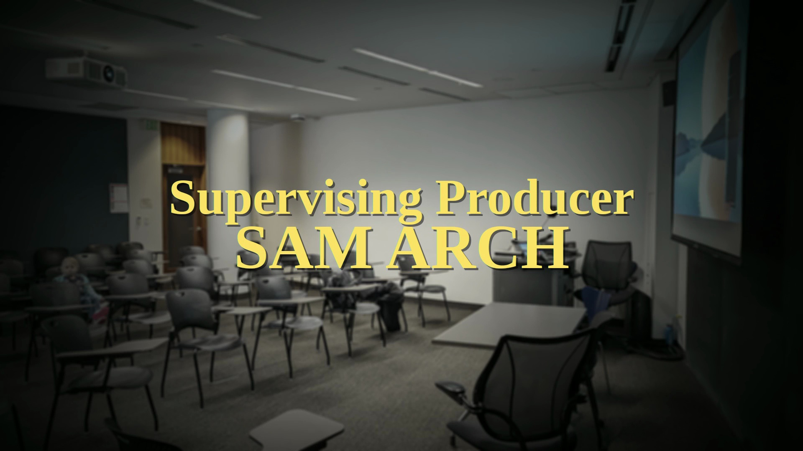

## DataFrame 转换瓶颈与 Arrow 解决方案

将 PostgreSQL 或 MySQL 等传统关系型数据库(Relational Database)的查询结果传输至 Python 分析环境中，会带来显著的隐性性能开销(hidden performance overhead)。尽管服务器端(server-side)的实际查询执行(query execution)相对较快，但反序列化(deserialization)线路格式(wire format)结果并将其逐行转换为 Python DataFrame 结构的开销占据了总延迟(total latency)的主要部分。这种数据转换开销(data conversion overhead)严重制约了数据科学工作流(data science workflow)的效率。Apache Arrow 与 Arrow 数据库连接(Arrow Database Connectivity, ADBC) 标准的集成直接攻克了这一瓶颈。通过使 Python 应用程序能够原生读取和操作 Arrow 格式的内存缓冲区(memory buffer)，ADBC 消除了昂贵的格式转换开销(format conversion overhead)，实现了从数据库客户端(database client)到 pandas 等分析框架(analytical framework)的零拷贝数据传输(zero-copy data transfer)。

## 利用 ConnectorX 实现并行数据获取

对于尚未支持 ADBC 的传统数据库系统(legacy database system)，ConnectorX 等高性能库(high-performance library)提供了一种高效的架构替代方案(architectural alternative)。ConnectorX 并未执行单一的整体查询(monolithic query)并串行填充(sequential population) DataFrame，而是采用了智能查询重写(query rewriting)与并行处理(parallel processing)技术。该库利用基于范围的条件(range-based conditions)（例如修改 `WHERE` 子句），自动将原始 SQL 语句拆解为多个子查询(subqueries)。这些拆分后的查询会被分发至多个线程中并发执行，每个线程负责独立获取对应的数据分片(data chunk)。随后，各线程独立地将获取的数据写入目标 DataFrame 的对应内存区块中。这种并行提取策略(parallel fetching strategy)显著提升了数据传输与内存分配的速度，即使在缺乏原生 Arrow 连接的情况下，也能带来可观的吞吐量(throughput)提升。

## 课程总结：协议、内核旁路与 eBPF

本模块的核心要点在于：线路协议设计(wire protocol design)与数据序列化格式(data serialization format)是决定数据库端到端性能(end-to-end performance)的关键因素。尽管高级内核旁路技术(kernel bypass technology)（如 DPDK）能带来显著的吞吐量提升，但其极高的实现复杂性(implementation complexity)、调试难度(debugging difficulty)与维护负担(maintenance burden)，往往使其难以在实际生产环境(production environment)中广泛部署。相比之下，扩展伯克利包过滤器(extended Berkeley Packet Filter, eBPF) 代表了一种更具可持续性且快速演进的技术范式(technological paradigm)。随着 eBPF 生态系统的不断成熟及其编程能力(programmability)的持续增强，它有望在未来十年内弥合用户空间应用(user-space applications)与操作系统内核(operating system kernel)之间的性能鸿沟(performance gap)。通过利用经过严格验证的沙盒化代码(sandboxed code)安全地扩展内核功能，eBPF 极有可能成为高性能内核级数据处理(kernel-level data processing)与网络优化(network optimization)的标准解决方案。

## 课程结语与后续安排

本系列关于数据库网络与协议的课程至此告一段落，并将过渡至下一个核心学术主题：查询优化(Query Optimization)。后续讲座将深入探讨基础优化技术，涵盖基于成本的执行计划生成(cost-based execution plan generation)与查询执行策略(query execution strategy)，这些内容对于理解现实世界中的数据库系统架构(database system architecture)至关重要。最新的阅读材料(reading materials)与论文作业(paper assignments)将于近期发布，以协助学生为这一知识模块的过渡做好充分准备。 

课程在开放式问答环节(open Q&A session)中圆满落幕，随后以轻松的告别辞正式宣告本模块的教学任务顺利完成。 

