## 课程介绍与开场致辞

欢迎来到卡内基梅隆大学高级数据库系统(Advanced Database Systems)课程。本讲座在演播室现场观众面前录制。今天这节课，我们将深入探讨网络协议(Networking Protocols)。

## 学期规划与核心教学目标

目前，课程进度已步入本学期的第二个三分之一阶段。本周及接下来的两周，我们将重点探讨查询优化(Query Optimization)。随后，我们将开始研读关于主流数据库系统的论文，以深入理解其工作原理，并观察我们在课程中讨论的核心概念是如何被这些系统的开发公司实际应用的。 

上节课我们重点讨论了如何将应用层编写的用户定义函数(User-Defined Function)直接嵌入数据库系统内部，并通过查询进行执行。借助内联技术(Inlining)，我们可以将用户定义函数的逻辑结构转换为 SQL 或关系代数(Relational Algebra)，并将其暴露给查询优化器(Query Optimizer)，以便推导出准确的执行逻辑。而今天的课程内容则正好相反：我们将探讨如何将数据从数据库系统中导出，并传输至应用程序端进行客户端处理。

## 访问 API、网络协议与现代数据工作负载
我们将首先剖析不同类型的数据库访问接口(Application Programming Interface)，随后深入探讨网络协议的底层细节。这与本次布置的阅读论文密切相关。该论文探讨了数据在网络传输过程中的实际比特流(Bitstream)形态，并分析了传统协议为何在现代应用场景（例如数据科学家使用 Pandas 或 Python Notebook）中效率低下。在此类场景中，开发者往往只需执行一条 `SELECT *` 语句，拉取海量数据集，随后在客户端完成所有后续处理。我们将揭示当今主流数据库系统为何普遍缺乏针对此类数据工作负载(Data Workload)进行优化的协议。事实证明，其解决方案正是 Apache Arrow 以及在该论文发表后逐步成型的数据库连接库规范。 

我们还将涵盖服务器端的优化技术，例如通过内核旁路(Kernel Bypass)或用户态旁路(User-Space Bypass)来加速网络栈(Network Stack)，以及将数据高效加载至 DataFrame 的客户端操作。尽管这些技术概念大多适用于分布式数据库(Distributed Database)中工作节点、优化器或调度器之间的后端通信，但本课程的核心关注点将始终聚焦于：如何高效地向外部客户端暴露数据。

## 数据序列化与底层连接层

上节课中，我演示了如何打开 PostgreSQL 终端、编写 SQL 查询，并将结果直接打印到屏幕上。这是一种最基础的访问方式，即通过网络传输供人类阅读的纯文本。然而，绝大多数应用程序需要以二进制格式接收数据，以便进行进一步的程序化处理。尽管部分遗留系统(Legacy Systems)仍向终端发送纯文本，但现代数据库系统已主要依赖于二进制数据序列化(Binary Data Serialization)技术。

开发者通常不会直接将应用数据对接至 `psql` 等命令行终端。相反，应用程序会根据其开发语言（如 C#、C++、Python 等）调用特定的连接库(Connection Library)。我们最关注的底层架构，是负责在网络上传输比特流的低级网络 API(Low-level Network API)。数据库厂商通常会提供专有的 C 语言库（例如 PostgreSQL 的 `libpq`）来底层处理连接建立、身份认证与查询执行。虽然开发者可以直接调用这些底层库编写原生 C 程序，但在实际开发中，大家通常更倾向于依赖更高层级的抽象接口。

## 向标准化与数据库无关 API 的演进

更高层级的抽象包括对象关系映射(Object-Relational Mapping)框架，例如 Django、Active Record（Ruby on Rails）或 Sequelize（Node.js）。这些框架在底层通常会调用低级的 C API。而真正的行业价值，则体现在如 JDBC(Java Database Connectivity) 或 Python DB-API 这样标准化且与数据库无关(Database-Agnostic)的 API 规范上。这些规范的核心目标是让开发者能够基于统一接口进行编程。理论上，若决定更换底层数据库系统，应用程序代码无需大幅修改，尽管不同数据库的 SQL 方言(SQL Dialect)差异可能仍需要少量适配。

回顾历史，在 20 世纪 80 年代末至 90 年代初之前，数据库连接完全依赖于厂商特定(Vendor-Specific)的 C 语言库，这导致应用程序的可移植性极差。早期的标准化尝试（如 Sybase 的 DB Library）旨在建立开放标准，但未能获得广泛普及。真正的行业突破出现在微软与 Simba Technologies 合作推出 ODBC(Open Database Connectivity) 之时。如今，几乎每款数据库系统都实现了对 ODBC 的支持，甚至包括 MongoDB 这类非关系型/NoSQL 系统。这是因为 ODBC 本质上仅负责传输命令字符串，并不限定具体的查询语言。

## ODBC 架构与驱动程序模型

ODBC 基于设备驱动程序模型(Device Driver Model)运行，其机制类似于操作系统中的硬件驱动程序。正如安装新显卡时需要厂商提供驱动以便操作系统与之通信一样，数据库厂商也会提供实现了该规范的 ODBC 驱动程序。当应用程序执行查询时，请求会先交由 ODBC 驱动程序处理，由其负责将请求转发至数据库服务器、接收返回结果，并将其编组(Marshaling)为符合 ODBC 规范的数据格式。

驱动程序还承担着关键的数据类型转换任务。例如，当客户端期望接收 32 位整数，而服务器返回的是 64 位整数时，驱动程序会自动完成位宽转换。此外，它还抽象了服务器的专有功能，负责映射与迭代结果集(Result Set)、执行参数绑定(Parameter Binding)，并抹平客户端与服务器运行环境之间的差异，从而为开发者提供一致且高度可移植的编程体验。

---

## ODBC 驱动模拟与网络协议焦点

ODBC 驱动程序能够模拟底层数据库可能原生不支持的功能，例如真正的服务器端游标(Server-Side Cursor)。若底层缺失某项功能，驱动程序可代为发送完整查询，将结果缓存至客户端，并向应用程序暴露标准的迭代游标接口。然而，本节课的重点将从驱动层的抽象转向网络协议(Wire Protocol)本身：即客户端应用程序与数据库服务器在请求与响应中传输的确切字节流。

## SQL 执行流程与 ODBC 标准化
使用 ODBC 时，开发者常有一个疑问：SQL 查询究竟在何处被解析与执行？ODBC 规范对客户端的 API 调用进行了标准化，涵盖了建立连接、准备语句(Prepared Statement)、执行查询、遍历结果集(Result Set)以及处理数据类型转换等环节。然而，SQL 查询字符串本身会原封不动地通过网络传输至服务器端。所有的语法解析(Parsing)、查询规划(Query Planning)与优化(Optimization)均在服务器端完成，通常由数据库厂商提供的底层 C API 处理。客户端 API 保持统一且与数据库无关(Database-Agnostic)，而服务器端则使用其原生的 SQL 方言(SQL Dialect)来解释并执行查询。

## JDBC 的兴起与跨平台连接

20 世纪 90 年代中期，Java 凭借其“一次编写，到处运行”(Write Once, Run Anywhere) 的 JVM(Java Virtual Machine) 架构，迅速成为主导级的企业编程语言。由于 ODBC 历史上具有 Windows 平台局限性，且与 C/C++ 紧密耦合，Sun Microsystems 开发了 JDBC(Java Database Connectivity)，旨在为 Java 生态提供标准化且与数据库无关(Database-Agnostic)的连接 API。JDBC 秉承了 ODBC 的核心理念：尽管底层 SQL 语法与服务器实现存在差异，它仍使开发者能够通过统一的 API 与各类数据库后端进行交互。

## JDBC 实现架构

为兼容现有的数据库生态系统，JDBC 规范最初定义了四种驱动实现类型(Driver Types)。类型 1 (Type 1) 充当 JDBC-ODBC 桥接器(JDBC-ODBC Bridge)，将 Java 调用封装为对原生 ODBC C 库的调用（目前基本已被弃用）。类型 2 (Type 2) 利用 JNI(Java Native Interface) 直接调用原生客户端 C API 进行网络通信。类型 3 (Type 3) 将 JDBC 调用路由至独立的中间件服务器(Middleware Server)，由该中间件负责与目标数据库通信。类型 4 (Type 4) 为纯 Java 实现(Pure Java Driver)，可直接与数据库厂商特定的网络协议进行通信。如今，类型 4 已成为主流数据库的行业标准，提供了最高效、可移植且最直接的连接路径。

## 网络协议：TCP/IP、Unix 套接字与 UDP

数据库系统主要依赖基于 TCP/IP 的专有网络协议进行客户端与服务器通信，这得益于 TCP/IP 内置的可靠性(Reliability)与确认机制(Acknowledgement)。虽然 Unix 域套接字(Unix Domain Socket) 可绕过完整的 TCP/IP 协议栈，从而在 Linux 系统上获得更优的本地进程间通信性能（PostgreSQL 支持该特性），但它并不适用于分布式或云原生架构。值得注意的是，由于 UDP(User Datagram Protocol) 缺乏可靠性保障，没有任何主流数据库会将其用于客户端与服务器的直接通信。然而，部分系统（如 Yellowbrick 或 PostgreSQL 内部的统计信息收集器）会在同一物理机的后端工作进程(Backend Worker Processes)之间使用 UDP 以最大化吞吐量(Throughput)，并通过实现自定义的重试逻辑(Retry Logic)来处理潜在的数据包丢失问题。

## 连接生命周期与结果序列化
标准的客户端-服务器(Client-Server)交互始于连接建立与身份验证握手(Authentication Handshake)，理想情况下应使用 SSL/TLS 进行加密，以防止网络数据包嗅探(Packet Sniffing)。身份验证成功后，客户端发送 SQL 查询，服务器端负责解析并执行该查询。随后，查询结果会被序列化为指定的网络传输格式，并通过网络返回给客户端。尽管部分传统系统支持基于游标的流式传输(Cursor-Based Streaming)以逐步返回结果，但许多现代云数据库倾向于等待查询完全执行完毕后，再将完整的数据集发送给客户端。这种传输策略高度依赖于查询执行计划(Execution Plan)；例如，包含 `LIMIT` 子句的 `ORDER BY` 操作必须先物化(Materialize)并全量排序所有数据行，随后才能安全地返回结果。

## 性能瓶颈与大型查询处理
在现代分析型工作负载(Analytical Workloads)中，实际的查询执行时间往往远小于将结果序列化并传输回客户端所需的网络开销。虽然 SQL 查询字符串通常体积很小，但在某些极端情况下也可能达到数 MB（例如 10 MB）。这种情况常见于数据仪表盘(Dashboard)应用，此类应用会根据用户的筛选条件动态生成包含海量值的 `IN` 子句。为高效处理此类请求，数据库引擎会避免低效的线性列表遍历，转而将庞大的 `IN` 子句物化为临时哈希表(Temporary Hash Table)。这在执行层面实质上将其转化为一次哈希连接(Hash Join)操作，从而优化内存使用、降低 CPU 开销并大幅提升数据查找效率。

---

## 采用现有网络传输协议还是自研新协议

在设计新型数据库系统时，数据库架构师(Database Architects)面临一个根本性的选择：是从零开始研发专有的网络传输协议(Proprietary Network Transport Protocol)，还是直接采用现有的成熟协议。构建自定义协议(Custom Protocol)意味着需要自行开发并维护所有配套的客户端连接库(Client Libraries)与驱动程序(Drivers)。然而，现代数据库行业的标准做法是复用现有的成熟协议，如 MySQL、PostgreSQL 或 Redis 协议。采用此策略可使新系统立即接入成熟且跨语言的驱动生态系统(Cross-language Driver Ecosystem)。尽管仅实现网络协议层是建立连接的最基本要求，但若要实现真正的生态兼容性，数据库还必须完整支持系统目录(System Catalog)与元数据(Metadata)查询。如今，PostgreSQL 协议兼容性尤为流行。许多现代数据库系统（如 Neon、Amazon Redshift）会直接复用 PostgreSQL 的网络层代码，同时完全替换其底层的存储引擎(Storage Engine)。Snowflake 是一个显著的例外，它在 2010 年代初便自主研发了私有协议与专属的 SQL 方言(SQL Dialect)。但为了快速融入现有工具链与生态系统，复用成熟协议如今已成为绝对的行业主流。

## 客户端与服务器的协调挑战
在现代数据库架构中，一个关键瓶颈往往源于服务器端优化与客户端驱动程序之间所需的繁重协调(Coordination)工作。正如 MonetDB Light 论文（DuckDB 的前身）所探讨的，将大型数据集高效导出至 Pandas 或 R 等数据分析工具(Data Analytics Tools)时，常会受到客户端驱动程序碎片化(Driver Fragmentation)的严重阻碍。若服务器端对传输数据进行了压缩或将其转换为列式格式(Columnar Format)，则每一种编程语言对应的客户端驱动程序都必须独立实现相应的解压缩与数据重建逻辑(Data Reconstruction Logic)。这不仅带来了巨大的工程开销，还极易导致不同语言驱动之间的功能支持出现不一致。在无服务器环境(Serverless Environment)（如 AWS Lambda）中，这一问题尤为突出：应用实例需快速启动、执行数据库查询、处理返回结果并迅速销毁。在此类场景下，高昂的客户端反序列化操作(Deserialization)会直接推高计算成本并增加端到端延迟，这凸显了建立标准化、零拷贝数据交换格式(Zero-Copy Data Exchange Format)的必要性。

## 面向行的 API 与列式存储

ODBC 与 JDBC 等传统连接标准本质上是面向行的 API(Row-Oriented API)，其设计可追溯至 20 世纪 90 年代初，主要面向以获取单条记录或实体为主的联机事务处理(OLTP)工作负载。因此，即便数据库内部采用了高度优化的列式存储格式(Columnar Storage Format)，在通过网络传输查询结果前，也必须先将结果物化(Materialize)并逐行重组为传统的行式结构(Row-Major Format)。这种设计虽契合传统应用程序顺序遍历结果集(Result Set)的模式，但对于需要处理数百万乃至数十亿行的分析型工作负载(Analytical Workloads)而言，却引入了巨大的 CPU 计算与内存开销。网络传输层由此成为性能瓶颈，迫使列式数据库执行代价高昂的行数据重建(Row Reconstruction)操作，这在一定程度上违背了其底层架构设计的初衷。

## 向量化批处理与 Arrow 解决方案

对于标准应用程序而言，直接传输原始的列式数据往往效率低下，因为在客户端重组单个元组(Tuple)需要复杂且极易出错的拼接逻辑。最优的解决方案是引入向量化与批处理的数据模型(Vectorized Batch Processing Data Model)。数据库不再逐行发送数据或传输庞大的原始列数据块，而是将数据切分为易于管理的“数据批次”(Data Batches)或向量(Vectors)。这不仅确保了相关元组的数据在内存中保持物理连续性(Physical Locality)，还完整保留了列式布局(Columnar Layout)在数据压缩与顺序扫描(Sequential Scan)方面的优势。这一理念在 Apache Arrow 生态中通过 Arrow 数据库连接规范(Arrow Database Connectivity, ADBC)得到了正式确立与标准化。ADBC 提供了一套语言无关的 API(Language-Agnostic API)，允许应用程序执行 SQL 查询，并直接以原生 Arrow 内存格式(Native Arrow Memory Format)接收结果数据。该机制彻底消除了中间数据拷贝、序列化(Serialization)与反序列化(Deserialization)环节，实现了数据库与客户端分析工具之间无缝、零开销(Zero-Overhead)的数据直传。

## 网络传输中的压缩权衡

在优化数据传输格式之后，下一个关键的设计决策便涉及网络传输压缩(Network Transmission Compression)。数据库架构师必须在通用压缩算法(General-Purpose Compression Algorithms)（如 gzip、Snappy 或 Zstandard）与轻量级的专用数据编码(Specialized Data Encoding)之间进行权衡与选择。通用压缩算法通常将数据视为不透明的数据块(Opaque Data Blobs)进行处理，尽管其绝对压缩率较高，但往往以增加 CPU 占用率与传输延迟为代价。相比之下，专用编码则深度契合数据的统计特性(Statistical Properties)进行优化（例如针对字符串的字典编码(Dictionary Encoding)、针对时间戳或数值的差分编码(Delta Encoding)）。尽管通用压缩算法更易于在所有客户端驱动程序中统一集成，但专用编码通过同步降低网络带宽(Network Bandwidth)占用与序列化/解压缩所需的 CPU 周期，为高吞吐量分析型工作负载(High-Throughput Analytical Workloads)提供了更为卓越的整体性能。

---

## 通用网络压缩

优化网络传输最直接的方法是在数据传输前，直接对网络协议数据包(Network Protocol Packets)应用 gzip、Snappy 或 Zstandard 等通用压缩算法(General-Purpose Compression Algorithms)。客户端在接收到数据后仅需执行解压(Decompression)操作。然而，主流数据库系统极少默认启用此功能。尽管 Oracle、MySQL 以及 BigQuery 等云平台（通常依赖 HTTP 应用层的 gzip 压缩）将其作为可选附加功能提供支持，但针对 PostgreSQL 底层协议的压缩开发进展缓慢，致使许多遗留系统(Legacy Systems)在网络协议层缺乏原生压缩(Native Compression)支持。

## 特定数据编码与客户端-服务器协商

作为通用压缩的替代方案，系统可直接对响应负载(Response Payload)应用数据感知型编码方案(Data-Aware Encoding Schemes)，例如字典编码(Dictionary Encoding)、游程编码(Run-Length Encoding, RLE)、差分编码(Delta Encoding)或基准编码(Frame-of-Reference Encoding)。尽管这些方案在理论上具备极高的效率，但在传统网络协议中却极少被原生实现。其核心瓶颈在于客户端驱动程序的碎片化(Driver Fragmentation)：每种编程语言对应的客户端驱动都需独立实现相应的解码器(Decoder)，这就要求在连接初始化阶段执行复杂的能力协商握手(Capability Negotiation Handshake)。此外，通用压缩与专用数据编码并非互斥(Mutually Exclusive)，二者完全可以叠加使用。当客户端与服务器间的网络链路(Network Link)成为性能瓶颈时，消耗 CPU 周期进行高强度压缩(High-Intensity Compression)是极具性价比的策略，尤其是在传输大型数据块(Data Blocks)且能获得显著压缩收益的场景下。

## 二进制序列化与库开销

在二进制数据传输(Binary Data Transmission)场景下，系统必须在自定义序列化格式(Custom Serialization Format)与采用成熟序列化库（如 Protocol Buffers、Apache Thrift 或 FlatBuffers）之间做出抉择。自定义格式虽能提供最大程度的控制权与最小的运行时开销，但通常缺乏内置的模式版本控制(Schema Versioning)机制。Protobuf 等序列化库能优雅地处理向后兼容性(Backward Compatibility)与 API 演进(API Evolution)，但往往会引入额外的元数据膨胀(Metadata Bloat)问题。Thrift 框架通常较为臃肿，常会强制引入线程池(Thread Pool)与缓冲区管理(Buffer Management)基础设施，而数据库系统通常更倾向于在引擎内部自主管理这些资源。相比之下，FlatBuffers 提供了一种更为轻量级的零拷贝(Zero-Copy)替代方案。在极少数边缘案例(Edge Cases)中（例如 ProtobufNDB 项目），数据库会在内存中以 Protobuf 格式直接存储数据，并通过网络原样传输，从而彻底消除序列化/反序列化(Serialization/Deserialization)成本。然而，这种做法通常被视为一种特定架构的优化特例，而非通用生产环境的标准实践。

## 基于文本编码的低效性

历史上，一种简单但极其低效的数据传输方式是采用基于文本的编码(Text-Based Encoding)，即在网络传输前将所有二进制数据类型强制转换为 ASCII 或 UTF-8 字符串。这种做法确实完全规避了跨平台字节序(Endianness)不匹配的问题，因为客户端仅需将人类可读的文本解析(Parsing)回其原生二进制格式即可。然而，文本编码会引入显著的数据歧义(Data Ambiguity)，尤其在处理空值(NULL Values)时。部分早期数据库系统（如 MonetDB）曾直接使用字面量字符串(Literal String) `"null"` 来表示数据库缺失值。若用户的实际业务数据中恰好包含单词 `"null"`，便会引发严重的解析冲突。

如今，文本编码已被业界广泛认定为现代分析型数据库(Analytical Databases)中糟糕的设计选择(Poor Design Choice)。将紧凑的 32 位或 64 位整数转换为变长字符串(Variable-Length String)会导致数据负载(Payload)体积急剧膨胀。例如，一个仅占 4 字节的整数转换为文本后可能变为 6 字节的字符串（若再计入长度前缀(Length Prefix)或空终止符(Null Terminator)），其实际存储空间占用将暴增 50% 甚至更多。

这种数据膨胀(Data Bloat)不仅会浪费宝贵的网络带宽(Network Bandwidth)，还会严重削弱下游压缩算法的效能。文本序列化(Text Serialization)破坏了原始数据固有的统计规律与分布特征，迫使系统传输冗长且压缩率极低的数据负载。因此，现代数据库系统严格倾向于采用紧凑的二进制格式(Compact Binary Format)，以此保留数据的原始内存布局(Memory Layout)，并最大化网络传输效率。

---

## 压缩效率与自定义序列化策略
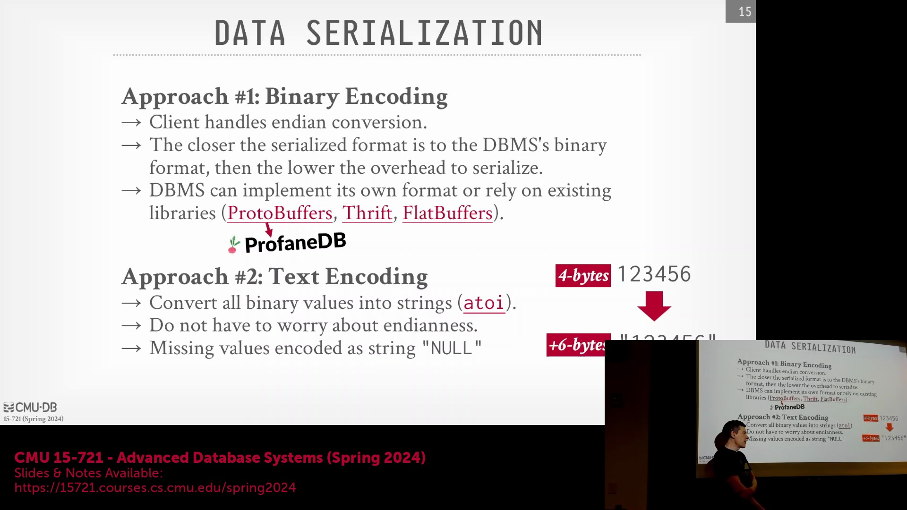
讨论首先评估了 gzip 压缩(gzip compression)在不同数据规模下的效果。压缩较大的有效载荷(payload)远比处理极短的字节序列(byte sequence)高效。尽管数据库对其内部数据结构的理解天然优于协议缓冲区(Protocol Buffers, Protobuf)等通用序列化库(general-purpose serialization library)，但基于此进行自定义序列化(custom serialization)会引入显著的服务器端计算开销(server-side computational overhead)。自行实现自定义二进制编码(custom binary encoding)虽可规避第三方库的抽象开销，但需手动管理空值掩码(null bitmask)、数据类型(data type)与消息大小(message size)，这在压缩收益与工程复杂度之间形成了明确的权衡(trade-off)。

## 字符串表示与填充技术

文中比较了多种字符串长度编码方法：C 风格空字符终止符(C-style null terminator)、显式长度前缀(explicit length prefix)以及固定长度填充(fixed-length padding)。固定长度填充（通常以零或空格填充）具备显著优势。首先，现代压缩算法如 gzip、Snappy 或 Zstandard 能够高效剔除重复的填充字符。其次，固定长度格式允许直接跳转至固定偏移量(offset)，无需解析长度前缀，从而支持快速的随机访问(random access)与向量化批处理(vectorized batch processing)。然而，为短字符串分配过大的可变字符类型(VARCHAR)列（例如 VARCHAR(1024)）会浪费大量存储空间。这凸显了实际数据库中一种常见的反模式(anti-pattern)，会同时损害系统性能与压缩率。

## 线路协议压缩与系统设计约束
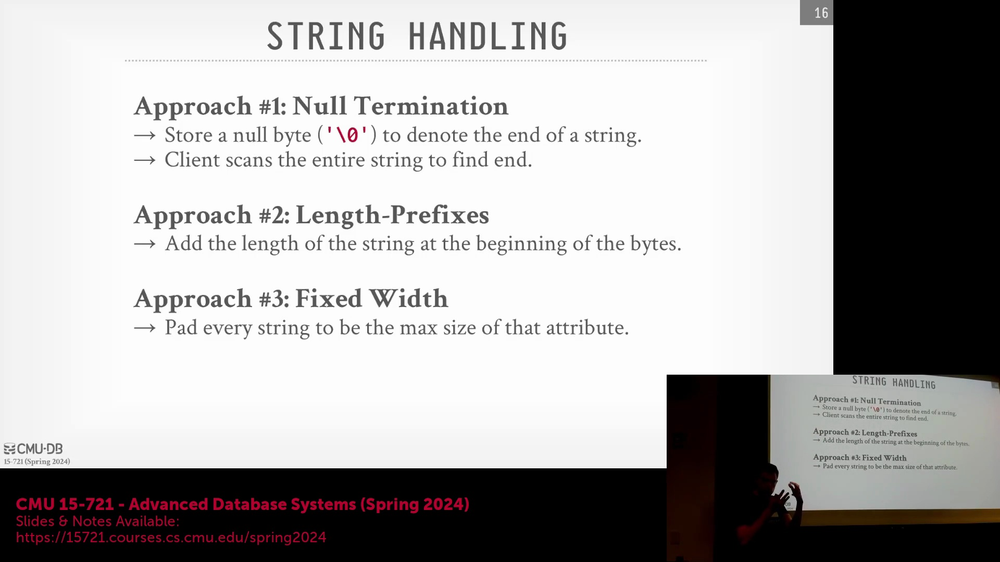
尽管 C 风格字符串便于复用标准库函数，但在线路协议(wire protocol)中传输时通常需附加长度前缀，从而增加了序列化开销(serialization overhead)。各数据库系统在线路级压缩(wire-level compression)的原生支持(native support)方面差异显著：MySQL 与 Oracle 内置了压缩标志(compression flag)，而截至 2024 年，PostgreSQL 仍缺乏对线路协议压缩的原生支持，有时只能依赖 SSH 隧道(SSH tunnel)等外部替代方案。尽管动态调整可能带来性能优势，但数据库引擎通常避免根据查询模式(query pattern)或数据分布(data distribution)动态切换字符串表示形式。在服务器端与客户端支持此类动态优化所需的工程开销通常被视为得不偿失，因此各系统的编码与压缩策略通常采用静态固定(static configuration)的配置。

## 单条元组传输开销与基准测试
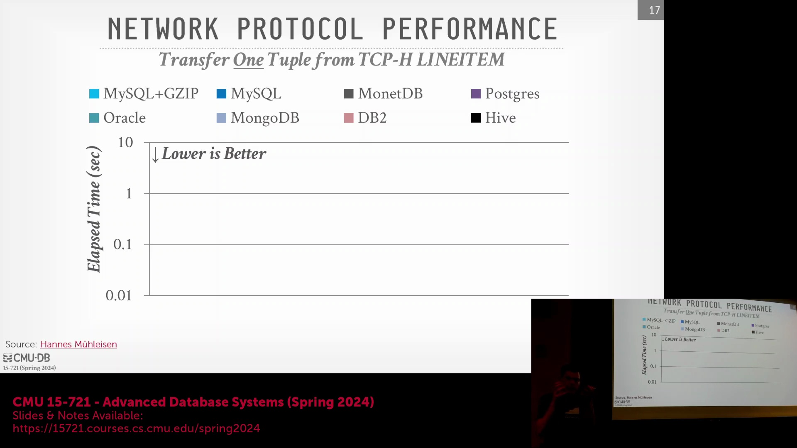
性能评估随后转向测量从数据库向客户端传输单条元组(tuple)的端到端延迟(end-to-end latency)。参与对比的大多数系统采用 ODBC 驱动(ODBC driver)，而 Hive 则使用 JDBC(Java Database Connectivity)。基准测试(benchmarking)表明，尽管 MonetDB 采用了基于文本的编码(text-based encoding)（即将内部二进制数据转换为字符串形式传输），其性能表现却出人意料地优异。这与部分采用优化二进制编码却暴露出更高底层开销(underlying overhead)的系统形成鲜明对比，进而促使研究者深入排查底层协议设计中的低效环节。

## Hive、DB2 与 Oracle 的协议低效问题
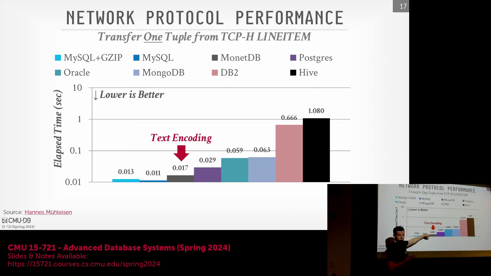
延迟差异(latency discrepancy)主要归因于协议层面的设计取舍。Hive 性能垫底，主要因其依赖 Apache Thrift，该框架在缓冲区(buffer)的序列化与反序列化过程中引入了多次内存拷贝(memory copy)，且为构建消息结构传输了大量冗余元数据(metadata)。 

DB2 与 Oracle 位列倒数第二，主因在于它们在 TCP/IP 之上重新实现了应用层的确认机制(application-layer acknowledgment mechanism)。由于 TCP 协议本身已处理数据包确认(packet acknowledgment)与流量控制(flow control)，此冗余层致使通信协议变得极为“冗杂”，显著拉高了往返延迟(round-trip latency)。 
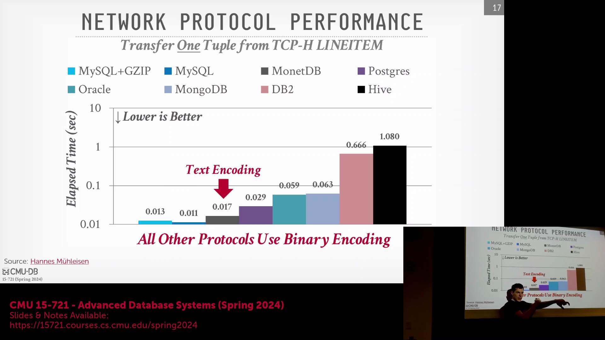
进一步说明指出，此处测量的时间代表的是端到端延迟(end-to-end latency)，而非单纯的网络传输时间(network transmission time)。以 Hive 为例，记录的时间涵盖了完整处理链路：将 SQL 查询转换为 MapReduce 作业(MapReduce job)、在集群中分发执行并检索结果。需注意的是，上述所有操作均在客户端与服务器部署于同一台物理机的条件下完成。

---

## 明确基准测试范围与 Hive 的历史遗留问题

讨论首先明确指出，性能指标(benchmarking metrics)严格聚焦于进出数据库的原始数据传输(raw data transmission)，而非完整的查询执行(query execution)或结果缓存(result caching)。Hive 表现显著不佳的原因需置于历史背景中理解：在 2000 年代末 Hadoop 和 MapReduce 获得业界关注时，Hive 作为过渡性方案(transitional solution)应运而生。尽管关系型数据库专家(Relational Database Experts)认为它只是重新发明了 20 世纪 90 年代的并行与分布式数据库(Parallel and Distributed Databases)概念，但 Hive 的创立初衷是为了将 SQL 转换为冗长的 Java MapReduce 作业(MapReduce Jobs)。这虽然缓解了手动编码(manual coding)的繁琐，但也引入了显著的协议与执行开销(protocol and execution overhead)，这也解释了为何现代系统已逐渐将其取代。

## 网络延迟与压缩的权衡

一项新的基准测试(benchmark)在传输 TPC-H 数据集(TPC-H dataset)的一百万个元组(tuples)时，逐步增加网络延迟(network latency)。对比启用与禁用 GZIP 压缩(GZIP compression)的 MySQL，揭示了清晰的性能权衡(performance trade-off)：在高速网络环境下，压缩会带来不必要的 CPU 开销(CPU overhead)；尽管传输的字节量更大，但禁用压缩的传输反而更快。然而，当网络延迟增至约 100 毫秒时，与传输延迟(transmission latency)相比，压缩所需的 CPU 成本(CPU cost)变得微不足道，此时传输压缩数据反而略快。将其他数据库系统纳入对比图表后，它们普遍遵循这一预期曲线，充分表明实际网络条件决定了最优的序列化与压缩策略(serialization and compression strategies)。

## 企业级数据库中的协议设计缺陷
在延迟扩展测试(latency scaling test)中，Oracle 与 DB2 表现出异常的性能模式(performance patterns)。Oracle 在高速网络上表现颇具竞争力，但随着延迟增加，性能下滑至倒数第二；而 DB2 在所有测试场景下均垫底，即便在低速网络中也落后于 Hive。推测其原因在于，这两款专有数据库系统(proprietary database systems)均在 TCP/IP 协议之上实现了冗余的应用层确认机制(application-layer acknowledgment mechanism)。由于 TCP 协议本身已负责数据包确认(packet acknowledgment)与流量控制(flow control)，这种额外的“频繁交互”(chatty)协议层引发了不必要的往返通信(round-trip communication)。随着网络延迟的增加，这些冗余确认逐渐成为主导开销(dominant overhead)，凸显了陈旧协议设计(legacy protocol design)所带来的性能惩罚(performance penalty)。

## 基于 Apache Arrow 和 RDMA 的零拷贝优化

针对 Peloton/NoisePage 系统的研究探索了如何最大化大规模数据传输（7GB TPC-C lineitem 表数据）的吞吐量(throughput)。该对比评估了四种传输方案：默认的 PostgreSQL 基于行的协议(row-based protocol)、采用 PAX 格式(Partition Attributes Across)的向量化 PostgreSQL、原生 Apache Arrow（通过早期的 ADBC(Arrow Database Connectivity)前身实现）以及 RDMA(Remote Direct Memory Access)。结果表明，得益于零拷贝语义(zero-copy semantics)，无需进行格式转换即可将 Apache Arrow 数据批处理块(Arrow data batches)直接原生推送至客户端的方案性能最为优异。RDMA 技术通过完全绕过操作系统内核(bypass the OS kernel)，实现内存数据从服务器直接传输至网卡(Network Interface Card, NIC)，进一步突破了性能瓶颈。核心结论表明：在系统内部采用 Arrow 等列式(columnar format)与向量化格式(vectorized format)进行数据存储与传输，能够彻底消除昂贵的序列化与格式转换开销(serialization and conversion overhead)。

## 绕过操作系统与 TCP/IP 协议栈的开销

除线路协议(wire protocol)与序列化(serialization)之外，操作系统的 TCP/IP 协议栈(TCP/IP protocol stack)已成为主要的性能瓶颈。传统网络架构依赖于中断驱动模型(interrupt-driven model)，该模型会触发高昂的上下文切换(context switch)，涉及内核线程调度(kernel thread scheduling)，并常伴随内部闩锁(latch)竞争。此外，抵达网卡的数据必须先拷贝至内核缓冲区(kernel buffer)，随后再次拷贝至用户空间内存(user-space memory)，致使数据移动的开销成倍增加。为实现极致的数据库网络性能，现代系统架构正日益倾向于完全绕过操作系统的网络协议栈。借助内核旁路(kernel bypass)与直接内存访问等技术最大限度地削减上下文切换与内存拷贝操作，数据库系统得以显著降低传输延迟(transmission latency)并大幅提升整体吞吐量。

---

## 避开操作系统与内核旁路的必要性

尽管操作系统(Operating System)在内存分配(Memory Allocation)和进程调度(Process Scheduling)等基础任务中不可或缺，但高性能数据库系统在数据传输操作（尤其是网络与磁盘 I/O(I/O)）中会极力减少操作系统的介入。传统 Linux 架构作为分时系统(Time-sharing System)，高度依赖高昂的硬件中断(Hardware Interrupt)、上下文切换(Context Switch)和内核线程调度(Kernel Thread Scheduling)。这些机制会引入显著的开销与内部闩锁竞争(Internal Latch Contention)，随着核心数量的增加，不可避免地会成为性能瓶颈。为了规避这些低效问题，现代数据库采用内核旁路(Kernel Bypass)技术。其主要目标是将数据直接从网卡(Network Interface Card, NIC)等硬件组件传输至用户空间内存(User-space Memory)。该方法完全绕过了操作系统的 TCP/IP 协议栈(TCP/IP Protocol Stack)，消除了内核缓冲区(Kernel Buffer)与用户空间缓冲区(User-space Buffer)之间的冗余数据拷贝，并免除了对传统阻塞式系统调用(Blocking System Call)的依赖。

## DPDK/SPDK：用户空间直接与硬件交互
英特尔开发的 Data Plane Development Kit (DPDK) 及其面向存储的对应版本 Storage Performance Development Kit (SPDK)，提供了用户空间库(User-space Library)，使应用程序能够直接与底层硬件设备进行底层交互。通过将网卡和存储控制器(Storage Controller)视为原始的内存映射设备(Memory-mapped Device)，这些框架从根本上打破了传统 Unix 系统“一切皆文件”(Everything is a File)的抽象概念。然而，这种架构转变将管理网络协议的责任直接转移给了数据库引擎。在操作系统不再处理 TCP/IP 协议栈的情况下，应用程序必须手动实现网络逻辑，或集成 F-stack 等用户空间库来管理序列号(Sequence Number)、MAC 地址(MAC Address)和确认机制(Acknowledgment Mechanism)。尽管这保证了零拷贝数据传输(Zero-copy Data Transmission)并消除了系统调用开销(System Call Overhead)，但工程复杂度极高。 

著名的实现案例包括 ScyllaDB（基于 Seastar 框架构建）和 Yellowbrick。然而，维护自定义的用户空间网络栈已被证明极其困难。ScyllaDB 工程师曾公开表示，DPDK 的集成是一场“维护噩梦”，导致团队通常默认禁用该功能。这一经历凸显了系统工程中的一个常见议题(Recurring Theme)：虽然内核旁路承诺了理论上的极致性能，但现实世界中的维护负担和调试复杂性往往超过了边际吞吐量(Marginal Throughput)提升所带来的收益。

## RDMA：远程直接内存访问
远程直接内存访问(Remote Direct Memory Access, RDMA)提供了一种差异化的内核旁路策略，它允许应用程序像访问本地存储一样直接读写远程服务器的内存，其架构理念与 NVMe(Non-Volatile Memory Express) 存储高度相似。该方法需要严格的初始握手过程来注册内存区域(Memory Region Registration)、建立跨节点访问权限并验证地址稳定性，这带来了较高的前期配置复杂度。因此，RDMA 通常仅限于在严格控制的隔离环境中用于后端节点间通信(Backend Node-to-Node Communication)，而非面向公众的客户端连接。其安全性通过严格的网络隔离（如私有虚拟私有云(Virtual Private Cloud, VPC)或本地物理隔离机房部署）来保障。RDMA 历史上与 Mellanox 的专有 InfiniBand 硬件紧密绑定，如今正通过融合以太网上的远程直接内存访问(RDMA over Converged Ethernet, RoCE)在标准以太网和主流云平台上日益普及。Oracle Exadata 仍是企业级领域的重要采用者，在其集成一体机架构中利用 RDMA 实现了计算节点与存储机架之间超低延迟、高带宽的通信。

## io_uring：Linux 中的现代异步 I/O
一个更为务实且日益普及的替代方案是 `io_uring`，这是 Linux 内核的一项扩展，旨在现代化传统的异步输入/输出(Asynchronous I/O) API。`io_uring` 并非完全绕过内核，而是利用用户空间与内核空间之间共享的环形提交队列(Ring-based Submission Queue)与完成队列(Completion Queue)。应用程序将 I/O 请求提交至队列中，无需发起传统的阻塞式系统调用。操作系统随后使用专用内核线程异步处理这些请求，并将结果写入完成队列，应用程序可通过轮询(Polling)、事件驱动回调(Event-driven Callback)或轻量级锁机制(Lightweight Locking Mechanism)来获取结果。这种架构大幅降低了系统调用开销和上下文切换开销(Context Switch Overhead)，同时保留了操作系统强大的硬件管理、驱动兼容性(Driver Compatibility)和安全层。 

尽管在数据库网络领域仍属较新技术，但 QuestDB 等系统已成功将 `io_uring` 集成到存储和网络操作中，显著提升了吞吐量(Throughput)。该方案在原始性能与工程可维护性(Engineering Maintainability)之间取得了有效平衡，既避免了完全内核旁路带来的极高复杂度与系统脆弱性，又提供了能够与现代多核架构(Multi-core Architecture)良好扩展的显著 I/O 效率提升。

---

## 现代系统中 `io_uring` 的应用
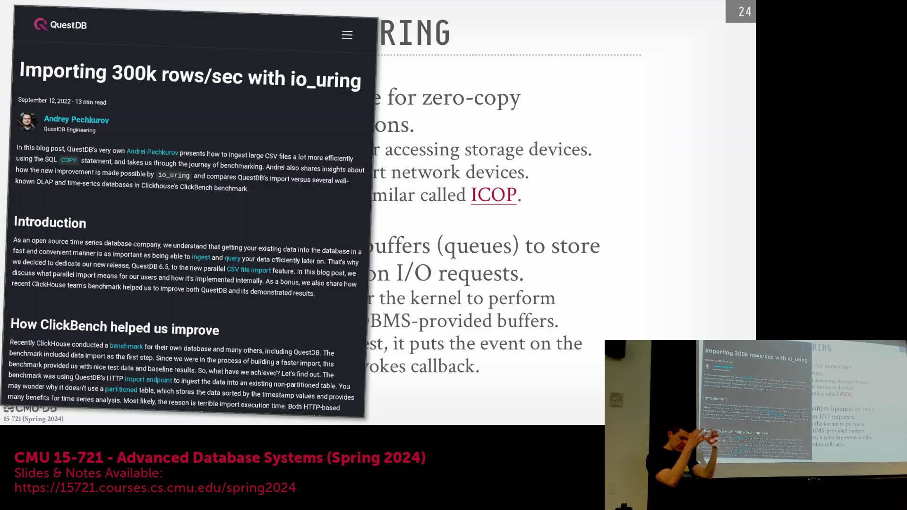
`io_uring` 的集成凸显了现代数据库工程中多样化的架构与语言策略。QuestDB 等系统利用 Java 本地接口(Java Native Interface, JNI) 桥接，将高层应用逻辑(high-level application logic)与底层性能优化(low-level performance optimization)相结合；而完全使用 Zig 语言编写的 TigerBeetle 则借助 `io_uring` 实现高吞吐量(high throughput)的事务处理。Zig 卓越的单指令多数据流(Single Instruction, Multiple Data, SIMD)支持也推动了 FastLanes 等项目的采用，这展示了语言级硬件抽象(language-level hardware abstraction)如何与异步 I/O 框架(Asynchronous I/O Framework)相结合以最大化系统吞吐量。
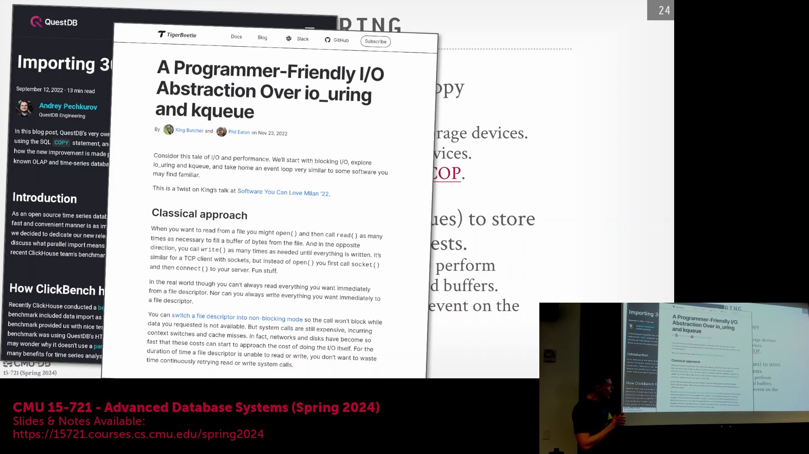

## ClickHouse 的 `io_uring` 之旅：理想与现实
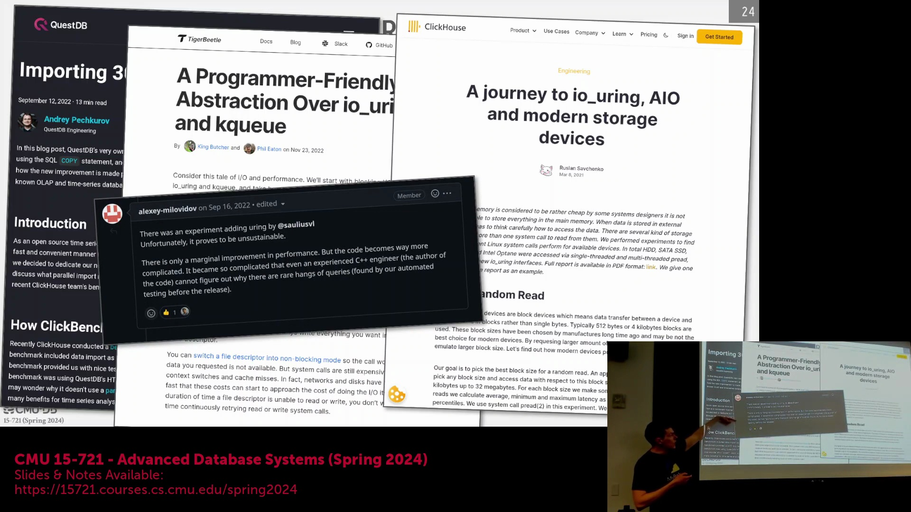
ClickHouse 的 `io_uring` 实现历程揭示了采用该技术所面临的实际挑战。2021 年的一篇博客文章最初对其潜力大加赞赏，但随后的代码合并请求(Pull Request, PR)却引发了团队内部的质疑。首席技术官(Chief Technology Officer, CTO)指出其性能提升(performance improvement)微乎其微，并警告额外的复杂性会引入罕见且难以调试的查询阻塞(Query Hanging)问题。至 2023 年 2 月，该代码正式合并并被作为 I/O 优化方案(I/O Optimization)公开推广。然而，同一 PR 中后续的开发者评论透露，团队未能找到任何能证明其优于传统同步 I/O(Synchronous I/O)的具体工作负载(Specific Workload)，这显著降低了最初的技术热情。
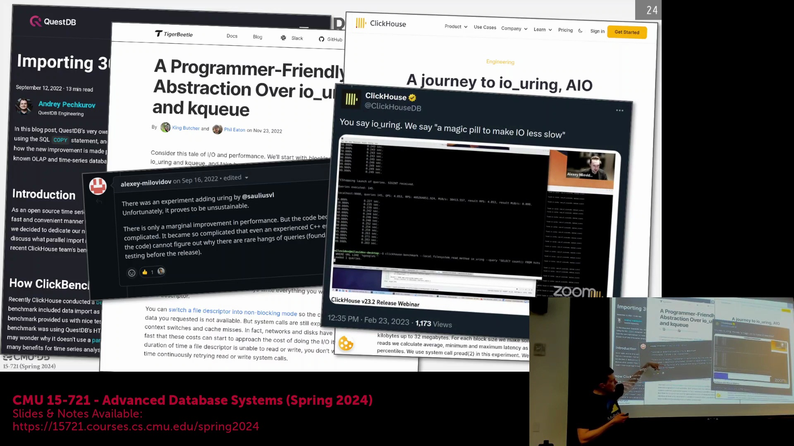
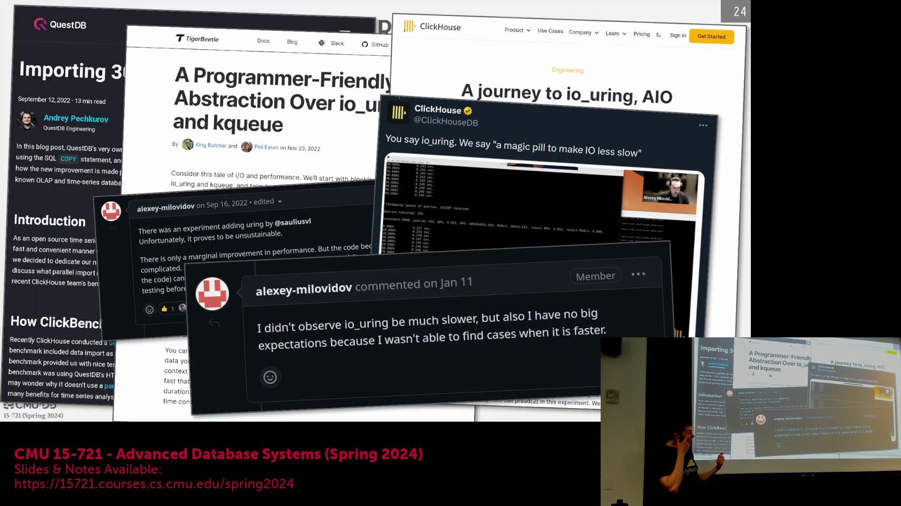

## 架构约束与同步执行模型
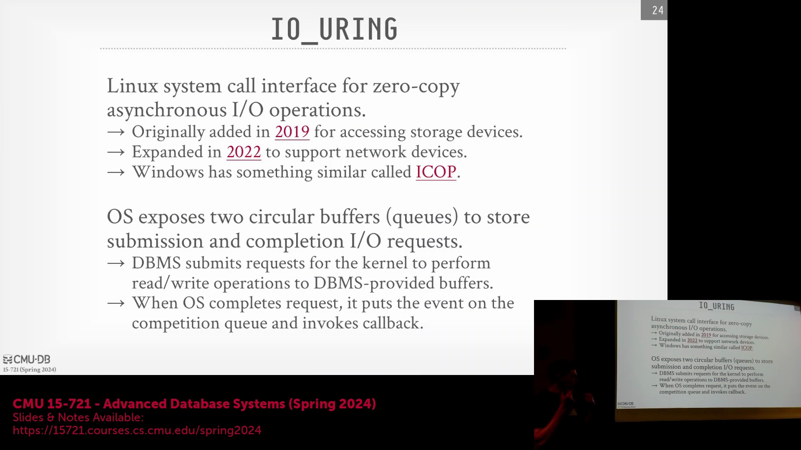
`io_uring` 效果参差不齐的根源在于底层架构的不匹配。传统数据库引擎主要采用同步阻塞模型(Synchronous Blocking Model)；在此类模型中直接注入异步 I/O(Asynchronous I/O)收益甚微，除非系统能够显式批处理请求(Explicit Request Batching)并在后台处理就绪数据。相比之下，QuestDB 等系统由高频交易(High-Frequency Trading, HFT)领域的专家构建，他们通过激进的内存映射(Memory Mapping)、扁平化对象层次结构(Flat Object Hierarchy)以及自定义的汇编级协程操作(Assembly-level Coroutine Manipulation)对 Java 进行了深度优化。这种深度的架构契合使其能够充分挖掘异步原语(Asynchronous Primitives)的性能潜力，而将异步机制改造并集成至传统同步引擎(Synchronous Engine)中依然极具挑战。
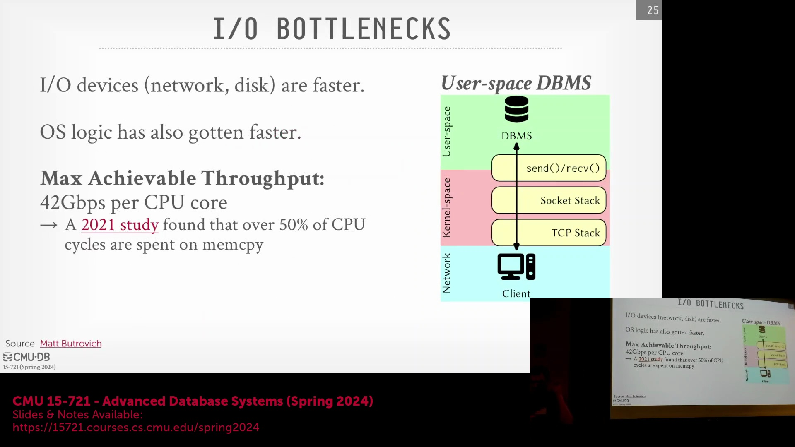

## 范式转变：从内核旁路到内核扩展
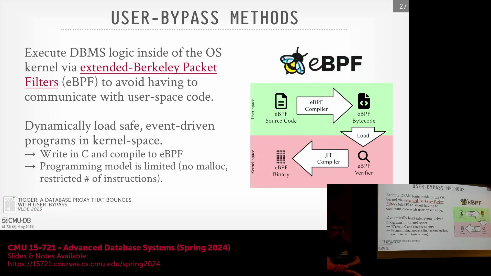
与其完全绕过操作系统，一种新兴策略是将数据库逻辑直接嵌入内核，以消除冗余的用户空间数据拷贝(User-space Data Copy)。传统的内核模块(Kernel Module)历史上虽能实现此功能，但以代码臃肿、易引发系统崩溃且常受安全策略限制而闻名。扩展伯克利包过滤器(extended Berkeley Packet Filter, eBPF)的出现彻底改变了这一范式，它提供了一个安全的沙盒环境(Sandbox Environment)，用于将经过验证的代码动态加载至内核中。与传统内核模块不同，eBPF 程序需经过严格的静态验证(Static Verification)，该机制会强制执行有限的执行路径、禁止无限循环并限制不安全的内存操作，从而在不危及系统稳定性(System Stability)的前提下，实现高性能的内核级处理(Kernel-level Processing)。

## eBPF 实践：高性能数据库代理
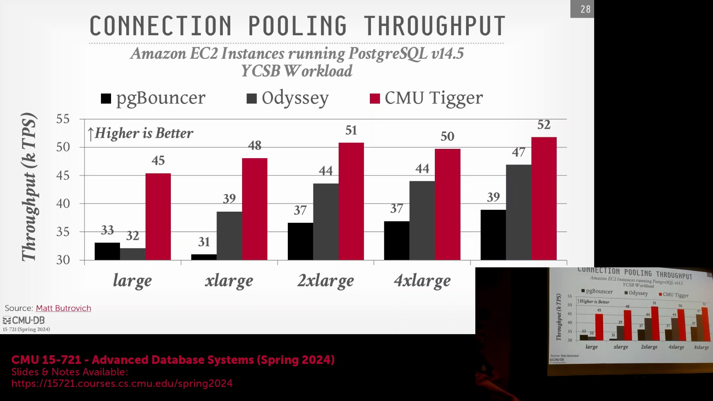
近期研究通过重构数据库线路协议代理(Wire Protocol Proxy)，验证了 eBPF 的实际效用。传统代理（如 PG Bouncer）或高度优化的替代方案（如 Odyssey）完全依赖用户空间处理(User-space Processing)，通常需要复杂的协程调度机制以管理线程上下文切换(Thread Context Switching)。基于 eBPF 的架构将数据包转发(Packet Forwarding)完全卸载至内核空间，同时在用户空间保留身份认证与 SSL 握手逻辑(SSL Handshake Logic)。基准测试(Benchmarking)表明，在资源受限环境(Resource-constrained Environment)中，该设计通过消除内核与用户空间之间昂贵的缓冲区拷贝(Buffer Copy)，显著提升了系统吞吐量。尽管 eBPF 并非万能解决方案，但对于特定的网络工作负载(Network Workload)而言，它提供了一种相较于数据平面开发套件(Data Plane Development Kit, DPDK) 或 `io_uring` 等复杂内核旁路技术(Kernel Bypass Technology)更易于维护且更安全的替代方案。

## 客户端数据处理与应用层开销
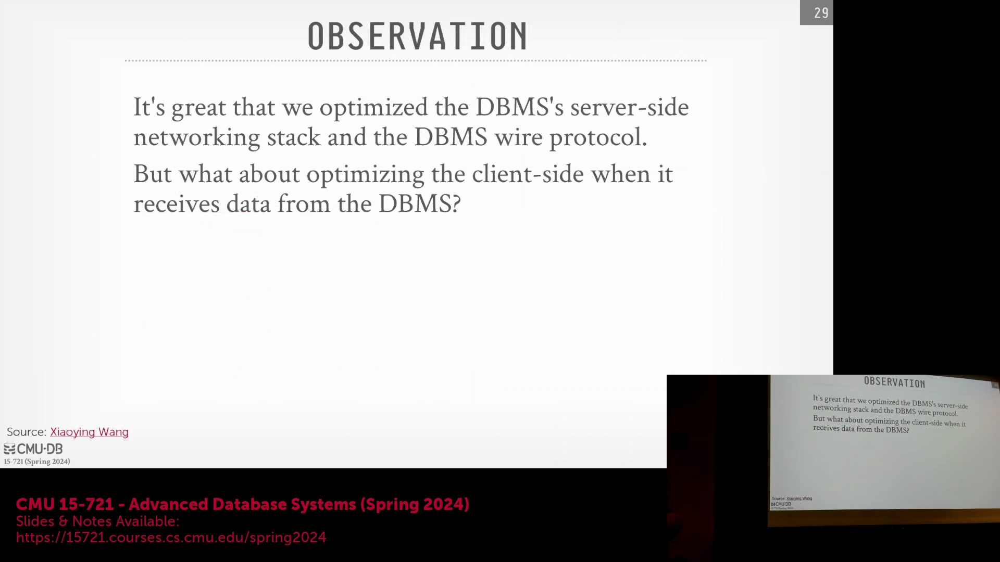
优化服务器端的网络传输仅解决了数据传输链路的一半；客户端应用程序(Client-side Application)还必须高效地解析与转换接收到的有效载荷(Payload)。当将线路格式(Wire Format)的行数据反序列化(Deserialization)为应用程序特定对象时，Java 数据库连接(Java Database Connectivity, JDBC) 或开放数据库连接(Open Database Connectivity, ODBC) 等标准数据库连接器(Database Connector)会引入大量开销。在数据科学工作流(Data Science Workflow)中，这一瓶颈尤为突出：将查询结果传输至 pandas 等数据分析库(Data Analysis Library)需要昂贵的格式转换与 DataFrame 内存分配(DataFrame Memory Allocation)。最大限度地降低客户端序列化开销(Client-side Serialization Overhead)对于实现真正的端到端性能(End-to-End Performance)至关重要。这也凸显了业界对零拷贝数据传输格式(Zero-copy Data Transfer Format)日益增长的需求，此类格式能够无缝桥接数据库引擎与现代数据分析框架。

---

## DataFrame 转换瓶颈与 Arrow 解决方案

将 PostgreSQL 或 MySQL 等传统关系型数据库(Relational Database)的查询结果传输至 Python 分析环境中，会带来显著的隐性性能开销(hidden performance overhead)。尽管服务器端(server-side)的实际查询执行(query execution)相对较快，但反序列化(deserialization)线路格式(wire format)结果并将其逐行转换为 Python DataFrame 结构的开销占据了总延迟(total latency)的主要部分。这种数据转换开销(data conversion overhead)严重制约了数据科学工作流(data science workflow)的效率。Apache Arrow 与 Arrow 数据库连接(Arrow Database Connectivity, ADBC) 标准的集成直接攻克了这一瓶颈。通过使 Python 应用程序能够原生读取和操作 Arrow 格式的内存缓冲区(memory buffer)，ADBC 消除了昂贵的格式转换开销(format conversion overhead)，实现了从数据库客户端(database client)到 pandas 等分析框架(analytical framework)的零拷贝数据传输(zero-copy data transfer)。

## 利用 ConnectorX 实现并行数据获取

对于尚未支持 ADBC 的传统数据库系统(legacy database system)，ConnectorX 等高性能库(high-performance library)提供了一种高效的架构替代方案(architectural alternative)。ConnectorX 并未执行单一的整体查询(monolithic query)并串行填充(sequential population) DataFrame，而是采用了智能查询重写(query rewriting)与并行处理(parallel processing)技术。该库利用基于范围的条件(range-based conditions)（例如修改 `WHERE` 子句），自动将原始 SQL 语句拆解为多个子查询(subqueries)。这些拆分后的查询会被分发至多个线程中并发执行，每个线程负责独立获取对应的数据分片(data chunk)。随后，各线程独立地将获取的数据写入目标 DataFrame 的对应内存区块中。这种并行提取策略(parallel fetching strategy)显著提升了数据传输与内存分配的速度，即使在缺乏原生 Arrow 连接的情况下，也能带来可观的吞吐量(throughput)提升。

## 课程总结：协议、内核旁路与 eBPF

本模块的核心要点在于：线路协议设计(wire protocol design)与数据序列化格式(data serialization format)是决定数据库端到端性能(end-to-end performance)的关键因素。尽管高级内核旁路技术(kernel bypass technology)（如 DPDK）能带来显著的吞吐量提升，但其极高的实现复杂性(implementation complexity)、调试难度(debugging difficulty)与维护负担(maintenance burden)，往往使其难以在实际生产环境(production environment)中广泛部署。相比之下，扩展伯克利包过滤器(extended Berkeley Packet Filter, eBPF) 代表了一种更具可持续性且快速演进的技术范式(technological paradigm)。随着 eBPF 生态系统的不断成熟及其编程能力(programmability)的持续增强，它有望在未来十年内弥合用户空间应用(user-space applications)与操作系统内核(operating system kernel)之间的性能鸿沟(performance gap)。通过利用经过严格验证的沙盒化代码(sandboxed code)安全地扩展内核功能，eBPF 极有可能成为高性能内核级数据处理(kernel-level data processing)与网络优化(network optimization)的标准解决方案。

## 课程结语与后续安排

本系列关于数据库网络与协议的课程至此告一段落，并将过渡至下一个核心学术主题：查询优化(Query Optimization)。后续讲座将深入探讨基础优化技术，涵盖基于成本的执行计划生成(cost-based execution plan generation)与查询执行策略(query execution strategy)，这些内容对于理解现实世界中的数据库系统架构(database system architecture)至关重要。最新的阅读材料(reading materials)与论文作业(paper assignments)将于近期发布，以协助学生为这一知识模块的过渡做好充分准备。 

课程在开放式问答环节(open Q&A session)中圆满落幕，随后以轻松的告别辞正式宣告本模块的教学任务顺利完成。 

