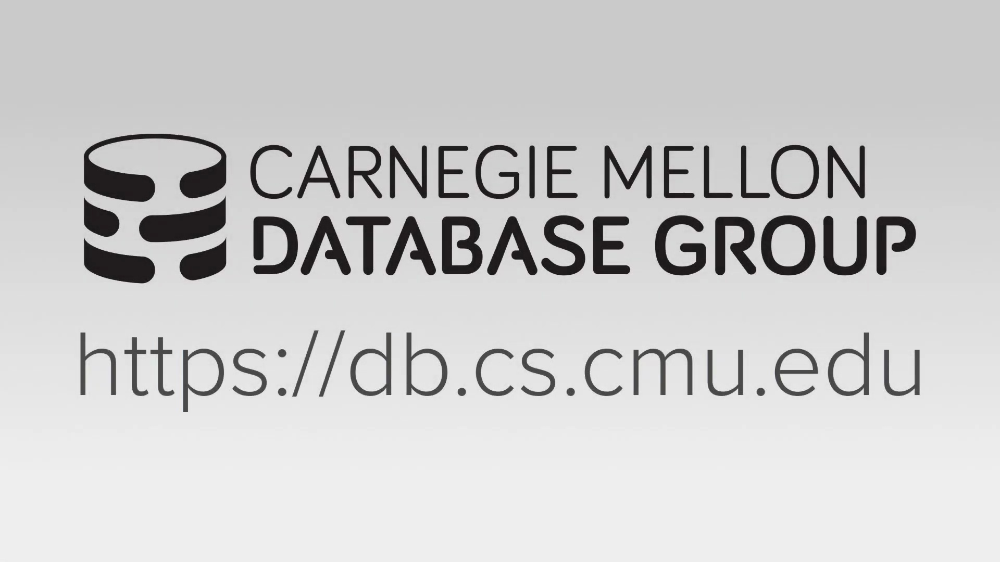
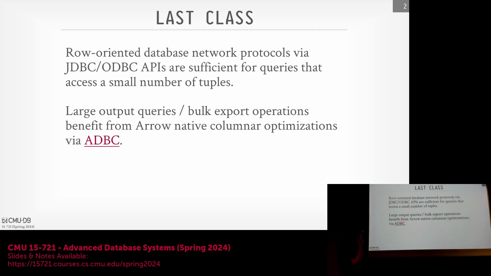
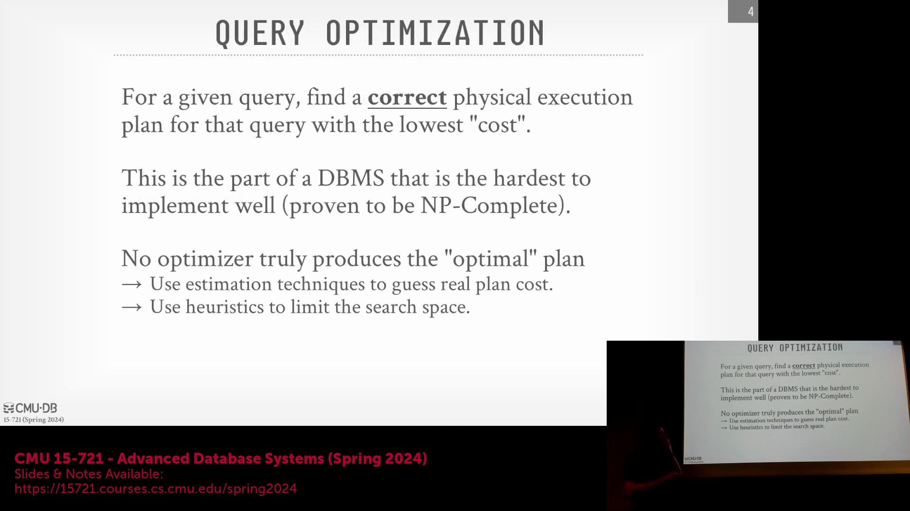

## 查询优化器简介
欢迎来到卡内基梅隆大学高级数据库系统(Advanced Database Systems)课程。本次讲座将深入探讨数据库管理系统(Database Management System, DBMS)中最核心、最复杂的组件之一：查询优化器(Query Optimizer)。构建高速执行引擎(Execution Engine)固然重要，但如果底层的查询计划(Query Plan)效率低下，系统的整体性能将大打折扣。优化器的作用举足轻重，其复杂程度甚至足以支撑一门独立的课程。尽管颇具挑战，但掌握如何构建稳健的查询计划是必不可少的，因为再强大的硬件也无法弥补拙劣的执行策略(Execution Strategy)所带来的性能瓶颈。

## 网络协议与数据组织形式回顾
在深入探讨优化算法之前，有必要先回顾网络协议(Wire Protocol)，它们在数据传输层面的概念与磁盘存储的数据组织方式高度对应。协议的选择很大程度上取决于查询的数据访问模式(Data Access Pattern)。对于仅需获取少量元组(Tuple)的在线事务处理(Online Transaction Processing, OLTP)类查询，使用开放数据库连接(Open Database Connectivity, ODBC)或Java数据库连接(Java Database Connectivity, JDBC)等面向行(Row-oriented)的应用程序接口(API)或协议完全足够。然而，对于需要检索海量数据集的分析型负载或批量数据导出任务，列式(Column-oriented)数据交换方法的效率要高得多。Apache Arrow作为实现列式数据交换的行业标准被重点提及，它正迅速成为现代在线分析处理(Online Analytical Processing, OLAP)系统的基础必备组件。

## 课程路线图与核心目标
接下来的两周将专门聚焦于查询优化，内容涵盖高层架构实现策略、规则定义、搜索算法(Search Algorithm)及重写技术(Rewrite Technique)。后续课程将深入探讨HyPer和Umbra等系统中采用的动态规划(Dynamic Programming)方法，以及能够动态调整执行策略的自适应查询优化(Adaptive Query Optimization)技术。查询优化器（亦称规划器(Planner)）最早诞生于20世纪70年代，其核心作用是将高级结构化查询语言(Structured Query Language, SQL)语句转化为底层的执行指令。它的首要目标包含两方面：一是生成绝对正确的物理计划(Physical Plan)，二是以尽可能最低的代价(Cost)执行该计划。在精确查询处理(Exact Query Processing)中，正确性是不可妥协的底线；而“代价”则是数据库系统内部用于评估和比较不同计划的抽象指标，并非对实际运行时间的直接预测。

## 复杂性与逻辑计划 vs 物理计划
寻找数学意义上最优的查询计划属于NP完全(NP-Complete)问题，这使得针对包含多表连接(Join)的查询进行穷举搜索在计算上完全不可行。因此，优化器依赖于启发式规则(Heuristics)、搜索空间剪枝(Search Space Pruning)以及代价模型(Cost Model)，以引导系统生成高效（尽管未必是全局最优）的计划。这一过程的核心在于严格区分逻辑计划(Logical Plan)与物理计划(Physical Plan)。逻辑计划基于关系代数(Relational Algebra)的概念，勾勒出高层级的关系运算（如全表扫描(Sequential Scan)、连接操作），但不涉及具体的执行算法(Execution Algorithm)。优化器会利用等价重写规则将逻辑计划转换为更优的逻辑形式，或将其映射为物理计划，后者明确了具体的执行算法、数据访问路径(Data Access Path)及数据布局(Data Layout)。一旦逻辑计划被转换为物理算子(Physical Operator)，便不会再逆向转换回逻辑形式，以避免搜索空间出现组合爆炸(Combinatorial Explosion)。

## 代价估计与搜索策略
代价估计(Cost Estimation)作为优化搜索过程中的核心内部度量标准，用于评估和比较候选计划(Candidate Plan)。它综合考量了预期输入/输出(Input/Output, I/O)量、中央处理器(Central Processing Unit, CPU)指令周期、数据选择性(Data Selectivity)、基数(Cardinality)、数据倾斜(Data Skew)、压缩率(Compression Ratio)以及物理数据局部性(Physical Data Locality)等多种因素。然而，代价模型本质上是近似估算，且容易产生累积误差，尤其是在经历多次连接操作后，这可能导致优化器最终选择次优的执行路径(Execution Path)。尽管存在这些估算偏差，但相较于实际执行查询，使用代价模型进行评估的计算开销极低。接下来的讲座将系统性地介绍多种优化策略，涵盖从结构化的基于规则的优化(Rule-Based Optimization)，到PostgreSQL等系统在特定场景下（例如涉及超过13张表连接的复杂查询）所采用的随机搜索技术(Randomized Search)。
