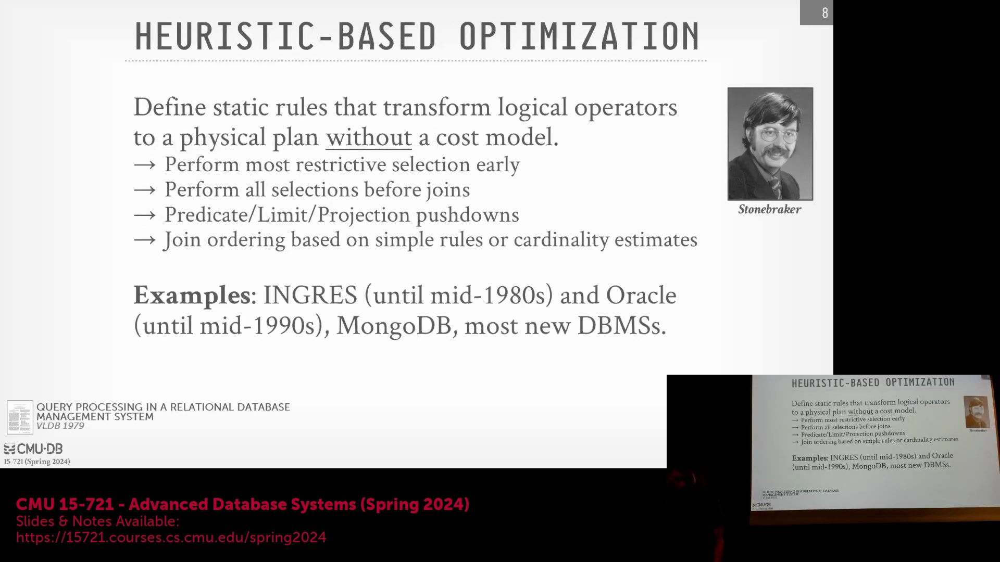
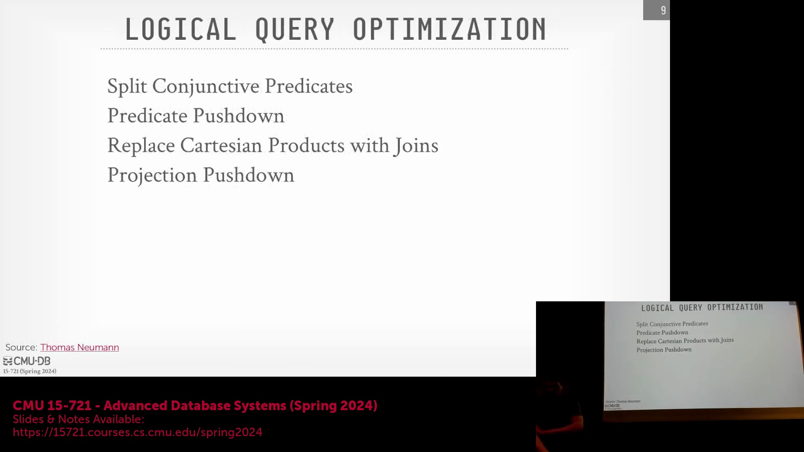
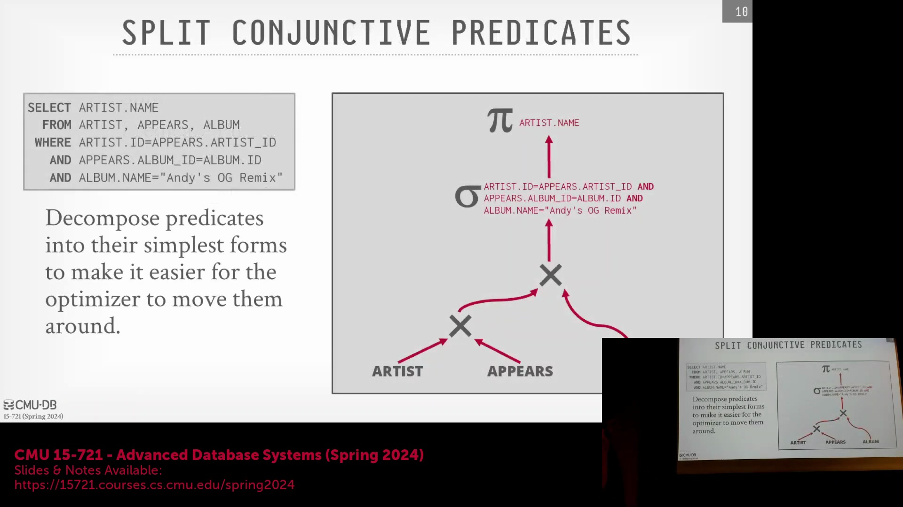
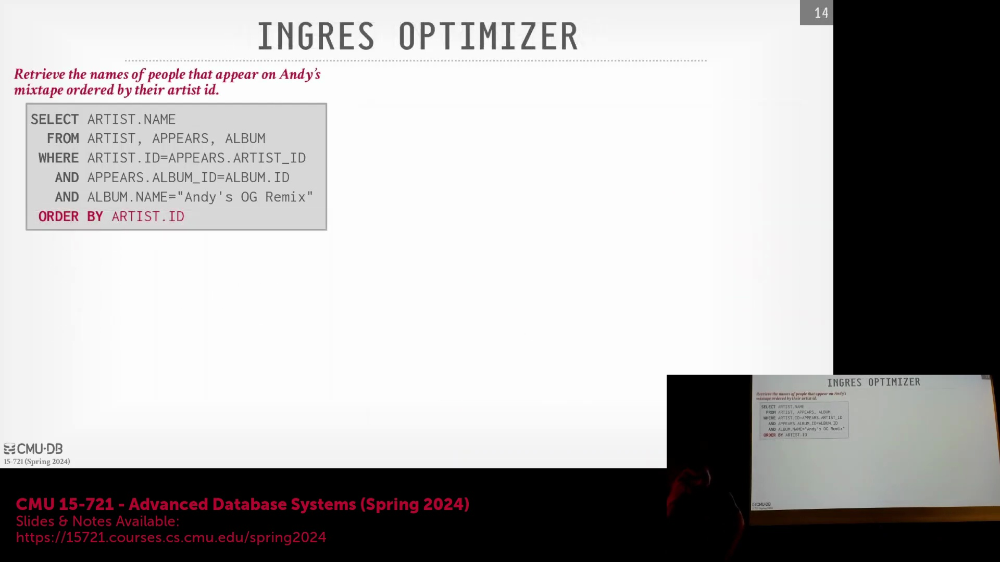

## 课程路线图与优化器实现策略
本次讲座将重点介绍查询优化器(Query Optimizer)实现的三种核心方法，并按照从简到繁的顺序展开。尽管分层搜索(Stratified Search)与统一搜索(Unified Search)策略在实现复杂度上大致相当，但每种进阶方法的设计初衷均是为了克服前一种方法的局限性。本讲将评估各方案的优缺点与实际应用场景，并着重说明分层搜索与统一搜索至今仍是现代数据库系统(Database System)的行业标准。

## 基于启发式的优化器与替代策略
对于从零开始构建数据库管理系统的新兴团队而言，基于启发式的优化器(Heuristic Optimizer)通常是首选方案，因其实现门槛较低。该类优化器主要依赖`if/else`条件分支识别特定的查询模式(Query Pattern)，并应用基于领域知识(Domain Knowledge)预定义的转换规则。作为现实中的替代方案，MongoDB 历史上曾采用多计划并发评估(Concurrent Plan Evaluation)策略：生成多个查询计划(Query Plan)，通过并发或迭代方式执行，最终择优选用运行最快的方案。尽管该方法看似简单直接，但对于查询结构固定、仅参数变化的重复性在线事务处理(Online Transaction Processing, OLTP)负载而言却十分有效。早期的关系型数据库系统(Relational Database System，如 INGRES)高度依赖此类启发式规则，通常仅通过基础的基数(Cardinality)对比来调整连接顺序(Join Order)，而无需引入形式化的搜索算法。

## 逻辑转换的作用
尽管启发式优化器缺乏复杂的代价模型(Cost Model)，但其采用的逻辑转换(Logical Transformation)规则始终是数据库优化的基石。诸如选择条件下推(Selection Pushdown)、谓词拆分(Predicate Splitting)以及最小化算子间数据传输等操作具有普适的优化收益，且无需依赖统计信息(Statistics)的收集与维护。更重要的是，这些转换是高级基于代价的优化器(Cost-Based Optimizer, CBO)不可或缺的预处理步骤。通过将原始的结构化查询语言(Structured Query Language, SQL)语法树迅速转换为规范化且经过逻辑优化的形式，系统能够避免在后续基于代价的搜索阶段浪费计算资源去探索明显低效的计划分支。

## 实战示例：逐步查询重写
将启发式规则应用于三表连接查询，可直观展示如何在无需代价估计(Cost Estimation)的情况下系统性地优化逻辑计划(Logical Plan)：
1. **拆分合取谓词(Conjunctive Predicate)：** 将单个过滤算子(Filter Operator)中复杂的 `AND` 条件拆分为独立的过滤节点。
2. **谓词下推(Predicate Pushdown)：** 将各独立过滤条件下推至连接算子(Join Operator)下方，以便在执行高开销的连接操作前缩减中间结果集规模。
3. **转换笛卡尔积(Cartesian Product)：** 当检测到交叉连接(Cross Join)上方直接存在等值谓词(Equality Predicate)时，优化器可将其重写为更高效的内连接(Inner Join)。
4. **投影下推(Projection Pushdown)：** 在数据处理流水线早期剔除冗余列，确保算子间仅传输必要字段。
尽管上述步骤逻辑严密且通常能提升性能，但并非绝对可靠。在特定边缘场景(Edge Case)下，下推计算开销较高的谓词反而可能导致性能下降。此类权衡(Trade-off)是缺乏统计代价模型(Statistical Cost Model)的纯启发式优化器所无法评估的。

## 历史背景与代价模型的必要性
回顾 INGRES 等早期系统的实现可见，它们曾采用“极其简洁直观”的优化策略。尽管这些策略在 20 世纪 70 至 80 年代数据规模较小、SQL 特性有限的背景下行之有效，但随着公共表表达式(Common Table Expression, CTE)和窗口函数(Window Function)等高级特性的引入，查询逻辑日益复杂，纯粹的启发式方法很快遭遇瓶颈。由于无法有效权衡数据基数(Cardinality)与算子计算开销之间的关系，这一局限性凸显出现代数据库系统必须超越简单的基于规则的转换(Rule-based Transformation)，转而采用稳健的、基于统计信息的代价模型(Statistics-based Cost Model)，以便在连接顺序(Join Order)与执行算法(Execution Algorithm)构成的庞大搜索空间(Search Space)中进行高效寻优。
