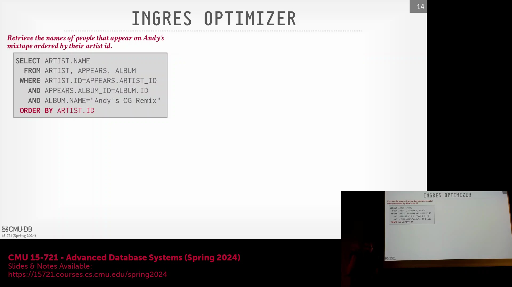
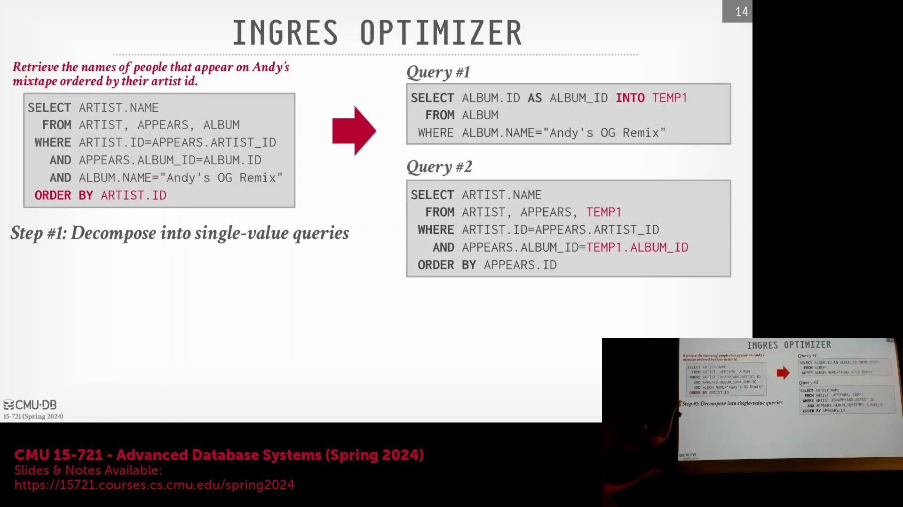
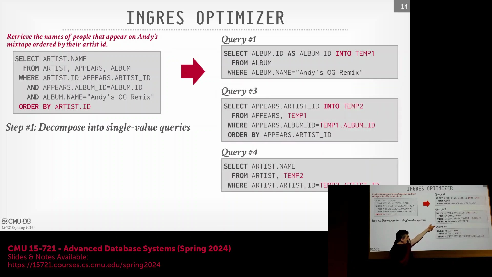
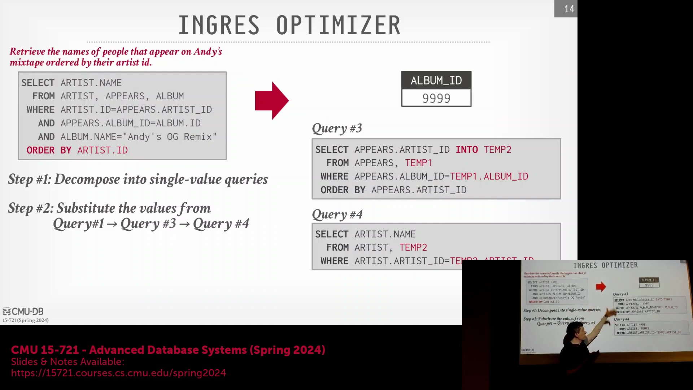
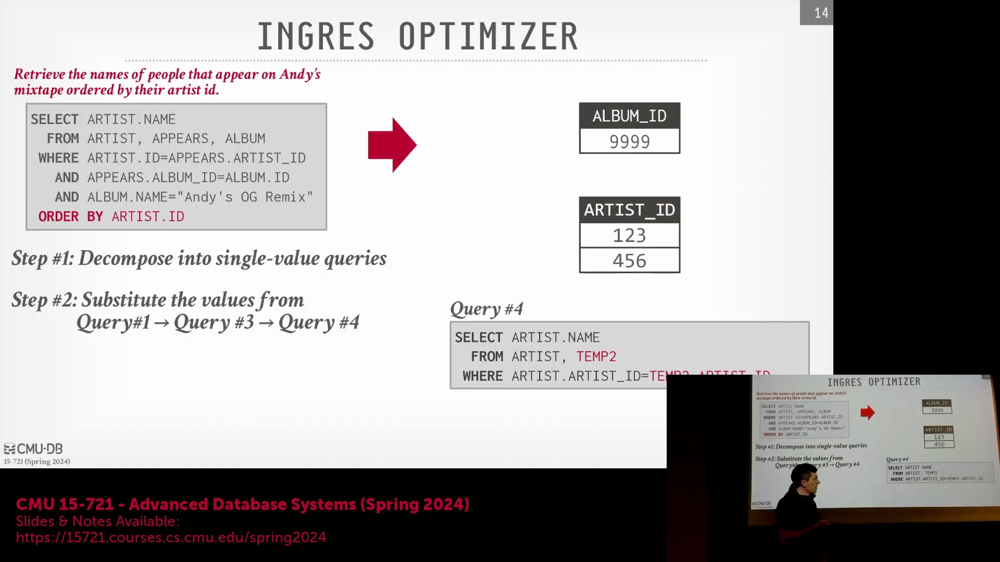
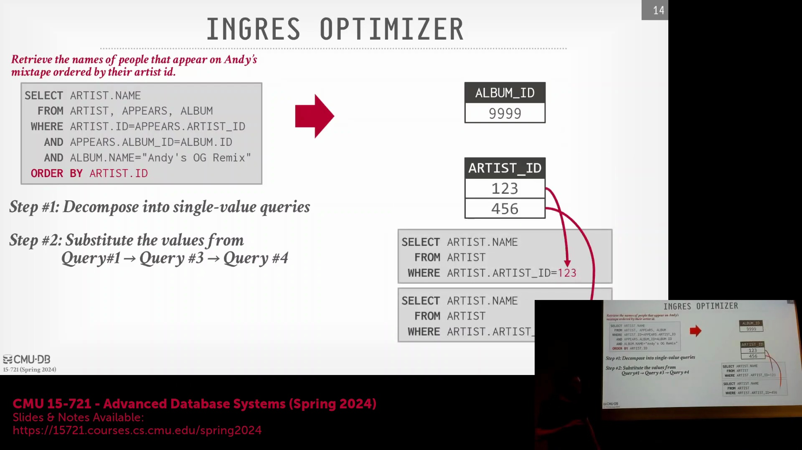
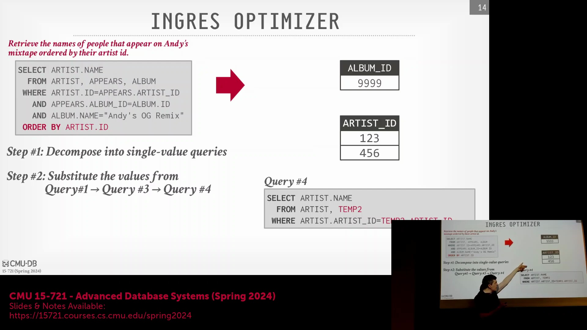
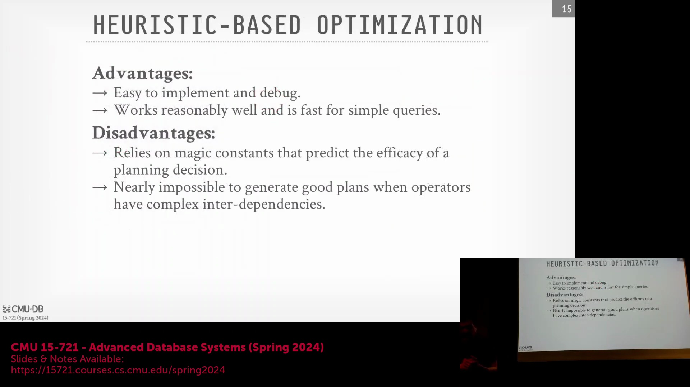
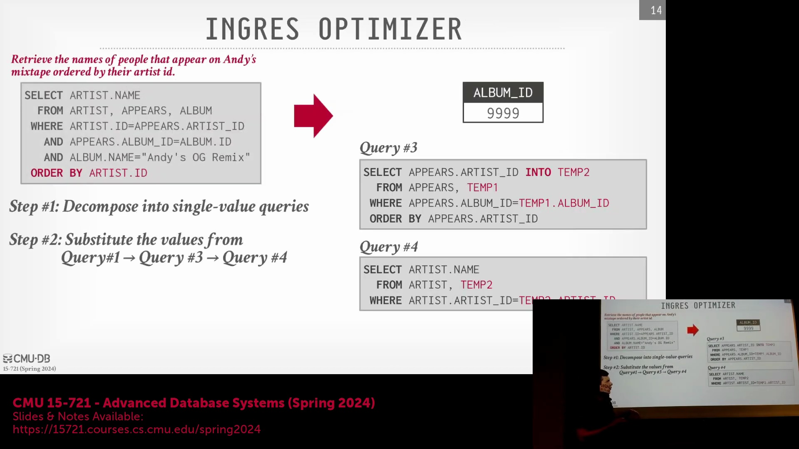
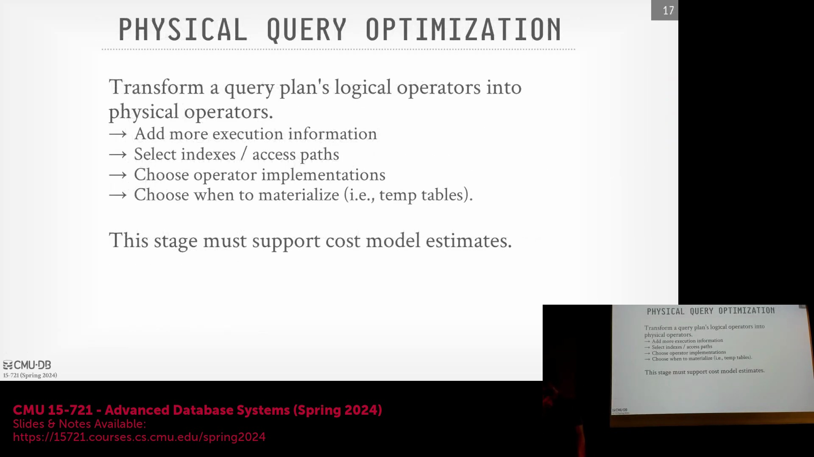

## 历史背景：INGRES 与早期启发式优化
早期的数据库系统(Database System)（如1974年左右的初版INGRES）在极其有限的计算资源下运行，且缺乏原生的连接(Join)操作支持。为在不依赖复杂代价模型(Cost Model)的情况下运行，系统采用了基于启发式的优化器(Heuristic Optimizer)。这本质上是一组`if/else`规则，用于针对特定的查询模式(Query Pattern)应用预定义的逻辑转换。尽管以现代标准审视，该方法显得过于简单，但其设计极为务实，使数据库能够直接通过规则应用而非基于统计的规划(Statistics-based Planning)来处理复杂查询逻辑。

## 查询分解与顺序物化
为在缺乏原生连接(Join)支持的环境下处理多表关联与排序操作，INGRES 采用了查询分解(Query Decomposition)技术，将复杂的SQL查询拆分为一系列单表或标量(Scalar)查询。系统会重写原始语句，将中间结果物化(Materialize)至临时表(Temporary Table，如`temp1`、`temp2`)中并按顺序执行。前序步骤的输出将作为字面量(Literal)或参数注入后续查询，从而有效串联各操作步骤，免除了从全局角度评估连接顺序(Join Order)的计算开销。

## 早期自适应执行与扩展性瓶颈
尽管该方法最初旨在处理返回多个元组(Tuple)的查询，但这种分解策略无意中催生了一种原始的自适应查询优化(Adaptive Query Optimization)形式。由于优化器会对生成的每个子查询(Subquery)独立进行调用，系统能够依据中间结果动态调整执行路径(Execution Path)（例如，针对特定`artist_id`的查找操作进行针对性优化）。然而，为每个子查询重复触发优化器使得该流程在面对现代工作负载(Workload)时显得过于缓慢。启发式优化器在处理简单查询时极具速度优势，因其无需检索统计信息(Statistics)；但随着查询复杂度的攀升，其可维护性急剧下降，难以有效处理嵌套查询(Nested Query)，缺乏稳健的连接顺序(Join Ordering)逻辑，且高度依赖人为设定的“魔法常数(Magic Constant)”。

## 基于代价优化的诞生：System R
与纯启发式方法截然不同，IBM的System R开创了首个基于代价的查询优化器(Cost-Based Query Optimizer)。它将启发式逻辑转换(Logical Transformation)与基于统计代价模型(Statistical Cost Model)的严谨搜索相结合，旨在寻得最优物理计划(Physical Plan)。通过估算每个算子(Operator)的输出基数(Cardinality)与资源消耗，System R能够对比评估多种物理实现方案，并拣选预估代价最低的路径。为遏制指数级膨胀的搜索空间(Search Space)，系统引入了实际工程约束，例如将搜索范围限定于左深连接树(Left-deep Join Tree)，而非遍历更为复杂的多分支连接树(Bushy Join Tree)。该架构随后被早期IBM DB2采纳，并深远地影响了PostgreSQL、MySQL及SQLite等现代开源数据库系统。

## 历史竞争与营销：Oracle 与 INGRES
20世纪80年代，Oracle与INGRES在关系数据库(Relational Database)技术的商业化进程中展开了激烈角逐。尽管INGRES致力于复刻IBM的基于代价(Cost-Based)优化方法，但Oracle初期采用的却是一种启发式的“语义优化器(Semantic Optimizer)”。该命名在很大程度上属于营销策略；实质上，该优化器仅机械地依照SQL语句中表的出现顺序执行连接操作，完全规避了基于代价的连接顺序(Join Order)优化。直至20世纪90年代，Oracle才全面转向更为稳健的基于代价的模型(Cost-Based Model)。其早期对表声明顺序的依赖，深刻折射出彼时构建复杂优化器所面临的严峻工程挑战。

## 现代索引与计划枚举策略
现代数据库系统广泛采用高级索引技术与物化(Materialization)机制（例如差分编码(Delta Encoding)与物化符号向量(Materialized Symbol Vector)），以高效解析查询结果并降低输入/输出(Input/Output, I/O)开销。在优化阶段进行计划枚举(Plan Enumeration)时，系统通常遵循两大范式之一：生成式(Generative，即自底向上(Bottom-up))方法或转换式(Transformational，即自顶向下(Top-down))方法。构建方向的选择将显著影响优化器的搜索空间(Search Space)覆盖范围、内存占用(Memory Footprint)，以及在查询编译(Compilation)早期阶段剪枝(Pruning)低效计划分支的能力。

## 生成式与转换式计划构建
在生成式(Generative，即自底向上(Bottom-up))方法中，优化器初始状态不包含任何物理算子(Physical Operator)，而是从叶节点(Leaf Node，如全表扫描(Sequential Scan))开始，逐层向上迭代组装计划直至根节点(Root Node)。在每一构建层级，系统会运用基于代价的选择机制(Cost-based Selection Mechanism)筛选最优子计划(Subplan)，随后将其与上一层算子进行组合。System R与Starburst系统均采纳了该架构，其优势在于支持增量式代价评估(Incremental Cost Estimation)与高效的内存管理(Memory Management)。反之，转换式(Transformational，即自顶向下(Top-down))方法则从预期的根节点输出出发逆向推导，通过重构计划结构并逐步注入所需的数据供给算子来达成目标。这两种策略在搜索空间管理(Search Space Management)、剪枝效率(Pruning Efficiency)及整体优化开销(Optimization Overhead)上各具优劣，需依具体场景权衡选用。

