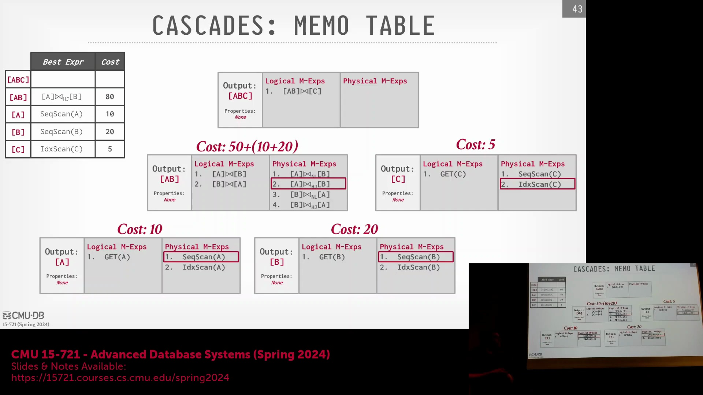
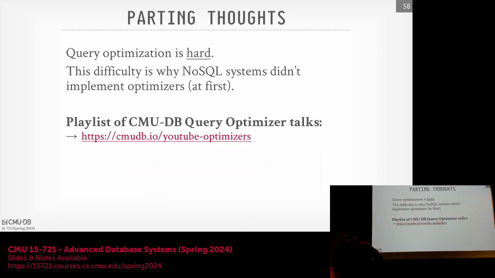
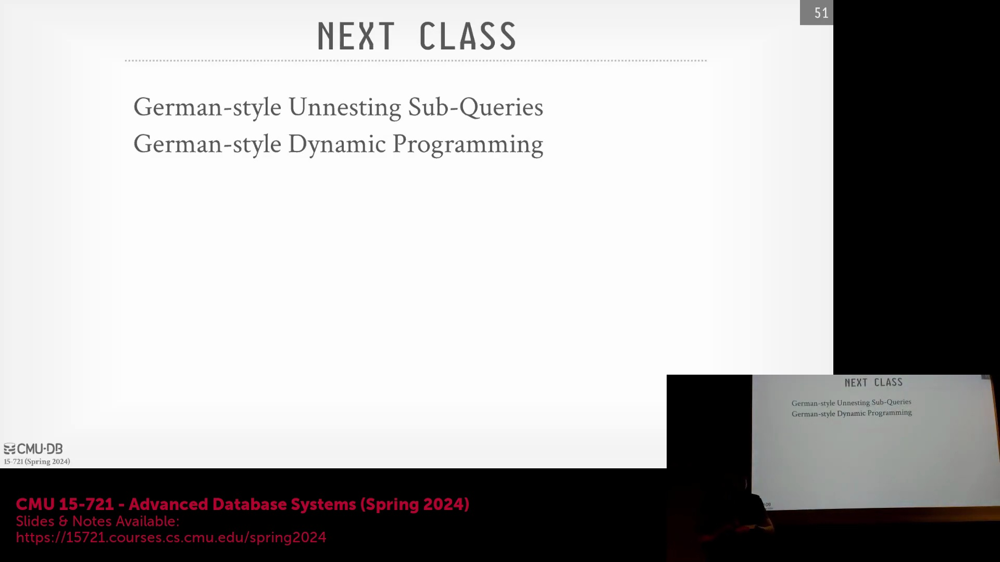
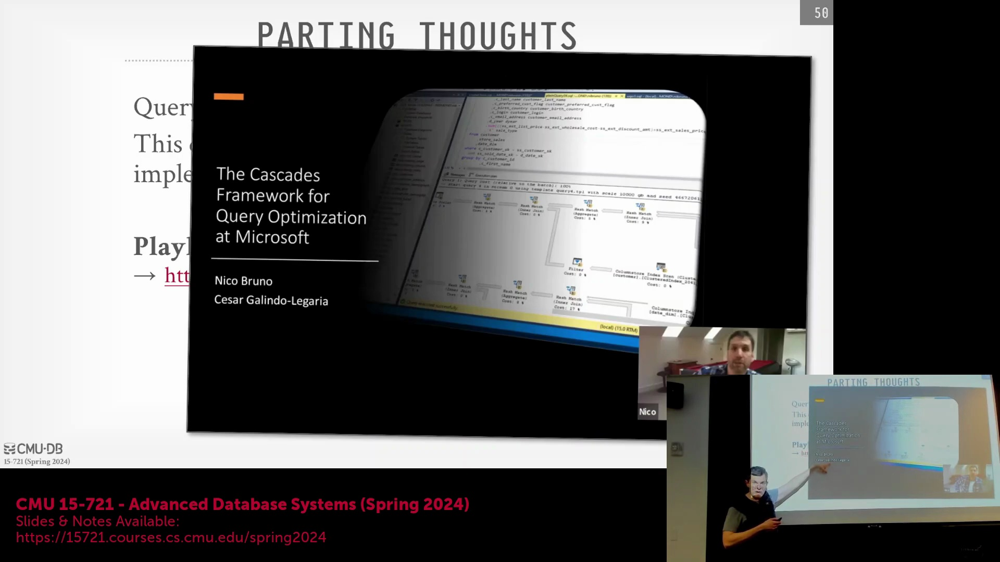

## 查询优化器简介
欢迎来到卡内基梅隆大学高级数据库系统(Advanced Database Systems)课程。本次讲座将深入探讨数据库管理系统(Database Management System, DBMS)中最核心、最复杂的组件之一：查询优化器(Query Optimizer)。构建高速执行引擎(Execution Engine)固然重要，但如果底层的查询计划(Query Plan)效率低下，系统的整体性能将大打折扣。优化器的作用举足轻重，其复杂程度甚至足以支撑一门独立的课程。尽管颇具挑战，但掌握如何构建稳健的查询计划是必不可少的，因为再强大的硬件也无法弥补拙劣的执行策略(Execution Strategy)所带来的性能瓶颈。

## 网络协议与数据组织形式回顾
在深入探讨优化算法之前，有必要先回顾网络协议(Wire Protocol)，它们在数据传输层面的概念与磁盘存储的数据组织方式高度对应。协议的选择很大程度上取决于查询的数据访问模式(Data Access Pattern)。对于仅需获取少量元组(Tuple)的在线事务处理(Online Transaction Processing, OLTP)类查询，使用开放数据库连接(Open Database Connectivity, ODBC)或Java数据库连接(Java Database Connectivity, JDBC)等面向行(Row-oriented)的应用程序接口(API)或协议完全足够。然而，对于需要检索海量数据集的分析型负载或批量数据导出任务，列式(Column-oriented)数据交换方法的效率要高得多。Apache Arrow作为实现列式数据交换的行业标准被重点提及，它正迅速成为现代在线分析处理(Online Analytical Processing, OLAP)系统的基础必备组件。

## 课程路线图与核心目标
接下来的两周将专门聚焦于查询优化，内容涵盖高层架构实现策略、规则定义、搜索算法(Search Algorithm)及重写技术(Rewrite Technique)。后续课程将深入探讨HyPer和Umbra等系统中采用的动态规划(Dynamic Programming)方法，以及能够动态调整执行策略的自适应查询优化(Adaptive Query Optimization)技术。查询优化器（亦称规划器(Planner)）最早诞生于20世纪70年代，其核心作用是将高级结构化查询语言(Structured Query Language, SQL)语句转化为底层的执行指令。它的首要目标包含两方面：一是生成绝对正确的物理计划(Physical Plan)，二是以尽可能最低的代价(Cost)执行该计划。在精确查询处理(Exact Query Processing)中，正确性是不可妥协的底线；而“代价”则是数据库系统内部用于评估和比较不同计划的抽象指标，并非对实际运行时间的直接预测。

## 复杂性与逻辑计划 vs 物理计划
寻找数学意义上最优的查询计划属于NP完全(NP-Complete)问题，这使得针对包含多表连接(Join)的查询进行穷举搜索在计算上完全不可行。因此，优化器依赖于启发式规则(Heuristics)、搜索空间剪枝(Search Space Pruning)以及代价模型(Cost Model)，以引导系统生成高效（尽管未必是全局最优）的计划。这一过程的核心在于严格区分逻辑计划(Logical Plan)与物理计划(Physical Plan)。逻辑计划基于关系代数(Relational Algebra)的概念，勾勒出高层级的关系运算（如全表扫描(Sequential Scan)、连接操作），但不涉及具体的执行算法(Execution Algorithm)。优化器会利用等价重写规则将逻辑计划转换为更优的逻辑形式，或将其映射为物理计划，后者明确了具体的执行算法、数据访问路径(Data Access Path)及数据布局(Data Layout)。一旦逻辑计划被转换为物理算子(Physical Operator)，便不会再逆向转换回逻辑形式，以避免搜索空间出现组合爆炸(Combinatorial Explosion)。

## 代价估计与搜索策略
代价估计(Cost Estimation)作为优化搜索过程中的核心内部度量标准，用于评估和比较候选计划(Candidate Plan)。它综合考量了预期输入/输出(Input/Output, I/O)量、中央处理器(Central Processing Unit, CPU)指令周期、数据选择性(Data Selectivity)、基数(Cardinality)、数据倾斜(Data Skew)、压缩率(Compression Ratio)以及物理数据局部性(Physical Data Locality)等多种因素。然而，代价模型本质上是近似估算，且容易产生累积误差，尤其是在经历多次连接操作后，这可能导致优化器最终选择次优的执行路径(Execution Path)。尽管存在这些估算偏差，但相较于实际执行查询，使用代价模型进行评估的计算开销极低。接下来的讲座将系统性地介绍多种优化策略，涵盖从结构化的基于规则的优化(Rule-Based Optimization)，到PostgreSQL等系统在特定场景下（例如涉及超过13张表连接的复杂查询）所采用的随机搜索技术(Randomized Search)。

---

## 课程路线图与优化器实现策略
本次讲座将重点介绍查询优化器(Query Optimizer)实现的三种核心方法，并按照从简到繁的顺序展开。尽管分层搜索(Stratified Search)与统一搜索(Unified Search)策略在实现复杂度上大致相当，但每种进阶方法的设计初衷均是为了克服前一种方法的局限性。本讲将评估各方案的优缺点与实际应用场景，并着重说明分层搜索与统一搜索至今仍是现代数据库系统(Database System)的行业标准。

## 基于启发式的优化器与替代策略
对于从零开始构建数据库管理系统的新兴团队而言，基于启发式的优化器(Heuristic Optimizer)通常是首选方案，因其实现门槛较低。该类优化器主要依赖`if/else`条件分支识别特定的查询模式(Query Pattern)，并应用基于领域知识(Domain Knowledge)预定义的转换规则。作为现实中的替代方案，MongoDB 历史上曾采用多计划并发评估(Concurrent Plan Evaluation)策略：生成多个查询计划(Query Plan)，通过并发或迭代方式执行，最终择优选用运行最快的方案。尽管该方法看似简单直接，但对于查询结构固定、仅参数变化的重复性在线事务处理(Online Transaction Processing, OLTP)负载而言却十分有效。早期的关系型数据库系统(Relational Database System，如 INGRES)高度依赖此类启发式规则，通常仅通过基础的基数(Cardinality)对比来调整连接顺序(Join Order)，而无需引入形式化的搜索算法。

## 逻辑转换的作用
尽管启发式优化器缺乏复杂的代价模型(Cost Model)，但其采用的逻辑转换(Logical Transformation)规则始终是数据库优化的基石。诸如选择条件下推(Selection Pushdown)、谓词拆分(Predicate Splitting)以及最小化算子间数据传输等操作具有普适的优化收益，且无需依赖统计信息(Statistics)的收集与维护。更重要的是，这些转换是高级基于代价的优化器(Cost-Based Optimizer, CBO)不可或缺的预处理步骤。通过将原始的结构化查询语言(Structured Query Language, SQL)语法树迅速转换为规范化且经过逻辑优化的形式，系统能够避免在后续基于代价的搜索阶段浪费计算资源去探索明显低效的计划分支。

## 实战示例：逐步查询重写
将启发式规则应用于三表连接查询，可直观展示如何在无需代价估计(Cost Estimation)的情况下系统性地优化逻辑计划(Logical Plan)：
1. **拆分合取谓词(Conjunctive Predicate)：** 将单个过滤算子(Filter Operator)中复杂的 `AND` 条件拆分为独立的过滤节点。
2. **谓词下推(Predicate Pushdown)：** 将各独立过滤条件下推至连接算子(Join Operator)下方，以便在执行高开销的连接操作前缩减中间结果集规模。
3. **转换笛卡尔积(Cartesian Product)：** 当检测到交叉连接(Cross Join)上方直接存在等值谓词(Equality Predicate)时，优化器可将其重写为更高效的内连接(Inner Join)。
4. **投影下推(Projection Pushdown)：** 在数据处理流水线早期剔除冗余列，确保算子间仅传输必要字段。
尽管上述步骤逻辑严密且通常能提升性能，但并非绝对可靠。在特定边缘场景(Edge Case)下，下推计算开销较高的谓词反而可能导致性能下降。此类权衡(Trade-off)是缺乏统计代价模型(Statistical Cost Model)的纯启发式优化器所无法评估的。

## 历史背景与代价模型的必要性
回顾 INGRES 等早期系统的实现可见，它们曾采用“极其简洁直观”的优化策略。尽管这些策略在 20 世纪 70 至 80 年代数据规模较小、SQL 特性有限的背景下行之有效，但随着公共表表达式(Common Table Expression, CTE)和窗口函数(Window Function)等高级特性的引入，查询逻辑日益复杂，纯粹的启发式方法很快遭遇瓶颈。由于无法有效权衡数据基数(Cardinality)与算子计算开销之间的关系，这一局限性凸显出现代数据库系统必须超越简单的基于规则的转换(Rule-based Transformation)，转而采用稳健的、基于统计信息的代价模型(Statistics-based Cost Model)，以便在连接顺序(Join Order)与执行算法(Execution Algorithm)构成的庞大搜索空间(Search Space)中进行高效寻优。

---

## 历史背景：INGRES 与早期启发式优化
早期的数据库系统(Database System)（如1974年左右的初版INGRES）在极其有限的计算资源下运行，且缺乏原生的连接(Join)操作支持。为在不依赖复杂代价模型(Cost Model)的情况下运行，系统采用了基于启发式的优化器(Heuristic Optimizer)。这本质上是一组`if/else`规则，用于针对特定的查询模式(Query Pattern)应用预定义的逻辑转换。尽管以现代标准审视，该方法显得过于简单，但其设计极为务实，使数据库能够直接通过规则应用而非基于统计的规划(Statistics-based Planning)来处理复杂查询逻辑。

## 查询分解与顺序物化
为在缺乏原生连接(Join)支持的环境下处理多表关联与排序操作，INGRES 采用了查询分解(Query Decomposition)技术，将复杂的SQL查询拆分为一系列单表或标量(Scalar)查询。系统会重写原始语句，将中间结果物化(Materialize)至临时表(Temporary Table，如`temp1`、`temp2`)中并按顺序执行。前序步骤的输出将作为字面量(Literal)或参数注入后续查询，从而有效串联各操作步骤，免除了从全局角度评估连接顺序(Join Order)的计算开销。

## 早期自适应执行与扩展性瓶颈
尽管该方法最初旨在处理返回多个元组(Tuple)的查询，但这种分解策略无意中催生了一种原始的自适应查询优化(Adaptive Query Optimization)形式。由于优化器会对生成的每个子查询(Subquery)独立进行调用，系统能够依据中间结果动态调整执行路径(Execution Path)（例如，针对特定`artist_id`的查找操作进行针对性优化）。然而，为每个子查询重复触发优化器使得该流程在面对现代工作负载(Workload)时显得过于缓慢。启发式优化器在处理简单查询时极具速度优势，因其无需检索统计信息(Statistics)；但随着查询复杂度的攀升，其可维护性急剧下降，难以有效处理嵌套查询(Nested Query)，缺乏稳健的连接顺序(Join Ordering)逻辑，且高度依赖人为设定的“魔法常数(Magic Constant)”。

## 基于代价优化的诞生：System R
与纯启发式方法截然不同，IBM的System R开创了首个基于代价的查询优化器(Cost-Based Query Optimizer)。它将启发式逻辑转换(Logical Transformation)与基于统计代价模型(Statistical Cost Model)的严谨搜索相结合，旨在寻得最优物理计划(Physical Plan)。通过估算每个算子(Operator)的输出基数(Cardinality)与资源消耗，System R能够对比评估多种物理实现方案，并拣选预估代价最低的路径。为遏制指数级膨胀的搜索空间(Search Space)，系统引入了实际工程约束，例如将搜索范围限定于左深连接树(Left-deep Join Tree)，而非遍历更为复杂的多分支连接树(Bushy Join Tree)。该架构随后被早期IBM DB2采纳，并深远地影响了PostgreSQL、MySQL及SQLite等现代开源数据库系统。

## 历史竞争与营销：Oracle 与 INGRES
20世纪80年代，Oracle与INGRES在关系数据库(Relational Database)技术的商业化进程中展开了激烈角逐。尽管INGRES致力于复刻IBM的基于代价(Cost-Based)优化方法，但Oracle初期采用的却是一种启发式的“语义优化器(Semantic Optimizer)”。该命名在很大程度上属于营销策略；实质上，该优化器仅机械地依照SQL语句中表的出现顺序执行连接操作，完全规避了基于代价的连接顺序(Join Order)优化。直至20世纪90年代，Oracle才全面转向更为稳健的基于代价的模型(Cost-Based Model)。其早期对表声明顺序的依赖，深刻折射出彼时构建复杂优化器所面临的严峻工程挑战。

## 现代索引与计划枚举策略
现代数据库系统广泛采用高级索引技术与物化(Materialization)机制（例如差分编码(Delta Encoding)与物化符号向量(Materialized Symbol Vector)），以高效解析查询结果并降低输入/输出(Input/Output, I/O)开销。在优化阶段进行计划枚举(Plan Enumeration)时，系统通常遵循两大范式之一：生成式(Generative，即自底向上(Bottom-up))方法或转换式(Transformational，即自顶向下(Top-down))方法。构建方向的选择将显著影响优化器的搜索空间(Search Space)覆盖范围、内存占用(Memory Footprint)，以及在查询编译(Compilation)早期阶段剪枝(Pruning)低效计划分支的能力。

## 生成式与转换式计划构建
在生成式(Generative，即自底向上(Bottom-up))方法中，优化器初始状态不包含任何物理算子(Physical Operator)，而是从叶节点(Leaf Node，如全表扫描(Sequential Scan))开始，逐层向上迭代组装计划直至根节点(Root Node)。在每一构建层级，系统会运用基于代价的选择机制(Cost-based Selection Mechanism)筛选最优子计划(Subplan)，随后将其与上一层算子进行组合。System R与Starburst系统均采纳了该架构，其优势在于支持增量式代价评估(Incremental Cost Estimation)与高效的内存管理(Memory Management)。反之，转换式(Transformational，即自顶向下(Top-down))方法则从预期的根节点输出出发逆向推导，通过重构计划结构并逐步注入所需的数据供给算子来达成目标。这两种策略在搜索空间管理(Search Space Management)、剪枝效率(Pruning Efficiency)及整体优化开销(Optimization Overhead)上各具优劣，需依具体场景权衡选用。

---

## 查询计划(Query Plan)转换与动态代价评估

优化过程中应用的转换规则极大地影响了查询计划的搜索空间(Search Space)。系统通常采用动态规划(Dynamic Programming)方法，其代价评估(Cost Estimation)与剪枝(Pruning)机制会因转换结构的不同而有所差异。优化器评估和选择潜在执行路径(Execution Path)的方式直接决定了整体查询性能。

## System R 优化器与左深树(Left-Deep Tree)约束

System R 优化器开创了自底向上(Bottom-Up)优化策略的早期实现。传入的查询首先被分解为多个查询块(Query Blocks)，这些块可表示阻塞操作符(Blocking Operators)、嵌套子查询(Nested Subqueries)或整体计划的其他子组件。针对每个逻辑块内的逻辑操作符(Logical Operators)，优化器会生成一组可行的物理操作符(Physical Operators)，重点关注连接算法(Join Algorithms)和数据访问路径(Data Access Paths)（如顺序扫描(Sequential Scan)与索引查找(Index Lookup)）。为限制指数级增长的搜索空间，System R 将评估范围限定为左深连接树。尽管该设计源于 20 世纪 70 年代的硬件限制，且在现代数据库中仍被广泛沿用，但它本质上限制了优化器发现可能更高效的宽树(Bushy Tree)或右深树(Right-Deep Tree)执行计划的机会。

## 独立访问路径选择与连接枚举(Join Enumeration)

优化过程首先独立地为查询中涉及的每张表确定最佳访问路径。例如，优化器可能为 `artists` 和 `appears` 表选择顺序扫描，而为 `album` 表的 `name` 列选择索引查找。这些访问决策均在评估连接策略(Join Strategies)之前完成。确定访问路径后，优化器会枚举所有可能的连接顺序与组合，实质上生成了潜在连接计划的笛卡尔积(Cartesian Product)。在启动自底向上的动态规划评估前，系统会立即剪枝无效或低效的选项（如显式的笛卡尔积连接），以简化搜索过程。

## 自底向上动态规划执行

自底向上的搜索过程以树状结构构建查询计划，其中基础表(Base Tables)位于底层，最终结果位于顶层。优化器从底层开始，评估所有可用于合并两张表或中间结果的物理连接操作符（如哈希连接(Hash Join)、归并连接(Merge Join)）。对于上一层的每个节点，系统会依据代价模型(Cost Model)计算执行代价，并仅保留当前最优的执行路径。该迭代过程随着计划树的扩展不断向上推进。而诸如谓词下推(Predicate Pushdown)或聚合策略(Aggregation Strategies)等额外转换，通常在分层搜索中单独处理，或作为独立的查询块对待；因为若将它们直接嵌入自底向上的动态规划搜索中，会显著增加状态空间的复杂度。

当搜索到达计划树的根节点时，优化器即可确定最终的目标结果集，并自上而下回溯(Trace Back)以重构完整的最低代价执行路径。这种分阶段方法的一个显著局限性在于访问路径选择与连接顺序枚举的解耦。在未确定连接顺序的情况下预先选定访问路径，可能导致次优决策。例如，某种特定的连接顺序可能使得基于索引的嵌套循环连接(Index Nested Loop Join)的代价远低于哈希连接，但由于早期的解耦设计，优化器在缺乏统一联合搜索策略的情况下，无法识别并利用这种协同优化(Synergistic Optimization)潜力。

## 物理属性(Physical Properties)与排序顺序(Sort Order)的处理

System R 动态规划搜索的一个早期局限在于，其初始版本未充分考虑物理数据属性（例如 `ORDER BY` 子句所要求的排序顺序）。为弥补这一缺陷，优化器被扩展为能够同时追踪满足与不满足特定物理属性要求的最佳执行计划。当查询需要排序输出时，系统会权衡两种方案：一是在未排序计划的末尾显式添加独立的排序操作符(Sort Operator)；二是利用天然可产生有序输出的归并连接。通过估算显式排序操作的代价并将其叠加至无序计划的基准代价上，优化器能够对比得出总代价最低的策略。该机制有效地将物理属性纳入了全局代价评估体系，而非将其作为初始自底向上搜索的硬性前置条件。

---

## 结合物理属性(Physical Properties)确定最终计划

在自底向上(Bottom-Up)的搜索过程中，优化器会同时维护已排序和未排序的候选计划(Candidate Plans)。在最终的评估阶段，系统会将“为未排序计划（例如哈希连接(Hash Join)）附加专用排序操作符的代价”与“直接采用天然可产生有序输出的排序合并连接(Sort-Merge Join)”进行对比。基于代价估算，系统将选择总体代价更低的方案。然而，这暴露了一个根本性局限：排序顺序(Sort Order)等物理属性仅被视为后处理步骤(Post-processing Steps)，而非原生集成到初始搜索空间(Search Space)中。因此，优化器无法在搜索初期全面评估所有可能的计划排列组合。

## 搜索后的启发式规则(Heuristic Rules)与逻辑转换(Logical Transformations)

由于核心的动态规划(Dynamic Programming)搜索主要聚焦于连接顺序(Join Order)与访问路径(Access Paths)，额外的逻辑转换通常在独立阶段进行处理。这些规则多以过程式检查(Procedural Checks)的形式实现，往往缺乏对底层物理算法(Physical Algorithms)或数据属性的深度感知。在 PostgreSQL 等系统中，启发式优化会在主代价搜索(Cost-Based Search)完成后应用。优化器会执行一个最终的“微调”阶段，将物理优化策略叠加至已构建的计划之上。这种分阶段方法导致了逻辑与物理优化间的割裂；例如，若在确定连接顺序前便固化访问方法，系统便可能错失良机：特定的连接顺序本可使索引嵌套循环连接(Index Nested Loop Join)显著优于其他方案。

## 搜索终止策略(Search Termination Strategies)

查询优化(Query Optimization)本质上是一个 NP 完全问题(NP-Complete Problem)，这意味着其搜索空间理论上呈指数级膨胀。为防止优化过程无限期运行，优化器实施了严格的终止条件。最直接的方法是设置硬性时钟超时(Hard Clock Timeout)。更高级的策略则采用代价阈值(Cost Threshold)：当新生成计划带来的边际收益(Marginal Gain)微乎其微（例如改善幅度低于 10%）时，立即终止搜索。基于预估查询复杂度的动态超时(Dynamic Timeout)虽理论可行，但在计划生成前精准预测复杂度往往极为困难。另一种方案是，一旦遍历完给定子计划的所有排列组合，搜索即告结束。微软引入了一种巧妙的硬件无关策略(Hardware-Agnostic Strategy)：通过统计已考虑的转换操作(Transformation Operations)总数来限制搜索。设定被评估计划数量的上限，可确保优化器在从移动设备到高端服务器的各类硬件环境中保持行为一致性与可预测性。

## 优缺点与剪枝权衡(Pruning Trade-offs)

传统的自底向上动态规划方法至今仍极具实用性，并构成了众多现代数据库优化器的核心基石。为控制搜索复杂度，系统会应用严格的剪枝策略(Pruning Strategies)，例如将搜索范围限定于左深树(Left-Deep Trees)。此举虽大幅压缩了搜索空间(Search Space)并将优化耗时控制在合理范围内，但也引入了显著的权衡(Trade-off)：优化器可能会系统性地舍弃那些依赖宽树(Bushy Trees)或右深树(Right-Deep Trees)结构的全局最优计划(Global Optimal Plans)。此外，由于剪枝决策多依赖启发式规则而非详尽的代价分析，加之物理属性需额外后处理，最终生成的执行计划(Execution Plan)往往难以保证绝对的理论最优性。

## 过程式优化器代码(Procedural Optimizer Code)的挑战

历史上，实现此类搜索策略的查询优化器(Query Optimizer)多直接采用过程式代码编写。开发者大量依赖 `if-then-else` 语句嵌入模式匹配(Pattern Matching)逻辑与转换规则，以识别特定查询结构并施加相应修改。这种紧耦合的实现方式在维护与扩展方面历来备受诟病。硬编码(Hard-coding)过程式优化器不可避免地会引发代码冗余、隐蔽缺陷(Hidden Bugs)及复杂的模块间依赖；例如，应用某项转换规则可能会意外破坏另一规则所依赖的前置条件。随着查询语法的日益复杂与数据库功能的不断演进，持续维护此类硬编码优化器已变得愈发难以为继。

## 优化器生成器(Optimizer Generator)与基于规则 DSL

为突破过程式代码的局限，数据库界于 20 世纪 80 年代末至 90 年代初引入了优化器生成器。开发者不再硬编码业务逻辑，转而采用高级领域特定语言(Domain-Specific Language, DSL)来声明转换规则与模式匹配条件。生成器会自动将这些声明编译为高效的底层代码，并在数据库系统构建阶段完成集成。该架构实现了搜索引擎(Search Engine)与优化规则的清晰解耦，支持多团队并行开发。优化规则得以集中管控、灵活扩展，且无需改动核心搜索框架即可迭代更新。IBM 的 Starburst 项目（至今仍是 DB2 的基石）以及 Exodus/Volcano/Cascades 框架等开创性工作确立了这一范式，为现代数据库优化器的分层搜索与统一架构奠定了坚实基础。

---

## 优化器生成器(Optimizer Generator)与搜索策略

现代查询优化器(Query Optimizer)通常借助优化器生成器构建。该架构允许开发者使用高级领域特定语言(Domain-Specific Language, DSL)定义模式匹配(Pattern Matching)条件与转换规则(Transformation Rules)，从而避免硬编码(Hard-coding)复杂的过程式逻辑(Procedural Logic)。这种关注点分离(Architectural Separation)显著提升了优化器的可维护性，并支持不同团队独立开发搜索引擎(Search Engine)与规则集(Rule Sets)。规则的执行通常遵循两种主要范式(Paradigms)之一：分层搜索(Layered Search)或统一搜索(Unified Search)。在分层搜索中，优化器首先独立于代价模型(Cost Model)，应用一组固定的启发式规则(Heuristic Rules)（如谓词下推(Predicate Pushdown)）进行逻辑重写，随后才进入基于代价的搜索(Cost-Based Search)阶段。相反，统一搜索将逻辑转换(Logical Transformations)、物理实现选择(Physical Implementation Selection)与代价评估(Cost Estimation)融合至单一的、综合的探索过程(Exploration Process)中。尽管如 Cascades 等框架在理论上支持纯粹的统一搜索，但许多生产级数据库(Production Databases)（如 Microsoft SQL Server）在实际中采用混合策略(Hybrid Strategy)：优先应用严格的启发式规则进行初步剪枝，随后再过渡至统一的基于代价的搜索空间探索。

## 分层搜索(Layered Search)方法与 Starburst 的遗产
分层搜索架构由 IBM 的 Starburst 项目首创，其设计理念至今仍在深刻影响着 Apache Calcite 等现代优化框架(Optimization Frameworks)。该过程在严格划分的阶段(Phases)中执行：优化器首先对逻辑计划(Logical Plan)进行重写(Rewriting)，应用那些具备普适收益或理论必要性的转换规则，此过程完全独立于代价模型。待逻辑转换收敛后，系统进入第二阶段，采用类似于经典 System R 优化器的自底向上动态规划(Bottom-Up Dynamic Programming)算法，对物理实现(Physical Implementations)进行探索。这种两阶段架构(Two-Phase Architecture)使数据库系统能够强制执行必要的逻辑优化，并在早期阶段大幅剪枝(Prune)搜索空间，从而避免基于代价的搜索浪费资源去评估本质上低效的逻辑结构。

## IBM 系统中的关系演算(Relational Calculus)与逻辑重写

原始 Starburst 实现的一个显著特征在于，其初始重写阶段高度依赖关系演算。优化器并非直接操作标准的关系代数操作符(Relational Algebra Operators)，而是先将查询计划转换为更为抽象的关系演算数学表达形式。此举为那些在传统关系代数中难以精确表述的复杂逻辑转换提供了更强的表达能力(Expressive Power)。应用启发式规则后，系统会将优化后的演算表达式还原为逻辑计划（通常称为查询图模型(Query Graph Model, QGM)），随后才执行基于代价的优化。尽管该方案在理论上极为优雅，但在实际工程实现与调试(Debugging)方面却极具挑战。除 IBM 的早期研究与部分 DB2 特定版本外，现代数据库系统已基本弃用关系演算，转而直接采用关系代数操作。这主要是因为关系演算抽象层级过高，与底层可执行代码之间存在难以逾越的抽象鸿沟(Abstract Gap)。

## DB2 的复杂历史与优化器的演进

查询优化器架构的演进历程与企业级数据库工程的历史紧密交织。例如，DB2 for Linux, Unix, and Windows (DB2 LUW) 实际上起源于 20 世纪 80 年代末至 90 年代初的 OS/2 Database Manager。随着 Microsoft Windows 逐渐占据操作系统市场主导地位，IBM OS/2 的发展举步维艰。为保持竞争力，数据库团队决定引入 IBM 研究院先进的 Starburst 查询优化器，以推动其系统架构的现代化(Modernization)。此次集成标志着分层搜索模型正式迈入生产级环境(Production Environments)。然而，在多个完全独立的 DB2 代码库（如 z/OS、LUW 等）之间同步维护此类复杂的优化器框架，历来是一项艰巨的工程挑战。工程师们常常需要应对与关系演算绑定的自定义 DSL 所带来的僵化性(Rigidity)与陡峭的学习曲线(Steep Learning Curve)。这一现象深刻揭示了理论上的优化纯粹性与可持续软件工程(Sustainable Software Engineering)之间必须做出的现实权衡(Trade-off)。

## 统一搜索(Unified Search)、Cascades 与备忘录技术(Memoization)

为突破严格分阶段方法的局限性，Cascades 框架率先引入了统一搜索策略。在该模型下，逻辑转换、物理操作符选择(Physical Operator Selection)与代价评估被统一纳入单一、集成的搜索空间(Search Space)中协同进行。该策略面临的核心挑战在于潜在查询计划数量的组合爆炸(Combinatorial Explosion)，极易导致计算资源耗尽而变得不可行(Computationally Intractable)。为应对这一挑战，Cascades 深度依赖备忘录技术。优化器通过维护一张结构化的内存表(Memory Table)，记录已探索的子计划(Subplans)、其逻辑等价变体(Logically Equivalent Variants)及相关代价，从而有效避免了重复计算(Redundant Computations)。当搜索引擎遭遇已评估过的逻辑等价子计划时，将直接检索缓存结果，而非重新生成计划或重复计算代价。该机制使得统一搜索能够在彻底探索复杂转换空间(Transformation Space)的同时，将优化耗时(Optimization Time)严格控制在实际可行的阈值内。

---

## Volcano 的自顶向下搜索(Top-Down Search)与分支定界剪枝(Branch and Bound Pruning)

Volcano 优化器生成器(Volcano Optimizer Generator)以首创迭代器执行模型(Iterator Execution Model)和并行交换操作符(Parallel Exchange Operators)而闻名，并率先引入了查询计划的自顶向下生成方法之一。该搜索策略并非从基础表(Base Tables)开始自底向上构建，而是从期望的输出结果出发进行逆向推导，逐步组装生成该结果所需的逻辑操作符(Logical Operators)与物理操作符(Physical Operators)。在优化器向下遍历计划树(Plan Tree)的过程中，系统会应用转换规则(Transformation Rules)生成替代实现方案，并自叶节点向根节点逐步累积代价估算(Cost Estimation)。该方法的核心特征之一是分支定界剪枝。若某个物理操作符无法满足必需的属性要求（例如父节点归并连接(Sort-Merge Join)所依赖的特定排序顺序(Sort Order)），则整个搜索分支将被立即剪除。同理，若部分构建路径的累积代价已超过当前已知的最优代价(Current Best Cost)，搜索过程将直接截断该分支，从而避免对次优计划(Suboptimal Plans)进行冗余探索。

## Cascades 框架与基于占位符(Placeholders)的惰性展开(Lazy Expansion)
Cascades 框架建立在 Volcano 自顶向下及逆向链推理(Backward Chaining)的基础之上，但有效解决了一个关键的可扩展性瓶颈：在高度复杂查询中极易引发的内存开销爆炸(Memory Explosion)问题。与在每个节点急切生成(Eager Generation)所有可能转换组合的做法不同，Cascades 采用了惰性展开策略。该框架在计划树中插入占位符，用于声明所需的数据属性(Data Properties)与逻辑结构(Logical Structures)，而无需预先绑定具体的物理执行方法。这些占位符仅在搜索过程明确需要时才会被实例化，并依据可配置的优先级系统(Priority System)逐步细化。这种延迟求值机制(Lazy Evaluation Mechanism)有效防止了搜索空间(Search Space)的过早膨胀，确保计算资源被集中投入到最具潜力的转换路径上。

## 自包含优化任务(Self-Contained Optimization Tasks)与动态优先级(Dynamic Priorities)
Cascades 围绕模块化、自包含的任务对象构建其优化逻辑。每个任务封装了四个核心组件：待匹配的计划模式(Patterns)、对应的转换规则、定义或强制物理属性(Physical Properties)的元数据(Metadata)，以及执行优先级(Execution Priority)。此架构实现了高度上下文感知(Context-Aware)的优化过程。随着搜索的推进，优化器可依据当前计划状态动态调整转换规则的评估优先级。例如，若上游节点选定索引嵌套循环连接(Index Nested Loop Join)，系统将优先探索索引探测(Index Probe)路径，而非“顺序扫描(Sequential Scan) + 显式排序(Explicit Sort)”的组合，因为前者天然满足所需的排序要求。尽管 Microsoft SQL Server 等商业数据库通常将此类优先级硬编码(Hard-coded)，但 Cascades 框架在理论上支持随搜索树的演进动态重算(Dynamic Recalculation)优先级。

## 操作符与表达式的统一优化(Unified Optimization of Operators and Expressions)
Cascades 的一项核心架构优势在于，它能够在单一规则引擎(Rule Engine)内统一处理多个优化领域(Optimization Domains)。该框架将 SQL 谓词(Predicates)与 WHERE 子句表达式视为树状结构(Tree Structures)，其底层抽象与关系操作符树(Relational Operator Trees)完全一致。因此，用于确定连接顺序(Join Ordering)和选择物理操作符的同一套模式匹配(Pattern Matching)与转换机制，可直接复用于表达式简化(Expression Simplification)。诸如将 `1 = 2` 化简为 `FALSE` 的基础常量折叠(Constant Folding)或逻辑化简，能够与复杂的物理计划生成无缝协同处理。这消除了对相互独立、分阶段特定优化遍次(Optimization Passes)的依赖，构建了一个内聚且精简的编译流水线(Compilation Pipeline)，使逻辑优化、物理优化与谓词优化(Predicate Optimization)得以统一执行。

## 术语澄清与关系代数(Relational Algebra)基础
在 Cascades 框架中，“表达式”(Expression)一词的内涵已超越传统 SQL 谓词的范畴。它泛指查询计划(Query Plan)中的任意计算节点或子树(Subtree)。逻辑表达式(Logical Expression)可能仅定义一个抽象的三表连接序列，而其对应的物理表达式(Physical Expression)则明确指定具体的执行算法，例如基于顺序扫描的哈希连接(Hash Join)或基于索引探测的嵌套循环连接(Nested Loop Join)。应用于这些表达式的每一次转换均严格遵循关系代数等价规则(Relational Algebra Equivalence Rules)。通过确保所有重写操作均保持语义等价性(Semantic Equivalence)（例如利用 `A JOIN B ≡ B JOIN A` 的交换律(Commutativity)），优化器得以安全地排列、探索并计算替代执行路径的代价，从根本上杜绝了查询结果出错的风险。

---

## 关系代数(Relational Algebra)基础与组（Group）的定义

在 Cascades 等优化框架中，查询优化严格遵循关系代数(Relational Algebra)的等价变换规则(Equivalence Rules)，利用交换律(Commutativity)等数学属性安全地重排执行计划，同时确保查询语义不变。该架构的核心在于**组（Group）**这一概念。一个组封装了所有逻辑等价(Logically Equivalent)且产生相同预期子查询结果(Subquery Results)的逻辑表达式(Logical Expressions)与物理表达式(Physical Expressions)。例如，表示三表连接(A JOIN B JOIN C)的组，将囊括所有可行的逻辑连接顺序(Join Orders)及其衍生的所有对应物理实现(Physical Implementations)。此外，每个组还会追踪其成员必须满足或强加的特定物理属性(Physical Properties)（如排序顺序(Sort Order)）。

## 作为惰性占位符(Lazy Placeholders)的多表达式（Multi-Expressions）

为应对自顶向下搜索(Top-Down Search)中潜在的**组合爆炸(Combinatorial Explosion)**问题，Cascades 引入了**多表达式（Multi-Expressions）**作为计划树中的惰性占位符。多表达式仅声明当前层级需执行的操作，而将具体连接顺序(Join Order)、访问路径(Access Paths)及物理算法(Physical Algorithms)的确定明确推迟。优化器避免了急切展开(Eagerly Expanding)所有潜在子计划(Subplans)所导致的内存膨胀，转而通过这些占位符抽象表示“下层待解析的结构”。此举使搜索引擎(Search Engine)能够在计划树高层级先行做出结构决策，无需即刻下沉至基础表(Base Tables)。仅当优化器判定必要时，才会依据预设的优先级策略对这些占位符进行增量式展开(Incremental Expansion)。

## 转换规则(Transformation Rules)与实现规则(Implementation Rules)

优化器依赖两类模式匹配规则(Pattern Matching Rules)对计划树进行展开与重构：**转换规则（Transformation Rules）**负责将逻辑表达式(Logical Expressions)重写为等价的其他逻辑形式（例如，将左深连接树(Left-Deep Join Tree)转换为右深连接树(Right-Deep Join Tree)）；**实现规则（Implementation Rules）**则负责将逻辑表达式映射为具体的物理操作符(Physical Operators)（例如，将逻辑等值连接(Logical Equi-Join)实现为哈希连接(Hash Join)或归并连接(Sort-Merge Join)）。这些规则均由目标模式(Target Pattern)与替换模板(Replacement Template)精确定义。在逻辑到逻辑(Logical-to-Logical)的转换中，一个核心挑战是防范无限循环(Infinite Loop)，即规则可能在两种等价形态间反复切换。为此，优化器必须严格追踪已应用的转换历史以阻断循环并抑制内存膨胀。特别是针对那些绝对收益的优化规则，系统通常直接覆盖(Overwrite)旧状态，而非保留冗余的历史快照。

## 备忘录表(Memo Table)与代价缓存机制

**备忘录表（Memo Table）**是化解无限循环风险与消除自顶向下搜索冗余的核心缓存机制。针对搜索过程中遇到的每个多表达式(Multi-Expression)，备忘录表会持久化记录当前发现的**最低代价物理表达式(Lowest-Cost Physical Expression)**及其对应的代价估算(Cost Estimation)。在实际架构中，该信息通常不作为独立数据结构游离存在，而是直接内嵌于组(Group)的定义中。依托此缓存机制，优化器彻底规避了对相同子树(Subtree)的重复遍历。当某条规则生成的新计划匹配到已评估过的多表达式时，优化器仅需直接从备忘录表中检索已知的最优代价，即可跳过繁琐的递归展开(Recursive Expansion)与二次代价计算。

## 增量代价评估(Incremental Cost Evaluation)与搜索工作流(Search Workflow)

搜索工作流(Search Workflow)以自顶向下的方式增量推进。在评估诸如 `A ⋈ B` 的多表达式(Multi-Expression)时，优化器首先对叶节点(Leaf Nodes) `A` 和 `B` 应用实现规则(Implementation Rules)，对比顺序扫描(Sequential Scan)与索引探测(Index Probe)等备选方案。各表成本最低的物理访问路径(Physical Access Paths)将被即时写入备忘录表（例如，`Cost(A)=10`, `Cost(B)=20`）。随后，当系统探索替代的逻辑连接顺序(Logical Join Order)（如 `B ⋈ A`）时，优化器会直接查询备忘录表以复用已缓存的叶节点代价，从而大幅削减冗余遍历。在穷尽所有逻辑排列(Logical Permutations)后，实现规则将实例化具体的物理连接算法(Physical Join Algorithms)。物理连接的总代价等于连接操作符(Join Operator)自身开销与其子节点已缓存代价之和（例如，`Cost(HashJoin(A,B)) + 10 + 20 = 80`）。最终，该最优物理计划及其聚合代价将被回写至备忘录表。至此，Cascades 框架“自顶向下探索结构、自底向上累加代价”的核心优化循环得以闭环。

---

## 搜索终止与分支定界剪枝(Branch and Bound Pruning)

Cascades 优化器采用积极的分支定界剪枝策略，以确保搜索空间在计算上保持可控。一旦框架发现一个完整的物理计划(Physical Plan)及其初始代价（例如 80 或 125），便会以此设定严格的代价上界(Cost Upper Bound)。在后续遍历中，若任何部分构建计划(Partial Plan)的累积代价超过该阈值，优化器将立即剪除(Prune)该分支。这种代价限制机制有效避免了搜索过程在呈指数级增长的次优执行路径(Suboptimal Execution Paths)上浪费资源，并确保优化过程能在实际可行的时间窗口内完成。

## 处理估算误差(Estimation Errors)与备忘录表的生命周期
在实际运行中，代价估算(Cost Estimation)往往与实际运行时性能(Runtime Performance)存在偏差。大多数传统数据库系统会选择按既定路线执行已选计划，即便在查询执行中途发现估算误差。然而，先进的架构允许注入执行钩子(Execution Hooks)，以触发运行时重优化(Runtime Re-optimization)或收集执行期反馈(Execution Feedback)。此类反馈可用于动态更新后续查询的基数估算(Cardinality Estimation)与代价模型(Cost Model)。尽管存在复用潜力，备忘录表(Memo Table)通常会在查询执行完毕后立即释放。跨查询的备忘录复用机制(Cross-Query Memo Reuse)极少被实现，因为最优代价与计划结构高度依赖于特定查询参数（如 `WHERE` 子句谓词(Predicates)与过滤选择率(Filter Selectivity)）。维护一个持久化且具备参数感知能力(Parameter-Aware)的备忘录结构将引入显著的存储与查找开销(Lookup Overhead)，其成本通常远超所能带来的性能收益。

## 后续主题：Cascades、随机搜索(Stochastic Search)与超图(Hypergraph)

课程后续部分将深入剖析 Cascades 框架，重点探讨规则应用(Rule Application)、优先级管理(Priority Management)及物理属性强制执行(Physical Property Enforcement)的底层运作机制。接下来的课程还将探讨随机搜索算法(Stochastic Search Algorithms)，但需注意，出于系统稳定性与行为可预测性(Stability and Predictability)的考量，PostgreSQL 等生产级数据库已基本弃用此类算法。其他高级议题将涵盖 HyPer 数据库中的子查询展开(Subquery Unnesting)策略，以及基于超图的动态规划(Hypergraph-based Dynamic Programming)。后者为突破传统左深树(Left-Deep Tree)限制、优化复杂多表连接(Complex Multi-table Joins)提供了坚实的数学理论基础。

## 查询优化推荐行业资源

对于渴望深入掌握业界前沿洞察的读者，强烈建议研读精选的各大数据库厂商技术演讲列表。Microsoft SQL Server 的演讲堪称权威资料，详尽展示了业界顶尖的优化技术以及分层与统一混合搜索策略(Layered and Unified Hybrid Search Strategies)，其设计理念与 HyPer 等现代研究型数据库高度契合。此外，CockroachDB 的架构演讲亦不容错过，它呈现了一个高度精炼的 Cascades 实现(Highly Refined Cascades Implementation)，在经典框架之上融合了诸多传统商业优化器所不具备的现代增强特性。这些技术分享为理解理论优化器框架如何落地转化为生产级查询处理引擎(Query Processing Engine)提供了极具价值的工程背景。