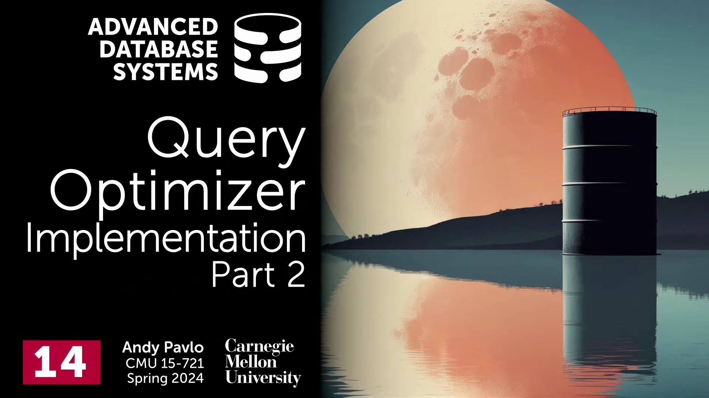
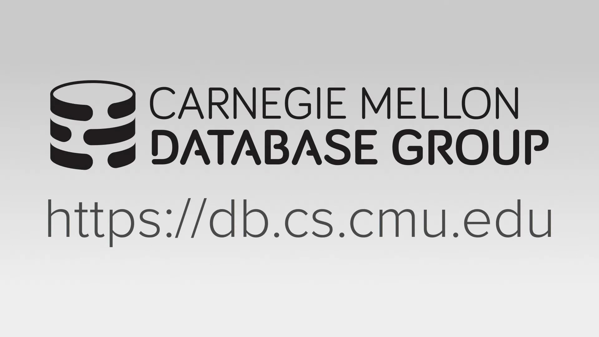
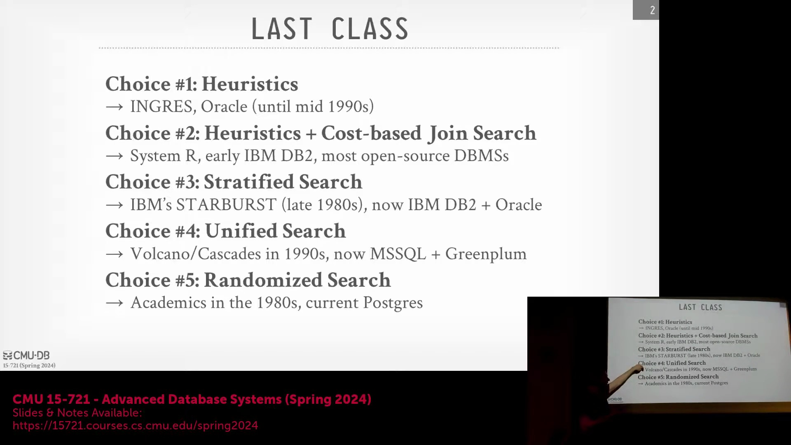
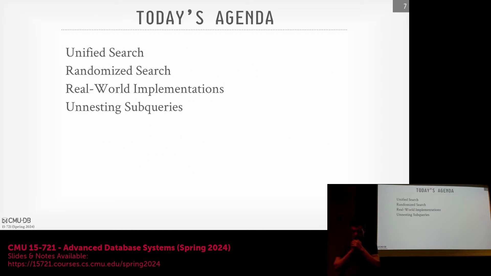
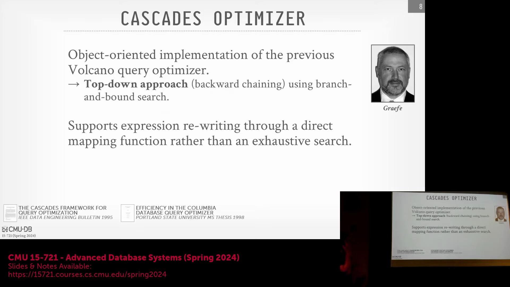
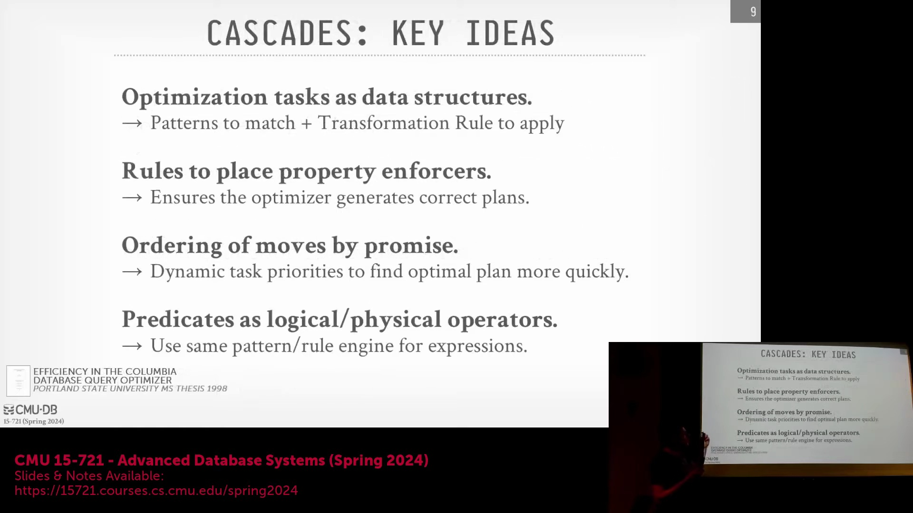
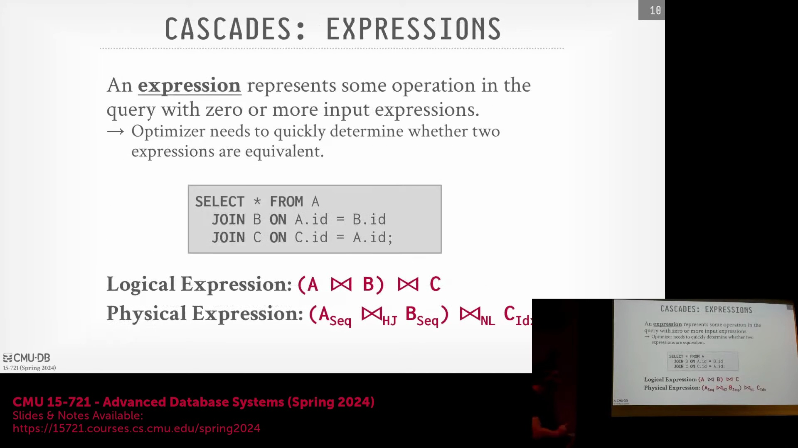

## 简介与课程安排
讲师首先进行了简短的开场，并分享了一则趣闻：他在夏威夷度假时意外收到了一块烧坏的 Oracle 压缩芯片(Compression Chip)。随后，他切入正题，指出本节课将延续上节关于查询优化(Query Optimization)的讨论。为保证内容清晰易懂，他将适当放缓讲解节奏，重点剖析 Cascades 优化器(Cascades Optimizer)的运行机制、随机化搜索(Randomized Search)技术，以及当日指定的阅读文献。

## 查询优化的演进：分层搜索与统一搜索
课程回顾了查询优化(Query Optimization)技术的历史演进：从早期基于启发式规则(Heuristic Rules)的基础模式匹配，到 20 世纪 70 年代 System R 引入的基于成本模型(Cost Model)的连接搜索(Cost-based Join Search)，最终演变为现代多种随机化搜索(Randomized Search)的变体。本节核心在于厘清“分层搜索(Stratified Search)”与“统一搜索(Unified Search)”两种策略的差异。分层搜索包含两个明确阶段：首阶段仅应用无成本模型的启发式规则，次阶段才引入基于成本的搜索。统一搜索则试图同步处理所有转换逻辑，高度依赖记忆表(Memo Table)以规避无限循环，并过滤冗余或高开销的转换路径。讲师指出，尽管 Cascades 与 SQL Server 等系统在架构上属于统一搜索，但其规则调度机制通常仍模拟分层搜索的工作流。

## 自上而下与自下而上的优化范式
随后，讨论聚焦于优化器的构建方向：自上而下(Top-Down)与自下而上(Bottom-Up)。Cascades 采用自上而下的策略，从期望的最终查询结果出发，沿逻辑树向下递归装配所需算子(Operator)。相比之下，经典的 System R 采用自下而上的路径，从基本表(Base Tables)出发，逐步叠加算子直至构建出完整计划。尽管这两种范式在理论上可相互融合，但各自在特定场景下具备独特的优化优势。针对学生提问，讲师澄清：分层搜索(Stratified Search)在本质上并非自下而上。他强调，当前主流开源系统多倾向采用自下而上的架构；甚至 Cascades 的缔造者也建议，现代数据库设计宜采用混合分层策略（即先执行基础启发式规则，再开展自下而上的连接顺序优化(Join Ordering Optimization)）。

## Cascades 框架：历史与核心创新
本讲大纲涵盖以下内容：统一搜索(Unified Search)机制回顾、随机化搜索(Randomized Search)的实际应用、主流优化器横向对比（Calcite、Orca、CockroachDB），以及子查询反嵌套(Subquery Unnesting)相关论文研读。Cascades 框架被定位为 Goetz Graefe 研发的第三代查询优化器(Query Optimizer)，承袭自 Exodus 与 Volcano 系统。尽管 Volcano 首创了迭代器模型(Iterator Model)与并行查询执行(Parallel Query Execution)，但因需即时物化(Materialization)所有树节点，长期受困于搜索空间爆炸(Search Space Explosion)与内存膨胀(Memory Bloat)问题。Cascades 的核心突破在于引入自上而下的分支限界搜索(Branch-and-Bound Search)，并结合表达式树的增量物化(Incremental Materialization)技术，大幅削减了优化阶段的冗余内存消耗与计算开销。

## Cascades 的四大核心架构原则
Cascades 的架构奠基于四大核心原则。其一，优化规则(Optimization Rules)被定义为结构化数据对象，明确包含匹配模式(Matching Pattern)、转换逻辑(Transformation Logic)及可调度的执行优先级(Execution Priority)（注：现代实现如微软 SQL Server 的版本已极少动态调整优先级）。其二，算子(Operator)需显式声明其依赖的物理属性(Physical Properties)（如数据排序顺序、压缩编码格式），从而保障执行树(Execution Tree)中父子节点间的严格兼容。其三，优化器会依据搜索进程动态重组规则的评估次序，以加速逼近最优执行计划。其四，Cascades 采用单一且统一的优化引擎，协同完成逻辑算子至物理算子的映射(Logical-to-Physical Mapping)与表达式优化(Expression Optimization)（涵盖 WHERE、HAVING、JOIN 等子句），彻底摒弃了 MySQL 等传统系统中繁琐的多轮独立优化流程。

## 表达式与物理实现的定义
在 Cascades 模型中，“表达式(Expression)”泛指查询计划中接收零个或多个输入的任何操作单元，既可充当叶节点，亦可作为中间算子。此类表达式可被逻辑分组(Logical Grouping)，用以表征更高层级的查询结构。以表 A、B、C 的连接为例：初始连接操作构成一个逻辑表达式；若调整连接次序，则会在同一逻辑分组(Expression Group)内衍生出异构的逻辑表达式。此后，每个逻辑表达式均可被评估并映射至多种物理实现(Physical Implementation)，使优化器得以在敲定最终执行计划前，充分探索并量化不同执行策略的成本(Cost)。
