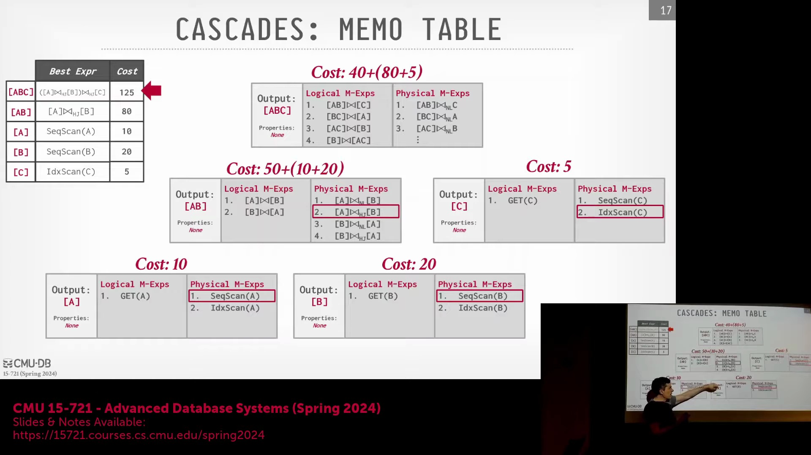
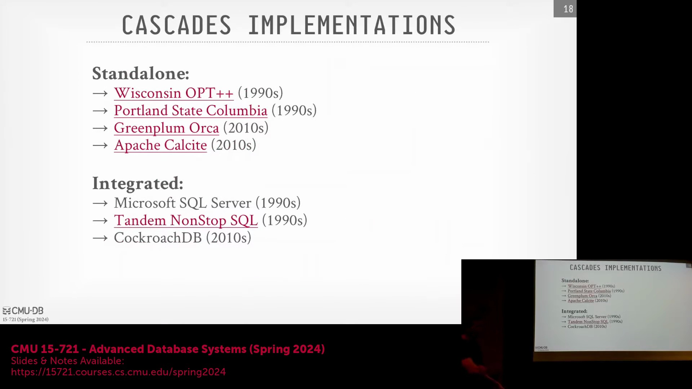
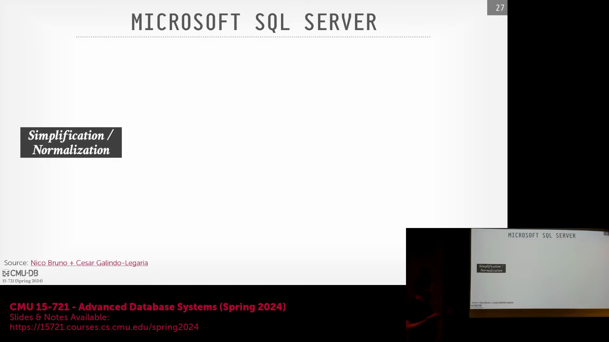
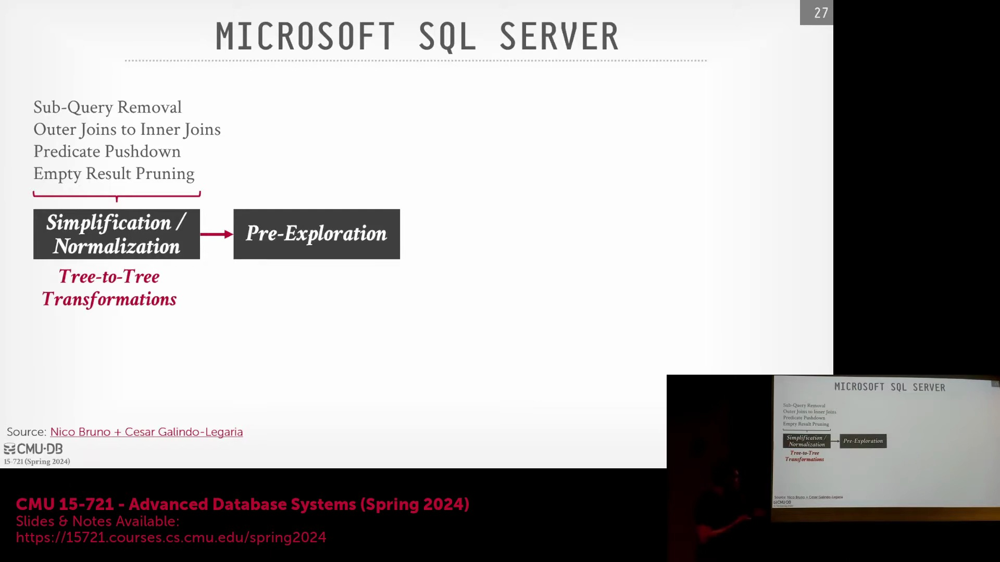

## 备忘录表中的数据属性跟踪

优化器直接在备忘录表(Memo Table)中持续跟踪特定的数据属性，例如排序顺序(Sort Order)、列投影(Column Projection)和压缩格式(Compression Format)。当下游操作符(Downstream Operator)（如归并连接(Merge Join)）需要预排序输入(Pre-sorted Input)时，系统会查询备忘录表，以找出已满足该属性要求的最低代价扫描方案(Lowest-cost Scan Plan)，从而避免引入冗余的排序操作(Sort Operator)。备忘录表为单个逻辑表达式(Logical Expression)维护多个代价条目(Cost Entry)，每个条目均标记有对应的输出属性集(Output Property Set)。尽管跟踪所有可能的组合理论上会引发组合爆炸(Combinatorial Explosion)，但现代系统通过应用转换规则(Transformation Rule)或将优化提示(Optimization Hint)下推(Push Down)至表达式树(Expression Tree)来有效管理这种复杂性。这些提示会显式地请求或排除某些属性，使优化器能够灵活适应行式存储与列式存储(Row-store vs. Column-store)或分布式数据布局(Distributed Data Layout)等架构差异，而无需盲目地物化(Materialize)所有变体。

## 自适应查询执行与运行时触发器
在自底向上(Bottom-up)的优化框架中，实现自适应查询执行(Adaptive Query Execution)（即根据实际数据特征在运行时动态调整执行计划）在概念上更为直观。在该方法中，系统在执行数据处理时可动态切换物理操作符(Physical Operator)（例如从索引扫描(Index Scan)回退至顺序扫描(Sequential Scan)），而无需从根节点重新遍历整个执行计划。为避免引入沉重开销，现代优化器会将轻量级的“触发器”(Trigger)或探针(Probe)直接嵌入物理计划中。这些探针充当运行时检查点(Runtime Checkpoint)，用于验证实际运行时统计信息（如基数(Cardinality)或选择率(Selectivity)）是否与优化器的初始估算相匹配。若检测到显著偏差(Deviation)，触发器可启动简单的自适应调整，例如将聚合操作(Aggregate Operation)下推(Push Down)至远程节点，或直接中止存在严重缺陷的查询计划。与插入高开销中间操作符的做法不同，这些触发器仅带来极小的执行开销，并允许代价模型(Cost Model)在初始规划阶段便将动态调整所需的安全边际(Safety Margin)纳入考量。

## 历史背景与 Cascades 的实现

Cascades 优化器框架(Optimizer Framework)源自 1994 年的一篇开创性论文，其本质是一份架构蓝图(Architectural Blueprint)，而非单一的开源代码库。早期的学术实现包括威斯康星大学开发的 OP++ 与哥伦比亚大学的相关系统，随后衍生出商业改编版本，例如 Greenplum 数据库中的 Orca 优化器，其以独立的“优化器即服务”(Optimizer-as-a-Service)模式运行。微软在引入该框架的核心作者后，对该架构进行了深度投入，并在其数据产品生态系统中集成了一套经过深度分支定制(Forked)与持续演进的 Cascades 优化器版本。该架构谱系(Architectural Lineage)广泛覆盖了 SQL Server、Azure Synapse Analytics 以及 Cosmos DB。与通常依赖动态规则引擎(Dynamic Rule Engine)或领域特定语言(Domain-Specific Language, DSL)的学术原型不同，微软的生产级实现(Production-grade Implementation)完全采用 C++ 编写，并利用硬编码(Hardcoded)的 `if-else` 逻辑来执行规则转换(Transformation)。该设计优先考虑优化器的编译期性能(Compilation Performance)与系统稳定性，而非纯粹的声明式规则匹配(Declarative Rule Matching)。

## 分阶段优化与预探索

为避免盲目穷举搜索(Exhaustive Search)带来的低效问题，现代 Cascades 实现将优化过程划分为明确且连续的阶段(Phases)，而非一次性应用所有规则。初始阶段严格专注于逻辑简化(Logical Simplification)与查询规范化(Query Normalization)。该阶段涵盖子查询(Subquery)处理、在谓词条件允许时将外连接(Outer Join)转换为内连接(Inner Join)、过滤器下推(Filter Pushdown)，以及剪枝(Pruning)逻辑上不可能返回结果的查询（例如 `WHERE 1=0`）。通过提前消除这些结构性低效问题，优化器在进入物理代价评估(Physical Cost Evaluation)之前，已显著缩减了搜索空间(Search Space)。

后续阶段被称为“预探索”(Pre-exploration)，该阶段在不执行完整基于代价搜索(Cost-based Search)的前提下，策略性地向备忘录表注入高概率的物理候选方案(Physical Candidate Plan)。通过早期识别并植入潜力表达式，优化器为后续的主搜索阶段(Main Search Phase)确立了搜索偏向(Search Bias)。这种引导式搜索(Guided Search)机制使基于代价的引擎(Cost-based Engine)能够优先探索已知的高效模式，根据早期发现动态调整规则优先级(Rule Priority)，并快速剪枝低效或次优的搜索分支(Suboptimal Branch)。最终，该机制构建出一种平衡的工作流(Workflow)，在保障优化全面性的同时，大幅降低了查询编译延迟(Query Compilation Latency)。