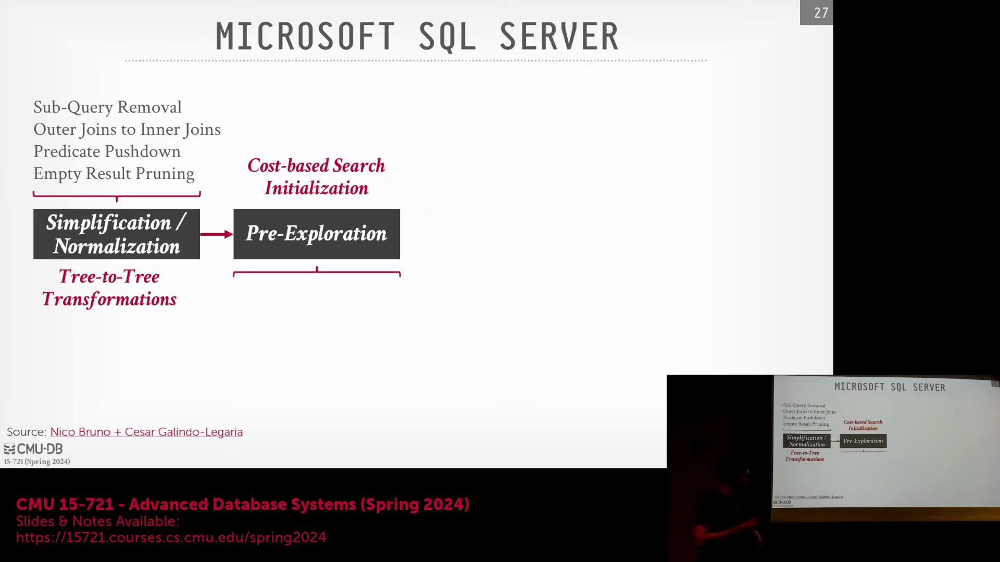
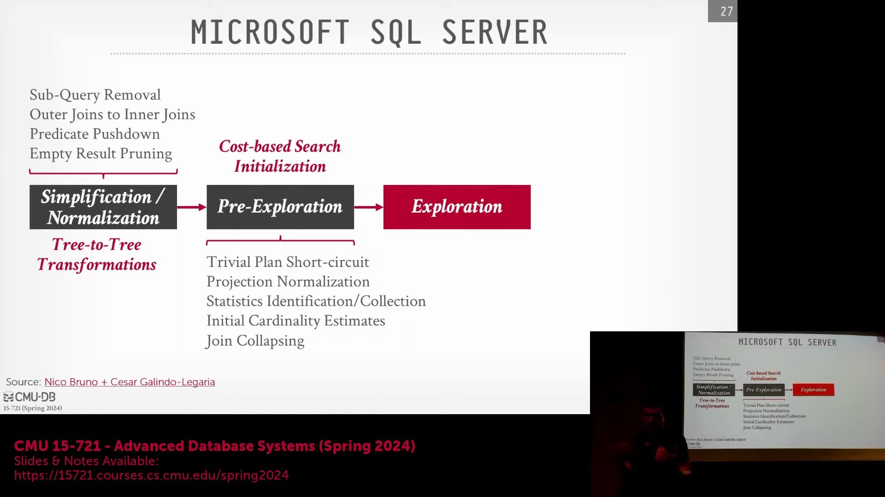
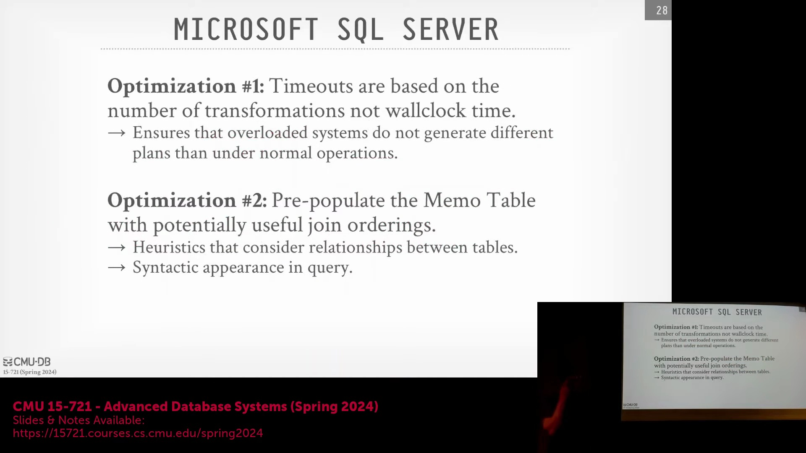

## 早期优化阶段与动态统计信息收集

优化过程首先处理一些简单的计划捷径(Plan Shortcuts)，例如 `SELECT 1` 或 `LIMIT 0`，并对投影进行规范化(Projection Normalization)以清理输出列。此阶段的一个显著特性是动态统计信息管理(Dynamic Statistics Management)：若优化器发现缺乏进行精确代价估算(Cost Estimation)所需的统计信息(Statistics)，它将暂停规划过程，并指示数据库立即执行 `ANALYZE` 命令。待统计信息收集完毕后，系统将继续执行初始基数估算(Initial Cardinality Estimation)，并应用连接折叠(Join Collapsing)等逻辑转换(Logical Transformation)，从而为进入更复杂的搜索阶段(Search Phase)奠定坚实基础。

## 多阶段基于代价的搜索与引擎特定规则

核心的基于代价搜索(Cost-based Search)以渐进式多阶段工作流(Progressive Multi-stage Workflow)运行，旨在在编译速度(Compilation Speed)与计划质量(Plan Quality)之间取得平衡。在初始阶段，优化器仅将转换规则应用于主键查找(Primary Key Lookup)等简单场景。若计算时间充裕，系统将逐步扩大搜索空间(Search Space)，以评估并行执行策略(Parallel Execution Strategy)与多表连接(Multi-table Join)，并在必要时最终探索完整计划空间(Full Plan Space)。在最后阶段，优化器会应用针对目标架构量身定制的引擎特定转换(Engine-specific Transformation)，例如为 Azure Synapse 等云数据仓库实现分布式连接(Distributed Join)或广播连接(Broadcast Join)。这种分层优化策略(Layered Optimization Strategy)确保在投入算力探索复杂且针对特定硬件的计划变体(Hardware-specific Plan Variant)之前，基础优化工作已得到充分处理。

## 确定性超时与备忘录表初始化填充

为确保在不同硬件负载下生成可重现的查询计划(Reproducible Query Plan)，现代优化器采用基于已应用的转换规则次数(Transformation Count)而非物理时钟时间(Wall-clock Time)来衡量搜索超时(Search Timeout)。该机制有效避免了因系统拥塞(System Congestion)导致相同查询生成不同执行计划(Execution Plan)的问题。在预探索阶段(Pre-exploration Phase)，优化器会根据早期查询分析结果，策略性地向备忘录表(Memo Table)和表达式组(Expression Group)预填充初始候选项(Initial Candidates)。系统不再盲目探索所有组合或依赖 SQL 语句中表的文本顺序(Textual Order)，而是预先注入高概率的连接顺序(Join Order)与物理候选计划(Physical Candidate Plan)。这种引导式初始化(Guided Initialization)机制使基于代价的引擎(Cost-based Engine)能够快速识别并锁定最优策略，从而避免执行低效的穷举搜索(Exhaustive Search)。

## 独立优化器框架：Calcite 与 Orca 的对比
数据库生态系统广泛采用独立的“优化器即服务”(Optimizer-as-a-Service)框架，以规避重复实现核心优化逻辑。Apache Calcite 源自 LucidDB 项目，是一款基于 Java 的高度可插拔优化器(Pluggable Optimizer)，原生支持多种 SQL 方言(SQL Dialect)。系统集成者仅需定义目录模式(Catalog Schema)、计划表示形式(Plan Representation)及自定义转换规则(Custom Transformation Rule)，即可将其无缝适配至各类专用数据库引擎中。相比之下，Orca（最初专为 Greenplum 与 HAWQ 开发）是一款基于 C++ 实现的优化器，深度聚焦于现代并行与分布式查询执行(Parallel and Distributed Query Execution)。尽管 Orca 在方言无关性(Dialect-agnostic Capability)上不及 Calcite，但它仍是基于 PostgreSQL 架构的分布式系统中功能强大且持续维护的优选方案，为重型分析型工作负载(Heavy Analytical Workload)提供了高度专业化的替代路径。

## 优化器调试与代价模型验证
当开发人员无法直接访问客户生产环境的数据或硬件配置时，在本地部署中调试性能回退(Performance Regression)极具挑战性。为应对该难题，先进优化器内置了深度诊断功能，支持导出内部搜索状态的完整转储(Full State Dump)。该转储详细记录了所有规则应用(Rule Application)与决策分支(Decision Branch)，从而有效支持异地根本原因分析(Remote Root Cause Analysis)。此外，为维持长期的估算精度，部分系统实现了自动化的代价模型验证例程(Cost Model Validation Routine)。优化器会提取排名靠前的 N 个候选计划(Top-N Candidate Plan)，在后台静默执行，并将实际执行代价(Actual Execution Cost)与初始估算值(Initial Estimate)进行比对。这种基于经验数据的反馈闭环(Feedback Loop)使系统能够持续校准代价模型(Cost Model)与计算公式，确保理论预测与实际执行行为保持高度一致。