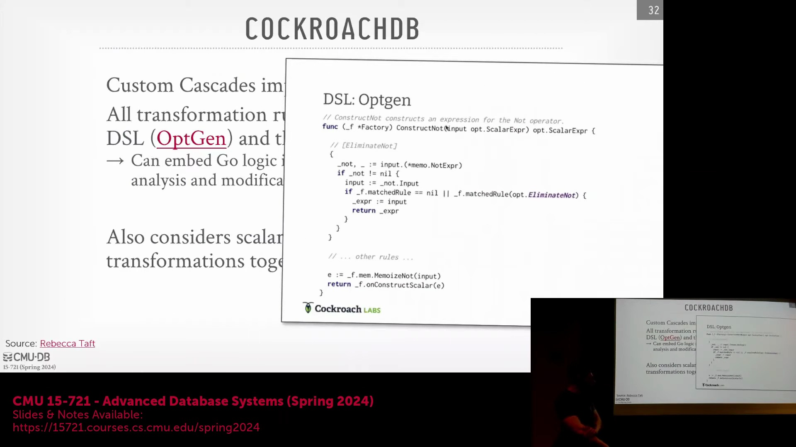
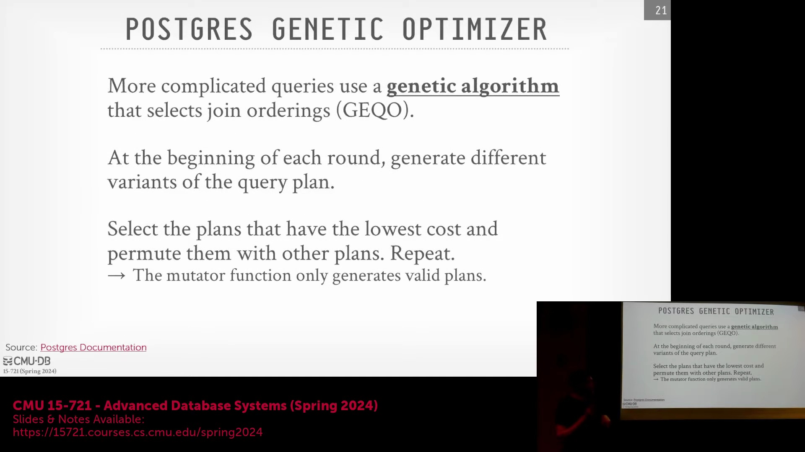
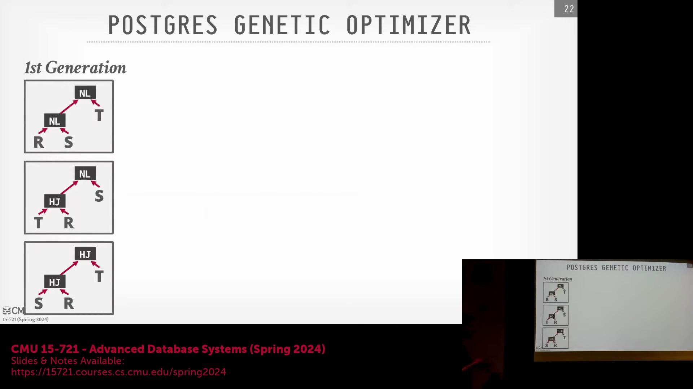
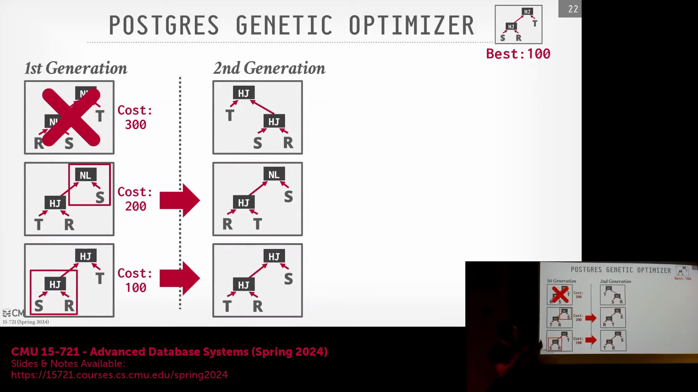
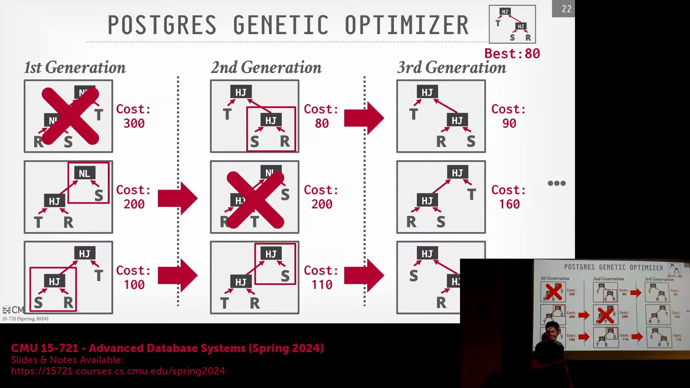
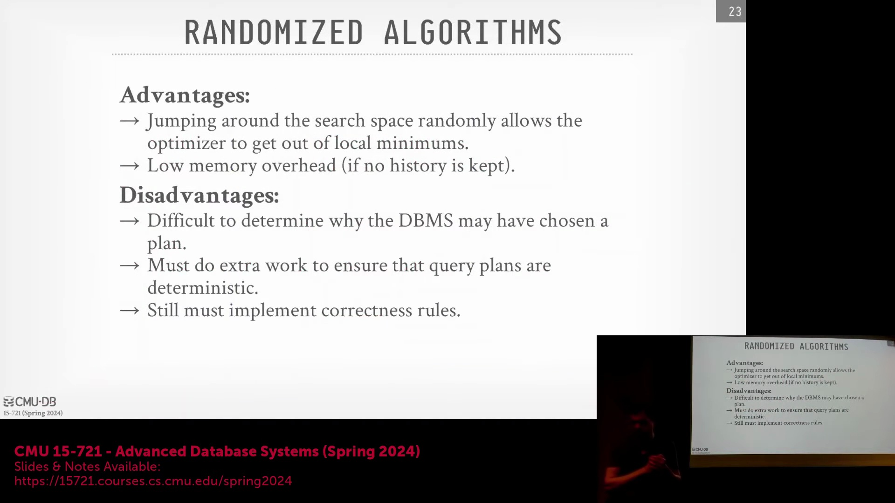
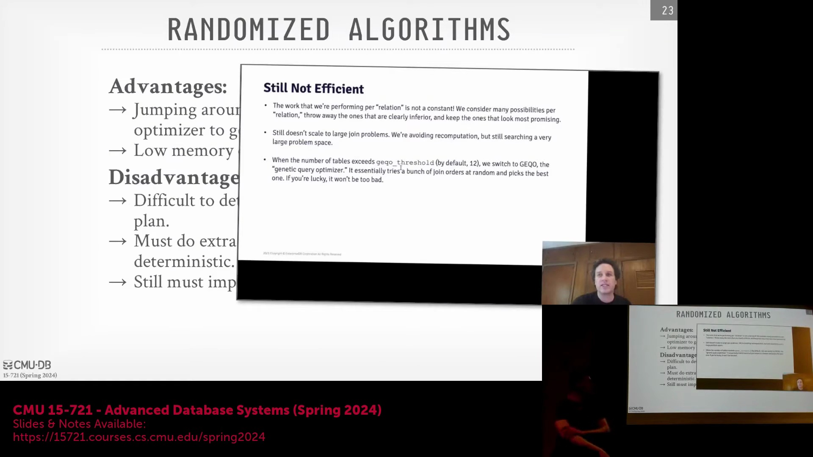
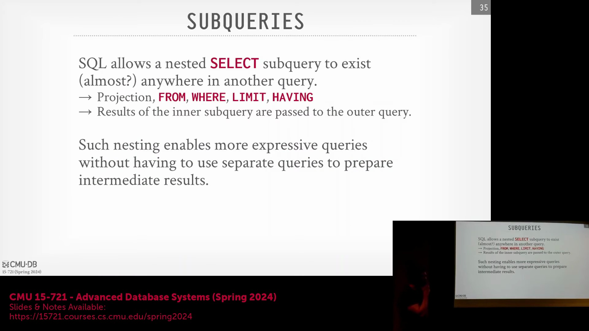

## CockroachDB 的 DSL 驱动型 Cascades 优化器

尽管早期系统（如 MongoDB）在历史上缺乏传统的逻辑与物理操作符分离机制(Separation of Logical and Physical Operators)，但 CockroachDB 使用 Go 语言从零开始完全重写了其查询优化器(Query Optimizer)。该优化器紧密遵循 Cascades 框架(Cascades Framework)，并引入了一种专用的领域特定语言(Domain-Specific Language, DSL)，用于以声明式方式定义转换规则(Transformation Rules)与模式匹配(Matching Patterns)。此 DSL 会被直接转译(Transpile)为高度优化的 Go 代码，并在数据库引擎内核中执行。当遇到无法通过 DSL 完整表达的复杂转换时，开发者可无缝切换至原生 Go 代码。这种混合架构(Hybrid Approach)有效平衡了基于规则的优雅性(Rule-based Elegance)与命令式编程的灵活性(Imperative Control Flexibility)。

## 随机搜索策略与模拟退火
为突破确定性自顶向下(Top-down)或自底向上(Bottom-up)遍历的局限，早期研究探索了应用于查询优化的随机搜索策略(Stochastic Search Strategy)。1987 年的一篇奠基性论文首次将模拟退火算法(Simulated Annealing Algorithm)引入该领域：优化器从初始物理计划(Initial Physical Plan)出发，随机交换操作符(Operators)或调整连接顺序(Join Order)。即便某次变换导致估算代价(Estimated Cost)上升，算法仍会以特定概率接受该变更，从而辅助搜索过程跳出局部极小值(Local Minimum)。核心难点在于，优化器必须对每次随机扰动进行语义等价性验证(Semantic Equivalence Check)，例如严格维持外连接(Outer Join)的输入顺序约束。尽管该策略在理论上颇具吸引力，但受限于其不可预测性(Unpredictability)与高昂的验证开销(Validation Overhead)，现代生产系统已极少采用。

## 用于复杂连接排序的遗传算法

为应对大型连接查询中的组合爆炸(Combinatorial Explosion)问题，PostgreSQL 引入了一种遗传算法(Genetic Algorithm)，通常在查询涉及的表数量超过 12 张时触发。优化器放弃对全表达式空间(Expression Space)的穷举搜索，转而生成一组随机查询计划种群(Population)，并评估其估算代价(Estimated Cost)。算法保留适应度最高(Fittest)的计划，淘汰表现最差的个体，并对幸存计划应用变异(Mutation)与交叉(Crossover)操作以繁衍下一代。其核心目标是通过迭代演化(Iterative Evolution)筛选并固化有益“特征”（如特定的连接顺序(Join Order)或访问路径(Access Path)），直至收敛至可接受的近似最优计划。

## 确定性、工程权衡与实现批评

尽管遗传算法为处理超大规模连接图(Large-scale Join Graph)提供了一种可扩展的替代方案，但也引入了显著的工程复杂性(Engineering Complexity)。优化器必须确保所有随机变换均具备语义有效性(Semantic Validity)，并在多次执行中保持严格确定性(Determinism)，以保障执行计划的可重现性(Plan Reproducibility)。尽管该算法在处理 30 张表以上的超大规模连接查询时具备理论优势，但复杂验证规则的维护开销(Maintenance Overhead)往往抵消了其收益。负责该模块的 PostgreSQL 核心开发者曾坦言该实现“存在缺陷”(Flawed)，指出其未能严格遵循经典遗传原理，且无法保证最优特征(Optimal Traits)在种群迭代中稳定遗传。因此，学界普遍认为该机制仅是一种务实但欠完善的权宜之计(Pragmatic Workaround)，而非严谨稳健的优化策略。

## 子查询的普遍性挑战

子查询(Subquery)凭借其极高的表达灵活性，已成为 SQL 优化(SQL Optimization)中最复杂的处理单元之一。它们可被嵌套嵌入(Embed)至查询的任意位置，涵盖 `SELECT` 列表、`WHERE` 条件、`FROM` 子句乃至 `ORDER BY` 表达式。这种无处不在的嵌入特性迫使优化器必须妥善应对深度嵌套结构(Deeply Nested Structures)、关联引用(Correlated References)以及动态结果集(Dynamic Result Sets)。在解析此类结构时，优化器需审慎决策：是将其扁平化(Flattening)为标准连接(Standard Join)、作为独立子计划独立求值(Independent Evaluation)，还是应用专门的去关联化(Decorrelation)技术。其核心目标是在严格保障语义正确性(Semantic Correctness)的前提下，将整体执行开销(Execution Overhead)降至最低。