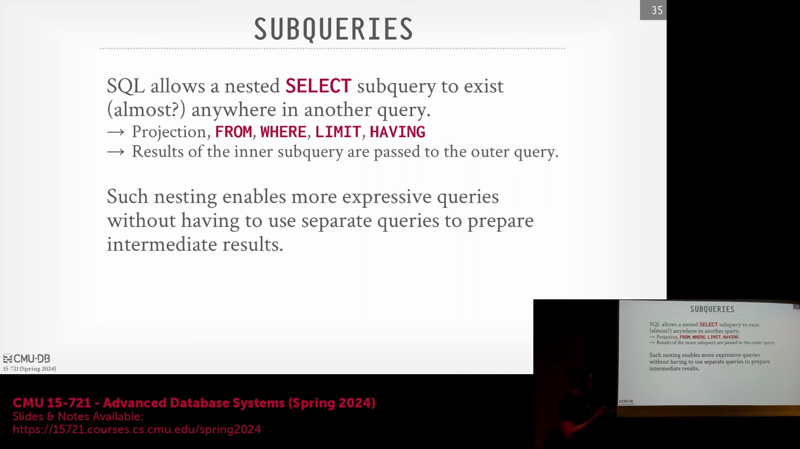
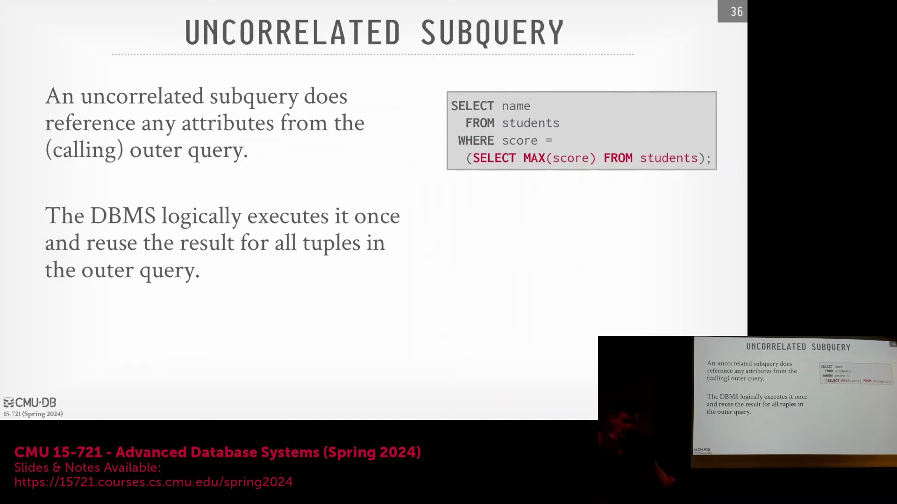
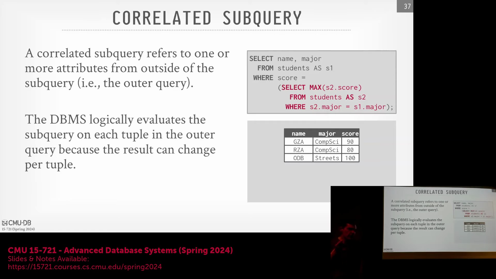
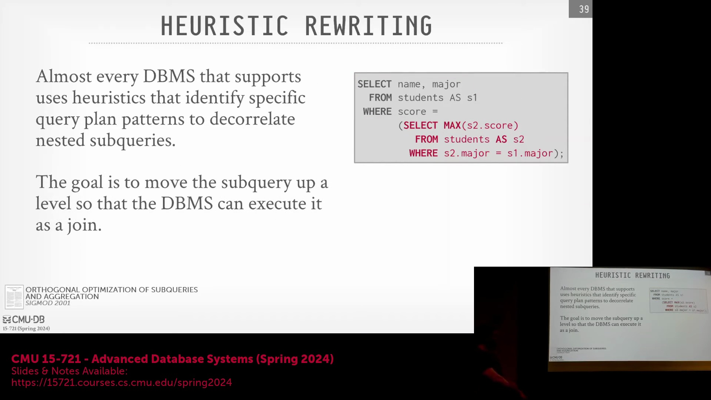
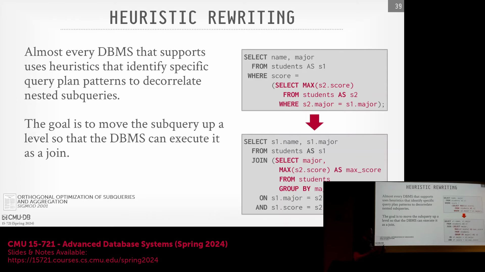
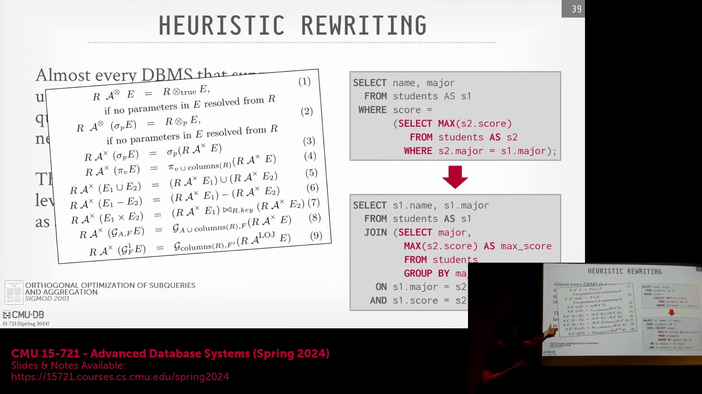
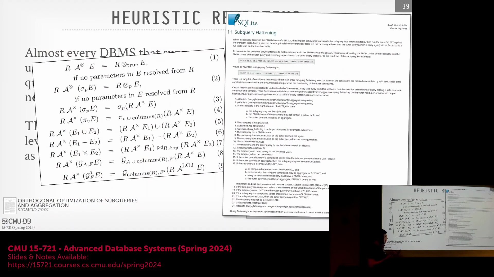
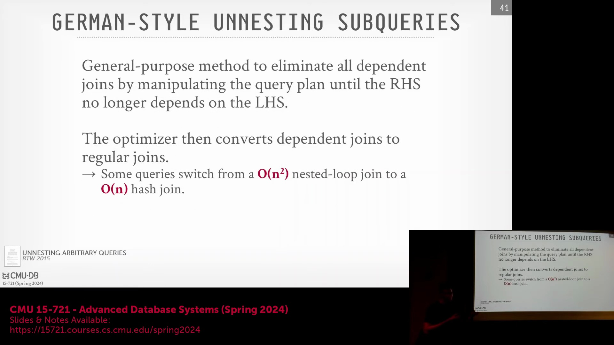
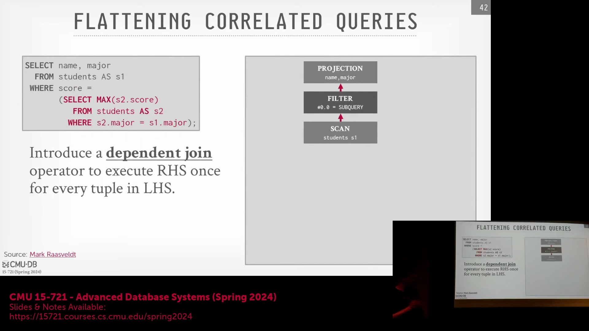

## 子查询简介及其函数类比

课程首先探讨了嵌套查询(Nested Queries)或子查询(Subqueries)的概念。虽然在理论上可以将 `SELECT` 语句直接嵌套于 `ORDER BY` 子句中，但在实际数据库系统中通常不受支持。对于子查询，更准确的思维模型是将其视为一个函数：外层查询(Outer Query)可以将上下文信息传递给内层查询(Inner Query)，内层查询处理这些数据后返回结果供外层查询使用。这一特性极具价值，因为它允许开发者在单个 SQL 语句中表达复杂的多步骤数据操作，从而避免了在临时表(Temporary Tables)中手动暂存中间结果或执行多个独立查询的繁琐过程。

## 不相关子查询(Uncorrelated Subqueries)与相关子查询(Correlated Subqueries)
在查询处理(Query Processing)中，一个关键的区别在于不相关子查询和相关子查询。不相关子查询逻辑相对简单，且在现代数据库系统中得到了广泛支持。其定义特征是执行过程完全独立于外层查询，即不引用外部作用域(Outer Scope)中的任何列、属性或元组(Tuple)。因此，数据库引擎只需在逻辑上对内层查询求值(Evaluate)一次。该结果只需物化(Materialize)一次，便可高效地应用于外层查询处理的每一行。例如，若要找出总分最高的学生，只需扫描一次 `students` 表以计算 `MAX(score)`，然后将该单一标量值(Scalar Value)应用于外层的过滤条件(Filter Condition)。

## 相关子查询的执行开销
然而，相关子查询会带来显著的性能挑战。在此类场景中，内层查询会显式引用外层查询的列或值。这种依赖关系迫使数据库引擎以嵌套循环(Nested Loop)的方式重复执行内层查询：针对外层查询处理的每一个元组，都必须对内层子查询进行完整的顺序扫描(Sequential Scan)或求值。例如，在查找特定专业内成绩最高的学生时，引擎必须扫描内层表，根据当前外层元组的专业进行过滤(Filter)，计算最高分并进行比较。该过程会对随后的每一行重复执行，若未进行优化，其时间复杂度(Time Complexity)会迅速攀升至 $O(N^2)$。此类子查询可出现在多种 SQL 子句(SQL Clauses)中（如 `WHERE`、`FROM`、`SELECT`，有时还包括 `LIMIT`），这使得它们的优化高度依赖于具体上下文(Context)。

## 优化目标：子查询展开为连接操作
现代查询优化器(Query Optimizer)的主要目标是将相关子查询“上提”或展开(Unnest)，使其与外层查询处于相同的逻辑层级。通过将内层查询上提，优化器可将其重写为标准的关系型连接(`JOIN`)操作。一旦转换为连接操作，数据库便可利用数十年来积累的高度成熟的优化技术，包括动态连接顺序优化(Join Ordering)、索引选择(Index Selection)以及先进的物理连接算法（如哈希连接(Hash Join)或归并连接(Merge Join)）。这些算法的性能远优于朴素的嵌套循环。重写过程通常涉及将内层查询移至 `FROM` 子句，调整分组逻辑（如 `GROUP BY major`），并对齐投影(Projection)输出，以确保重写后的计划与原始嵌套结构在语义上等价(Semantically Equivalent)。

## 手工构建的基于规则系统的局限性
历史上，子查询展开是通过大量手工编写的规则集(Rule Sets)来管理的。在 SQL-99 标准正式规范嵌套查询之后，微软等数据库厂商开发了依赖海量启发式规则(Heuristics)的系统。例如，SQL Server 的优化器曾依赖超过 22 条不同的规则，来确定何时以及如何对嵌套查询进行解相关(Decorrelation)。每条规则都充当严格的模式匹配条件：若查询匹配了特定的谓词组合(Predicate Combinations)（如 `=`, `IN`, `EXISTS`, `<`, `>`，以及半连接(Semi-Join)和反连接(Anti-Join)）及特定的子句位置，系统便会应用预定义的重写转换(Rewrite Transformation)。尽管这些基于规则的系统(Rule-Based Systems)针对已知模式相对易于实现，但其本质非常脆弱(Brittle)。它们难以覆盖由边缘情况(Edge Cases)、复杂 `WHERE` 子句以及横向连接(Lateral Joins)等高级构造所产生的庞大组合空间，这使得手工维护规则变得越来越低效。

## 通用重写框架
为克服启发式规则的局限性，一篇 2015 年的研究论文提出了首个用于解相关子查询的通用且数学严谨的方法。该方法能够系统地将*任意*相关子查询转换为一组标准连接操作，从而消除了对临时性模式匹配(Ad-hoc Pattern Matching)的依赖。其核心创新依赖于一种名为**依赖连接** (Dependent Join / Apply Operator) 的新逻辑算子，该算子功能类似于笛卡尔积(Cartesian Product)，但携带了明确的元数据，用以标识其源自相关上下文。优化器的重写过程利用该算子跟踪依赖关系，通过谓词下推(Predicate Pushdown)逐步优化，并最终消除相关标记。最终生成的是完全解相关的查询计划(Query Plan)，其中原本昂贵的 $O(N^2)$ 嵌套循环执行被高效的哈希连接或索引连接(Index Join)所取代，从而能够针对各类复杂查询实现稳健且自动化的优化。

