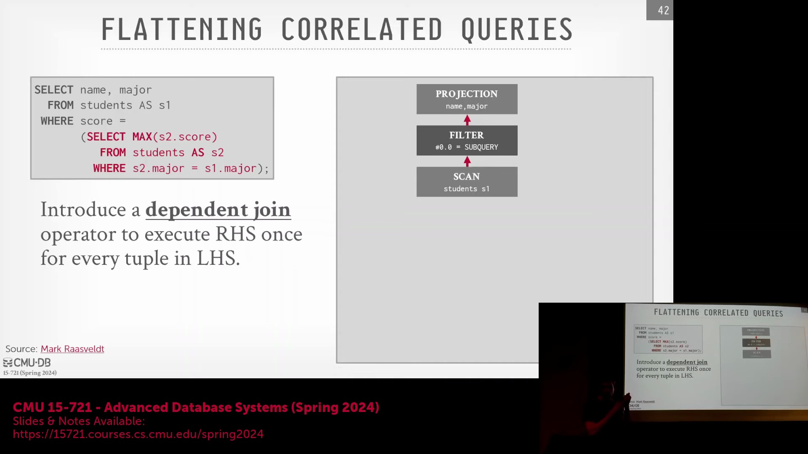
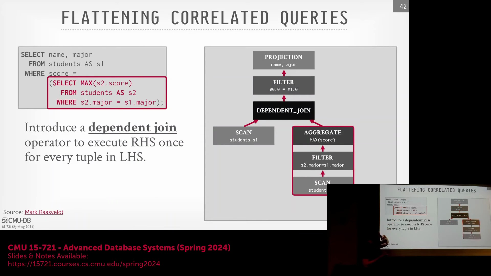
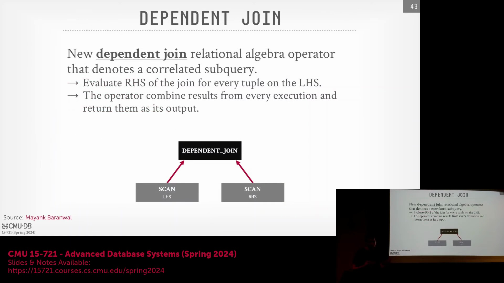
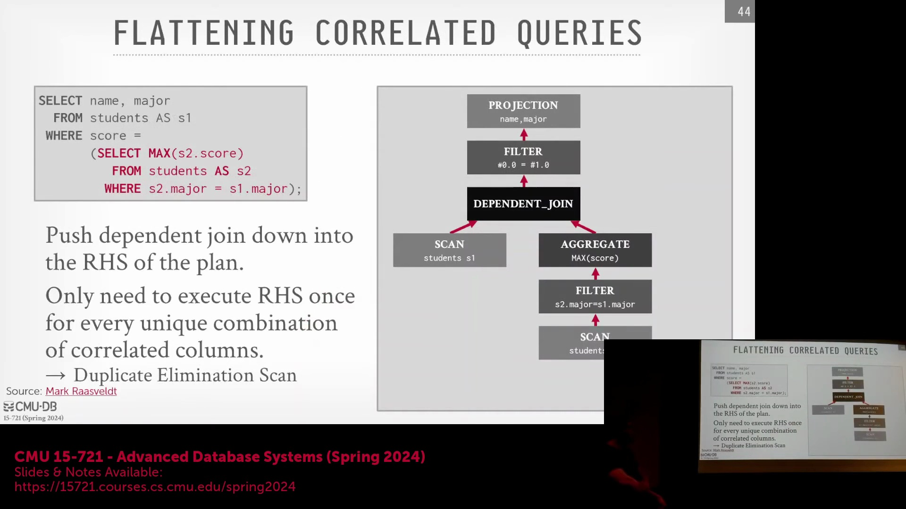
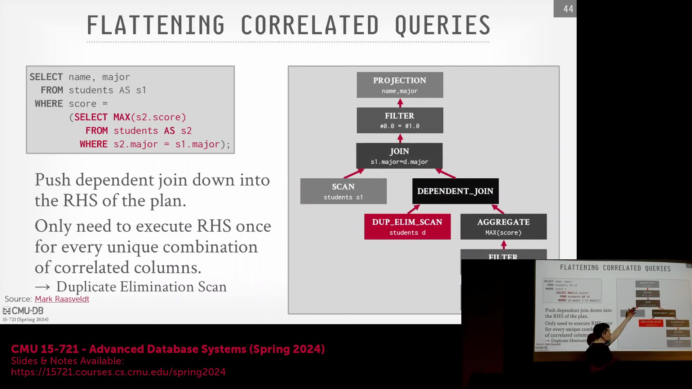
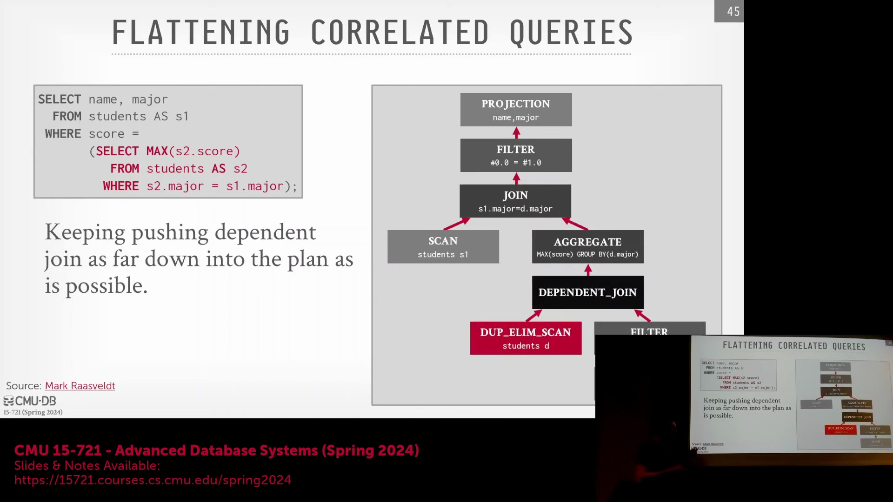
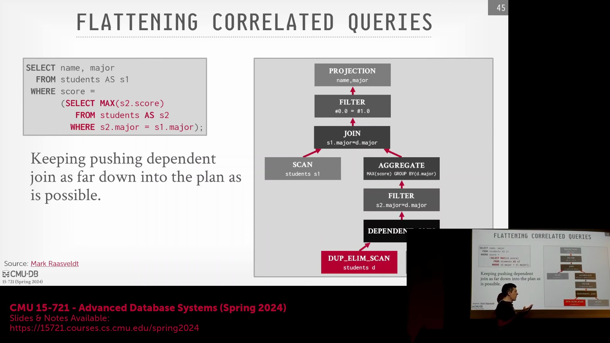
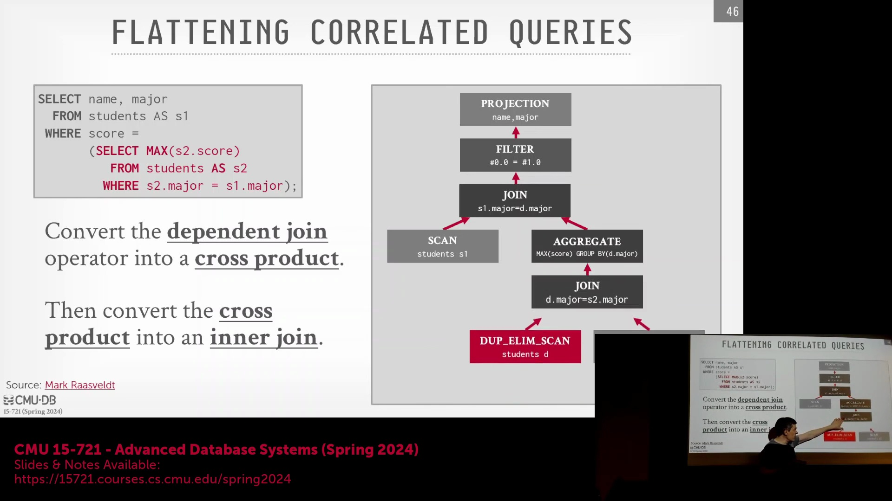
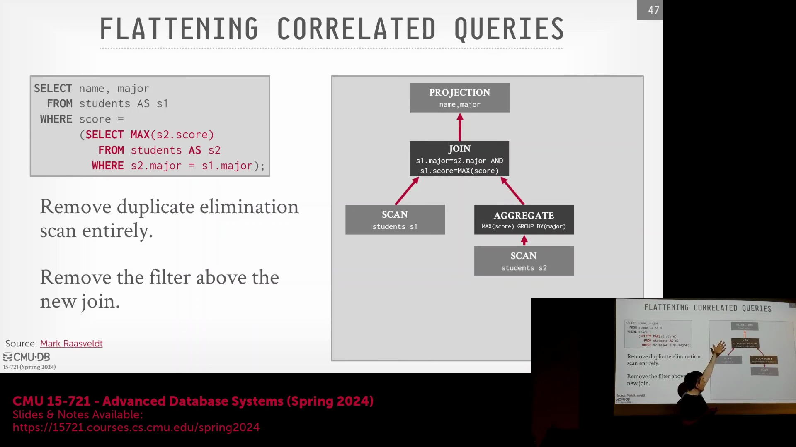
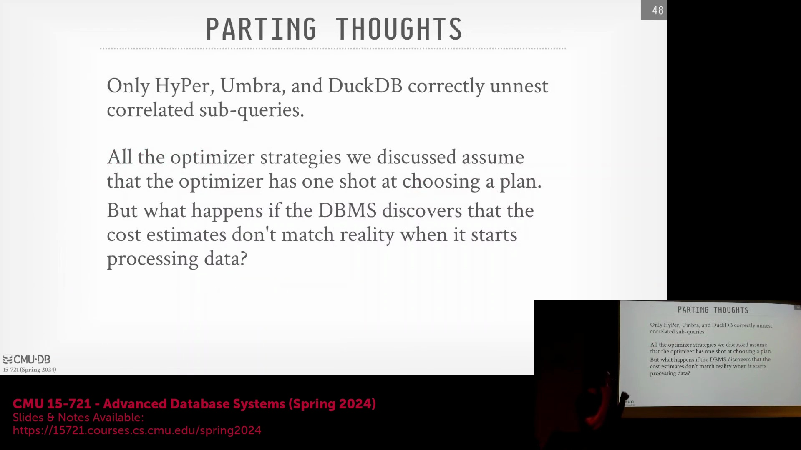

## 理解依赖连接与相关子查询
 优化过程始于评估系统处理查询计划(Query Plan)的常规方式。在相关子查询(Correlated Subquery)中，查询树的左侧通常对应外部表(Outer Table)的扫描，右侧则包含内部查询(Inner Query)。内部查询在其 `WHERE` 子句的谓词(Predicate)中显式引用了外部表的列值，从而确立了两者间的相关性(Correlation)。 
 需要强调的是，“依赖连接”(Dependent Join)并非数据库引擎中全新实现的物理算子(Physical Operator)。相反，它在查询计划中充当关系代数(Relational Algebra)的一种逻辑扩展。这种抽象机制使得优化器(Optimizer)能够清晰地推演针对相关子查询的特定转换规则，其本质等同于一个带有依赖跟踪标志(Dependency Tracking Flag)的交叉连接(Cross Join)。 
 从概念上讲，该操作会逐一遍历左侧的元组(Tuple)，并针对每个元组评估右侧查询以生成结果，其执行机制在本质上类似于笛卡尔积(Cartesian Product)。

## 转换策略：下推依赖连接
 核心优化目标是将依赖连接向下推(Pushdown)至查询计划的右侧（即内部查询侧），并最终在底层将其转换为标准的常规连接(Regular Join)。具体的转换策略在很大程度上取决于内部查询的语义结构与谓词条件。 
 优化器从左侧的表扫描(Table Scan)和右侧的内部查询出发，将依赖连接下推一层，并在外部查询与右侧输出之间构建常规连接。为确保转换过程的正确性，系统会引入一个额外的扫描算子专门用于去重(Deduplication)，其功能类似于 `SELECT DISTINCT` 或 `GROUP BY` 操作。

## 管理聚合与去重
 去重步骤确保每个元组具备唯一的属性组合，从而防止在执行依赖连接时产生冗余输出。例如，在计算每个专业(Major)的最高学生成绩时，该去重扫描确保了同专业的多名学生不会生成重复的记录条目。这种逻辑依赖跟踪机制使得依赖连接能够安全地穿透聚合算子(Aggregation Operator)继续下推。去重扫描随连接算子一同下移，而聚合操作则保留在其上方。输出语义保持不变：唯一的学生记录按专业和成绩进行分组后，再与外部学生表进行连接，从而计算出每个专业的最高分。聚合算子的位置有效强制执行了“每个专业仅对应一个最高分”的约束，这在评估各类连接谓词（如等值、非等值或 `NULL` 值处理）时至关重要。

## 穿越过滤条件与抵达物理执行
 继续下推过程，依赖连接可被移至过滤算子(Filter Operator)下方而不改变查询语义，因为连接后执行过滤在功能上等同于在常规连接期间应用 `WHERE` 子句。当依赖连接抵达叶节点（即基表扫描(Base Table Scan)）时，下推过程即告终止。在此阶段，逻辑层面的依赖连接将转换为其物理执行形式：笛卡尔积。此时，位于该交叉连接正上方的过滤条件会自然坍缩(Collapse)为标准的内连接(Inner Join)。 
 这种结构整合使得优化器能够将整个查询树视为传统的查询计划，进而顺利进入标准的基于成本的优化(Cost-Based Optimization, CBO)与物理执行策略生成阶段。

## 最终查询重写与系统实现
 通过识别到 `GROUP BY` 子句已隐含处理了去重逻辑，执行计划可被进一步简化。优化器将查询计划重写为直接的表扫描，并调整连接条件，使得一侧的专业字段与另一侧的专业字段及计算出的最高分相匹配。`GROUP BY` 的语义保证确保了每个专业仅对应一个分数值，从而大幅简化了执行路径。此类转换方法在数据库经典文献中已有详尽记载，通过将相关查询转化为标准连接，该机制可推广至处理各类相关子查询。目前，Hyper 与 Umbra 等先进数据库系统已完整实现该机制，而 Databricks 等平台则支持其部分变体。
 阐述这些技术的学术论文为现代查询优化器(Query Optimizer)的设计提供了清晰的蓝图。

## 应对不确定性与成本估算
 接下来，讨论将转向如何应对成本估算不准确或统计信息完全缺失的场景，例如在数据湖仓(Data Lakehouse)或 S3 环境中查询新加入且缺乏数据特征分析(Data Profiling)的文件。其核心解决方案在于动态数据特征分析(Dynamic Data Profiling)。 
 系统会首先执行基线查询计划(Baseline Query Plan)，并在其中嵌入运行时反馈钩子(Runtime Feedback Hooks)，以监控实际执行成本是否与初始估算相符。在引擎执行表扫描的过程中，系统会实时收集统计信息(Statistics)，并将其反馈至优化模型以校准后续的决策。 
 这种自适应方法(Adaptive Approach)确保了系统即使在缺乏先验数据知识(Prior Knowledge)的情况下，依然能保持稳健的性能表现。有关连接顺序选择(Join Order Selection)及其他边界情况(Edge Cases)的更多细节，将在下一节中展开详细讨论。