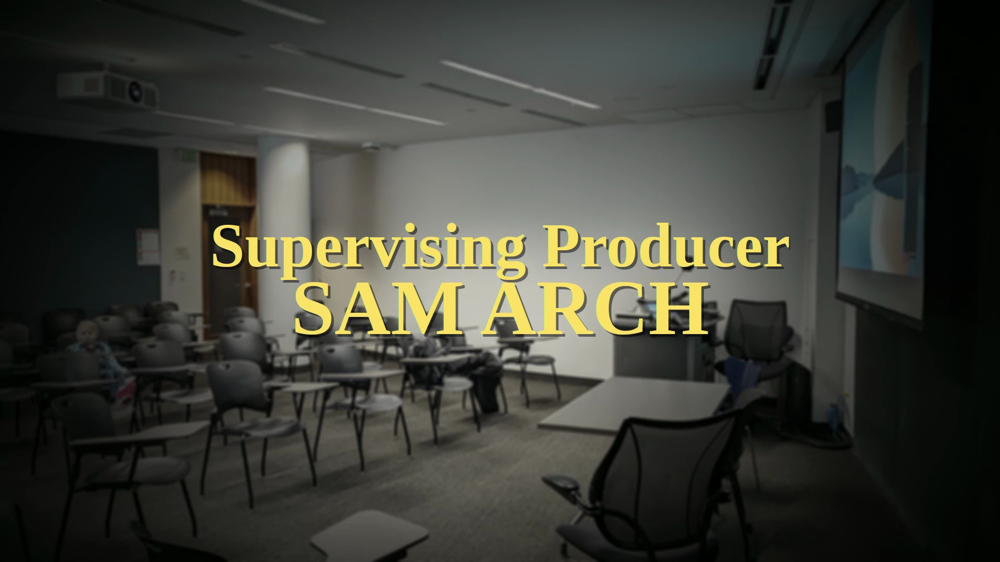
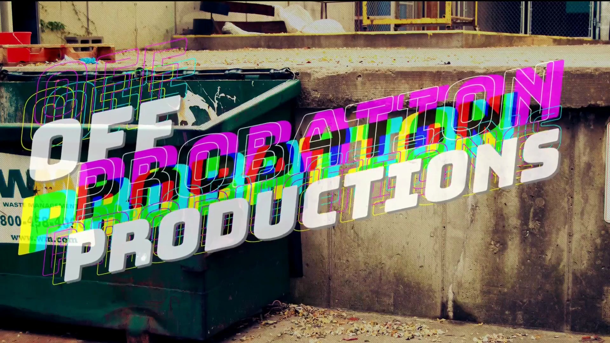

## 初始设置与物品操作
 视频开场时，桌面上整齐陈列着六个独立包装的物品，标签清晰可辨。随后镜头转向实操准备环节：铺展布料、旋开瓶盖、轻叩容器底部，逐步构建出一套井然有序的准备工作流(Workflow)。

## 谨慎操作与氛围转变
 随着流程的推进，抓绒面料(Fleece Fabric)与各类实用物件相继入镜。画外提示明确强调了需谨慎持握瓶体，与此同时，整体基调悄然转向一种非常规乃至“荒诞诙谐”的状态，隐隐透出某种不可预知的悬念。

## 摄取仪式与蜕变意象
 叙事脉络随即转入超现实主义的摄取意象，将“湿漆”(Wet Paint)与“饮用纱布”(Drinking Gauze)的指涉相互交织。通过对封装物质的反复提及，以及借由吞食达成灵魂救赎(Spiritual Redemption)的设定，文本深刻凸显了“吸收与转化”的核心主题。 
 这一仪式化阶段逐步推向高潮，着重刻画了持续摄入直至物质完全起效的过程，进而强化了“状态蜕变”与“刻意摄取”的核心母题(Motif)。

## 生动描绘与收尾叠句
 尾声部分引入了风格迥异、颇具美食隐喻的意象，诸如“辣椒芝士”(Chili Cheese)、“小麦纱布”以及一罐看似寻常却滚烫的容器内物。该序列最终以一段复沓且引人深思的叠句(Refrain)作结，营造出循环往复、余音绕梁的观感，为整段视觉叙事与主题演进圆满收束。