## 简介与课程安排
讲师首先进行了简短的开场，并分享了一则趣闻：他在夏威夷度假时意外收到了一块烧坏的 Oracle 压缩芯片(Compression Chip)。随后，他切入正题，指出本节课将延续上节关于查询优化(Query Optimization)的讨论。为保证内容清晰易懂，他将适当放缓讲解节奏，重点剖析 Cascades 优化器(Cascades Optimizer)的运行机制、随机化搜索(Randomized Search)技术，以及当日指定的阅读文献。

## 查询优化的演进：分层搜索与统一搜索
课程回顾了查询优化(Query Optimization)技术的历史演进：从早期基于启发式规则(Heuristic Rules)的基础模式匹配，到 20 世纪 70 年代 System R 引入的基于成本模型(Cost Model)的连接搜索(Cost-based Join Search)，最终演变为现代多种随机化搜索(Randomized Search)的变体。本节核心在于厘清“分层搜索(Stratified Search)”与“统一搜索(Unified Search)”两种策略的差异。分层搜索包含两个明确阶段：首阶段仅应用无成本模型的启发式规则，次阶段才引入基于成本的搜索。统一搜索则试图同步处理所有转换逻辑，高度依赖记忆表(Memo Table)以规避无限循环，并过滤冗余或高开销的转换路径。讲师指出，尽管 Cascades 与 SQL Server 等系统在架构上属于统一搜索，但其规则调度机制通常仍模拟分层搜索的工作流。

## 自上而下与自下而上的优化范式
随后，讨论聚焦于优化器的构建方向：自上而下(Top-Down)与自下而上(Bottom-Up)。Cascades 采用自上而下的策略，从期望的最终查询结果出发，沿逻辑树向下递归装配所需算子(Operator)。相比之下，经典的 System R 采用自下而上的路径，从基本表(Base Tables)出发，逐步叠加算子直至构建出完整计划。尽管这两种范式在理论上可相互融合，但各自在特定场景下具备独特的优化优势。针对学生提问，讲师澄清：分层搜索(Stratified Search)在本质上并非自下而上。他强调，当前主流开源系统多倾向采用自下而上的架构；甚至 Cascades 的缔造者也建议，现代数据库设计宜采用混合分层策略（即先执行基础启发式规则，再开展自下而上的连接顺序优化(Join Ordering Optimization)）。

## Cascades 框架：历史与核心创新
本讲大纲涵盖以下内容：统一搜索(Unified Search)机制回顾、随机化搜索(Randomized Search)的实际应用、主流优化器横向对比（Calcite、Orca、CockroachDB），以及子查询反嵌套(Subquery Unnesting)相关论文研读。Cascades 框架被定位为 Goetz Graefe 研发的第三代查询优化器(Query Optimizer)，承袭自 Exodus 与 Volcano 系统。尽管 Volcano 首创了迭代器模型(Iterator Model)与并行查询执行(Parallel Query Execution)，但因需即时物化(Materialization)所有树节点，长期受困于搜索空间爆炸(Search Space Explosion)与内存膨胀(Memory Bloat)问题。Cascades 的核心突破在于引入自上而下的分支限界搜索(Branch-and-Bound Search)，并结合表达式树的增量物化(Incremental Materialization)技术，大幅削减了优化阶段的冗余内存消耗与计算开销。

## Cascades 的四大核心架构原则
Cascades 的架构奠基于四大核心原则。其一，优化规则(Optimization Rules)被定义为结构化数据对象，明确包含匹配模式(Matching Pattern)、转换逻辑(Transformation Logic)及可调度的执行优先级(Execution Priority)（注：现代实现如微软 SQL Server 的版本已极少动态调整优先级）。其二，算子(Operator)需显式声明其依赖的物理属性(Physical Properties)（如数据排序顺序、压缩编码格式），从而保障执行树(Execution Tree)中父子节点间的严格兼容。其三，优化器会依据搜索进程动态重组规则的评估次序，以加速逼近最优执行计划。其四，Cascades 采用单一且统一的优化引擎，协同完成逻辑算子至物理算子的映射(Logical-to-Physical Mapping)与表达式优化(Expression Optimization)（涵盖 WHERE、HAVING、JOIN 等子句），彻底摒弃了 MySQL 等传统系统中繁琐的多轮独立优化流程。

## 表达式与物理实现的定义
在 Cascades 模型中，“表达式(Expression)”泛指查询计划中接收零个或多个输入的任何操作单元，既可充当叶节点，亦可作为中间算子。此类表达式可被逻辑分组(Logical Grouping)，用以表征更高层级的查询结构。以表 A、B、C 的连接为例：初始连接操作构成一个逻辑表达式；若调整连接次序，则会在同一逻辑分组(Expression Group)内衍生出异构的逻辑表达式。此后，每个逻辑表达式均可被评估并映射至多种物理实现(Physical Implementation)，使优化器得以在敲定最终执行计划前，充分探索并量化不同执行策略的成本(Cost)。

---

## 等价表达式分组与物理实现
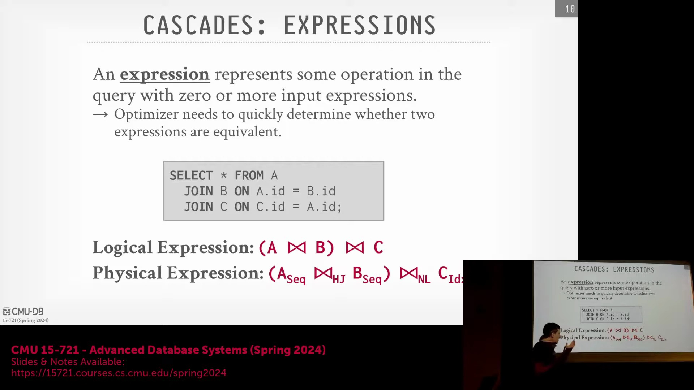
查询优化器(Query Optimizer)首先定义表达式的物理实现(Physical Implementation)。这涉及为给定的表明确指定扫描或访问方法(Access Method)，并选择合适的连接算法(Join Algorithm)。基于关系代数(Relational Algebra)规则，优化器将等价的逻辑表达式(Logical Expressions)组合成一个称为**组(Group)**的统一结构。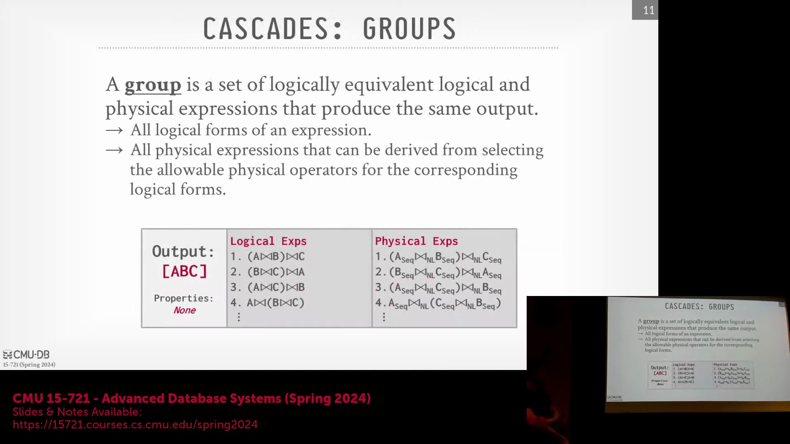 单个组充当中央容器，用于跟踪预期输出（例如 `A join B join C`）、连接顺序的所有等价逻辑排列，以及所有对应的物理执行路径(Physical Execution Paths)。此外，每个组都嵌入了关于输入数据所需物理属性(Physical Properties)的元数据(Metadata)，使系统能够在一个条目内全面评估每种可行的执行策略。

## 多表达式与自顶向下搜索策略
为了管理搜索空间的复杂性，优化器引入了**多表达式(Multi-expression)**，作为查询计划树(Query Plan Tree)中深层子表达式的占位符。在评估节点时，优化器会识别出其下方的子表达式，但会推迟确定其具体的执行细节。这种方法与从原子表达式开始向上构建的自底向上(Bottom-up)策略形成鲜明对比。相反，该系统采用自顶向下(Top-down)策略：从根目标（例如连接 A、B 和 C）出发，在向下遍历的过程中逐步填充执行规范。通过将多表达式作为占位符，优化器避免了同时物化(Materialize)所有可能计划状态的开销，从而能够在组内对表达式进行局部推导，同时将底层执行细节的确定委托给后续的树层级。

## 动态优先级排序与转换规则

随着优化器遍历搜索树(Search Tree)，它会动态确定优先探索的路径（例如，决定先评估 A 和 B 的连接，还是先扫描 C）。这种探索过程由转换规则(Transformation Rules)驱动，这些规则负责将逻辑算子(Logical Operators)转换为其他逻辑算子，或直接将其映射为物理算子(Physical Operators)。由于数据库系统最终必须依赖物理算子来执行查询，这些规则会匹配特定的模式（例如跨越三个组的两次连接操作），并应用相应的变换，如调整连接顺序（从左至右重组）或将等值连接(Equi-join)转换为归并连接(Merge Join)、哈希连接(Hash Join)或嵌套循环连接(Nested Loop Join)。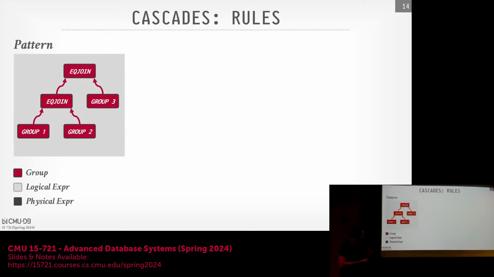 为防止可逆变换导致搜索陷入无限循环，系统会记录已评估过的状态，从而避免冗余处理。

## 备忘录表实现与代价跟踪
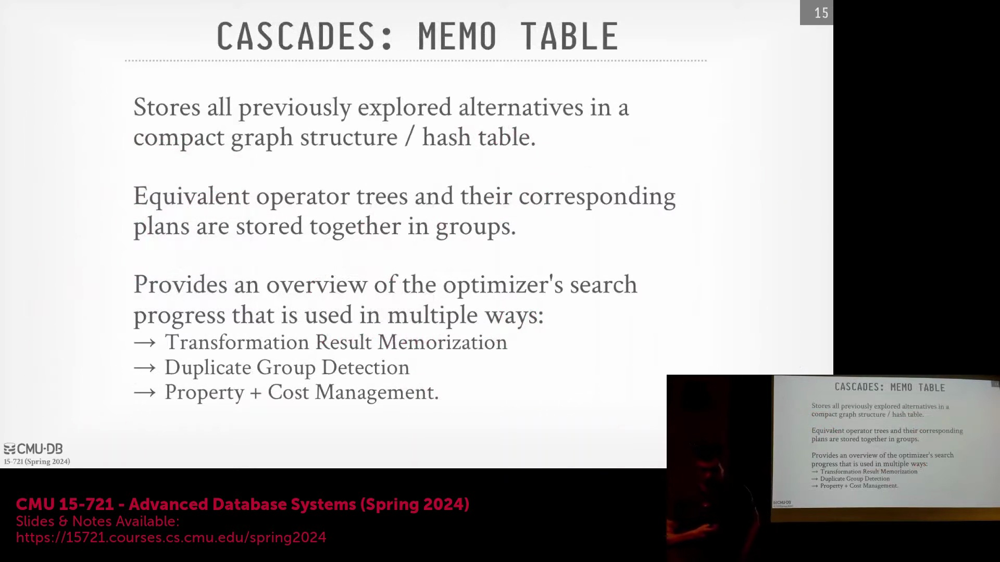
**备忘录表(Memo Table, MOTable)**充当跟踪优化进度的中央缓存(Cache)。根据系统架构的差异，它可以直接嵌入在组结构中，或作为独立的哈希表(Hash Table)进行维护。对于每个多表达式，MOTable 会记录迄今为止发现的最优物理算子、其关联的最低代价(Cost)，以及该算子生成的物理属性（例如输出数据是否已排序）。这种属性跟踪机制至关重要：若父算子要求输入数据已排序，而当前最优计划产生的是无序数据，优化器便可继续探索能满足该属性约束的替代分支。通过将新生成计划的代价与已知最优值进行比对，优化器能够高效地剪枝(Prune)次优路径，无需进行穷举式的重新评估。

## 最优性原理与分支定界剪枝
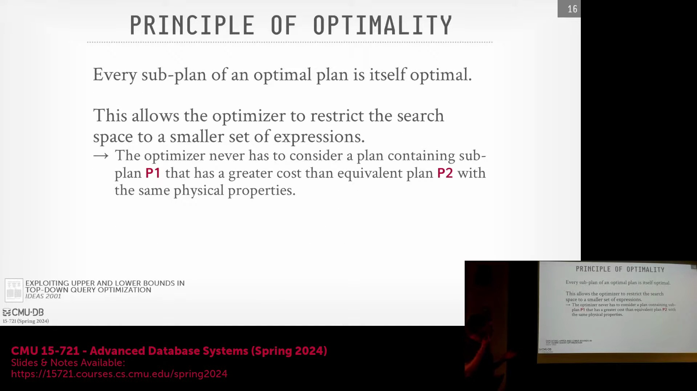
该搜索算法严格遵循**最优性原理(Principle of Optimality)**，即任何全局最优执行计划(Optimal Execution Plan)的子计划本身也必须是最优的。这一核心概念为分支定界(Branch and Bound)剪枝提供了理论基础。当优化器向下遍历搜索树时，由于不断引入额外的物理算子，累积代价会呈现单调递增趋势。若在搜索树的任意层级，部分计划(Partial Plan)的累积代价已超过当前已知的最佳完整计划代价，优化器即可安全地剪除该分支。由于代价在向下搜索过程中只会增加，后续路径的总代价不可能更低，因此系统能够提前终止无望的搜索分支，从而大幅节省计算资源。

## 分步优化详解
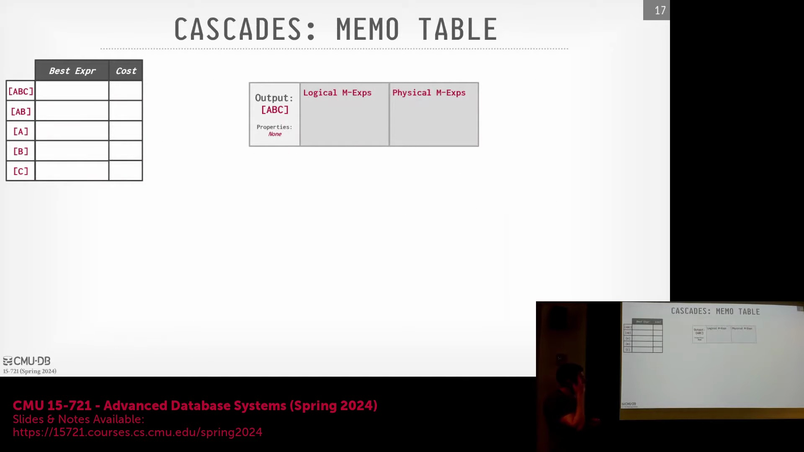
将上述机制应用于 `A join B join C` 查询时，优化器会从根节点开始应用逻辑转换，以生成初始的多表达式。优化器并非同时展开所有分支，而是优先跳转至首个叶子节点(Leaf Node)以计算其代价。对于 A 和 B 这类基表(Base Table)，优化器会物化所有可行的物理访问选项（例如顺序扫描(Sequential Scan)与索引扫描(Index Scan)）。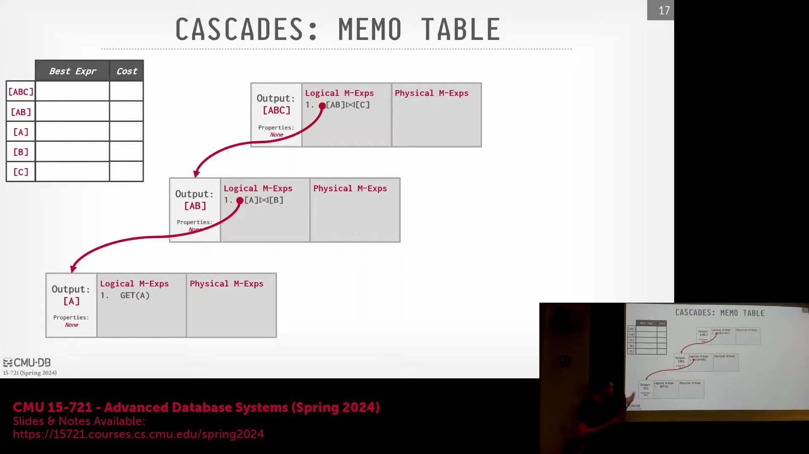 随后，系统会依据索引选择性(Index Selectivity)或列覆盖(Column Coverage)等启发式规则(Heuristics)对这些选项进行排序。借助代价模型(Cost Model)，优化器筛选出代价最低的访问方式（例如，表 A 的顺序扫描代价为 10，表 B 为 20），并将评估结果写入 MOTable。 当后续探索替代连接顺序（例如转换为 B join A）时，优化器只需直接引用 MOTable 中预存的代价数据，而无需重新遍历底层节点。这种记忆化(Memoization)机制显著降低了冗余计算开销，并大幅加速了最优执行计划的生成过程。

---

## 备忘录表查找与代价计算
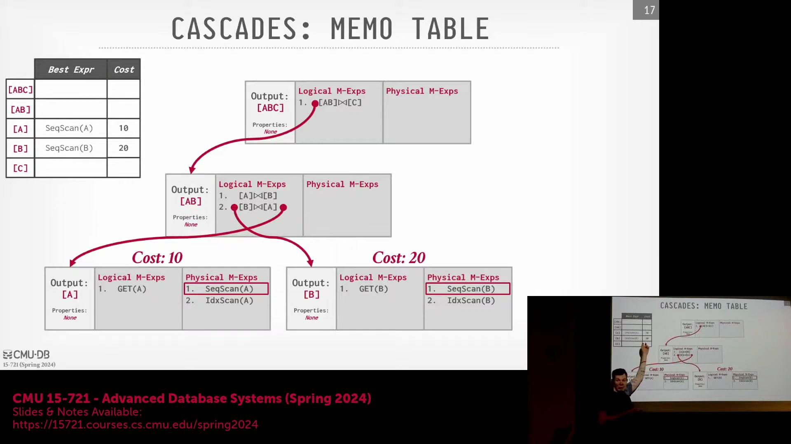
优化器利用备忘录表(Memo Table)避免冗余的树遍历(Tree Traversal)与重复的代价估算(Cost Estimation)。在评估子树(Subtree)时，优化器会检查备忘录表中先前已计算的扫描代价(Scan Cost)（例如针对表 `v` 和 `a` 的代价）并予以复用。针对特定的连接操作(Join Operation)，系统会生成所有可行的物理多表达式(Physical Multi-expression)，并应用代价模型(Cost Model)以确定最高效的执行算法。在本示例中，哈希连接(Hash Join)被判定为最优选项，其综合代价为 80（包含表 `a` 和 `b` 的扫描代价）。该最优代价随后将被记录至备忘录表中，供后续查询复用。

## Cascades 框架概述
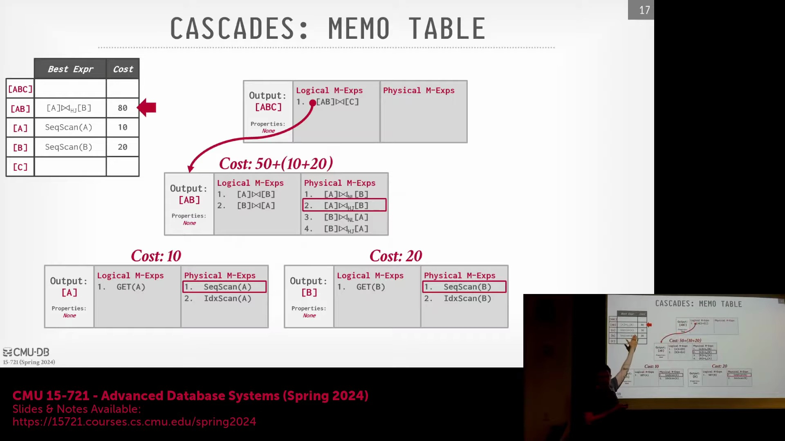
搜索过程将递归评估其他分支（例如连接表 `C`），探索表 `A`、`B` 与 `C` 的不同连接顺序(Join Order)，直至搜索空间(Search Space)被充分遍历，最终确定最低的整体代价（例如 125）。该工作流程体现了 Cascades 优化器(Optimizer)的核心机制：它起始于逻辑查询计划(Logical Query Plan)，无需预先指定连接顺序、访问路径(Access Path)或连接算法(Join Algorithm)。优化器自顶向下(Top-down)遍历表达式树(Expression Tree)，持续查询并更新备忘录表，以追踪并保留搜索过程中发现的最优代价计划(Cost-based Plan)。

## 规则应用与物理表达式生成
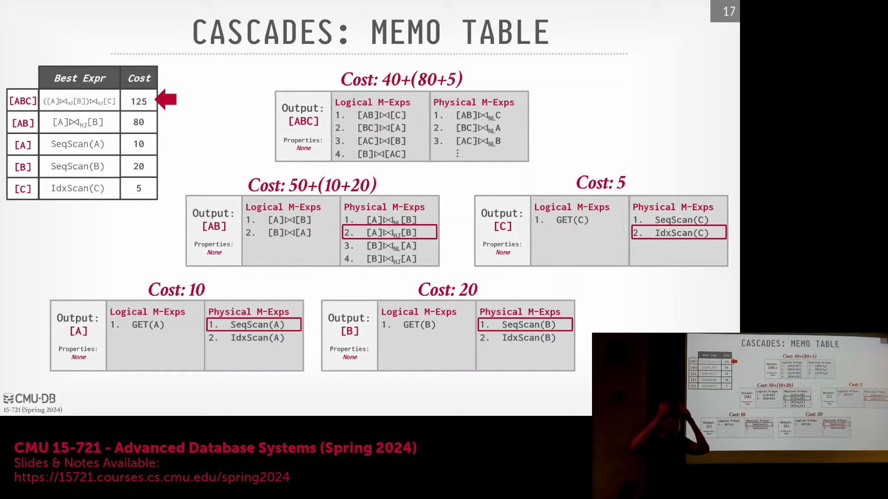
尽管 Cascades 本质上是基于代价的优化器(Cost-based Optimizer)，它仍会在特定节点处一致地应用转换规则(Transformation Rules)与实现规则(Implementation Rules)。当处理表访问操作（如表 `A`）时，优化器会自动生成多个物理多表达式，例如顺序扫描(Sequential Scan)及所有可用的索引扫描(Index Scan)。为避免组合爆炸(Combinatorial Explosion)，系统不会预先物化(Materialize)所有可能的候选方案。相反，系统会利用排序或启发式策略引导探索过程，随后进入基于代价的选择阶段，过滤劣质选项，仅保留最具潜力的物理表达式(Physical Expression)。

## Cascades 与 Volcano 的对比及统一搜索过程
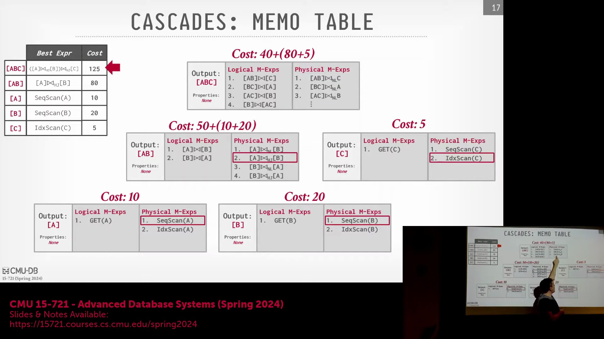
Cascades 与 Volcano 优化器框架等早期架构的主要差异在于搜索策略(Search Strategy)与规则集成(Rule Integration)机制。Volcano 采用严格的穷举搜索(Exhaustive Search)，缺乏基于优先级的剪枝机制(Pruning Mechanism)，且将逻辑转换(Logical Transformation)与物理代价计算严格分离。Cascades 将这些步骤整合为单一的动态过程，摒弃了僵化的两阶段流水线(Two-phase Pipeline)设计。备忘录表中的逻辑组(Logical Group)（如 `A`、`B`、`C`）仅定义*必须执行哪些*逻辑操作，而不规定*具体如何执行*。在遍历过程中，优化器会同步应用转换规则、将逻辑表达式(Logical Expression)转换为物理表达式、评估代价并剪枝搜索空间，从而形成紧密集成的优化循环(Optimization Loop)。

## 终止条件与代价估算数据
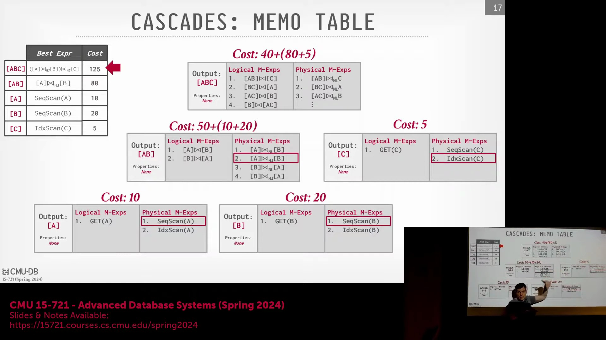
搜索过程受终止条件(Termination Condition)控制，触发条件可能包括执行计时器超时、达到转换规则应用次数上限，或当代价改善趋于平缓时提前终止。与早期系统在评估前物化所有候选方案的做法不同，Cascades 能够动态控制搜索广度(Search Breadth)。代价估算依赖于通过 `ANALYZE` 命令收集的统计信息(Statistics)、历史查询执行数据、数据概要(Data Sketches)或局部数据采样(Partial Data Sampling)（SQL Server 中的典型技术）。代价模型对这些输入进行抽象，利用选择率(Selectivity)与 I/O/CPU 估算来评估操作符(Operator)代价，在规划阶段无需访问实际表数据。

## 自底向上与自顶向下优化策略
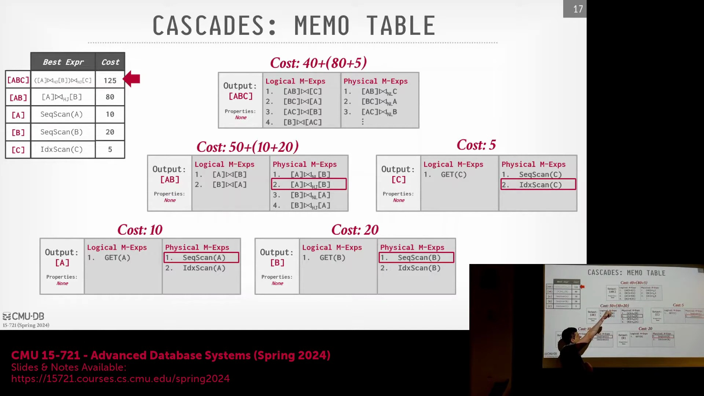
本讲座对比了自底向上(Bottom-up)与自顶向下(Top-down)的优化策略。纯自底向上策略要求在应用任何分支定界剪枝(Branch-and-Bound Pruning)之前完全评估叶节点(Leaf Nodes)。这会延迟剪枝时机，但允许物理操作符(Physical Operator)的增量物化，并有助于尽早确立代价上界(Cost Upper Bound)。Cascades 采用结合记忆化(Memoization)的自顶向下方法，在搜索空间探索与积极剪枝之间取得平衡。高级优化技术（如基于超图的分组(Hypergraph-based Grouping)）可进一步细化搜索过程。相关研究（含一篇 2006 年的引用文献）表明，特定的自底向上或混合优化技术(Hybrid Optimization Technique)有时能比传统 Cascades 实现更快地识别最优连接顺序。最后，物理数据属性(Physical Data Property)（如归并连接(Merge Join)所需的预排序输入）会在遍历过程中动态校验，以确保所选计划满足所有操作符的前置条件(Preconditions)。

---

## 备忘录表中的数据属性跟踪

优化器直接在备忘录表(Memo Table)中持续跟踪特定的数据属性，例如排序顺序(Sort Order)、列投影(Column Projection)和压缩格式(Compression Format)。当下游操作符(Downstream Operator)（如归并连接(Merge Join)）需要预排序输入(Pre-sorted Input)时，系统会查询备忘录表，以找出已满足该属性要求的最低代价扫描方案(Lowest-cost Scan Plan)，从而避免引入冗余的排序操作(Sort Operator)。备忘录表为单个逻辑表达式(Logical Expression)维护多个代价条目(Cost Entry)，每个条目均标记有对应的输出属性集(Output Property Set)。尽管跟踪所有可能的组合理论上会引发组合爆炸(Combinatorial Explosion)，但现代系统通过应用转换规则(Transformation Rule)或将优化提示(Optimization Hint)下推(Push Down)至表达式树(Expression Tree)来有效管理这种复杂性。这些提示会显式地请求或排除某些属性，使优化器能够灵活适应行式存储与列式存储(Row-store vs. Column-store)或分布式数据布局(Distributed Data Layout)等架构差异，而无需盲目地物化(Materialize)所有变体。

## 自适应查询执行与运行时触发器
在自底向上(Bottom-up)的优化框架中，实现自适应查询执行(Adaptive Query Execution)（即根据实际数据特征在运行时动态调整执行计划）在概念上更为直观。在该方法中，系统在执行数据处理时可动态切换物理操作符(Physical Operator)（例如从索引扫描(Index Scan)回退至顺序扫描(Sequential Scan)），而无需从根节点重新遍历整个执行计划。为避免引入沉重开销，现代优化器会将轻量级的“触发器”(Trigger)或探针(Probe)直接嵌入物理计划中。这些探针充当运行时检查点(Runtime Checkpoint)，用于验证实际运行时统计信息（如基数(Cardinality)或选择率(Selectivity)）是否与优化器的初始估算相匹配。若检测到显著偏差(Deviation)，触发器可启动简单的自适应调整，例如将聚合操作(Aggregate Operation)下推(Push Down)至远程节点，或直接中止存在严重缺陷的查询计划。与插入高开销中间操作符的做法不同，这些触发器仅带来极小的执行开销，并允许代价模型(Cost Model)在初始规划阶段便将动态调整所需的安全边际(Safety Margin)纳入考量。

## 历史背景与 Cascades 的实现

Cascades 优化器框架(Optimizer Framework)源自 1994 年的一篇开创性论文，其本质是一份架构蓝图(Architectural Blueprint)，而非单一的开源代码库。早期的学术实现包括威斯康星大学开发的 OP++ 与哥伦比亚大学的相关系统，随后衍生出商业改编版本，例如 Greenplum 数据库中的 Orca 优化器，其以独立的“优化器即服务”(Optimizer-as-a-Service)模式运行。微软在引入该框架的核心作者后，对该架构进行了深度投入，并在其数据产品生态系统中集成了一套经过深度分支定制(Forked)与持续演进的 Cascades 优化器版本。该架构谱系(Architectural Lineage)广泛覆盖了 SQL Server、Azure Synapse Analytics 以及 Cosmos DB。与通常依赖动态规则引擎(Dynamic Rule Engine)或领域特定语言(Domain-Specific Language, DSL)的学术原型不同，微软的生产级实现(Production-grade Implementation)完全采用 C++ 编写，并利用硬编码(Hardcoded)的 `if-else` 逻辑来执行规则转换(Transformation)。该设计优先考虑优化器的编译期性能(Compilation Performance)与系统稳定性，而非纯粹的声明式规则匹配(Declarative Rule Matching)。

## 分阶段优化与预探索

为避免盲目穷举搜索(Exhaustive Search)带来的低效问题，现代 Cascades 实现将优化过程划分为明确且连续的阶段(Phases)，而非一次性应用所有规则。初始阶段严格专注于逻辑简化(Logical Simplification)与查询规范化(Query Normalization)。该阶段涵盖子查询(Subquery)处理、在谓词条件允许时将外连接(Outer Join)转换为内连接(Inner Join)、过滤器下推(Filter Pushdown)，以及剪枝(Pruning)逻辑上不可能返回结果的查询（例如 `WHERE 1=0`）。通过提前消除这些结构性低效问题，优化器在进入物理代价评估(Physical Cost Evaluation)之前，已显著缩减了搜索空间(Search Space)。

后续阶段被称为“预探索”(Pre-exploration)，该阶段在不执行完整基于代价搜索(Cost-based Search)的前提下，策略性地向备忘录表注入高概率的物理候选方案(Physical Candidate Plan)。通过早期识别并植入潜力表达式，优化器为后续的主搜索阶段(Main Search Phase)确立了搜索偏向(Search Bias)。这种引导式搜索(Guided Search)机制使基于代价的引擎(Cost-based Engine)能够优先探索已知的高效模式，根据早期发现动态调整规则优先级(Rule Priority)，并快速剪枝低效或次优的搜索分支(Suboptimal Branch)。最终，该机制构建出一种平衡的工作流(Workflow)，在保障优化全面性的同时，大幅降低了查询编译延迟(Query Compilation Latency)。

---

## 早期优化阶段与动态统计信息收集

优化过程首先处理一些简单的计划捷径(Plan Shortcuts)，例如 `SELECT 1` 或 `LIMIT 0`，并对投影进行规范化(Projection Normalization)以清理输出列。此阶段的一个显著特性是动态统计信息管理(Dynamic Statistics Management)：若优化器发现缺乏进行精确代价估算(Cost Estimation)所需的统计信息(Statistics)，它将暂停规划过程，并指示数据库立即执行 `ANALYZE` 命令。待统计信息收集完毕后，系统将继续执行初始基数估算(Initial Cardinality Estimation)，并应用连接折叠(Join Collapsing)等逻辑转换(Logical Transformation)，从而为进入更复杂的搜索阶段(Search Phase)奠定坚实基础。

## 多阶段基于代价的搜索与引擎特定规则

核心的基于代价搜索(Cost-based Search)以渐进式多阶段工作流(Progressive Multi-stage Workflow)运行，旨在在编译速度(Compilation Speed)与计划质量(Plan Quality)之间取得平衡。在初始阶段，优化器仅将转换规则应用于主键查找(Primary Key Lookup)等简单场景。若计算时间充裕，系统将逐步扩大搜索空间(Search Space)，以评估并行执行策略(Parallel Execution Strategy)与多表连接(Multi-table Join)，并在必要时最终探索完整计划空间(Full Plan Space)。在最后阶段，优化器会应用针对目标架构量身定制的引擎特定转换(Engine-specific Transformation)，例如为 Azure Synapse 等云数据仓库实现分布式连接(Distributed Join)或广播连接(Broadcast Join)。这种分层优化策略(Layered Optimization Strategy)确保在投入算力探索复杂且针对特定硬件的计划变体(Hardware-specific Plan Variant)之前，基础优化工作已得到充分处理。

## 确定性超时与备忘录表初始化填充

为确保在不同硬件负载下生成可重现的查询计划(Reproducible Query Plan)，现代优化器采用基于已应用的转换规则次数(Transformation Count)而非物理时钟时间(Wall-clock Time)来衡量搜索超时(Search Timeout)。该机制有效避免了因系统拥塞(System Congestion)导致相同查询生成不同执行计划(Execution Plan)的问题。在预探索阶段(Pre-exploration Phase)，优化器会根据早期查询分析结果，策略性地向备忘录表(Memo Table)和表达式组(Expression Group)预填充初始候选项(Initial Candidates)。系统不再盲目探索所有组合或依赖 SQL 语句中表的文本顺序(Textual Order)，而是预先注入高概率的连接顺序(Join Order)与物理候选计划(Physical Candidate Plan)。这种引导式初始化(Guided Initialization)机制使基于代价的引擎(Cost-based Engine)能够快速识别并锁定最优策略，从而避免执行低效的穷举搜索(Exhaustive Search)。

## 独立优化器框架：Calcite 与 Orca 的对比
数据库生态系统广泛采用独立的“优化器即服务”(Optimizer-as-a-Service)框架，以规避重复实现核心优化逻辑。Apache Calcite 源自 LucidDB 项目，是一款基于 Java 的高度可插拔优化器(Pluggable Optimizer)，原生支持多种 SQL 方言(SQL Dialect)。系统集成者仅需定义目录模式(Catalog Schema)、计划表示形式(Plan Representation)及自定义转换规则(Custom Transformation Rule)，即可将其无缝适配至各类专用数据库引擎中。相比之下，Orca（最初专为 Greenplum 与 HAWQ 开发）是一款基于 C++ 实现的优化器，深度聚焦于现代并行与分布式查询执行(Parallel and Distributed Query Execution)。尽管 Orca 在方言无关性(Dialect-agnostic Capability)上不及 Calcite，但它仍是基于 PostgreSQL 架构的分布式系统中功能强大且持续维护的优选方案，为重型分析型工作负载(Heavy Analytical Workload)提供了高度专业化的替代路径。

## 优化器调试与代价模型验证
当开发人员无法直接访问客户生产环境的数据或硬件配置时，在本地部署中调试性能回退(Performance Regression)极具挑战性。为应对该难题，先进优化器内置了深度诊断功能，支持导出内部搜索状态的完整转储(Full State Dump)。该转储详细记录了所有规则应用(Rule Application)与决策分支(Decision Branch)，从而有效支持异地根本原因分析(Remote Root Cause Analysis)。此外，为维持长期的估算精度，部分系统实现了自动化的代价模型验证例程(Cost Model Validation Routine)。优化器会提取排名靠前的 N 个候选计划(Top-N Candidate Plan)，在后台静默执行，并将实际执行代价(Actual Execution Cost)与初始估算值(Initial Estimate)进行比对。这种基于经验数据的反馈闭环(Feedback Loop)使系统能够持续校准代价模型(Cost Model)与计算公式，确保理论预测与实际执行行为保持高度一致。

---

## CockroachDB 的 DSL 驱动型 Cascades 优化器

尽管早期系统（如 MongoDB）在历史上缺乏传统的逻辑与物理操作符分离机制(Separation of Logical and Physical Operators)，但 CockroachDB 使用 Go 语言从零开始完全重写了其查询优化器(Query Optimizer)。该优化器紧密遵循 Cascades 框架(Cascades Framework)，并引入了一种专用的领域特定语言(Domain-Specific Language, DSL)，用于以声明式方式定义转换规则(Transformation Rules)与模式匹配(Matching Patterns)。此 DSL 会被直接转译(Transpile)为高度优化的 Go 代码，并在数据库引擎内核中执行。当遇到无法通过 DSL 完整表达的复杂转换时，开发者可无缝切换至原生 Go 代码。这种混合架构(Hybrid Approach)有效平衡了基于规则的优雅性(Rule-based Elegance)与命令式编程的灵活性(Imperative Control Flexibility)。

## 随机搜索策略与模拟退火
为突破确定性自顶向下(Top-down)或自底向上(Bottom-up)遍历的局限，早期研究探索了应用于查询优化的随机搜索策略(Stochastic Search Strategy)。1987 年的一篇奠基性论文首次将模拟退火算法(Simulated Annealing Algorithm)引入该领域：优化器从初始物理计划(Initial Physical Plan)出发，随机交换操作符(Operators)或调整连接顺序(Join Order)。即便某次变换导致估算代价(Estimated Cost)上升，算法仍会以特定概率接受该变更，从而辅助搜索过程跳出局部极小值(Local Minimum)。核心难点在于，优化器必须对每次随机扰动进行语义等价性验证(Semantic Equivalence Check)，例如严格维持外连接(Outer Join)的输入顺序约束。尽管该策略在理论上颇具吸引力，但受限于其不可预测性(Unpredictability)与高昂的验证开销(Validation Overhead)，现代生产系统已极少采用。

## 用于复杂连接排序的遗传算法

为应对大型连接查询中的组合爆炸(Combinatorial Explosion)问题，PostgreSQL 引入了一种遗传算法(Genetic Algorithm)，通常在查询涉及的表数量超过 12 张时触发。优化器放弃对全表达式空间(Expression Space)的穷举搜索，转而生成一组随机查询计划种群(Population)，并评估其估算代价(Estimated Cost)。算法保留适应度最高(Fittest)的计划，淘汰表现最差的个体，并对幸存计划应用变异(Mutation)与交叉(Crossover)操作以繁衍下一代。其核心目标是通过迭代演化(Iterative Evolution)筛选并固化有益“特征”（如特定的连接顺序(Join Order)或访问路径(Access Path)），直至收敛至可接受的近似最优计划。

## 确定性、工程权衡与实现批评

尽管遗传算法为处理超大规模连接图(Large-scale Join Graph)提供了一种可扩展的替代方案，但也引入了显著的工程复杂性(Engineering Complexity)。优化器必须确保所有随机变换均具备语义有效性(Semantic Validity)，并在多次执行中保持严格确定性(Determinism)，以保障执行计划的可重现性(Plan Reproducibility)。尽管该算法在处理 30 张表以上的超大规模连接查询时具备理论优势，但复杂验证规则的维护开销(Maintenance Overhead)往往抵消了其收益。负责该模块的 PostgreSQL 核心开发者曾坦言该实现“存在缺陷”(Flawed)，指出其未能严格遵循经典遗传原理，且无法保证最优特征(Optimal Traits)在种群迭代中稳定遗传。因此，学界普遍认为该机制仅是一种务实但欠完善的权宜之计(Pragmatic Workaround)，而非严谨稳健的优化策略。

## 子查询的普遍性挑战

子查询(Subquery)凭借其极高的表达灵活性，已成为 SQL 优化(SQL Optimization)中最复杂的处理单元之一。它们可被嵌套嵌入(Embed)至查询的任意位置，涵盖 `SELECT` 列表、`WHERE` 条件、`FROM` 子句乃至 `ORDER BY` 表达式。这种无处不在的嵌入特性迫使优化器必须妥善应对深度嵌套结构(Deeply Nested Structures)、关联引用(Correlated References)以及动态结果集(Dynamic Result Sets)。在解析此类结构时，优化器需审慎决策：是将其扁平化(Flattening)为标准连接(Standard Join)、作为独立子计划独立求值(Independent Evaluation)，还是应用专门的去关联化(Decorrelation)技术。其核心目标是在严格保障语义正确性(Semantic Correctness)的前提下，将整体执行开销(Execution Overhead)降至最低。

---

## 子查询简介及其函数类比

课程首先探讨了嵌套查询(Nested Queries)或子查询(Subqueries)的概念。虽然在理论上可以将 `SELECT` 语句直接嵌套于 `ORDER BY` 子句中，但在实际数据库系统中通常不受支持。对于子查询，更准确的思维模型是将其视为一个函数：外层查询(Outer Query)可以将上下文信息传递给内层查询(Inner Query)，内层查询处理这些数据后返回结果供外层查询使用。这一特性极具价值，因为它允许开发者在单个 SQL 语句中表达复杂的多步骤数据操作，从而避免了在临时表(Temporary Tables)中手动暂存中间结果或执行多个独立查询的繁琐过程。

## 不相关子查询(Uncorrelated Subqueries)与相关子查询(Correlated Subqueries)
在查询处理(Query Processing)中，一个关键的区别在于不相关子查询和相关子查询。不相关子查询逻辑相对简单，且在现代数据库系统中得到了广泛支持。其定义特征是执行过程完全独立于外层查询，即不引用外部作用域(Outer Scope)中的任何列、属性或元组(Tuple)。因此，数据库引擎只需在逻辑上对内层查询求值(Evaluate)一次。该结果只需物化(Materialize)一次，便可高效地应用于外层查询处理的每一行。例如，若要找出总分最高的学生，只需扫描一次 `students` 表以计算 `MAX(score)`，然后将该单一标量值(Scalar Value)应用于外层的过滤条件(Filter Condition)。

## 相关子查询的执行开销
然而，相关子查询会带来显著的性能挑战。在此类场景中，内层查询会显式引用外层查询的列或值。这种依赖关系迫使数据库引擎以嵌套循环(Nested Loop)的方式重复执行内层查询：针对外层查询处理的每一个元组，都必须对内层子查询进行完整的顺序扫描(Sequential Scan)或求值。例如，在查找特定专业内成绩最高的学生时，引擎必须扫描内层表，根据当前外层元组的专业进行过滤(Filter)，计算最高分并进行比较。该过程会对随后的每一行重复执行，若未进行优化，其时间复杂度(Time Complexity)会迅速攀升至 $O(N^2)$。此类子查询可出现在多种 SQL 子句(SQL Clauses)中（如 `WHERE`、`FROM`、`SELECT`，有时还包括 `LIMIT`），这使得它们的优化高度依赖于具体上下文(Context)。

## 优化目标：子查询展开为连接操作
现代查询优化器(Query Optimizer)的主要目标是将相关子查询“上提”或展开(Unnest)，使其与外层查询处于相同的逻辑层级。通过将内层查询上提，优化器可将其重写为标准的关系型连接(`JOIN`)操作。一旦转换为连接操作，数据库便可利用数十年来积累的高度成熟的优化技术，包括动态连接顺序优化(Join Ordering)、索引选择(Index Selection)以及先进的物理连接算法（如哈希连接(Hash Join)或归并连接(Merge Join)）。这些算法的性能远优于朴素的嵌套循环。重写过程通常涉及将内层查询移至 `FROM` 子句，调整分组逻辑（如 `GROUP BY major`），并对齐投影(Projection)输出，以确保重写后的计划与原始嵌套结构在语义上等价(Semantically Equivalent)。

## 手工构建的基于规则系统的局限性
历史上，子查询展开是通过大量手工编写的规则集(Rule Sets)来管理的。在 SQL-99 标准正式规范嵌套查询之后，微软等数据库厂商开发了依赖海量启发式规则(Heuristics)的系统。例如，SQL Server 的优化器曾依赖超过 22 条不同的规则，来确定何时以及如何对嵌套查询进行解相关(Decorrelation)。每条规则都充当严格的模式匹配条件：若查询匹配了特定的谓词组合(Predicate Combinations)（如 `=`, `IN`, `EXISTS`, `<`, `>`，以及半连接(Semi-Join)和反连接(Anti-Join)）及特定的子句位置，系统便会应用预定义的重写转换(Rewrite Transformation)。尽管这些基于规则的系统(Rule-Based Systems)针对已知模式相对易于实现，但其本质非常脆弱(Brittle)。它们难以覆盖由边缘情况(Edge Cases)、复杂 `WHERE` 子句以及横向连接(Lateral Joins)等高级构造所产生的庞大组合空间，这使得手工维护规则变得越来越低效。

## 通用重写框架
为克服启发式规则的局限性，一篇 2015 年的研究论文提出了首个用于解相关子查询的通用且数学严谨的方法。该方法能够系统地将*任意*相关子查询转换为一组标准连接操作，从而消除了对临时性模式匹配(Ad-hoc Pattern Matching)的依赖。其核心创新依赖于一种名为**依赖连接** (Dependent Join / Apply Operator) 的新逻辑算子，该算子功能类似于笛卡尔积(Cartesian Product)，但携带了明确的元数据，用以标识其源自相关上下文。优化器的重写过程利用该算子跟踪依赖关系，通过谓词下推(Predicate Pushdown)逐步优化，并最终消除相关标记。最终生成的是完全解相关的查询计划(Query Plan)，其中原本昂贵的 $O(N^2)$ 嵌套循环执行被高效的哈希连接或索引连接(Index Join)所取代，从而能够针对各类复杂查询实现稳健且自动化的优化。

---

## 理解依赖连接与相关子查询
 优化过程始于评估系统处理查询计划(Query Plan)的常规方式。在相关子查询(Correlated Subquery)中，查询树的左侧通常对应外部表(Outer Table)的扫描，右侧则包含内部查询(Inner Query)。内部查询在其 `WHERE` 子句的谓词(Predicate)中显式引用了外部表的列值，从而确立了两者间的相关性(Correlation)。 
 需要强调的是，“依赖连接”(Dependent Join)并非数据库引擎中全新实现的物理算子(Physical Operator)。相反，它在查询计划中充当关系代数(Relational Algebra)的一种逻辑扩展。这种抽象机制使得优化器(Optimizer)能够清晰地推演针对相关子查询的特定转换规则，其本质等同于一个带有依赖跟踪标志(Dependency Tracking Flag)的交叉连接(Cross Join)。 
 从概念上讲，该操作会逐一遍历左侧的元组(Tuple)，并针对每个元组评估右侧查询以生成结果，其执行机制在本质上类似于笛卡尔积(Cartesian Product)。

## 转换策略：下推依赖连接
 核心优化目标是将依赖连接向下推(Pushdown)至查询计划的右侧（即内部查询侧），并最终在底层将其转换为标准的常规连接(Regular Join)。具体的转换策略在很大程度上取决于内部查询的语义结构与谓词条件。 
 优化器从左侧的表扫描(Table Scan)和右侧的内部查询出发，将依赖连接下推一层，并在外部查询与右侧输出之间构建常规连接。为确保转换过程的正确性，系统会引入一个额外的扫描算子专门用于去重(Deduplication)，其功能类似于 `SELECT DISTINCT` 或 `GROUP BY` 操作。

## 管理聚合与去重
 去重步骤确保每个元组具备唯一的属性组合，从而防止在执行依赖连接时产生冗余输出。例如，在计算每个专业(Major)的最高学生成绩时，该去重扫描确保了同专业的多名学生不会生成重复的记录条目。这种逻辑依赖跟踪机制使得依赖连接能够安全地穿透聚合算子(Aggregation Operator)继续下推。去重扫描随连接算子一同下移，而聚合操作则保留在其上方。输出语义保持不变：唯一的学生记录按专业和成绩进行分组后，再与外部学生表进行连接，从而计算出每个专业的最高分。聚合算子的位置有效强制执行了“每个专业仅对应一个最高分”的约束，这在评估各类连接谓词（如等值、非等值或 `NULL` 值处理）时至关重要。

## 穿越过滤条件与抵达物理执行
 继续下推过程，依赖连接可被移至过滤算子(Filter Operator)下方而不改变查询语义，因为连接后执行过滤在功能上等同于在常规连接期间应用 `WHERE` 子句。当依赖连接抵达叶节点（即基表扫描(Base Table Scan)）时，下推过程即告终止。在此阶段，逻辑层面的依赖连接将转换为其物理执行形式：笛卡尔积。此时，位于该交叉连接正上方的过滤条件会自然坍缩(Collapse)为标准的内连接(Inner Join)。 
 这种结构整合使得优化器能够将整个查询树视为传统的查询计划，进而顺利进入标准的基于成本的优化(Cost-Based Optimization, CBO)与物理执行策略生成阶段。

## 最终查询重写与系统实现
 通过识别到 `GROUP BY` 子句已隐含处理了去重逻辑，执行计划可被进一步简化。优化器将查询计划重写为直接的表扫描，并调整连接条件，使得一侧的专业字段与另一侧的专业字段及计算出的最高分相匹配。`GROUP BY` 的语义保证确保了每个专业仅对应一个分数值，从而大幅简化了执行路径。此类转换方法在数据库经典文献中已有详尽记载，通过将相关查询转化为标准连接，该机制可推广至处理各类相关子查询。目前，Hyper 与 Umbra 等先进数据库系统已完整实现该机制，而 Databricks 等平台则支持其部分变体。
 阐述这些技术的学术论文为现代查询优化器(Query Optimizer)的设计提供了清晰的蓝图。

## 应对不确定性与成本估算
 接下来，讨论将转向如何应对成本估算不准确或统计信息完全缺失的场景，例如在数据湖仓(Data Lakehouse)或 S3 环境中查询新加入且缺乏数据特征分析(Data Profiling)的文件。其核心解决方案在于动态数据特征分析(Dynamic Data Profiling)。 
 系统会首先执行基线查询计划(Baseline Query Plan)，并在其中嵌入运行时反馈钩子(Runtime Feedback Hooks)，以监控实际执行成本是否与初始估算相符。在引擎执行表扫描的过程中，系统会实时收集统计信息(Statistics)，并将其反馈至优化模型以校准后续的决策。 
 这种自适应方法(Adaptive Approach)确保了系统即使在缺乏先验数据知识(Prior Knowledge)的情况下，依然能保持稳健的性能表现。有关连接顺序选择(Join Order Selection)及其他边界情况(Edge Cases)的更多细节，将在下一节中展开详细讨论。

---

## 初始设置与物品操作
 视频开场时，桌面上整齐陈列着六个独立包装的物品，标签清晰可辨。随后镜头转向实操准备环节：铺展布料、旋开瓶盖、轻叩容器底部，逐步构建出一套井然有序的准备工作流(Workflow)。

## 谨慎操作与氛围转变
 随着流程的推进，抓绒面料(Fleece Fabric)与各类实用物件相继入镜。画外提示明确强调了需谨慎持握瓶体，与此同时，整体基调悄然转向一种非常规乃至“荒诞诙谐”的状态，隐隐透出某种不可预知的悬念。

## 摄取仪式与蜕变意象
 叙事脉络随即转入超现实主义的摄取意象，将“湿漆”(Wet Paint)与“饮用纱布”(Drinking Gauze)的指涉相互交织。通过对封装物质的反复提及，以及借由吞食达成灵魂救赎(Spiritual Redemption)的设定，文本深刻凸显了“吸收与转化”的核心主题。 
 这一仪式化阶段逐步推向高潮，着重刻画了持续摄入直至物质完全起效的过程，进而强化了“状态蜕变”与“刻意摄取”的核心母题(Motif)。

## 生动描绘与收尾叠句
 尾声部分引入了风格迥异、颇具美食隐喻的意象，诸如“辣椒芝士”(Chili Cheese)、“小麦纱布”以及一罐看似寻常却滚烫的容器内物。该序列最终以一段复沓且引人深思的叠句(Refrain)作结，营造出循环往复、余音绕梁的观感，为整段视觉叙事与主题演进圆满收束。