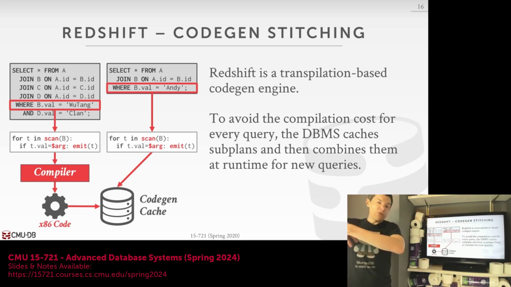
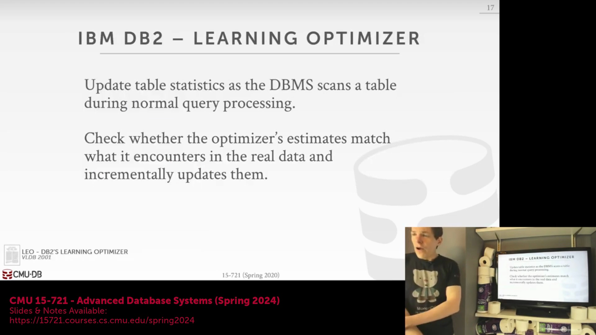
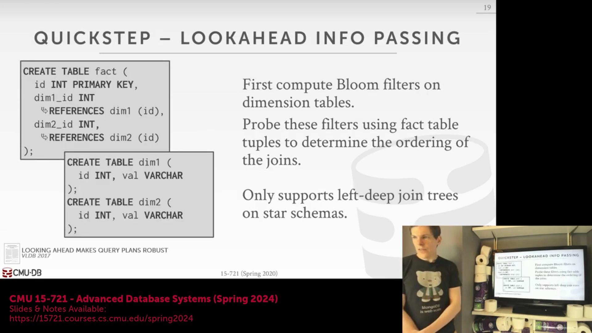
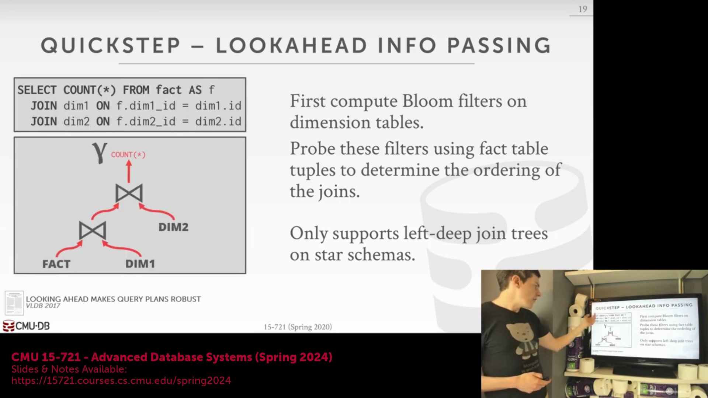
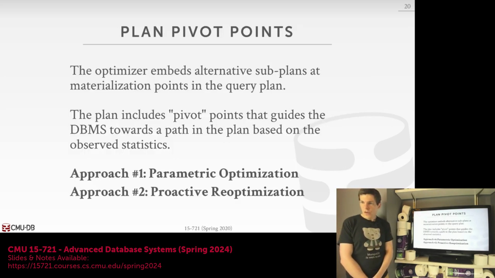
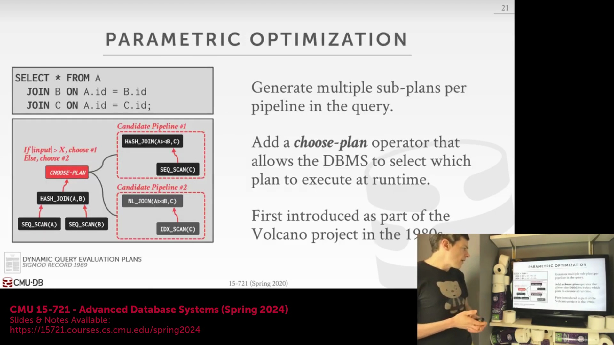

## 代码生成缓存拼接的过渡

作为对编译级优化(Compilation-Level Optimization)讨论的总结，现代数据仓库能够通过从共享缓存中提取预编译的机器码片段，高效处理未见过的查询(Unseen Queries)。通过识别跨不同客户与工作负载的相似访问模式(Access Patterns)或谓词(Predicates)，系统可在运行时将这些缓存的代码生成片段(Code Generation Fragments)拼接起来，从而在每次新查询调用时大幅规避昂贵的编译开销。

## IBM LEO：自适应代价模型反馈循环

IBM 的 LEO(Learning Optimizer) 是自适应查询处理(Adaptive Query Processing)最早且最具影响力的商业实现之一，现已深度集成至 DB2 中。该系统基于持续反馈循环(Continuous Feedback Loop)运行，旨在逐步提升代价模型(Cost Model)的准确性。在计划生成阶段，LEO 会记录优化器的初始基数(Cardinality)与代价估算(Cost Estimation)。查询执行完毕后，系统会将这些预测值与实际运行时行为及数据统计信息(Statistics)进行比对。若发现显著偏差，系统将捕获实际指标，并在向应用程序返回结果后，持久化更新其内部的代价模型与统计信息。这确保了后续查询调用能够持续受益于日益精准的估算。

## 执行中重优化与计划挽救
尽管统计反馈(Statistics Feedback)能优化后续查询，但另一大挑战在于如何纠正*正在执行*却被分配了次优计划(Suboptimal Plan)的查询。引擎不会让用户等待下一次查询调用，而是持续监控预估执行行为与实际观测行为之间的偏差。一旦检测到严重失配，系统必须进行关键权衡(Critical Trade-off)：是中止整个查询以触发完全重优化(Full Re-optimization)，还是保留已处理的中间结果。优化器会评估：放弃代价高昂的部分已完成工作并从头开始，是否比保留有效的子计划(Subplan)并为剩余操作请求新的优化执行路径更为划算。这种动态挽救机制(Dynamic Salvage Mechanism)在运行时实时权衡了额外开销与潜在的性能收益。

## Apache Quickstep：前瞻信息传递

Apache Quickstep 引入了一种名为前瞻信息传递(Look-Ahead Information Passing, LAIP)的高效自适应技术，专为星型模式(Star Schema)工作负载设计。引擎不会立即启动对大型核心事实表(Fact Table)的全表扫描，而是优先处理较小的维度表(Dimension Table)以构建哈希表与布隆过滤器(Bloom Filter)。这些过滤器会被提前传递至事实表扫描算子。在进入完整的探测(Probe)阶段前，系统会对这些过滤器执行轻量级采样，从而动态评估其选择性(Selectivity)。 

若采样结果表明某维度表的过滤器具有极高的选择性，引擎将主动触发连接重排序(Join Reordering)。系统会优先对过滤效果最强的哈希表执行探测操作，从而在流水线更早期阶段有效过滤掉无关元组(Irrelevant Tuples)。该决策可在全量事实表扫描完成前即时制定并执行，通过实时、数据驱动的连接重排序，最大限度地减少了无效的 I/O 与 CPU 周期消耗。

## 计划切换点与参数化查询优化

另一种强大的自适应范式是将“计划切换点(Plan Pivot Points)”或动态合成的切换算子(Synthesized Switch Operators)直接嵌入至物理查询计划(Physical Query Plan)中。该架构允许执行引擎根据实时运行时指标，动态将数据流路由至替代子路径(Alternative Sub-paths)，从而免除了在执行中途暂停并重新咨询优化器的需求。 

该概念的基础实现之一是参数化查询优化(Parametric Query Optimization)，由 20 世纪 80 年代末的 Volcano 项目首创。针对可能因不同执行策略而产生显著性能差异的每条流水线(Pipeline)，优化器会预先生成并行子计划。一个 `Choose Plan`（选择计划）算子充当内联条件开关(Inline Conditional Switch)：若中间结果的基数(Cardinality)低于特定阈值，执行流将被路由至嵌套循环连接(Nested Loop Join)，以规避构建哈希表的开销；若数据量较大，则自动切换至哈希连接(Hash Join)。此类嵌入式决策机制保留了已处理的数据，并有效避免了昂贵的重规划开销(Replanning Overhead)。

## 基于边界框的主动重优化
在内联切换点的基础上，主动重优化(Proactive Re-optimization)将本地计划切换与全局优化器调用相结合。在初始规划阶段，优化器不仅生成可切换的子计划，还划定“边界框(Bounding Boxes)”——即定义数据特征可接受不确定性范围的统计阈值(Statistical Thresholds)。随着查询执行，系统持续采集运行时统计信息(Runtime Statistics)。若条件仅发生轻微波动，查询将无缝切换至最优的嵌入式子路径(Embedded Sub-paths)。然而，若实际数据指标严重突破边界框阈值，表明优化器的基础假设已被根本性颠覆，系统将触发完整的重优化。这种混合架构(Hybrid Approach)提供了极强的适应性：在本地层面消化微小的数据偏差，同时为重大的基数估算错误保留安全网(Safety Net)。