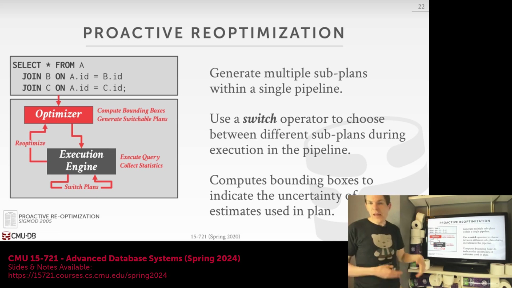
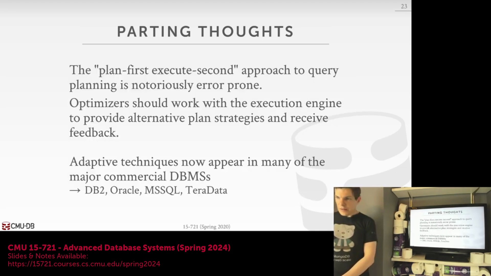
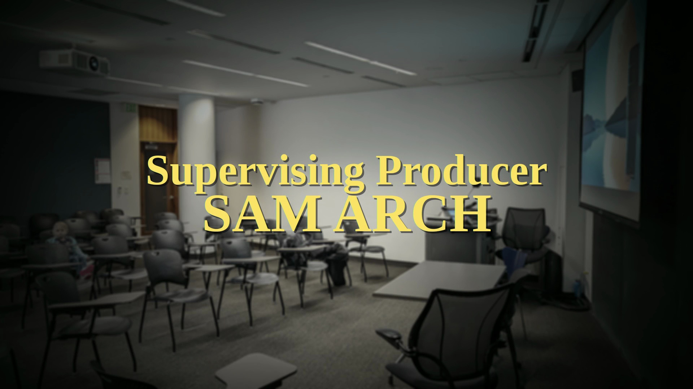

## 执行中决策(Runtime Decision)

当查询执行引擎(Query Execution Engine)在运行中途检测到显著的估算误差(Estimation Errors)时，必须做出一个关键的架构决策(Architectural Decision)：是保留(Retain)计划中已执行的（可能代价高昂的）部分，还是丢弃所有中间结果(Intermediate Results)并从头重启。该权衡(Trade-off)需要仔细评估已消耗的计算成本(Sunk Computational Cost)与新生成执行路径的预期性能收益之间的得失。

## 运行时自我修正的力量(Power of Runtime Self-Correction)

自适应查询优化(Adaptive Query Optimization)为传统的静态计划生成(Static Plan Generation)提供了一种极具韧性(Robustness)的替代方案。其核心优势在于免除了必须在执行初期就生成完美执行计划(Perfect Execution Plan)的要求。相反，系统利用实时执行反馈(Real-time Execution Feedback)进行持续的自我修正(Self-Correction)，随着运行时实际数据特征(Data Characteristics)的显现，动态调整连接顺序(Join Ordering)、访问方法(Access Methods)与并行度(Degree of Parallelism)。

## 架构耦合与实现挑战(Architectural Coupling and Implementation Challenges)
有效实现自适应执行(Adaptive Execution)要求查询优化器(Query Optimizer)与执行引擎(Execution Engine)之间建立紧密的协同关系。这些组件无法孤立设计或部署；优化器必须深入理解执行器的运行时能力(Runtime Capabilities)，例如如何安全地切换执行路径，或如何将中间结果物化(Materialize Intermediate Results)以支持重规划(Re-planning)。因此，将自适应功能集成至解耦的“优化器即服务”(Optimizer-as-a-Service)框架（如微软的 Orca 或基于 Cascades 框架的优化器）会带来巨大的工程挑战，因为跨服务边界维持紧密且低延迟的反馈循环(Feedback Loop)极为困难。

## 商业应用与开源领域的差距(Commercial Adoption vs. Open-Source Gap)

近年来，自适应查询优化已从学术研究走向主流商业实践(Mainstream Commercial Practice)。尽管 IBM 早在 21 世纪初便率先推出了 LEO(Learning Optimizer) 等早期实现，但 Oracle、SQL Server 和 Teradata 等主要企业级厂商近期已在其核心引擎中深度集成了自适应执行功能。相比之下，PostgreSQL 和 MySQL 等广泛使用的开源数据库目前仍缺乏对该技术的原生支持(Native Support)，过去十年间涌现的众多新型开源系统也尚未引入类似的运行时修正机制(Runtime Correction Mechanisms)。

## 总结与向代价模型的过渡(Summary and Transition to Cost Models)

本讲表明，现代查询优化(Query Optimization)已不再是僵化的一次性编译步骤(One-time Compilation Step)。先进系统能够动态、即时地修改执行计划，利用运行时统计信息(Runtime Statistics)克服预测模型的固有局限性。课程最后强调，尽管自适应技术能有效缓解次优计划(Suboptimal Plans)带来的问题，但深入理解底层代价模型(Cost Model)依然至关重要。下节课将深入探讨这些代价模型的工作原理、其频繁产生不准确估算(Inaccurate Estimations)的原因，以及它们为查询优化带来的根本性挑战(Fundamental Challenges)。