## 经典查询优化器(Query Optimizer)简介
迄今为止所讨论的查询优化器代表了数据库查询执行的经典静态方法。当提交 SQL 查询时，系统会对其进行解析，并在任何实际执行开始*之前*，将其送入优化器以生成完整的执行计划(Execution Plan)。这一预计算阶段是必不可少的，因为数据库若缺乏预定义的查询计划，便无法启动查询的执行流程。
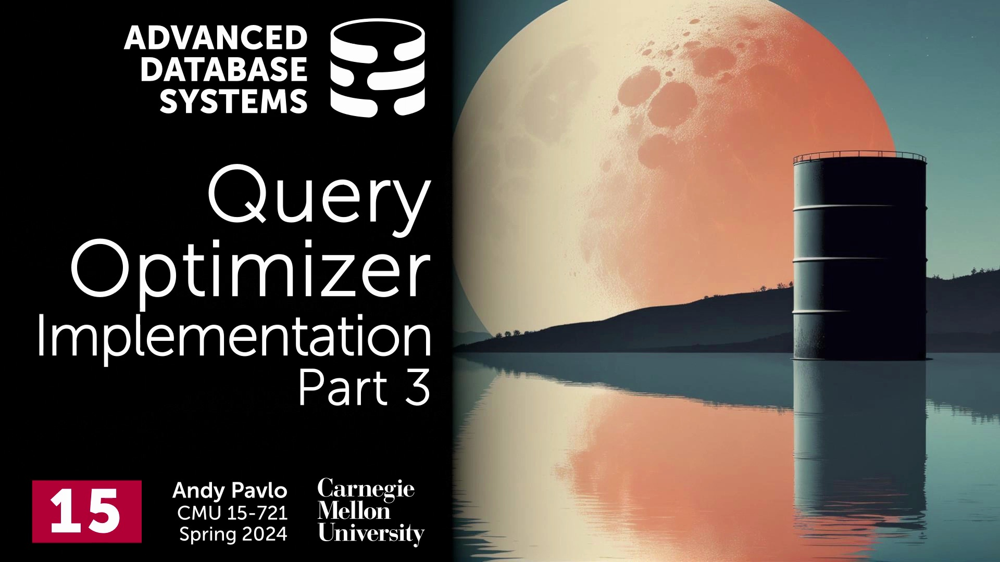
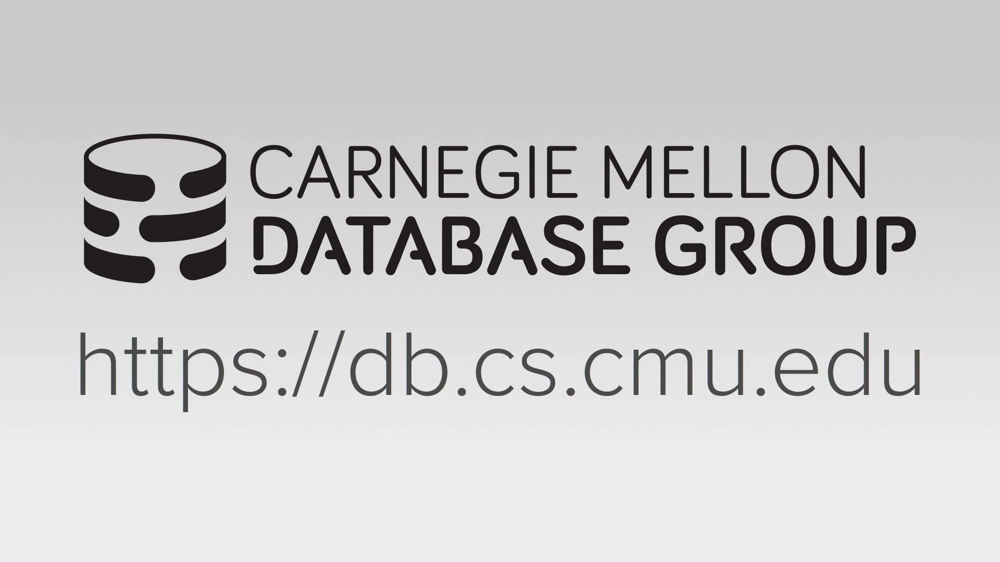
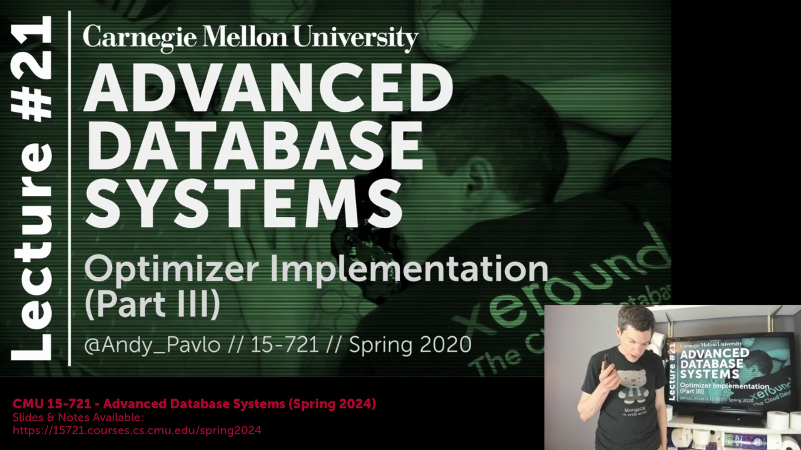

## 静态假设的挑战
这种传统模型的主要缺陷在于，优化器在执行前针对“最佳”计划所做出的假设，在实际运行环境中可能并不成立。由于查询执行依赖于预先确定的计划，优化器必须基于对数据库状态及其运行环境的静态假设(Static Assumptions)来进行决策。然而，这些条件实际上是高度动态的：数据库管理员频繁地添加或删除索引、调整分区方案，或执行大量的插入与删除操作，从而导致数据分布发生偏移(Data Distribution Shift)。此外，预编译语句(Prepared Statements)中的参数变化以及定期的统计信息更新（例如通过 `ANALYZE` 命令）会显著影响代价模型(Cost Model)的计算结果，致使初始生成的执行计划沦为次优(Suboptimal)方案。
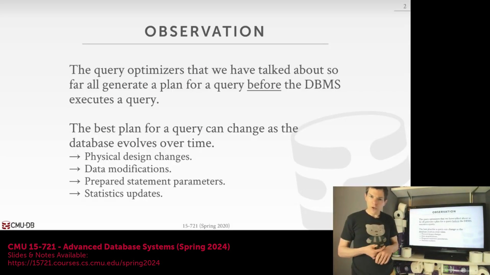

## 次优计划的原因：基数估计(Cardinality Estimation)
为了提升优化器的效能，我们首先必须探究所生成的执行计划为何会失效。其中最常见且代价高昂的问题是连接顺序(Join Order)错误，这会严重拖慢分析型工作负载(Analytical Workloads)的性能。此类顺序错误几乎总是源于不准确的基数估计。例如，优化器可能预测某个连接算子(Join Operator)将仅输出 1,000 个元组(Tuples)，而实际运行时却产生了 10 万条甚至更多记录。估计基数与实际基数之间的显著差异是一个反复出现的难题，现代查询优化技术必须设法克服这一障碍。

## 示例：估计错误的影响
鉴于代价模型可能产生存在偏差的估计值，我们的目标是在查询执行过程中及时检测出性能低下的计划，并实现动态适应(Dynamic Adaptation)。考虑一个包含表 A、B、C 和 D 的四表连接查询，该查询附带一个简单的 `WHERE` 过滤条件。优化器可能会生成一个采用哈希连接(Hash Join)与顺序扫描(Sequential Scan)的执行计划，并为某个特定的中间算子(Intermediate Operator)预估基数为 1,000。若运行时(Runtime)执行反馈的实际基数高达 100,000（高出预估两个数量级），数据库系统就必须决定是否动态调整当前的执行计划。潜在的调整策略包括重新排列连接顺序、切换至其他连接算法(Join Algorithms)，或修改底层的数据访问方法(Access Methods)（例如改用索引扫描(Index Scan)），从而使其更贴合实际的数据分布特征。
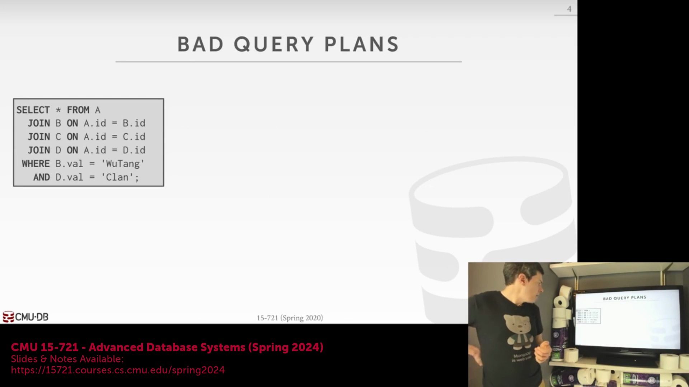
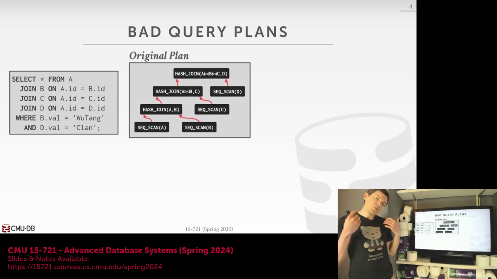

## 自适应查询优化(Adaptive Query Optimization)：核心概念
传统的代价模型通常依赖于系统目录中的统计信息(Catalog Statistics)（如直方图(Histograms)、数据样本等）、硬件配置参数以及并发工作负载(Concurrent Workloads)数据，以便在执行前对执行计划的质量进行评估。当这些静态估计失效时，**自适应查询优化**（亦称自适应查询处理(Adaptive Query Processing)）提供了一种有效的解决方案。该技术允许数据库系统在查询执行期间动态修改执行计划，使其更精准地匹配底层的实际数据状况。其调整范围跨度很大，既可以彻底重新生成全新的执行计划并从头开始执行，也可以仅通过引入物化点(Materialization Points)来局部修改部分子计划(Subplans)，并在这些关键节点处替换为备用执行策略。至关重要的是，在执行过程中采集的运行时数据不仅能够用于优化当前查询的执行，还可以反馈至全局系统目录，以持续完善未来查询所需的统计信息。
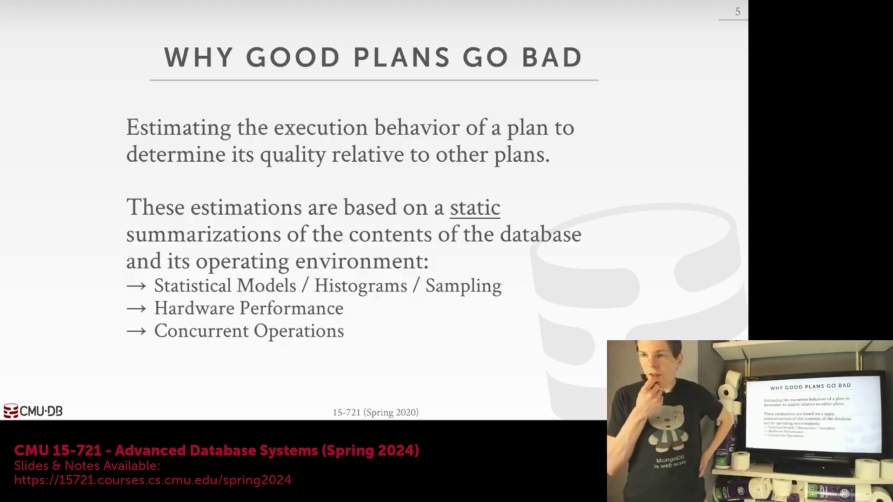
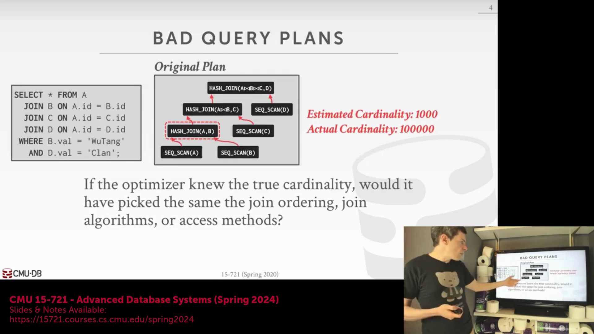
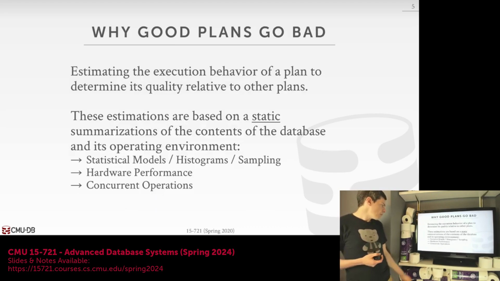

## 自适应执行策略(Adaptive Execution Strategies)
自适应查询技术大致可归纳为三种核心策略。首先，系统可以收集并利用运行时统计信息，使同一查询或相似查询的*未来*执行调用从中受益。其次，系统可以在无需完全重启执行流程的情况下，动态调整*当前*查询的执行路径，并依托现有的扫描算子(Scan Operators)实时优化性能。第三，若发现当前执行计划存在严重缺陷，系统可选择暂停当前执行，将控制权交还给优化器重新进行规划，并从头生成一个全新的执行计划。上述策略协同作用，旨在弥合理论代价模型与实际执行环境之间的鸿沟。

---

## 运行时数据收集与目录更新(System Catalog Updates)
自适应查询优化(Adaptive Query Optimization)最基础的实现形式，是在查询执行过程中收集关于数据分布和谓词选择率(Predicate Selectivity)的运行时信息(Runtime Information)。传统优化器通常依赖预先收集的直方图(Histograms)和统计模型(Statistical Models)来估算扫描操作(Scan Operations)将输出的元组(Tuples)数量，该估算结果直接决定了连接顺序(Join Order)与整体执行计划(Execution Plan)的结构。然而，在实际执行阶段，数据库能够直接观测到真实的选择率(Selectivity)。若代价模型(Cost Model)预估的匹配率为 1%，而运行时评估(Actual Runtime Evaluation)却显示高达 99%，系统可通过两种途径利用该差异：一是动态调整当前查询的执行策略；二是将精确的运行时指标(Runtime Metrics)反馈至全局系统目录(System Catalog)，从而优化未来所有查询的执行计划生成。
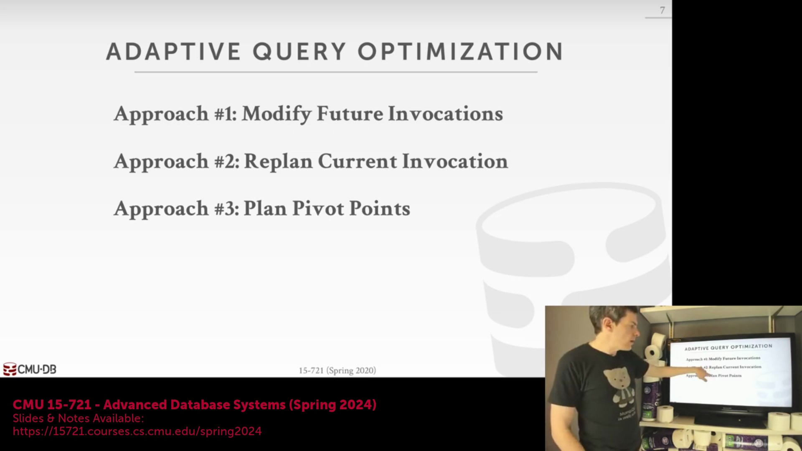

## 基于回退的计划修正(Fallback-based Plan Correction)
应对查询性能退化(Performance Regression)的一项基础技术是**基于回退的计划修正**。现代商业数据库系统通常维护一个内部的执行历史存储库(Execution History Repository)，用于追踪每个已执行查询的详情、对应的执行计划、估算代价(Estimated Cost)以及真实的运行时指标（如 CPU 耗时、处理的元组数量等）。当高频查询遭遇环境变更（例如统计信息更新或新增索引）时，优化器可能会为其生成全新的执行计划。若新计划的实际运行时性能劣于历史缓存的旧计划，系统将自动回退(Fallback)至先前经过验证的稳定策略。这种全局回退机制有效保障了在底层物理设计或统计模型发生变更时，查询执行的稳定性(Stability)。
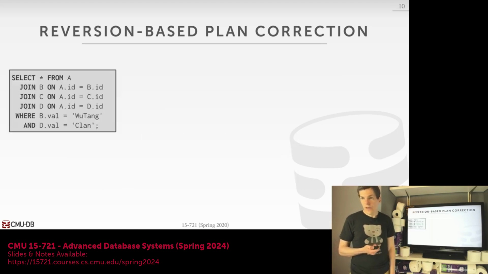
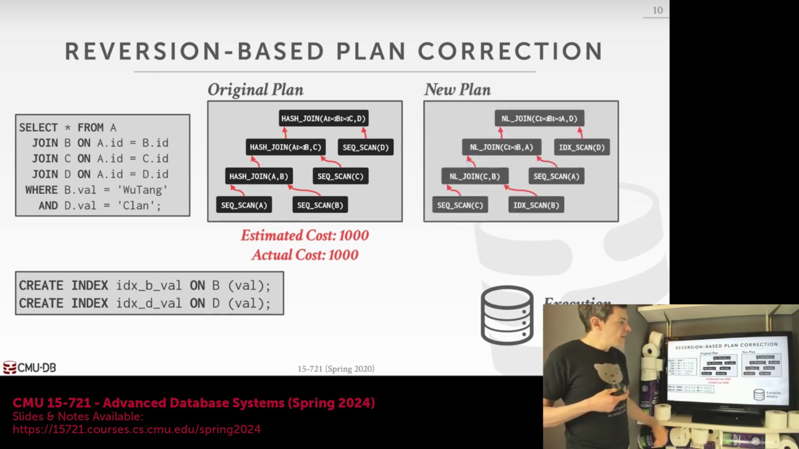

## 计划拼接(Plan Stitching)：超越整体回退
尽管简单的回退机制提供了稳定性，但其运作方式较为粗放，且呈现非此即彼的二元特性。一种更为精细的替代方案是**计划拼接**技术，该方案由微软率先提出。系统不会直接全盘丢弃表现不佳或失效的执行计划，而是从中提取运行高效的子计划(Subplan)，并将其重新组装为全新的混合计划(Hybrid Plan)。其核心在于，这些复用的子计划无需源自完全相同的查询语句；只要它们在逻辑上等价(Logically Equivalent)，来自不同查询执行上下文的组件即可安全地集成至同一计划中。当物理设计变更(Physical Design Changes)导致计划局部失效时（例如索引扫描(Index Scan)所依赖的索引被删除），拼接技术能够挽救剩余合法的算子(Valid Operators)，从而避免强制触发全量的重新优化(Re-optimization)。

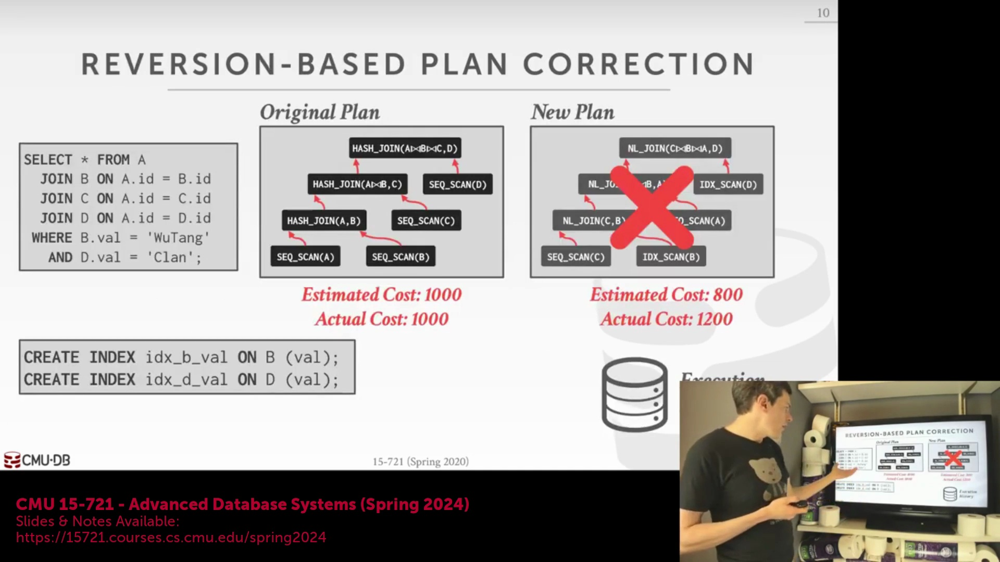
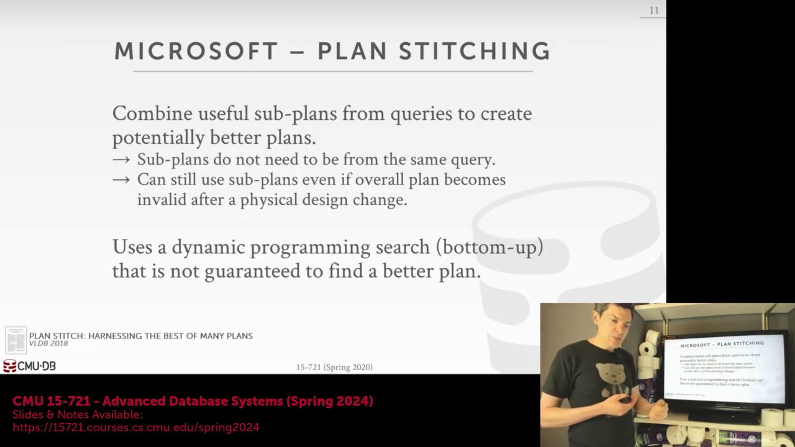

## 用于子计划优化的动态规划(Dynamic Programming)
为高效构建此类拼接计划，系统采用了一种自底向上(Bottom-Up)的动态规划搜索算法。该算法逐层评估算子代价(Operator Cost)，在每一层级筛选出最高效的子计划，进而组装出全局代价最低的执行路径。尽管这种启发式(Heuristic)方法无法保证寻得绝对最优解，亦不能确保始终生成完全合法的执行计划，但其以极低的计算开销显著提升了系统的自适应能力。例如，若两个被挽救的子计划段运行时开销(Runtime Cost)分别为 600 和 150，组合后的拼接总代价仅为 750，该结果不仅优于原始计划的 1000 代价，也远胜于新生成的失败计划。此拼接过程独立于标准查询优化器(Standard Query Optimizer)运行，使得系统能够充分利用历史运行时数据，动态拼装出高效的执行路径。
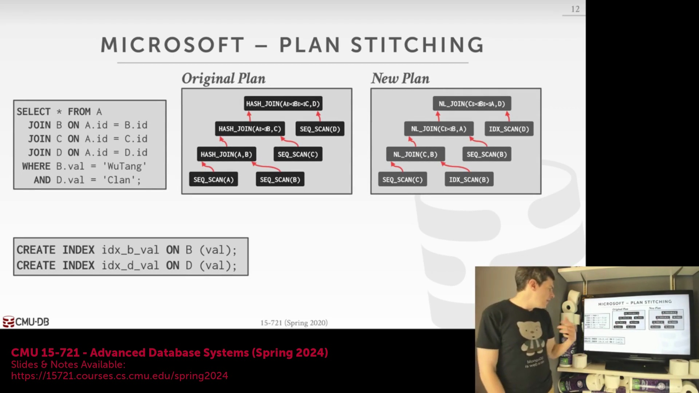
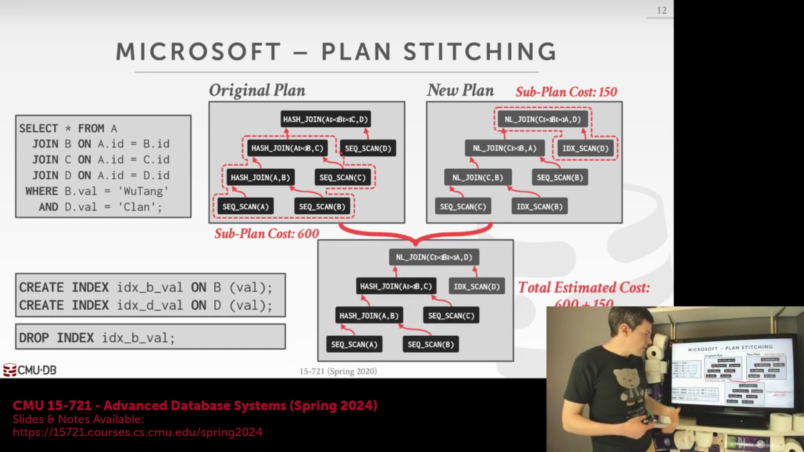

---

## SQL Server 中的计划拼接(Plan Stitching)简介
SQL Server 的查询优化器(Query Optimizer)运行着一个执行自顶向下搜索的 Cascades 框架(Cascades Framework)。在主流程之外，后台还会运行一个辅助搜索，专门用于寻找能够从现有组件中拼接而成的执行计划。该过程的基础步骤是识别不同查询中的哪些部分或子计划在逻辑上是等价的，这一步建立在之前 Cascades 中讨论过的多组(Multi-Group)与多表达式组(Multi-Expression Group)概念之上。其目标是确认给定子计划的输出是否与另一子计划的输出完全相同或逻辑等价。
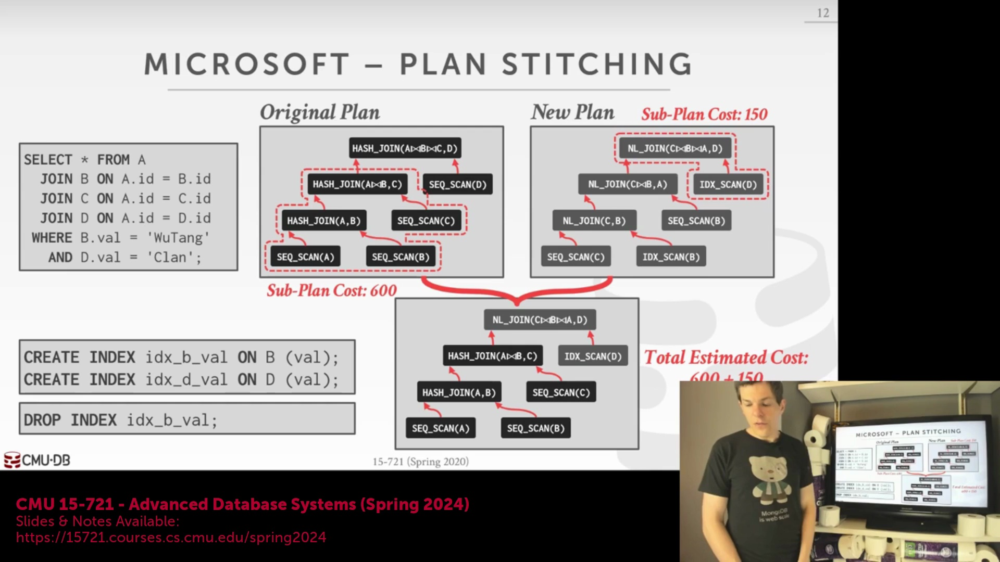

## 等价性识别与启发式剪枝(Heuristic Pruning)
识别逻辑等价性在很大程度上依赖于关系代数(Relational Algebra)规则，以找出可交换或可结合的操作。例如，输出 `A join B join C` 的子计划在逻辑上等价于 `C join B join A`，因为内连接(Inner Join)是可交换的。然而，从理论上讲，判断任意逻辑表达式或子计划是否等价是不可判定的(Undecidable)；没有任何算法能为所有可能情况保证给出正确的“是”或“否”答案。为了解决这个问题，计划拼接阶段采用了实用的启发式方法(Heuristic Approach)。例如，如果两个子计划访问的是完全不同的表，它们会立即被判定为不等价。系统还会利用现有 SQL Server 优化器的验证检查来剪枝(Pruning)无效的匹配。该方法通过避免穷举评估并依赖基于规则的代数捷径，在实现复杂度、判定准确性与搜索性能之间取得了必要的平衡。

## 使用 OR 操作符(OR Operator)编码搜索空间
一旦识别出等价的子计划，它们就会被合并到一个统一的查询结构中。为了表示各种有效的执行路径，引入了一个新的 `OR` 操作符。该操作符仅存在于搜索阶段，不会在实际查询执行中使用。它仅用于表示其下属的子计划在逻辑上等价，从而允许优化器自由选择任意执行路径。该结构采用深度优先(Depth-First)的方式构建。在顶层，对于同一个逻辑操作，`OR` 节点可能会在哈希连接(Hash Join)和嵌套循环连接(Nested Loop Join)之间进行分支。当搜索向下遍历连接节点并到达叶节点（如顺序扫描(Sequential Scan)或索引扫描(Index Scan)）时，额外的 `OR` 操作符会对替代的访问方法进行编码。在工作负载测试中，该编码机制成功拼接了 75% 至接近 100% 的执行计划。
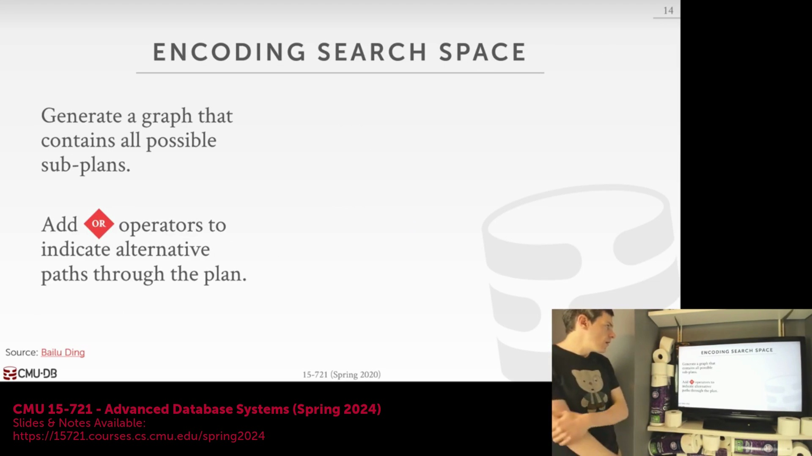

## 自底向上(Bottom-Up)的代价计算与计划重建
在使用 `OR` 分支对搜索空间进行完整编码后，优化器会执行自底向上的动态规划(Dynamic Programming)搜索，这与 System R 中使用的方法类似。优化器从叶节点开始，计算每个可用分支向上一级操作符转换的代价。在每个 `OR` 节点处，系统会评估累积代价并选择代价最低的选项。该过程逐层重复，沿树向上移动，直到所有节点都被评估完毕。确定整体结构的最优代价后，系统将通过回溯最低代价路径来重建最终的拼接计划(Stitched Plan)。

## 工程考量与优化器集成
该方法最初发表于 SIGMOD 研究论文中，思路极具吸引力，但目前尚不明确微软是否在生产环境中部署了该确切实现。从工程角度来看，维护一套独立于主查询优化器的搜索基础设施会产生显著的架构开销。更具说服力且可扩展的方案是将此类拼接逻辑作为原生组件直接集成至查询优化器中，从而简化工作流程，并消除对并行搜索基础设施的依赖。

## Amazon Redshift 中的代码级拼接
在 Amazon Redshift（一个基于 PostgreSQL 并使用编译引擎(Compilation Engine)的数据仓库）中，代码生成(Code Generation)层也运行着一种概念上类似的方法。Redshift 不会生成传统的物理查询计划(Physical Query Plan)，而是为每个计划生成 C/C++ 代码，将其编译为机器码，并执行生成的共享对象(Shared Object)。由于对每个查询都调用像 GCC 这样的编译器在计算上非常昂贵，Redshift 会缓存这些已编译的代码片段。当具有相似访问模式(Access Pattern)或谓词(Predicate)的新查询到来时，系统会识别出所需的机器码与之前缓存的片段完全相同。系统不会重新编译，而是直接复用缓存的版本。这种片段共享甚至可以跨不同的客户和表进行。通过从共享缓存中提取预编译的代码生成片段并进行拼接，Redshift 能够高效处理符合现有执行模式的新查询，从而大幅降低编译开销(Compilation Overhead)。
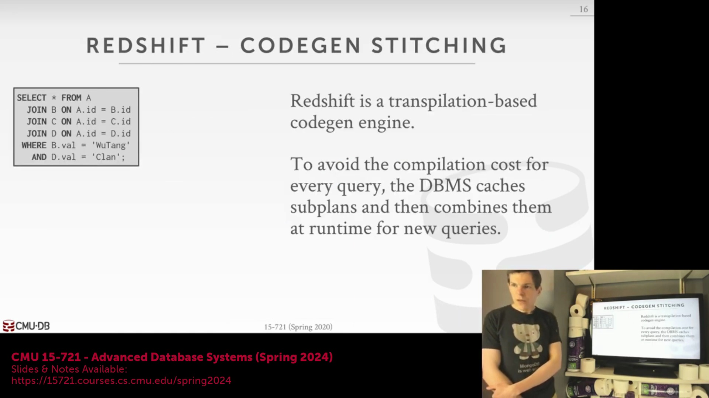

---

## 代码生成缓存拼接的过渡

作为对编译级优化(Compilation-Level Optimization)讨论的总结，现代数据仓库能够通过从共享缓存中提取预编译的机器码片段，高效处理未见过的查询(Unseen Queries)。通过识别跨不同客户与工作负载的相似访问模式(Access Patterns)或谓词(Predicates)，系统可在运行时将这些缓存的代码生成片段(Code Generation Fragments)拼接起来，从而在每次新查询调用时大幅规避昂贵的编译开销。

## IBM LEO：自适应代价模型反馈循环

IBM 的 LEO(Learning Optimizer) 是自适应查询处理(Adaptive Query Processing)最早且最具影响力的商业实现之一，现已深度集成至 DB2 中。该系统基于持续反馈循环(Continuous Feedback Loop)运行，旨在逐步提升代价模型(Cost Model)的准确性。在计划生成阶段，LEO 会记录优化器的初始基数(Cardinality)与代价估算(Cost Estimation)。查询执行完毕后，系统会将这些预测值与实际运行时行为及数据统计信息(Statistics)进行比对。若发现显著偏差，系统将捕获实际指标，并在向应用程序返回结果后，持久化更新其内部的代价模型与统计信息。这确保了后续查询调用能够持续受益于日益精准的估算。

## 执行中重优化与计划挽救
尽管统计反馈(Statistics Feedback)能优化后续查询，但另一大挑战在于如何纠正*正在执行*却被分配了次优计划(Suboptimal Plan)的查询。引擎不会让用户等待下一次查询调用，而是持续监控预估执行行为与实际观测行为之间的偏差。一旦检测到严重失配，系统必须进行关键权衡(Critical Trade-off)：是中止整个查询以触发完全重优化(Full Re-optimization)，还是保留已处理的中间结果。优化器会评估：放弃代价高昂的部分已完成工作并从头开始，是否比保留有效的子计划(Subplan)并为剩余操作请求新的优化执行路径更为划算。这种动态挽救机制(Dynamic Salvage Mechanism)在运行时实时权衡了额外开销与潜在的性能收益。

## Apache Quickstep：前瞻信息传递

Apache Quickstep 引入了一种名为前瞻信息传递(Look-Ahead Information Passing, LAIP)的高效自适应技术，专为星型模式(Star Schema)工作负载设计。引擎不会立即启动对大型核心事实表(Fact Table)的全表扫描，而是优先处理较小的维度表(Dimension Table)以构建哈希表与布隆过滤器(Bloom Filter)。这些过滤器会被提前传递至事实表扫描算子。在进入完整的探测(Probe)阶段前，系统会对这些过滤器执行轻量级采样，从而动态评估其选择性(Selectivity)。 

若采样结果表明某维度表的过滤器具有极高的选择性，引擎将主动触发连接重排序(Join Reordering)。系统会优先对过滤效果最强的哈希表执行探测操作，从而在流水线更早期阶段有效过滤掉无关元组(Irrelevant Tuples)。该决策可在全量事实表扫描完成前即时制定并执行，通过实时、数据驱动的连接重排序，最大限度地减少了无效的 I/O 与 CPU 周期消耗。

## 计划切换点与参数化查询优化

另一种强大的自适应范式是将“计划切换点(Plan Pivot Points)”或动态合成的切换算子(Synthesized Switch Operators)直接嵌入至物理查询计划(Physical Query Plan)中。该架构允许执行引擎根据实时运行时指标，动态将数据流路由至替代子路径(Alternative Sub-paths)，从而免除了在执行中途暂停并重新咨询优化器的需求。 

该概念的基础实现之一是参数化查询优化(Parametric Query Optimization)，由 20 世纪 80 年代末的 Volcano 项目首创。针对可能因不同执行策略而产生显著性能差异的每条流水线(Pipeline)，优化器会预先生成并行子计划。一个 `Choose Plan`（选择计划）算子充当内联条件开关(Inline Conditional Switch)：若中间结果的基数(Cardinality)低于特定阈值，执行流将被路由至嵌套循环连接(Nested Loop Join)，以规避构建哈希表的开销；若数据量较大，则自动切换至哈希连接(Hash Join)。此类嵌入式决策机制保留了已处理的数据，并有效避免了昂贵的重规划开销(Replanning Overhead)。

## 基于边界框的主动重优化
在内联切换点的基础上，主动重优化(Proactive Re-optimization)将本地计划切换与全局优化器调用相结合。在初始规划阶段，优化器不仅生成可切换的子计划，还划定“边界框(Bounding Boxes)”——即定义数据特征可接受不确定性范围的统计阈值(Statistical Thresholds)。随着查询执行，系统持续采集运行时统计信息(Runtime Statistics)。若条件仅发生轻微波动，查询将无缝切换至最优的嵌入式子路径(Embedded Sub-paths)。然而，若实际数据指标严重突破边界框阈值，表明优化器的基础假设已被根本性颠覆，系统将触发完整的重优化。这种混合架构(Hybrid Approach)提供了极强的适应性：在本地层面消化微小的数据偏差，同时为重大的基数估算错误保留安全网(Safety Net)。

---

## 执行中决策(Runtime Decision)

当查询执行引擎(Query Execution Engine)在运行中途检测到显著的估算误差(Estimation Errors)时，必须做出一个关键的架构决策(Architectural Decision)：是保留(Retain)计划中已执行的（可能代价高昂的）部分，还是丢弃所有中间结果(Intermediate Results)并从头重启。该权衡(Trade-off)需要仔细评估已消耗的计算成本(Sunk Computational Cost)与新生成执行路径的预期性能收益之间的得失。

## 运行时自我修正的力量(Power of Runtime Self-Correction)

自适应查询优化(Adaptive Query Optimization)为传统的静态计划生成(Static Plan Generation)提供了一种极具韧性(Robustness)的替代方案。其核心优势在于免除了必须在执行初期就生成完美执行计划(Perfect Execution Plan)的要求。相反，系统利用实时执行反馈(Real-time Execution Feedback)进行持续的自我修正(Self-Correction)，随着运行时实际数据特征(Data Characteristics)的显现，动态调整连接顺序(Join Ordering)、访问方法(Access Methods)与并行度(Degree of Parallelism)。

## 架构耦合与实现挑战(Architectural Coupling and Implementation Challenges)
有效实现自适应执行(Adaptive Execution)要求查询优化器(Query Optimizer)与执行引擎(Execution Engine)之间建立紧密的协同关系。这些组件无法孤立设计或部署；优化器必须深入理解执行器的运行时能力(Runtime Capabilities)，例如如何安全地切换执行路径，或如何将中间结果物化(Materialize Intermediate Results)以支持重规划(Re-planning)。因此，将自适应功能集成至解耦的“优化器即服务”(Optimizer-as-a-Service)框架（如微软的 Orca 或基于 Cascades 框架的优化器）会带来巨大的工程挑战，因为跨服务边界维持紧密且低延迟的反馈循环(Feedback Loop)极为困难。

## 商业应用与开源领域的差距(Commercial Adoption vs. Open-Source Gap)

近年来，自适应查询优化已从学术研究走向主流商业实践(Mainstream Commercial Practice)。尽管 IBM 早在 21 世纪初便率先推出了 LEO(Learning Optimizer) 等早期实现，但 Oracle、SQL Server 和 Teradata 等主要企业级厂商近期已在其核心引擎中深度集成了自适应执行功能。相比之下，PostgreSQL 和 MySQL 等广泛使用的开源数据库目前仍缺乏对该技术的原生支持(Native Support)，过去十年间涌现的众多新型开源系统也尚未引入类似的运行时修正机制(Runtime Correction Mechanisms)。

## 总结与向代价模型的过渡(Summary and Transition to Cost Models)

本讲表明，现代查询优化(Query Optimization)已不再是僵化的一次性编译步骤(One-time Compilation Step)。先进系统能够动态、即时地修改执行计划，利用运行时统计信息(Runtime Statistics)克服预测模型的固有局限性。课程最后强调，尽管自适应技术能有效缓解次优计划(Suboptimal Plans)带来的问题，但深入理解底层代价模型(Cost Model)依然至关重要。下节课将深入探讨这些代价模型的工作原理、其频繁产生不准确估算(Inaccurate Estimations)的原因，以及它们为查询优化带来的根本性挑战(Fundamental Challenges)。