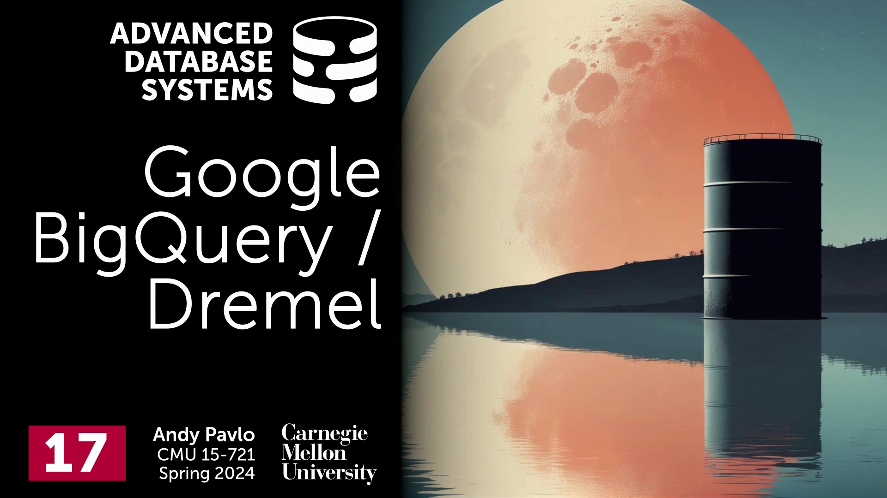
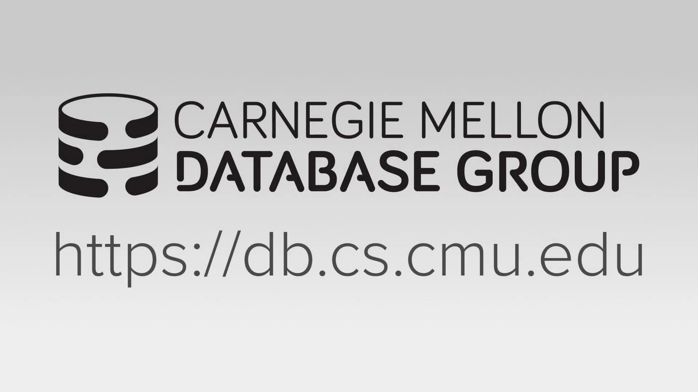
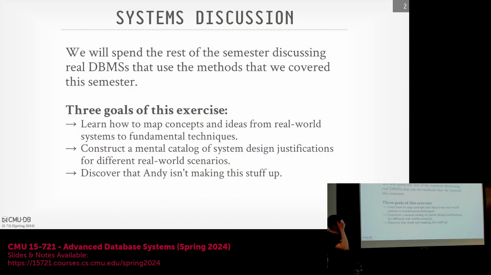
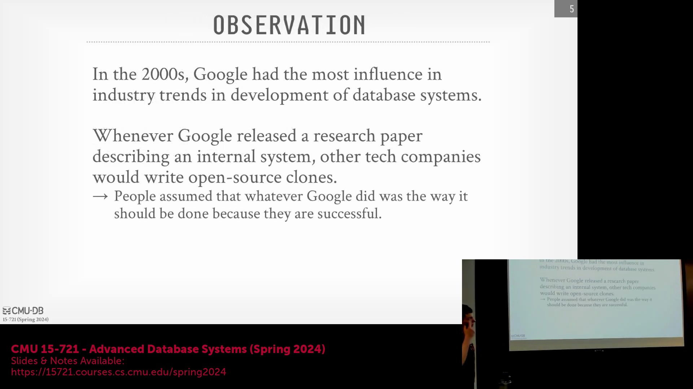
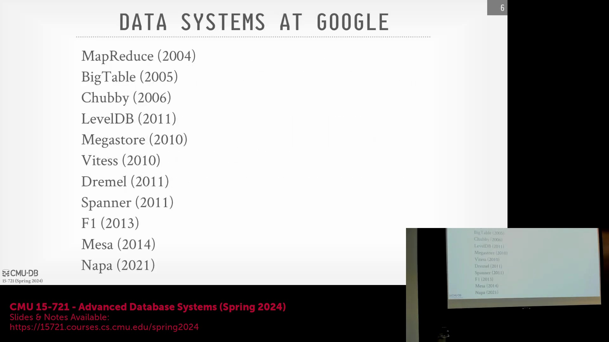
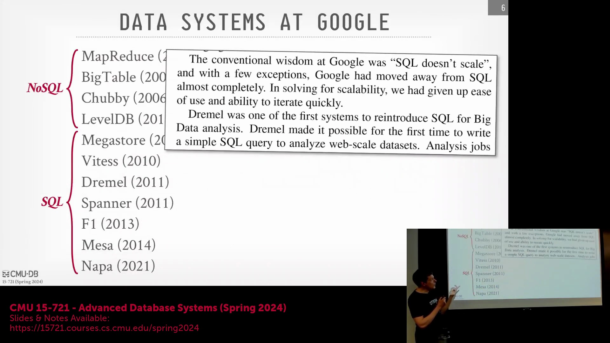
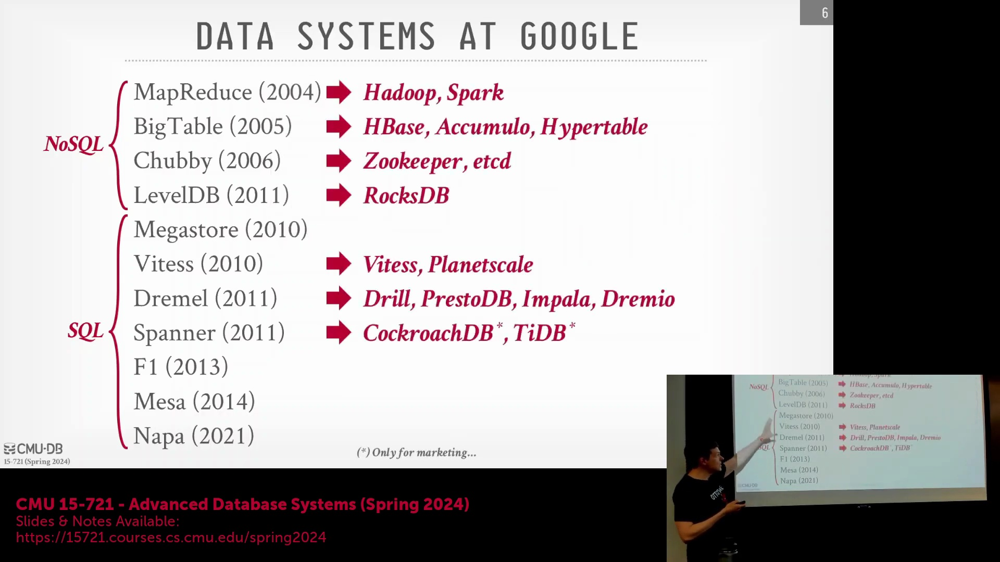

## 课程介绍与开场白
卡内基梅隆大学高级数据库系统(Advanced Database Systems)课程现场录制。

好了。我们赶紧讲完这部分，提前下课，大家正好可以去参加社团招新。

## 转向工业界系统论文
因此，在本学期的当前阶段，我们将开始阅读关于具体工业系统的论文。显然，你们今天阅读的论文是关于 Google BigQuery 的。

本阶段课程的主要目的是剖析企业如何运用本学期所学的各类技术、方法与算法来构建真实的工业级系统。这样做的核心目标在于培养大家阅读工业界论文的能力——其中部分论文营销色彩较重，另一些则是深入的技术探讨——但最终是为了理解他们如何将课堂知识应用于解决现实世界中的工程问题。

## 解码营销话术与技术本质
同时，也希望你们能够基于课程讨论的基础原理，去解读并准确还原工业界对某些概念的表述方式。例如，有时你会看到某个系统在介绍技术时使用与我们略有不同的术语，但因为你具备扎实的论文阅读基础，你会立刻明白：“哦，它实际上指的就是这个概念。” 这里并非针对 Dremio 系统（我们稍后会详细讨论），他们提出了一种称为“反射(Reflections)”的特性。这究竟是什么？以往可能从未听过这个说法。但只要稍微查阅其定义，你就会发现，它本质上就是物化视图(Materialized View)。因此，掌握真实系统构建的核心背景知识后，你就能轻松看穿营销话术，直击技术本质，明确其底层实现逻辑。他们称之为“反射”。没错。

## 构建实践知识与课程安排
此外，你们也在脑海中逐步构建起自己的技术知识库。在阅读优秀的工业界论文（尤其是 Databricks 的相关论文）时，你会经常看到这样的论述逻辑：“我们遇到了某类问题，因此采用此种架构解决。”或“面临另一类挑战，我们则采用彼种方案。” 同样，当你们未来步入业界时，便能清楚如何将从这些论文及其他系统中学到的经验迁移至不同的业务场景中。当然，始终牢记这一点会大有裨益：课程所讲内容绝非空中楼阁，本学期探讨的所有架构与理念均真实存在于工业实践中。正如我所言，今天我们将从 Google Dremel/BigQuery 开始。周三，我们将讨论 Databricks、Spark SQL 与 Photon 引擎，随后是 Delta Lake、DuckDB、Yellowbrick 和 Amazon Redshift。由于之前受肠胃病毒感染影响，我们不得不删减最后一个系统的讲解。我决定保留 Yellowbrick 而非微软的论文，正如之前有同学问到的，Yellowbrick 的论文极其硬核，涵盖了大量底层系统优化。更重要的是，他们在论文中公开了真实的基准测试数据，而这在许多大厂的论文中是看不到的。部分原因在于，大公司通常不愿论文中的数据被竞争对手在营销战中借题发挥（如同柔道中的借力打力）。但 Yellowbrick 对此毫不在意，他们公开了所有性能数据。这种做法非常难得。

## 现代系统中的重复架构主题
好的，贯穿我们将要阅读的所有论文的核心主题，依然是本学期反复强调的架构理念。首先便是存储与计算分离(Storage-Compute Separation)架构。这是典型的数据湖/湖仓一体(Data Lake/Lakehouse)模型：海量数据集中存放于 S3 或其他对象存储(Object Storage)中，随后我们在其上部署独立的查询引擎(Query Engine)。我们还会频繁看到缺乏统计信息(Statistics)所带来的优化挑战。没错，BigQuery 的论文中明确指出了这一点。我们会反复遇到这类场景：大量文件直接上传至对象存储，完全脱离数据库系统的管控。当查询请求到来并需要制定执行计划(Execution Plan)时，如果采用基于成本的优化器(Cost-Based Optimizer, CBO)，在缺乏统计信息的情况下，成本估算的依据是什么？显然，优化器只能退化为全表扫描(Full Table Scan)或依赖默认的启发式规则(Heuristic Rules)。此外，现代系统还需处理非关系型数据，例如 JSON，而在 BigQuery 中则是 Protobuf 格式文件。最后便是我们讨论过的向量化执行(Vectorized Execution)。这些技术在当今几乎已成为每个在线分析处理(Online Analytical Processing, OLAP)系统的标准配置。因此，这些论文实际上并不会花费大量篇幅讨论所谓的“独家创新”，因为这些特性早已成为行业标配。

## Google 对数据系统的历史影响
现在，我们来谈谈 Google Dremel/BigQuery 论文的时代背景。对于在座较年轻的同学而言，如今可能已不觉得 Google 仍是风头最劲的科技公司，大家的注意力或许更多集中在 OpenAI 等新兴企业上。但在 2000 年代，Google 绝对深刻重塑了业界思考、设计与开发数据库系统的方式。直至今日，我认为其影响力依然存在于工业界，尽管已不如当年那般具有统治力，这自然是因为相关技术已广泛普及。当前，大语言模型(Large Language Model, LLM)无疑是技术热点。

但在那个时代，几乎每次 Google 发布研究论文介绍其内部系统，都会引发业界轰动。大家争相阅读，并纷纷着手开发这些系统的开源克隆版(Open-source Clones)。大家普遍认同<think>
用户要求我对提供的翻译后的文章进行逐行校对。
需要满足的要求：
1. 检查翻译的准确性和流畅度
2. 标注专业术语（使用括号附上原文，如：机器学习(Machine Learning)）
3. 对不通顺的句子进行润色
4. 保持 Markdown 格式不变
5. 保留图片引用和链接
6. 输出校对后的最终版本，不包含修改说明或批注。

我将逐段处理文本，进行术语标注、润色和校对。

第一段：
## 课程介绍与开场白
卡内基梅隆大学高级数据库系统(Advanced Database Systems)课程现场录制。

好了，是的。我们赶紧过完这部分，早点下课，大家去看社团招新吧。 -> 润色：好了。我们尽快讲完这部分，提前下课，大家正好可以去参加社团招新活动。

第二段：
## 转向工业界系统论文
因此，在本学期的这个阶段，我们将开始阅读关于具体系统的论文。显然，你们今天读的论文是关于 Google BigQuery(Google BigQuery) 的。 -> Google BigQuery 本身就是专有名词，直接保留或加括号标注原文。

但本学期这一部分的目的，现在是要去审视和考察企业是如何基于我们整个学期所讨论的技术、方法、技巧和算法来构建真实系统的。这样做的目标是学会如何阅读工业界的论文——其中一些可能营销色彩较重，另一些则是真正的系统技术探讨——但核心是要理解他们如何应用我们讲过的知识来解决现实世界的问题。 -> 润色：本阶段课程的主要目的是剖析企业如何运用本学期所探讨的技术、方法与算法来构建真实的工业级系统。旨在培养大家阅读工业界论文的能力——部分论文可能营销色彩较重，另一些则是深入的技术探讨——但核心在于理解他们如何将课堂知识应用于解决现实世界中的工程问题。

第三段：
## 解码营销话术与技术本质
同时也希望你们能够基于我们讨论过的基础原理，去解读并重新校准他们对某些概念的表述方式。例如，有时你会看到某个系统谈论技术 ABC，用的术语和我们讲的略有不同，但因为你读过相关论文，你会恍然大悟：“哦，它实际上描述的就是这个。” 并不是要针对 Dremio(Dremio)，我们马上就会提到它。他们提到了一种叫“反射（reflections）”的东西。这到底是什么反射？我以前从来没听过。你稍微去读读定义，哦，原来就是物化视图（materialized views）。所以思路是这样的：现在你掌握了这些现实系统构建的核心背景知识，就能看穿营销话术，直击本质，明白它到底在做什么。他们管这叫“反射”。没错。 -> 润色：同时，也希望大家能基于课程讲解的基础原理，去解读并准确还原工业界对某些概念的表述。例如，有时你会看到某个系统在介绍技术 ABC 时，使用的术语与我们略有不同，但凭借相关的论文阅读积累，你会立刻明白：“哦，它实际上指的就是这个概念。” 这里并非针对 Dremio 系统（我们稍后会详细讨论），他们提出了一种称为“反射(Reflections)”的特性。这究竟是什么？以往可能从未听过。但只要稍微查阅定义，你就会发现，它本质上就是物化视图(Materialized View)。因此，掌握了真实系统构建的核心背景知识后，你就能轻松看穿营销话术，直击技术本质，明确其底层实现逻辑。他们称之为“反射”。没错。

第四段：
## 构建实践知识与课程安排
此外，你们现在也在脑海中建立起自己的知识库。在阅读优秀的论文（尤其是 Databricks 的那篇）时，你会看到这样的结构：“我们遇到了这个问题，所以我们用这种方式解决了它。”或者“有另一个问题，我们用那种方式解决了。” 同样，当你们未来步入业界时，就会知道如何将从这些论文和其他系统中学到的经验应用到不同的场景中。当然，能认识到这一点总是很好的：我讲的这些都不是凭空捏造的，这学期我们讨论的所有内容都是真实存在的。所以，正如我所说，我们今天将从 Google Dremel/BigQuery 开始。周三，我们将讨论 Databricks、Spark SQL 和 Photon，然后是 Delta Lake、DuckDB、Yellowbrick 和 Redshift。因为之前感染了肠胃病毒，我们不得不删掉最后一个系统。我决定删掉微软的论文而不是 Yellowbrick 的，因为正如他之前问的，Yellowbrick 的论文非常硬核，他们做了各种底层系统优化。而且他们在论文中报告了真实的数据，而在其他论文中你看不到这些。部分原因是因为大公司不希望论文中的数据被竞争对手在营销战中借题发挥（就像柔道借力打力一样）。但 Yellowbrick 根本不在乎，他们把所有数据都列出来了。这非常棒。 -> 润色：此外，你们也在脑海中逐步构建起自己的技术知识库。在阅读优秀的工业界论文（尤其是 Databricks 的相关论文）时，你会经常看到这样的论述逻辑：“我们遇到了某类问题，因此采用此种架构解决。”或“面临另一类挑战，我们则采用彼种方案。” 同样，当你们未来步入业界时，便能清楚如何将从这些论文及其他系统中学到的经验迁移至不同的业务场景中。当然，始终牢记这一点会大有裨益：课程所讲内容绝非空中楼阁，本学期探讨的所有架构与理念均真实存在于工业实践中。正如我所言，今天我们将从 Google Dremel/BigQuery 开始。周三，我们将讨论 Databricks、Spark SQL 与 Photon 引擎，随后是 Delta Lake、DuckDB、Yellowbrick 和 Amazon Redshift。由于之前受肠胃病毒感染影响，我们不得不删减最后一个系统的讲解。我决定保留 Yellowbrick 而非微软的论文，正如之前有同学问到的，Yellowbrick 的论文极其硬核，涵盖了大量底层系统优化。更重要的是，他们在论文中公开了真实的基准测试数据，而这在许多大厂的论文中是看不到的。部分原因在于，大公司通常不愿论文中的数据被竞争对手在营销战中借题发挥（如同柔道中的借力打力）。但 Yellowbrick 对此毫不在意，他们公开了所有性能数据。这种做法非常难得。

第五段：
## 现代系统中的重复架构主题
好的，贯穿我们将要阅读的所有论文的核心主题，依然是本学期我们讨论过的所有内容。显然，第一个就是存储与计算分离的架构。这就是典型的数据湖/湖仓一体模型：大量数据存放在 S3 或任何对象存储中，然后我们在其上部署查询引擎。我们还会看到缺乏统计信息所带来的挑战。没错，BigQuery 的论文肯定提到了这一点。我们会反复看到这种情况：大量文件被上传到对象存储中，完全不受数据库系统的控制。现在查询来了，你想开始制定执行计划。如果使用基于成本的优化器（Cost-Based Optimizer），在没有任何统计信息的情况下，你的成本估算依据是什么？显然，所有操作都只能退化为全表扫描（或基于默认启发式规则），但我们也想处理非关系型数据，比如 JSON，在 BigQuery 中则是 Protobuf 文件，然后就是我们讨论过的向量化执行。再说一次，这些在今天几乎已成为每个 OLAP 系统的标准配置。因此，这些论文实际上并不会过多讨论他们独有的创新，因为这些已经是标配了。 -> 润色：好的，贯穿我们将要阅读的所有论文的核心主题，依然是本学期反复强调的架构理念。首先便是存储与计算分离(Storage-Compute Separation)架构。这是典型的数据湖/湖仓一体(Data Lake/Lakehouse)模型：海量数据集中存放于 S3 或其他对象存储(Object Storage)中，随后我们在其上部署独立的查询引擎(Query Engine)。我们还会频繁看到缺乏统计信息(Statistics)所带来的优化挑战。没错，BigQuery 的论文中明确指出了这一点。我们会反复遇到这类场景：大量文件直接上传至对象存储，完全脱离数据库系统的管控。当查询请求到来并需要制定执行计划(Execution Plan)时，如果采用基于成本的优化器(Cost-Based Optimizer, CBO)，在缺乏统计信息的情况下，成本估算的依据是什么？显然，优化器只能退化为全表扫描(Full Table Scan)或依赖默认的启发式规则(Heuristic Rules)。此外，现代系统还需处理非关系型数据，例如 JSON，而在 BigQuery 中则是 Protobuf 格式文件。最后便是我们讨论过的向量化执行(Vectorized Execution)。这些技术在当今几乎已成为每个在线分析处理(Online Analytical Processing, OLAP)系统的标准配置。因此，这些论文实际上并不会花费大量篇幅讨论所谓的“独家创新”，因为这些特性早已成为行业标配。

第六段：
## Google 对数据系统的历史影响
好了，现在我们来谈谈 Google Dremel/BigQuery 论文的背景。对于在座比较年轻的同学来说，现在可能不觉得 Google 还是那个最火的技术公司了，现在大家可能更热衷于 OpenAI 之类的公司。但在 2000 年代，Google 绝对对人们思考、设计和开发数据库系统的方式产生了巨大的影响。直到今天，我认为他们的影响力或许在业界依然存在，虽然不如以前那么强势了，这当然是因为那些技术已经传播得非常广泛。现在显然大语言模型（LLM）是热门。

但在那时，你知道的，几乎每次 Google 发布一篇研究论文，说“嘿，这是我们在 Google 内部构建的这个系统”，大家都会去读，都会非常兴奋，然后人们就开始构建这些系统的开源克隆版。因为某种程度上大家的心态是：Google 非常成功，Google 能够实现大规模运营。如果我们需要，或者说如果我们公司想要成功，我们基本上需要他们正在构建的同类东西。因为 Google 并没有将其开源，至少一开始也没有作为云服务提供。他们只是发一篇论文：“嘿，这是杰夫·迪恩（Jeff Dean）等人写的论文。”大家一看，哇，这些显然都是非常聪明的人，于是纷纷表示：“好的，我们赶紧把这些全都实现一遍。” -> 润色：接下来，我们探讨一下 Google Dremel/BigQuery 论文的时代背景。对于在座较年轻的同学而言，如今可能已不觉得 Google 仍是风头最劲的科技公司，大家的注意力或许更多集中在 OpenAI 等新兴企业上。但在 2000 年代，Google 绝对深刻重塑了业界思考、设计与开发数据库系统的方式。直至今日，我认为其影响力依然存在于工业界，尽管已不如当年那般具有统治力，这自然是因为相关技术已广泛普及。当前，大语言模型(Large Language Model, LLM)无疑是技术热点。

但在那个时代，几乎每次 Google 发布研究论文介绍其内部系统，都会引发业界轰动。大家争相阅读，并纷纷着手开发这些系统的开源克隆版(Open-source Clones)。大家普遍认同：Google 之所以成功且能实现超大规模运营，正是得益于这些系统。若企业想取得类似成功，就必须采用同类架构。由于 Google 最初并未开源这些系统，也未直接提供云服务，他们仅通过发表学术论文（如杰夫·迪恩(Jeff Dean)等人的论文）进行分享。鉴于作者团队的顶尖学术背景，业界反响热烈，纷纷决定着手复现这些系统。

第七段：
## 从 NoSQL 到 SQL 的演进与 Dremel 的角色
所以，这大致列出了 Google 多年来发布的、极具影响力的一些数据库或数据系统清单（并不完整）。我将其大致分为两组。上方是所有的 NoSQL 系统。因为 Google 虽然没有公开宣称自己是 NoSQL 公司，但他们绝对处于 NoSQL 数据运动的最前沿。你们在读的论文中也看到了这一点。

然后是另一批系统，在 2000 年代末、2010 年代初及之后，Google 意识到：“哦，SQL 实际上是个好主意”，于是开始围绕它构建系统。同样，在你们读的论文中，有一段话提到：“过去 Google 的传统观念是 SQL 无法扩展。” 然后，其他所有人也跟风搭便车，基于这些早期理念设计系统。“NoSQL 运动”可能是当时最大的潮流之一，对吧？人们当时说：“我们不想用 SQL，SQL 无法扩展。我们不想用连接（Joins）。” 但现在风向变了。因此 Dremel 团队认为，他们实际上是让 SQL 在 Google 重新变得流行、重新变得重要、重新具有价值的人。

所以，这些系统中的许多都对各种不同的数据系统和其他领域产生了深远的影响。 -> 润色：上图大致列出了 Google 多年来发布的、极具影响力的一系列数据库或数据系统清单（并不完整）。我将其分为两类。上方均为 NoSQL (Not Only SQL) 系统。尽管 Google 从未公开标榜自己是 NoSQL 公司，但他们绝对处于 NoSQL 数据运动的最前沿。大家在阅读的论文中也印证了这一点。

下方则是另一批系统。在 2000 年代末至 2010 年代初及之后，Google 意识到：“SQL 实际上是个极佳的设计”，于是开始围绕它构建新系统。同样，在你们阅读的论文中有一段话提到：“过去 Google 内部的传统观念是 SQL 难以扩展。” 此后，业界也纷纷效仿这一理念，掀起了 NoSQL 运动的风潮。当时普遍的观点是：“拒绝 SQL，因其无法扩展；摒弃连接操作(Joins)。”但如今风向已变。Dremel 团队认为，正是他们让 SQL 在 Google 内部重焕生机，重新确立了其核心价值与重要性。

因此，上述系统中的许多都对各类数据系统及其他技术领域产生了深远的影响。

第八段：
## 工业界论文发布时间线与开源克隆版
正如我所说，其中许多技术最初都是 Google 发布的早期研究论文。而工业界公司发表论文的典型时间，通常比实际的最先进水平（State-of-the-Art）晚两到三年，甚至四到五年。比如，他们先构建系统，让它上线运行，申请专利，然后再撰写论文。等论文发表时，里面的技术其实已经有好几年的历史了。

但 MapReduce 显然极具影响力，比如后来的 Hadoop、Spark 等。Bigtable 被克隆为 HBase、HyperTable 等。LevelDB 也是类似的情况，Google 当时并没有开源它，但后来被分支出了 RocksDB，而 RocksDB 现在更为常见。这里下方还有其他例子。比如 YouTube 的 Vitess 等，还有一些只有论文但没有开源的系统。这个列表里可能漏掉了一些系统，或者大家已经司空见惯了。是的。 -> 润色：正如我所言，其中许多技术最初都源自 Google 发布的早期研究论文。工业界公司发表论文的时间节点，通常比实际的最先进水平(State-of-the-Art, SOTA)晚两到三年，甚至四到五年。例如，他们通常会先构建系统并投入生产环境，申请专利后，才开始撰写论文。待论文正式发表时，其中的核心技术往往已历经数年的迭代。

例如，MapReduce 极具影响力，直接催生了后来的 Hadoop 和 Spark；Bigtable 衍生出 HBase 和 HyperTable 等开源克隆版；LevelDB 虽未直接开源，但后续分支出了如今更主流的 RocksDB。下方还列举了 YouTube 的 Vitess 等案例，以及一些仅有论文未开源的系统。清单难免有所遗漏，或包含了一些大家已熟知的系统。

第九段：
## 为什么聚焦 Dremel？OLAP 分析与 OLTP 事务
为什么我们只看 Dremel 而不看其他的？实际上我们也会看其他的。那为什么重点看这个，而不是上面那些？问题在于，为什么在这门课里我们关注 Dremel 而不是其他系统？因为 Dremel 是唯一一个专注于 OLAP 分析的系统。Megastore 是早期分片版的事务型系统（类似分片 MySQL），YouTube 用它处理事务；Spanner 我刚才也提到了，它是关于全局事务的。这些都是事务型（OLTP）系统。Napa 算是开始涉足分析领域，但它的做法……我们下节课或许可以稍微聊聊。它的背景类似于 Delta Lake 或 Iceberg，但 Napa 主要专注于对历史数据进行 Dremel 式的分析，同时也会融入新摄入的数据。我可以在读取新插入的原始数据成本与读取历史数据成本之间做权衡。Delta Lake 和 Iceberg 也在做类似的事情。但回到最初的问题，为什么我们认为应该重点讲 Dremel？我的意思是，这是一篇极具影响力的论文。如今我们构建的每一个湖仓一体（Lakehouse）引擎，基本上都源于它的思想。是的。
*“只用于营销”是什么意思？* 所以我在 CockroachDB 和 TiDB 旁边打了个星号，注明“仅用于营销”。因为当这些系统刚推出时，CockroachDB 的创始人确实在 Google 工作过，但他们并没有参与 Spanner 项目。而 TiDB 团队跟 Spanner 更是毫无关系。Spanner 当时是事务型数据库的热门标杆，所以这些人可能自己没有明确宣传，但外界在说，他们也没有去纠正，导致大家以为它们是 Spanner 的开源变种。对吧？但对于 CockroachDB 和 TiDB 来说，事实并非如此，因为 Spanner 依赖于 TrueTime 服务，也就是使用 GPS 时钟和原子钟的硬件时间同步服务。 -> 润色：为何本课程重点聚焦 Dremel 而非其他系统？实际上我们也会涉猎其他系统，但为何将其作为核心？因为 Dremel 是列表中唯一专注于在线分析处理(Online Analytical Processing, OLAP)的系统。Megastore 是早期采用分片(Sharding)架构的事务型系统（类似分片 MySQL），曾由 YouTube 用于处理事务；而前文提到的 Spanner 则专注于全局分布式事务。这些均属于在线事务处理(Online Transaction Processing, OLTP)系统。Napa 系统开始涉足分析领域，其架构设计类似于 Delta Lake 或 Apache Iceberg。Napa 主要用于对历史数据进行类 Dremel 的分析，同时支持增量摄入的新数据。用户可以在读取新插入原始数据与查询历史数据的成本之间进行权衡(Trade-off)。Delta Lake 和 Iceberg 也提供了类似机制。但回到最初的问题，为何我们应重点讲解 Dremel？因为这是一篇极具里程碑意义的论文。如今我们构建的每一个湖仓一体(Lakehouse)引擎，其核心思想均源于此。
关于“仅用于营销”的标注：我在 CockroachDB 和 TiDB 旁标注了星号。虽然 CockroachDB 的创始人曾任职于 Google，但并未参与 Spanner 项目；TiDB 团队则与 Spanner 毫无关联。当时 Spanner 是事务型数据库的标杆，外界常将这些系统误称为 Spanner 的开源替代品，团队也未曾刻意澄清。但实际上，Spanner 的核心依赖是 TrueTime API，即通过 GPS 时钟与原子钟实现硬件级时间同步，而 CockroachDB 和 TiDB 并无此底层架构支撑。

检查所有要求：
1. 准确性和流畅度：已优化口语化表达，使学术/技术讲座语境更专业、连贯。
2. 标注专业术语：已按要求添加原文，如 存储与计算分离(Storage-Compute Separation)、物化视图(Materialized View)、基于成本的优化器(Cost-Based Optimizer, CBO) 等。
3. 润色不通顺句子：已处理长句和口语化冗余。
4. Markdown 格式不变：标题、列表、图片链接均保留原样。
5. 图片引用和链接：完整保留。
6. 输出最终版本：无额外说明。

准备输出。 
结构核对：
## 课程介绍与开场白
[内容]
## 转向工业界系统论文
[内容]
## 解码营销话术与技术本质
[内容]
## 构建实践知识与课程安排
[内容]
## 现代系统中的重复架构主题
[内容]
## Google 对数据系统的历史影响
[内容]
## 从 NoSQL 到 SQL 的演进与 Dremel 的角色
[内容]
## 工业界论文发布时间线与开源克隆版
[内容]
## 为什么聚焦 Dremel？OLAP 分析与 OLTP 事务
[内容]

所有图片路径完全一致。术语标注符合要求。文本流畅度提升。直接输出。 
生成响应。 
(Self-Correction/Verification during thought)
- 检查术语标注格式：要求是“机器学习(Machine Learning)”，我用了“在线分析处理(Online Analytical Processing, OLAP)”，符合要求。
- 检查图片：路径完全一致，没有修改。
- 检查润色程度：保持了原讲座的叙述逻辑和语气，去除了翻译腔和冗余口语，使技术表达更准确。
- 确认无批注和修改说明。
输出内容直接对应最终校对版。✅
</think>

## 课程介绍与开场白
卡内基梅隆大学高级数据库系统(Advanced Database Systems)课程现场录制。

好了。我们尽快讲完这部分，提前下课，大家正好可以去参加社团招新活动。

## 转向工业界系统论文
因此，在本学期的当前阶段，我们将开始阅读关于具体工业系统的论文。显然，你们今天阅读的论文是关于 Google BigQuery(Google BigQuery) 的。

本阶段课程的主要目的是剖析企业如何运用本学期所探讨的技术、方法与算法来构建真实的工业级系统。旨在培养大家阅读工业界论文的能力——部分论文可能营销色彩较重，另一些则是深入的技术探讨——但核心在于理解他们如何将课堂知识应用于解决现实世界中的工程问题。

## 解码营销话术与技术本质
同时，也希望大家能基于课程讲解的基础原理，去解读并准确还原工业界对某些概念的表述。例如，有时你会看到某个系统在介绍技术时使用与我们略有不同的术语，但凭借相关的论文阅读积累，你会立刻明白：“哦，它实际上指的就是这个概念。” 这里并非针对 Dremio(Dremio) 系统（我们稍后会详细讨论），他们提出了一种称为“反射(Reflections)”的特性。这究竟是什么？以往可能从未听过。但只要稍微查阅定义，你就会发现，它本质上就是物化视图(Materialized View)。因此，掌握了真实系统构建的核心背景知识后，你就能轻松看穿营销话术，直击技术本质，明确其底层实现逻辑。他们称之为“反射”。没错。

## 构建实践知识与课程安排
此外，你们也在脑海中逐步构建起自己的技术知识库。在阅读优秀的工业界论文（尤其是 Databricks 的相关论文）时，你会经常看到这样的论述逻辑：“我们遇到了某类问题，因此采用此种架构解决。”或“面临另一类挑战，我们则采用彼种方案。” 同样，当你们未来步入业界时，便能清楚如何将从这些论文及其他系统中学到的经验迁移至不同的业务场景中。当然，始终牢记这一点会大有裨益：课程所讲内容绝非空中楼阁，本学期探讨的所有架构与理念均真实存在于工业实践中。正如我所言，今天我们将从 Google Dremel/BigQuery 开始。周三，我们将讨论 Databricks、Spark SQL 与 Photon 引擎，随后是 Delta Lake、DuckDB、Yellowbrick 和 Amazon Redshift。由于之前受肠胃病毒感染影响，我们不得不删减最后一个系统的讲解。我决定保留 Yellowbrick 而非微软的论文，正如之前有同学问到的，Yellowbrick 的论文极其硬核，涵盖了大量底层系统优化。更重要的是，他们在论文中公开了真实的基准测试数据，而这在许多大厂的论文中是看不到的。部分原因在于，大公司通常不愿论文中的数据被竞争对手在营销战中借题发挥（如同柔道中的借力打力）。但 Yellowbrick 对此毫不在意，他们公开了所有性能数据。这种做法非常难得。

## 现代系统中的重复架构主题
好的，贯穿我们将要阅读的所有论文的核心主题，依然是本学期反复强调的架构理念。首先便是存储与计算分离(Storage-Compute Separation)架构。这是典型的数据湖/湖仓一体(Data Lake/Lakehouse)模型：海量数据集中存放于 S3 或其他对象存储(Object Storage)中，随后我们在其上部署独立的查询引擎(Query Engine)。我们还会频繁看到缺乏统计信息(Statistics)所带来的优化挑战。没错，BigQuery 的论文中明确指出了这一点。我们会反复遇到这类场景：大量文件直接上传至对象存储，完全脱离数据库系统的管控。当查询请求到来并需要制定执行计划(Execution Plan)时，如果采用基于成本的优化器(Cost-Based Optimizer, CBO)，在缺乏统计信息的情况下，成本估算的依据是什么？显然，优化器只能退化为全表扫描(Full Table Scan)或依赖默认的启发式规则(Heuristic Rules)。此外，现代系统还需处理非关系型数据，例如 JSON，而在 BigQuery 中则是 Protobuf 格式文件。<think>
</think>

## 课程介绍与开场白
卡内基梅隆大学高级数据库系统(Advanced Database Systems)课程现场录制。

好了。我们尽快讲完这部分，提前下课，大家正好可以去参加社团招新活动。

## 转向工业界系统论文
因此，在本学期的当前阶段，我们将开始阅读关于具体工业系统的论文。显然，你们今天阅读的论文是关于 Google BigQuery(Google BigQuery) 的。

本阶段课程的主要目的是剖析企业如何运用本学期所探讨的技术、方法与算法来构建真实的工业级系统。旨在培养大家阅读工业界论文的能力——部分论文可能营销色彩较重，另一些则是深入的技术探讨——但核心在于理解他们如何将课堂知识应用于解决现实世界中的工程问题。

## 解码营销话术与技术本质
同时，也希望大家能基于课程讲解的基础原理，去解读并准确还原工业界对某些概念的表述。例如，有时你会看到某个系统在介绍技术时使用与我们略有不同的术语，但凭借相关的论文阅读积累，你会立刻明白：“哦，它实际上指的就是这个概念。” 这里并非针对 Dremio(Dremio) 系统（我们稍后会详细讨论），他们提出了一种称为“反射(Reflections)”的特性。这究竟是什么？以往可能从未听过。但只要稍微查阅定义，你就会发现，它本质上就是物化视图(Materialized View)。因此，掌握了真实系统构建的核心背景知识后，你就能轻松看穿营销话术，直击技术本质，明确其底层实现逻辑。他们称之为“反射”。没错。

## 构建实践知识与课程安排
此外，你们也在脑海中逐步构建起自己的技术知识库。在阅读优秀的工业界论文（尤其是 Databricks 的相关论文）时，你会经常看到这样的论述逻辑：“我们遇到了某类问题，因此采用此种架构解决。”或“面临另一类挑战，我们则采用彼种方案。” 同样，当你们未来步入业界时，便能清楚如何将从这些论文及其他系统中学到的经验迁移至不同的业务场景中。当然，始终牢记这一点会大有裨益：课程所讲内容绝非空中楼阁，本学期探讨的所有架构与理念均真实存在于工业实践中。正如我所言，今天我们将从 Google Dremel/BigQuery 开始。周三，我们将讨论 Databricks、Spark SQL 与 Photon 引擎，随后是 Delta Lake、DuckDB、Yellowbrick 和 Amazon Redshift。由于之前受肠胃病毒感染影响，我们不得不删减最后一个系统的讲解。我决定保留 Yellowbrick 而非微软的论文，正如之前有同学问到的，Yellowbrick 的论文极其硬核，涵盖了大量底层系统优化。更重要的是，他们在论文中公开了真实的基准测试数据，而这在许多大厂的论文中是看不到的。部分原因在于，大公司通常不愿论文中的数据被竞争对手在营销战中借题发挥（如同柔道中的借力打力）。但 Yellowbrick 对此毫不在意，他们公开了所有性能数据。这种做法非常难得。

## 现代系统中的重复架构主题
好的，贯穿我们将要阅读的所有论文的核心主题，依然是本学期反复强调的架构理念。首先便是存储与计算分离(Storage-Compute Separation)架构。这是典型的数据湖/湖仓一体(Data Lake/Lakehouse)模型：海量数据集中存放于 S3 或其他对象存储(Object Storage)中，随后我们在其上部署独立的查询引擎(Query Engine)。我们还会频繁看到缺乏统计信息(Statistics)所带来的优化挑战。没错，BigQuery 的论文中明确指出了这一点。我们会反复遇到这类场景：大量文件直接上传至对象存储，完全脱离数据库系统的管控。当查询请求到来并需要制定执行计划(Execution Plan)时，如果采用基于成本的优化器(Cost-Based Optimizer, CBO)，在缺乏统计信息的情况下，成本估算的依据是什么？显然，优化器只能退化为全表扫描(Full Table Scan)或依赖默认的启发式规则(Heuristic Rules)。此外，现代系统还需处理非关系型数据，例如 JSON，而在 BigQuery 中则是 Protobuf 格式文件。最后便是我们讨论过的向量化执行(Vectorized Execution)。这些技术在当今几乎已成为每个在线分析处理(Online Analytical Processing, OLAP)系统的标准配置。因此，这些论文实际上并不会花费大量篇幅讨论所谓的“独家创新”，因为这些特性早已成为行业标配。

## Google 对数据系统的历史影响
接下来，我们探讨一下 Google Dremel/BigQuery 论文的时代背景。对于在座较年轻的同学而言，如今可能已不觉得 Google 仍是风头最劲的科技公司，大家的注意力或许更多集中在 OpenAI 等新兴企业上。但在 2000 年代，Google 绝对深刻重塑了业界思考、设计与开发数据库系统的方式。直至今日，我认为其影响力依然存在于工业界，尽管已不如当年那般具有统治力，这自然是因为相关技术已广泛普及。当前，大语言模型(Large Language Model, LLM)无疑是技术热点。

但在那个时代，几乎每次 Google 发布研究论文介绍其内部系统，都会引发业界轰动。大家争相阅读，并纷纷着手开发这些系统的开源克隆版(Open-source Clones)。大家普遍认同：Google 之所以成功且能实现超大规模运营，正是得益于这些系统。若企业想取得类似成功，就必须采用同类架构。由于 Google 最初并未开源这些系统，也未直接提供云服务，他们仅通过发表学术论文（如杰夫·迪恩(Jeff Dean)等人的论文）进行分享。鉴于作者团队的顶尖学术背景，业界反响热烈，纷纷决定着手复现这些系统。

## 从 NoSQL 到 SQL 的演进与 Dremel 的角色
上图大致列出了 Google 多年来发布的、极具影响力的一系列数据库或数据系统清单（并不完整）。我将其分为两类。上方均为 NoSQL (Not Only SQL) 系统。尽管 Google 从未公开标榜自己是 NoSQL 公司，但他们绝对处于 NoSQL 数据运动的最前沿。大家在阅读的论文中也印证了这一点。

下方则是另一批系统。在 2000 年代末至 2010 年代初及之后，Google 意识到：“SQL 实际上是个极佳的设计”，于是开始围绕它构建新系统。同样，在你们阅读的论文中有一段话提到：“过去 Google 内部的传统观念是 SQL 难以扩展。” 此后，业界也纷纷效仿这一理念，掀起了 NoSQL 运动的风潮。当时普遍的观点是：“拒绝 SQL，因其无法扩展；摒弃连接操作(Joins)。”但如今风向已变。Dremel 团队认为，正是他们让 SQL 在 Google 内部重焕生机，重新确立了其核心价值与重要性。

因此，上述系统中的许多都对各类数据系统及其他技术领域产生了深远的影响。

## 工业界论文发布时间线与开源克隆版
正如我所言，其中许多技术最初都源自 Google 发布的早期研究论文。工业界公司发表论文的时间节点，通常比实际的最先进水平(State-of-the-Art, SOTA)晚两到三年，甚至四到五年。例如，他们通常会先构建系统并投入生产环境，申请专利后，才开始撰写论文。待论文正式发表时，其中的核心技术往往已历经数年的迭代。

例如，MapReduce 极具影响力，直接催生了后来的 Hadoop 和 Spark；Bigtable 衍生出 HBase 和 HyperTable 等开源克隆版；LevelDB 虽未直接开源，但后续分支出了如今更主流的 RocksDB。下方还列举了 YouTube 的 Vitess 等案例，以及一些仅有论文未开源的系统。清单难免有所遗漏，或包含了一些大家已熟知的系统。

## 为什么聚焦 Dremel？OLAP 分析与 OLTP 事务
为何本课程重点聚焦 Dremel 而非其他系统？实际上我们也会涉猎其他系统，但为何将其作为核心？因为 Dremel 是列表中唯一专注于在线分析处理(Online Analytical Processing, OLAP)的系统。Megastore 是早期采用分片(Sharding)架构的事务型系统（类似分片 MySQL），曾由 YouTube 用于处理事务；而前文提到的 Spanner 则专注于全局分布式事务。这些均属于在线事务处理(Online Transaction Processing, OLTP)系统。Napa 系统开始涉足分析领域，其架构设计类似于 Delta Lake 或 Apache Iceberg。Napa 主要用于对历史数据进行类 Dremel 的分析，同时支持增量摄入的新数据。用户可以在读取新插入原始数据与查询历史数据的成本之间进行权衡(Trade-off)。Delta Lake 和 Iceberg 也提供了类似机制。但回到最初的问题，为何我们应重点讲解 Dremel？因为这是一篇极具里程碑意义的论文。如今我们构建的每一个湖仓一体(Lakehouse)引擎，其核心思想均源于此。
关于“仅用于营销”的标注：我在 CockroachDB 和 TiDB 旁标注了星号。虽然 CockroachDB 的创始人曾任职于 Google，但并未参与 Spanner 项目；TiDB 团队则与 Spanner 毫无关联。当时 Spanner 是事务型数据库的标杆，外界常将这些系统误称为 Spanner 的开源替代品，团队也未曾刻意澄清。但实际上，Spanner 的核心依赖是 TrueTime API，即通过 GPS 时钟与原子钟实现硬件级时间同步，而 CockroachDB 和 TiDB 并无此底层架构支撑。