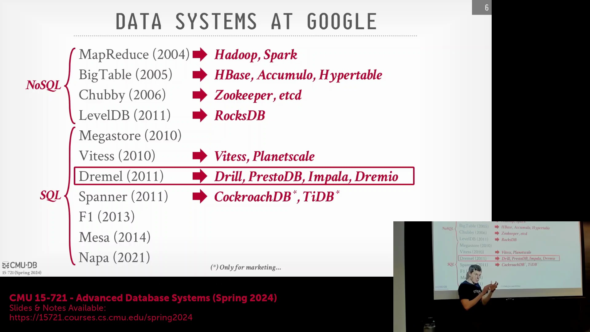
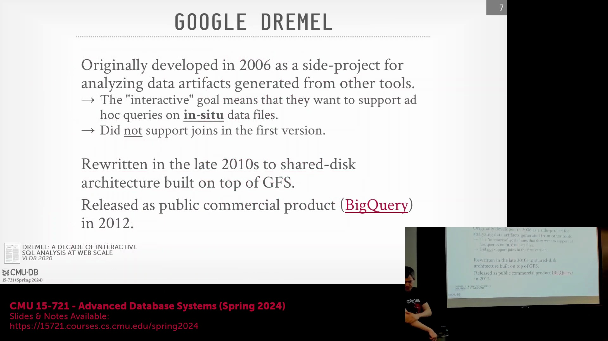
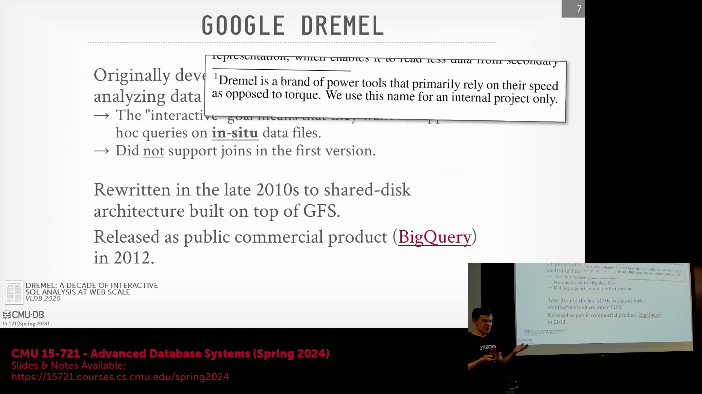
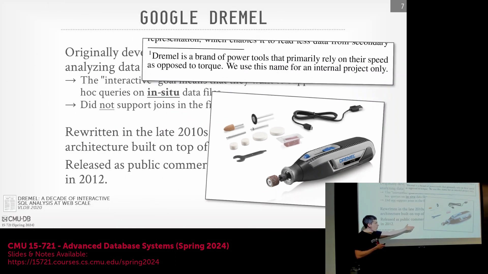
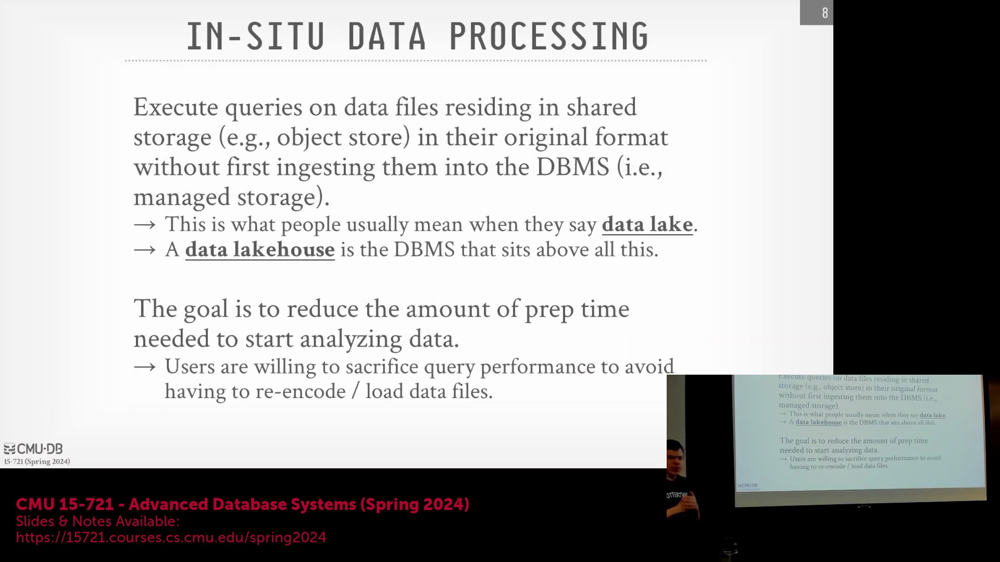
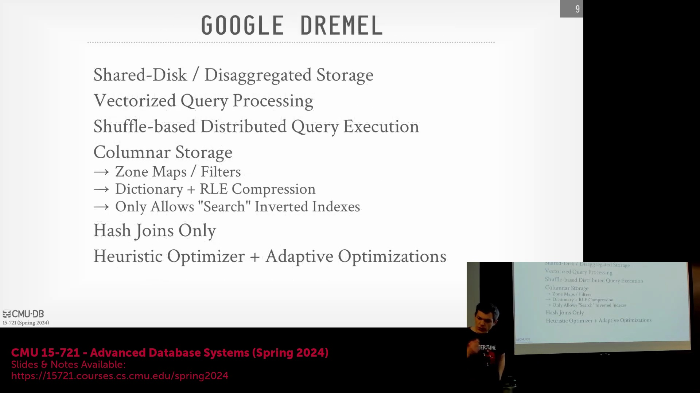

## Spanner 克隆版与 Dremel 的架构遗产
Spanner 依赖于 TrueTime 硬件时钟服务(TrueTime Hardware Clock Service)，而这些克隆系统则完全通过软件实现时钟同步(Software-based Clock Synchronization)。因此再次强调，这些系统如今绝不会公开宣称自己是 Spanner 的简单复刻或仅更换营销标签。但若能直接借鉴 Google 公开的架构理念，便足以在技术大会上大放异彩，抢占市场先机。

有同学提到许多系统都借鉴了 Dremel 的设计思想。没错。正如大家所知，Databricks 提出了“湖仓一体(Lakehouse)”这一全新概念。那么问题来了：你认为底层架构的借鉴与营销概念的创造，哪个更重要？他的核心疑问在于：我认为所有湖仓系统的高层架构均源自 Dremel，但“湖仓一体”一词的首创与推广者却是 Databricks 团队。没错，但这本质上仍是一次成功的营销包装。就像 Delta Lake 团队或许会反驳：“不，那不该叫湖仓，该叫冰库(Ice House)。”这纯粹是营销话术。但存算分离架构(Storage-Compute Separation Architecture)，以及能够直接读取原始数据的向量化执行引擎(Vectorized Execution Engine)，这些核心思想全部源自 Dremel。当然，向量化执行并非 Dremel 独有。例如 Snowflake 也在采用该技术，更重要的是大家此前读过的 Vectorwise 论文，该系统极早便实现了向量化执行。如今这些技术在湖仓系统中已十分普遍，但在 Dremel 诞生之初，业界尚无“湖仓一体”之称，那仅仅是后来的营销词汇。

## 论文时间线与 Google 的 Napa 项目
原始论文大约发表于 2011 年，对吧？我记得文中提到，该系统起源于 2006 年左右的一个内部副业项目，很可能利用了 Google 著名的“20% 时间(20% Time)”政策。没错。我在此展示的时间线是基于该系统首次公开亮相的节点。因此，你们当前阅读的这篇是原始论文发表十年后的回顾性论文(Retrospective Paper)。原始论文虽发表于 2011 年，但明确指出项目早在 2006 年便已启动构建，且最初采用的是无共享架构(Shared-Nothing Architecture)。

没错？这就像数据库领域的“时间考验奖(Test of Time Award)”……相差一两年无关紧要。论文确实明确记载了更早的启动时间。这一点毋庸置疑。
再谈谈 Napa 系统。我知道团队早在 2017/2018 年便已启动研发，但因当时签署了保密协议(Non-Disclosure Agreement, NDA)无法透露，相关论文直至 2021 年才正式发表。（学生提问 Napa 的细节）大家无需深究其底层实现细节。其核心逻辑是：用户只需摄入(Ingest)数据，系统便会以追加(Append)方式存储。至于该数据摄入过程是否具备事务性(Transactionality)，我目前也不确定。但他们引入了一项关键特性：在执行查询时，用户可以指定优化目标(Optimization Objective)。你是希望查询速度尽可能快（可能牺牲数据新鲜度(Data Freshness)），还是追求最新鲜的数据（并愿意为此承担额外延迟）？系统为此设定了目标函数(Objective Function)，在查询成本与数据新鲜度之间进行动态权衡(Trade-off)。明白了。是的。再次强调，本课程的重点是 Dremel。关于 Napa，该团队曾在一两年前的疫情期间为我们做过专场讲座，内容非常精彩。

## 从 MapReduce 到 SQL 的转变
回到 2006 年。正如刚才所述，这是 Google 员工利用“20% 时间”政策开展的副业项目。他们旨在解决的核心问题是：Google 内部各类工具与服务生成了海量数据文件/产物，均存储于 Google 文件系统(Google File System, GFS)及内部文件系统中。团队希望用户能直接使用 SQL 查询这些数据，而非被迫编写繁琐的 C++ 版 MapReduce 作业。在 2000 年代中期，Google 内部曾有一种观点认为 SQL 不具备扩展性，因此工程师们普遍在编写 MapReduce 作业。开源社区后来基于此推出了 Java 版 Hadoop，而 Google 内部实现则完全采用 C++。这意味着开发人员必须手动编写 C++ 代码来处理数据扫描(Data Scan)与连接(Join)操作，开发效率极低，对吧？
因此，他们的设想是让文件直接驻留在磁盘/共享存储中，并支持直接查询。尽管初版系统实际上采用了无共享(Shared-Nothing)架构（数据需先摄入系统并完成元数据编目(Metadata Cataloging)），但在 2000 年代末（而非 2010 年）的架构重构中，他们将其彻底转向存算分离架构，实现了直接从 GFS 读取文件数据。没错。首篇学术论文发表于 2010 年，随后该系统于 2012 年正式商业化，即 BigQuery。我要求大家阅读这篇后续论文而非原始论文，是因为初版论文并未提及 Shuffle 服务(Shuffle Service)，而本文对此进行了详细探讨。Shuffle 服务正是 BigQuery 区别于其他系统的核心特性，也是其能够实现诸多其他系统难以企及的性能优化的关键所在。

## “Dremel” 名称的由来
有同学知道“Dremel”这个名字的由来吗？（学生做手势）是指某种工具吗？没错，它确实是一个工具品牌。

论文脚注中对此有明确说明。Dremel 是一个知名的电动工具品牌，主打高速精密作业，其产品主要包括旋转工具(如电钻)或角磨机，广泛应用于各类加工场景。

我始终很惊讶 Google 的法务部门竟会允许在论文中如此表述：公司内部一项支撑数十亿美元营收的核心服务，竟直接使用了外部公司的注册商标作为名称。这从法律角度看颇具风险，但他们确实这么做了。后来，在推出商业化版本时，他们明智地将其重命名为 BigQuery。因此，如今你在网络上查阅关于 Dremel 实际功能的官方文档时，名称均已统一为 BigQuery。但出于学术传承与历史记录的考量，相关研究论文仍沿用 Dremel 这一称谓。

## 详解“就地数据处理”
关于“就地数据处理(In-situ Data Processing)”这一概念，本学期我们已经多次强调。

其核心含义是：数据文件集中存放在独立于数据库管控的外部存储中。由其他进程将文件写入后，用户希望直接基于这些原始文件执行查询。显然，系统需依赖元数据目录(Metadata Catalog)来感知文件的存在，并将其映射为表名或逻辑标识符(Logical Identifier)。当用户查询某张表时，目录会指引系统前往具体的文件路径读取数据。除路径映射外，数据库无需感知底层文件的过多细节。下周我们研读 Snowflake 论文时会看到，其采用“托管存储(Managed Storage)”模式：用户必须先将数据完整摄入(Ingest)系统内部。随后，Snowflake 将自主决定数据分块(Data Partitioning)、物理存储布局，并完全掌控所有底层实现细节。
如今，新版 Snowflake 为顺应湖仓架构趋势，也已支持直接读取 Apache Iceberg 格式文件。Amazon Redshift 亦遵循此路径。Redshift 最初是典型的无共享(Shared-Nothing)架构，完全依赖托管存储。但现在通过类似 Amazon Athena 的查询模式，用户已能直接对 Amazon S3 上的文件发起查询。
（学生提问）Snowflake 在将数据从外部存储迁移至其托管存储时，是否会收取额外的计算/ETL成本？是的，他们必然会收费，因为该过程涉及数据解析、格式转换等额外的计算处理步骤。
该问题的实质在于：这种架构是否意味着系统在底层承担了更多工作？当前的行业策略是……正如我一贯强调的，技术选型不能仅看成本，更需综合评估性能。多种因素共同决定了某种架构方案的合理性。我并非回避问题，而是想指出：这高度依赖于具体业务场景，直接读取外部文件未必总是最优解。
但系统具备这种直接读取能力本身是一项重要进步。正如本学期课程所见，无论采用何种架构，当系统面对一批特定格式的原始文件时（例如团队正在研究的数据转换/IO服务模块），最终都必须将其解析并转换为 Apache Arrow 或其他内部内存格式(Internal Memory Format)方能进行计算。那么，这部分格式转换的计算成本由谁承担？答案并不固定，这完全取决于各云服务商的定价模型(Pricing Model)。

## 性能与灵活性的权衡
因此，Dremel 的核心理念便是直接读取数据文件的原始存储位置。这正是当今数据湖(Data Lake)或湖仓一体架构所倡导的理念。再次强调，“湖仓一体”起初仅是一个营销术语，但 Dremel 早在十多年前便已践行此道。论文指出，团队决定支持这种就地读取能力的一个关键驱动力在于：用户愿意为了架构的灵活性(Flexibility)与易用性(Usability)，适度牺牲原生托管存储所能提供的极致查询性能。换言之，用户不愿在查询前被迫先定义表结构(Schema Definition)、完成繁琐的数据导入流程(Data Ingestion)，然后才能开始分析。
因为传统流程伴随着高昂的人力与运维成本(Operational Overhead)。用户宁愿接受查询延迟略微增加（因读取的并非数据库内部优化格式），以换取系统开箱即用的敏捷性。在我看来，这是一种极为正确的工程权衡，而 SQL 语言正是实现该目标的最佳抽象层(Abstraction Layer)。

## 后续系统的课程讲解格式
在接下来的两周里，我们将剖析的所有系统均采用此类总结页模板进行呈现。我们将逐一梳理各系统的高层架构特性(High-level Architectural Features)，并将其与本学期探讨的各项核心技术模块进行映射与关联。
