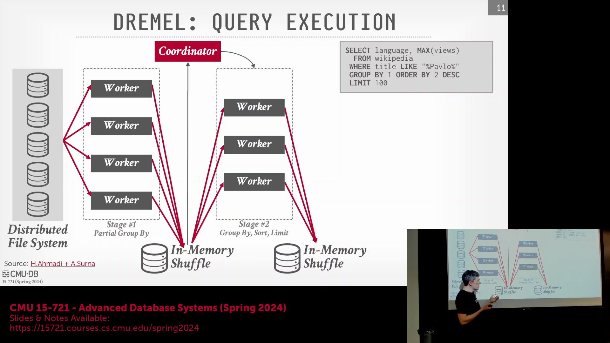
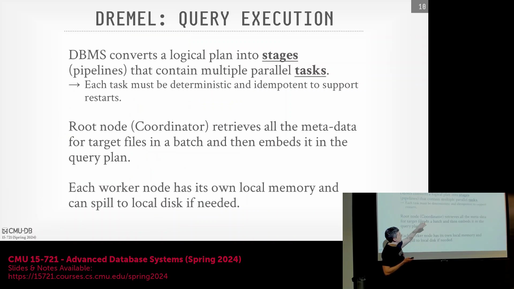
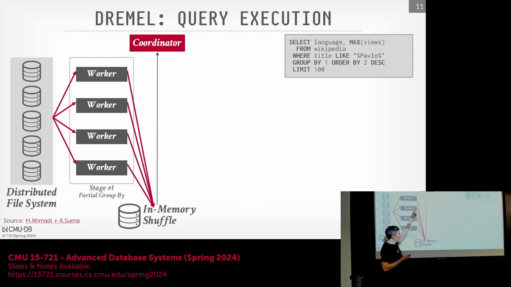
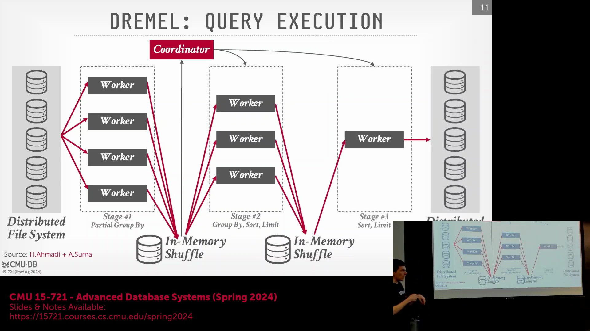
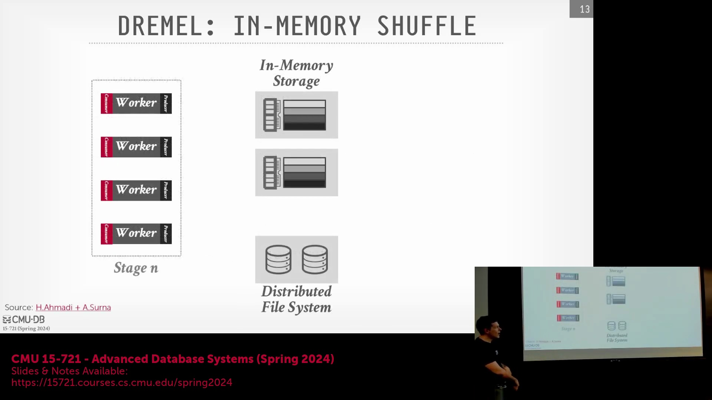
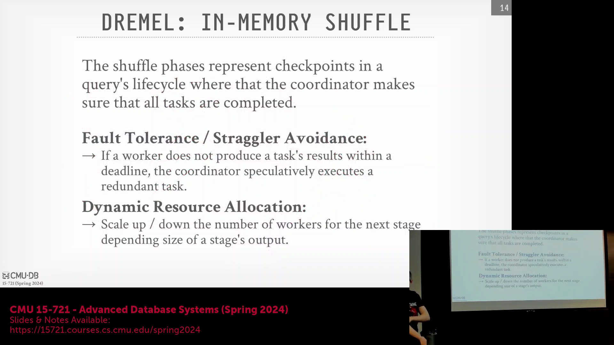
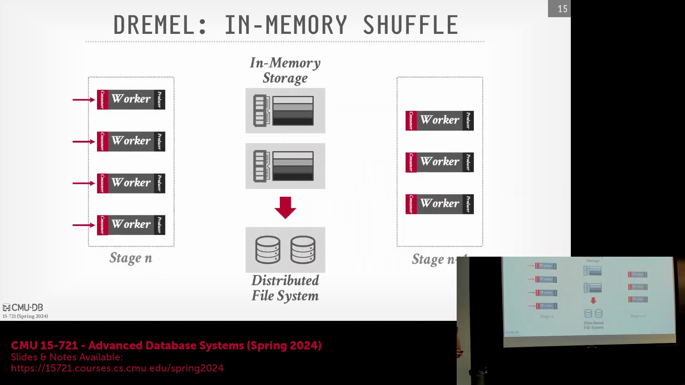

## 流水线执行与软件工程优势

在这种架构下，如果数据始终由同一个 Worker（工作节点）处理，会怎样呢？这正是我之前反复强调的。我曾提到过，这些执行阶段并不总是构成流水线(Pipeline)的阻塞点(Blocking Point)。在某些情况下，你可以在当前阶段尚未运行完毕时，便提前启动下一阶段并开始处理数据。这正是采用该架构的一大优势。

你可以在前置任务尚未完成时，就启动后续任务并开始读取数据。从软件工程的角度来看，如今你也不再需要将扩缩容逻辑或其他调度策略硬编码(Hardcode)到每一个 Worker 中（稍后会详细讨论）。现在只需由一个协调器(Coordinator)进行决策：“我需要更多的 Worker。”然后按既定策略调度数据。这使得 Worker 的实现从软件工程角度来看变得简单得多。

## 无状态 Worker 与内存 Shuffle 服务

同样，在最后阶段执行类似 `LIMIT` 的操作时，单个 Worker 便足以胜任。据我所知，这些 Worker 类似于运行在 Bork（Kubernetes 的前身）中的容器(Container)。它们被设计为无状态的(Stateless)，因此可以随时被终止或替换。这是否就是采用内存混洗服务(In-memory Shuffle Service)的原因？因为 Worker 是无状态的，系统并不希望它们长期驻留？这确实是个值得探讨的问题。采用内存 Shuffle 确实可能是因为这些组件是无状态的，无需长期保留数据。这确实是一种合理的设计考量。也就是说，这确实是其中的一个设计思路，没错。但更重要的是，如果我们将执行过程划分为明确的阶段(Stage)，就能充分利用数据库查询计划(Query Plan)的优势。我们稍后就会看到。

## 生产者-消费者模型与通信效率

因此，Shuffle（数据混洗）本质上实现了一种生产者-消费者模型(Producer-Consumer Model)。它仅仅是一种将中间结果从当前阶段传递到下一阶段的方式。论文中指出，通过这种专用服务，内存 Shuffle 服务并非仅用于 Dremel。Dremel 无疑是该服务的主要使用者，但它同时也被 Google 内部的其他服务所调用。同样地，Worker 只需将输出数据发送至 Shuffle 节点。若 Shuffle 节点内存不足，必要时可将数据溢出(Spill)至 GFS（Google 文件系统）。随后，下一阶段的 Worker 只需从 Shuffle 节点拉取数据即可。在这种情况下，假设所有 Worker 都在消费上一阶段产生的数据。这些数据可能直接来自分布式文件系统，也可能直接来自 Shuffle 服务本身。随后，它们对数据进行处理，并将最终结果向外发送。若内存耗尽，系统可随时将数据溢出至分布式文件系统。

采用该架构的另一个关键优势在于，各阶段之间不再需要进行端到端(End-to-End)的直接通信。由于数据经过了分区(Partitioning)，我只需从部分 Worker 获取数据，而无需将数据广播给所有潜在的 Worker。若没有 Shuffle 服务，协调器可能需要指示：“这是你所需的数据，去指定的 Shuffle 节点获取。”否则，Worker 可能不得不轮询所有节点并询问：“你们是否有我可消费的数据？”因此，从通信流量开销来看，这种方式的效率高得多。此外，若 Shuffle 服务存储空间已满，Worker 也可直接从分布式文件系统拉取数据，而无需绕经 Shuffle 服务。

## 容错、检查点与动态扩缩容

因此，Shuffle 本质上类似于查询计划中的一个检查点(Checkpoint)。这一特性实际上是 Dremel 独有的。因为在历史上，并行/分布式数据库通常不会在查询执行过程中设置检查点，也不具备查询级别(Query-Level)的容错能力。也就是说，如果一个预计运行两小时的查询在中途发生节点故障，整个查询就会失败，必须从头重新启动。从数据库系统的角度来看，过去磁盘 I/O 速度过慢，将中间结果写入磁盘的代价过高，得不偿失。正如之前所述，Hadoop 的做法是在每次 Shuffle 前后都将数据写入本地磁盘，随后再复制到 GFS 上。这种做法确实较慢，但契合 Google 当时的架构模式：系统运行在廉价的“比萨盒”(Pizza-box)服务器上，这些服务器随时可能发生故障。相比之下，传统并行数据库系统的设计假设则基于昂贵的机柜级服务器或高端硬件，这类机器极少频繁崩溃。因此，传统架构能获得更优的性能，但一旦某个节点宕机，系统便缺乏容错能力。内存 Shuffle 服务则允许他们在查询计划的不同阶段之间建立检查点，从而实现容错。同时，由于它是内存服务，其速度远快于传统的磁盘写入。如今随着 NVMe 固态硬盘的普及，磁盘写入速度已大幅提升，这或许已不再是瓶颈。但需知，在十年前，这显然是一个至关重要的设计考量。

因此，系统由此获得了容错能力。无论何时发生节点崩溃，你只需从内存 Shuffle 中获取所需数据，并将任务重新调度至其他节点执行即可。由于任务具备幂等性(Idempotence)，重新执行不会产生副作用。如果某个任务执行过慢，或 Worker 节点因故性能下降，BigQuery 团队曾提到他们面临的一个棘手问题：有时查询被调度到某节点后，该节点上的另一个容器正在为 YouTube 执行视频转码(Video Transcoding)任务。通过监控流量特征，可以识别出正是 YouTube 的流量拖慢了当前查询。因此，若出现慢节点(Straggler)，系统可直接终止该任务，并将其重新分配给其他运行更快的 Worker。此外，正如前述，由于执行过程被划分为明确的阶段，系统可以在阶段间隙进行评估，观察查询当前的执行进度与数据特征，进而决定在下一阶段是增加还是减少处理该查询的 Worker 数量。请看这里的两个示例。Worker 正在运行，生成数据并发送至 Shuffle 节点。假设由于某种原因，该节点进度滞后，无法跟上整体节奏。此时，我们可以直接终止该任务，并将其重新分配给图中的另一个 Worker。该 Worker 依然可以从分布式文件系统或 Shuffle 服务获取数据，因为这些数据始终可用。一旦在 Shuffle 存储中收集齐所有数据，并将相关信息上报给核心协调器，系统即可分析数据的实际统计特征，并根据查询的服务等级指标(SLI, Service Level Indicator)要求来决定后续操作，评估当前的 Worker 数量是过剩还是不足。如有必要，系统可重新生成执行计划(Execution Plan)，动态添加更多 Worker。且在此过程中无需移动任何数据，只需重新分配各 Worker 从 Shuffle 服务读取的数据分片即可。

## 问答：检查点定义与内存架构
是的。我只是想澄清一下您所说的“检查点”具体指什么。您的意思是，Shuffle 服务仅在特定情况下才执行此操作，如果它不是……那么“检查点”的含义就非常明确了。是的。它并非数据库系统入门课程中常见的那种检查点（即将内存中的所有内容刷新至磁盘）。我认为这也不是一个暂存点(Staging Point)，因为执行过程已经被划分成了明确的阶段。但它更类似于一个同步点(Sync Point)，在明确的阶段边界处存在状态同步。抱歉，我再重申一遍。数据依然保留在内存中，但系统已完成状态记录……这更多是从调度视角出发：在启动下一阶段之前，系统可根据上一阶段产出的数据，决定是否需要修改查询计划、调整查询拓扑(Query Topology)，或增减后续阶段的 Worker 数量。是的，因此这里的“检查点”并不意味着将所有内容刷入磁盘，因为系统的设计初衷是尽可能将数据保留在内存中。对于中间结果而言，系统只保留当前运行查询所必需的数据即可。曾有论文探讨如何使用类似 `QuintedNex` 的数据结构，其功能类似于迷你物化视图(Mini Materialized View)。例如，为连接(Join)操作构建哈希表(Hash Table)，并在多个查询间复用该哈希表。但 Dremel 并未采用这种做法。实际上，它仅仅是将数据集中汇聚到此处，使协调器能够全局掌握执行状态，从而决策下一步的调度方向。

是的。有什么不同吗？比如 Shuffle 节点是否会路由到您的云环境？这个问题实际上是：不同的 Shuffle 节点的数据存储在哪里？抱歉。是存储在不同的文件中吗？我会结合图示说明。我的意思是，这些数据纯粹存储在内存中。您可以将其想象成一个内存哈希表(In-memory Hash Table)。所以，可能需要等待。是的。在这里，哦对，没错。所以问题正是关于这些机制的，没错。可以这样理解：我处理数据并生成输出，然后对数据键(Key)进行哈希(Hash)计算，并对节点数量取模。对。这类似于一致性哈希(Consistent Hashing)机制。是的。这是否也映射到相同的 Worker 节点？实际上，Shuffle 服务是完全独立的。它是一个专门的服务。底层依赖的是 Colossus，即 Google 下一代 GFS。其地位类似于 Amazon 的 S3（简单存储服务）。因此，从 Worker 的视角来看，它们并不关心数据实际存储在内存还是磁盘上。换言之，系统之所以关注数据驻留于内存，是希望尽可能快地将数据交付给请求方。这正是该架构的关键所在：这些 Shuffle 节点均配备了大容量内存。