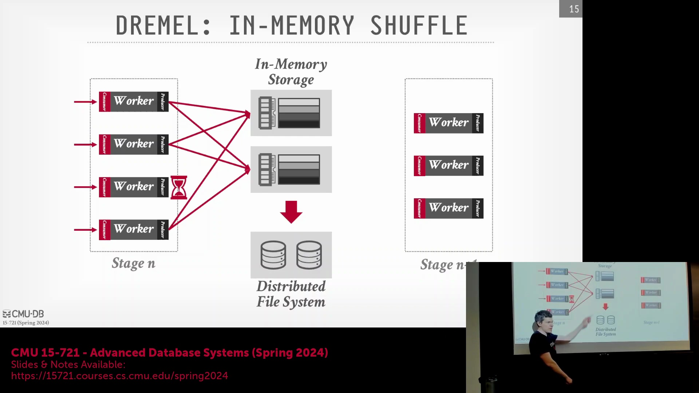
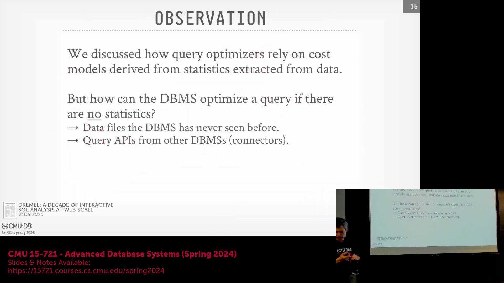
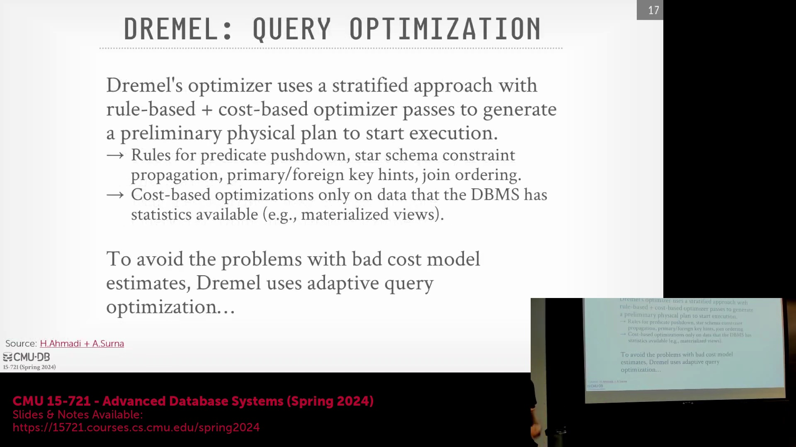
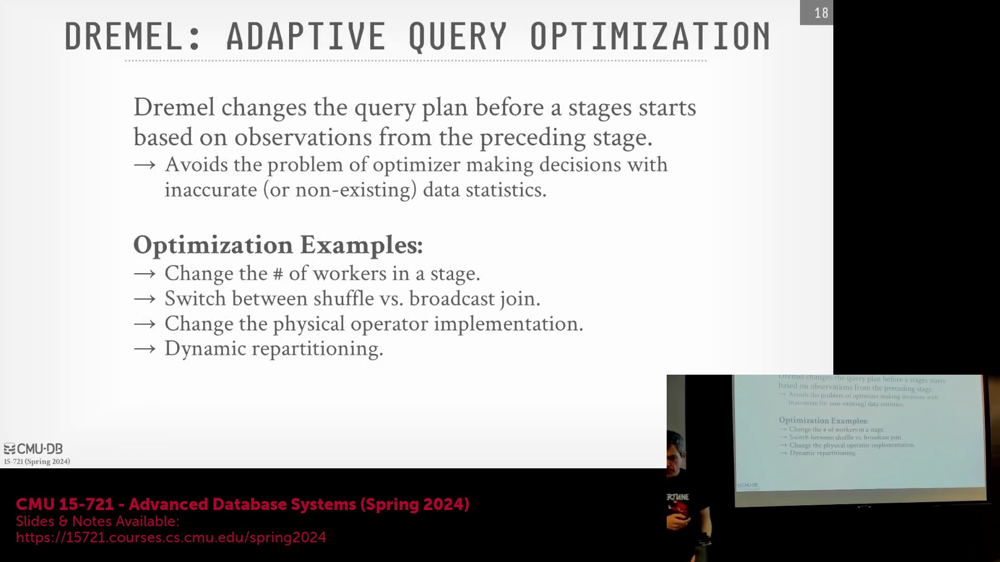
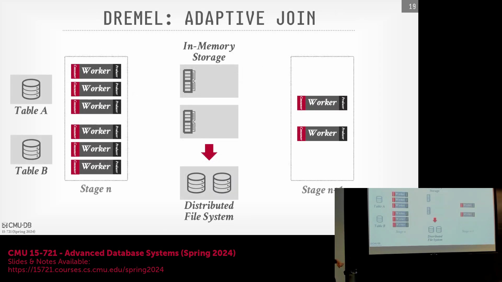
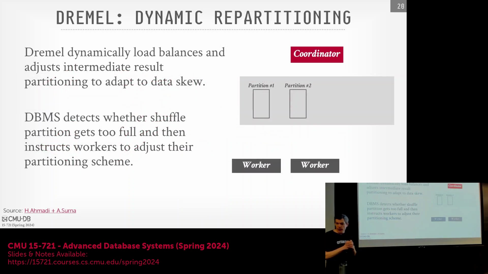
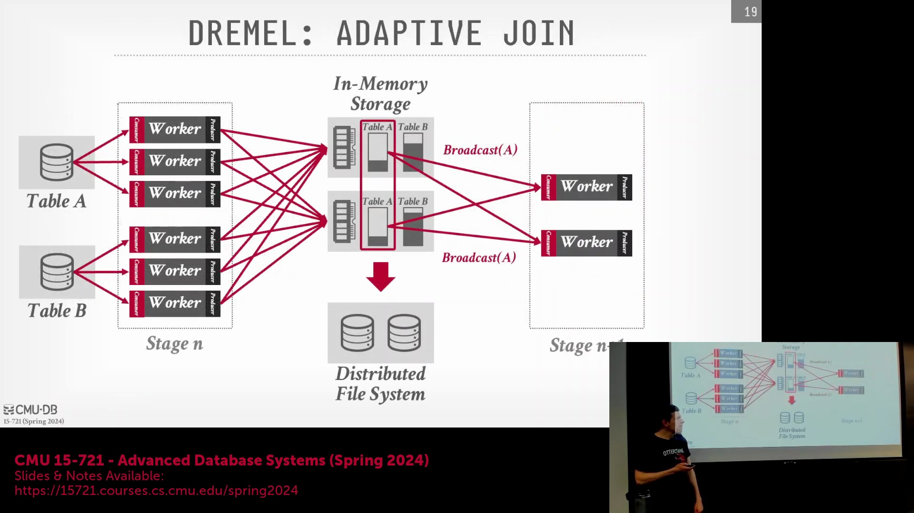
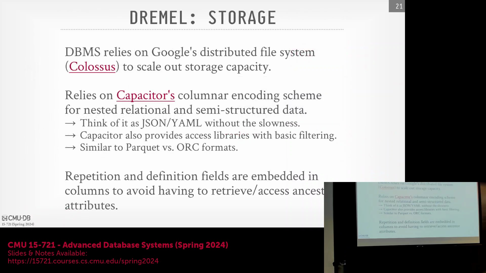

## 数据暂存与统计信息缺失的挑战

这些服务器均配备了大容量内存。借助内存混洗服务(In-memory Shuffle Service)提供的暂存区(Staging Area)，系统能够清晰掌握上一阶段处理的数据情况，进而决策后续操作。然而，在查询初始阶段，系统显然缺乏这些信息。因为待扫描的文件集可能是系统首次接触的。

我记得论文中甚至提到，Dremel 查询所处理的数据中，有很大比例是系统从未见过的全新文件。这意味着系统根本没有任何历史统计信息(Statistics)。那么，在缺乏统计信息的情况下，系统该如何尝试生成最优的查询计划(Query Plan)呢？

## 分层查询优化：基于规则的基础
他们还探讨了查询外部数据源或其他数据库系统的能力，这通常通过连接器(Connectors)实现。在后续课程中，我们也会在其他系统中见到类似设计。其核心思想是，在 BigQuery/Dremel 内部为一系列异构数据库系统(Heterogeneous Database Systems)提供统一的逻辑视图(Logical View)。当用户执行查询时，只需指定“读取某张 Postgres 表”，系统便会自动生成相应的查询语句去访问 Postgres 并拉取所需数据。然而，在这种跨系统查询场景下，生成的查询会被转换为目标系统可执行的格式。此时，我们对该系统缺乏统计信息，几乎一无所知。最坏的情况下，我们可能不得不对远程表执行全表扫描(`SELECT *`)，将数据拉取到本地后再进行处理。这显然是最劣策略。虽然我们可以尝试向外部系统下推谓词(Predicate Pushdown)，但同样受限于缺乏统计信息，优化效果有限。

因此，Dremel 采用了一种分层查询优化架构，结合了基于规则的优化器(Rule-Based Optimizer, RBO)和仅进行基础分析的基于成本的优化器(Cost-Based Optimizer, CBO)。仅当系统积累了一定的实际数据信息时，CBO 才会对数据规模或访问路径进行基础的成本估算。至于 RBO 的规则，则多为我们熟知的经典优化手段：谓词下推、主键约束利用、查询提示(Hints)，以及基础的连接顺序优化(Join Ordering)。系统还内置了针对星型模式(Star Schema)的自定义规则，用于约束传播(Constraint Propagation)。例如，可将维度表(Dimension Table)上的过滤条件传播至事实表(Fact Table)。当系统检测到查询涉及星型模式，且事实表需与多个维度表关联时，在执行计划生成阶段，系统会优先在维度表上构建哈希表(Hash Table)。随后在扫描事实表时形成单一流水线(Pipeline)，并依次对这些哈希表进行探测(Probe)。因此，系统具备基础规则来处理这些场景。而 CBO 的触发则依赖于统计信息，这些信息通常仅在存在物化视图(Materialized View)时才会生成和维护。然而，大多数查询并不依赖物化视图，其存在并非普遍现象。因此，系统必须解决在完全缺乏统计信息情况下的优化难题。

## 通过 Shuffle 暂存点实现自适应查询优化

为避免因成本模型估算偏差导致的性能瓶颈，Dremel 引入了自适应查询优化(Adaptive Query Optimization)技术。系统将混洗阶段(Shuffle Stage)作为执行暂停点(Pause Point)，以便评估当前进度，并根据实际数据特征进行动态校准。在后续内容中，我们还将探讨 Snowflake 和 Databricks 等系统中采用的其他自适应查询优化技术。Dremel 的自适应策略相对保守。它不采用激进的计划拼接(Plan Stitching)技术，也不会在执行图中嵌入用于在当前计划与备用计划间切换的触发节点(Switch Node)。其优化手段主要集中于动态调整 Worker 数量，并根据已观测到的数据特征切换连接算法，而非对整体查询计划进行大规模重组或重新校准。借助混洗暂存点，系统得以实时检视已收集的数据。其核心理念是“执行与调整并行”。如前所述，系统可根据实际情况动态增减各阶段的 Worker 数量。若发现实际数据量远超或远低于预期，便可相应调整下一阶段的资源分配。例如，某个过滤条件可能具有极高的选择性(Selectivity)，实际过滤掉了绝大部分数据，此时系统便可缩减下一阶段的 Worker 数量以节省资源。此外，系统可根据混洗阶段暴露的数据规模，动态决定采用混洗连接(Shuffle Join)还是广播连接(Broadcast Join)。具体机制我们稍后详述。系统还能动态切换执行策略，例如更换底层算子实现(Operator Implementation)。论文对此未作详尽说明，但提及了针对小分区和大分区的差异化算子实现。推测而言，若明确某分区仅读取少量数据，系统可能会采用循环展开(Loop Unrolling)等底层优化手段。最后，动态分区(Dynamic Partitioning)技术可用于应对数据倾斜，即在发现热点桶(Hot Bucket)时，在运行时对数据进行二次拆分。这同样依赖于执行过程中实时获取的数据特征。

## 动态连接策略自适应

以下通过两个示例具体说明。假设当前查询需从表 A 和表 B 读取数据并执行连接操作(Join)。在初始执行阶段，系统会分配一批 Worker 扫描表 A，另一批扫描表 B。同时，系统可能已在这些 Worker 中下推了过滤条件，使其在扫描时即完成数据过滤。随后，这些 Worker 将处理结果提交至混洗阶段。从系统内部视角看，这相当于在构建执行元数据，协调器会记录各表分区实际写入的数据量。假设由于某些原因，表 A 的实际数据量远低于预期。此时，系统可能判定执行混洗连接（即按连接键对数据进行重分区）并非最优选择。系统可识别出该表数据量极小，足以完整加载至每个 Worker 节点的内存中，进而动态切换连接策略。举例来说，初始计划可能是对数据进行哈希分区并分发至各 Worker（如图中箭头所示的数据流向）。但若该表体积微小，系统可将其改为广播连接。此时，每个 Worker 均可直接从混洗服务获取表 A 的完整副本。表 B 仍按原计划进行混洗分区。但在执行连接时，由于每个节点本地已持有表 A 的全量数据，连接操作可在本地高效完成，无需跨节点数据传输。

## 针对数据倾斜的动态分区

另一种自适应策略是执行动态分区。假设系统正在扫描数据，此时发现某个分区（例如分区 2）的数据量远超预期。若不加以干预，该分区的数据将溢出(Spill)至磁盘，导致性能急剧下降。为此，系统可在运行时将实时统计信息上报至协调器。协调器接收信息后，会动态创建两个新分区。随后向相关 Worker 发送指令，要求将原定发往分区 2 的数据重新计算哈希值(Hash)，并路由至新创建的两个分区中。这本质上与数据库入门课程中讲授的 Grace Hash Join 算法里的递归分区(Recursive Partitioning)机制如出一辙。随后，Worker 继续执行并将数据填充至新分区。待当前阶段完成后，系统会引入一个专门的重新分区(Repartition)任务，负责从这三个分区中读取数据。（注：图示绘制略显简略）简言之，该任务会读取原分区 2 中的积压数据，重新进行哈希计算，并将其均匀分发至新建的分区 3 和分区 4 中。

## 广播连接机制与 Colossus 存储

回到前文的连接示例。在广播连接场景中，总有一个表需要被全量广播。核心决策仅在于选择广播哪一张表。混洗连接要求所有参与连接的数据均按连接键进行重分区。而替代方案则是采用广播连接，即将其中一张表的全量数据分发至所有计算节点。（注：讲师补充图示）若采用广播连接，例如广播表 A，则无需对表 B 进行混洗分区。因此，可直接终止表 A 的读取 Worker。在下一阶段，处理表 B 的 Worker 将直接从底层存储读取表 B 文件，同时本地内存中已缓存表 A 数据。这就是广播连接的执行流程。其核心设计思路在于：让小表进行全局广播，而大表则保留在原始存储位置进行本地扫描，从而最小化网络传输开销。

如前所述，BigQuery 底层依赖名为 Colossus 的分布式文件系统(Distributed File System)。Google 最初采用 GFS，后为支撑海量可扩展存储需求，全面切换至 Colossus。可将其类比为 Amazon S3 对象存储或我们曾探讨过的其他云存储系统。其核心设计理念是……