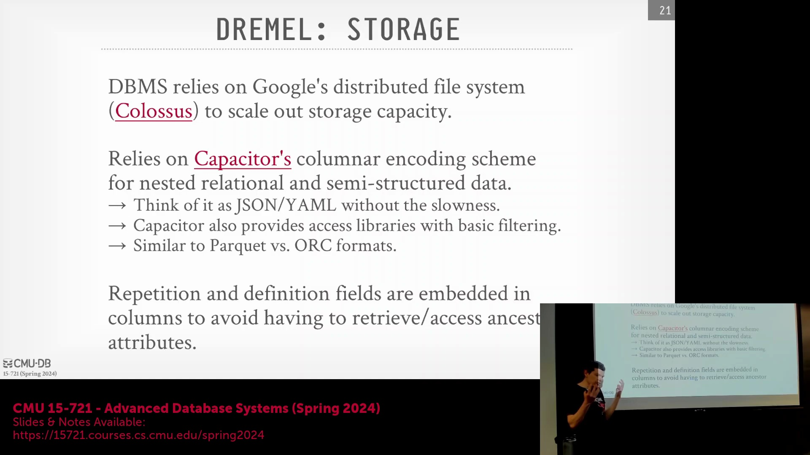
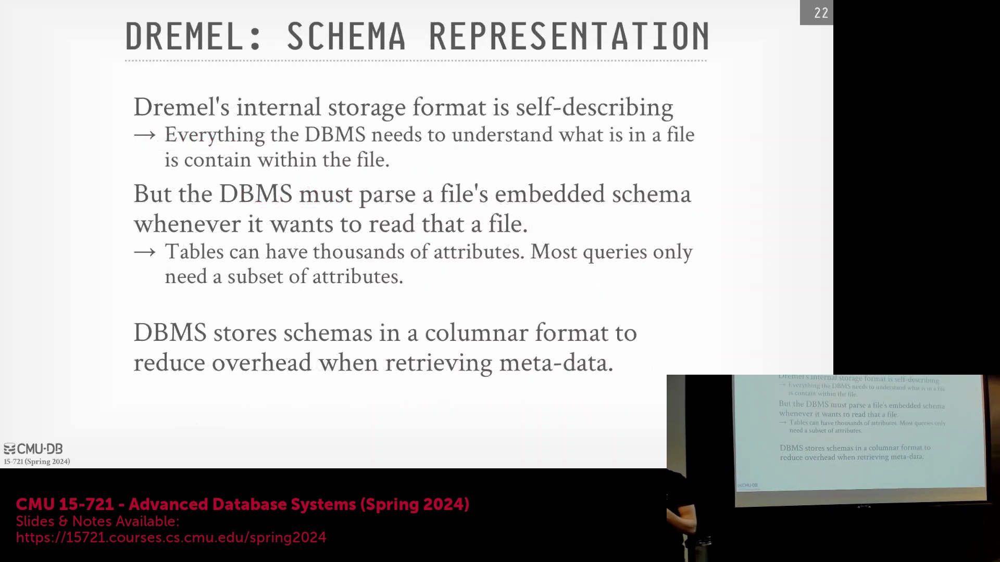
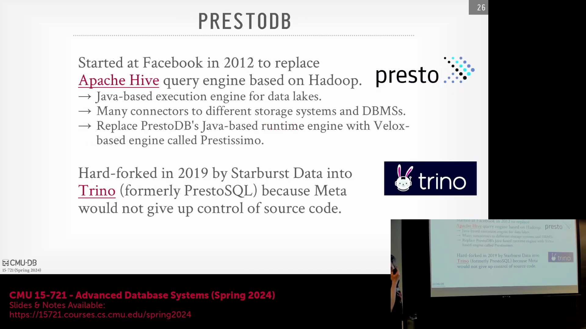

## 外部存储与 Capacitor 文件格式

其核心理念在于，该架构采用独立于计算系统的外部存储服务(External Storage Service)来统一管理所有数据。论文指出，系统将依赖一种名为 Capacitor 的内部文件格式(File Format)。尽管该格式未开源且公开文档有限，但据 Google 内部人士透露，其整体设计与 ORC 和 Parquet 颇为相似。Capacitor 的一项独特优势在于，它支持在访问库(Access Library)内部直接执行谓词下推(Predicate Pushdown)以及部分查询/表达式求值(Query/Expression Evaluation)。例如，在对象存储(Object Storage)（如 Amazon S3）上，虽然也能对 Parquet、CSV 或 JSON 文件下推部分 `WHERE` 条件或执行 `SELECT` 过滤，但此类能力通常较为有限。尤其是通过 Arrow 格式读取 Parquet 文件时，数据遍历过程往往需要解压全部内容。而 Capacitor 则支持直接在压缩数据(Compressed Data)上进行过滤，无需预先解压。此外，还有一种名为 Artists 的文件格式（应用于 YouTube 或 Cello 系统），也具备类似能力。从高层架构来看，它类似于 Parquet 和 ORC，但实现了更高效的早期过滤(Early Filtering)。如前所述，该格式通过重复级别(Repetition Level)与定义级别(Definition Level)字段来高效处理嵌套数据(Nested Data)（如 JSON）。当然，作为 Google 生态的一部分，其底层序列化实际上基于 Protocol Buffers。

## 自描述元数据与模式管理

此类文件格式（如 Capacitor）具备自描述(Self-Describing)特性。这意味着，如同 Parquet 和 ORC 一样，数据目录中会包含专门的文件用于声明预期的数据模式(Schema)。论文还指出，数据本身、元数据(Metadata)以及模式定义均统一以 Capacitor 格式存储。因此，即使单个文件包含上万个属性，系统也无需反序列化(Deserialize)整个文件即可工作，而在部分 Parquet 或 ORC 的实现中这往往是必需的。系统能够直接基于元数据执行所需的查找优化，从而精准定位目标数据。尽管这一设计并非颠覆性创新，但相较于 Parquet 和 ORC 的现有实现，其访问效率确有显著提升。

## Google SQL 与 SQL 标准化工作

论文最后探讨的一个有趣话题，与我们在 Velox 论文中所见类似。Dremel 是 Google 早期重新引入 SQL 支持的关键系统之一。随着 SQL 在 Google 内部再度流行，各团队开始在各自的项目中引入 SQL 支持。然而，这导致了一个问题：不同内部项目衍生出多种互不兼容的 SQL 方言(SQL Dialect)。为此，在 2010 年代中后期，Google 在公司层面推动了标准化工作，推出了统一的 Google SQL 方言，供所有内部系统集成。此举旨在消除方言间的繁琐差异，确保全公司范围内的语法与行为保持一致。这与 Velox 项目的思路如出一辙：Velox 曾指出内部存在大量重复开发的字符串截取函数，遂将这些接口标准化并封装为统一实现库。Google SQL 本身并未开源，但其开源变体 ZetaSQL 已对外发布（如图所示）。ZetaSQL 的设计初衷是鼓励开发者构建兼容该标准的数据库系统，使其在语法与交互体验上高度逼近 Google SQL。如此一来，开发者若已习惯基于 ZetaSQL 的独立系统，便能轻松将应用程序迁移至 BigQuery、Dremel 或 Spanner。然而据我了解，该项目目前基本已处于停滞状态。尽管其 GitHub 仓库近期仍有零星提交，但官方声明已明确指出 Google 不再提供正式支持。大量 Pull Request 与 Issue 长期无人响应，表明该项目实质上已停止活跃开发。目前已知实际支持 ZetaSQL 的主要项目仅有 Apache Beam（一个分布式流批处理系统），但采用率并不高。这一现象颇为耐人寻味：尽管 Google 规模庞大且在科技界极具影响力，但即便其推出某种 SQL 方言并试图将其确立为“标准”，也未能获得广泛追随。这充分说明当前的 SQL 生态已高度多元化与碎片化，任何单一企业——即便是科技巨头——都难以凭借一己之力重塑行业格局。历史上唯一成功确立标准的是 IBM。IBM 在 1980 年代初推出新一代数据库系统时宣布全面拥抱 SQL，并将其确立为标准，随后业界纷纷跟进，SQL 才由此成为今天的通用语言。但在当今碎片化的生态下，此类历史已难重演。目前最接近“真正标准”的或许是 ISO/IEC SQL 标准，但正如前述，实际开发中鲜有系统严格遵循它。而最接近“事实标准方言”的当属 PostgreSQL，因为众多新兴系统（如 DuckDB 等）均直接复用或借鉴了 Postgres 的解析器(Parser)与语法定义文件(Grammar Definition)。这并非说明 Google 的标准化尝试失败了，而是印证了在当前的数据库市场中，已无单一方言能够统一整个 SQL 生态。

## Dremel 衍生系统与 Apache Drill
自 2011 年 Dremel 论文发表以来，业界涌现出众多相关系统。其中部分系统深度复刻了其架构，另一些则仅宣称受到其启发。我将依次介绍四个代表性系统。此外，一个有趣的现象是，近三四年间出现了独立的“混洗即服务”(Shuffle as a Service) 组件或架构。尽管这些系统可能无法完全复现 Dremel 内存混洗服务的全部特性，且均未采用硬件加速(Hardware Acceleration)，但将 Shuffle 作为独立服务进行专项优化的思路确实颇具创新性。我们将重点讨论阿里巴巴的 Celeborn（目前该项目进展最为成熟），以及 Uniffle 和 Uber 的相关项目。Uniffle 最初作为孵化项目推出，虽处于早期阶段，但目前已发展成为该领域的重要方案。大家可自行查阅相关资料，此处我将聚焦于最具代表性的 Apache Drill，随后结束本节内容。
Apache Drill 宣称自身为 Dremel 的直接复刻版。其命名“Drill”便直接呼应了“Dremel”，意图毫不掩饰。该项目启动于 Dremel 论文发表后不久，旨在基于 HDFS 构建高性能查询引擎，由科技公司 MapR 主导发起。2010 年前后，Hadoop（或 MapReduce）生态主要由三家公司主导：Cloudera、Hortonworks 与 MapR。前两者基于开源的 Java 版 Hadoop 发行版，而 MapR 则推出了专有的 C++ 版本以追求更高性能。在此背景下，MapR 启动了 Apache Drill 项目。有趣的是，Drill 的核心代码实际上采用 Java 编写。它借助 Janino 工具实现代码生成(Code Generation)与查询编译(Query Compilation)。Janino 本质上是一款嵌入式 Java 编译器(Embedded Java Compiler)，支持在进程内动态接收 Java 代码并完成即时编译。该项目虽未彻底消亡，但代码提交频率、社区活跃度及生产采用率均已显著下滑。MapR 历经多次并购，最终被 HPE（慧与科技）以较低价格收购。HPE 于 2020 年宣布基本停止对该项目的官方开发投入。尽管 HPE 已撤资，但仍有社区贡献者在持续维护。因此，在当前开源生态已有更优替代品的背景下，Drill 已非首选方案。但不可否认，它是 Dremel 论文发表后最早落地的衍生系统之一。至于其是否实现了类似 Dremel 的内存混洗服务？答案是肯定的，Drill 确实支持内存混洗(In-memory Shuffle)，但同样未引入硬件加速机制。

## PrestoDB 与向 Velox 的转型
下一个代表性系统是 PrestoDB。该项目起源于 Facebook。很难断言其直接受 Dremel 启发，因为在 Dremel 论文发表时，Presto 的开发工作可能早已启动。然而，Facebook 构建 Presto 的核心目标与 Dremel 一致：旨在替代性能低下的 Hive。Hive 本质上是基于 MapReduce 执行 SQL 查询的框架，它将 SQL 语句直接翻译为 MapReduce Java 任务。由于 MapReduce 架构固有的高延迟特性，该方案执行效率较低。Presto 诞生的核心动机正是为了解决这一问题：面对海量文件与数据湖(Data Lake)架构，企业亟需一个高性能的交互式查询引擎。在本案例中，底层存储最初为 HDFS（注：Facebook 早期采用 HDFS，后逐步迁移至自研分布式文件系统）。

同时，PrestoDB 实现了一套连接器(Connectors)机制，用于无缝对接异构存储系统与数据源，这一架构设计与 Dremel 高度相似。数年前，Facebook（现 Meta）宣布将弃用原有的 Java 运行时引擎(Java Runtime Engine)，并将 Presto 的核心计算模块全面迁移至 Velox 库。Velox 的相关论文详细记录了基于 Presto 架构的此次引擎迁移与性能优化实践。