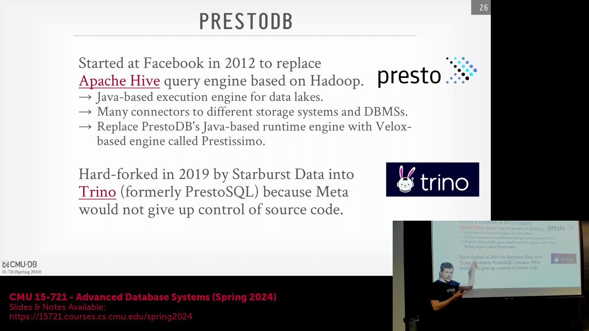
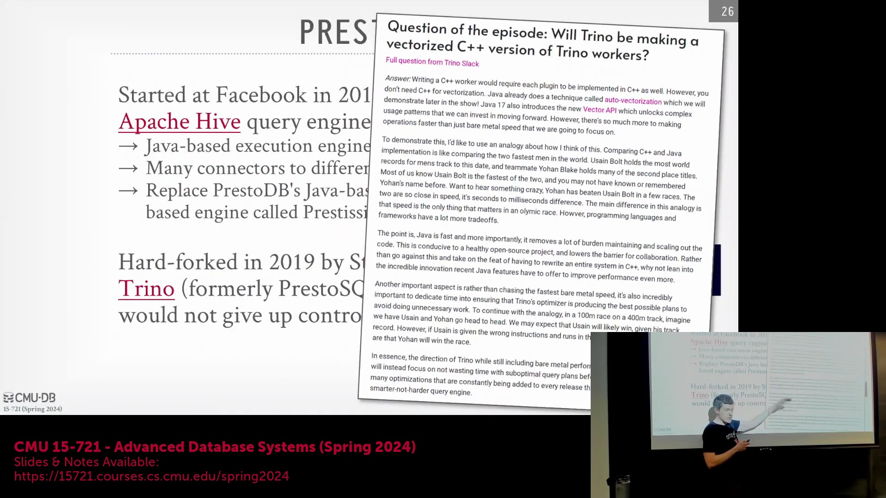
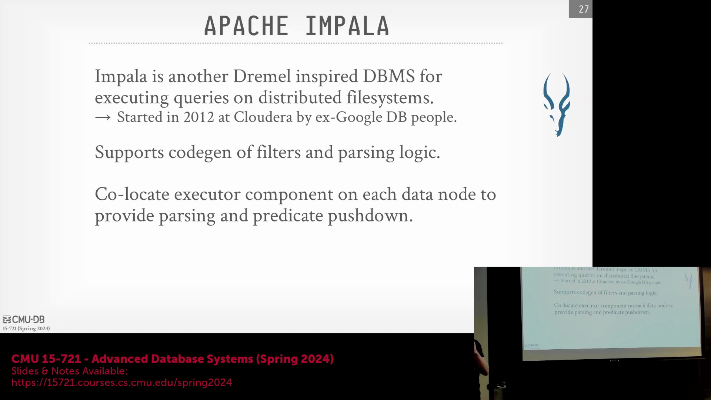
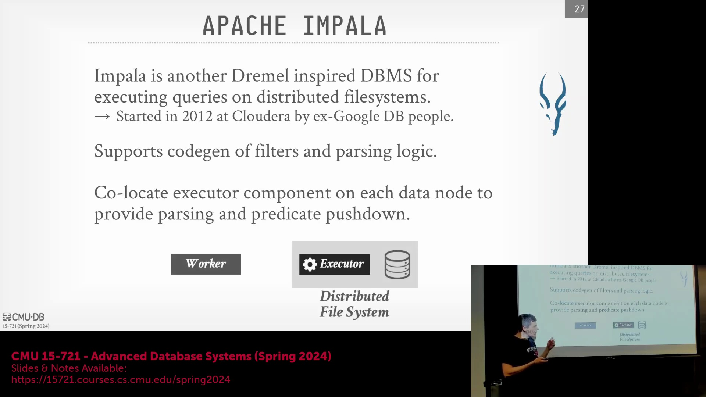
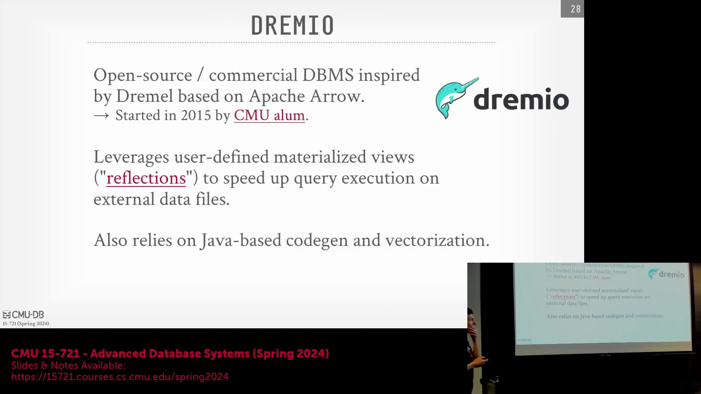
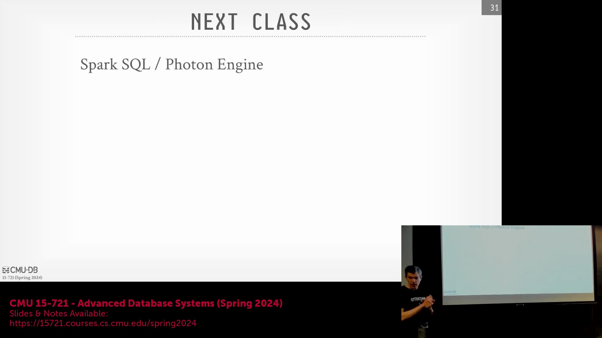
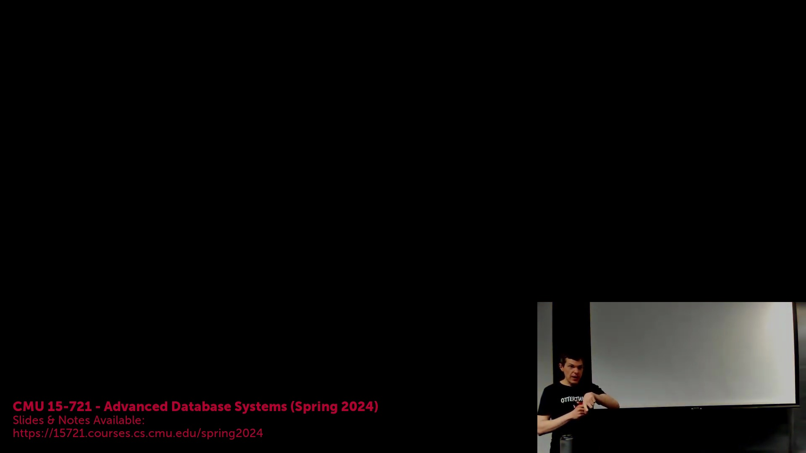
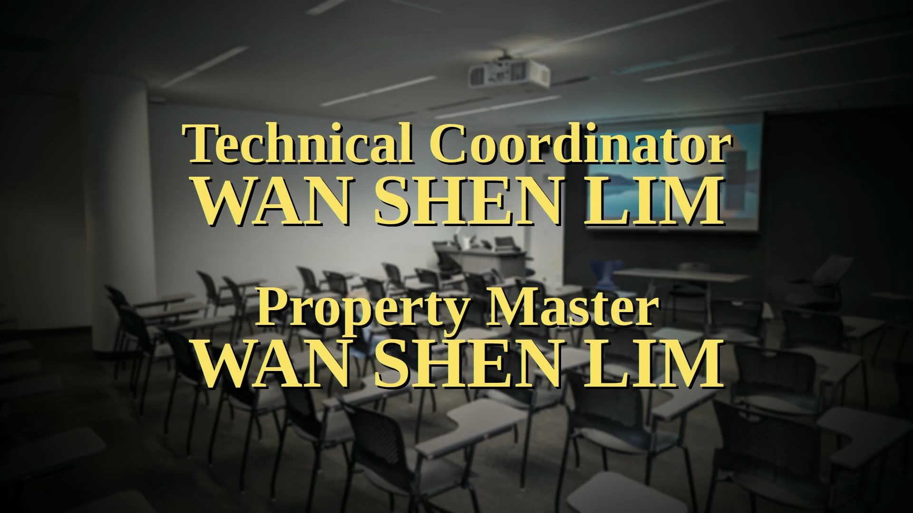
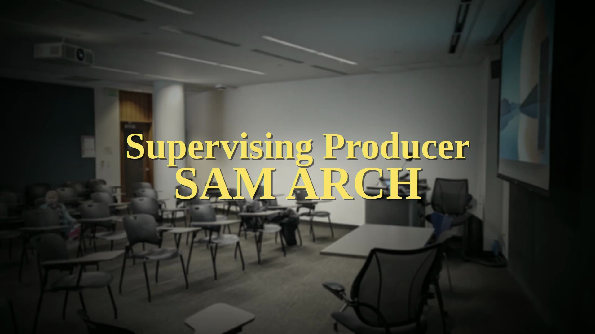
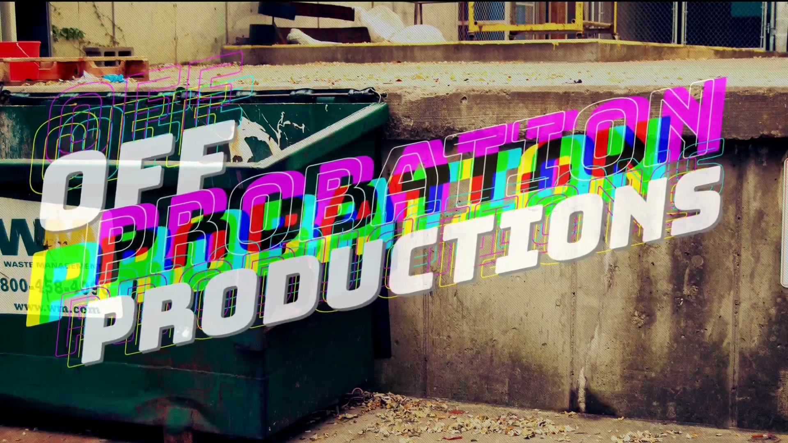

## Velox(Velox) 项目与 Presto(Presto) 生态系统的演进
讨论首先从 Velox 项目的举措开始，该项目内部代号为 Partizimo，旨在用高性能的 SQL(Structured Query Language) 执行引擎替代传统的 Java(Java) 执行引擎。这一努力是跨分布式数据系统(Distributed Data Systems)实现查询处理现代化(Query Processing Modernization)更广泛战略的一部分。

## Presto 的分叉(Fork)与基金会移交
Presto 的谱系(Lineage)可追溯至 Facebook。该项目最初以 Presto 之名发布，后更名为 PrestoDB。随后，社区从中分叉出名为 PrestoSQL 的项目，该项目最终更名为 Trino(Trino)。这一转变由一批离开 Teradata(Teradata) 并创立 Starburst(Starburst) 的开发者所推动（Teradata 此前收购了 Astrodata，而 Astrodata 又收购了 Hedapt 及其 HadoopDB(HadoopDB) 项目）。分叉的主要诱因是社区对 Facebook 保留源代码控制权的不满，以及与 Hive(Hive) 不同，Presto 最初缺乏 Apache 许可证(Apache License)。因此，Trino 被捐赠给了云原生计算基金会(Cloud Native Computing Foundation, CNCF)。此后，Facebook 也将 PrestoDB 的控制权移交给 Linux 基金会(Linux Foundation)，以符合标准的开源治理规范。

## 理念分歧：集成 Velox 与 Java 优化
Presto 和 Trino 在底层执行策略上存在根本分歧。Facebook 的 Presto 正积极转向非 Java 技术栈，并集成了基于 C++(C++) 开发的 Velox 引擎。相比之下，Trino 团队明确选择继续保留 Java，并在工程文档中指出，与其从头重建 Velox 或 DataFusion(DataFusion) 等原生执行引擎(Native Execution Engine)，不如将开发资源投入到优化查询器(Query Engine)上更具工程性价比。

## 从 Hive 到 Presto：简化 SQL 查询执行
Presto 与 Hive 的渊源源于 Facebook 早期数据基础设施(Data Infrastructure)所面临的挑战。Hive 最初的设计初衷是将 SQL 查询转换为 MapReduce(MapReduce) 任务，但这一过程往往伴随着 Java 任务执行缓慢的问题。为了在保留 HDFS(Hadoop Distributed File System) 作为共享文件系统的同时克服这些性能瓶颈，Facebook 开发了 Presto。受 Google Dremel(Google Dremel) 的启发，Presto 完全绕过了 MapReduce 框架，使得 SQL 查询计划(Query Plan)能够直接、高效地在存储层(Storage Layer)上执行，从而避免了中间数据转换的开销。

## Impala(Impala) 的架构：本地执行与谓词下推(Predicate Pushdown)
Cloudera(Cloudera) 开发了 Impala，这是另一个深受 Dremel 启发的系统，但采用了截然不同的架构路径。Impala 并未采用依赖远程工作节点(Worker Nodes)拉取数据的完全存算分离(Compute-Storage Separation)架构，而是将轻量级执行引擎直接部署在 HDFS 数据节点(Data Nodes)上。该系统完全采用 C++ 编写，其架构设计支持深度的谓词下推和本地查询编译(Local Query Compilation)（尤其针对 WHERE 子句和 CSV 解析优化），从而确保数据在将结果返回协调节点(Coordinator Node)之前，就能在本地完成过滤与处理。

## Cloudera 与 Databricks(Databricks) 的竞争格局转变
尽管 Cloudera 曾大力推广 Impala 的商业化应用，但市场需求的趋势日益偏向 Apache Spark(Apache Spark)。当 Spark 引入 SQL 功能后，Databricks 采取了一项战略性举措：将 SQL 引擎直接嵌入 Spark 运行时(Spark Runtime)中，而非将其作为独立的中间件(Middleware)来实现。这一架构选择显著加速了技术的落地与普及，同时大幅提升了性能，最终促使 Databricks 在现代大数据生态系统中实现了对 Cloudera 的超越。

## 现代查询优化(Query Optimization)与 Shuffle 即服务(Shuffle-as-a-Service)
开源查询引擎(Open-Source Query Engine)领域持续演进，多个获风险投资支持的项目均直接在 Dremel 的架构理念之上进行构建。这些系统广泛采用物化视图(Materialized Views)、全查询 Java 代码生成(Full-Query Java Code Generation)以及向量化处理(Vectorized Processing)等技术，以最大化系统吞吐量(Throughput)。此外，阿里巴巴推出了 Apache Celeborn(Apache Celeborn)，作为专为 Spark 和 Flink(Flink) 等分布式框架设计的 Shuffle 即服务解决方案。Celeborn 本质上是一个基于 Raft 协议(Raft Protocol)的高容错分布式键值存储(Key-Value Store)，负责在工作节点间高效中转数据，并提供磁盘溢出(Spill to Disk)和数据块压缩(Block Compression)功能。类似的替代方案 Uniffle(Uniffle) 则采用 ZooKeeper(ZooKeeper) 进行集群协调(Cluster Coordination)。

## Dremel 的遗产与现代湖仓一体(Lakehouse)范式
Dremel 对现代数据架构(Data Architecture)的深远影响，源于其创新性地将单节点向量化处理(Single-Node Vectorized Processing)与基于 Shuffle 的分布式协调(Distributed Coordination)相结合。尽管 Shuffle 阶段在表面上可能显得资源消耗较高，但这实为一项经过深思熟虑的设计抉择，旨在优化内存使用、解耦不同的执行阶段(Execution Stages)，并简化系统的整体实现。这种解耦架构(Decoupled Architecture)深刻体现了现代云原生(Cloud-Native)理念：各个专用组件能够被独立优化，并随后无缝集成至统一的湖仓系统之中。

## 课程总结与后续内容：Spark SQL(Spark SQL) 与 Photon(Photon) 引擎
本系列课程在预告下一主题后圆满结束：重点探讨 Spark 的 SQL 处理能力及其底层 Photon 引擎。与 Dremel 的独立架构不同，Photon 的运行机制与 Velox 相似，但它作为 Spark 运行时的原生组件直接嵌入 JVM(Java Virtual Machine) 中。这一技术演进凸显了现代数据处理框架中，执行层(Execution Layer)正持续向高度优化与紧密集成方向发展的趋势，同时也为最后一讲的内容奠定了讨论基础。

## 视频片尾与结束画面
技术演示部分至此结束，随后响起背景音乐，并切换至包含动态节奏片尾画面及演职员表(Credits)的结束界面。

