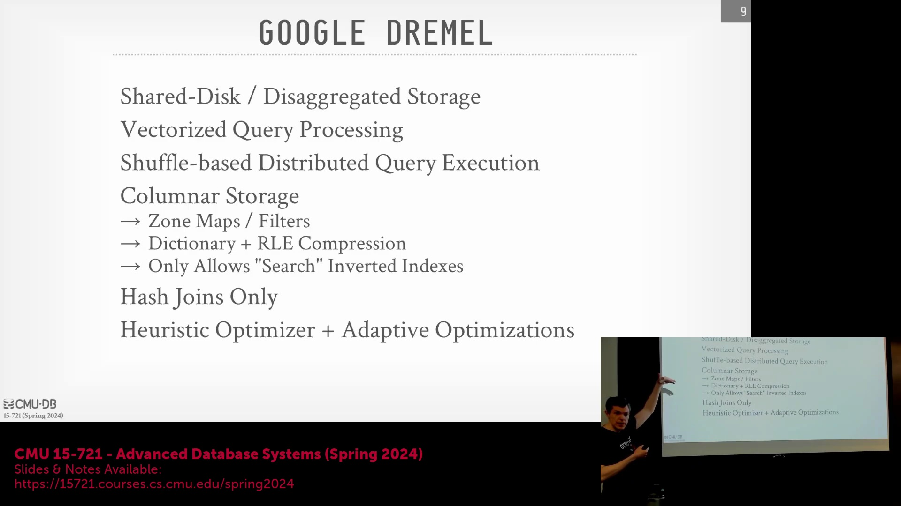
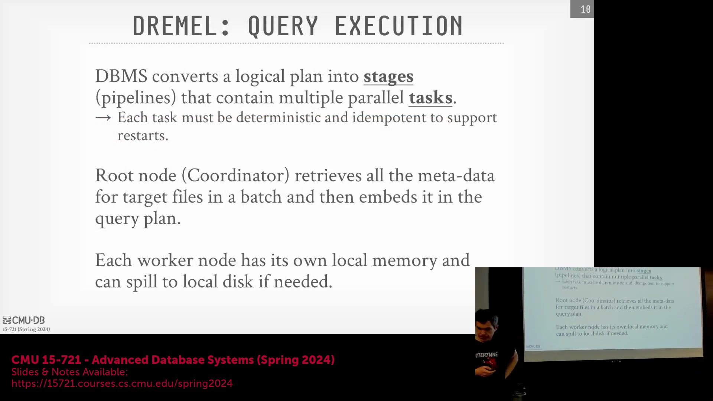
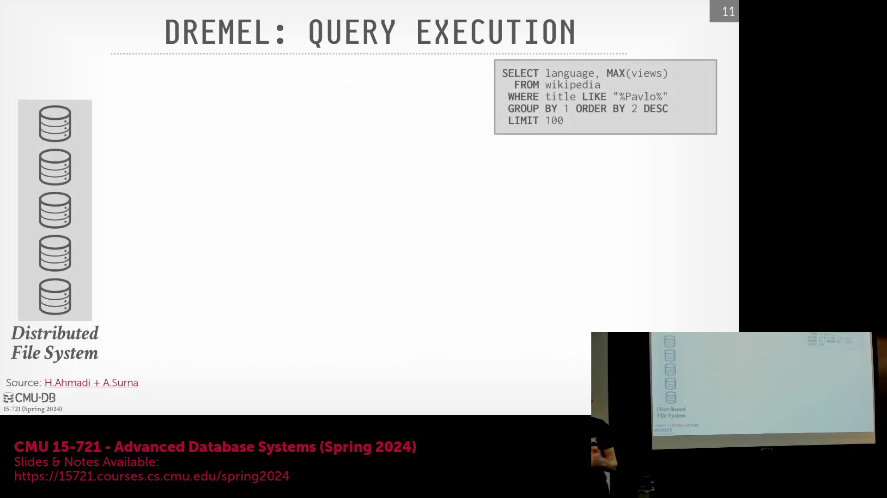
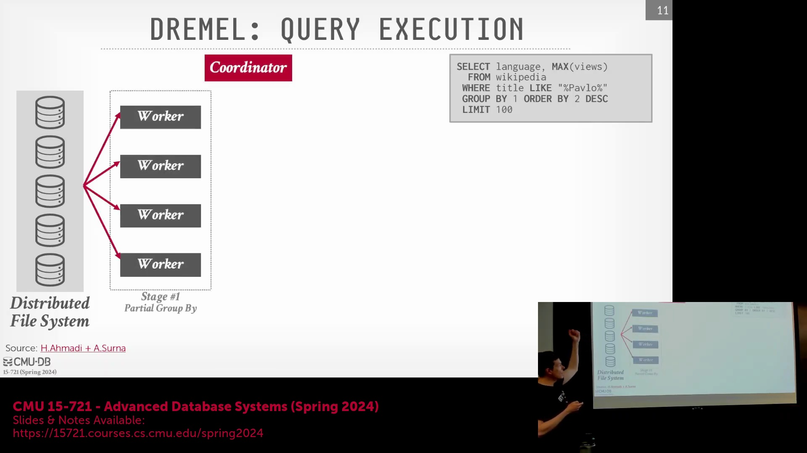
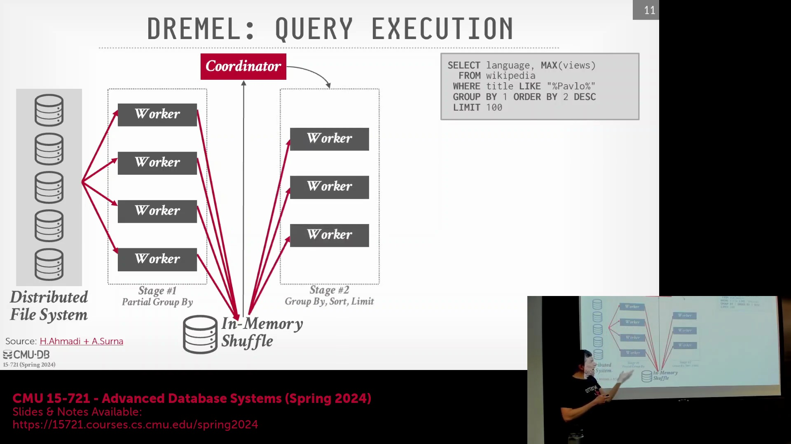

## 课程介绍与开场白
卡内基梅隆大学高级数据库系统(Advanced Database Systems)课程现场录制。

好了。我们赶紧讲完这部分，提前下课，大家正好可以去参加社团招新。

## 转向工业界系统论文
因此，在本学期的当前阶段，我们将开始阅读关于具体工业系统的论文。显然，你们今天阅读的论文是关于 Google BigQuery 的。

本阶段课程的主要目的是剖析企业如何运用本学期所学的各类技术、方法与算法来构建真实的工业级系统。这样做的核心目标在于培养大家阅读工业界论文的能力——其中部分论文营销色彩较重，另一些则是深入的技术探讨——但最终是为了理解他们如何将课堂知识应用于解决现实世界中的工程问题。

## 解码营销话术与技术本质
同时，也希望你们能够基于课程讨论的基础原理，去解读并准确还原工业界对某些概念的表述方式。例如，有时你会看到某个系统在介绍技术时使用与我们略有不同的术语，但因为你具备扎实的论文阅读基础，你会立刻明白：“哦，它实际上指的就是这个概念。” 这里并非针对 Dremio 系统（我们稍后会详细讨论），他们提出了一种称为“反射(Reflections)”的特性。这究竟是什么？以往可能从未听过这个说法。但只要稍微查阅其定义，你就会发现，它本质上就是物化视图(Materialized View)。因此，掌握真实系统构建的核心背景知识后，你就能轻松看穿营销话术，直击技术本质，明确其底层实现逻辑。他们称之为“反射”。没错。

## 构建实践知识与课程安排
此外，你们也在脑海中逐步构建起自己的技术知识库。在阅读优秀的工业界论文（尤其是 Databricks 的相关论文）时，你会经常看到这样的论述逻辑：“我们遇到了某类问题，因此采用此种架构解决。”或“面临另一类挑战，我们则采用彼种方案。” 同样，当你们未来步入业界时，便能清楚如何将从这些论文及其他系统中学到的经验迁移至不同的业务场景中。当然，始终牢记这一点会大有裨益：课程所讲内容绝非空中楼阁，本学期探讨的所有架构与理念均真实存在于工业实践中。正如我所言，今天我们将从 Google Dremel/BigQuery 开始。周三，我们将讨论 Databricks、Spark SQL 与 Photon 引擎，随后是 Delta Lake、DuckDB、Yellowbrick 和 Amazon Redshift。由于之前受肠胃病毒感染影响，我们不得不删减最后一个系统的讲解。我决定保留 Yellowbrick 而非微软的论文，正如之前有同学问到的，Yellowbrick 的论文极其硬核，涵盖了大量底层系统优化。更重要的是，他们在论文中公开了真实的基准测试数据，而这在许多大厂的论文中是看不到的。部分原因在于，大公司通常不愿论文中的数据被竞争对手在营销战中借题发挥（如同柔道中的借力打力）。但 Yellowbrick 对此毫不在意，他们公开了所有性能数据。这种做法非常难得。

## 现代系统中的重复架构主题
好的，贯穿我们将要阅读的所有论文的核心主题，依然是本学期反复强调的架构理念。首先便是存储与计算分离(Storage-Compute Separation)架构。这是典型的数据湖/湖仓一体(Data Lake/Lakehouse)模型：海量数据集中存放于 S3 或其他对象存储(Object Storage)中，随后我们在其上部署独立的查询引擎(Query Engine)。我们还会频繁看到缺乏统计信息(Statistics)所带来的优化挑战。没错，BigQuery 的论文中明确指出了这一点。我们会反复遇到这类场景：大量文件直接上传至对象存储，完全脱离数据库系统的管控。当查询请求到来并需要制定执行计划(Execution Plan)时，如果采用基于成本的优化器(Cost-Based Optimizer, CBO)，在缺乏统计信息的情况下，成本估算的依据是什么？显然，优化器只能退化为全表扫描(Full Table Scan)或依赖默认的启发式规则(Heuristic Rules)。此外，现代系统还需处理非关系型数据，例如 JSON，而在 BigQuery 中则是 Protobuf 格式文件。最后便是我们讨论过的向量化执行(Vectorized Execution)。这些技术在当今几乎已成为每个在线分析处理(Online Analytical Processing, OLAP)系统的标准配置。因此，这些论文实际上并不会花费大量篇幅讨论所谓的“独家创新”，因为这些特性早已成为行业标配。

## Google 对数据系统的历史影响
现在，我们来谈谈 Google Dremel/BigQuery 论文的时代背景。对于在座较年轻的同学而言，如今可能已不觉得 Google 仍是风头最劲的科技公司，大家的注意力或许更多集中在 OpenAI 等新兴企业上。但在 2000 年代，Google 绝对深刻重塑了业界思考、设计与开发数据库系统的方式。直至今日，我认为其影响力依然存在于工业界，尽管已不如当年那般具有统治力，这自然是因为相关技术已广泛普及。当前，大语言模型(Large Language Model, LLM)无疑是技术热点。

但在那个时代，几乎每次 Google 发布研究论文介绍其内部系统，都会引发业界轰动。大家争相阅读，并纷纷着手开发这些系统的开源克隆版(Open-source Clones)。大家普遍认同<think>
用户要求我对提供的翻译后的文章进行逐行校对。
需要满足的要求：
1. 检查翻译的准确性和流畅度
2. 标注专业术语（使用括号附上原文，如：机器学习(Machine Learning)）
3. 对不通顺的句子进行润色
4. 保持 Markdown 格式不变
5. 保留图片引用和链接
6. 输出校对后的最终版本，不包含修改说明或批注。

我将逐段处理文本，进行术语标注、润色和校对。

第一段：
## 课程介绍与开场白
卡内基梅隆大学高级数据库系统(Advanced Database Systems)课程现场录制。

好了，是的。我们赶紧过完这部分，早点下课，大家去看社团招新吧。 -> 润色：好了。我们尽快讲完这部分，提前下课，大家正好可以去参加社团招新活动。

第二段：
## 转向工业界系统论文
因此，在本学期的这个阶段，我们将开始阅读关于具体系统的论文。显然，你们今天读的论文是关于 Google BigQuery(Google BigQuery) 的。 -> Google BigQuery 本身就是专有名词，直接保留或加括号标注原文。

但本学期这一部分的目的，现在是要去审视和考察企业是如何基于我们整个学期所讨论的技术、方法、技巧和算法来构建真实系统的。这样做的目标是学会如何阅读工业界的论文——其中一些可能营销色彩较重，另一些则是真正的系统技术探讨——但核心是要理解他们如何应用我们讲过的知识来解决现实世界的问题。 -> 润色：本阶段课程的主要目的是剖析企业如何运用本学期所探讨的技术、方法与算法来构建真实的工业级系统。旨在培养大家阅读工业界论文的能力——部分论文可能营销色彩较重，另一些则是深入的技术探讨——但核心在于理解他们如何将课堂知识应用于解决现实世界中的工程问题。

第三段：
## 解码营销话术与技术本质
同时也希望你们能够基于我们讨论过的基础原理，去解读并重新校准他们对某些概念的表述方式。例如，有时你会看到某个系统谈论技术 ABC，用的术语和我们讲的略有不同，但因为你读过相关论文，你会恍然大悟：“哦，它实际上描述的就是这个。” 并不是要针对 Dremio(Dremio)，我们马上就会提到它。他们提到了一种叫“反射（reflections）”的东西。这到底是什么反射？我以前从来没听过。你稍微去读读定义，哦，原来就是物化视图（materialized views）。所以思路是这样的：现在你掌握了这些现实系统构建的核心背景知识，就能看穿营销话术，直击本质，明白它到底在做什么。他们管这叫“反射”。没错。 -> 润色：同时，也希望大家能基于课程讲解的基础原理，去解读并准确还原工业界对某些概念的表述。例如，有时你会看到某个系统在介绍技术 ABC 时，使用的术语与我们略有不同，但凭借相关的论文阅读积累，你会立刻明白：“哦，它实际上指的就是这个概念。” 这里并非针对 Dremio 系统（我们稍后会详细讨论），他们提出了一种称为“反射(Reflections)”的特性。这究竟是什么？以往可能从未听过。但只要稍微查阅定义，你就会发现，它本质上就是物化视图(Materialized View)。因此，掌握了真实系统构建的核心背景知识后，你就能轻松看穿营销话术，直击技术本质，明确其底层实现逻辑。他们称之为“反射”。没错。

第四段：
## 构建实践知识与课程安排
此外，你们现在也在脑海中建立起自己的知识库。在阅读优秀的论文（尤其是 Databricks 的那篇）时，你会看到这样的结构：“我们遇到了这个问题，所以我们用这种方式解决了它。”或者“有另一个问题，我们用那种方式解决了。” 同样，当你们未来步入业界时，就会知道如何将从这些论文和其他系统中学到的经验应用到不同的场景中。当然，能认识到这一点总是很好的：我讲的这些都不是凭空捏造的，这学期我们讨论的所有内容都是真实存在的。所以，正如我所说，我们今天将从 Google Dremel/BigQuery 开始。周三，我们将讨论 Databricks、Spark SQL 和 Photon，然后是 Delta Lake、DuckDB、Yellowbrick 和 Redshift。因为之前感染了肠胃病毒，我们不得不删掉最后一个系统。我决定删掉微软的论文而不是 Yellowbrick 的，因为正如他之前问的，Yellowbrick 的论文非常硬核，他们做了各种底层系统优化。而且他们在论文中报告了真实的数据，而在其他论文中你看不到这些。部分原因是因为大公司不希望论文中的数据被竞争对手在营销战中借题发挥（就像柔道借力打力一样）。但 Yellowbrick 根本不在乎，他们把所有数据都列出来了。这非常棒。 -> 润色：此外，你们也在脑海中逐步构建起自己的技术知识库。在阅读优秀的工业界论文（尤其是 Databricks 的相关论文）时，你会经常看到这样的论述逻辑：“我们遇到了某类问题，因此采用此种架构解决。”或“面临另一类挑战，我们则采用彼种方案。” 同样，当你们未来步入业界时，便能清楚如何将从这些论文及其他系统中学到的经验迁移至不同的业务场景中。当然，始终牢记这一点会大有裨益：课程所讲内容绝非空中楼阁，本学期探讨的所有架构与理念均真实存在于工业实践中。正如我所言，今天我们将从 Google Dremel/BigQuery 开始。周三，我们将讨论 Databricks、Spark SQL 与 Photon 引擎，随后是 Delta Lake、DuckDB、Yellowbrick 和 Amazon Redshift。由于之前受肠胃病毒感染影响，我们不得不删减最后一个系统的讲解。我决定保留 Yellowbrick 而非微软的论文，正如之前有同学问到的，Yellowbrick 的论文极其硬核，涵盖了大量底层系统优化。更重要的是，他们在论文中公开了真实的基准测试数据，而这在许多大厂的论文中是看不到的。部分原因在于，大公司通常不愿论文中的数据被竞争对手在营销战中借题发挥（如同柔道中的借力打力）。但 Yellowbrick 对此毫不在意，他们公开了所有性能数据。这种做法非常难得。

第五段：
## 现代系统中的重复架构主题
好的，贯穿我们将要阅读的所有论文的核心主题，依然是本学期我们讨论过的所有内容。显然，第一个就是存储与计算分离的架构。这就是典型的数据湖/湖仓一体模型：大量数据存放在 S3 或任何对象存储中，然后我们在其上部署查询引擎。我们还会看到缺乏统计信息所带来的挑战。没错，BigQuery 的论文肯定提到了这一点。我们会反复看到这种情况：大量文件被上传到对象存储中，完全不受数据库系统的控制。现在查询来了，你想开始制定执行计划。如果使用基于成本的优化器（Cost-Based Optimizer），在没有任何统计信息的情况下，你的成本估算依据是什么？显然，所有操作都只能退化为全表扫描（或基于默认启发式规则），但我们也想处理非关系型数据，比如 JSON，在 BigQuery 中则是 Protobuf 文件，然后就是我们讨论过的向量化执行。再说一次，这些在今天几乎已成为每个 OLAP 系统的标准配置。因此，这些论文实际上并不会过多讨论他们独有的创新，因为这些已经是标配了。 -> 润色：好的，贯穿我们将要阅读的所有论文的核心主题，依然是本学期反复强调的架构理念。首先便是存储与计算分离(Storage-Compute Separation)架构。这是典型的数据湖/湖仓一体(Data Lake/Lakehouse)模型：海量数据集中存放于 S3 或其他对象存储(Object Storage)中，随后我们在其上部署独立的查询引擎(Query Engine)。我们还会频繁看到缺乏统计信息(Statistics)所带来的优化挑战。没错，BigQuery 的论文中明确指出了这一点。我们会反复遇到这类场景：大量文件直接上传至对象存储，完全脱离数据库系统的管控。当查询请求到来并需要制定执行计划(Execution Plan)时，如果采用基于成本的优化器(Cost-Based Optimizer, CBO)，在缺乏统计信息的情况下，成本估算的依据是什么？显然，优化器只能退化为全表扫描(Full Table Scan)或依赖默认的启发式规则(Heuristic Rules)。此外，现代系统还需处理非关系型数据，例如 JSON，而在 BigQuery 中则是 Protobuf 格式文件。最后便是我们讨论过的向量化执行(Vectorized Execution)。这些技术在当今几乎已成为每个在线分析处理(Online Analytical Processing, OLAP)系统的标准配置。因此，这些论文实际上并不会花费大量篇幅讨论所谓的“独家创新”，因为这些特性早已成为行业标配。

第六段：
## Google 对数据系统的历史影响
好了，现在我们来谈谈 Google Dremel/BigQuery 论文的背景。对于在座比较年轻的同学来说，现在可能不觉得 Google 还是那个最火的技术公司了，现在大家可能更热衷于 OpenAI 之类的公司。但在 2000 年代，Google 绝对对人们思考、设计和开发数据库系统的方式产生了巨大的影响。直到今天，我认为他们的影响力或许在业界依然存在，虽然不如以前那么强势了，这当然是因为那些技术已经传播得非常广泛。现在显然大语言模型（LLM）是热门。

但在那时，你知道的，几乎每次 Google 发布一篇研究论文，说“嘿，这是我们在 Google 内部构建的这个系统”，大家都会去读，都会非常兴奋，然后人们就开始构建这些系统的开源克隆版。因为某种程度上大家的心态是：Google 非常成功，Google 能够实现大规模运营。如果我们需要，或者说如果我们公司想要成功，我们基本上需要他们正在构建的同类东西。因为 Google 并没有将其开源，至少一开始也没有作为云服务提供。他们只是发一篇论文：“嘿，这是杰夫·迪恩（Jeff Dean）等人写的论文。”大家一看，哇，这些显然都是非常聪明的人，于是纷纷表示：“好的，我们赶紧把这些全都实现一遍。” -> 润色：接下来，我们探讨一下 Google Dremel/BigQuery 论文的时代背景。对于在座较年轻的同学而言，如今可能已不觉得 Google 仍是风头最劲的科技公司，大家的注意力或许更多集中在 OpenAI 等新兴企业上。但在 2000 年代，Google 绝对深刻重塑了业界思考、设计与开发数据库系统的方式。直至今日，我认为其影响力依然存在于工业界，尽管已不如当年那般具有统治力，这自然是因为相关技术已广泛普及。当前，大语言模型(Large Language Model, LLM)无疑是技术热点。

但在那个时代，几乎每次 Google 发布研究论文介绍其内部系统，都会引发业界轰动。大家争相阅读，并纷纷着手开发这些系统的开源克隆版(Open-source Clones)。大家普遍认同：Google 之所以成功且能实现超大规模运营，正是得益于这些系统。若企业想取得类似成功，就必须采用同类架构。由于 Google 最初并未开源这些系统，也未直接提供云服务，他们仅通过发表学术论文（如杰夫·迪恩(Jeff Dean)等人的论文）进行分享。鉴于作者团队的顶尖学术背景，业界反响热烈，纷纷决定着手复现这些系统。

第七段：
## 从 NoSQL 到 SQL 的演进与 Dremel 的角色
所以，这大致列出了 Google 多年来发布的、极具影响力的一些数据库或数据系统清单（并不完整）。我将其大致分为两组。上方是所有的 NoSQL 系统。因为 Google 虽然没有公开宣称自己是 NoSQL 公司，但他们绝对处于 NoSQL 数据运动的最前沿。你们在读的论文中也看到了这一点。

然后是另一批系统，在 2000 年代末、2010 年代初及之后，Google 意识到：“哦，SQL 实际上是个好主意”，于是开始围绕它构建系统。同样，在你们读的论文中，有一段话提到：“过去 Google 的传统观念是 SQL 无法扩展。” 然后，其他所有人也跟风搭便车，基于这些早期理念设计系统。“NoSQL 运动”可能是当时最大的潮流之一，对吧？人们当时说：“我们不想用 SQL，SQL 无法扩展。我们不想用连接（Joins）。” 但现在风向变了。因此 Dremel 团队认为，他们实际上是让 SQL 在 Google 重新变得流行、重新变得重要、重新具有价值的人。

所以，这些系统中的许多都对各种不同的数据系统和其他领域产生了深远的影响。 -> 润色：上图大致列出了 Google 多年来发布的、极具影响力的一系列数据库或数据系统清单（并不完整）。我将其分为两类。上方均为 NoSQL (Not Only SQL) 系统。尽管 Google 从未公开标榜自己是 NoSQL 公司，但他们绝对处于 NoSQL 数据运动的最前沿。大家在阅读的论文中也印证了这一点。

下方则是另一批系统。在 2000 年代末至 2010 年代初及之后，Google 意识到：“SQL 实际上是个极佳的设计”，于是开始围绕它构建新系统。同样，在你们阅读的论文中有一段话提到：“过去 Google 内部的传统观念是 SQL 难以扩展。” 此后，业界也纷纷效仿这一理念，掀起了 NoSQL 运动的风潮。当时普遍的观点是：“拒绝 SQL，因其无法扩展；摒弃连接操作(Joins)。”但如今风向已变。Dremel 团队认为，正是他们让 SQL 在 Google 内部重焕生机，重新确立了其核心价值与重要性。

因此，上述系统中的许多都对各类数据系统及其他技术领域产生了深远的影响。

第八段：
## 工业界论文发布时间线与开源克隆版
正如我所说，其中许多技术最初都是 Google 发布的早期研究论文。而工业界公司发表论文的典型时间，通常比实际的最先进水平（State-of-the-Art）晚两到三年，甚至四到五年。比如，他们先构建系统，让它上线运行，申请专利，然后再撰写论文。等论文发表时，里面的技术其实已经有好几年的历史了。

但 MapReduce 显然极具影响力，比如后来的 Hadoop、Spark 等。Bigtable 被克隆为 HBase、HyperTable 等。LevelDB 也是类似的情况，Google 当时并没有开源它，但后来被分支出了 RocksDB，而 RocksDB 现在更为常见。这里下方还有其他例子。比如 YouTube 的 Vitess 等，还有一些只有论文但没有开源的系统。这个列表里可能漏掉了一些系统，或者大家已经司空见惯了。是的。 -> 润色：正如我所言，其中许多技术最初都源自 Google 发布的早期研究论文。工业界公司发表论文的时间节点，通常比实际的最先进水平(State-of-the-Art, SOTA)晚两到三年，甚至四到五年。例如，他们通常会先构建系统并投入生产环境，申请专利后，才开始撰写论文。待论文正式发表时，其中的核心技术往往已历经数年的迭代。

例如，MapReduce 极具影响力，直接催生了后来的 Hadoop 和 Spark；Bigtable 衍生出 HBase 和 HyperTable 等开源克隆版；LevelDB 虽未直接开源，但后续分支出了如今更主流的 RocksDB。下方还列举了 YouTube 的 Vitess 等案例，以及一些仅有论文未开源的系统。清单难免有所遗漏，或包含了一些大家已熟知的系统。

第九段：
## 为什么聚焦 Dremel？OLAP 分析与 OLTP 事务
为什么我们只看 Dremel 而不看其他的？实际上我们也会看其他的。那为什么重点看这个，而不是上面那些？问题在于，为什么在这门课里我们关注 Dremel 而不是其他系统？因为 Dremel 是唯一一个专注于 OLAP 分析的系统。Megastore 是早期分片版的事务型系统（类似分片 MySQL），YouTube 用它处理事务；Spanner 我刚才也提到了，它是关于全局事务的。这些都是事务型（OLTP）系统。Napa 算是开始涉足分析领域，但它的做法……我们下节课或许可以稍微聊聊。它的背景类似于 Delta Lake 或 Iceberg，但 Napa 主要专注于对历史数据进行 Dremel 式的分析，同时也会融入新摄入的数据。我可以在读取新插入的原始数据成本与读取历史数据成本之间做权衡。Delta Lake 和 Iceberg 也在做类似的事情。但回到最初的问题，为什么我们认为应该重点讲 Dremel？我的意思是，这是一篇极具影响力的论文。如今我们构建的每一个湖仓一体（Lakehouse）引擎，基本上都源于它的思想。是的。
*“只用于营销”是什么意思？* 所以我在 CockroachDB 和 TiDB 旁边打了个星号，注明“仅用于营销”。因为当这些系统刚推出时，CockroachDB 的创始人确实在 Google 工作过，但他们并没有参与 Spanner 项目。而 TiDB 团队跟 Spanner 更是毫无关系。Spanner 当时是事务型数据库的热门标杆，所以这些人可能自己没有明确宣传，但外界在说，他们也没有去纠正，导致大家以为它们是 Spanner 的开源变种。对吧？但对于 CockroachDB 和 TiDB 来说，事实并非如此，因为 Spanner 依赖于 TrueTime 服务，也就是使用 GPS 时钟和原子钟的硬件时间同步服务。 -> 润色：为何本课程重点聚焦 Dremel 而非其他系统？实际上我们也会涉猎其他系统，但为何将其作为核心？因为 Dremel 是列表中唯一专注于在线分析处理(Online Analytical Processing, OLAP)的系统。Megastore 是早期采用分片(Sharding)架构的事务型系统（类似分片 MySQL），曾由 YouTube 用于处理事务；而前文提到的 Spanner 则专注于全局分布式事务。这些均属于在线事务处理(Online Transaction Processing, OLTP)系统。Napa 系统开始涉足分析领域，其架构设计类似于 Delta Lake 或 Apache Iceberg。Napa 主要用于对历史数据进行类 Dremel 的分析，同时支持增量摄入的新数据。用户可以在读取新插入原始数据与查询历史数据的成本之间进行权衡(Trade-off)。Delta Lake 和 Iceberg 也提供了类似机制。但回到最初的问题，为何我们应重点讲解 Dremel？因为这是一篇极具里程碑意义的论文。如今我们构建的每一个湖仓一体(Lakehouse)引擎，其核心思想均源于此。
关于“仅用于营销”的标注：我在 CockroachDB 和 TiDB 旁标注了星号。虽然 CockroachDB 的创始人曾任职于 Google，但并未参与 Spanner 项目；TiDB 团队则与 Spanner 毫无关联。当时 Spanner 是事务型数据库的标杆，外界常将这些系统误称为 Spanner 的开源替代品，团队也未曾刻意澄清。但实际上，Spanner 的核心依赖是 TrueTime API，即通过 GPS 时钟与原子钟实现硬件级时间同步，而 CockroachDB 和 TiDB 并无此底层架构支撑。

检查所有要求：
1. 准确性和流畅度：已优化口语化表达，使学术/技术讲座语境更专业、连贯。
2. 标注专业术语：已按要求添加原文，如 存储与计算分离(Storage-Compute Separation)、物化视图(Materialized View)、基于成本的优化器(Cost-Based Optimizer, CBO) 等。
3. 润色不通顺句子：已处理长句和口语化冗余。
4. Markdown 格式不变：标题、列表、图片链接均保留原样。
5. 图片引用和链接：完整保留。
6. 输出最终版本：无额外说明。

准备输出。 
结构核对：
## 课程介绍与开场白
[内容]
## 转向工业界系统论文
[内容]
## 解码营销话术与技术本质
[内容]
## 构建实践知识与课程安排
[内容]
## 现代系统中的重复架构主题
[内容]
## Google 对数据系统的历史影响
[内容]
## 从 NoSQL 到 SQL 的演进与 Dremel 的角色
[内容]
## 工业界论文发布时间线与开源克隆版
[内容]
## 为什么聚焦 Dremel？OLAP 分析与 OLTP 事务
[内容]

所有图片路径完全一致。术语标注符合要求。文本流畅度提升。直接输出。 
生成响应。 
(Self-Correction/Verification during thought)
- 检查术语标注格式：要求是“机器学习(Machine Learning)”，我用了“在线分析处理(Online Analytical Processing, OLAP)”，符合要求。
- 检查图片：路径完全一致，没有修改。
- 检查润色程度：保持了原讲座的叙述逻辑和语气，去除了翻译腔和冗余口语，使技术表达更准确。
- 确认无批注和修改说明。
输出内容直接对应最终校对版。✅
</think>

## 课程介绍与开场白
卡内基梅隆大学高级数据库系统(Advanced Database Systems)课程现场录制。

好了。我们尽快讲完这部分，提前下课，大家正好可以去参加社团招新活动。

## 转向工业界系统论文
因此，在本学期的当前阶段，我们将开始阅读关于具体工业系统的论文。显然，你们今天阅读的论文是关于 Google BigQuery(Google BigQuery) 的。

本阶段课程的主要目的是剖析企业如何运用本学期所探讨的技术、方法与算法来构建真实的工业级系统。旨在培养大家阅读工业界论文的能力——部分论文可能营销色彩较重，另一些则是深入的技术探讨——但核心在于理解他们如何将课堂知识应用于解决现实世界中的工程问题。

## 解码营销话术与技术本质
同时，也希望大家能基于课程讲解的基础原理，去解读并准确还原工业界对某些概念的表述。例如，有时你会看到某个系统在介绍技术时使用与我们略有不同的术语，但凭借相关的论文阅读积累，你会立刻明白：“哦，它实际上指的就是这个概念。” 这里并非针对 Dremio(Dremio) 系统（我们稍后会详细讨论），他们提出了一种称为“反射(Reflections)”的特性。这究竟是什么？以往可能从未听过。但只要稍微查阅定义，你就会发现，它本质上就是物化视图(Materialized View)。因此，掌握了真实系统构建的核心背景知识后，你就能轻松看穿营销话术，直击技术本质，明确其底层实现逻辑。他们称之为“反射”。没错。

## 构建实践知识与课程安排
此外，你们也在脑海中逐步构建起自己的技术知识库。在阅读优秀的工业界论文（尤其是 Databricks 的相关论文）时，你会经常看到这样的论述逻辑：“我们遇到了某类问题，因此采用此种架构解决。”或“面临另一类挑战，我们则采用彼种方案。” 同样，当你们未来步入业界时，便能清楚如何将从这些论文及其他系统中学到的经验迁移至不同的业务场景中。当然，始终牢记这一点会大有裨益：课程所讲内容绝非空中楼阁，本学期探讨的所有架构与理念均真实存在于工业实践中。正如我所言，今天我们将从 Google Dremel/BigQuery 开始。周三，我们将讨论 Databricks、Spark SQL 与 Photon 引擎，随后是 Delta Lake、DuckDB、Yellowbrick 和 Amazon Redshift。由于之前受肠胃病毒感染影响，我们不得不删减最后一个系统的讲解。我决定保留 Yellowbrick 而非微软的论文，正如之前有同学问到的，Yellowbrick 的论文极其硬核，涵盖了大量底层系统优化。更重要的是，他们在论文中公开了真实的基准测试数据，而这在许多大厂的论文中是看不到的。部分原因在于，大公司通常不愿论文中的数据被竞争对手在营销战中借题发挥（如同柔道中的借力打力）。但 Yellowbrick 对此毫不在意，他们公开了所有性能数据。这种做法非常难得。

## 现代系统中的重复架构主题
好的，贯穿我们将要阅读的所有论文的核心主题，依然是本学期反复强调的架构理念。首先便是存储与计算分离(Storage-Compute Separation)架构。这是典型的数据湖/湖仓一体(Data Lake/Lakehouse)模型：海量数据集中存放于 S3 或其他对象存储(Object Storage)中，随后我们在其上部署独立的查询引擎(Query Engine)。我们还会频繁看到缺乏统计信息(Statistics)所带来的优化挑战。没错，BigQuery 的论文中明确指出了这一点。我们会反复遇到这类场景：大量文件直接上传至对象存储，完全脱离数据库系统的管控。当查询请求到来并需要制定执行计划(Execution Plan)时，如果采用基于成本的优化器(Cost-Based Optimizer, CBO)，在缺乏统计信息的情况下，成本估算的依据是什么？显然，优化器只能退化为全表扫描(Full Table Scan)或依赖默认的启发式规则(Heuristic Rules)。此外，现代系统还需处理非关系型数据，例如 JSON，而在 BigQuery 中则是 Protobuf 格式文件。<think>
</think>

## 课程介绍与开场白
卡内基梅隆大学高级数据库系统(Advanced Database Systems)课程现场录制。

好了。我们尽快讲完这部分，提前下课，大家正好可以去参加社团招新活动。

## 转向工业界系统论文
因此，在本学期的当前阶段，我们将开始阅读关于具体工业系统的论文。显然，你们今天阅读的论文是关于 Google BigQuery(Google BigQuery) 的。

本阶段课程的主要目的是剖析企业如何运用本学期所探讨的技术、方法与算法来构建真实的工业级系统。旨在培养大家阅读工业界论文的能力——部分论文可能营销色彩较重，另一些则是深入的技术探讨——但核心在于理解他们如何将课堂知识应用于解决现实世界中的工程问题。

## 解码营销话术与技术本质
同时，也希望大家能基于课程讲解的基础原理，去解读并准确还原工业界对某些概念的表述。例如，有时你会看到某个系统在介绍技术时使用与我们略有不同的术语，但凭借相关的论文阅读积累，你会立刻明白：“哦，它实际上指的就是这个概念。” 这里并非针对 Dremio(Dremio) 系统（我们稍后会详细讨论），他们提出了一种称为“反射(Reflections)”的特性。这究竟是什么？以往可能从未听过。但只要稍微查阅定义，你就会发现，它本质上就是物化视图(Materialized View)。因此，掌握了真实系统构建的核心背景知识后，你就能轻松看穿营销话术，直击技术本质，明确其底层实现逻辑。他们称之为“反射”。没错。

## 构建实践知识与课程安排
此外，你们也在脑海中逐步构建起自己的技术知识库。在阅读优秀的工业界论文（尤其是 Databricks 的相关论文）时，你会经常看到这样的论述逻辑：“我们遇到了某类问题，因此采用此种架构解决。”或“面临另一类挑战，我们则采用彼种方案。” 同样，当你们未来步入业界时，便能清楚如何将从这些论文及其他系统中学到的经验迁移至不同的业务场景中。当然，始终牢记这一点会大有裨益：课程所讲内容绝非空中楼阁，本学期探讨的所有架构与理念均真实存在于工业实践中。正如我所言，今天我们将从 Google Dremel/BigQuery 开始。周三，我们将讨论 Databricks、Spark SQL 与 Photon 引擎，随后是 Delta Lake、DuckDB、Yellowbrick 和 Amazon Redshift。由于之前受肠胃病毒感染影响，我们不得不删减最后一个系统的讲解。我决定保留 Yellowbrick 而非微软的论文，正如之前有同学问到的，Yellowbrick 的论文极其硬核，涵盖了大量底层系统优化。更重要的是，他们在论文中公开了真实的基准测试数据，而这在许多大厂的论文中是看不到的。部分原因在于，大公司通常不愿论文中的数据被竞争对手在营销战中借题发挥（如同柔道中的借力打力）。但 Yellowbrick 对此毫不在意，他们公开了所有性能数据。这种做法非常难得。

## 现代系统中的重复架构主题
好的，贯穿我们将要阅读的所有论文的核心主题，依然是本学期反复强调的架构理念。首先便是存储与计算分离(Storage-Compute Separation)架构。这是典型的数据湖/湖仓一体(Data Lake/Lakehouse)模型：海量数据集中存放于 S3 或其他对象存储(Object Storage)中，随后我们在其上部署独立的查询引擎(Query Engine)。我们还会频繁看到缺乏统计信息(Statistics)所带来的优化挑战。没错，BigQuery 的论文中明确指出了这一点。我们会反复遇到这类场景：大量文件直接上传至对象存储，完全脱离数据库系统的管控。当查询请求到来并需要制定执行计划(Execution Plan)时，如果采用基于成本的优化器(Cost-Based Optimizer, CBO)，在缺乏统计信息的情况下，成本估算的依据是什么？显然，优化器只能退化为全表扫描(Full Table Scan)或依赖默认的启发式规则(Heuristic Rules)。此外，现代系统还需处理非关系型数据，例如 JSON，而在 BigQuery 中则是 Protobuf 格式文件。最后便是我们讨论过的向量化执行(Vectorized Execution)。这些技术在当今几乎已成为每个在线分析处理(Online Analytical Processing, OLAP)系统的标准配置。因此，这些论文实际上并不会花费大量篇幅讨论所谓的“独家创新”，因为这些特性早已成为行业标配。

## Google 对数据系统的历史影响
接下来，我们探讨一下 Google Dremel/BigQuery 论文的时代背景。对于在座较年轻的同学而言，如今可能已不觉得 Google 仍是风头最劲的科技公司，大家的注意力或许更多集中在 OpenAI 等新兴企业上。但在 2000 年代，Google 绝对深刻重塑了业界思考、设计与开发数据库系统的方式。直至今日，我认为其影响力依然存在于工业界，尽管已不如当年那般具有统治力，这自然是因为相关技术已广泛普及。当前，大语言模型(Large Language Model, LLM)无疑是技术热点。

但在那个时代，几乎每次 Google 发布研究论文介绍其内部系统，都会引发业界轰动。大家争相阅读，并纷纷着手开发这些系统的开源克隆版(Open-source Clones)。大家普遍认同：Google 之所以成功且能实现超大规模运营，正是得益于这些系统。若企业想取得类似成功，就必须采用同类架构。由于 Google 最初并未开源这些系统，也未直接提供云服务，他们仅通过发表学术论文（如杰夫·迪恩(Jeff Dean)等人的论文）进行分享。鉴于作者团队的顶尖学术背景，业界反响热烈，纷纷决定着手复现这些系统。

## 从 NoSQL 到 SQL 的演进与 Dremel 的角色
上图大致列出了 Google 多年来发布的、极具影响力的一系列数据库或数据系统清单（并不完整）。我将其分为两类。上方均为 NoSQL (Not Only SQL) 系统。尽管 Google 从未公开标榜自己是 NoSQL 公司，但他们绝对处于 NoSQL 数据运动的最前沿。大家在阅读的论文中也印证了这一点。

下方则是另一批系统。在 2000 年代末至 2010 年代初及之后，Google 意识到：“SQL 实际上是个极佳的设计”，于是开始围绕它构建新系统。同样，在你们阅读的论文中有一段话提到：“过去 Google 内部的传统观念是 SQL 难以扩展。” 此后，业界也纷纷效仿这一理念，掀起了 NoSQL 运动的风潮。当时普遍的观点是：“拒绝 SQL，因其无法扩展；摒弃连接操作(Joins)。”但如今风向已变。Dremel 团队认为，正是他们让 SQL 在 Google 内部重焕生机，重新确立了其核心价值与重要性。

因此，上述系统中的许多都对各类数据系统及其他技术领域产生了深远的影响。

## 工业界论文发布时间线与开源克隆版
正如我所言，其中许多技术最初都源自 Google 发布的早期研究论文。工业界公司发表论文的时间节点，通常比实际的最先进水平(State-of-the-Art, SOTA)晚两到三年，甚至四到五年。例如，他们通常会先构建系统并投入生产环境，申请专利后，才开始撰写论文。待论文正式发表时，其中的核心技术往往已历经数年的迭代。

例如，MapReduce 极具影响力，直接催生了后来的 Hadoop 和 Spark；Bigtable 衍生出 HBase 和 HyperTable 等开源克隆版；LevelDB 虽未直接开源，但后续分支出了如今更主流的 RocksDB。下方还列举了 YouTube 的 Vitess 等案例，以及一些仅有论文未开源的系统。清单难免有所遗漏，或包含了一些大家已熟知的系统。

## 为什么聚焦 Dremel？OLAP 分析与 OLTP 事务
为何本课程重点聚焦 Dremel 而非其他系统？实际上我们也会涉猎其他系统，但为何将其作为核心？因为 Dremel 是列表中唯一专注于在线分析处理(Online Analytical Processing, OLAP)的系统。Megastore 是早期采用分片(Sharding)架构的事务型系统（类似分片 MySQL），曾由 YouTube 用于处理事务；而前文提到的 Spanner 则专注于全局分布式事务。这些均属于在线事务处理(Online Transaction Processing, OLTP)系统。Napa 系统开始涉足分析领域，其架构设计类似于 Delta Lake 或 Apache Iceberg。Napa 主要用于对历史数据进行类 Dremel 的分析，同时支持增量摄入的新数据。用户可以在读取新插入原始数据与查询历史数据的成本之间进行权衡(Trade-off)。Delta Lake 和 Iceberg 也提供了类似机制。但回到最初的问题，为何我们应重点讲解 Dremel？因为这是一篇极具里程碑意义的论文。如今我们构建的每一个湖仓一体(Lakehouse)引擎，其核心思想均源于此。
关于“仅用于营销”的标注：我在 CockroachDB 和 TiDB 旁标注了星号。虽然 CockroachDB 的创始人曾任职于 Google，但并未参与 Spanner 项目；TiDB 团队则与 Spanner 毫无关联。当时 Spanner 是事务型数据库的标杆，外界常将这些系统误称为 Spanner 的开源替代品，团队也未曾刻意澄清。但实际上，Spanner 的核心依赖是 TrueTime API，即通过 GPS 时钟与原子钟实现硬件级时间同步，而 CockroachDB 和 TiDB 并无此底层架构支撑。

---

## Spanner 克隆版与 Dremel 的架构遗产
Spanner 依赖于 TrueTime 硬件时钟服务(TrueTime Hardware Clock Service)，而这些克隆系统则完全通过软件实现时钟同步(Software-based Clock Synchronization)。因此再次强调，这些系统如今绝不会公开宣称自己是 Spanner 的简单复刻或仅更换营销标签。但若能直接借鉴 Google 公开的架构理念，便足以在技术大会上大放异彩，抢占市场先机。

有同学提到许多系统都借鉴了 Dremel 的设计思想。没错。正如大家所知，Databricks 提出了“湖仓一体(Lakehouse)”这一全新概念。那么问题来了：你认为底层架构的借鉴与营销概念的创造，哪个更重要？他的核心疑问在于：我认为所有湖仓系统的高层架构均源自 Dremel，但“湖仓一体”一词的首创与推广者却是 Databricks 团队。没错，但这本质上仍是一次成功的营销包装。就像 Delta Lake 团队或许会反驳：“不，那不该叫湖仓，该叫冰库(Ice House)。”这纯粹是营销话术。但存算分离架构(Storage-Compute Separation Architecture)，以及能够直接读取原始数据的向量化执行引擎(Vectorized Execution Engine)，这些核心思想全部源自 Dremel。当然，向量化执行并非 Dremel 独有。例如 Snowflake 也在采用该技术，更重要的是大家此前读过的 Vectorwise 论文，该系统极早便实现了向量化执行。如今这些技术在湖仓系统中已十分普遍，但在 Dremel 诞生之初，业界尚无“湖仓一体”之称，那仅仅是后来的营销词汇。

## 论文时间线与 Google 的 Napa 项目
原始论文大约发表于 2011 年，对吧？我记得文中提到，该系统起源于 2006 年左右的一个内部副业项目，很可能利用了 Google 著名的“20% 时间(20% Time)”政策。没错。我在此展示的时间线是基于该系统首次公开亮相的节点。因此，你们当前阅读的这篇是原始论文发表十年后的回顾性论文(Retrospective Paper)。原始论文虽发表于 2011 年，但明确指出项目早在 2006 年便已启动构建，且最初采用的是无共享架构(Shared-Nothing Architecture)。

没错？这就像数据库领域的“时间考验奖(Test of Time Award)”……相差一两年无关紧要。论文确实明确记载了更早的启动时间。这一点毋庸置疑。
再谈谈 Napa 系统。我知道团队早在 2017/2018 年便已启动研发，但因当时签署了保密协议(Non-Disclosure Agreement, NDA)无法透露，相关论文直至 2021 年才正式发表。（学生提问 Napa 的细节）大家无需深究其底层实现细节。其核心逻辑是：用户只需摄入(Ingest)数据，系统便会以追加(Append)方式存储。至于该数据摄入过程是否具备事务性(Transactionality)，我目前也不确定。但他们引入了一项关键特性：在执行查询时，用户可以指定优化目标(Optimization Objective)。你是希望查询速度尽可能快（可能牺牲数据新鲜度(Data Freshness)），还是追求最新鲜的数据（并愿意为此承担额外延迟）？系统为此设定了目标函数(Objective Function)，在查询成本与数据新鲜度之间进行动态权衡(Trade-off)。明白了。是的。再次强调，本课程的重点是 Dremel。关于 Napa，该团队曾在一两年前的疫情期间为我们做过专场讲座，内容非常精彩。

## 从 MapReduce 到 SQL 的转变
回到 2006 年。正如刚才所述，这是 Google 员工利用“20% 时间”政策开展的副业项目。他们旨在解决的核心问题是：Google 内部各类工具与服务生成了海量数据文件/产物，均存储于 Google 文件系统(Google File System, GFS)及内部文件系统中。团队希望用户能直接使用 SQL 查询这些数据，而非被迫编写繁琐的 C++ 版 MapReduce 作业。在 2000 年代中期，Google 内部曾有一种观点认为 SQL 不具备扩展性，因此工程师们普遍在编写 MapReduce 作业。开源社区后来基于此推出了 Java 版 Hadoop，而 Google 内部实现则完全采用 C++。这意味着开发人员必须手动编写 C++ 代码来处理数据扫描(Data Scan)与连接(Join)操作，开发效率极低，对吧？
因此，他们的设想是让文件直接驻留在磁盘/共享存储中，并支持直接查询。尽管初版系统实际上采用了无共享(Shared-Nothing)架构（数据需先摄入系统并完成元数据编目(Metadata Cataloging)），但在 2000 年代末（而非 2010 年）的架构重构中，他们将其彻底转向存算分离架构，实现了直接从 GFS 读取文件数据。没错。首篇学术论文发表于 2010 年，随后该系统于 2012 年正式商业化，即 BigQuery。我要求大家阅读这篇后续论文而非原始论文，是因为初版论文并未提及 Shuffle 服务(Shuffle Service)，而本文对此进行了详细探讨。Shuffle 服务正是 BigQuery 区别于其他系统的核心特性，也是其能够实现诸多其他系统难以企及的性能优化的关键所在。

## “Dremel” 名称的由来
有同学知道“Dremel”这个名字的由来吗？（学生做手势）是指某种工具吗？没错，它确实是一个工具品牌。

论文脚注中对此有明确说明。Dremel 是一个知名的电动工具品牌，主打高速精密作业，其产品主要包括旋转工具(如电钻)或角磨机，广泛应用于各类加工场景。

我始终很惊讶 Google 的法务部门竟会允许在论文中如此表述：公司内部一项支撑数十亿美元营收的核心服务，竟直接使用了外部公司的注册商标作为名称。这从法律角度看颇具风险，但他们确实这么做了。后来，在推出商业化版本时，他们明智地将其重命名为 BigQuery。因此，如今你在网络上查阅关于 Dremel 实际功能的官方文档时，名称均已统一为 BigQuery。但出于学术传承与历史记录的考量，相关研究论文仍沿用 Dremel 这一称谓。

## 详解“就地数据处理”
关于“就地数据处理(In-situ Data Processing)”这一概念，本学期我们已经多次强调。

其核心含义是：数据文件集中存放在独立于数据库管控的外部存储中。由其他进程将文件写入后，用户希望直接基于这些原始文件执行查询。显然，系统需依赖元数据目录(Metadata Catalog)来感知文件的存在，并将其映射为表名或逻辑标识符(Logical Identifier)。当用户查询某张表时，目录会指引系统前往具体的文件路径读取数据。除路径映射外，数据库无需感知底层文件的过多细节。下周我们研读 Snowflake 论文时会看到，其采用“托管存储(Managed Storage)”模式：用户必须先将数据完整摄入(Ingest)系统内部。随后，Snowflake 将自主决定数据分块(Data Partitioning)、物理存储布局，并完全掌控所有底层实现细节。
如今，新版 Snowflake 为顺应湖仓架构趋势，也已支持直接读取 Apache Iceberg 格式文件。Amazon Redshift 亦遵循此路径。Redshift 最初是典型的无共享(Shared-Nothing)架构，完全依赖托管存储。但现在通过类似 Amazon Athena 的查询模式，用户已能直接对 Amazon S3 上的文件发起查询。
（学生提问）Snowflake 在将数据从外部存储迁移至其托管存储时，是否会收取额外的计算/ETL成本？是的，他们必然会收费，因为该过程涉及数据解析、格式转换等额外的计算处理步骤。
该问题的实质在于：这种架构是否意味着系统在底层承担了更多工作？当前的行业策略是……正如我一贯强调的，技术选型不能仅看成本，更需综合评估性能。多种因素共同决定了某种架构方案的合理性。我并非回避问题，而是想指出：这高度依赖于具体业务场景，直接读取外部文件未必总是最优解。
但系统具备这种直接读取能力本身是一项重要进步。正如本学期课程所见，无论采用何种架构，当系统面对一批特定格式的原始文件时（例如团队正在研究的数据转换/IO服务模块），最终都必须将其解析并转换为 Apache Arrow 或其他内部内存格式(Internal Memory Format)方能进行计算。那么，这部分格式转换的计算成本由谁承担？答案并不固定，这完全取决于各云服务商的定价模型(Pricing Model)。

## 性能与灵活性的权衡
因此，Dremel 的核心理念便是直接读取数据文件的原始存储位置。这正是当今数据湖(Data Lake)或湖仓一体架构所倡导的理念。再次强调，“湖仓一体”起初仅是一个营销术语，但 Dremel 早在十多年前便已践行此道。论文指出，团队决定支持这种就地读取能力的一个关键驱动力在于：用户愿意为了架构的灵活性(Flexibility)与易用性(Usability)，适度牺牲原生托管存储所能提供的极致查询性能。换言之，用户不愿在查询前被迫先定义表结构(Schema Definition)、完成繁琐的数据导入流程(Data Ingestion)，然后才能开始分析。
因为传统流程伴随着高昂的人力与运维成本(Operational Overhead)。用户宁愿接受查询延迟略微增加（因读取的并非数据库内部优化格式），以换取系统开箱即用的敏捷性。在我看来，这是一种极为正确的工程权衡，而 SQL 语言正是实现该目标的最佳抽象层(Abstraction Layer)。

## 后续系统的课程讲解格式
在接下来的两周里，我们将剖析的所有系统均采用此类总结页模板进行呈现。我们将逐一梳理各系统的高层架构特性(High-level Architectural Features)，并将其与本学期探讨的各项核心技术模块进行映射与关联。

---

## 核心架构与存储优化
现代湖仓一体（Lakehouse）与 OLAP 引擎通常需要支持共享磁盘聚合存储（Shared-Disk Aggregated Storage）与因子化查询处理（Factorized Query Processing）。尽管学术文献往往略去深入的内部实现细节，但已确认 BigQuery 采用 TriX 作为其执行引擎（Execution Engine）。在通用存储方面，Google 依赖其专有的 Capacitor 列式存储格式（Columnar Storage Format），其工作原理与 Apache Parquet 类似。该格式融合了区域映射（Zone Maps）、谓词过滤器（Filters）、数据标记（Ticks）以及列级压缩（Columnar Compression）等成熟的优化技术。其索引机制仅限于倒排搜索索引（Inverted Search Index），主要用于 `LIKE` 与正则表达式（Regex）匹配等字符串操作；而连接（Join）操作则仅支持哈希连接（Hash Join）。查询优化采用启发式规则与基于代价的优化器（Cost-Based Optimizer, CBO）相结合的混合策略。然而，由于底层统计信息常存在缺失或偏差，系统高度依赖自适应查询执行（Adaptive Query Execution），能够在运行时根据实际观测的数据特征动态调整执行计划（Execution Plan）。这一架构代表了数据库系统从单节点执行向分布式多阶段处理（Distributed Multi-Stage Processing）的基础性转变。

## 查询执行、确定性与元数据管理
查询提交后，系统会将其转换为逻辑计划（Logical Plan），并划分为多个执行阶段（Execution Stages），这些阶段大致对应于数据处理流水线（Data Pipeline）。每个阶段包含多个并行任务（Parallel Tasks），分布于各个工作节点（Worker Nodes）上。架构上的一项严格要求是：每个任务必须具备确定性（Determinism）与幂等性（Idempotency）。这确保了只要输入一致，重试任务总能生成完全相同的结果。因此，系统可以安全地终止、重启或在不同工作节点间迁移慢任务（Straggling Tasks），而不会破坏数据完整性。即便是 `random()` 这类非确定性函数，系统也强制要求其无论由哪个工作节点执行，都必须生成相同的值序列。为防止元数据目录（Catalog）过载，根节点或协调器（Coordinator）会集中负责任务分发与元数据检索。协调器不会允许成千上万的工作节点独立查询目录，而是预先批量处理元数据请求，并将文件路径与数据模式（Schema）详情直接嵌入逻辑计划中。工作节点接收到的任务包是完全自包含的（Self-Contained），从而彻底消除了运行时动态查询目录的需求。

## 内存 Shuffle 架构与数据流
每个工作节点均配备专用的本地内存与磁盘。当任务处理的数据量超过内存阈值时，系统允许将数据溢出（Spillover）至本地磁盘。然而，阶段间通信摒弃了传统的工作节点直传方式，转而采用集中式的内存 Shuffle 服务（In-Memory Shuffle Service）。这一可水平扩展的键值存储（Key-Value Store）充当了中间缓冲区的角色：上游阶段的工作节点会将中间结果直接写入 Shuffle 服务，而非直接传递给下游节点。Shuffle 服务节点会将数据量与分布情况的元数据回传至协调器。借助这种实时可见性（Real-Time Visibility），协调器能够动态计算出下一阶段所需的最优工作节点数量，并向调度器（Scheduler）请求资源分配。新启动的工作节点随后将直接从 Shuffle 服务中拉取分配给它们的数据分区（Data Partitions）。这种解耦模型确保了各执行阶段之间绝不进行点对点（Peer-to-Peer, P2P）通信，所有中间数据均完全通过 Shuffle 基础设施进行路由。

## 设计原理与对比分析
明确采用强制性且可水平扩展的 Shuffle 服务，有效解决了关键的性能瓶颈、容错机制与资源管理挑战。通过阶段解耦，上游工作节点一旦将数据刷新（Flush）至 Shuffle 服务，便可立即被终止或重新分配任务，无需持续存活以等待下游消费者（Downstream Consumers）。若下游工作节点发生故障，系统可无缝地从 Shuffle 服务重新拉取数据，无需依赖可能已被回收的上游节点。尽管该服务专为在内存中处理海量数据集而设计，但它同样支持将溢出数据无缝写入 Google 的分布式文件系统（GFS/Colossus）。这一设计与默认将中间结果写入本地磁盘的 Hadoop，以及将 Shuffle 数据保留在计算节点上的 Spark 形成了鲜明对比。尽管相较于直接数据路由（Direct Data Routing），引入 Shuffle 会产生一定开销，但 BigQuery 与 Dremel 强制在每个执行阶段使用该机制，以确保协调器能够精确掌握中间数据的规模。这使得系统能够实现精准的即时资源弹性扩缩容（Elastic Scaling）与强大的自适应执行规划。在大规模分析工作负载（Analytical Workloads）场景下，该架构带来的整体收益远超其引入的延迟成本。

---

## 流水线执行与软件工程优势

在这种架构下，如果数据始终由同一个 Worker（工作节点）处理，会怎样呢？这正是我之前反复强调的。我曾提到过，这些执行阶段并不总是构成流水线(Pipeline)的阻塞点(Blocking Point)。在某些情况下，你可以在当前阶段尚未运行完毕时，便提前启动下一阶段并开始处理数据。这正是采用该架构的一大优势。

你可以在前置任务尚未完成时，就启动后续任务并开始读取数据。从软件工程的角度来看，如今你也不再需要将扩缩容逻辑或其他调度策略硬编码(Hardcode)到每一个 Worker 中（稍后会详细讨论）。现在只需由一个协调器(Coordinator)进行决策：“我需要更多的 Worker。”然后按既定策略调度数据。这使得 Worker 的实现从软件工程角度来看变得简单得多。

## 无状态 Worker 与内存 Shuffle 服务

同样，在最后阶段执行类似 `LIMIT` 的操作时，单个 Worker 便足以胜任。据我所知，这些 Worker 类似于运行在 Bork（Kubernetes 的前身）中的容器(Container)。它们被设计为无状态的(Stateless)，因此可以随时被终止或替换。这是否就是采用内存混洗服务(In-memory Shuffle Service)的原因？因为 Worker 是无状态的，系统并不希望它们长期驻留？这确实是个值得探讨的问题。采用内存 Shuffle 确实可能是因为这些组件是无状态的，无需长期保留数据。这确实是一种合理的设计考量。也就是说，这确实是其中的一个设计思路，没错。但更重要的是，如果我们将执行过程划分为明确的阶段(Stage)，就能充分利用数据库查询计划(Query Plan)的优势。我们稍后就会看到。

## 生产者-消费者模型与通信效率

因此，Shuffle（数据混洗）本质上实现了一种生产者-消费者模型(Producer-Consumer Model)。它仅仅是一种将中间结果从当前阶段传递到下一阶段的方式。论文中指出，通过这种专用服务，内存 Shuffle 服务并非仅用于 Dremel。Dremel 无疑是该服务的主要使用者，但它同时也被 Google 内部的其他服务所调用。同样地，Worker 只需将输出数据发送至 Shuffle 节点。若 Shuffle 节点内存不足，必要时可将数据溢出(Spill)至 GFS（Google 文件系统）。随后，下一阶段的 Worker 只需从 Shuffle 节点拉取数据即可。在这种情况下，假设所有 Worker 都在消费上一阶段产生的数据。这些数据可能直接来自分布式文件系统，也可能直接来自 Shuffle 服务本身。随后，它们对数据进行处理，并将最终结果向外发送。若内存耗尽，系统可随时将数据溢出至分布式文件系统。

采用该架构的另一个关键优势在于，各阶段之间不再需要进行端到端(End-to-End)的直接通信。由于数据经过了分区(Partitioning)，我只需从部分 Worker 获取数据，而无需将数据广播给所有潜在的 Worker。若没有 Shuffle 服务，协调器可能需要指示：“这是你所需的数据，去指定的 Shuffle 节点获取。”否则，Worker 可能不得不轮询所有节点并询问：“你们是否有我可消费的数据？”因此，从通信流量开销来看，这种方式的效率高得多。此外，若 Shuffle 服务存储空间已满，Worker 也可直接从分布式文件系统拉取数据，而无需绕经 Shuffle 服务。

## 容错、检查点与动态扩缩容

因此，Shuffle 本质上类似于查询计划中的一个检查点(Checkpoint)。这一特性实际上是 Dremel 独有的。因为在历史上，并行/分布式数据库通常不会在查询执行过程中设置检查点，也不具备查询级别(Query-Level)的容错能力。也就是说，如果一个预计运行两小时的查询在中途发生节点故障，整个查询就会失败，必须从头重新启动。从数据库系统的角度来看，过去磁盘 I/O 速度过慢，将中间结果写入磁盘的代价过高，得不偿失。正如之前所述，Hadoop 的做法是在每次 Shuffle 前后都将数据写入本地磁盘，随后再复制到 GFS 上。这种做法确实较慢，但契合 Google 当时的架构模式：系统运行在廉价的“比萨盒”(Pizza-box)服务器上，这些服务器随时可能发生故障。相比之下，传统并行数据库系统的设计假设则基于昂贵的机柜级服务器或高端硬件，这类机器极少频繁崩溃。因此，传统架构能获得更优的性能，但一旦某个节点宕机，系统便缺乏容错能力。内存 Shuffle 服务则允许他们在查询计划的不同阶段之间建立检查点，从而实现容错。同时，由于它是内存服务，其速度远快于传统的磁盘写入。如今随着 NVMe 固态硬盘的普及，磁盘写入速度已大幅提升，这或许已不再是瓶颈。但需知，在十年前，这显然是一个至关重要的设计考量。

因此，系统由此获得了容错能力。无论何时发生节点崩溃，你只需从内存 Shuffle 中获取所需数据，并将任务重新调度至其他节点执行即可。由于任务具备幂等性(Idempotence)，重新执行不会产生副作用。如果某个任务执行过慢，或 Worker 节点因故性能下降，BigQuery 团队曾提到他们面临的一个棘手问题：有时查询被调度到某节点后，该节点上的另一个容器正在为 YouTube 执行视频转码(Video Transcoding)任务。通过监控流量特征，可以识别出正是 YouTube 的流量拖慢了当前查询。因此，若出现慢节点(Straggler)，系统可直接终止该任务，并将其重新分配给其他运行更快的 Worker。此外，正如前述，由于执行过程被划分为明确的阶段，系统可以在阶段间隙进行评估，观察查询当前的执行进度与数据特征，进而决定在下一阶段是增加还是减少处理该查询的 Worker 数量。请看这里的两个示例。Worker 正在运行，生成数据并发送至 Shuffle 节点。假设由于某种原因，该节点进度滞后，无法跟上整体节奏。此时，我们可以直接终止该任务，并将其重新分配给图中的另一个 Worker。该 Worker 依然可以从分布式文件系统或 Shuffle 服务获取数据，因为这些数据始终可用。一旦在 Shuffle 存储中收集齐所有数据，并将相关信息上报给核心协调器，系统即可分析数据的实际统计特征，并根据查询的服务等级指标(SLI, Service Level Indicator)要求来决定后续操作，评估当前的 Worker 数量是过剩还是不足。如有必要，系统可重新生成执行计划(Execution Plan)，动态添加更多 Worker。且在此过程中无需移动任何数据，只需重新分配各 Worker 从 Shuffle 服务读取的数据分片即可。

## 问答：检查点定义与内存架构
是的。我只是想澄清一下您所说的“检查点”具体指什么。您的意思是，Shuffle 服务仅在特定情况下才执行此操作，如果它不是……那么“检查点”的含义就非常明确了。是的。它并非数据库系统入门课程中常见的那种检查点（即将内存中的所有内容刷新至磁盘）。我认为这也不是一个暂存点(Staging Point)，因为执行过程已经被划分成了明确的阶段。但它更类似于一个同步点(Sync Point)，在明确的阶段边界处存在状态同步。抱歉，我再重申一遍。数据依然保留在内存中，但系统已完成状态记录……这更多是从调度视角出发：在启动下一阶段之前，系统可根据上一阶段产出的数据，决定是否需要修改查询计划、调整查询拓扑(Query Topology)，或增减后续阶段的 Worker 数量。是的，因此这里的“检查点”并不意味着将所有内容刷入磁盘，因为系统的设计初衷是尽可能将数据保留在内存中。对于中间结果而言，系统只保留当前运行查询所必需的数据即可。曾有论文探讨如何使用类似 `QuintedNex` 的数据结构，其功能类似于迷你物化视图(Mini Materialized View)。例如，为连接(Join)操作构建哈希表(Hash Table)，并在多个查询间复用该哈希表。但 Dremel 并未采用这种做法。实际上，它仅仅是将数据集中汇聚到此处，使协调器能够全局掌握执行状态，从而决策下一步的调度方向。

是的。有什么不同吗？比如 Shuffle 节点是否会路由到您的云环境？这个问题实际上是：不同的 Shuffle 节点的数据存储在哪里？抱歉。是存储在不同的文件中吗？我会结合图示说明。我的意思是，这些数据纯粹存储在内存中。您可以将其想象成一个内存哈希表(In-memory Hash Table)。所以，可能需要等待。是的。在这里，哦对，没错。所以问题正是关于这些机制的，没错。可以这样理解：我处理数据并生成输出，然后对数据键(Key)进行哈希(Hash)计算，并对节点数量取模。对。这类似于一致性哈希(Consistent Hashing)机制。是的。这是否也映射到相同的 Worker 节点？实际上，Shuffle 服务是完全独立的。它是一个专门的服务。底层依赖的是 Colossus，即 Google 下一代 GFS。其地位类似于 Amazon 的 S3（简单存储服务）。因此，从 Worker 的视角来看，它们并不关心数据实际存储在内存还是磁盘上。换言之，系统之所以关注数据驻留于内存，是希望尽可能快地将数据交付给请求方。这正是该架构的关键所在：这些 Shuffle 节点均配备了大容量内存。

---

## 数据暂存与统计信息缺失的挑战

这些服务器均配备了大容量内存。借助内存混洗服务(In-memory Shuffle Service)提供的暂存区(Staging Area)，系统能够清晰掌握上一阶段处理的数据情况，进而决策后续操作。然而，在查询初始阶段，系统显然缺乏这些信息。因为待扫描的文件集可能是系统首次接触的。

我记得论文中甚至提到，Dremel 查询所处理的数据中，有很大比例是系统从未见过的全新文件。这意味着系统根本没有任何历史统计信息(Statistics)。那么，在缺乏统计信息的情况下，系统该如何尝试生成最优的查询计划(Query Plan)呢？

## 分层查询优化：基于规则的基础
他们还探讨了查询外部数据源或其他数据库系统的能力，这通常通过连接器(Connectors)实现。在后续课程中，我们也会在其他系统中见到类似设计。其核心思想是，在 BigQuery/Dremel 内部为一系列异构数据库系统(Heterogeneous Database Systems)提供统一的逻辑视图(Logical View)。当用户执行查询时，只需指定“读取某张 Postgres 表”，系统便会自动生成相应的查询语句去访问 Postgres 并拉取所需数据。然而，在这种跨系统查询场景下，生成的查询会被转换为目标系统可执行的格式。此时，我们对该系统缺乏统计信息，几乎一无所知。最坏的情况下，我们可能不得不对远程表执行全表扫描(`SELECT *`)，将数据拉取到本地后再进行处理。这显然是最劣策略。虽然我们可以尝试向外部系统下推谓词(Predicate Pushdown)，但同样受限于缺乏统计信息，优化效果有限。

因此，Dremel 采用了一种分层查询优化架构，结合了基于规则的优化器(Rule-Based Optimizer, RBO)和仅进行基础分析的基于成本的优化器(Cost-Based Optimizer, CBO)。仅当系统积累了一定的实际数据信息时，CBO 才会对数据规模或访问路径进行基础的成本估算。至于 RBO 的规则，则多为我们熟知的经典优化手段：谓词下推、主键约束利用、查询提示(Hints)，以及基础的连接顺序优化(Join Ordering)。系统还内置了针对星型模式(Star Schema)的自定义规则，用于约束传播(Constraint Propagation)。例如，可将维度表(Dimension Table)上的过滤条件传播至事实表(Fact Table)。当系统检测到查询涉及星型模式，且事实表需与多个维度表关联时，在执行计划生成阶段，系统会优先在维度表上构建哈希表(Hash Table)。随后在扫描事实表时形成单一流水线(Pipeline)，并依次对这些哈希表进行探测(Probe)。因此，系统具备基础规则来处理这些场景。而 CBO 的触发则依赖于统计信息，这些信息通常仅在存在物化视图(Materialized View)时才会生成和维护。然而，大多数查询并不依赖物化视图，其存在并非普遍现象。因此，系统必须解决在完全缺乏统计信息情况下的优化难题。

## 通过 Shuffle 暂存点实现自适应查询优化

为避免因成本模型估算偏差导致的性能瓶颈，Dremel 引入了自适应查询优化(Adaptive Query Optimization)技术。系统将混洗阶段(Shuffle Stage)作为执行暂停点(Pause Point)，以便评估当前进度，并根据实际数据特征进行动态校准。在后续内容中，我们还将探讨 Snowflake 和 Databricks 等系统中采用的其他自适应查询优化技术。Dremel 的自适应策略相对保守。它不采用激进的计划拼接(Plan Stitching)技术，也不会在执行图中嵌入用于在当前计划与备用计划间切换的触发节点(Switch Node)。其优化手段主要集中于动态调整 Worker 数量，并根据已观测到的数据特征切换连接算法，而非对整体查询计划进行大规模重组或重新校准。借助混洗暂存点，系统得以实时检视已收集的数据。其核心理念是“执行与调整并行”。如前所述，系统可根据实际情况动态增减各阶段的 Worker 数量。若发现实际数据量远超或远低于预期，便可相应调整下一阶段的资源分配。例如，某个过滤条件可能具有极高的选择性(Selectivity)，实际过滤掉了绝大部分数据，此时系统便可缩减下一阶段的 Worker 数量以节省资源。此外，系统可根据混洗阶段暴露的数据规模，动态决定采用混洗连接(Shuffle Join)还是广播连接(Broadcast Join)。具体机制我们稍后详述。系统还能动态切换执行策略，例如更换底层算子实现(Operator Implementation)。论文对此未作详尽说明，但提及了针对小分区和大分区的差异化算子实现。推测而言，若明确某分区仅读取少量数据，系统可能会采用循环展开(Loop Unrolling)等底层优化手段。最后，动态分区(Dynamic Partitioning)技术可用于应对数据倾斜，即在发现热点桶(Hot Bucket)时，在运行时对数据进行二次拆分。这同样依赖于执行过程中实时获取的数据特征。

## 动态连接策略自适应

以下通过两个示例具体说明。假设当前查询需从表 A 和表 B 读取数据并执行连接操作(Join)。在初始执行阶段，系统会分配一批 Worker 扫描表 A，另一批扫描表 B。同时，系统可能已在这些 Worker 中下推了过滤条件，使其在扫描时即完成数据过滤。随后，这些 Worker 将处理结果提交至混洗阶段。从系统内部视角看，这相当于在构建执行元数据，协调器会记录各表分区实际写入的数据量。假设由于某些原因，表 A 的实际数据量远低于预期。此时，系统可能判定执行混洗连接（即按连接键对数据进行重分区）并非最优选择。系统可识别出该表数据量极小，足以完整加载至每个 Worker 节点的内存中，进而动态切换连接策略。举例来说，初始计划可能是对数据进行哈希分区并分发至各 Worker（如图中箭头所示的数据流向）。但若该表体积微小，系统可将其改为广播连接。此时，每个 Worker 均可直接从混洗服务获取表 A 的完整副本。表 B 仍按原计划进行混洗分区。但在执行连接时，由于每个节点本地已持有表 A 的全量数据，连接操作可在本地高效完成，无需跨节点数据传输。

## 针对数据倾斜的动态分区

另一种自适应策略是执行动态分区。假设系统正在扫描数据，此时发现某个分区（例如分区 2）的数据量远超预期。若不加以干预，该分区的数据将溢出(Spill)至磁盘，导致性能急剧下降。为此，系统可在运行时将实时统计信息上报至协调器。协调器接收信息后，会动态创建两个新分区。随后向相关 Worker 发送指令，要求将原定发往分区 2 的数据重新计算哈希值(Hash)，并路由至新创建的两个分区中。这本质上与数据库入门课程中讲授的 Grace Hash Join 算法里的递归分区(Recursive Partitioning)机制如出一辙。随后，Worker 继续执行并将数据填充至新分区。待当前阶段完成后，系统会引入一个专门的重新分区(Repartition)任务，负责从这三个分区中读取数据。（注：图示绘制略显简略）简言之，该任务会读取原分区 2 中的积压数据，重新进行哈希计算，并将其均匀分发至新建的分区 3 和分区 4 中。

## 广播连接机制与 Colossus 存储

回到前文的连接示例。在广播连接场景中，总有一个表需要被全量广播。核心决策仅在于选择广播哪一张表。混洗连接要求所有参与连接的数据均按连接键进行重分区。而替代方案则是采用广播连接，即将其中一张表的全量数据分发至所有计算节点。（注：讲师补充图示）若采用广播连接，例如广播表 A，则无需对表 B 进行混洗分区。因此，可直接终止表 A 的读取 Worker。在下一阶段，处理表 B 的 Worker 将直接从底层存储读取表 B 文件，同时本地内存中已缓存表 A 数据。这就是广播连接的执行流程。其核心设计思路在于：让小表进行全局广播，而大表则保留在原始存储位置进行本地扫描，从而最小化网络传输开销。

如前所述，BigQuery 底层依赖名为 Colossus 的分布式文件系统(Distributed File System)。Google 最初采用 GFS，后为支撑海量可扩展存储需求，全面切换至 Colossus。可将其类比为 Amazon S3 对象存储或我们曾探讨过的其他云存储系统。其核心设计理念是……

---

## 外部存储与 Capacitor 文件格式

其核心理念在于，该架构采用独立于计算系统的外部存储服务(External Storage Service)来统一管理所有数据。论文指出，系统将依赖一种名为 Capacitor 的内部文件格式(File Format)。尽管该格式未开源且公开文档有限，但据 Google 内部人士透露，其整体设计与 ORC 和 Parquet 颇为相似。Capacitor 的一项独特优势在于，它支持在访问库(Access Library)内部直接执行谓词下推(Predicate Pushdown)以及部分查询/表达式求值(Query/Expression Evaluation)。例如，在对象存储(Object Storage)（如 Amazon S3）上，虽然也能对 Parquet、CSV 或 JSON 文件下推部分 `WHERE` 条件或执行 `SELECT` 过滤，但此类能力通常较为有限。尤其是通过 Arrow 格式读取 Parquet 文件时，数据遍历过程往往需要解压全部内容。而 Capacitor 则支持直接在压缩数据(Compressed Data)上进行过滤，无需预先解压。此外，还有一种名为 Artists 的文件格式（应用于 YouTube 或 Cello 系统），也具备类似能力。从高层架构来看，它类似于 Parquet 和 ORC，但实现了更高效的早期过滤(Early Filtering)。如前所述，该格式通过重复级别(Repetition Level)与定义级别(Definition Level)字段来高效处理嵌套数据(Nested Data)（如 JSON）。当然，作为 Google 生态的一部分，其底层序列化实际上基于 Protocol Buffers。

## 自描述元数据与模式管理

此类文件格式（如 Capacitor）具备自描述(Self-Describing)特性。这意味着，如同 Parquet 和 ORC 一样，数据目录中会包含专门的文件用于声明预期的数据模式(Schema)。论文还指出，数据本身、元数据(Metadata)以及模式定义均统一以 Capacitor 格式存储。因此，即使单个文件包含上万个属性，系统也无需反序列化(Deserialize)整个文件即可工作，而在部分 Parquet 或 ORC 的实现中这往往是必需的。系统能够直接基于元数据执行所需的查找优化，从而精准定位目标数据。尽管这一设计并非颠覆性创新，但相较于 Parquet 和 ORC 的现有实现，其访问效率确有显著提升。

## Google SQL 与 SQL 标准化工作

论文最后探讨的一个有趣话题，与我们在 Velox 论文中所见类似。Dremel 是 Google 早期重新引入 SQL 支持的关键系统之一。随着 SQL 在 Google 内部再度流行，各团队开始在各自的项目中引入 SQL 支持。然而，这导致了一个问题：不同内部项目衍生出多种互不兼容的 SQL 方言(SQL Dialect)。为此，在 2010 年代中后期，Google 在公司层面推动了标准化工作，推出了统一的 Google SQL 方言，供所有内部系统集成。此举旨在消除方言间的繁琐差异，确保全公司范围内的语法与行为保持一致。这与 Velox 项目的思路如出一辙：Velox 曾指出内部存在大量重复开发的字符串截取函数，遂将这些接口标准化并封装为统一实现库。Google SQL 本身并未开源，但其开源变体 ZetaSQL 已对外发布（如图所示）。ZetaSQL 的设计初衷是鼓励开发者构建兼容该标准的数据库系统，使其在语法与交互体验上高度逼近 Google SQL。如此一来，开发者若已习惯基于 ZetaSQL 的独立系统，便能轻松将应用程序迁移至 BigQuery、Dremel 或 Spanner。然而据我了解，该项目目前基本已处于停滞状态。尽管其 GitHub 仓库近期仍有零星提交，但官方声明已明确指出 Google 不再提供正式支持。大量 Pull Request 与 Issue 长期无人响应，表明该项目实质上已停止活跃开发。目前已知实际支持 ZetaSQL 的主要项目仅有 Apache Beam（一个分布式流批处理系统），但采用率并不高。这一现象颇为耐人寻味：尽管 Google 规模庞大且在科技界极具影响力，但即便其推出某种 SQL 方言并试图将其确立为“标准”，也未能获得广泛追随。这充分说明当前的 SQL 生态已高度多元化与碎片化，任何单一企业——即便是科技巨头——都难以凭借一己之力重塑行业格局。历史上唯一成功确立标准的是 IBM。IBM 在 1980 年代初推出新一代数据库系统时宣布全面拥抱 SQL，并将其确立为标准，随后业界纷纷跟进，SQL 才由此成为今天的通用语言。但在当今碎片化的生态下，此类历史已难重演。目前最接近“真正标准”的或许是 ISO/IEC SQL 标准，但正如前述，实际开发中鲜有系统严格遵循它。而最接近“事实标准方言”的当属 PostgreSQL，因为众多新兴系统（如 DuckDB 等）均直接复用或借鉴了 Postgres 的解析器(Parser)与语法定义文件(Grammar Definition)。这并非说明 Google 的标准化尝试失败了，而是印证了在当前的数据库市场中，已无单一方言能够统一整个 SQL 生态。

## Dremel 衍生系统与 Apache Drill
自 2011 年 Dremel 论文发表以来，业界涌现出众多相关系统。其中部分系统深度复刻了其架构，另一些则仅宣称受到其启发。我将依次介绍四个代表性系统。此外，一个有趣的现象是，近三四年间出现了独立的“混洗即服务”(Shuffle as a Service) 组件或架构。尽管这些系统可能无法完全复现 Dremel 内存混洗服务的全部特性，且均未采用硬件加速(Hardware Acceleration)，但将 Shuffle 作为独立服务进行专项优化的思路确实颇具创新性。我们将重点讨论阿里巴巴的 Celeborn（目前该项目进展最为成熟），以及 Uniffle 和 Uber 的相关项目。Uniffle 最初作为孵化项目推出，虽处于早期阶段，但目前已发展成为该领域的重要方案。大家可自行查阅相关资料，此处我将聚焦于最具代表性的 Apache Drill，随后结束本节内容。
Apache Drill 宣称自身为 Dremel 的直接复刻版。其命名“Drill”便直接呼应了“Dremel”，意图毫不掩饰。该项目启动于 Dremel 论文发表后不久，旨在基于 HDFS 构建高性能查询引擎，由科技公司 MapR 主导发起。2010 年前后，Hadoop（或 MapReduce）生态主要由三家公司主导：Cloudera、Hortonworks 与 MapR。前两者基于开源的 Java 版 Hadoop 发行版，而 MapR 则推出了专有的 C++ 版本以追求更高性能。在此背景下，MapR 启动了 Apache Drill 项目。有趣的是，Drill 的核心代码实际上采用 Java 编写。它借助 Janino 工具实现代码生成(Code Generation)与查询编译(Query Compilation)。Janino 本质上是一款嵌入式 Java 编译器(Embedded Java Compiler)，支持在进程内动态接收 Java 代码并完成即时编译。该项目虽未彻底消亡，但代码提交频率、社区活跃度及生产采用率均已显著下滑。MapR 历经多次并购，最终被 HPE（慧与科技）以较低价格收购。HPE 于 2020 年宣布基本停止对该项目的官方开发投入。尽管 HPE 已撤资，但仍有社区贡献者在持续维护。因此，在当前开源生态已有更优替代品的背景下，Drill 已非首选方案。但不可否认，它是 Dremel 论文发表后最早落地的衍生系统之一。至于其是否实现了类似 Dremel 的内存混洗服务？答案是肯定的，Drill 确实支持内存混洗(In-memory Shuffle)，但同样未引入硬件加速机制。

## PrestoDB 与向 Velox 的转型
下一个代表性系统是 PrestoDB。该项目起源于 Facebook。很难断言其直接受 Dremel 启发，因为在 Dremel 论文发表时，Presto 的开发工作可能早已启动。然而，Facebook 构建 Presto 的核心目标与 Dremel 一致：旨在替代性能低下的 Hive。Hive 本质上是基于 MapReduce 执行 SQL 查询的框架，它将 SQL 语句直接翻译为 MapReduce Java 任务。由于 MapReduce 架构固有的高延迟特性，该方案执行效率较低。Presto 诞生的核心动机正是为了解决这一问题：面对海量文件与数据湖(Data Lake)架构，企业亟需一个高性能的交互式查询引擎。在本案例中，底层存储最初为 HDFS（注：Facebook 早期采用 HDFS，后逐步迁移至自研分布式文件系统）。

同时，PrestoDB 实现了一套连接器(Connectors)机制，用于无缝对接异构存储系统与数据源，这一架构设计与 Dremel 高度相似。数年前，Facebook（现 Meta）宣布将弃用原有的 Java 运行时引擎(Java Runtime Engine)，并将 Presto 的核心计算模块全面迁移至 Velox 库。Velox 的相关论文详细记录了基于 Presto 架构的此次引擎迁移与性能优化实践。

---

## Velox(Velox) 项目与 Presto(Presto) 生态系统的演进
讨论首先从 Velox 项目的举措开始，该项目内部代号为 Partizimo，旨在用高性能的 SQL(Structured Query Language) 执行引擎替代传统的 Java(Java) 执行引擎。这一努力是跨分布式数据系统(Distributed Data Systems)实现查询处理现代化(Query Processing Modernization)更广泛战略的一部分。

## Presto 的分叉(Fork)与基金会移交
Presto 的谱系(Lineage)可追溯至 Facebook。该项目最初以 Presto 之名发布，后更名为 PrestoDB。随后，社区从中分叉出名为 PrestoSQL 的项目，该项目最终更名为 Trino(Trino)。这一转变由一批离开 Teradata(Teradata) 并创立 Starburst(Starburst) 的开发者所推动（Teradata 此前收购了 Astrodata，而 Astrodata 又收购了 Hedapt 及其 HadoopDB(HadoopDB) 项目）。分叉的主要诱因是社区对 Facebook 保留源代码控制权的不满，以及与 Hive(Hive) 不同，Presto 最初缺乏 Apache 许可证(Apache License)。因此，Trino 被捐赠给了云原生计算基金会(Cloud Native Computing Foundation, CNCF)。此后，Facebook 也将 PrestoDB 的控制权移交给 Linux 基金会(Linux Foundation)，以符合标准的开源治理规范。

## 理念分歧：集成 Velox 与 Java 优化
Presto 和 Trino 在底层执行策略上存在根本分歧。Facebook 的 Presto 正积极转向非 Java 技术栈，并集成了基于 C++(C++) 开发的 Velox 引擎。相比之下，Trino 团队明确选择继续保留 Java，并在工程文档中指出，与其从头重建 Velox 或 DataFusion(DataFusion) 等原生执行引擎(Native Execution Engine)，不如将开发资源投入到优化查询器(Query Engine)上更具工程性价比。

## 从 Hive 到 Presto：简化 SQL 查询执行
Presto 与 Hive 的渊源源于 Facebook 早期数据基础设施(Data Infrastructure)所面临的挑战。Hive 最初的设计初衷是将 SQL 查询转换为 MapReduce(MapReduce) 任务，但这一过程往往伴随着 Java 任务执行缓慢的问题。为了在保留 HDFS(Hadoop Distributed File System) 作为共享文件系统的同时克服这些性能瓶颈，Facebook 开发了 Presto。受 Google Dremel(Google Dremel) 的启发，Presto 完全绕过了 MapReduce 框架，使得 SQL 查询计划(Query Plan)能够直接、高效地在存储层(Storage Layer)上执行，从而避免了中间数据转换的开销。

## Impala(Impala) 的架构：本地执行与谓词下推(Predicate Pushdown)
Cloudera(Cloudera) 开发了 Impala，这是另一个深受 Dremel 启发的系统，但采用了截然不同的架构路径。Impala 并未采用依赖远程工作节点(Worker Nodes)拉取数据的完全存算分离(Compute-Storage Separation)架构，而是将轻量级执行引擎直接部署在 HDFS 数据节点(Data Nodes)上。该系统完全采用 C++ 编写，其架构设计支持深度的谓词下推和本地查询编译(Local Query Compilation)（尤其针对 WHERE 子句和 CSV 解析优化），从而确保数据在将结果返回协调节点(Coordinator Node)之前，就能在本地完成过滤与处理。

## Cloudera 与 Databricks(Databricks) 的竞争格局转变
尽管 Cloudera 曾大力推广 Impala 的商业化应用，但市场需求的趋势日益偏向 Apache Spark(Apache Spark)。当 Spark 引入 SQL 功能后，Databricks 采取了一项战略性举措：将 SQL 引擎直接嵌入 Spark 运行时(Spark Runtime)中，而非将其作为独立的中间件(Middleware)来实现。这一架构选择显著加速了技术的落地与普及，同时大幅提升了性能，最终促使 Databricks 在现代大数据生态系统中实现了对 Cloudera 的超越。

## 现代查询优化(Query Optimization)与 Shuffle 即服务(Shuffle-as-a-Service)
开源查询引擎(Open-Source Query Engine)领域持续演进，多个获风险投资支持的项目均直接在 Dremel 的架构理念之上进行构建。这些系统广泛采用物化视图(Materialized Views)、全查询 Java 代码生成(Full-Query Java Code Generation)以及向量化处理(Vectorized Processing)等技术，以最大化系统吞吐量(Throughput)。此外，阿里巴巴推出了 Apache Celeborn(Apache Celeborn)，作为专为 Spark 和 Flink(Flink) 等分布式框架设计的 Shuffle 即服务解决方案。Celeborn 本质上是一个基于 Raft 协议(Raft Protocol)的高容错分布式键值存储(Key-Value Store)，负责在工作节点间高效中转数据，并提供磁盘溢出(Spill to Disk)和数据块压缩(Block Compression)功能。类似的替代方案 Uniffle(Uniffle) 则采用 ZooKeeper(ZooKeeper) 进行集群协调(Cluster Coordination)。

## Dremel 的遗产与现代湖仓一体(Lakehouse)范式
Dremel 对现代数据架构(Data Architecture)的深远影响，源于其创新性地将单节点向量化处理(Single-Node Vectorized Processing)与基于 Shuffle 的分布式协调(Distributed Coordination)相结合。尽管 Shuffle 阶段在表面上可能显得资源消耗较高，但这实为一项经过深思熟虑的设计抉择，旨在优化内存使用、解耦不同的执行阶段(Execution Stages)，并简化系统的整体实现。这种解耦架构(Decoupled Architecture)深刻体现了现代云原生(Cloud-Native)理念：各个专用组件能够被独立优化，并随后无缝集成至统一的湖仓系统之中。

## 课程总结与后续内容：Spark SQL(Spark SQL) 与 Photon(Photon) 引擎
本系列课程在预告下一主题后圆满结束：重点探讨 Spark 的 SQL 处理能力及其底层 Photon 引擎。与 Dremel 的独立架构不同，Photon 的运行机制与 Velox 相似，但它作为 Spark 运行时的原生组件直接嵌入 JVM(Java Virtual Machine) 中。这一技术演进凸显了现代数据处理框架中，执行层(Execution Layer)正持续向高度优化与紧密集成方向发展的趋势，同时也为最后一讲的内容奠定了讨论基础。

## 视频片尾与结束画面
技术演示部分至此结束，随后响起背景音乐，并切换至包含动态节奏片尾画面及演职员表(Credits)的结束界面。

