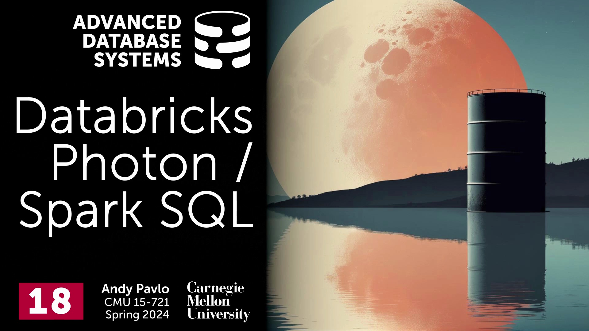
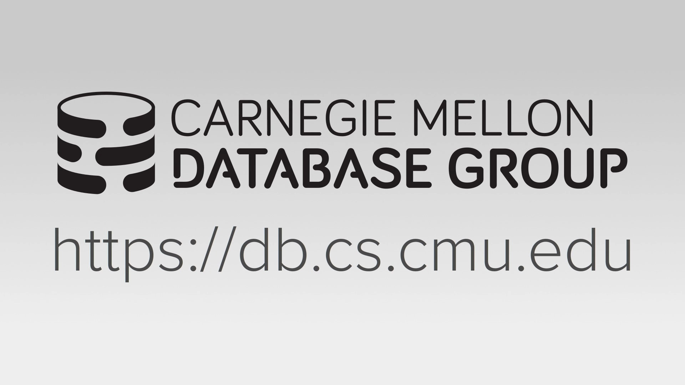
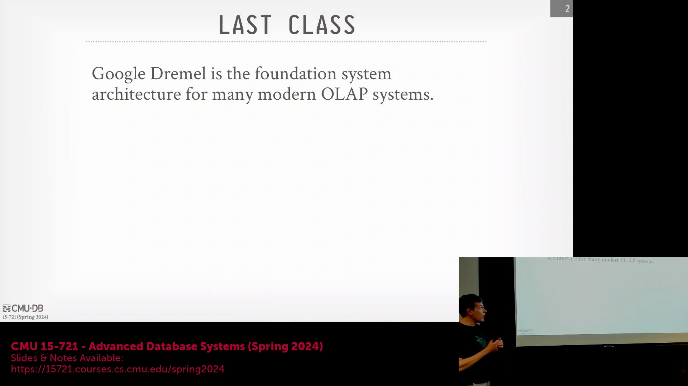
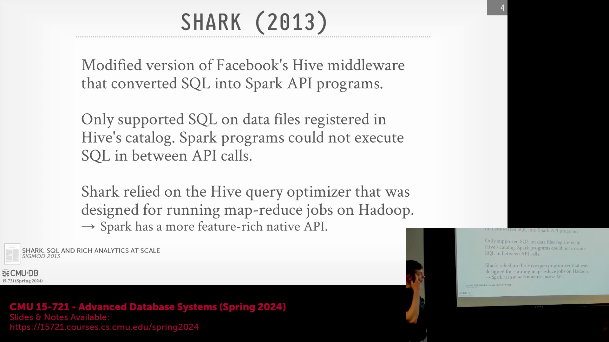
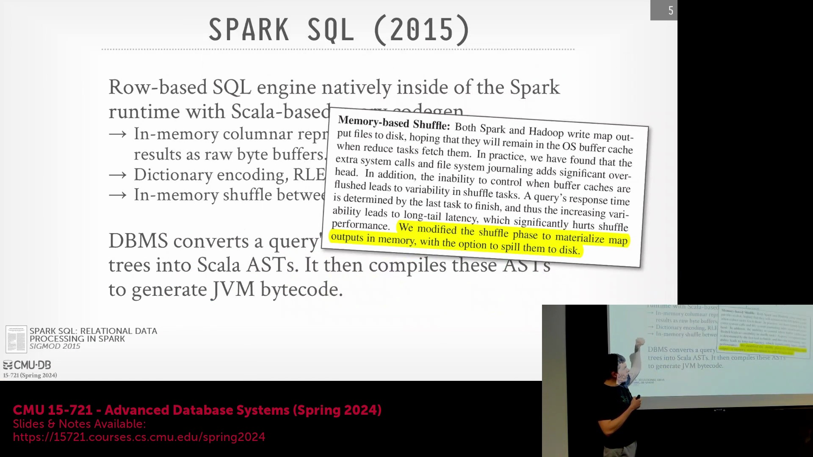

## 课程简介与 Dremel 的架构遗产

欢迎来到卡内基梅隆大学(Carnegie Mellon University)高级数据库系统(Advanced Database Systems)课程，本次课程在现场观众面前录制。上节课我们讨论了 BigQuery 和 Dremel 及其系统架构。

正如我所说，Dremel 的工作为构建许多现代数据湖(Data Lake)或湖仓一体(Lakehouse)系统提供了基础或蓝图。当然，并非所有系统都会照搬 Dremel 的每个细节，整体架构也通过其他系统得到了扩展，但总体而言，当业界提到构建现代数据湖或湖仓一体系统时，指的就是这种架构思路。下周我们讲到 Snowflake 时，会发现它与当前的 Spark 类似，在架构细节上高度相似。

## Spark 的起源与 JVM 生态系统

为了深入理解大家阅读过的 Databricks Photon 论文，我们首先需要回顾 Spark 的诞生历史，以及开发团队为何以特定方式构建其执行引擎(Execution Engine)。回到 2000 年代末，MapReduce 正开始流行。与此同时，加州大学伯克利分校启动了一个名为 Spark 的项目，旨在构建一个优于 MapReduce 编程模型的替代方案。它在某些方面与 MapReduce 相似，例如计算与存储的分离(Compute-Storage Separation)：底层使用 HDFS(Hadoop Distributed File System)，上层则是独立的执行器(Executor)。但 Spark 还支持迭代算法(Iterative Algorithms)，这解决了 MapReduce 难以高效处理的问题，允许程序在同一数据集上进行多次遍历。在开发 Spark 时，团队选择了 Scala 语言，因为这在当时（约 2010 年）非常热门。如今流行的可能是 Rust，此前是 Go，再往前则是 Scala，而 Python 则一直保持着稳定地位。因此，由于 Spark 采用 Scala 编写，这意味着它将运行在 JVM(Java Virtual Machine) 之上。

## Spark API 的演进：从 RDD 到 DataFrame
在本学期讨论过的几乎所有论文中，大多数系统都是使用 C++ 编写的。虽然 Rust 现在也越来越常见，但 C++ 始终是我们关注的重点。不过，市面上仍有大量数据库系统是用 Java 编写的，这主要是因为它们大多诞生于 2000 年代末或 2010 年代初。我们通常避免深入讨论这些系统所使用的编程语言实现细节，但对于今天的论文而言，正如大家所读到的，由于 Spark 本质上是用 Scala 编写并运行在 JVM 上的，这一点至关重要，因为它将限制底层实现的可能性。因此，Spark 的最初版本仅支持基于 RDD(Resilient Distributed Dataset，弹性分布式数据集) 的底层 API，任务计算的输出会被封装在这个 RDD 中。后来，团队增加了对 DataFrame API 的支持，提供了更高层次的抽象和编程接口。这也是 Spark 真正开始普及的转折点。你不再需要依赖 Pandas 或直接在 Python 中处理数据帧(DataFrame)，现在可以在 Spark 中运行并实现分布式计算。不过，在早期阶段（即 Spark 的第一个版本），它并不支持 SQL(Structured Query Language)，仍然完全依赖其他编程语言。

## “Shark”时代：早期的 SQL 替代方案与局限性
因此，当你拥有一个能够处理海量数据且日渐流行的计算框架时，用户自然会要求支持 SQL。这也是 Spark 社区的迫切需求。

于是，Spark 中第一个临时性的 SQL 支持方案被称为 Shark。开发团队分叉(Fork)了 Facebook 的 Hive 组件，该组件原本负责将 SQL 查询转换为 MapReduce 作业。他们在此基础上进行改造，将 SQL 查询转换为使用 Spark API 编写的 Spark 程序。这种方法的局限性在于，你只能在程序初始化时使用 SQL 提交查询。也就是说，你无法在程序的不同部分混合使用 Python 代码、Spark API 和 SQL。你不能将 SQL 查询的输出传递给 Scala 程序，再将该程序的输出传回 SQL，并在同一个工作流中完成这些操作。当时无法实现 SQL 与 API 的混合调用。他们面临的另一个挑战是，Shark 依赖于 Hive 查询优化器(Query Optimizer)，而该优化器最初是为了生成最优的 MapReduce 作业执行计划(Execution Plan)而设计的。因此，他们不得不对其进行大量改造以适配 Spark。然而，Spark 的 API 表达能力更强，能在程序中完成比 MapReduce 更多的操作。MapReduce 仅暴露了 `map` 和 `reduce` 两个函数。因此，通过 Shark 生成的查询执行效率往往不如手写代码，因为 Hive 的优化器并不了解，也无法充分利用 Spark 程序的额外特性。所以，这再次说明 Shark 只是一个权宜之计，是 Spark 早期引入 SQL 支持的过渡方案。

## Spark SQL 的原生集成与行业格局变迁
我想我在上节课也提到过。当时还有一个名为 Impala 的系统，它出自 Cloudera 公司。实际上，Cloudera 是早期分发 Spark 最多的厂商。只要用户有需求，其发行版(Distribution)中就会包含 Spark。但当人们开始要求在 Spark 中加入 SQL 支持时，Cloudera 并未提供 Shark。因为他们希望用户转而使用 Cloudera 自家的 Impala，以实现商业变现。因此，尽管 Shark 可以作为 Spark 的附加组件使用，但它并未被包含在 Cloudera 的官方发行版中。到了 2015 年，Databricks 团队推出了 Spark SQL。这是将 SQL 直接原生集成到 Spark 运行时(Runtime)中的方案。如今，当你下载 Spark 时，就会直接附带 Spark SQL。Cloudera 无法再将其剔除，在分发 Spark 时也不得不附带 Spark SQL。这基本上消除了用户使用 Impala 的必要性。这如同特洛伊木马(Trojan Horse)一般，逐渐瓦解了 Cloudera 的市场地位（我们并非要彻底否定 Cloudera 的贡献），而 Databricks 则借此成长为行业巨头。后来，Cloudera 虽然成功上市(IPO)，但随后又经历了私有化回购(Take-private)。我认为 Databricks 在某种程度上促成了这一市场格局的转变。另一个问题是，尽管 Cloudera 的名称中带有“Cloud”，但他们并未推出真正成功的云托管(Cloud-hosted) Hadoop 服务。相反，亚马逊(Amazon)通过 Hadoop（即 EMR(Elastic MapReduce) 服务）获得的收益甚至超过了 Cloudera。亚马逊不仅拥有 EMR Hadoop，还聚集了许多核心贡献者。这虽是题外话，但也反映了当时的生态变迁。

## Spark SQL 架构与 JVM 性能瓶颈
Spark SQL 的工作机制是：在查询计划(Query Plan)的底层数据输入阶段，仍然依赖基于行的架构(Row-based Architecture)。但当数据从一个算子(Operator)传递到下一个算子时，系统会将其存储在列式缓冲区(Columnar Buffer)或向量(Vector)中。它们支持字典编码(Dictionary Encoding)、RLE(Run-Length Encoding，游程编码)、位打包(Bitpacking)、压缩(Compression)等技术，也就是我们之前讨论过的所有优化手段。此外，他们还引入了内存混洗(In-memory Shuffle)阶段，用于连接查询的不同阶段或不同的数据流水线。其实际工作原理是：系统并未像我们在 Hyper 数据库中看到的那样进行完整的查询编译(Query Compilation)，而是仅针对 WHERE 子句(WHERE Clause)进行编译。具体做法是将 WHERE 子句转换为 Scala 的 AST(Abstract Syntax Tree，抽象语法树)，然后利用 Scala 的内部机制将其编译为 JVM 字节码(JVM Bytecode)。最后，将这些字节码动态链接并在运行时调用。因此，他们采用的是部分查询编译(Partial Query Compilation)技术来加速执行。
不过，他们仍面临其他挑战。如果你读过 Spark SQL 的论文，会发现其中有一段关于内存混洗的描述。在最初版本中，系统仅依赖操作系统的页面缓存(Page Cache)将数据保留在内存中，并在内存不足时进行溢写(Spill)。但后来在 Photon 论文中你会看到，他们摒弃了这种做法，因为操作系统的介入会引入不可预测的干扰，导致系统难以横向扩展。这又是一个很好的例证：你不希望操作系统干扰数据库系统或接管关键逻辑，而是希望由数据库自身掌控一切。因为系统调用(System Call)的开销、文件系统日志(File System Journaling)的开销等，都会引发严重的性能问题。

另一个挑战在于：将这些逻辑转换为 Scala 代码，或者对 WHERE 子句进行代码生成(Code Generation/Codegen)并编译，会面临一定困难。因为 JVM 对动态生成的代码大小存在限制。团队发现，在处理 SQL 查询时，系统瓶颈逐渐从磁盘 I/O(Disk I/O)转向了 CPU 计算(CPU Computation)。这带来了显著的计算开销……