## 课程简介与 Dremel 的架构遗产

欢迎来到卡内基梅隆大学(Carnegie Mellon University)高级数据库系统(Advanced Database Systems)课程，本次课程在现场观众面前录制。上节课我们讨论了 BigQuery 和 Dremel 及其系统架构。

正如我所说，Dremel 的工作为构建许多现代数据湖(Data Lake)或湖仓一体(Lakehouse)系统提供了基础或蓝图。当然，并非所有系统都会照搬 Dremel 的每个细节，整体架构也通过其他系统得到了扩展，但总体而言，当业界提到构建现代数据湖或湖仓一体系统时，指的就是这种架构思路。下周我们讲到 Snowflake 时，会发现它与当前的 Spark 类似，在架构细节上高度相似。

## Spark 的起源与 JVM 生态系统

为了深入理解大家阅读过的 Databricks Photon 论文，我们首先需要回顾 Spark 的诞生历史，以及开发团队为何以特定方式构建其执行引擎(Execution Engine)。回到 2000 年代末，MapReduce 正开始流行。与此同时，加州大学伯克利分校启动了一个名为 Spark 的项目，旨在构建一个优于 MapReduce 编程模型的替代方案。它在某些方面与 MapReduce 相似，例如计算与存储的分离(Compute-Storage Separation)：底层使用 HDFS(Hadoop Distributed File System)，上层则是独立的执行器(Executor)。但 Spark 还支持迭代算法(Iterative Algorithms)，这解决了 MapReduce 难以高效处理的问题，允许程序在同一数据集上进行多次遍历。在开发 Spark 时，团队选择了 Scala 语言，因为这在当时（约 2010 年）非常热门。如今流行的可能是 Rust，此前是 Go，再往前则是 Scala，而 Python 则一直保持着稳定地位。因此，由于 Spark 采用 Scala 编写，这意味着它将运行在 JVM(Java Virtual Machine) 之上。

## Spark API 的演进：从 RDD 到 DataFrame
在本学期讨论过的几乎所有论文中，大多数系统都是使用 C++ 编写的。虽然 Rust 现在也越来越常见，但 C++ 始终是我们关注的重点。不过，市面上仍有大量数据库系统是用 Java 编写的，这主要是因为它们大多诞生于 2000 年代末或 2010 年代初。我们通常避免深入讨论这些系统所使用的编程语言实现细节，但对于今天的论文而言，正如大家所读到的，由于 Spark 本质上是用 Scala 编写并运行在 JVM 上的，这一点至关重要，因为它将限制底层实现的可能性。因此，Spark 的最初版本仅支持基于 RDD(Resilient Distributed Dataset，弹性分布式数据集) 的底层 API，任务计算的输出会被封装在这个 RDD 中。后来，团队增加了对 DataFrame API 的支持，提供了更高层次的抽象和编程接口。这也是 Spark 真正开始普及的转折点。你不再需要依赖 Pandas 或直接在 Python 中处理数据帧(DataFrame)，现在可以在 Spark 中运行并实现分布式计算。不过，在早期阶段（即 Spark 的第一个版本），它并不支持 SQL(Structured Query Language)，仍然完全依赖其他编程语言。

## “Shark”时代：早期的 SQL 替代方案与局限性
因此，当你拥有一个能够处理海量数据且日渐流行的计算框架时，用户自然会要求支持 SQL。这也是 Spark 社区的迫切需求。

于是，Spark 中第一个临时性的 SQL 支持方案被称为 Shark。开发团队分叉(Fork)了 Facebook 的 Hive 组件，该组件原本负责将 SQL 查询转换为 MapReduce 作业。他们在此基础上进行改造，将 SQL 查询转换为使用 Spark API 编写的 Spark 程序。这种方法的局限性在于，你只能在程序初始化时使用 SQL 提交查询。也就是说，你无法在程序的不同部分混合使用 Python 代码、Spark API 和 SQL。你不能将 SQL 查询的输出传递给 Scala 程序，再将该程序的输出传回 SQL，并在同一个工作流中完成这些操作。当时无法实现 SQL 与 API 的混合调用。他们面临的另一个挑战是，Shark 依赖于 Hive 查询优化器(Query Optimizer)，而该优化器最初是为了生成最优的 MapReduce 作业执行计划(Execution Plan)而设计的。因此，他们不得不对其进行大量改造以适配 Spark。然而，Spark 的 API 表达能力更强，能在程序中完成比 MapReduce 更多的操作。MapReduce 仅暴露了 `map` 和 `reduce` 两个函数。因此，通过 Shark 生成的查询执行效率往往不如手写代码，因为 Hive 的优化器并不了解，也无法充分利用 Spark 程序的额外特性。所以，这再次说明 Shark 只是一个权宜之计，是 Spark 早期引入 SQL 支持的过渡方案。

## Spark SQL 的原生集成与行业格局变迁
我想我在上节课也提到过。当时还有一个名为 Impala 的系统，它出自 Cloudera 公司。实际上，Cloudera 是早期分发 Spark 最多的厂商。只要用户有需求，其发行版(Distribution)中就会包含 Spark。但当人们开始要求在 Spark 中加入 SQL 支持时，Cloudera 并未提供 Shark。因为他们希望用户转而使用 Cloudera 自家的 Impala，以实现商业变现。因此，尽管 Shark 可以作为 Spark 的附加组件使用，但它并未被包含在 Cloudera 的官方发行版中。到了 2015 年，Databricks 团队推出了 Spark SQL。这是将 SQL 直接原生集成到 Spark 运行时(Runtime)中的方案。如今，当你下载 Spark 时，就会直接附带 Spark SQL。Cloudera 无法再将其剔除，在分发 Spark 时也不得不附带 Spark SQL。这基本上消除了用户使用 Impala 的必要性。这如同特洛伊木马(Trojan Horse)一般，逐渐瓦解了 Cloudera 的市场地位（我们并非要彻底否定 Cloudera 的贡献），而 Databricks 则借此成长为行业巨头。后来，Cloudera 虽然成功上市(IPO)，但随后又经历了私有化回购(Take-private)。我认为 Databricks 在某种程度上促成了这一市场格局的转变。另一个问题是，尽管 Cloudera 的名称中带有“Cloud”，但他们并未推出真正成功的云托管(Cloud-hosted) Hadoop 服务。相反，亚马逊(Amazon)通过 Hadoop（即 EMR(Elastic MapReduce) 服务）获得的收益甚至超过了 Cloudera。亚马逊不仅拥有 EMR Hadoop，还聚集了许多核心贡献者。这虽是题外话，但也反映了当时的生态变迁。

## Spark SQL 架构与 JVM 性能瓶颈
Spark SQL 的工作机制是：在查询计划(Query Plan)的底层数据输入阶段，仍然依赖基于行的架构(Row-based Architecture)。但当数据从一个算子(Operator)传递到下一个算子时，系统会将其存储在列式缓冲区(Columnar Buffer)或向量(Vector)中。它们支持字典编码(Dictionary Encoding)、RLE(Run-Length Encoding，游程编码)、位打包(Bitpacking)、压缩(Compression)等技术，也就是我们之前讨论过的所有优化手段。此外，他们还引入了内存混洗(In-memory Shuffle)阶段，用于连接查询的不同阶段或不同的数据流水线。其实际工作原理是：系统并未像我们在 Hyper 数据库中看到的那样进行完整的查询编译(Query Compilation)，而是仅针对 WHERE 子句(WHERE Clause)进行编译。具体做法是将 WHERE 子句转换为 Scala 的 AST(Abstract Syntax Tree，抽象语法树)，然后利用 Scala 的内部机制将其编译为 JVM 字节码(JVM Bytecode)。最后，将这些字节码动态链接并在运行时调用。因此，他们采用的是部分查询编译(Partial Query Compilation)技术来加速执行。
不过，他们仍面临其他挑战。如果你读过 Spark SQL 的论文，会发现其中有一段关于内存混洗的描述。在最初版本中，系统仅依赖操作系统的页面缓存(Page Cache)将数据保留在内存中，并在内存不足时进行溢写(Spill)。但后来在 Photon 论文中你会看到，他们摒弃了这种做法，因为操作系统的介入会引入不可预测的干扰，导致系统难以横向扩展。这又是一个很好的例证：你不希望操作系统干扰数据库系统或接管关键逻辑，而是希望由数据库自身掌控一切。因为系统调用(System Call)的开销、文件系统日志(File System Journaling)的开销等，都会引发严重的性能问题。

另一个挑战在于：将这些逻辑转换为 Scala 代码，或者对 WHERE 子句进行代码生成(Code Generation/Codegen)并编译，会面临一定困难。因为 JVM 对动态生成的代码大小存在限制。团队发现，在处理 SQL 查询时，系统瓶颈逐渐从磁盘 I/O(Disk I/O)转向了 CPU 计算(CPU Computation)。这带来了显著的计算开销……

---

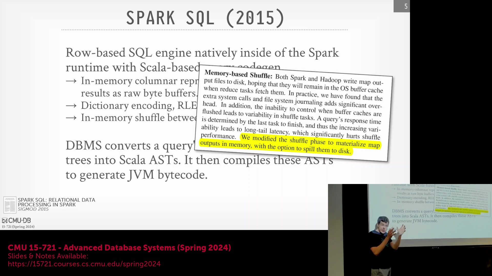
## 硬件瓶颈转移与早期 Spark SQL 的挑战
初始方案的计算开销逐渐凸显，尤其是在 2015 至 2020 年左右的硬件环境下。彼时磁盘读写速度相对较慢，数据仓库(Data Warehouse)与联机分析处理(Online Analytical Processing, OLAP)系统通常属于“磁盘受限(disk-bound)”而非“CPU受限(CPU-bound)”。如今，情况已发生反转：CPU 取代磁盘成为了主要性能瓶颈。然而，初代 Spark SQL 的架构设计正是基于早期磁盘输入/输出(Input/Output, I/O)为主要限制因素（而非 CPU 算力）的时代背景所构建的。

## JVM 垃圾回收与堆外内存变通方案
随着计算开销的凸显，早期 Spark SQL 的工作负载迅速转变为 CPU 受限(CPU-bound)。其中的核心瓶颈之一在于 Java 虚拟机(Java Virtual Machine, JVM)的内存管理模型。在 Java 中，每次通过 `new` 关键字分配的对象均驻留于堆内存(Heap Memory)中，垃圾回收器(Garbage Collection, GC)需在此追踪对象引用并定期扫描内存，以回收可释放的空间。由于 JVM 未提供直接的原生内存分配函数（如 `malloc`），工程师不得不自行实现堆外(off-heap)内存管理。借助 JVM 内部的 `Unsafe` API，内存被分配至进程拥有但对 GC 不可见的区域。为规避 GC 停顿(GC Pause)拖慢执行速度，开发团队投入了大量工程资源将数据迁移至堆外，但这也不可避免地为系统引入了显著的复杂性。

## JIT 编译限制与工程可扩展性
另一个关键挑战源于即时编译(Just-In-Time Compilation, JIT)机制。若要榨取最佳性能，开发者必须深入掌握 JVM 底层机制，这导致团队在扩展 Spark SQL 优化方向的工程人力时面临困难。与多数开发者能够相对快速上手 C++ 代码库的生态不同，JVM 级别的性能优化门槛极高且专业性极强。此外，JVM 对编译后方法体的代码体积存在严格限制。正如 Photon 相关论文所述，当数据表的列数达到数百级别时，JVM 会因代码过大而拒绝编译该查询，并自动降级至速度较慢的解释器模式(Interpreter Mode)。随着硬件算力与分析需求的同步演进，这些底层约束充分暴露了 2010 年代初基于 JVM 架构的局限性。

## Photon 的设计：嵌入式内核库
为突破传统架构的瓶颈，Photon 并未被设计为类似 Dremel 或 Snowflake 的独立数据库系统，而是作为一个可嵌入的向量化加速库。它能够直接集成至 Spark 或 Databricks Runtime 等现有运行时环境(Runtime Environment)中。相较于 Velox 等底层执行框架，Photon 的定位更为轻量，不直接负责线程池或内存池的管理。相反，它提供细粒度的计算内核(Computation Kernels)与算子(Operators)，可被精确注入至查询执行计划(Query Execution Plan)中。所有资源的编排、内存分配与任务调度，均交由宿主运行时(Host Runtime)统一接管。

## 无缝集成与用户透明性
Photon 的核心设计目标是与 Databricks Runtime 实现无缝且非侵入式的集成。这使得 Photon 能够以渐进式(Progressive)接管特定计算组件，用户无需重写 SQL 查询或调整现有工作流。保持严格的结果一致性(Result Consistency)是重中之重：启用或升级 Photon 绝不应改变查询输出或系统语义。此外，Photon 在传统 Spark 的逐行处理(Row-at-a-time Processing)模式与现代向量化(Vectorized Execution)、列式执行(Columnar Execution)之间架起了桥梁。若某个查询算子暂未提供 Photon 加速版本，系统会自动触发优雅降级(Graceful Fallback)至原始 Spark 运行时路径，从而保障业务的连续性与稳定性。

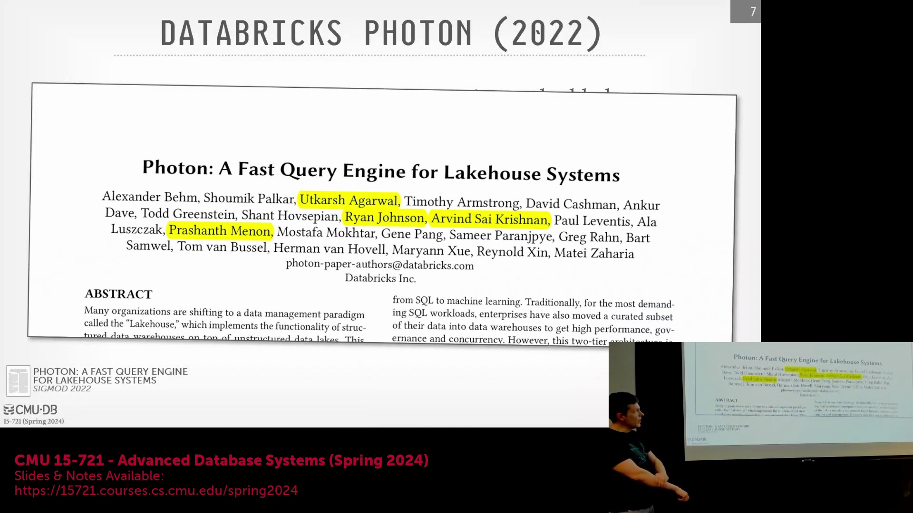
## 高层架构与优化重点
Photon 的整体架构与现代分布式查询引擎(Distributed Query Engine)一脉相承，采用中心化的驱动节点(Driver/Coordinator)负责 SQL 解析、生成执行计划，并在集群中进行任务调度。其核心优化方向聚焦于基于批处理(Batch Processing)的向量化执行与预拷贝内存原语(Pre-copy Memory Primitives)。系统原生支持基于数据混洗(Shuffle)的数据分发机制，底层高效实现了归并连接(Merge Join)与哈希连接(Hash Join)，并深度集成了查询优化器(Query Optimizer)与自适应执行(Adaptive Execution)技术，可根据运行时统计信息(Runtime Statistics)进行动态计划调整。

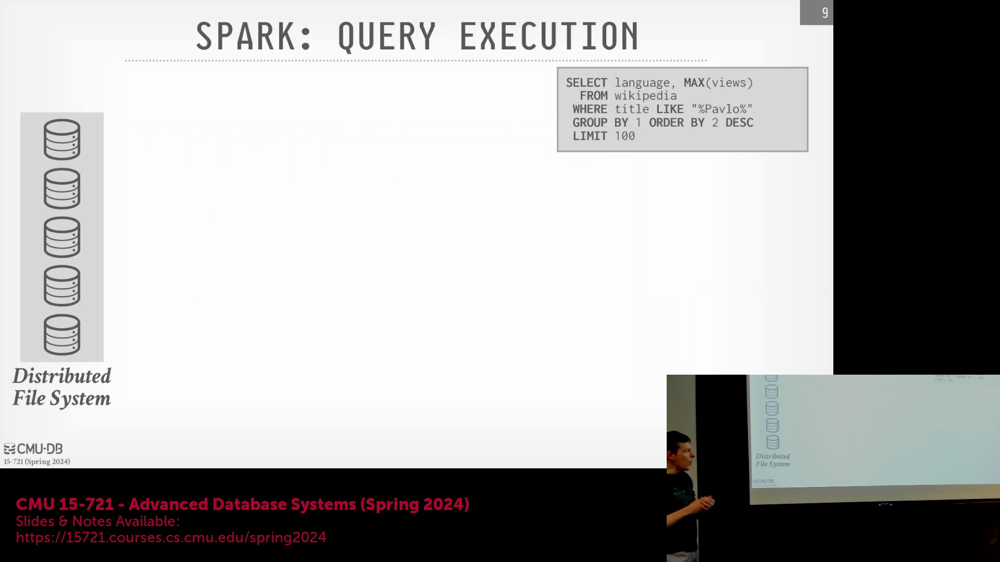
## 分布式执行流程与 Shuffle 阶段
在执行阶段，Driver 节点将计算任务分发至 Worker 节点，各节点从分布式存储系统(Distributed Storage System)中拉取数据并完成初始阶段的计算。随后，系统进入 Shuffle 阶段，中间结果在此阶段按分区(Partition)切分并在不同 Worker 节点间进行网络交换。在标准 Spark 部署架构中，通常借助本地哈希表实现内存型 Shuffle(In-memory Shuffle)，以便下游 Worker 节点直接高效拉取数据。Photon 深度嵌入该分布式执行流程中，在加速核心计算算子的同时，完全兼容宿主运行时原有的任务调度与数据移动机制。

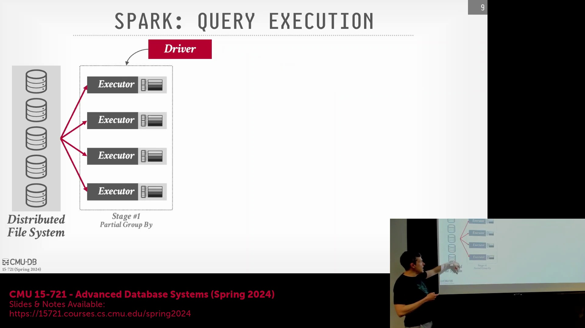

---

## 高级执行与 Shuffle 架构
该系统采用多阶段执行模式，执行器(Executor)可将中间数据写入类似 Unifor(Unifor) 或 Apache Spark 的远程 Shuffle(Remote Shuffle) 服务中。在后续阶段，执行器会从上一阶段的输出中拉取(Pull)数据。若未启用远程 Shuffle 服务，执行器必须保持驻留，直至下一阶段初始化。调度器(Scheduler)可通过将多个阶段进行同节点部署(Co-locating)来优化此过程，从而复用本地内存。宏观而言，该执行模型与 Dremel(Dremel) 高度相似。尽管不同系统的 Shuffle 实现各异，但“从上一阶段拉取数据”这一核心机制始终保持一致。

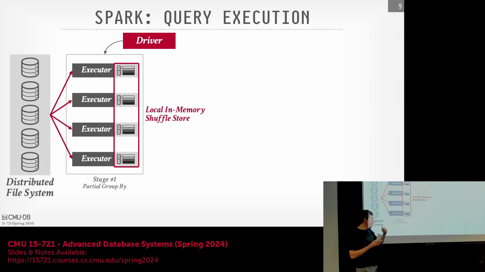

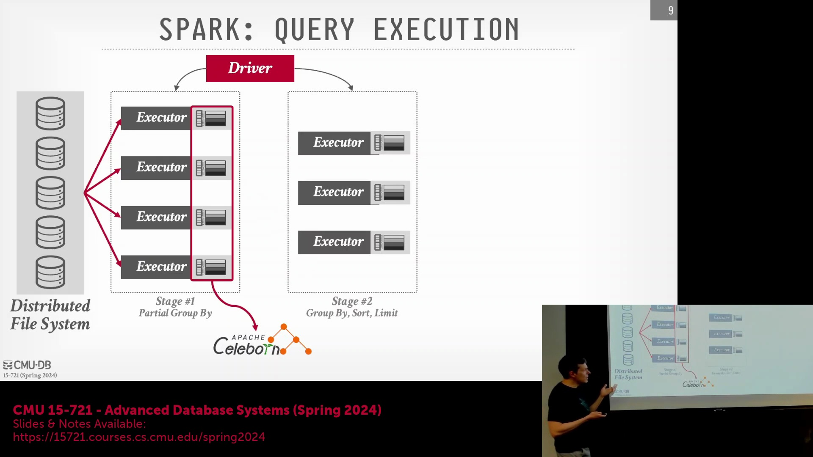

## Photon 简介与预编译原语
Photon(Photon) 并非独立的服务或进程，而是直接运行于每个执行器(Executor)内部，并由 Java 代码调用。它实现了一个拉取式(Pull-based)向量化引擎(Vectorized Engine)，该引擎底层依赖预编译(Pre-compiled) C++ 代码，论文中将其称为算子内核(Operator Kernels)或原语(Primitives)。这些原语针对特定数据类型进行了模板化，能够高效处理各类计算任务（如比较、算术运算等），且无需依赖即时(Just-In-Time, JIT)代码生成。通过将函数指针调用(Function Pointer Call)的开销分摊至整个数据向量，并结合表达式融合(Expression Fusion)技术，Photon 实现了极高的执行效率。该论文广受好评的原因在于，它并未仅停留在结果展示，而是透明且详尽地剖析了这些设计决策背后的工程考量。

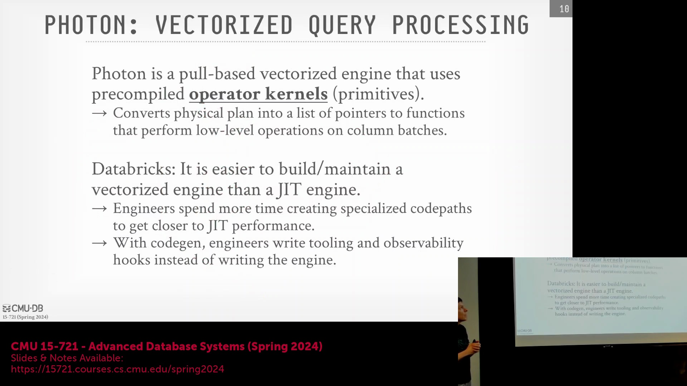

## 权衡取舍：向量化引擎 vs. JIT 编译
Photon 的一项核心工程决策是采用预编译(Pre-compiled)向量化模型，而非 JIT 编译(JIT Compilation)方案（例如 Hyper(Hyper) 数据库）。尽管 JIT 引擎在初期可能带来更高的原始性能，但其调试与性能剖析(Profiling)的开销极为庞大。JIT 编译生成的代码一旦发生崩溃，开发人员将直接面对缺乏源码上下文的汇编代码，迫使团队不得不开发大量定制化工具来进行问题诊断。相比之下，预编译原语更利于迭代开发，对专业技能的门槛要求较低，能够让更多工程师参与其中。从长远来看，该方案不仅能达到与 JIT 引擎相当甚至更优的性能，对于大规模工程团队而言，也是更具可持续性的技术选型。

## SIMD 优化与位置列表跟踪
Photon 高度依赖编译器的自动向量化(Auto-vectorization)功能；鉴于其工作负载中的数据规模通常较为适中，该功能表现优异。在必要时，开发人员会手动插入 SIMD 内在函数(SIMD Intrinsics)以确保指令执行达到最优。为管理数据流，算子通过调用 `get_next` 函数来生成列批(Column Batches)。当过滤器(Filter)剔除部分元组后，Photon 并未对向量进行物理压缩，而是采用位置列表(Position List，即有效偏移量向量)来追踪活跃行。论文将该方法与基于位图(Bitmap-based)的追踪方式进行了对比，结论表明：除非在几乎所有元组均保持活跃的极端边缘场景下，否则位置列表在绝大多数情况下的性能更优。这一结论随后得到了后续研究的进一步验证，例如卡内基梅隆大学(Carnegie Mellon University, CMU)的一篇硕士学位论文，该研究在多种工作负载与硬件配置下对这两种方案进行了详尽的基准测试(Benchmark)。

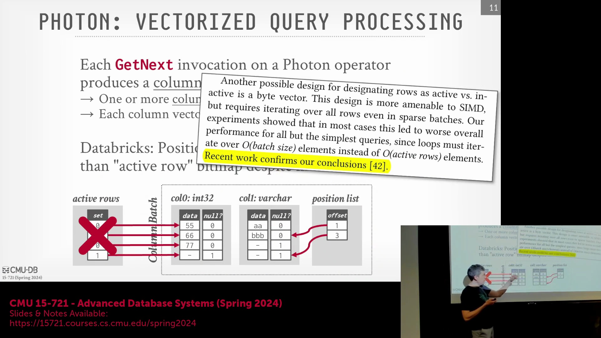

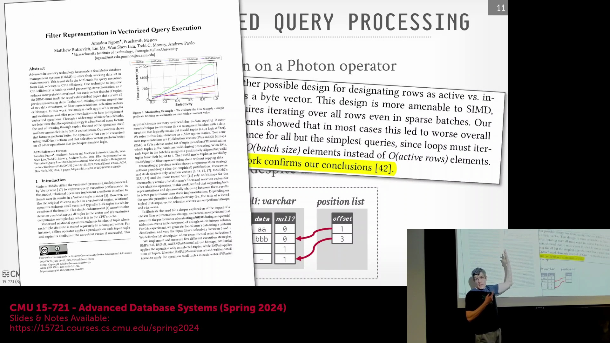

## 为避免垂直算子融合而牺牲用户剖析
Photon 刻意避免了类似 Hyper(Hyper) 的垂直算子融合(Vertical Operator Fusion)技术，该技术通常会将多个算子合并至单一执行管道(Execution Pipeline)中，并形成深层嵌套循环。这一决策主要基于两方面考量：一是保持工程实现的简洁性，二是满足面向用户的性能剖析(Profiling)需求。一旦算子进行垂直融合，将实际执行时间精确映射回查询计划(Query Plan)中的具体 SQL 算子将变得极其困难。而编写 SQL 的用户亟需清晰的诊断反馈，以准确定位查询计划中的性能瓶颈。作为垂直融合的替代方案，Photon 在单个算子内部采用了水平融合(Horizontal Fusion)或表达式融合(Expression Fusion)。尽管该方法以批处理(Batch)而非逐元组(Tuple-at-a-time)的方式处理数据，但它保留了透明且可解释的执行模型。该模型与逻辑查询计划高度对齐，从而能够生成准确且具备可操作性的性能分析报告。

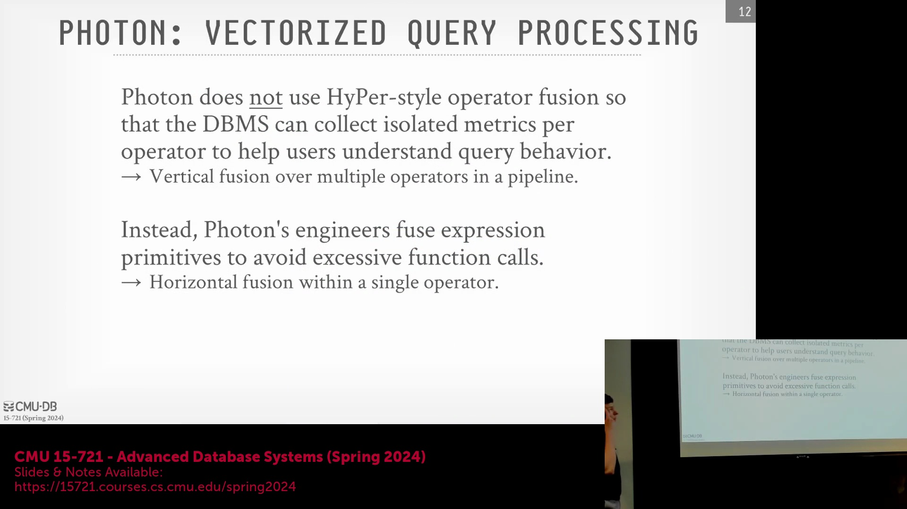

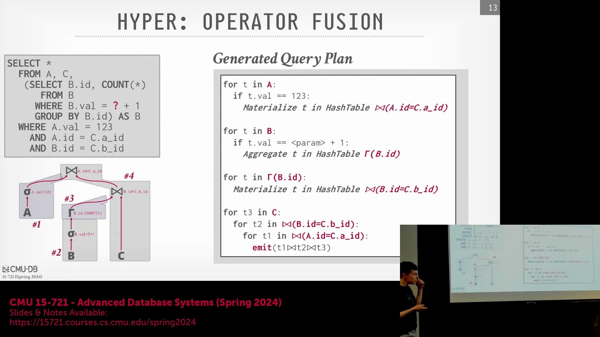

---

## 传统算子追踪的局限性
准确追踪单个算子(Operator)的精确耗时并将其归因映射以评估性能表现，历来是一项公认的难题，且在大规模场景下难以保持良好的扩展性。为了向用户清晰传达系统行为，这种碎片化的追踪方法并不切实际。因此，系统转向了**表达式融合(Expression Fusion)**技术，该技术旨在简化执行流程并提升系统透明度。
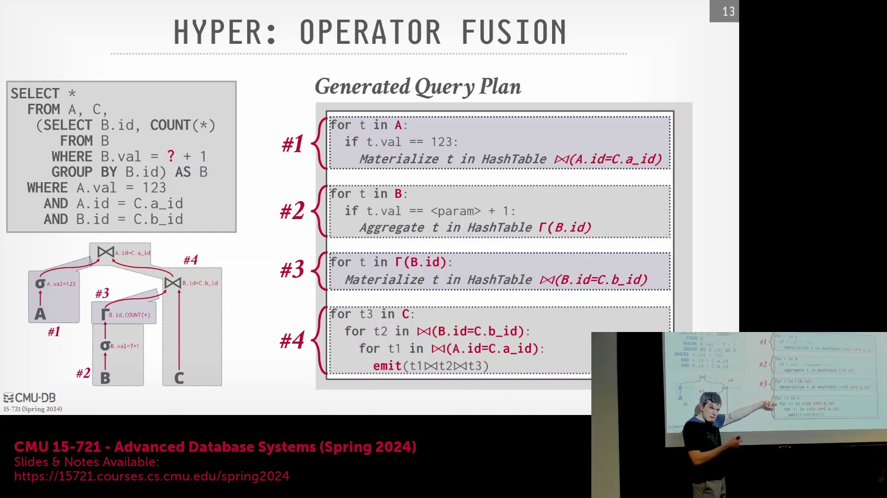

## 表达式融合的机制
表达式融合通过将多个连续的基础原语(Primitives)合并为单一的统一计算步骤，从而有效突破性能瓶颈。Photon 不会在算子内依次执行两个独立的函数，而是生成一个模板化原语(Templated Primitive)，同步处理这两项计算。
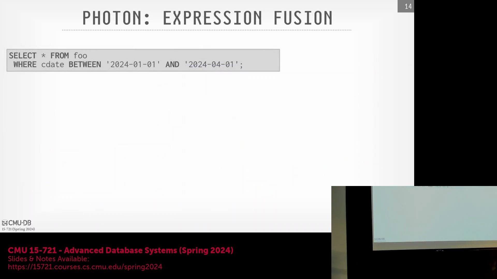
例如，日期范围查找(`BETWEEN`)会被转换为一个 `<=` 和一个 `>=` 条件，并通过逻辑与(AND)子句进行连接。若不进行融合，该操作需要调用两个独立的原语，生成两个偏移量列表(Offset Lists)，后续还必须对这些列表求交集才能定位匹配的记录。
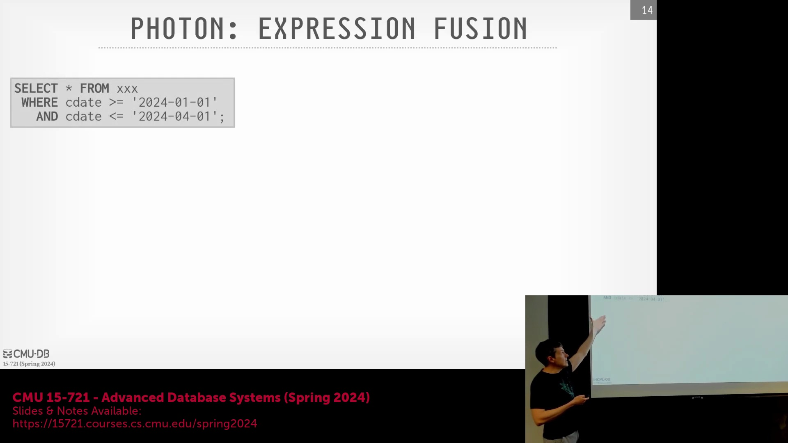
融合技术消除了重复函数调用和列表求交所带来的开销。代码生成器(Code Generator)不再执行独立的条件检查，而是生成一个单一的模板化函数，仅需一次数据遍历即可同时评估这两个条件，并为所有相关数据类型编译对应的支持代码。
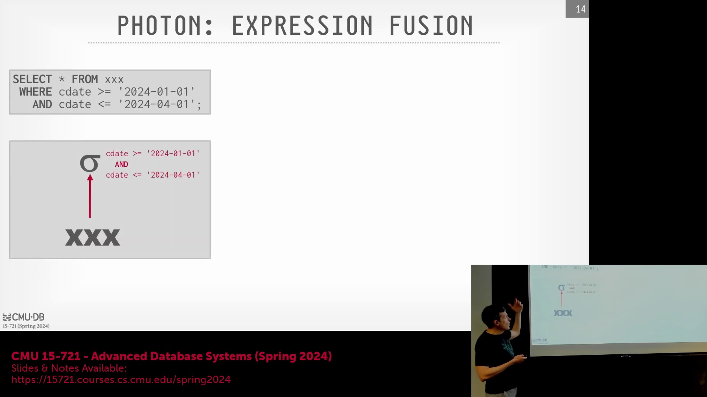
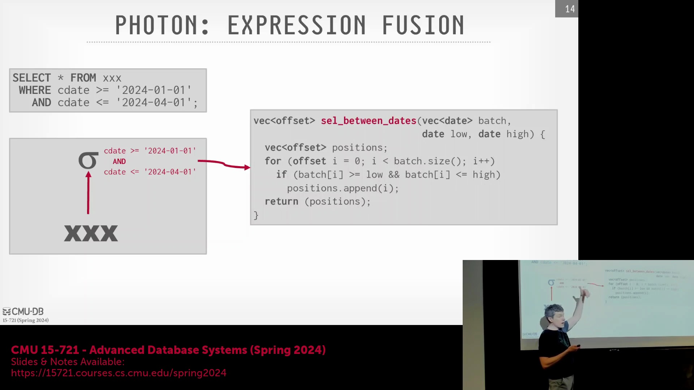

## 云环境中的遥测驱动优化
历史上，Vectorwise 早期版本等本地部署(On-Premises)系统只能依赖对常见查询模式的经验性推测，来决定需要融合哪些操作。云原生(Cloud-Native)架构从根本上改变了这一范式。Databricks 和 Redshift 等平台能够直接采集所有用户查询与系统遥测数据(Telemetry Data)。通过分析真实世界的工作负载(Workloads)，它们可以基于经验精准识别出哪些操作经常协同执行，并据此对系统进行定向优化。例如，Redshift 通过日志分析发现，用户意外地在读优化型(Read-Optimized)系统上运行了大量繁重的 `UPDATE` 查询，这一发现直接促成了针对性的性能改进。这种数据驱动的反馈循环(Data-Driven Feedback Loop)使现代数据库能够基于实际使用情况实现自我优化，而非依赖于预设的最坏情况假设。

## Spark 内部的动态内存管理
Photon 并非独立运行的引擎，而是作为嵌入式组件深度集成在 Spark 的 JVM 生态系统中。为了保持无缝集成并实现准确的内存核算(Memory Accounting)，Photon 避免了直接调用 `malloc`。相反，它将内存分配委托给 Spark 现有的 Java 内存管理器。JVM 负责分配内存块并执行原生内存跟踪，随后将安全指针(Safe Pointers)传递给基于 C++ 的 Photon 代码，使其自动继承 Spark 的性能剖析(Profiling)、监控报告及垃圾回收(Garbage Collection)基础设施。

由于数据湖仓(Lakehouse)工作负载经常查询对象存储(Object Storage)中非结构化或此前未见过的文件，系统极少能提前获取准确的选择性统计信息(Selectivity Statistics)。因此，算子在执行过程中可能突然需要超出初始预算的内存。为动态应对这一挑战，Photon 采用了集中式的内存压力管理(Memory Pressure Management)机制。当某个算子需要额外内存时，它会向 JVM 内存管理器发起请求。管理器随后会扫描所有活跃任务，定位可释放内存最多的任务，并触发其将数据溢写(Spill)至磁盘或释放已占用的内存。这种集中式溢写机制免去了每个独立算子自行实现磁盘溢写逻辑的负担，在灵活适应不可预测数据量的同时，有效防止了内存溢出(Out Of Memory, OOM)故障。

## Catalyst 优化器与物理计划到物理计划的转换
Spark SQL 传统上依赖 Catalyst 优化器(Catalyst Optimizer)，该优化器遵循级联(Cascades)风格的架构，依次经历逻辑计划优化与物理计划生成阶段。Photon 在此基础上引入了一个新颖的**物理计划到物理计划转换(Physical-to-Physical Transformation)**阶段。在 Catalyst 生成标准的 Spark SQL 物理计划后，系统会执行一次额外的自底向上遍历，专门用于注入 Photon 原生算子。
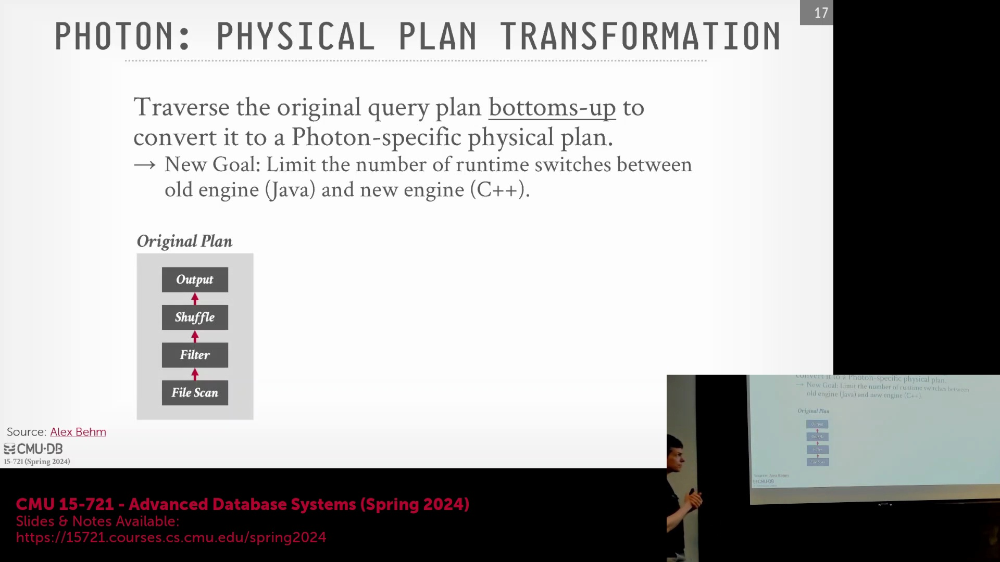
这种注入策略的首要目标是尽可能最小化 JVM 与 C++ 之间的上下文切换(Context Switching)。通过自底向上遍历执行计划（通常位于数据吞吐量最高的底层节点），Photon 会尽可能多地用其原生实现替换兼容的 Spark 算子。这确保了在 C++ 层能够实现长距离、不间断的流水线执行，显著降低了数据序列化与跨语言边界调用的开销。关键在于，这些替换决策均在查询优化阶段完成，而非运行时，从而使引擎能够在实际数据处理开始前就锁定最高效的执行策略。

## 实际的执行计划转换
考虑一个简单的查询计划：`File Scan -> Filter -> Shuffle -> Output`。在传统的 Spark 环境中，所有阶段均在 JVM 内执行。借助 Photon 的优化器遍历机制，系统会识别出由于受 I/O 限制，`File Scan` 阶段仍保留在 Java 层执行，但会立即为 `Filter` 和 `Shuffle` 阶段注入 Photon 原生算子。这种针对性替换在计算密集型步骤上最大化了原生向量化执行(Vectorized Execution)，同时保持了对 Spark 现有基础设施的完全兼容，在无需彻底重写引擎的前提下实现了显著的性能飞跃。
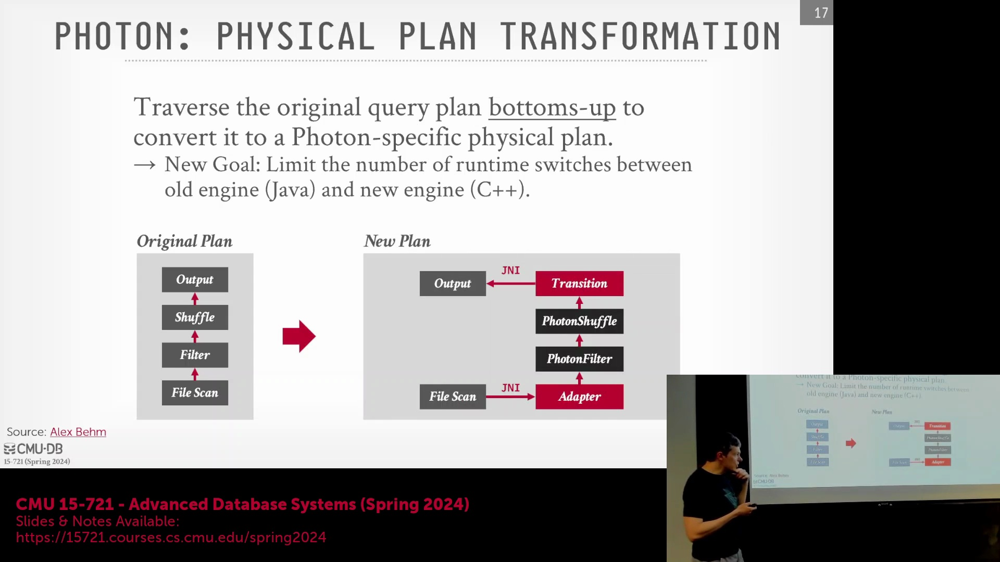

---

## Java-C++ 边界(Java-C++ Boundary)及数据适配器(Adapter)
Photon 作为一款 C++ 引擎，通过 Java 原生接口(Java Native Interface, JNI) 被 Spark 的 JVM 调用。为了弥合底层架构差异，系统引入了“适配器”与“过渡算子(Transitional Operator)”，将传入的 Java 行式数据(Row-based Data) 转换为 Photon 内部的列式向量化格式(Columnar Vectorized Format)，并在计算完成后将结果转换回 Java 兼容的处理格式。尽管这些适配器在逻辑实现上较为轻量，但其底层涉及高昂的数据转置(Data Transposition)、内存复制与数据移动开销。因此，查询优化器的核心策略是尽可能使数据在 Photon 引擎内部闭环流转，以最大限度地减少跨语言边界的交互损耗。

## 宏观与微观自适应策略(Macro & Micro Adaptive Strategies)
为应对数据湖仓(Lakehouse)环境中不可预测的数据分布特征，Photon 实现了两种差异化的自适应执行范式。“宏观(Macro)”自适应作用于查询(Query)级别，通常在 Shuffle 操作之后触发。它会实时分析运行时统计信息(Runtime Statistics)来动态重构执行计划，例如调整并行 Worker 节点数量，或将 Shuffle Join(Shuffle Join) 降级切换为广播连接(Broadcast Join)。相反，“微观(Micro)”自适应则在单个算子内部的批次(Batch)级别运行。当数据流经元组批次或向量化数据块时，Photon 会依据实时数据特征自动切换至最优的算子底层实现。该过程对上层应用完全透明，无需查询优化器在运行时进行干预。
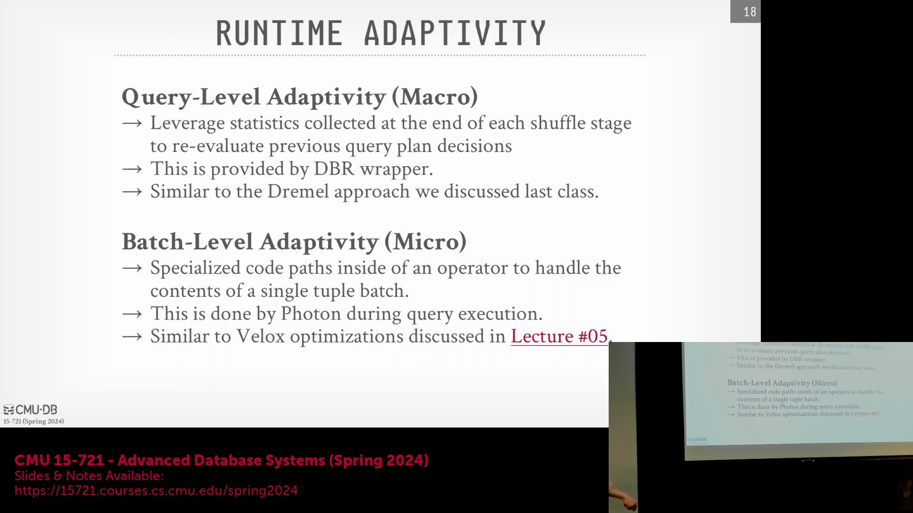

## 针对倾斜数据的动态分区管理
在宏观层面，Photon 采用一种主动式分区管理(Proactive Partition Management)策略，以缓解连接操作(Join)中的数据倾斜(Data Skew)与内存压力。与部分系统在数据溢出(Spill)时动态创建新分区的做法不同，Spark 会预先分配规模远超初始估算值的分区池(Partition Pool)。当某个 Worker 的活跃分区面临内存枯竭时，系统会自动识别出利用率较低的预分配分区，将溢出的数据迁移并整合至这些空闲分区中，同时释放已饱和分区的内存资源。尽管该过程同样涉及额外的数据移动(Data Movement)开销，但在缺乏准确先验统计信息(Prior Statistics)的复杂场景下，这种动态整合技术能有效降低内存碎片化风险，防止内存溢出(Out Of Memory, OOM)故障的发生。
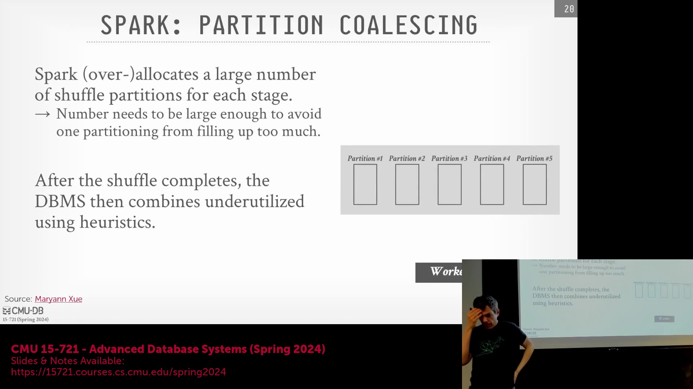
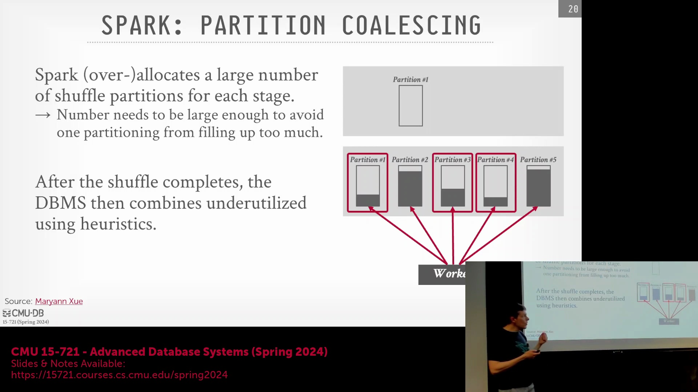
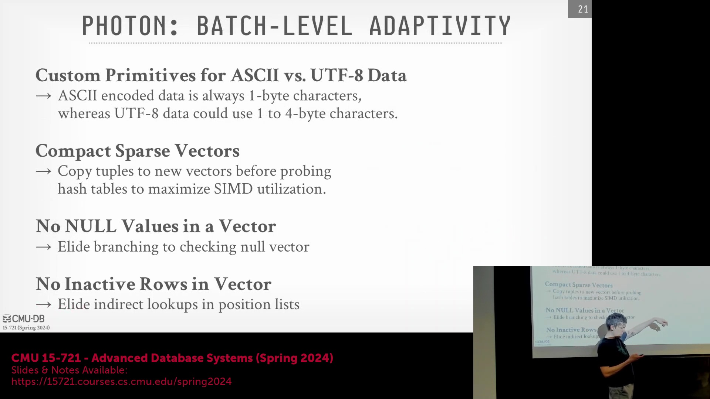

## 基于模板的原语与批次级优化
微观自适应机制充分利用预编译的模板化原语(Templated Primitives)来消除运行时开销。例如，当检测到某字符串列仅包含 ASCII 字符时，Photon 会自动切换至专用处理路径，从而规避多字节 Unicode 编码处理中固有的分支预测失败(Branch Mispredictions)问题。此外，Photon 会对稀疏向量(Sparse Vectors)进行压缩编码，以优化哈希表探测(Hash Table Probe)阶段的缓存局部性(Cache Locality)。借助编译期布尔模板(Compile-time Boolean Templates)，代码生成器会静态派生出多个函数变体，预先确定是否跳过空值(Null)或非活跃行(Inactive Rows)的评估逻辑。在运行时，Photon 仅依据批次元数据(Batch Metadata)动态路由至最优变体，彻底剔除冗余的条件判断分支。该机制带来了显著的性能收益，例如在连接探测(Join Probes)场景下可实现高达 1.5 倍的执行加速。

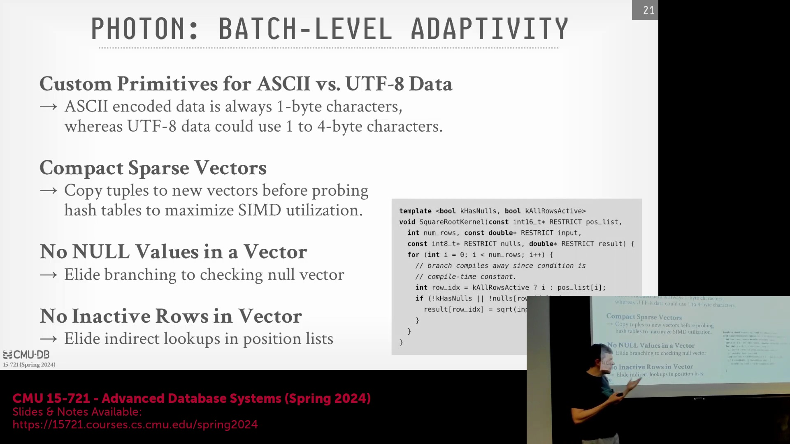

## 基准测试结果与云定价模型
基于大规模 TPC-H 基准测试(TPC-H Benchmark)的评估结果显示，相较于标准 Spark SQL，Photon 展现出显著的性能优势，各类查询的执行耗时均实现大幅缩减。对于结构相对简单、以数据扫描为主的查询(Scan-Intensive Queries)，将计算算子完全卸载(Offload)至原生 C++ 引擎所能获得的性能收益最为显著。在商业化层面，Databricks 针对启用 Photon 加速的计算作业采用溢价定价(Premium Pricing)策略。该策略构建了一种双赢生态：用户端获得了极致的查询响应速度与大幅缩短的总计算时长；平台端尽管单位计算资源的定价略高，却通过缩短作业运行时间有效降低了集群占用周期，从而整体优化了资源利用率(Resource Utilization)。

---

## TPC 基准测试与性能认证的演进
事务处理性能委员会(Transaction Processing Performance Council, TPC)由 Jim Gray 等数据库先驱于 20 世纪 80 年代创立，旨在标准化联机分析处理(Online Analytical Processing, OLAP)基准测试，防止厂商发布不可复现且仅服务于自身利益的性能营销宣传。作为 TPC-H 的现代继任者，TPC-DS(TPC Decision Support Benchmark)是数据仓库工作负载的官方权威审计基准测试。2021 年，Databricks 获得了官方的 TPC-DS 认证，在 100TB 规模因子(Scale Factor)的测试中斩获榜首，超越了以往的领先者。该认证不仅严格评估原始查询吞吐量(Query Throughput)，还全面衡量云服务模型下的性价比(Price-Performance)，且必须经过严格的第三方审计(Third-party Audit)。
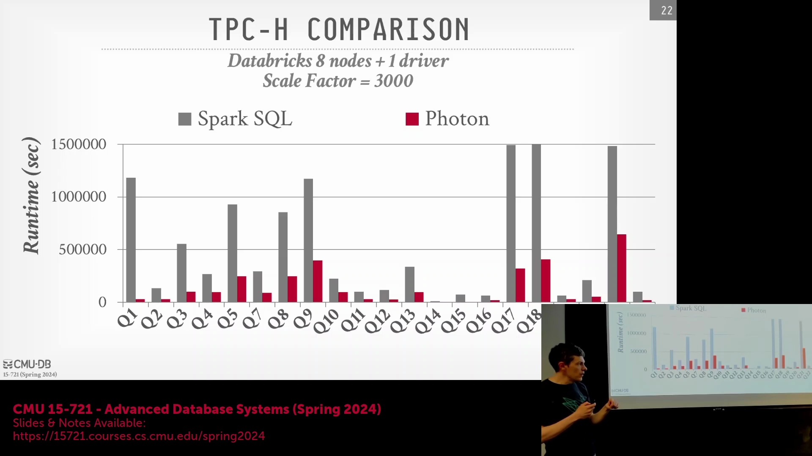
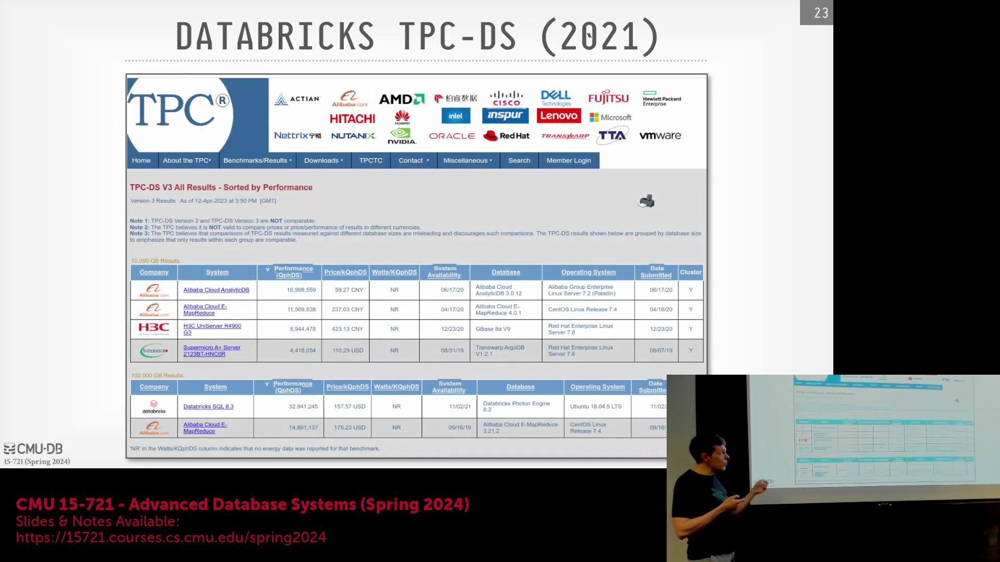
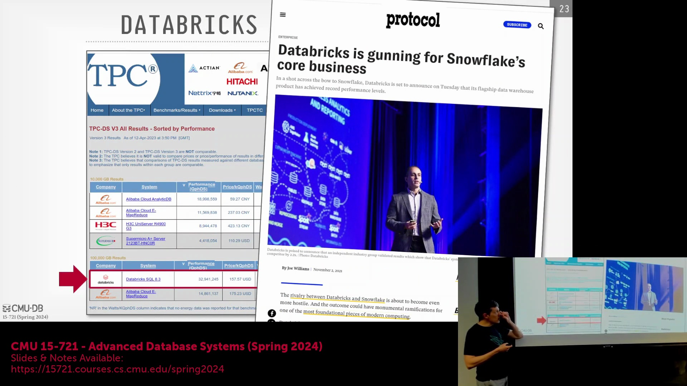
尽管具备显著的营销影响力，但官方 TPC 排名在现代企业采购决策(Enterprise Procurement Decisions)中的话语权已十分有限。虽然 TPC-H 和 TPC-DS 等基准测试在技术评估方面仍具参考价值，但严格且昂贵的审计流程对新兴初创公司而言往往不切实际。此外，在现代云环境中进行真正的“同等条件(Apple-to-Apple Comparison)”对比也愈发困难。云厂商高度抽象了底层硬件（例如虚拟化计算资源与特定 EC2 实例型号之间的差异），使得几乎无法验证不同云提供商是否采用了完全相同的硬件基线(Hardware Baseline)。因此，尽管 TPC 认证标志着深厚的工程成熟度(Engineering Maturity)，但在托管云数据平台(Managed Cloud Data Platform)时代，其历史上的市场主导地位已有所减弱。
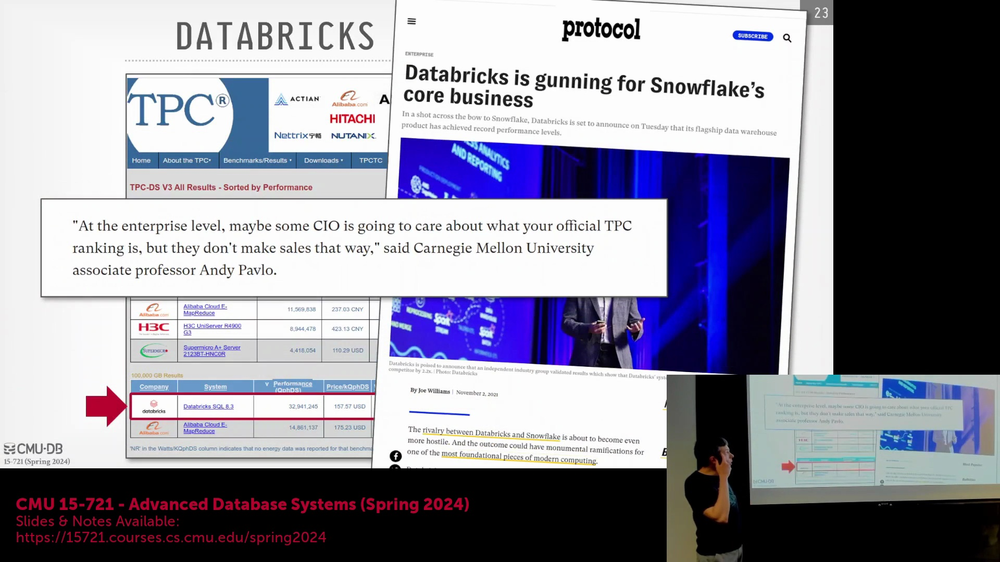

## 开源 Spark 加速替代方案
与开源的 Apache Spark 本身不同，Databricks 的 Photon 运行时(Runtime)是一款专有的闭源引擎(Closed-source Engine)，仅通过付费订阅模式提供。然而，开源生态已孕育出多种替代性加速器(Accelerators)，能够实现相当的性能提升。知名项目包括 Apache Gluten（前身为 Gazelle），它支持 Spark 将完整的查询计划(Query Plan)卸载(Offload)至 Apache Arrow、FPGA、ClickHouse 或 Velox 等原生执行后端(Native Backend)。其他专用加速器则聚焦于特定硬件或执行框架，例如面向 GPU 加速数据科学工作负载(GPU Workloads)的 NVIDIA RAPIDS、基于 DataFusion 构建的 Blaze，以及近期推出的完全基于 DataFusion 实现的 Apache Arrow Comet。
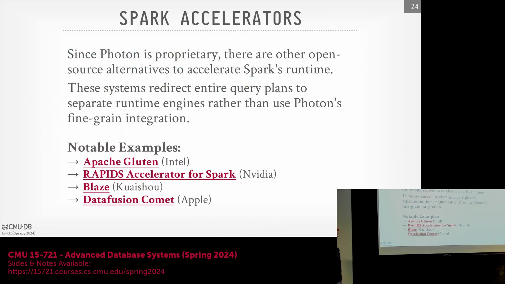
与 Photon 的细粒度架构(Fine-grained Architecture)（即在算子级别(Operator Level)动态替换单个算子并精细管理 JVM 到 C++ 的数据转换）不同，这些开源替代方案通常采用更为粗粒度的策略。它们会拦截由 Spark Catalyst 优化器生成的完整物理查询计划(Physical Query Plan)，完全绕过 Spark 原生执行运行时(Native Execution Runtime)，并将计算工作负载直接路由(Routing)至外部原生引擎。用户虽仍通过标准的 Spark SQL 接口进行交互，但底层执行过程已被整体委托。目前，DataFusion 已成为诸多此类加速器的统一基石，作为 Spark 生态系统中高性能、可插拔的执行后端(Pluggable Execution Backend)，在业界获得了广泛采用。
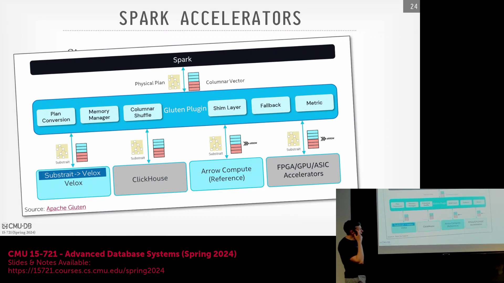
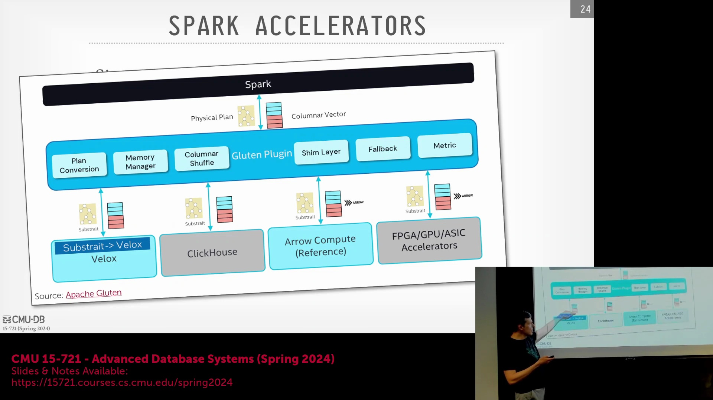
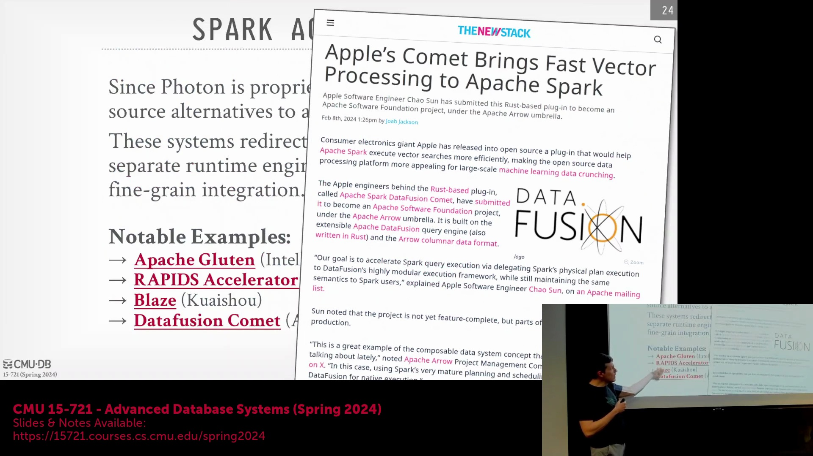

## Delta Lake：解决湖仓统计信息难题
湖仓架构(Lakehouse Architecture)面临的一项根本性挑战是长期缺乏可靠的数据统计信息(Data Statistics)。当查询引擎直接在对象存储(Object Storage)上处理原始文件时，通常无法预先获知数据分布(Data Distribution)或列数据选择性(Column Selectivity)。虽然运行时自适应(Runtime Adaptivity)机制有助于缓解次优执行计划带来的问题，但唯有将自适应执行与准确的预置统计信息相结合，才能释放最佳性能。Delta Lake 通过在原始对象存储与计算引擎之间引入结构化的数据摄入(Data Ingestion)与事务层(Transaction Layer)，成功填补了这一空白。它摒弃了用户将任意文件直接随意写入对象存储（如 S3）的传统做法，转而通过严格的事务日志(Transaction Log)来统一管控数据摄入流程。
在后台，异步的文件合并(File Compaction)进程会将增量数据合并并转换为经过优化的 Parquet 文件。关键在于，在此列式转换阶段系统会计算详尽的统计信息，并将其持久化(Persistence)至集中式的元数据目录(Metastore Catalog)中。这使得查询优化器能够精准获取元数据(Metadata)（如列的最小值/最大值、空值计数及数据分布），从而真正实现基于成本的优化(Cost-Based Optimization, CBO)。通过在数据摄入阶段主动采集与维护统计信息，Delta Lake 成功将传统的非结构化数据湖转化为高度可查询且富含统计特征的数据环境。该理念继承了 Cloudera Impala 等早期系统的行业实践，并为现代湖仓架构的演进奠定了坚实基础。

---

## 历史先驱：Kudu 与早期湖仓表
早在 Delta Lake 确立行业标准之前，Cloudera 开发的 Kudu（最初于 2015 年左右作为 Impala 的扩展组件推出）便已开创了类似的架构范式。Kudu 支持在分布式文件系统(Distributed File System)上执行高效的增量更新(Incremental Updates)，并在数据摄入(Data Ingestion)阶段自动采集列级统计信息。这些统计信息通过集中式元数据层(Metadata Layer)暴露给查询优化器(Query Optimizer)，使得 Impala 能够避免全量扫描原始文件，从而执行高效查询。市场主导权从昔日的大数据领军厂商 Cloudera 迅速向 Databricks 转移，这一趋势不仅凸显了数据库基础设施(Database Infrastructure)的迭代速度，也再次印证了构建灵活、开放架构在行业竞争中的核心价值。
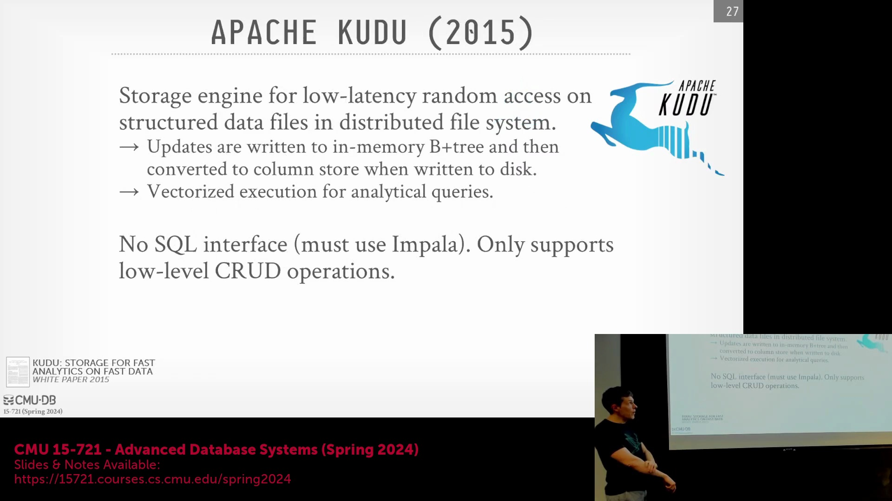

## 现代表格式：Apache Hudi 与 Iceberg
Kudu 所确立的“数据摄入与目录管理(Catalog Management)”范式，最终演化为当今主流的开源表格式(Table Format)，例如 Apache Hudi（2016 年诞生于 Uber）与 Apache Iceberg（2017 年由 Netflix 开源）。这两套系统均构建了结构化的数据摄入层：通过事务日志(Transaction Log)路由数据变更，利用后台合并压缩(Compaction)将其转化为对象存储(Object Storage)中高度优化的列式文件(Columnar Files)，并持续以最新的统计信息与文件布局(File Layout)同步更新元数据目录(Metastore Catalog)。查询引擎随后直接消费这些目录元数据(Catalog Metadata)，以生成并规划出高效的执行计划(Execution Plan)。这种计算与存储解耦的架构(Decoupled Architecture)已成为现代数据平台的基石。如今，Snowflake 与 Amazon Redshift 等云数据仓库(Cloud Data Warehouse)均已原生集成对 Iceberg 的支持，允许直接查询外部数据湖，从而彻底打破了早期要求所有数据必须沉淀于专有托管存储(Proprietary Managed Storage)中的生态壁垒。
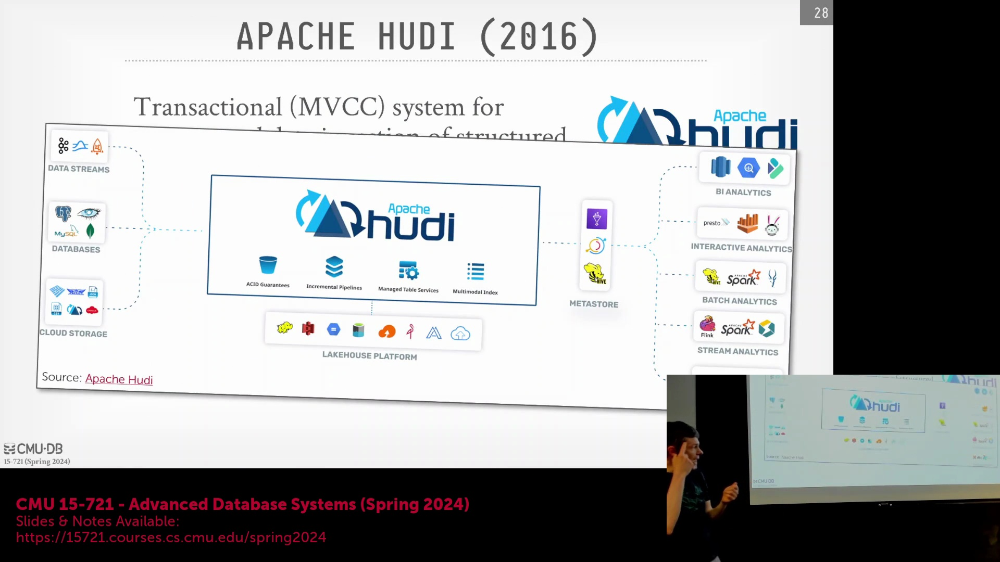

## 架构权衡：JVM 遗留与原生执行
Photon 引擎的研发历程，深刻揭示了在现代化遗留生态系统(Legacy Ecosystem)时所必须做出的务实工程权衡(Engineering Trade-offs)。Databricks 并未选择直接废弃已高度成熟、且支撑着海量创收级企业工作负载(Enterprise Workloads)的基于 JVM 的 Spark 运行时(JVM Runtime)，而是转而采用了一种细粒度的混合架构策略(Fine-grained Hybrid Architecture)。该策略通过谨慎注入原生 C++ 算子(Native C++ Operators)，并精细化管控 JVM 至原生代码(Native Code)的数据转换链路，在确保现有应用零侵入的前提下，实现了计算性能的极大化。然而，若以从零构建(Greenfield Development)全新架构的视角审视，JVM 平台已不再是底层执行引擎的最优解。尽管现代 JVM 配备了先进的垃圾回收器(Garbage Collector)以及适用于高频交易(High-Frequency Trading)等特定场景的专有运行时调优特性，但在超大规模分布式部署中，其固有的内存开销(Memory Overhead)与潜在的商业许可成本，促使 C++、Rust 或 Zig 等现代系统级语言(System-level Languages)成为新一代数据库引擎构建的首选基石。
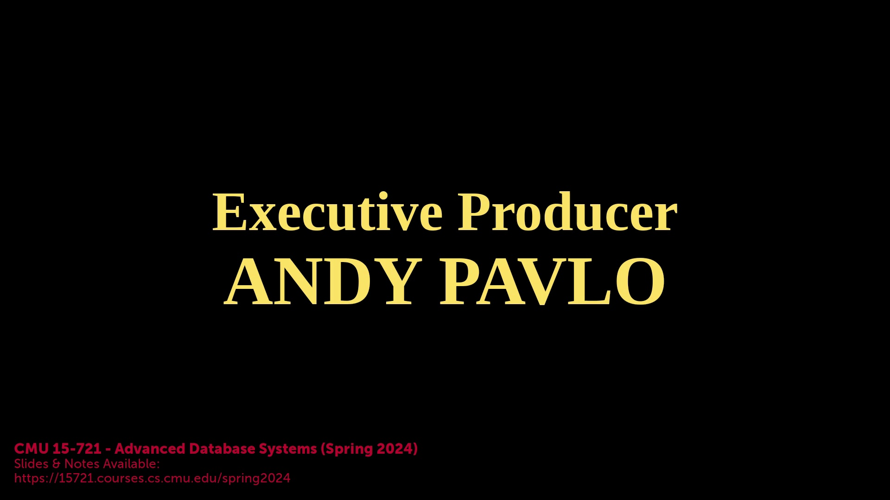

## 总结与课程预告
本次探讨的尾声，将 Spark 的架构演进轨迹与下一代云原生数据平台(Cloud-Native Data Platform)的发展脉络进行了有机衔接。在即将展开的 Snowflake 专题课程中，我们将深入剖析其高层架构设计(High-level Design)如何与 Vectorwise 和 X100 等经典历史系统产生技术共鸣，这也深刻映射出其核心团队深厚的学术底蕴与工程积淀。与此同时，Snowflake 针对全托管式(Fully Managed)、服务导向的云部署环境对这些核心理念进行了深度适配。通过将自研的专有存储管理(Proprietary Storage Management)与开放表格式标准(Open Table Format Standards)相融合，Snowflake 能够高效承载现代复杂的分析型与事务型混合工作负载(Hybrid Workloads)。