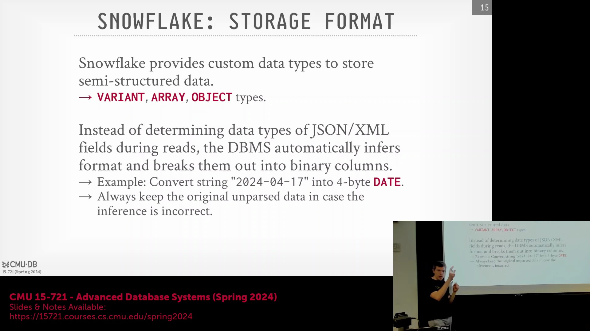
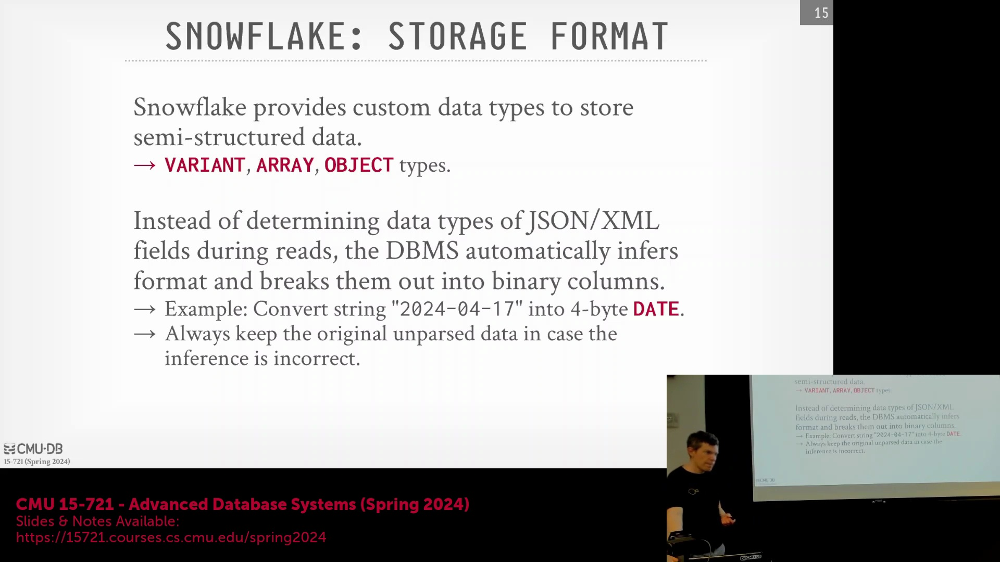
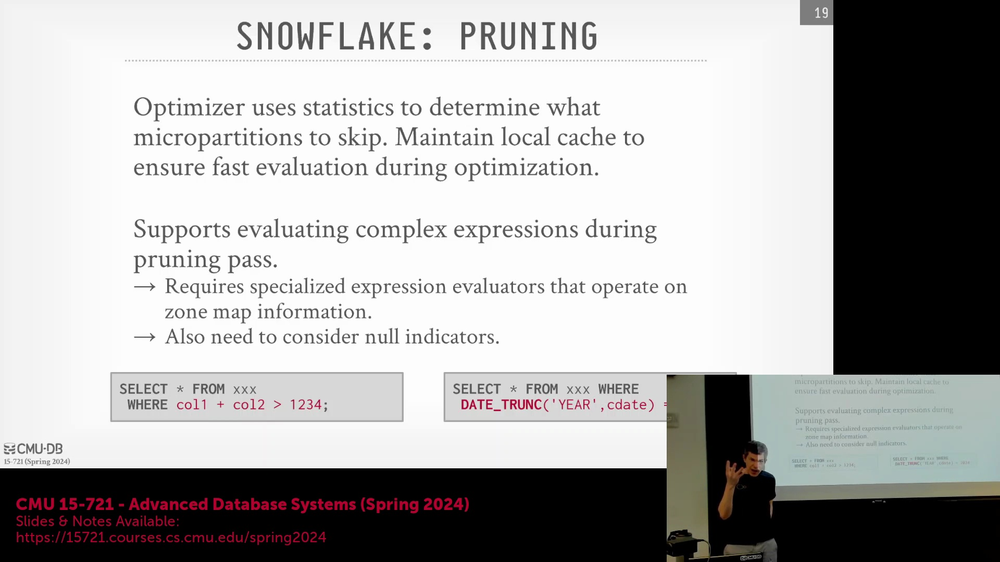
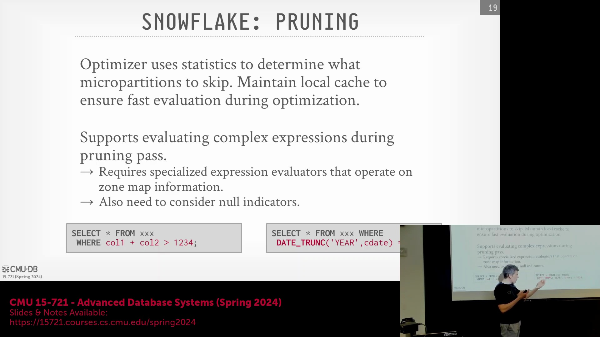

## 半结构化数据的加载时类型推断
将 JSON 等半结构化数据(Semi-structured Data)加载至 Snowflake 专有存储格式时，系统会在数据摄入阶段(Data Ingestion Phase)执行类型推断(Type Inference)，而非将其推迟至查询执行时。系统自动解析传入的字符串，识别底层数据类型模式(如日期或时间戳)，并将其转换为优化的二进制表示(Optimized Binary Representation)。为确保系统健壮性(Robustness)，平台会保留原始未解析字符串(Raw String)作为后备机制，以防因异常字符（如特殊表情符号或格式错误条目）导致初始类型检测(Type Detection)失败。这与 Dremel 等在查询运行时(Runtime)进行类型解析的架构形成鲜明对比。通过前置推断(Eager Inference)，Snowflake 消除了查询执行期间重复解析的开销，从而充分发挥列式压缩(Columnar Compression)、字典编码(Dictionary Encoding)与向量化执行(Vectorized Execution)的性能优势。尽管该机制在托管的内部表(Managed Internal Tables)上极为高效，但对于模式控制受限的外部表(External Tables)或开放格式数据湖(Open-format Data Lakes)，系统能够优雅降级(Gracefully Fallback)至运行时推断。

## 基于一致性哈希的微分区归属管理
为在动态多租户计算集群(Dynamic Multi-tenant Compute Cluster)中高效管理数据分布，Snowflake 依赖一致性哈希(Consistent Hashing)算法将微分区(Micro-partitions)精准映射至特定工作节点(Worker Nodes)。该算法将计算节点排列于逻辑环(Logical Ring)上。当计算资源弹性伸缩(Elastic Scaling)时，仅需重新分配相邻节点的数据，从而避免了代价高昂的全集群数据重排(Cluster-wide Reshuffle)。元数据目录(Metadata Catalog)利用此映射关系，将查询任务(Query Tasks)直接路由至“拥有”(Owns)目标微分区的节点。由于数据归属关系(Data Ownership)在较长周期内保持稳定，对应的工作节点得以维护持久化微分区的长期本地缓存(Persistent Local Cache)。该设计使得虚拟仓库(Virtual Warehouses)能够安全暂停与恢复，而不会破坏缓存局部性(Cache Locality)。系统因此得以以细粒度方式检索数据，并大幅削减了对 Amazon S3 的冗余往返请求(Redundant Round-trip Requests)。

## 启发式驱动优化与早期微分区剪枝
Snowflake 的查询优化器(Query Optimizer)（早期曾被称为“编译器”Compiler）采用统一的、基于 Cascade 架构的自上而下(Top-down)优化框架。鉴于云原生环境中统计数据(Statistics)可能迅速过期或失真，优化器有意降低了对直方图(Histograms)或数据草图(Sketches)等重量级统计对象的依赖。相反，系统主要依赖启发式规则(Heuristic Rules)与轻量级的区域映射(Zone Maps，记录各微分区每列的最小/最大值范围)，在查询执行前主动剪枝(Prune)无关数据块。其核心目标是在编译时(Compile Time)识别并剔除无法满足查询谓词(Query Predicates)的微分区。尽管基础元数据(Basic Metadata)主导初始剪枝决策，系统仍引入了运行时自适应机制(Runtime Adaptive Mechanisms)。当查询执行过程中发现初始统计假设并非最优时，该机制可动态调整执行策略(Execution Strategy)。

## 面向复杂谓词的统一表达式求值
查询优化面临的一项核心工程挑战，在于处理涉及算术运算(Arithmetic Operations)（如 `col1 + col2 > X`）或嵌套函数(Nested Functions)（如 `EXTRACT(YEAR FROM date) = 2024`）的复杂剪枝谓词(Complex Pruning Predicates)。若缺乏对底层语义(Underlying Semantics)的理解，系统无法直接将此类谓词与静态区域映射进行匹配求值(Evaluation)。为攻克此难题，Snowflake 统一了优化器与运行时执行引擎(Runtime Execution Engine)所共用的表达式求值代码库(Expression Evaluation Codebase)。该架构决策确保了优化阶段与执行阶段之间的逻辑运算及 NULL 值处理语义(Null-handling Semantics)高度一致，同时有效避免了代码冗余(Code Duplication)。即便无需扫描实际数据行，优化器也能安全推导(Reason)出表达式的潜在输出范围。在高级优化场景中，系统可能在编译阶段临时执行轻量级标量子查询(Lightweight Scalar Subqueries)，将解析出的常量(Constant Values)重新注入查询计划(Query Plan)，从而实现更为精准的早期数据剪枝(Early Data Pruning)。

