## 面向查询优化的统一表达式求值
历史上，传统系统中的查询优化器(Query Optimizer)缺乏在优化阶段内部评估复杂表达式的能力，通常被迫中断规划流程，转而在运行时执行引擎(Runtime Execution Engine)中直接执行标量子查询(Scalar Subquery)。为消除这种高昂的阶段切换开销，现代架构将优化器与执行器的表达式求值代码库(Expression Evaluation Codebase)进行了统一。通过将执行引擎逻辑进行封装，使其能够直接基于统计元数据(Statistical Metadata)而非底层实际数据运行，优化器得以在不触发冗余数据扫描的情况下，安全地进行谓词推理(Predicate Reasoning)、常量折叠(Constant Folding)并统一 NULL 值处理语义(NULL-handling Semantics)。这种深度集成确保了编译与执行阶段逻辑的高度一致，同时显著加速了查询规划(Query Planning)过程。
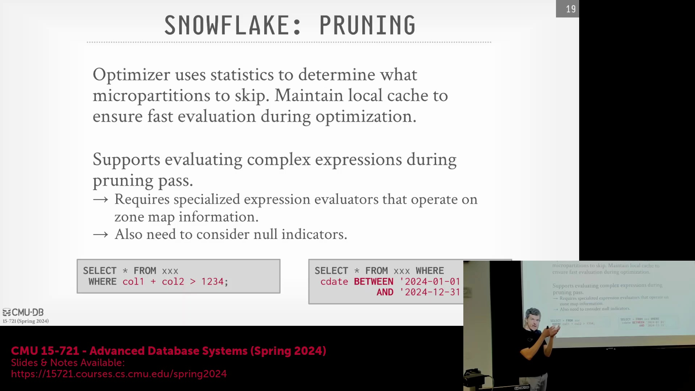

## 自适应聚合下推与运行时激活
一项关键的自适应优化(Adaptive Optimization)技术涉及动态将聚合算子(Aggregation Operator)下推至连接算子(Join Operator)下方，以大幅削减中间结果的数据量。查询优化器最初会基于轻量级成本估算(Lightweight Cost Estimation)，将默认处于禁用状态的聚合节点注入执行计划(Execution Plan)中。在查询执行期间，运行时触发器(Runtime Trigger)会持续监控实际的数据吞吐量与基数(Cardinality)；若中间数据量超出预测阈值，系统将自动激活该下推聚合逻辑。尽管此机制能显著提升低基数连接(Low-cardinality Joins)或 `MIN`/`MAX` 等简单聚合的性能，但其触发条件被刻意设计为保守策略——因为高基数(High Cardinality)或计算开销较大的分组键(Grouping Keys)可能导致过早聚合(Premature Aggregation)反而引发性能衰退。在无需依赖重量级统计草图(Statistical Sketches)的前提下，系统默认采用启发式规则(Heuristic Rules)（如星型模式假设 Star Schema Assumption）结合微分区剪枝元数据(Micro-partition Pruning Metadata)，以确定最优的连接顺序(Join Ordering)与执行路径。
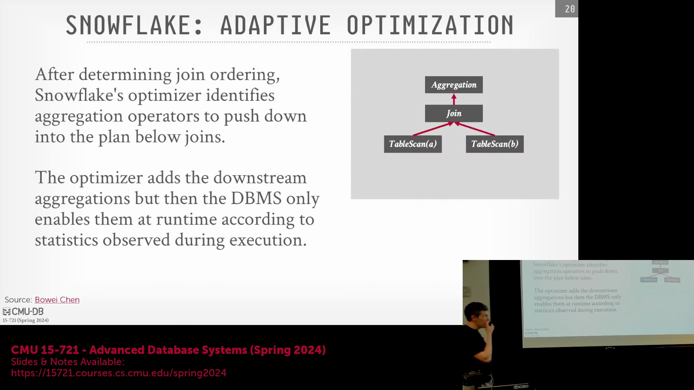
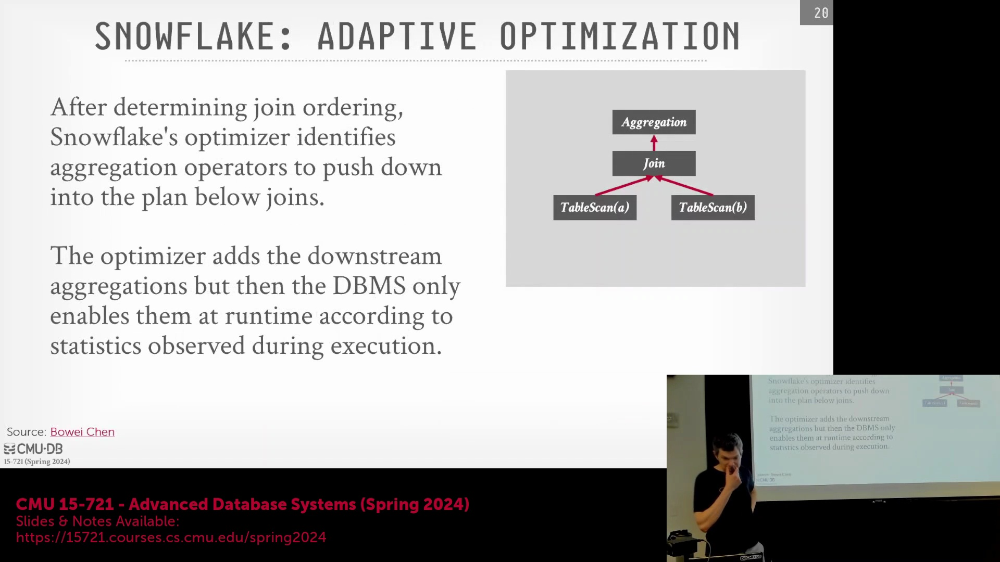

## TPC-DS 基准测试争议与数据准备
2021 年 11 月，Databricks 宣布其 Photon 引擎(Photon Engine)创下了一项经审计的全新 TPC-DS 基准测试(TPC-DS Benchmark)记录，随即引发了与 Snowflake 的公开技术论战。Snowflake 创始人指出该测试配置存在偏差且经济效率(Cost-effectiveness)低下，并声称若 Databricks 采用标准 Snowflake 服务层级(Service Tier)本可获得更优结果。Databricks 则反驳称，Snowflake 的对比数据依赖于以专有格式存储的内部预优化数据(Pre-optimized Data)，这些数据已历经深度的微分区聚类(Micro-partition Clustering)与压缩处理。Databricks 强调，基于原始 TPC-DS 数据集运行的独立学术基准测试得出了截然不同的性能指标。此外，严格的 TPC-DS 规范强制要求将全部数据准备(Data Preparation)与导入(Ingestion)耗时计入最终基准成绩，这引发了业界广泛质疑：Snowflake 的内部性能对比是否公允地计入了这一庞大的前期时间开销。
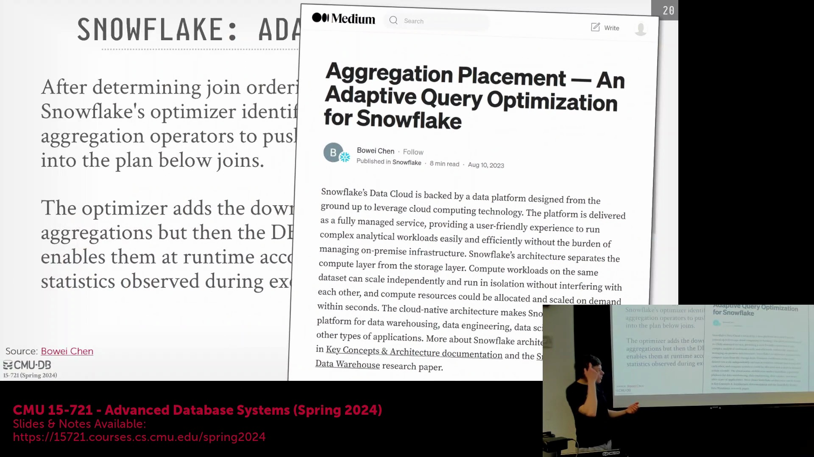
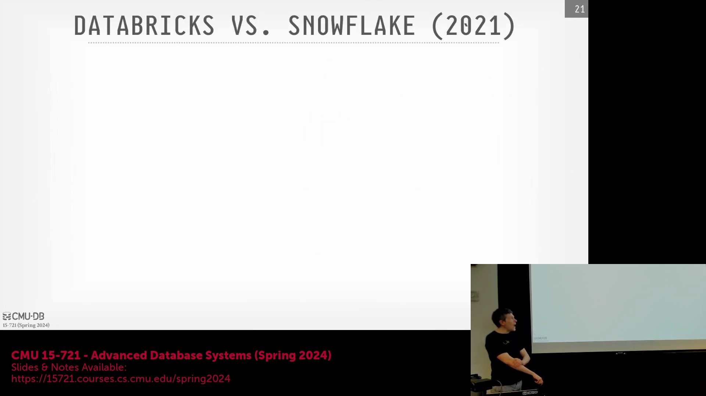
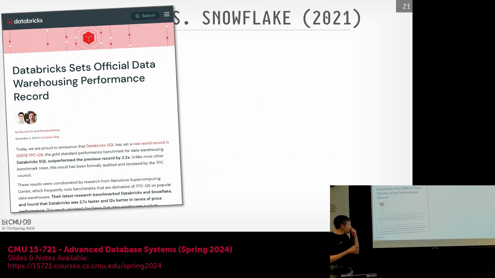
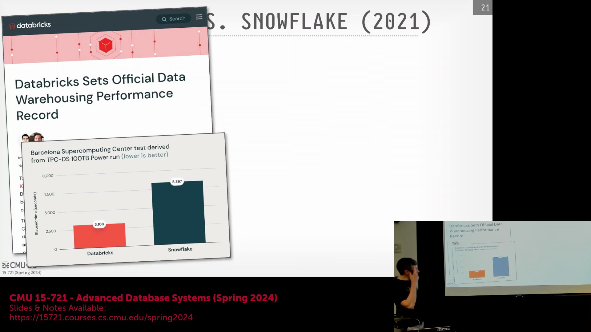
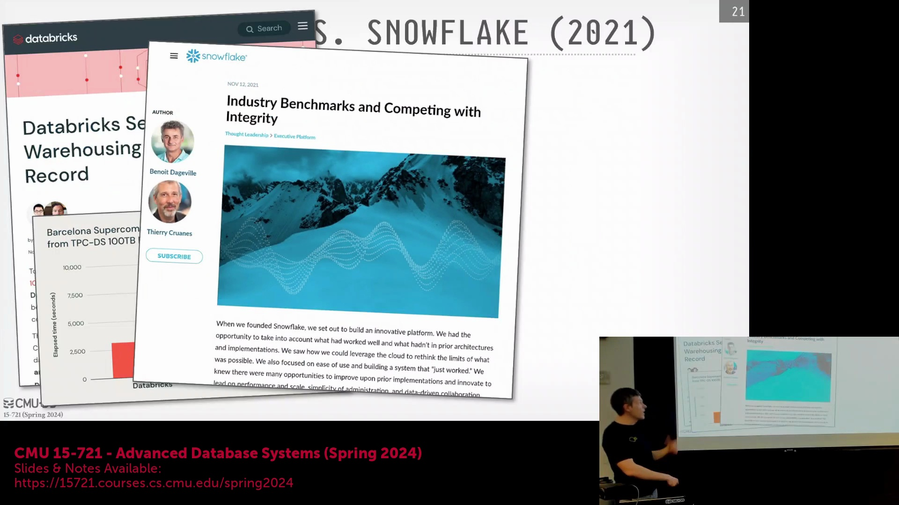

## 市场定位与竞争基准测试的现实
尽管技术层面的争论持续不断，但此次交锋最终演变为 Databricks 的一次重大战略胜利。它成功向市场证明，Photon 引擎已具备作为高性能、企业级数据仓库(Enterprise-grade Data Warehouse)运行的能力，直接撼动了 Snowflake 在云分析市场(Cloud Analytics Market)长期占据的主导地位。这场辩论深刻揭示了公平对比云原生数据库的固有难点，尤其是当各厂商高度依赖专有存储优化(Proprietary Storage Optimizations)、隐式预聚类流程(Implicit Pre-clustering Pipelines)或透明度存疑的数据准备阶段时。通过迫使业界重新审视基准测试方法论(Benchmarking Methodologies)与数据准备开销(Preparation Overheads)，此次技术交锋清晰地表明：围绕数据导入与存储格式的底层架构选型(Architectural Choices)，正从根本上重塑现代数据仓库对外呈现的性能基准与成本效益(Cost-efficiency)。
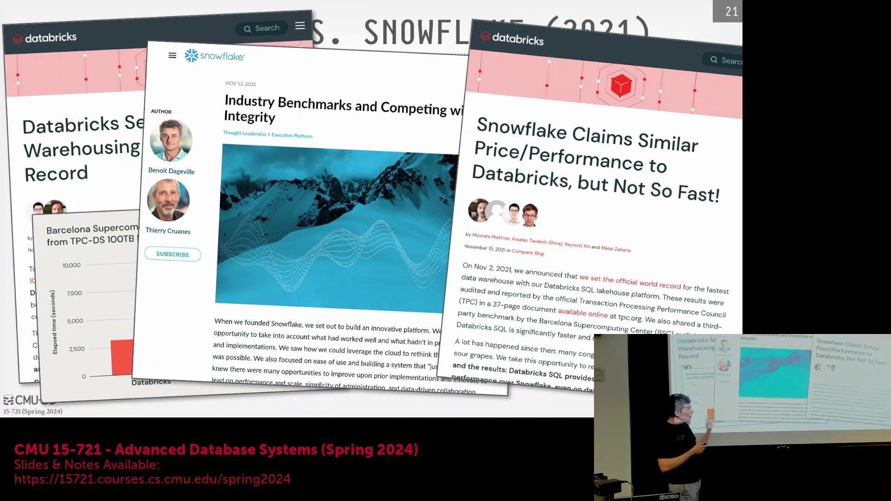
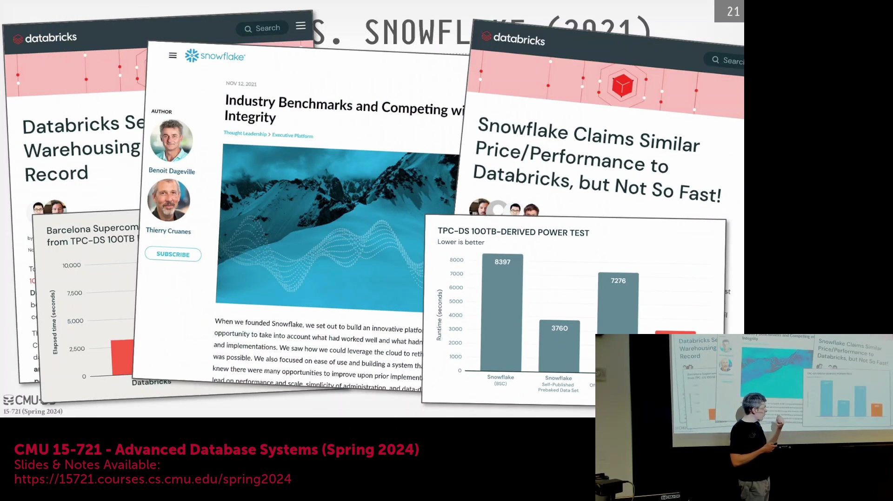
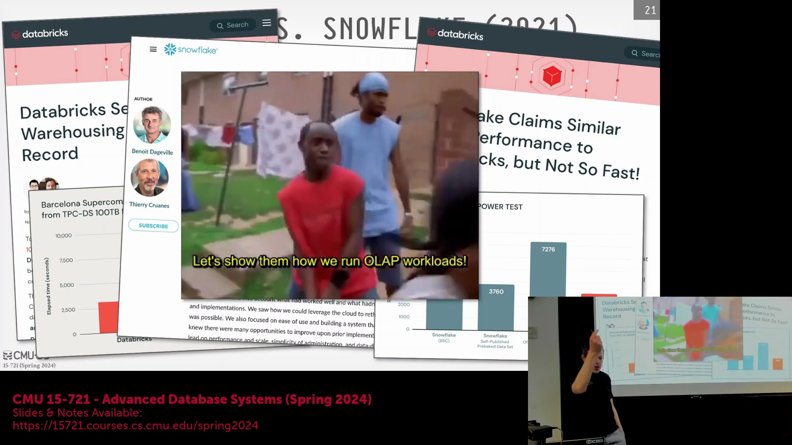
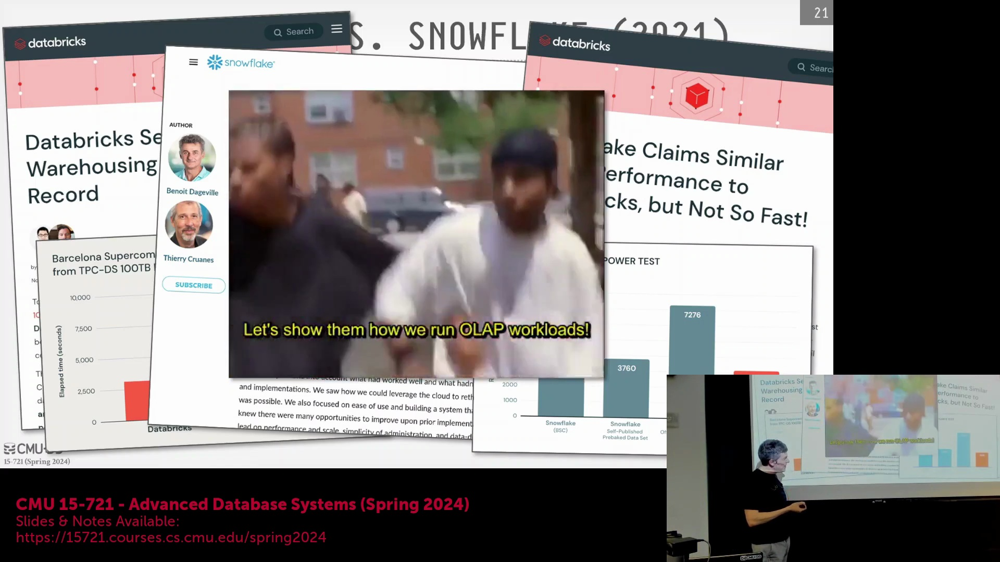
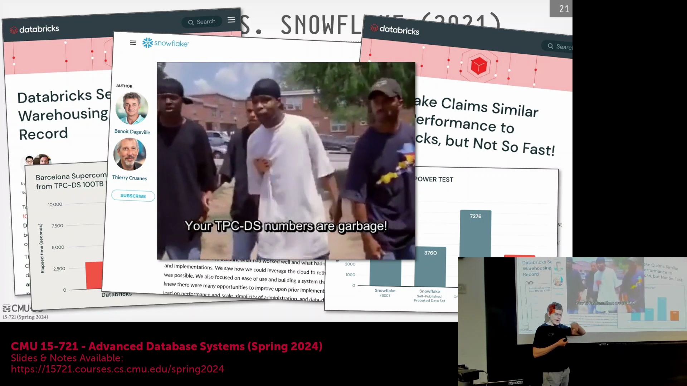

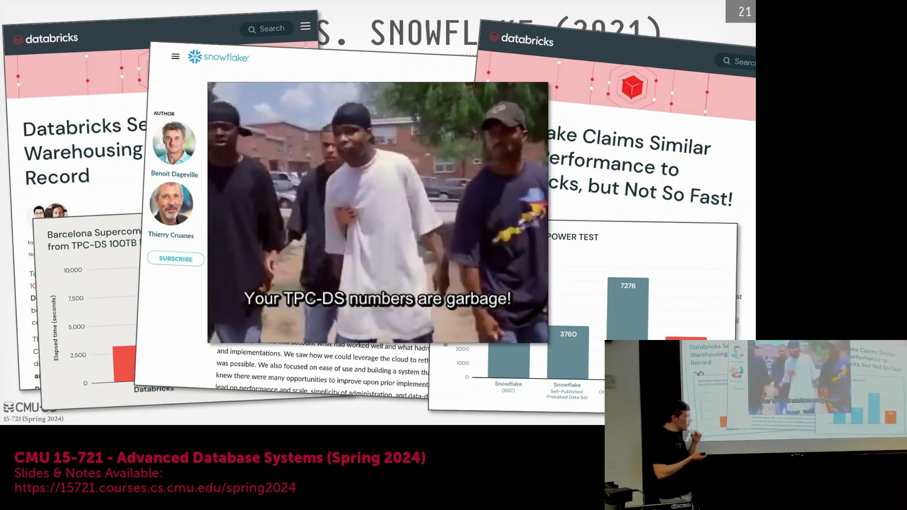
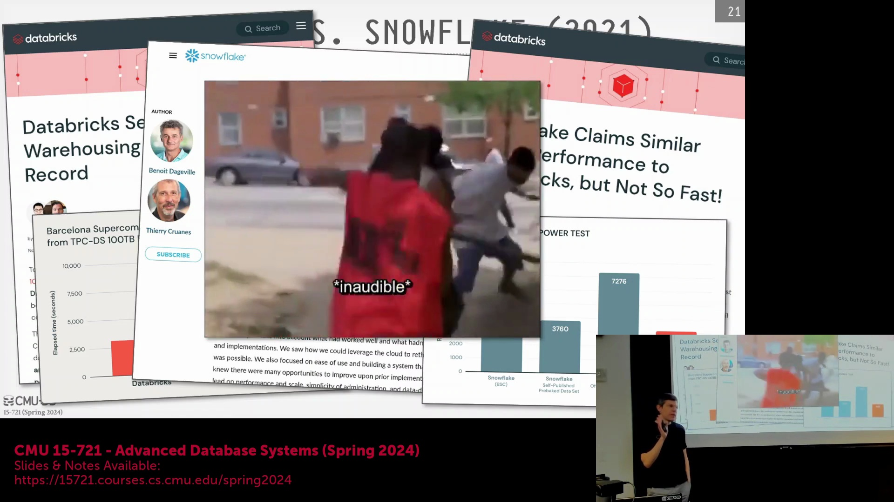