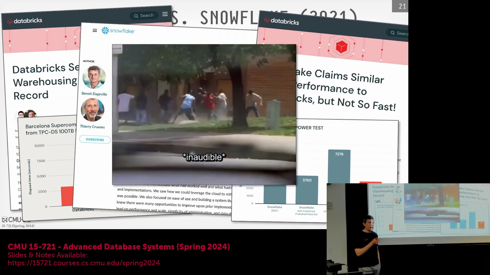
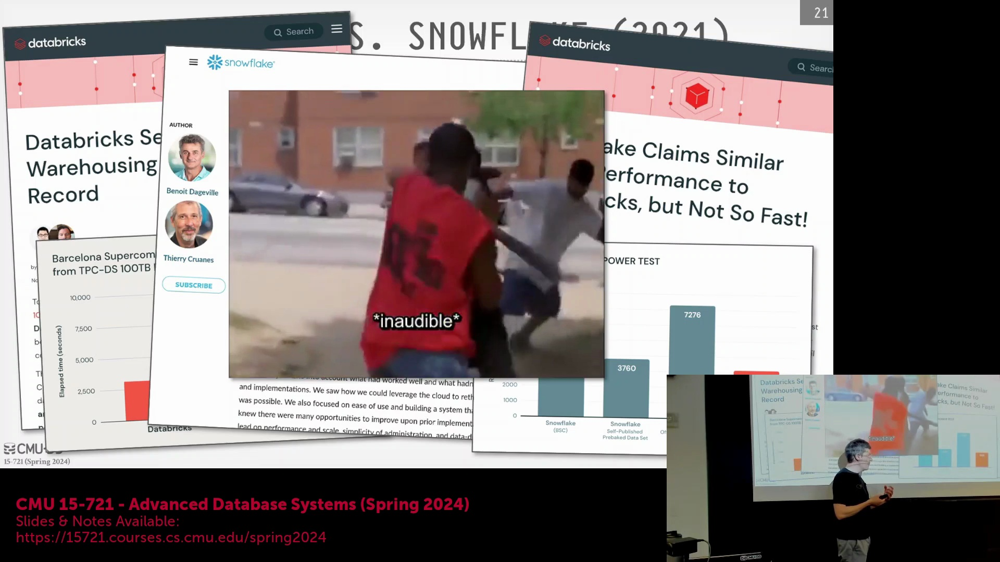
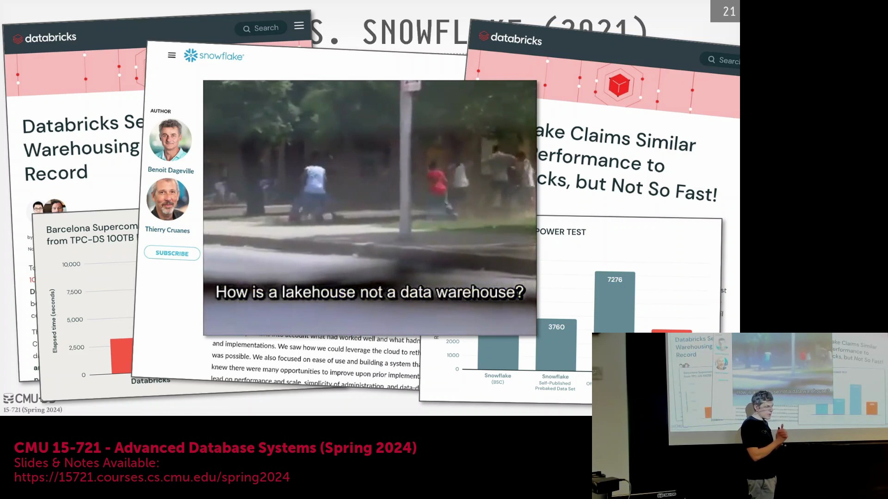
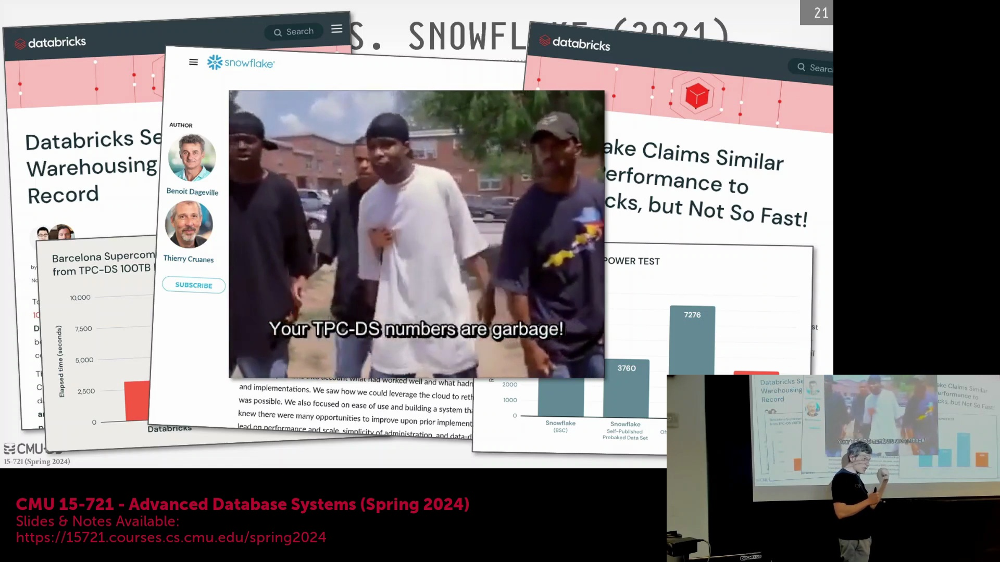
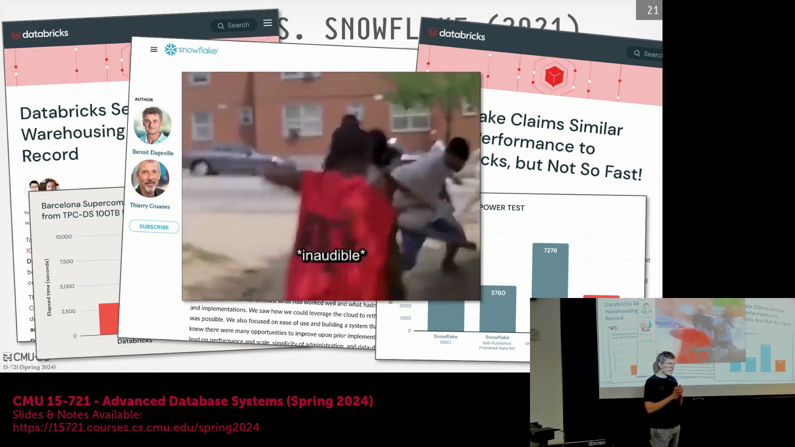
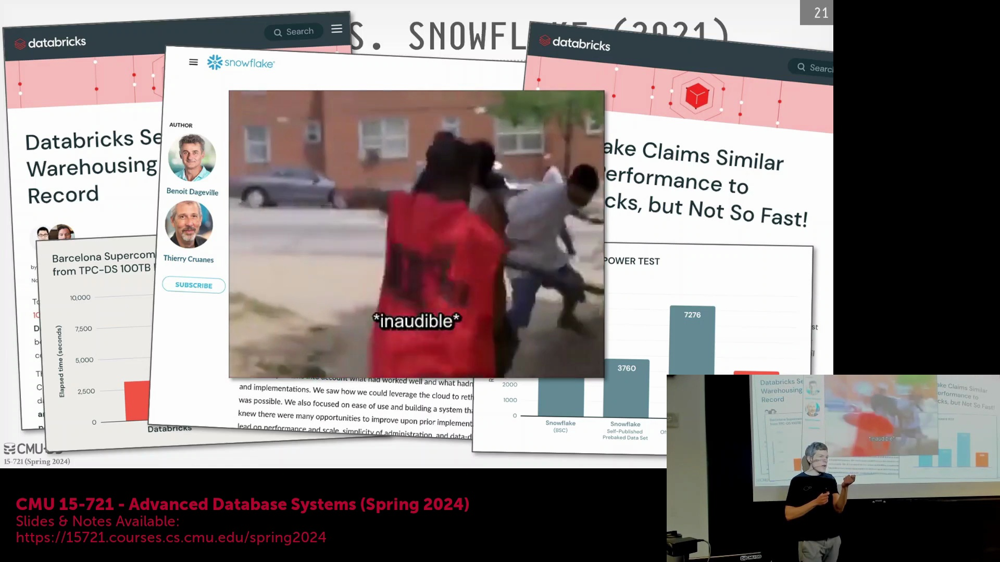
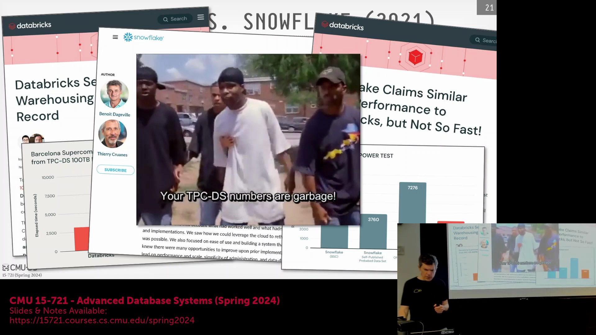

## 基准测试(Benchmark)比较的挑战
在评估时序数据库(Time Series Database)与分析型数据库(Analytical Database)时，业界历来对基准测试(Benchmark)的结果争论不休。一个反复被提及的问题是：为何在未经任何预处理的情况下，直接对比原始基准数据（如 TPC-DS）是远远不够的？核心症结在于，仅将原始 Parquet 文件直接载入并运行查询，完全忽视了生产环境中必需的数据清洗、建模与系统调优等现实环节。 

## 针对基准测试的专项优化技巧
多年来，数据库厂商针对 TPC 基准测试(TPC Benchmark)开发了高度定制化的优化策略。这些系统经过专门设计，可通过识别特定的模式特征（例如频繁访问 `new_orders` 或 `warehouse` 表）来探测当前是否处于基准测试执行环境中。一旦识别出测试环境，数据库引擎便可能自动切换至专用的查询计划(Query Plan)或内部配置，而这些配置在真实生产环境中面对不可预测的工作负载(Workload)时根本不会被触发。 

此类行为常被业界与大众汽车排放丑闻(Volkswagen Emissions Scandal)相提并论。正如涉事车辆被预先编程以检测尾气排放测试条件，并临时优化性能以蒙混过关一样，数据库系统同样能够识别基准测试环境，并激活高度调优的非标准执行路径(Execution Path)。尽管大众案例涉及的是实体环境污染，但数据库领域的这一类比深刻揭示了一个事实：基准测试得分如何通过针对性强且缺乏泛化能力的优化手段被人为抬高。

## 生产环境与基准测试优化：TPC-C 案例
以 TPC-C 基准测试为例，可以清晰地看到这种做法的具体体现。在测试执行期间，仓库(Warehouse)的数量始终保持静态不变。洞悉这一特性后，厂商可能会放弃为仓库表构建完整的动态 B+ 树索引(B+ Tree Index)，转而采用一种结构简单且高度优化的排序数组(Sorted Array)作为替代。这种替换大幅降低了数据查找开销(Lookup Overhead)，从而显著提升了基准测试的吞吐量(Throughput)。 

然而，在数据量持续动态增长的生产环境中，此类优化将完全失效。随着数据集规模的扩大，静态数组将演变为严重的性能瓶颈，而 B+ 树索引却能高效处理高频的动态插入操作。此类针对基准测试的“应试”技巧在业界已有充分记载，这也进一步印证了为何仅凭原始基准测试的对比，往往无法客观反映数据库系统的真实性能。

## Snowflake 的架构演进与混合表(Hybrid Table)
将视线转向现代云数据仓库(Cloud Data Warehouse)，Snowflake 相较于其初始设计已实现了显著的架构演进。该系统最初基于严格的专有存储格式(Proprietary Storage Format)发布，随后逐步扩展以全面拥抱数据湖(Data Lake)生态。这一演进始于 Snowpipe 服务，它支持以 Apache Arrow 格式流式传输数据，随后再将其转换并落盘至专有存储格式中。2021 年，Snowflake 推出了外部表(External Table)；至 2022 年，进一步增加了对 Apache Iceberg 的原生支持，使得 Parquet 文件能够携带额外的元数据(Metadata)，以支持模式演进(Schema Evolution)与轻量级更新(Lightweight Update)。 

为应对事务型工作负载(Transactional Workload)，Snowflake 于 2022 年推出了由 Unistore 引擎驱动的“混合表”(Hybrid Table)功能。该服务在 Snowflake 生态内作为一个具备完全容错能力的行存(Row-store)事务型数据库运行，可高效支撑标准 SQL 及类 TPC-C 风格的事务工作负载。新写入混合表的数据初始阶段会采用日志结构(Log-structured)的行格式进行存储。后台异步进程将持续对这些数据进行合并压缩(Compaction)，并将其转换为 Snowflake 专有的列式格式(Columnar Format)。在执行联机分析处理(OLAP)查询时，查询引擎会无缝融合实时行存数据与已优化的列存数据，向用户呈现统一的数据视图。该架构直接对标并回应了 Delta Lake 等竞品的挑战，使得用户能够直接在 Snowflake 基础设施上无缝运行事务型应用。

## FoundationDB 与 Snowflake 元数据目录(Metadata Catalog)
为在核心分析能力之外构建高可靠、强容错的事务层(Transaction Layer)，Snowflake 将其元数据目录底层构建于 FoundationDB 之上。FoundationDB 诞生于 2010 年代初的 NoSQL 浪潮中，率先开创了分布式事务型键值存储(Transactional Key-Value Store)的先河。Snowflake 早期引入该组件，旨在避免从零开始自研复杂的分布式目录(Distributed Catalog)系统。然而，随着苹果公司于 2015 年完成收购并将该项目转为闭源维护，情况发生了变化。依托早期合同中的特殊条款，Snowflake 确保了在收购交割时仍能完整获取源代码，并在随后的多年间持续维护其私有分支(Private Fork)。当苹果最终宣布将 FoundationDB 开源时，Snowflake 不得不投入大量工程资源，将其长期积累的私有补丁合并回上游主干仓库(Upstream Repository)。目前，苹果依然是该项目的主要开源贡献者，Snowflake 紧随其后位列第二。受限于相关法律条款，Snowflake 工程师无法直接向公共代码仓库(Public Repository)提交变更，必须经由苹果内部员工代为协调提交。 

FoundationDB 还因其开创性的确定性测试基础设施(Deterministic Testing Infrastructure)而闻名业界。该框架允许开发人员系统性地注入磁盘、网络及节点故障，从而通过数学证明严谨验证其容错能力(Fault Tolerance)。该技术的核心创始人随后凭借这一专长创立了 Antithesis 公司，致力于将面向分布式系统的确定性测试框架进行商业化落地。

## 事务抽象与 Snowflake 的市场地位
无论上层系统采用关系型(Relational)还是键值型(Key-Value)接口，其底层的事务机制(Transaction Mechanism)始终遵循相同的抽象：`begin`、`put`、`commit`。诸如 RocksDB、WiredTiger 以及 MySQL 的 InnoDB 等底层存储引擎(Storage Engine)，均以类似的方式对这些操作进行抽象。这充分印证了一个核心观点：上层数据模型(Data Model)的差异并不决定底层事务处理的可行性。 

总而言之，尽管 Snowflake 问世已超过 12 年，但它依然被公认为当前最先进的(State-of-the-art)云数据仓库系统。尽管部分架构决策（例如在早期遗留的专有存储层(Legacy Proprietary Storage Layer)之上进行改造以兼容外部表）仍隐约暴露出其初始设计的局限性，但其整体性能与可扩展性(Scalability)在市场上依然极具竞争力。随着核心向量化查询执行(Vectorized Query Execution)技术在 DuckDB 和 Apache DataFusion 等开源引擎中日益普及并趋于同质化，Snowflake 真正的竞争壁垒已不再局限于原始的数据扫描速度，而是转向其深度打磨的用户体验、Snowpark 开发者生态、运行时自适应优化(Runtime Adaptivity)以及高级查询优化器(Query Optimizer)。这也为后续深入探讨下一代湖仓一体(Lakehouse)原生架构奠定了坚实基础。