## 课程介绍与安排
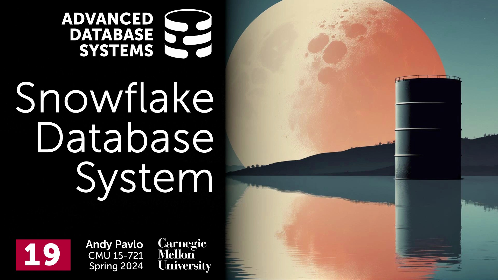
欢迎来到卡内基梅隆大学的高级数据库系统(Advanced Database Systems)课程。今天，我们将继续探索那些实现了本学期所探讨架构概念的现实世界数据系统(Real-world Data Systems)。在深入技术讲解之前，先同步几项课程事务通知，以便大家明确后续的时间安排。

## 期末项目与考试指南
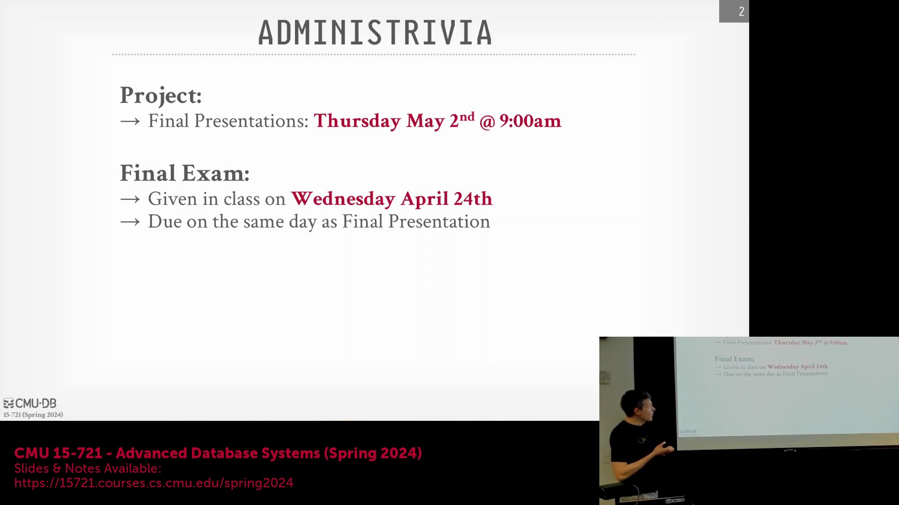
期末项目(Final Project)展示将在原定的期末考试时段进行。尽管官方时间表标注为上午 8:30，但实际活动将于上午 9:00 正式开始，现场将提供甜甜圈和贝果。纸质期末考试将于 4 月 24 日发放。本次考试将摒弃简单的选择题与纯记忆类考点，转而要求学生综合运用本学期所学概念，并将其应用于全新的数据系统场景。此举旨在考察学生能否深入理解各类架构理念如何融入更广泛的数据处理生态系统(Data Processing Ecosystem)中。考试允许使用 ChatGPT 等人工智能(AI)工具辅助作答，但务必仔细核验输出结果。强烈建议切勿盲目照搬 AI 生成的文本，因为考题中可能故意设置了虚构前提，且 AI 极易产生“幻觉”(Hallucination)。课程组将通过匿名追踪表格监控 AI 工具的使用情况，并与授课教师的预判数据进行比对。

## 回顾：Databricks 与向量化执行
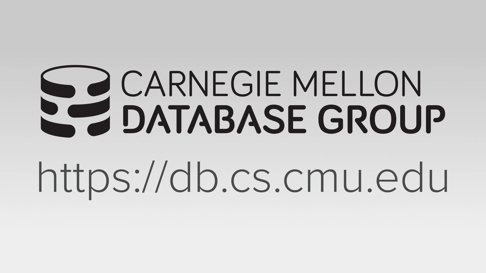
在上一讲中，我们探讨了 Databricks(Databricks) 的 Photon 引擎(Photon Engine)。Photon 并非独立的数据库系统，而是集成于 Apache Spark(Apache Spark) 中的扩展组件。它作为一个高度优化、高度向量化(Vectorized)的 C++ 引擎运行，并通过 Java 原生接口(Java Native Interface, JNI)由 Spark SQL 的 Java 运行时环境进行调用。通过将计算密集型(Compute-intensive)的查询操作从 Java 虚拟机(Java Virtual Machine, JVM)卸载至原生 C++ 代码，Photon 为分析型工作负载(Analytical Workloads)带来了显著的性能飞跃。

## 现代云数据仓库简介
今天，我们的讨论将从组件级扩展过渡至完整且具备生产级(Production-grade)能力的云数据仓库(Cloud Data Warehouse)，重点聚焦于 Snowflake 与 Amazon Redshift(Amazon Redshift)。这些系统均为成熟的独立架构，其设计原则与 Google Dremel(Google Dremel) 和 Yellowbrick 等系统存在诸多共通之处。为准确理解它们的架构背景，我们首先需回顾此类系统问世前的数据库发展脉络。

## OLAP 系统的历史格局
20 世纪 00 年代，专业的在线分析处理(Online Analytical Processing, OLAP)系统开始崭露头角，其核心主要围绕列式存储架构(Columnar Storage Architecture)与数据压缩技术构建。随后，Vectorwise 率先基于此类存储引擎开创了向量化执行(Vectorized Execution)技术。该领域的代表性厂商包括 Vertica、Greenplum、MonetDB、Vectorwise 与 ParAccel。除 MonetDB 和 Vectorwise 外，这些平台大多基于 PostgreSQL 衍生而来；工程师们剥离了传统的行式存储引擎并进行重构，从而专门针对分析型查询模式进行优化。与此同时，Apache Hadoop 与早期数据湖(Data Lake)范式逐渐兴起，Hive、Presto、Impala 及 Stinger 等系统开始为分布式文件系统提供结构化查询语言(SQL)接口。在此阶段，行业标准部署模式严格依赖于本地部署(On-Premise Deployment)：供应商销售软件许可证(Software Licenses)，客户则需自行提供硬件并运维本地基础设施。

## 向云原生架构的转型
数据库行业在 2011 至 2013 年左右开始向云原生架构(Cloud-Native Architecture)转型。Google 于 2011 年发表的 Dremel 论文证实，分析引擎可直接对存储于云对象存储(Cloud Object Storage)中的文件进行查询，从而有效实现了计算与存储的解耦(Compute-Storage Decoupling)。Facebook 于 2012 年启动了 Presto 项目的研发。与此同时，Amazon Web Services (AWS) 于 2011 年获得了 ParAccel 的源代码授权，并在 2013 年正式推出 Amazon Redshift，略微早于 Snowflake 面世。ParAccel 随后陷入财务困境并被拆分收购，其原始技术栈基本停滞，最终沦为“僵尸数据库”(Zombie Database)。

## Snowflake 的创立
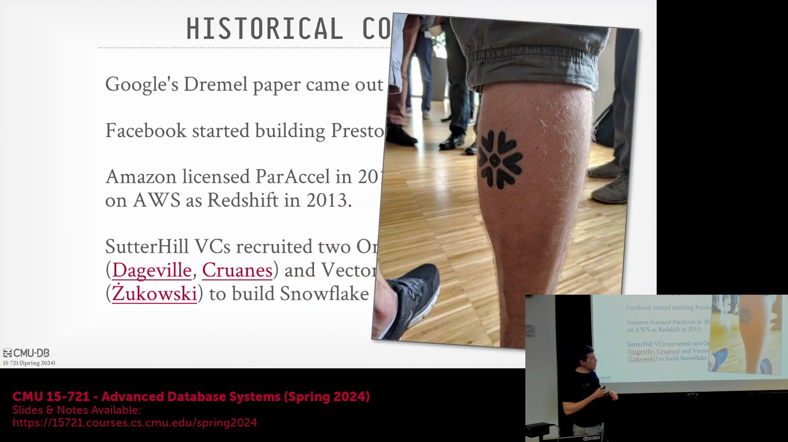
在此次技术转型期，硅谷风险投资机构 Sutter Hill Ventures 决定从零开始投资一家全新的云原生数据库初创企业。该公司采用了一种独特的“精英集结式创业模式”(Curated Startup Model，常被戏称为“组建全明星团队”)，成功招募了多位资深前 Oracle 工程师，以及 Vectorwise 的核心开发者 Marcin Zukowski。在充裕的资金支持与风投机构的战略指导下，该团队全面负责 Snowflake 的架构设计与研发工作。该系统随后在商业市场上取得了巨大成功。创始团队对数据库底层工程(Database Engineering)的极致专注令人瞩目；例如，Marcin 曾将 Snowflake 的标志纹在腿部以纪念公司首次公开募股(Initial Public Offering, IPO)，这一轶事在业内广为流传。

## Snowflake 的架构与云优先理念
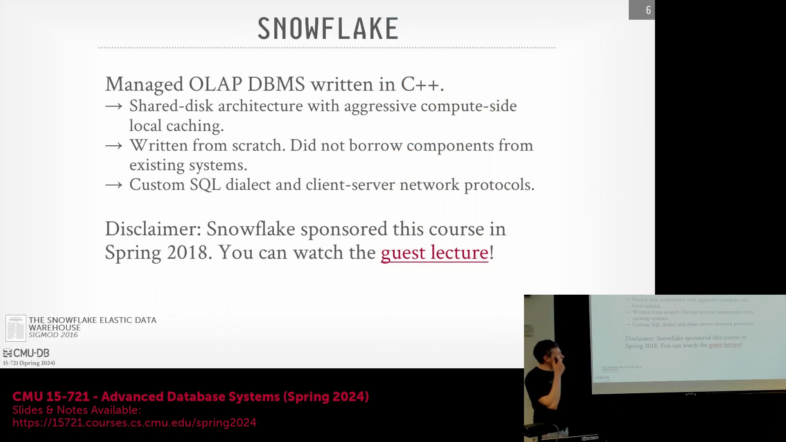
Snowflake 是一款完全托管(Fully-managed)、纯云原生的在线分析处理(OLAP)数据库系统，其底层代码完全采用 C++ 从零编写。在本地部署仍被视为行业标准的时代，工程团队曾面临客户要求提供本地可下载版本的巨大压力。但团队坚决拒绝了这一要求，全面押注于云服务的普及趋势——随着整个行业向云端大规模迁移，这一“云优先”(Cloud-First)决策被证明极具前瞻性。与早期系统不同，Snowflake 采用了多集群共享数据架构(Multi-Cluster, Shared-Data Architecture)，并通过在计算节点上实施激进的计算侧缓存(Aggressive Compute-Side Caching)策略，成功与 Dremel 和 Spark SQL 形成差异化竞争。通过自主研发每一个核心组件，该团队在分布式云环境中实现了对查询执行引擎(Query Execution Engine)、存储层集成(Storage Integration)以及性能调优(Performance Tuning)的完全掌控。

---

## 工作节点缓存策略
由于 Snowflake 本身并非底层云服务提供商（Cloud Provider），直接从 S3 等对象存储（Object Storage）中检索数据会产生实际的经济成本，并带来显著的访问延迟。为缓解这一问题，系统在工作节点（Worker Nodes）上积极实施了缓存策略。通过最大化本地缓存并充分利用已付费的计算资源，Snowflake 有效避免了对外部存储发起不必要且缓慢的查询。

## 自定义 SQL 方言与企业级传承
与许多现代数据库系统以 PostgreSQL 方言（PostgreSQL Dialect）或解析语法文件（Parser Grammar Files）为起点不同，Snowflake 的工程团队完全从零开始构建其 SQL 支持。由此衍生的语法规范与技术文档带有鲜明的企业级（Enterprise-Grade）风格，这深刻反映了其创始团队的技术背景，以及他们在 Oracle（甲骨文）工作期间积累的深厚经验。

## 课程准备与信息来源
在 Snowflake 首次公开募股（Initial Public Offering, IPO）之前，该公司曾赞助过这门数据库系统课程，如今该校许多校友均在 Snowflake 任职。鉴于 Snowflake 的闭源（Closed-Source）特性，为确保本讲座内容的准确性，讲师查阅了大量官方文档、学术论文及技术博客。此外，讲师曾在某个周日晚上做饭时与 Snowflake 的首席技术官（Chief Technology Officer, CTO）通话，直接沟通并澄清了相关架构细节与内部设计决策，以此作为公开资料的有效补充。
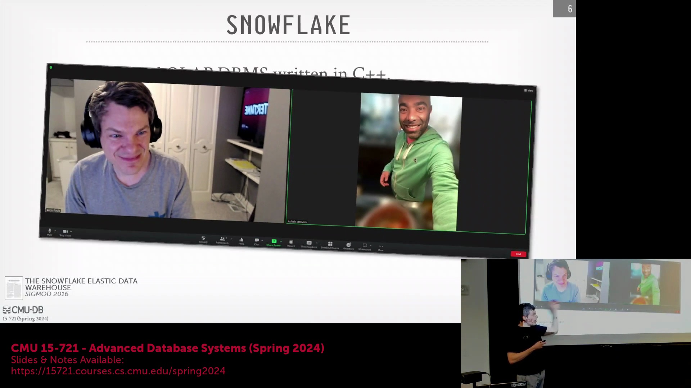

## 核心架构特性与执行引擎
Snowflake 的架构深度融合了多项先进的数据库理念。在借鉴 Dremel 和 Hadoop 分布式文件系统（Hadoop Distributed File System, HDFS）基础思想的同时，它率先实现了存储与计算分离（Storage-Compute Disaggregation）的商业化落地。其执行引擎采用基于推送的向量化查询处理（Push-based Vectorized Query Processing），并依赖预编译算子（Precompiled Operators），设计灵感源自 Vectorwise 等系统。节点间通信摒弃了复杂的编解码逻辑，转而采用一种轻量级且早于 2014 年设计的序列化层（Serialization Layer，概念类似于早期 Apache Arrow 或 Protocol Buffers），专门用于在工作节点间高效传输二进制数据。系统将表数据与元数据（Metadata）彻底解耦，以便实施针对性优化。它摒弃了传统的显式缓冲池（Buffer Pool），转而采用简单的最近最少使用（LRU）旁路缓存（Cache-Aside）机制。早期版本曾使用专有存储格式（Proprietary Storage Format），如今已全面支持 Parquet 等开放格式。查询执行主要依赖哈希连接（Hash Join），并由引入自适应执行（Adaptive Execution）技术的 Cascades 风格优化器（Cascades-style Optimizer）进行全局统筹调度。

## 存储分离战略与工程重心
Snowflake 的顶层架构从根本上建立在基于云对象存储（Cloud Object Storage）的存储计算分离设计之上。在初始设计阶段，团队面临一项关键抉择：是自建定制化存储层，还是将存储工作完全卸载（Offload）至 Amazon S3。他们最终选择了后者，主动让渡了对底层存储的直接控制权，转而依托亚马逊来处理数据复制、数据持久性（Data Durability）及底层基础设施管理。这一战略转向使工程团队得以将早期有限的研发资源，集中投入到查询执行引擎的优化与高效工作节点缓存机制的实现上。
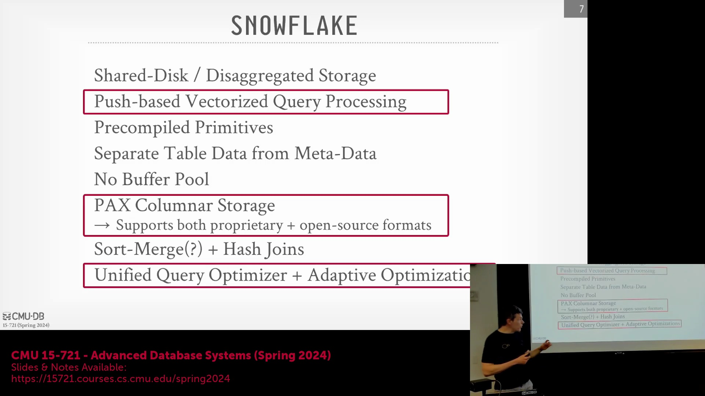

## 云厂商竞争与商业动态
业界常有一种担忧：鉴于亚马逊自身运营着 Amazon Redshift 等竞品，将工作负载运行在 Amazon Web Services (AWS) 上是否会引发利益冲突。然而，若 AWS 故意降低 S3 的性能以打压 Snowflake 这类重要客户，将对其公众声誉造成灾难性打击，并会立即劝退其他企业级客户。从商业逻辑来看，短期的反竞争收益绝不足以弥补对长期云生态破坏的代价。相反，AWS 采取垂直整合（Vertical Integration）策略参与竞争：其为 Redshift 和 Amazon Aurora 等服务引入了专用硬件加速器，并在 Amazon Elastic Block Store (EBS) 与 S3 之上构建了深度集成层，从而提供独立数据库厂商难以复制的事务处理与数据复制优化能力。

## 多云支持与向开放格式的演进
除 Amazon S3 外，Snowflake 现已扩展支持 Microsoft Azure Blob Storage 与 Google Cloud Storage (GCS)。客户在初始入驻（Onboarding）时，会根据企业内部政策、现有云合同或战略偏好（例如完全规避亚马逊生态）来选择首选的云提供商。起初，Snowflake 仅将数据摄取（Data Ingestion）后以自有专有格式存储于对象存储桶（Object Storage Buckets）中。然而，随着 Apache Parquet 和 Apache Iceberg 等开源工具的成熟，湖仓一体（Data Lakehouse）架构生态日益完善，市场需求也随之演变。用户亟需能够直接查询由异构系统生成的数据，而无需再经由 Snowflake 的专用管道进行数据摄取。为顺应这一趋势，Snowflake 引入了对外部表（External Tables）的原生支持，使其能够直接从对象存储中读取符合开放标准的文件。

## 基础设施经济学与不自建数据中心的决策
鉴于其庞大的业务规模，一个自然而然的问题是：Snowflake 为何不自建一套与 S3 等效的底层基础设施？答案归结于极其现实的经济账与工程挑战。构建并维护一个全球分布式、超大规模的数据中心网络所需的巨额资金与复杂运营能力，远超即使是 Snowflake 这样体量庞大的公司。多项粗略估算均一致表明，直接复用超大规模云服务商（Hyperscaler）的基础设施具有显著更高的成本效益（Cost-Effectiveness）。尽管 Netflix 等企业最终全面转向公有云以规避本地数据中心（On-Premises Data Centers）的运维开销，但若要在存储容量与全球网络覆盖规模上与 AWS 正面抗衡，所需的体量使得独立基础设施建设对一家专注的数据仓库（Data Warehouse）提供商而言，无论在财务模型还是战略布局上均不具备可行性。

---

## 架构理念与节点间通信
讨论首先探讨了亚马逊等云提供商如何利用规模经济(Economies of Scale)快速构建基础设施，并将其与传统硬件的局限性进行对比。该架构的一项核心设计决策围绕着虚拟仓库(Virtual Warehouse)如何处理数据分布展开。该系统并未采用复杂的内存共享(Shared Memory)架构或硬件加速器(Hardware Accelerators)，而是依赖于标准的云实例(Cloud Instances)。这引出了一个关键的架构问题：为何允许工作节点(Worker Nodes)直接通信，而非将所有数据路由至集中的数据洗牌(Shuffle)阶段？这一选择体现了明确的设计倾向，即优先采用节点间直接数据传输，而非依赖僵化的抽象层。

## 权衡：抽象层与直接数据推送
引入传统的中间暂存阶段(Shovel Phase)或抽象层虽具备一定优势，主要体现在增强容错能力(Fault Tolerance)以及为中间数据写入提供清晰接口，但会引入显著开销：需运行完全独立的额外节点服务，且本质上会产生数据的冗余副本。通过允许工作节点间直接推送(Push)数据，系统规避了上述额外的基础设施成本与数据冗余。综上所述，两种方案各有利弊，这也印证了分布式系统设计中“没有免费午餐”的定律。

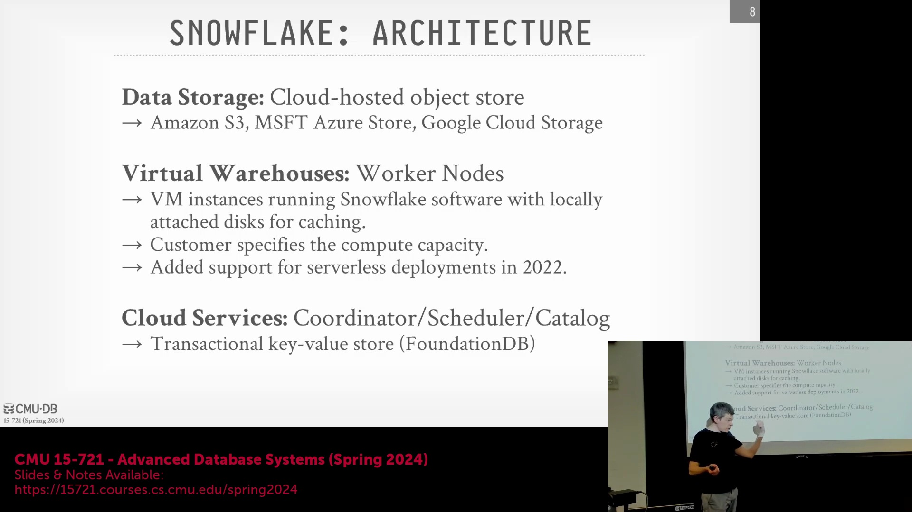

## 市场动态：云数据库与本地部署数据库的采用情况
尽管向云原生(Cloud-Native)解决方案的转型极为迅速，但本地部署(On-Premises)数据库依然占据庞大的市场份额，尤其受到需要混合架构或完全本地化部署的企业青睐。然而，两者的商业模式截然不同：Snowflake 等云平台采用无缝衔接、基于信用卡订阅的自助式商业模式，极为契合初创企业；而本地或企业级销售则往往涉及漫长的销售周期、线下会议以及传统的客户关系维护。尽管在纯硬件成本上，本地运行工作负载(Workloads)可能显得更低，但总体拥有成本(Total Cost of Ownership, TCO)必须将运维这些系统所需的人力成本纳入考量。因此，相较于本地部署，云平台的采用率增长曲线仍持续呈指数级攀升。

## 虚拟仓库、无服务器部署与云服务层
Snowflake 的架构将计算能力抽象为虚拟仓库概念，为用户提供统一的查询提交端点，从而免除了管理底层节点的工作。传统模式下，虚拟仓库一旦启动，无论是否存在查询活动都会持续计费。为解决此痛点，Snowflake 于 2022 年推出了无服务器计算(Serverless Compute)模式，可在空闲时段自动挂起仓库。这种便利性需以额外成本为代价，因其底层依赖于云服务层(Cloud Services Layer)的共享基础设施。该层作为系统的前端控制平面，集成了协调器(Coordinator)、调度器(Scheduler)、查询优化器(Query Optimizer)以及核心的数据目录(Data Catalog)组件。值得注意的是，该目录构建于 FoundationDB 之上，从而为元数据更新提供了强一致的事务语义(Transaction Semantics)支持。

## 计算层架构：工作节点与本地缓存
在计算层(Compute Layer)，系统早期依赖独立的 Amazon EC2 实例(EC2 Instances)作为工作节点，而现代版本已广泛采用 Kubernetes 等容器编排(Container Orchestration)技术。每个工作节点均配备本地直连 SSD 存储(Local SSD Storage)，而非网络附加的 EBS 卷(EBS Volumes)，以维持高性能的本地缓存。该缓存不仅存储中间查询结果，还缓存从 Amazon S3 检索的持久化文件，使后续查询能够直接本地访问热数据，从而避免频繁往返对象存储(Object Storage)所产生的高昂网络开销。为高效管理数据分布并实现无缝扩展，同时避免代价高昂的数据重排，系统采用一致性哈希(Consistent Hashing)算法来精准追踪各工作节点所负责的缓存数据段。在节点内部，系统会为每个查询分配专属的工作进程(Worker Process)以执行计算、写入中间结果，并在任务完成后优雅退出(Gracefully Terminate)。

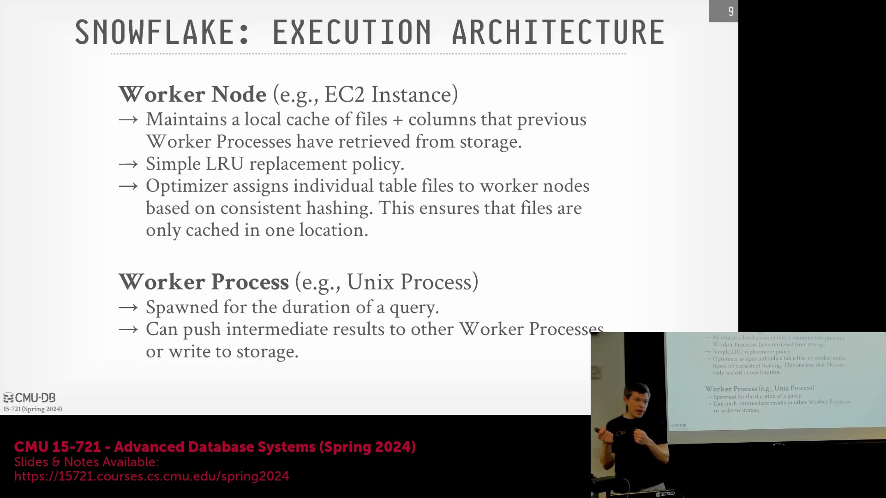

## 查询执行模型与向量化处理
在执行查询时，系统采用基于推送的向量化执行模型(Push-based Vectorized Execution Model)。该模型大量利用针对特定数据类型优化的预编译、模板化 C++ 原语(C++ Primitives)，且仅在节点间序列化与反序列化(Serialization & Deserialization)阶段严格应用代码生成(Code Generation)技术。架构设计上，该方案刻意避免了在查询各算子间设置显式的数据洗牌(Shuffle)阶段。相反，工作进程可将数据直接推送至下游节点继续处理，或在需进一步流水线(Pipeline)操作时将其暂存于本地。这种精简的执行路径最大程度降低了查询延迟，并显著减少了协调开销。

## 容错策略与查询重启机制
该架构的一项显著设计权衡(Trade-off)体现在其容错策略上。由于中间结果仅驻留于工作节点的内存与本地存储中，且缺乏外部副本，一旦工作节点崩溃，该查询的所有进行中的计算将全部丢失。与 Apache Spark 或 Dremel 等实现细粒度任务重试(Fine-grained Task Retry)机制的系统不同，Snowflake 采用了一种更简洁务实的策略：若工作节点发生故障，则直接终止整个查询并从头重新执行。这一决策有意规避了部分重试所带来的工程复杂性，而查询重启的成本则由客户承担。在实际生产环境中，查询失败的情况相对罕见。当故障确实发生时，系统会自动诊断其根源属于内部软件缺陷还是瞬态网络问题(Transient Network Issues)。必要时，系统会回滚至先前的软件版本重新执行查询，并严格保障并发数据导入(Concurrent Data Ingestion)期间的数据一致性。

---

## 现代 OLAP 中的查询性能与故障概率
讨论首先将现代云数据仓库(Cloud Data Warehouse)与 Hadoop/MapReduce 等传统分布式系统(Distributed Systems)进行了对比。在早期架构中，查询往往在数千台廉价的“披萨盒”(Pizza-box)服务器上运行数小时，这使得硬件或网络故障在统计学上几乎不可避免。然而，当代系统借助高度优化的查询规划器(Query Planner)、流水线执行(Pipeline Execution)以及显著缩减的节点数量，即可高效处理海量数据集。由于现代查询执行速度极快，且运行于规模更小、可靠性更高的集群之上，执行期间节点发生故障的概率极低，从而大幅降低了对局部任务重试(Local Task Retry)等复杂、重量级容错机制(Fault Tolerance Mechanism)的依赖。

## 去中心化工作窃取机制
为在不依赖中央协调器(Central Coordinator)的前提下应对工作负载倾斜(Workload Skew)，该系统实现了一种去中心化(Decentralized)的工作窃取(Work-Stealing)模型。空闲的工作进程(Worker Process)无需被动等待调度器(Scheduler)重新分配任务，而是主动搜寻额外工作。当某个工作进程处理完当前查询阶段(Query Stage)分配的文件后，它会探查执行相同阶段的对等(Peer)节点，以识别进度落后的节点。为避免给落后节点增加额外负担，“窃取者”(Stealer)进程不会从对等节点的本地缓存中拉取(Pull)数据，而是直接指向 Amazon S3 获取所需数据。该策略确保慢节点不会因额外的网络 I/O(Network I/O)而过载，同时有效维持了集群的负载均衡(Load Balancing)。

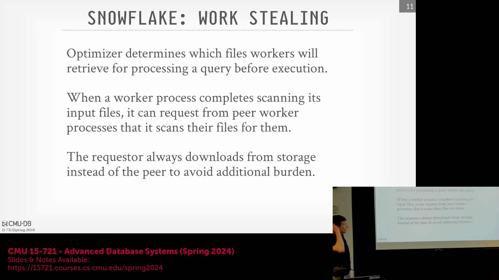

## 弹性计算与跨租户资源利用
Snowflake 引入了一项名为“弹性计算”(Flexible Compute)的功能，旨在解决固定规模虚拟仓库(Virtual Warehouse)中资源配置不足的问题。当查询优化器(Query Optimizer)识别出特定查询阶段将成为性能瓶颈时，系统可动态将该执行计划(Execution Plan)片段转移至其他租户(Tenant)的空闲计算节点上执行。这种资源池化(Resource Pooling)机制对用户完全透明：借用方获得了更快的查询执行速度，出借方的预付费计算容量得到更高效的利用，而平台则避免了额外的基础设施投入。系统会智能拆分查询计划(Query Plan Splitting)（例如利用 `UNION ALL` 生成子计划），从而在专用硬件与共享借用的硬件之间合理分配工作负载(Workload)。

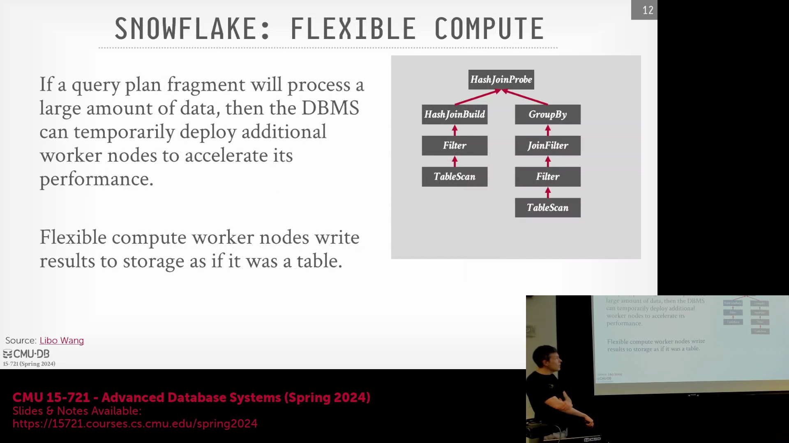

## 临时存储与中间结果的 S3 溢出机制
由于借用的计算节点具有临时性，且一旦所属租户恢复活动便会立即被抢占(Preemption)，因此系统无法安全地将中间结果(Intermediate Results)持久化于本地磁盘缓存中。为确保数据持久性并规避因缓存淘汰(Cache Eviction)引发的查询失败，借用节点生成的所有中间结果均会作为临时表分区(Temp Table Partitions)直接写入 Amazon S3。下游查询操作符(Downstream Query Operators)会无缝地将这些 S3 对象识别为标准数据源(Data Source)。这种溢出(Spilling)机制确保即便在激进的资源抢占策略下，临时性的资源共享也绝不会损害数据完整性(Data Integrity)或查询正确性。

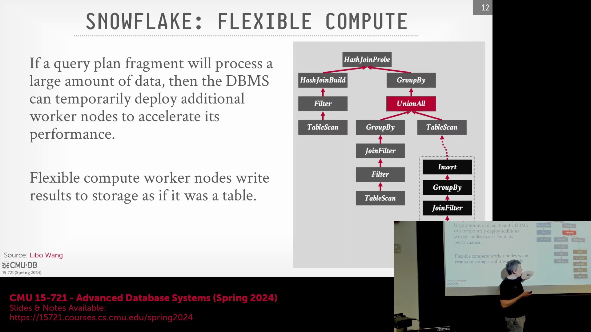

## 查询优化、结果缓存与多租户隔离
该架构引入了诸如显式“连接过滤器”(Join Filter)等专用操作符，能够将布隆过滤器(Bloom Filter)从连接的构建侧(Build Side)推送至探测侧(Probe Side)，从而实现早期数据跳过(Early Data Skipping)。此外，系统可将已完成的查询片段(Query Fragments)缓存至 S3 并同步更新元数据目录(Metadata Catalog)，使后续相同查询能够直接绕过计算层，复用已物化的结果(Materialized Results)（默认不自动刷新）。针对跨租户计算共享(Cross-Tenant Compute Sharing)带来的安全挑战，Snowflake 实施了严格的隔离策略(Isolation Policy)：查询执行完毕后，工作进程会立即终止，从而彻底杜绝内存或上下文状态泄漏(State Leakage)的风险。作为一项仅运行经审计平台代码的全托管服务(Fully-Managed Service)，尽管底层物理硬件存在多路复用(Multiplexing)，系统依然维持着坚固的租户边界(Tenant Boundaries)。

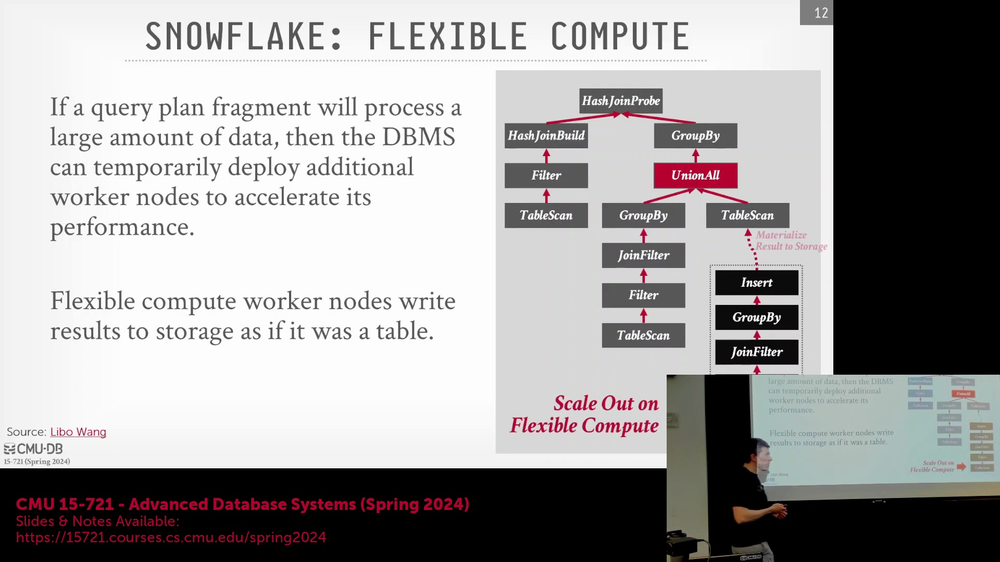

---

## 闲置算力回收（Cycle Scavenging）与跨租户资源池化
对空闲计算周期(Idle Compute Cycles)的利用，在历史上被称为“算力回收”(Cycle Scavenging)，并因 20 世纪 80 年代的 Condor 等系统而闻名，如今该技术已无缝集成至现代云数据仓库(Cloud Data Warehouse)中。通过在集中式多租户计算池(Centralized Multi-tenant Compute Pool)内运行，该平台能够透明地借用某一客户未充分利用的资源，以加速另一客户的查询执行。这构建了一种互惠共生的“资源借用与回馈”生态：用户在负载高峰期(Load Peaks)可获得更快的性能，而其闲置容量(Idle Capacity)在空闲时段也能被系统高效利用。与传统存在被抢占(Preemption)风险的竞价实例(Spot Instances)不同，该机制深度嵌入于托管服务层(Managed Service Layer)中。系统仅执行经过严格审计的平台代码(Audited Platform Code)，以确保强隔离性(Strong Isolation)并彻底消除隐私顾虑，同时无需人工干预即可自动完成后台优化任务。

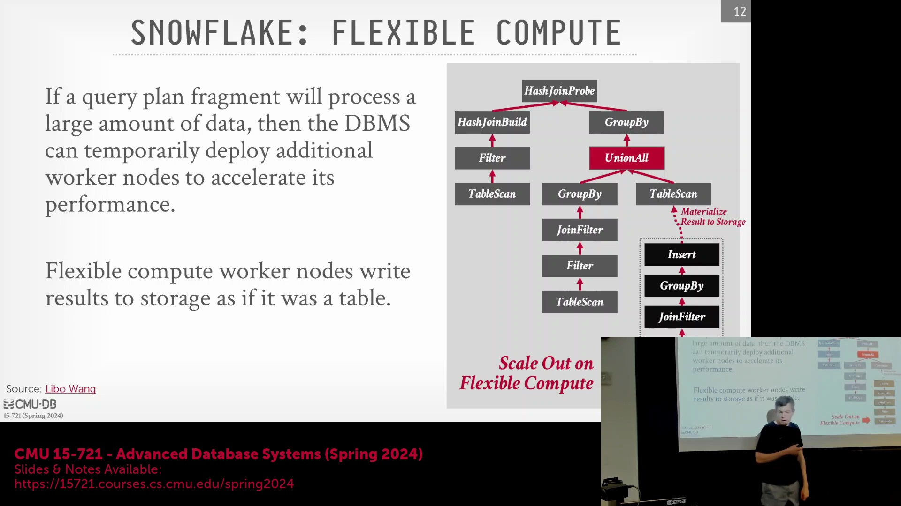

## 多级缓存以缓解对象存储延迟
直接查询 S3 等云对象存储(Cloud Object Storage)会因网络延迟(Network Latency)、频繁的 HTTP API 调用以及数据加解密(Encryption/Decryption)过程而产生显著开销。为此，Snowflake 并未构建全新的分布式存储层(Distributed Storage Layer)，而是通过在工作节点(Worker Nodes)上部署高效的多级缓存架构(Multi-level Caching Architecture)来优化性能。每个节点均维护一个本地的 LRU（最近最少使用）缓存(LRU Cache)，优先将临时中间结果(Intermediate Results)驻留于内存中而非直接写入持久化文件，从而确保高效的内存级计算(In-memory Processing)。当本地缓存达到容量阈值时，数据会平滑地溢出(Spill)至 S3。这种涵盖 DRAM、本地 NVMe 存储(Local NVMe Storage)与云对象存储的全局分层策略(Global Tiering Strategy)，大幅削减了 API 调用次数，在降低云提供商基础设施成本的同时，为用户带来了显著更低的查询响应时间(Query Latency)。

## 专有存储格式与微分区优化
Snowflake 采用了一种专有的列式存储格式(Proprietary Columnar Storage Format)，该格式与 Parquet 和 ORC 等行业标准相兼容，并深度融合了 PAX 布局(PAX Layout)、字典编码(Dictionary Encoding)以及块级压缩算法(Block-level Compression)。导入的数据会被自动切分为“微分区”(Micro-partitions)，并将初始大小为 50–500 MB 的原始数据压缩(Compress)至约 16 MB 的紧凑块。与依赖静态、不可变文件(Immutable Files)查询的开放数据湖(Open Data Lake)架构不同，Snowflake 依托其托管存储(Managed Storage)执行持续的自主优化(Autonomous Optimization)。系统会持续分析查询访问模式(Query Access Patterns)，并在后台自动对微分区进行重新聚类(Re-clustering)、重新排序与数据重写(Rewriting)。这种主动维护机制(Proactive Maintenance)彻底免除了手动执行清理(Vacuum)操作的需求，通过高效的数据裁剪(Data Pruning)最大限度减少了磁盘 I/O，并随时间推移持续优化查询性能。

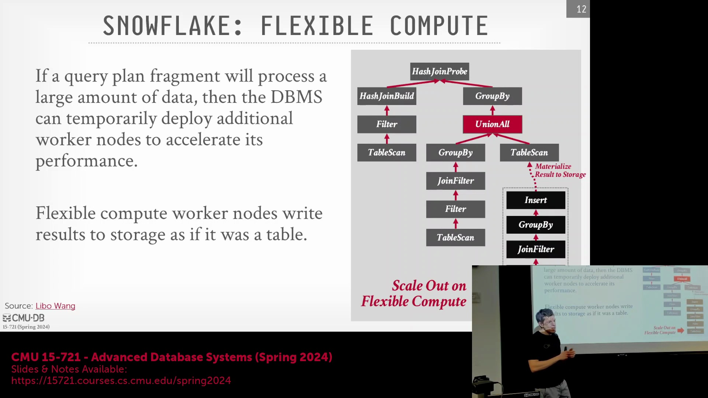

## 半结构化数据的加载时类型推断
系统通过专用的 `VARIANT`、`ARRAY` 和 `OBJECT` 数据类型，原生支持处理复杂的无模式(Schema-less)数据负载。`VARIANT` 类型可容纳任意深度的 JSON 或 XML 层次结构(Hierarchical Structures)，而 `ARRAY` 与 `OBJECT` 则专用于管理扁平集合(Flat Collections)及键值对(Key-Value Pairs)。与传统系统要求预定义模式(Pre-defined Schemas)（如 Protobuf），或现代引擎执行高昂的运行时类型推断(Runtime Type Inference)及基础类型分发(Base Type Dispatch)不同，Snowflake 在数据加载(Data Ingestion)阶段即完成数据类型解析。当数据通过 `INSERT` 语句或批量加载操作(Bulk Load Operations)导入专有格式时，系统会预先解析其结构模式，并将半结构化数据(Semi-structured Data)转换为高度优化的二进制表示(Optimized Binary Representation)。这种前置解析(Eager Parsing)机制彻底消除了查询执行期间的动态类型检查(Dynamic Type Checking)开销，确保了对复杂嵌套数据(Complex Nested Data)进行一致且高性能的分析。

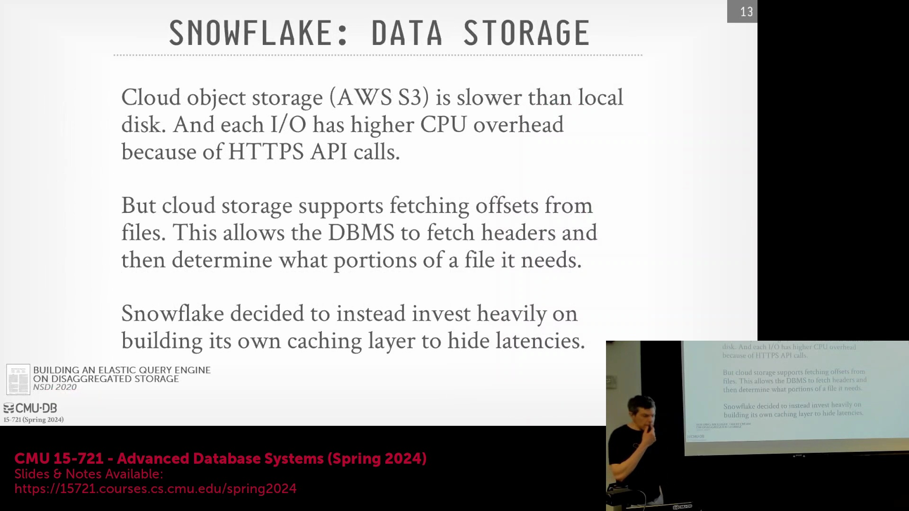

---

## 半结构化数据的加载时类型推断
将 JSON 等半结构化数据(Semi-structured Data)加载至 Snowflake 专有存储格式时，系统会在数据摄入阶段(Data Ingestion Phase)执行类型推断(Type Inference)，而非将其推迟至查询执行时。系统自动解析传入的字符串，识别底层数据类型模式(如日期或时间戳)，并将其转换为优化的二进制表示(Optimized Binary Representation)。为确保系统健壮性(Robustness)，平台会保留原始未解析字符串(Raw String)作为后备机制，以防因异常字符（如特殊表情符号或格式错误条目）导致初始类型检测(Type Detection)失败。这与 Dremel 等在查询运行时(Runtime)进行类型解析的架构形成鲜明对比。通过前置推断(Eager Inference)，Snowflake 消除了查询执行期间重复解析的开销，从而充分发挥列式压缩(Columnar Compression)、字典编码(Dictionary Encoding)与向量化执行(Vectorized Execution)的性能优势。尽管该机制在托管的内部表(Managed Internal Tables)上极为高效，但对于模式控制受限的外部表(External Tables)或开放格式数据湖(Open-format Data Lakes)，系统能够优雅降级(Gracefully Fallback)至运行时推断。

## 基于一致性哈希的微分区归属管理
为在动态多租户计算集群(Dynamic Multi-tenant Compute Cluster)中高效管理数据分布，Snowflake 依赖一致性哈希(Consistent Hashing)算法将微分区(Micro-partitions)精准映射至特定工作节点(Worker Nodes)。该算法将计算节点排列于逻辑环(Logical Ring)上。当计算资源弹性伸缩(Elastic Scaling)时，仅需重新分配相邻节点的数据，从而避免了代价高昂的全集群数据重排(Cluster-wide Reshuffle)。元数据目录(Metadata Catalog)利用此映射关系，将查询任务(Query Tasks)直接路由至“拥有”(Owns)目标微分区的节点。由于数据归属关系(Data Ownership)在较长周期内保持稳定，对应的工作节点得以维护持久化微分区的长期本地缓存(Persistent Local Cache)。该设计使得虚拟仓库(Virtual Warehouses)能够安全暂停与恢复，而不会破坏缓存局部性(Cache Locality)。系统因此得以以细粒度方式检索数据，并大幅削减了对 Amazon S3 的冗余往返请求(Redundant Round-trip Requests)。

## 启发式驱动优化与早期微分区剪枝
Snowflake 的查询优化器(Query Optimizer)（早期曾被称为“编译器”Compiler）采用统一的、基于 Cascade 架构的自上而下(Top-down)优化框架。鉴于云原生环境中统计数据(Statistics)可能迅速过期或失真，优化器有意降低了对直方图(Histograms)或数据草图(Sketches)等重量级统计对象的依赖。相反，系统主要依赖启发式规则(Heuristic Rules)与轻量级的区域映射(Zone Maps，记录各微分区每列的最小/最大值范围)，在查询执行前主动剪枝(Prune)无关数据块。其核心目标是在编译时(Compile Time)识别并剔除无法满足查询谓词(Query Predicates)的微分区。尽管基础元数据(Basic Metadata)主导初始剪枝决策，系统仍引入了运行时自适应机制(Runtime Adaptive Mechanisms)。当查询执行过程中发现初始统计假设并非最优时，该机制可动态调整执行策略(Execution Strategy)。

## 面向复杂谓词的统一表达式求值
查询优化面临的一项核心工程挑战，在于处理涉及算术运算(Arithmetic Operations)（如 `col1 + col2 > X`）或嵌套函数(Nested Functions)（如 `EXTRACT(YEAR FROM date) = 2024`）的复杂剪枝谓词(Complex Pruning Predicates)。若缺乏对底层语义(Underlying Semantics)的理解，系统无法直接将此类谓词与静态区域映射进行匹配求值(Evaluation)。为攻克此难题，Snowflake 统一了优化器与运行时执行引擎(Runtime Execution Engine)所共用的表达式求值代码库(Expression Evaluation Codebase)。该架构决策确保了优化阶段与执行阶段之间的逻辑运算及 NULL 值处理语义(Null-handling Semantics)高度一致，同时有效避免了代码冗余(Code Duplication)。即便无需扫描实际数据行，优化器也能安全推导(Reason)出表达式的潜在输出范围。在高级优化场景中，系统可能在编译阶段临时执行轻量级标量子查询(Lightweight Scalar Subqueries)，将解析出的常量(Constant Values)重新注入查询计划(Query Plan)，从而实现更为精准的早期数据剪枝(Early Data Pruning)。

---

## 面向查询优化的统一表达式求值
历史上，传统系统中的查询优化器(Query Optimizer)缺乏在优化阶段内部评估复杂表达式的能力，通常被迫中断规划流程，转而在运行时执行引擎(Runtime Execution Engine)中直接执行标量子查询(Scalar Subquery)。为消除这种高昂的阶段切换开销，现代架构将优化器与执行器的表达式求值代码库(Expression Evaluation Codebase)进行了统一。通过将执行引擎逻辑进行封装，使其能够直接基于统计元数据(Statistical Metadata)而非底层实际数据运行，优化器得以在不触发冗余数据扫描的情况下，安全地进行谓词推理(Predicate Reasoning)、常量折叠(Constant Folding)并统一 NULL 值处理语义(NULL-handling Semantics)。这种深度集成确保了编译与执行阶段逻辑的高度一致，同时显著加速了查询规划(Query Planning)过程。

## 自适应聚合下推与运行时激活
一项关键的自适应优化(Adaptive Optimization)技术涉及动态将聚合算子(Aggregation Operator)下推至连接算子(Join Operator)下方，以大幅削减中间结果的数据量。查询优化器最初会基于轻量级成本估算(Lightweight Cost Estimation)，将默认处于禁用状态的聚合节点注入执行计划(Execution Plan)中。在查询执行期间，运行时触发器(Runtime Trigger)会持续监控实际的数据吞吐量与基数(Cardinality)；若中间数据量超出预测阈值，系统将自动激活该下推聚合逻辑。尽管此机制能显著提升低基数连接(Low-cardinality Joins)或 `MIN`/`MAX` 等简单聚合的性能，但其触发条件被刻意设计为保守策略——因为高基数(High Cardinality)或计算开销较大的分组键(Grouping Keys)可能导致过早聚合(Premature Aggregation)反而引发性能衰退。在无需依赖重量级统计草图(Statistical Sketches)的前提下，系统默认采用启发式规则(Heuristic Rules)（如星型模式假设 Star Schema Assumption）结合微分区剪枝元数据(Micro-partition Pruning Metadata)，以确定最优的连接顺序(Join Ordering)与执行路径。

## TPC-DS 基准测试争议与数据准备
2021 年 11 月，Databricks 宣布其 Photon 引擎(Photon Engine)创下了一项经审计的全新 TPC-DS 基准测试(TPC-DS Benchmark)记录，随即引发了与 Snowflake 的公开技术论战。Snowflake 创始人指出该测试配置存在偏差且经济效率(Cost-effectiveness)低下，并声称若 Databricks 采用标准 Snowflake 服务层级(Service Tier)本可获得更优结果。Databricks 则反驳称，Snowflake 的对比数据依赖于以专有格式存储的内部预优化数据(Pre-optimized Data)，这些数据已历经深度的微分区聚类(Micro-partition Clustering)与压缩处理。Databricks 强调，基于原始 TPC-DS 数据集运行的独立学术基准测试得出了截然不同的性能指标。此外，严格的 TPC-DS 规范强制要求将全部数据准备(Data Preparation)与导入(Ingestion)耗时计入最终基准成绩，这引发了业界广泛质疑：Snowflake 的内部性能对比是否公允地计入了这一庞大的前期时间开销。

## 市场定位与竞争基准测试的现实
尽管技术层面的争论持续不断，但此次交锋最终演变为 Databricks 的一次重大战略胜利。它成功向市场证明，Photon 引擎已具备作为高性能、企业级数据仓库(Enterprise-grade Data Warehouse)运行的能力，直接撼动了 Snowflake 在云分析市场(Cloud Analytics Market)长期占据的主导地位。这场辩论深刻揭示了公平对比云原生数据库的固有难点，尤其是当各厂商高度依赖专有存储优化(Proprietary Storage Optimizations)、隐式预聚类流程(Implicit Pre-clustering Pipelines)或透明度存疑的数据准备阶段时。通过迫使业界重新审视基准测试方法论(Benchmarking Methodologies)与数据准备开销(Preparation Overheads)，此次技术交锋清晰地表明：围绕数据导入与存储格式的底层架构选型(Architectural Choices)，正从根本上重塑现代数据仓库对外呈现的性能基准与成本效益(Cost-efficiency)。

---

## 基准测试(Benchmark)比较的挑战
在评估时序数据库(Time Series Database)与分析型数据库(Analytical Database)时，业界历来对基准测试(Benchmark)的结果争论不休。一个反复被提及的问题是：为何在未经任何预处理的情况下，直接对比原始基准数据（如 TPC-DS）是远远不够的？核心症结在于，仅将原始 Parquet 文件直接载入并运行查询，完全忽视了生产环境中必需的数据清洗、建模与系统调优等现实环节。 

## 针对基准测试的专项优化技巧
多年来，数据库厂商针对 TPC 基准测试(TPC Benchmark)开发了高度定制化的优化策略。这些系统经过专门设计，可通过识别特定的模式特征（例如频繁访问 `new_orders` 或 `warehouse` 表）来探测当前是否处于基准测试执行环境中。一旦识别出测试环境，数据库引擎便可能自动切换至专用的查询计划(Query Plan)或内部配置，而这些配置在真实生产环境中面对不可预测的工作负载(Workload)时根本不会被触发。 

此类行为常被业界与大众汽车排放丑闻(Volkswagen Emissions Scandal)相提并论。正如涉事车辆被预先编程以检测尾气排放测试条件，并临时优化性能以蒙混过关一样，数据库系统同样能够识别基准测试环境，并激活高度调优的非标准执行路径(Execution Path)。尽管大众案例涉及的是实体环境污染，但数据库领域的这一类比深刻揭示了一个事实：基准测试得分如何通过针对性强且缺乏泛化能力的优化手段被人为抬高。

## 生产环境与基准测试优化：TPC-C 案例
以 TPC-C 基准测试为例，可以清晰地看到这种做法的具体体现。在测试执行期间，仓库(Warehouse)的数量始终保持静态不变。洞悉这一特性后，厂商可能会放弃为仓库表构建完整的动态 B+ 树索引(B+ Tree Index)，转而采用一种结构简单且高度优化的排序数组(Sorted Array)作为替代。这种替换大幅降低了数据查找开销(Lookup Overhead)，从而显著提升了基准测试的吞吐量(Throughput)。 

然而，在数据量持续动态增长的生产环境中，此类优化将完全失效。随着数据集规模的扩大，静态数组将演变为严重的性能瓶颈，而 B+ 树索引却能高效处理高频的动态插入操作。此类针对基准测试的“应试”技巧在业界已有充分记载，这也进一步印证了为何仅凭原始基准测试的对比，往往无法客观反映数据库系统的真实性能。

## Snowflake 的架构演进与混合表(Hybrid Table)
将视线转向现代云数据仓库(Cloud Data Warehouse)，Snowflake 相较于其初始设计已实现了显著的架构演进。该系统最初基于严格的专有存储格式(Proprietary Storage Format)发布，随后逐步扩展以全面拥抱数据湖(Data Lake)生态。这一演进始于 Snowpipe 服务，它支持以 Apache Arrow 格式流式传输数据，随后再将其转换并落盘至专有存储格式中。2021 年，Snowflake 推出了外部表(External Table)；至 2022 年，进一步增加了对 Apache Iceberg 的原生支持，使得 Parquet 文件能够携带额外的元数据(Metadata)，以支持模式演进(Schema Evolution)与轻量级更新(Lightweight Update)。 

为应对事务型工作负载(Transactional Workload)，Snowflake 于 2022 年推出了由 Unistore 引擎驱动的“混合表”(Hybrid Table)功能。该服务在 Snowflake 生态内作为一个具备完全容错能力的行存(Row-store)事务型数据库运行，可高效支撑标准 SQL 及类 TPC-C 风格的事务工作负载。新写入混合表的数据初始阶段会采用日志结构(Log-structured)的行格式进行存储。后台异步进程将持续对这些数据进行合并压缩(Compaction)，并将其转换为 Snowflake 专有的列式格式(Columnar Format)。在执行联机分析处理(OLAP)查询时，查询引擎会无缝融合实时行存数据与已优化的列存数据，向用户呈现统一的数据视图。该架构直接对标并回应了 Delta Lake 等竞品的挑战，使得用户能够直接在 Snowflake 基础设施上无缝运行事务型应用。

## FoundationDB 与 Snowflake 元数据目录(Metadata Catalog)
为在核心分析能力之外构建高可靠、强容错的事务层(Transaction Layer)，Snowflake 将其元数据目录底层构建于 FoundationDB 之上。FoundationDB 诞生于 2010 年代初的 NoSQL 浪潮中，率先开创了分布式事务型键值存储(Transactional Key-Value Store)的先河。Snowflake 早期引入该组件，旨在避免从零开始自研复杂的分布式目录(Distributed Catalog)系统。然而，随着苹果公司于 2015 年完成收购并将该项目转为闭源维护，情况发生了变化。依托早期合同中的特殊条款，Snowflake 确保了在收购交割时仍能完整获取源代码，并在随后的多年间持续维护其私有分支(Private Fork)。当苹果最终宣布将 FoundationDB 开源时，Snowflake 不得不投入大量工程资源，将其长期积累的私有补丁合并回上游主干仓库(Upstream Repository)。目前，苹果依然是该项目的主要开源贡献者，Snowflake 紧随其后位列第二。受限于相关法律条款，Snowflake 工程师无法直接向公共代码仓库(Public Repository)提交变更，必须经由苹果内部员工代为协调提交。 

FoundationDB 还因其开创性的确定性测试基础设施(Deterministic Testing Infrastructure)而闻名业界。该框架允许开发人员系统性地注入磁盘、网络及节点故障，从而通过数学证明严谨验证其容错能力(Fault Tolerance)。该技术的核心创始人随后凭借这一专长创立了 Antithesis 公司，致力于将面向分布式系统的确定性测试框架进行商业化落地。

## 事务抽象与 Snowflake 的市场地位
无论上层系统采用关系型(Relational)还是键值型(Key-Value)接口，其底层的事务机制(Transaction Mechanism)始终遵循相同的抽象：`begin`、`put`、`commit`。诸如 RocksDB、WiredTiger 以及 MySQL 的 InnoDB 等底层存储引擎(Storage Engine)，均以类似的方式对这些操作进行抽象。这充分印证了一个核心观点：上层数据模型(Data Model)的差异并不决定底层事务处理的可行性。 

总而言之，尽管 Snowflake 问世已超过 12 年，但它依然被公认为当前最先进的(State-of-the-art)云数据仓库系统。尽管部分架构决策（例如在早期遗留的专有存储层(Legacy Proprietary Storage Layer)之上进行改造以兼容外部表）仍隐约暴露出其初始设计的局限性，但其整体性能与可扩展性(Scalability)在市场上依然极具竞争力。随着核心向量化查询执行(Vectorized Query Execution)技术在 DuckDB 和 Apache DataFusion 等开源引擎中日益普及并趋于同质化，Snowflake 真正的竞争壁垒已不再局限于原始的数据扫描速度，而是转向其深度打磨的用户体验、Snowpark 开发者生态、运行时自适应优化(Runtime Adaptivity)以及高级查询优化器(Query Optimizer)。这也为后续深入探讨下一代湖仓一体(Lakehouse)原生架构奠定了坚实基础。

---

## 结语：嵌入式系统(Embedded System)与云端数据访问(Cloud Data Access)
讲座最后将分布式湖仓一体(Lakehouse)架构与嵌入式(Embedded)、进程内(In-process)数据库系统进行了对比。尽管两者的运行模式迥异，但这些轻量级引擎(Lightweight Engine)却共享一项关键能力：能够直接从 Amazon S3 等外部云存储(Cloud Storage)服务中读取并摄入(Data Ingestion)数据。这一特性凸显了现代数据访问(Data Access)趋于统一的趋势，无论系统规模大小或部署模式如何。

## 诗意尾声：具象意象与审慎反思
在技术内容总结完毕后，音频转入了一段富有节奏感且充满诗意的尾声。开篇的诗句引出了关于个人整装待发状态与务实观察的主题，并迅速过渡至具体的生活意象。诗中关于堆叠行囊、整理瓶罐以及小心搬运物件的描写，奠定了一种审慎而克制的基调。叙述坦然直面潜在的挣扎与苦痛，将其视为人生旅途中不可避免的历练，同时始终保持着平稳、内省的叙事节奏。
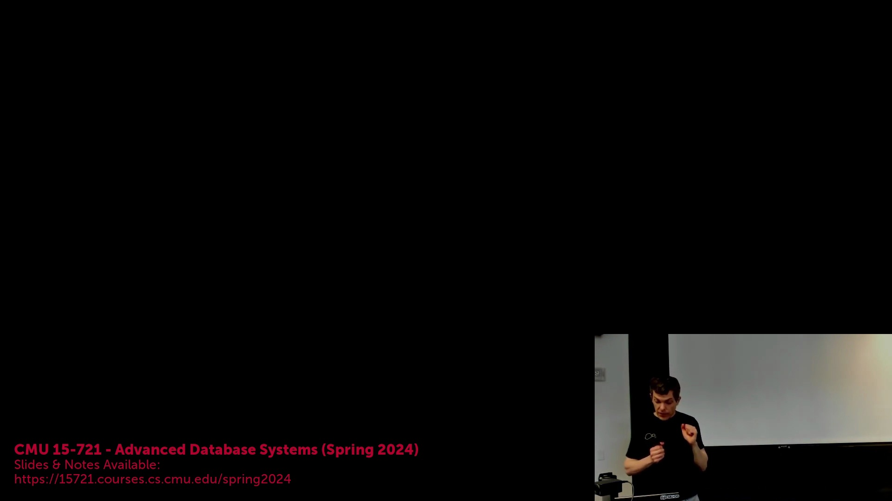

## 主题升华：救赎与内在力量
随着诗句的层层推进，叙事焦点转向了更为深邃的隐喻与精神层面的探讨。文中提及了直面过往的重负、寻求灵魂的救赎，以及通过隐忍淬炼内心的澄明。诸如“将种种经历一饮而尽”与“拯救灵魂”等表述，暗示了一段通往个人抉择与精神坚韧的旅程。收尾的诗句着重强调了心理韧性(Resilience)，敦促听众穿越逆境，最终将信念与内在力量化作指引人生航向的核心动力。
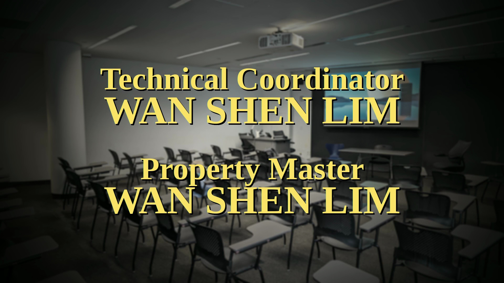

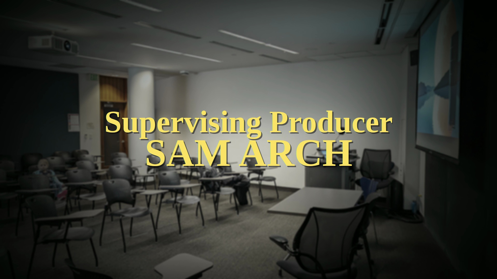
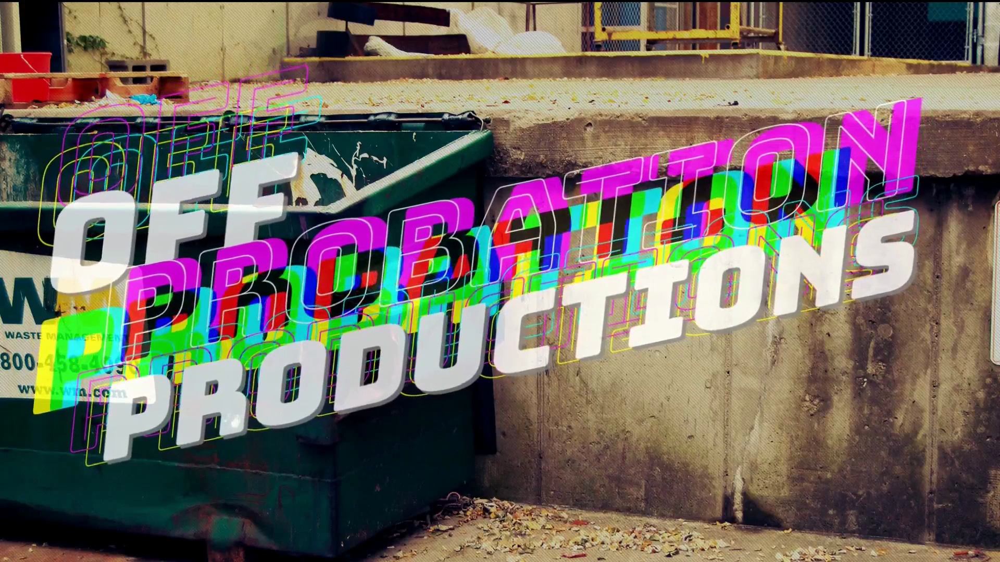