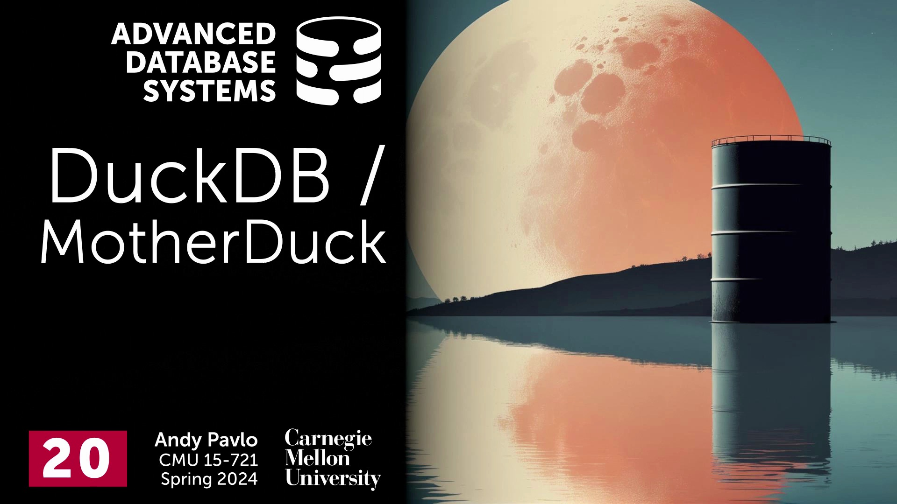
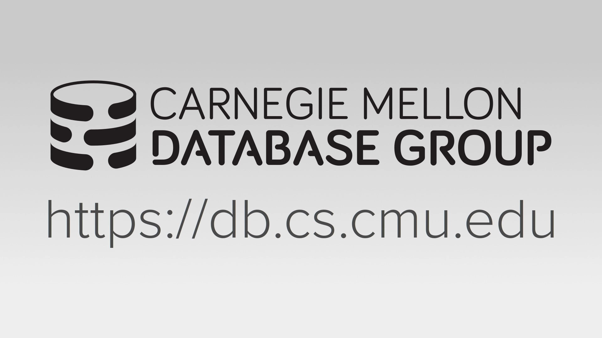
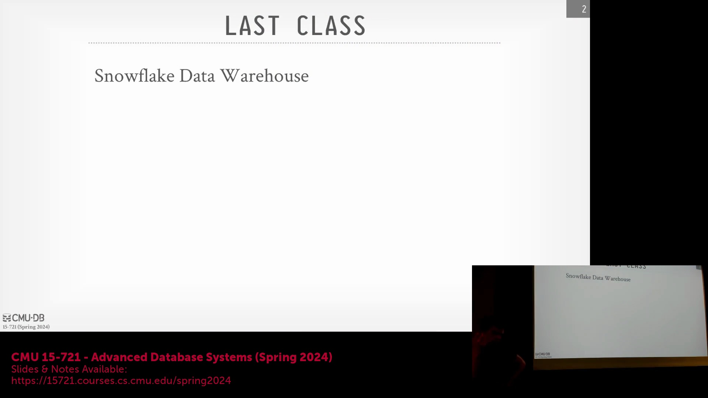
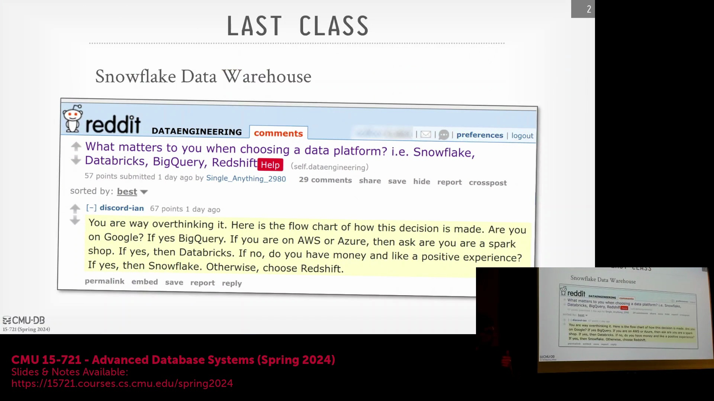
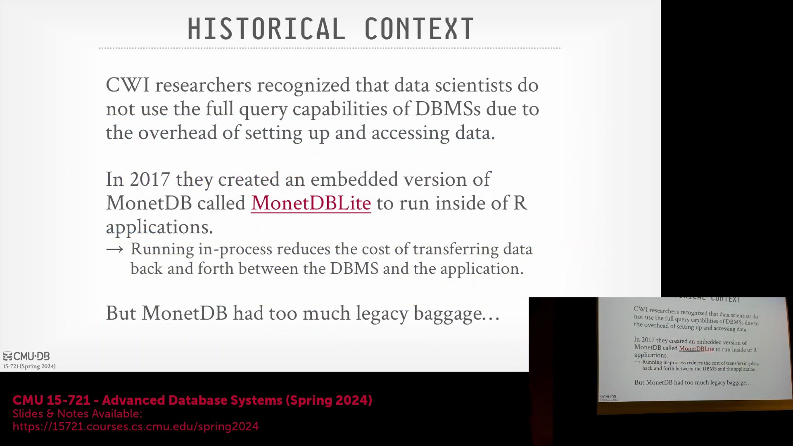
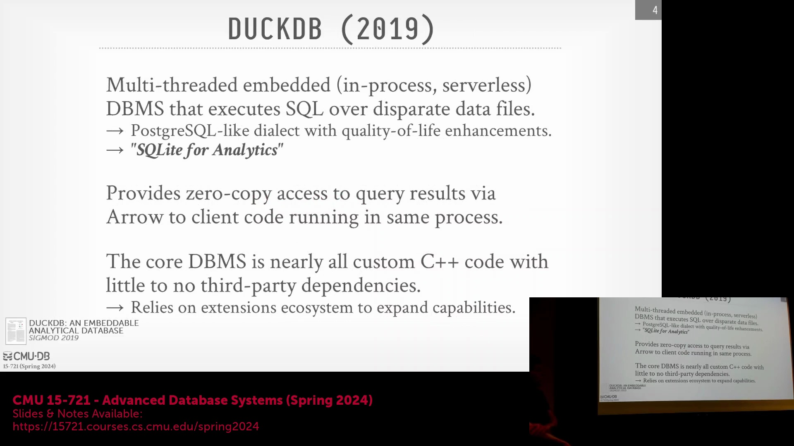

## 课程简介与向单节点系统的转变
卡内基梅隆大学(Carnegie Mellon University)的高级数据库系统(Advanced Database Systems)课程在演播室现场观众面前录制。今天的讨论聚焦于 DuckDB(DuckDB)，这与近几周涵盖的分布式云数据仓库(Distributed Cloud Data Warehouses)形成了鲜明对比。虽然现代系统通常运行在庞大的云基础设施之上，但 DuckDB 主要设计为在单节点(Single-Node)上运行。稍后，我们将探讨 MotherDuck(MotherDuck) 如何利用云端算力来执行查询，而无需将查询分发(Distribute Queries)至分布式集群中。

## 选择云端数据仓库：生态系统契合度与用户体验
上节课我们探讨了 Snowflake 与 Dremel(Dremel)，它们作为经典的云原生 OLAP 引擎(Cloud-Native OLAP Engines)，具备预编译原语(Pre-compiled Primitives)、推送式执行模式(Push-based Execution Model)以及存算分离(Compute-Storage Separation)的特性。在评估 Snowflake、Databricks、BigQuery 和 Redshift 等现代平台时，数据工程(Data Engineering) Reddit 社区给出了一条实用的经验法则：选择与现有基础设施相匹配的平台。若基于 GCP(Google Cloud Platform) 则选用 BigQuery，基于 AWS(Amazon Web Services) 则选用 Redshift，若已深度依赖 Spark(Apache Spark) 则选择 Databricks，若预算充足且优先考虑卓越体验则选择 Snowflake。Snowflake 的关键差异化优势(Key Differentiator)在于其更加简洁直观的用户体验。为维持这种简洁性，Snowflake 向用户暴露的调优参数(Tuning Parameters)极少（通常仅包括计算资源规格和自动扩缩容(Auto-scaling)），而其内部却维护着数百个隐藏参数。数据库工程师在幕后进行即时调优，刻意将用户与复杂的底层配置隔离开来。

## 自适应调优、性能稳定性与工程生态
在大规模场景下管理内部调优需要一种自适应(Adaptive)的设计理念。现代系统不再依赖手动配置参数，而是旨在动态适应工作负载(Workloads)；尽管这会带来更大的工程开销(Engineering Overhead)，但显著提升了系统的稳健性(Robustness)。在探讨为何 Redshift 等某些平台会收到褒贬不一的评价时，问题往往不在于核心架构(Core Architecture)，而在于面向用户的调试与诊断工具(Debugging & Diagnostics Tools)、重复执行时的性能可重复性(Performance Reproducibility)以及整体使用体验。这些观察虽有时带有轶事(Anecdotal)色彩，但在数据工程社区中已被广泛讨论。除了纯粹的系统性能外，与更广泛的数据流水线(Data Pipelines)以及 Apache Airflow(Apache Airflow) 和 dbt(dbt) 等工具的无缝集成，也极大地影响着实际应用中的系统采用率(Adoption Rate)和用户满意度。

## DuckDB 的起源：从 MonetDB Lite 中汲取经验
为了理解 DuckDB 的诞生背景，我们回顾了其先驱论文《*Don’t Hold My Data Hostage*（别把我的数据当人质）》，该研究源于构建 MonetDB(MonetDB) 嵌入式版本 MonetDB Lite(MonetDB Lite) 的尝试。MonetDB 是一款早期的学术型列式数据库(Academic Column-Store Database)，需要传统的安装部署、参数配置以及通过 JDBC(Java Database Connectivity) 进行网络连接。然而，数据科学家(Data Scientists)更倾向于将原始 CSV(CSV) 或 Parquet(Parquet) 文件下载至本地，直接使用 Python 或 R 语言进行处理，从而绕过数据库查询优化器，转而依赖 Pandas(Pandas) 等相对低效的内存处理库。研究团队的目标是创建一个进程内(In-Process)、嵌入式(Embedded)的版本，以彻底消除网络开销(Network Overhead)，并将列式存储的高效性能直接引入数据工作流(Data Workflows)中。然而，MonetDB 积累了十余年的遗留代码(Legacy Code)，架构过于庞杂难以精简，这最终促使荷兰数学与计算机科学研究学会(CWI)的研究人员决定从零开始(From Scratch)构建一个全新的系统。

## DuckDB 的核心理念：“分析领域的 SQLite”愿景
DuckDB 是一款专门从零设计打造的嵌入式、进程内或“无服务端(Serverless)”数据库系统，旨在直接对任意可访问的数据文件执行高效的 SQL 查询。其 SQL 方言(SQL Dialect)基于 PostgreSQL(PostgreSQL) 语法，并在演进过程中融入了许多 DuckDB 专属的易用性优化(Usability Enhancements)，例如简化的查询语法。该项目的核心定位极为明确：致力于成为“分析领域的 SQLite(Analytics SQLite)”。尽管 SQLite(SQLite) 作为无处不在的嵌入式数据库，在消费级设备、物联网(IoT)及航空航天等领域的事务型工作负载(Transactional Workloads)中占据主导地位，但 DuckDB 力求复制其广泛的普及度，并专门针对高性能分析处理(High-Performance Analytical Processing)进行了底层优化。尽管学术界曾探索过多种提升 SQLite 分析查询能力的改进方案，但 DuckDB 仍是目前专为该垂直领域量身打造的最优系统。