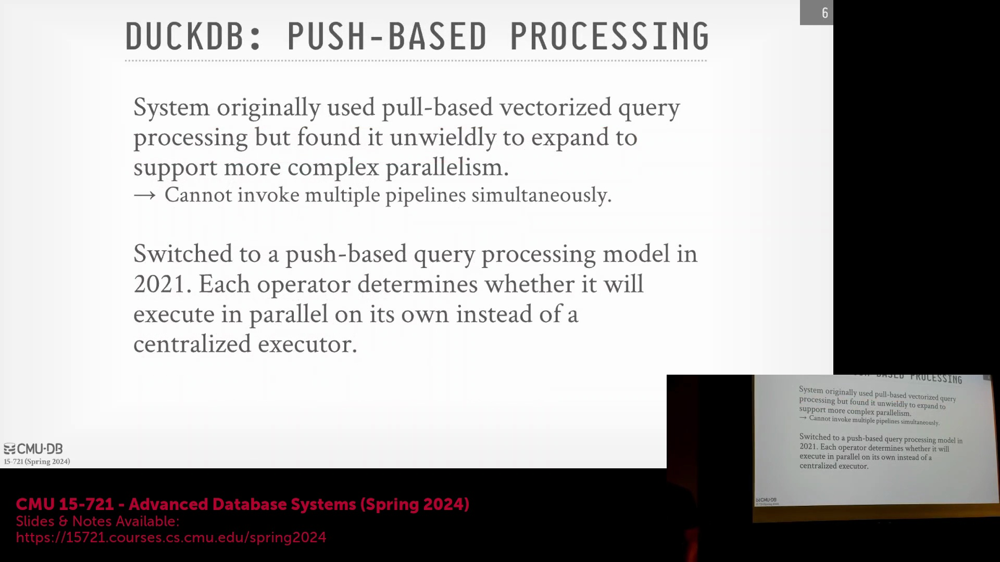
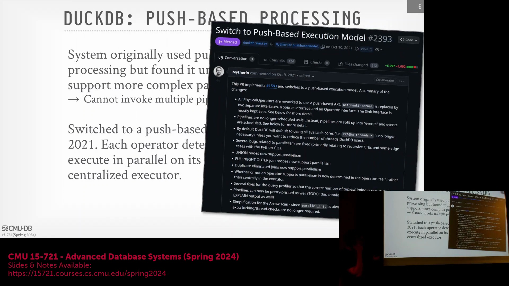

## 自定义 C++ (C++) 实现与轻量级设计

DuckDB 的一项核心设计决策是全面采用自主编写的 C++ 代码。除加密 (Encryption) 和安全套接字层 (SSL, Secure Sockets Layer) 等关键且难以独立实现的模块外，团队刻意避免引入任何第三方依赖 (Third-Party Dependencies)。这种自包含 (Self-Contained) 的架构显著降低了系统的依赖膨胀问题，简化了工程维护，并使其能够无缝编译为 WebAssembly (WebAssembly/WASM)。与通常需要在浏览器环境中进行复杂适配才能高效运行的 SQLite (SQLite) 或 PostgreSQL (PostgreSQL) 不同，DuckDB 的原生架构使其几乎无需修改即可在 WASM 环境中流畅执行。

## 面向核心功能的扩展生态系统 (Extension Ecosystem)
为了在不损害核心运行时 (Core Runtime) 轻量级特性的前提下扩展系统能力，DuckDB 采用了模块化 (Modular) 的扩展 (Extension) 生态系统。用户可通过安装官方或第三方扩展来添加专项功能。该设计在确保基础引擎精简且易于维护的同时，提供了按需集成附加功能的灵活性。

## 嵌入式 (Embedded) 与无服务器 (Serverless) 架构
DuckDB 作为一个真正的嵌入式数据库运行，采用“全共享 (Shared-Everything)”架构，而非存算分离 (Compute-Storage Separation) 模式。它直接运行于宿主进程的地址空间内，形态更接近进程内库 (In-Process Library) 而非独立服务器。这种类无服务器 (Serverless) 的特性意味着引擎在空闲时会自动缩减资源占用，避免了维持持久化后台进程的开销。与传统嵌入式数据库（通常将执行严格限制在调用线程内）不同，DuckDB 能够在宿主进程的内存空间中独立调度与管理工作线程，从而实现了更高效的资源利用。

## 核心查询处理特性
该系统引入了多项高级执行特性，其中最显著的是基于推送 (Push-Based) 的向量化 (Vectorized) 查询处理模型。该模型利用预编译 (Pre-Compiled) 的查询原语 (Query Primitives)，并结合 SIMD (Single Instruction, Multiple Data) 指令（借助 MOCC）以实现极致性能。DuckDB 采用数据块驱动 (Morsel-Driven) 的并行机制，将工作负载高效分发至多个 CPU 核心，使其即便在核心数众多的单台标准机架服务器（俗称“Pizza Box”服务器）上也能表现卓越。这与通常仅依赖单线程执行查询的 SQLite 形成鲜明对比。此外，DuckDB 支持展开任意子查询以及横向连接 (Lateral Joins) 等高级操作，使其性能与功能足以与 HyPer 和 Umbra 等高度优化的研究型数据库系统比肩。

## 优化、连接 (Join) 与子查询处理
DuckDB 实现了标准的连接算法（涵盖排序合并连接 (Sort-Merge Join) 与哈希连接 (Hash Join)），并由分层查询优化器 (Hierarchical Query Optimizer) 进行统筹指导。在处理缺乏预收集统计信息 (Statistics) 的任意文件时，优化器主要依赖基于规则 (Rule-Based) 的启发式 (Heuristic) 策略来确定高效的连接顺序与执行计划。近期的开发工作已全面集成对各类子查询的支持，显著提升了系统的 SQL (Structured Query Language) 兼容性与数据分析灵活性。

## 向基于推送的执行模型过渡
最初，DuckDB 采用的是基于拉取 (Pull-Based) 的向量化执行模型。然而随着系统演进，该模型被证明难以维护：添加新的并行算子 (Parallel Operators) 需要对控制面 (Control Plane) 进行大量重构。更为关键的是，基于拉取的模型在处理远程数据源 (Remote Data Sources)（如 HTTPS、S3 (Amazon Simple Storage Service)）时面临严峻挑战。由于执行状态 (Execution State) 与调用栈 (Call Stack) 深度绑定，任何阻塞式 I/O (Blocking I/O) 操作都会导致整个线程挂起，使系统无法暂停当前任务并切换至其他就绪的执行管线 (Execution Pipeline)。

转向基于推送的架构彻底突破了这些工程瓶颈。新架构引入了集中式调度器 (Centralized Scheduler) 来统一管理数据块 (Morsels)，使系统能够主动调度就绪任务，同时优雅地挂起等待网络或磁盘 I/O 的任务。这一架构转型大幅提升了系统性能与代码可维护性，在数据源可用性不稳定或存在延迟的场景下，其优势尤为显著。

此次架构过渡由联合创始人 Mark 通过单个 Pull Request (PR) 完整实现。该提交彻底移除了旧版基于拉取的基础设施，并全面替换为全新的基于推送的调度器。

## 开发背景与学术环境
此次重大架构转型之所以能够快速且连贯地落地，得益于 DuckDB 背后荷兰研究机构 CWI (Centrum Wiskunde & Informatica) 独特的组织模式。与传统大学院系中常见的僵化层级结构不同，CWI 作为一个高度协作的研究中心运作，其开发者与研究人员将大量精力直接投入于编写生产级 (Production-Grade) 开源代码。这种独特的产学研环境，促成了前沿数据库研究高效、直接地转化为一个健壮且高性能的数据库系统。