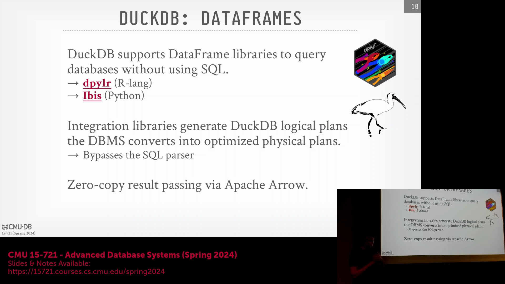
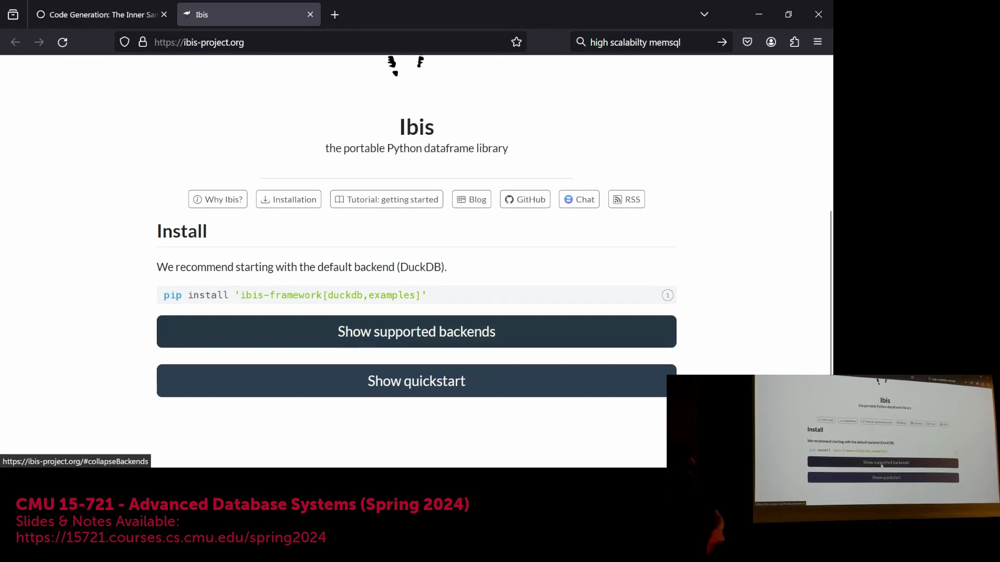
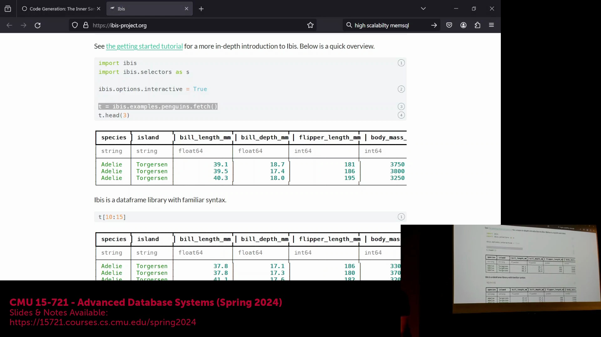
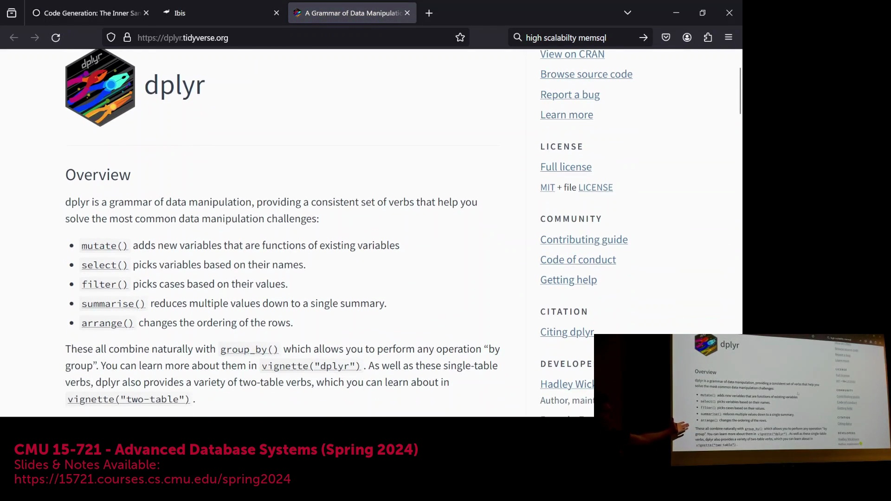
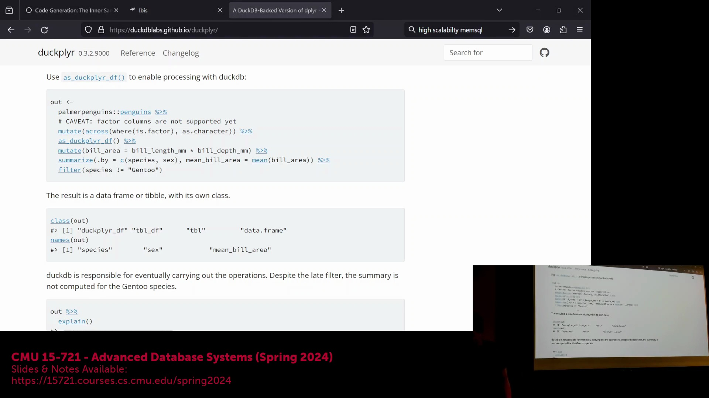
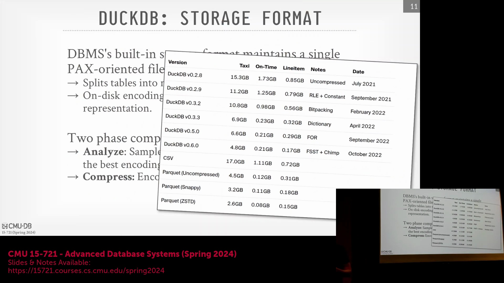
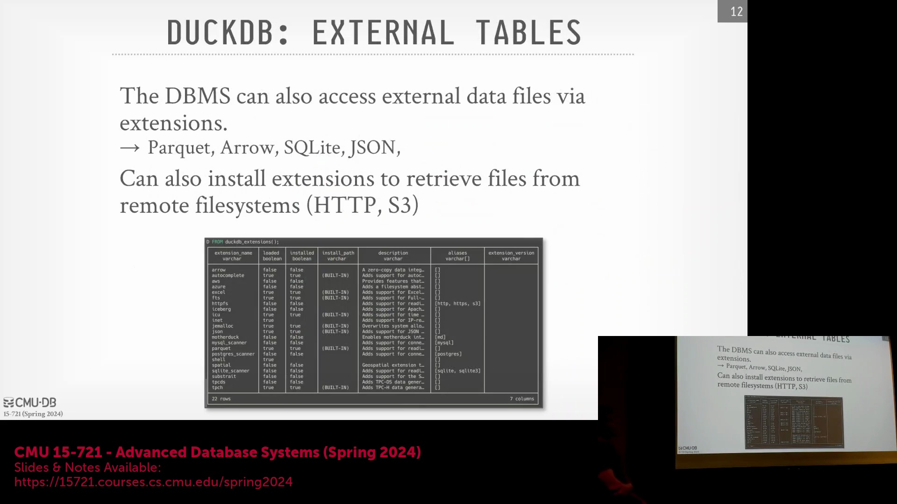

## Python 与 R 生态系统集成

DuckDB 为 Python(Python) 和 R(R) 提供了原生集成库，并深度适配了 dplyr(dplyr) 和 ibis(ibis) 等数据操作框架。这些 API 提供了以 DataFrame(DataFrame) 为核心的编程式数据操作范式，其使用体验与 PySpark(PySpark) 等分布式计算框架高度一致。本质上，这些 DataFrame API 是对表结构与关系代数(Relational Algebra)操作的直观、高层封装，使数据科学家能够在熟悉的编程环境中无缝进行开发。

## 直接逻辑计划转换与零拷贝数据交换

这些集成库并非简单地将 DataFrame 方法调用转译为原始 SQL 字符串，而是直接将操作映射为 DuckDB 内部的逻辑计划(Logical Plan)表示。随后，该计划会被送入优化器以生成物理执行计划(Physical Execution Plan)，其处理流程与解析后的 SQL 查询完全一致。关键在于，该集成基于 Apache Arrow(Apache Arrow) 内存标准构建，实现了真正的零拷贝(Zero-Copy)数据交换。由于 DuckDB 以进程内(In-Process)模式运行，与 Python 或 R 共享同一进程地址空间，数据缓冲区可以直接共享传递，无需承担高昂的序列化(Serialization)、反序列化(Deserialization)或内存拷贝(Memory Copy)开销。这一设计完美契合了“不要扣押我的数据(Don't Hold My Data Hostage)"的核心理念。

## 桥接数据科学工作流与 OLAP 性能

该架构精准解决了数据科学工作流中的一个核心痛点：数据科学家通常更偏爱 Jupyter Notebook(Jupyter Notebook) 与 DataFrame 语法，而非传统 SQL，且重写现有代码库往往不切实际。通过拦截 DataFrame 调用并将其直接路由至 DuckDB 高度优化的联机分析处理(OLAP, Online Analytical Processing)引擎，用户既能保留 Pandas(Pandas) 直观且富有表现力的语法优势，又能获得企业级查询性能。这使得用户能够直接在 Notebook 中高效处理大规模 Parquet(Parquet) 文件，彻底告别通过低效的 JDBC/ODBC(JDBC/ODBC) 驱动提取数据的繁琐过程，也无需再将基于行(Row-Based)的结果集手动转换为列式(Columnar)格式。

## 专有单文件存储架构
与 SQLite(SQLite) 类似，DuckDB 的核心数据库采用专有的单文件数据库格式进行存储。数据更新操作由预写日志(WAL, Write-Ahead Logging)机制严格管理；在执行复杂查询时，若内存不足，中间临时数据会根据需要动态溢出(Spill)至独立磁盘文件中。该存储格式完全围绕列式存储(Columnar Storage)构建，其行组(Row Group)通常包含约 120,000 个元组(Tuples)。需要强调的是，尽管内存中的计算优先采用轻量级向量格式以追求极致的 CPU 执行效率，但磁盘持久化格式则采用了更高压缩比的策略，以最大限度地降低存储开销。

## 自适应列式压缩与基准测试

在数据插入或加载阶段，DuckDB 会执行轻量级扫描以分析各列的数据分布特征。引擎内置的评估算法会自动为每一列匹配最高效的编码方案，并广泛采用位打包(Bit-Packing)与参考帧编码(Frame of Reference, FOR)等技术。随着版本迭代，DuckDB 持续扩展其压缩算法库，引入了专为浮点数优化的先进算法（如 ALPS）。在 TPC-H、NYC Taxi、OnTime 等标准基准数据集(Benchmark Datasets)上的测试对比表明，这种自适应的逐列压缩策略在压缩率与查询性能上，均显著优于 Snappy(Snappy) 或 Zstandard(Zstandard) 等 Parquet(Parquet) 常用基础压缩算法。

## 对外部文件格式的支持

尽管 DuckDB 的自有存储格式针对内部数据管理与极致查询性能进行了深度优化，但系统依然保持了对多种外部数据格式的强兼容读取能力。这种架构灵活性确保了用户无需进行繁琐的数据预转换，即可直接无缝查询以行业标准格式存储的数据集，同时充分享受 DuckDB 基于推送的向量化(Push-Based Vectorized)执行引擎带来的高速分析处理优势。