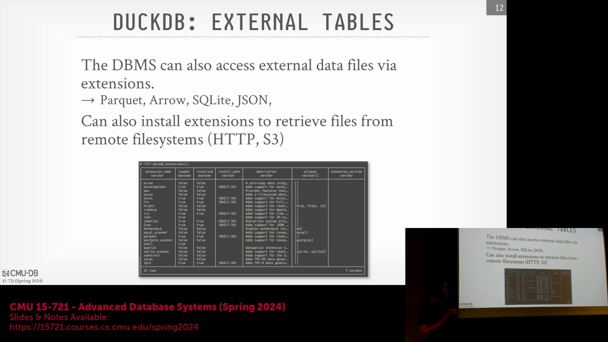
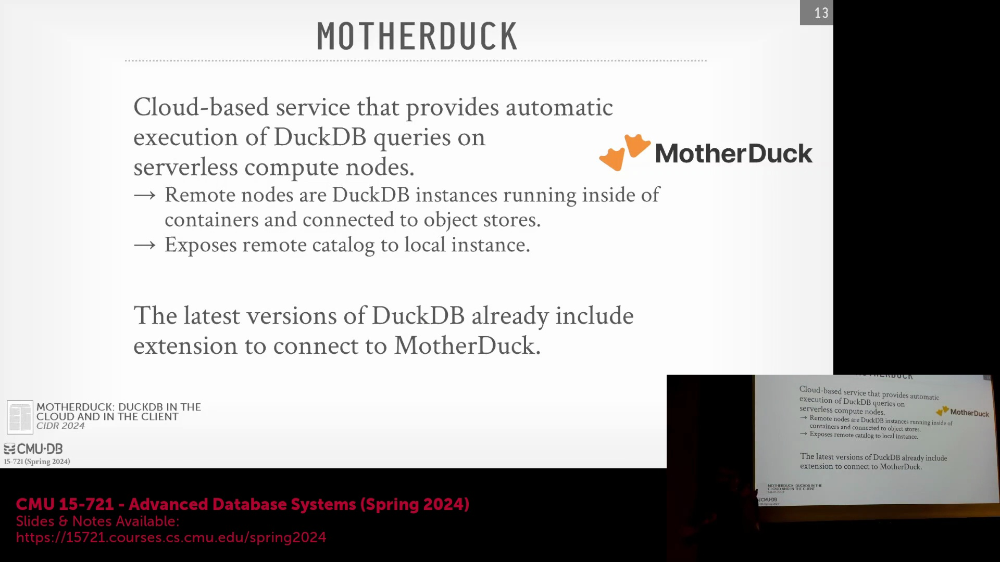
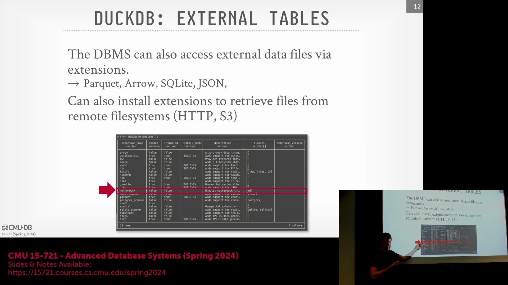

## 外部数据源与数据库附加

DuckDB 原生支持读取 Parquet(Parquet) 和 Apache Arrow(Apache Arrow) 等行业标准的列式格式(Columnar Formats)，但其真正的灵活性体现在能够直接附加(Attach)外部数据库系统。用户可以无缝附加 SQLite(SQLite) 数据库，使其数据目录(Catalog)和模式(Schema)在 DuckDB 环境中完全暴露，且本地与外部数据库的查询体验完全一致。同样，DuckDB 也能通过网络协议连接 PostgreSQL(PostgreSQL) 实例，允许直接对远程表执行分析型查询(Analytical Queries)。该系统会智能管理数据流，通常倾向于将数据摄取(Ingest)至 DuckDB 高度优化的进程内(In-Process)引擎中，而非依赖响应较慢的远程联机事务处理(OLTP, Online Transaction Processing)执行。

## 扩展生态系统与性能关键型库
为保持核心二进制文件(Core Binary)的精简并最大限度减少第三方依赖(Third-Party Dependencies)，DuckDB 采用了模块化(Modular)的扩展(Extension)架构。诸如对国际化(Internationalization)、时区处理(Timezone Handling)和复杂日期格式化至关重要的 ICU 库(International Components for Unicode)等功能，均以官方扩展形式提供，而非直接内置于核心中。HyPer(HyPer) 团队的一则轶事生动说明了高度优化的自定义实现为何关键：该团队曾在客户会议前夕紧急重写 ICU 逻辑，以解决严重的性能瓶颈(Performance Bottleneck)。扩展以共享对象(Shared Objects)形式加载，并实现特定的入口点 API(Entry Point API)。其工作机制类似于 PostgreSQL 的 `contrib` 模块或第三方插件(Plugins)，支持按需动态加载(Load On-Demand)或启用。

## 内存分配与多核可扩展性
内存管理(Memory Management)是 DuckDB 基础设施设计中的关键考量。高性能分析型系统通常避免使用标准的 `libc malloc()`，因其固有的锁开销(Lock Overhead)会严重制约多线程工作负载(Multi-Threaded Workloads)。相反，DuckDB 及同类引擎默认采用 `jemalloc`(jemalloc)（有时亦使用 `tcmalloc`(tcmalloc)）。该类内存分配器(Memory Allocator)利用细粒度闩锁(Fine-Grained Latches)与更小的临界区(Critical Sections)，能够高效扩展(Scalability)至数十个 CPU 核心。尽管 `jemalloc` 会积极预分配(Pre-Allocate)内存，且可能比标准 `libc` 占用更多虚拟内存(Virtual Memory)，但其卓越的可扩展性与更低的资源争用(Resource Contention)已使其成为现代数据库系统的行业标准，确保并行查询(Parallel Queries)能够顺畅执行，且免受操作系统底层机制的干扰。

## MotherDuck 云计划

MotherDuck(MotherDuck) 云服务代表了 DuckDB 进军云分析(Cloud Analytics)领域的战略举措，且并未妥协其原有的嵌入式(Embedded)设计理念。与 Snowflake(Snowflake) 等从零构建完全存算分离(Compute-Storage Separation)架构的数据仓库不同，创始团队将 MotherDuck 作为独立初创公司推出，专门提供“远程计算层(Remote Compute Layer)"。该方案在提供云端托管执行环境(Cloud-Hosted Execution Environment)的同时，完整保留了 DuckDB 轻量级、单节点(Single-Node)的核心哲学。它有效弥合了本地开发(Local Development)与云端大规模数据处理(Cloud-Scale Data Processing)之间的鸿沟，使用户能够充分调用云端资源，而无需放弃熟悉的 DuckDB 客户端。

## 混合查询执行与目录同步

通过安装官方扩展并使用 API 密钥(API Key)进行身份认证，用户可以无缝集成 MotherDuck。连接建立后，MotherDuck 会将其远程目录(Remote Catalog)与文件元数据(File Metadata)直接同步至本地 DuckDB 实例，使用户能够像查询本地文件一样操作云端托管的数据集。该架构智能地拆分了查询执行(Query Execution)流程：本地客户端会根据查询特征智能判定，哪些算子操作应通过网络下推(Push-Down)至 MotherDuck 的远程服务器执行，哪些应在本地处理。这种混合路由模型(Hybrid Routing Model)通过利用云端算力处理计算密集型任务(Compute-Intensive Tasks)来优化整体性能，同时确保用户体验与本地 DuckDB 环境保持无缝衔接。