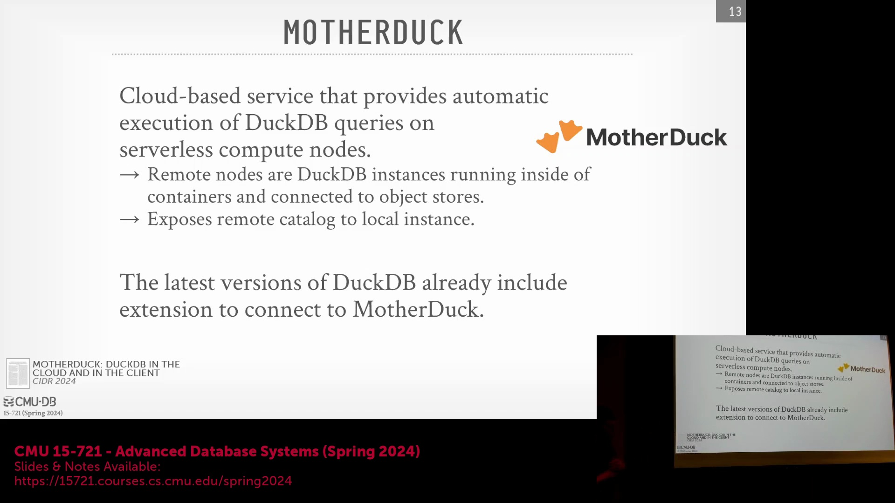
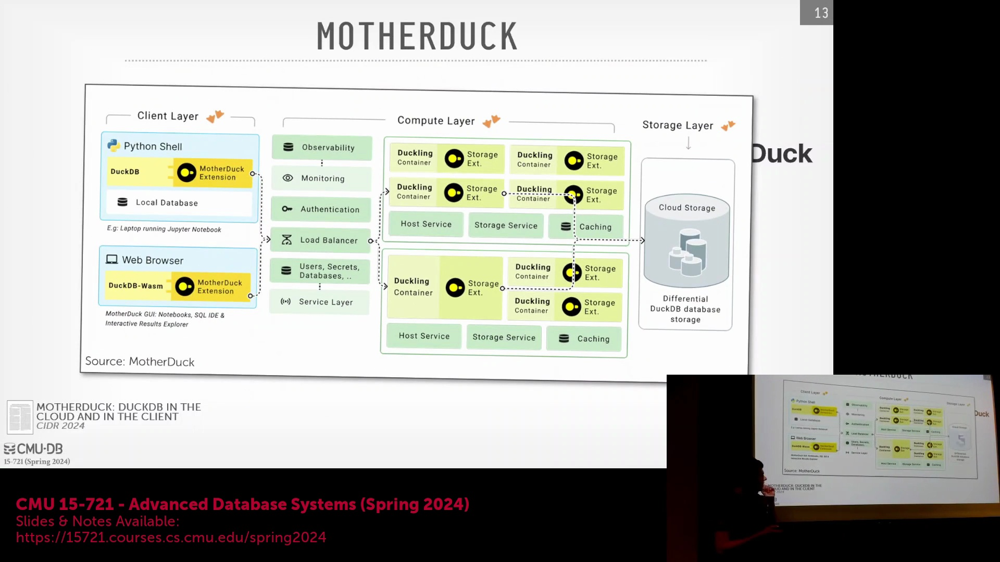
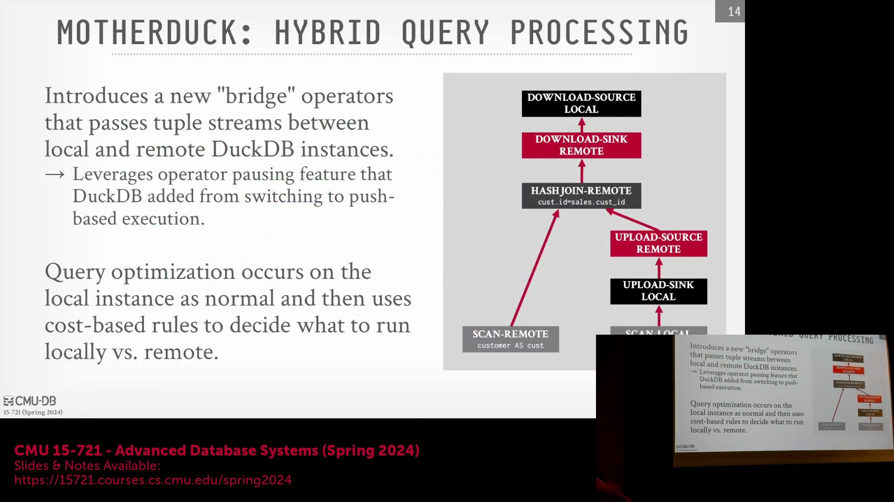
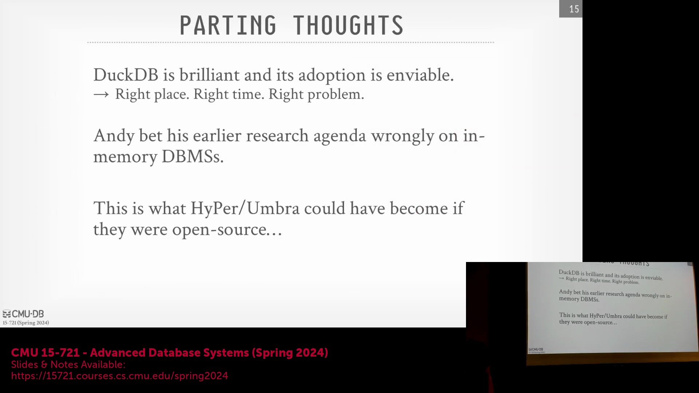

## 无缝云端集成与统一的开发者体验

DuckDB 的云端扩展(Cloud Extension)解决了一个常见的工作流痛点(Workflow Pain Point)：在本地分析型负载(Analytical Workloads)与 Google BigQuery(BigQuery) 等托管型云数据仓库(Managed Cloud Data Warehouse)之间频繁切换。通过保持完全一致的客户端接口(Client Interface)（如 SQL、Python 或通过 `ibis`(Ibis)/`dplyr`(dplyr) 的 R 语言接口），用户在编写查询(Query)时无需关心底层的具体执行位置(Execution Location)。当数据集(Dataset)规模过大时，系统会自动将操作无缝路由(Routing)至云端，使用户在保留熟悉本地开发环境(Local Development Environment)的同时，能够充分利用远程计算能力(Remote Compute Power)。这有效消除了上下文切换(Context Switching)、语法兼容性(Syntax Compatibility)问题，以及在本地与云端联机分析处理(OLAP, Online Analytical Processing)系统间迁移时常见的运维开销(Operational Overhead)。

## 混合查询执行与桥接算子

为实现这一混合执行模式(Hybrid Execution Model)，DuckDB 在其查询计划(Query Plan)中引入了专门的“桥接算子(Bridge Operator)”。在标准查询规划(Standard Query Planning)完成后，系统会触发第二轮优化以评估数据局部性(Data Locality)。引擎采用基于成本(Cost-Based)的启发式策略(Heuristics)，将优化重心放在数据传输量(Data Transfer Volume)而非计算复杂度(Computational Complexity)上，从而智能决策是将远程数据拉取(Pull)至本地，还是将本地执行管线(Execution Pipeline)推送(Push)至云端。例如，在执行小型本地表与海量远程表的连接(Join)操作时，系统会触发本地客户端通过网络上传本地数据，交由远程 DuckDB 实例完成高效的哈希连接(Hash Join)。得益于基于推送(Push-Based)的执行模型，该跨节点交互过程异常流畅。该模型将控制流(Control Flow)与数据流(Data Flow)彻底解耦，使得执行管线能够安全暂停、异步传输数据并自动恢复执行，完全免除了复杂的调用栈(Call Stack)管理负担。

## 架构对比：存储扩展与计算扩展

该架构清晰地凸显了 DuckDB 的云端方案与 Neon(Neon) 或 Amazon Aurora(Amazon Aurora) 等分布式数据库系统之间的显著差异。Neon 和 Aurora 通过解耦存储与计算(Compute-Storage Decoupling)，并将计算资源横向扩展(Horizontally Scale)至主节点与只读副本节点(Read Replicas)来提升性能；而 DuckDB 本质上仍坚守无共享架构(Shared-Nothing Architecture)的单节点(Single-Node)引擎定位。MotherDuck 并未为了分布式计算编排(Distributed Compute Orchestration)而重写核心引擎，而是选择在云端托管的 Docker 容器(Docker Container)中运行标准 DuckDB 实例，以执行完整的查询管线(Query Pipeline)。尽管该系统在理论上具备将单个查询拆分至多个云端节点执行的能力，但其设计优先考虑架构简洁性(Simplicity)：倾向于将完整的执行管线派发至单一云实例处理。这一策略在充分借力云端存储(Cloud Storage)与远程执行能力(Remote Execution Capabilities)的同时，完美保留了嵌入式引擎(Embedded Engine)轻量、敏捷的核心设计哲学。

## 时机、研究与开源的交汇

DuckDB 的快速普及(Rapid Adoption)得益于精准的市场时机(Market Timing)与卓越的工程执行力(Engineering Execution)的完美契合。其诞生恰逢行业技术风向再次转变，SQL(Structured Query Language) 重新确立为数据分析工作流的标准范式；DuckDB 精准契合了市场对高性能嵌入式(Embedded)联机分析处理(OLAP)引擎的迫切需求，而非盲目构建又一个分布式数据仓库(Distributed Data Warehouse)。更为关键的是，研发团队成功将 HyPer(HyPer) 和 Umbra(Umbra) 等学术系统的前沿研究成果(Cutting-Edge Academic Research)转化为实用、开源的工程级实现(Open-Source Engineering Implementation)。通过将先进的向量化执行(Vectorized Execution)、基于推送的调度器(Push-Based Scheduler)以及自适应压缩技术(Adaptive Compression Techniques)高度封装于轻量级库中，DuckDB 为数据科学社区(Data Science Community)提供了一个功能强大且支持本地运行(Local Execution)的 SQL 引擎，有效弥合了传统关系型数据库与现代基于 Python/R 的分析型工作流之间的技术鸿沟。