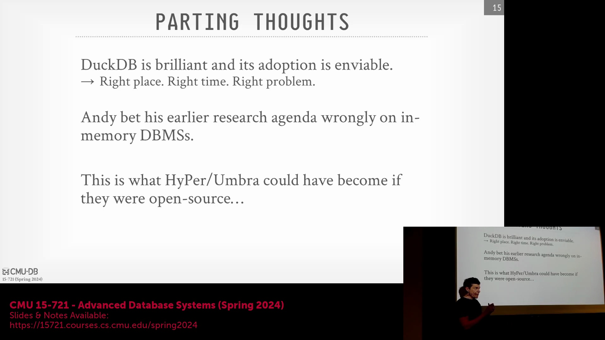
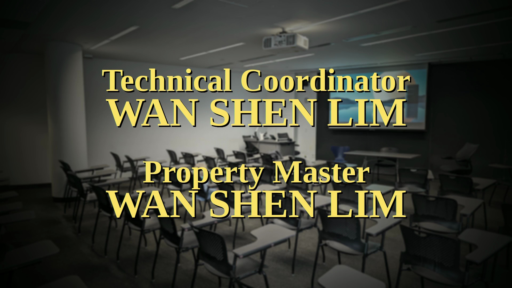
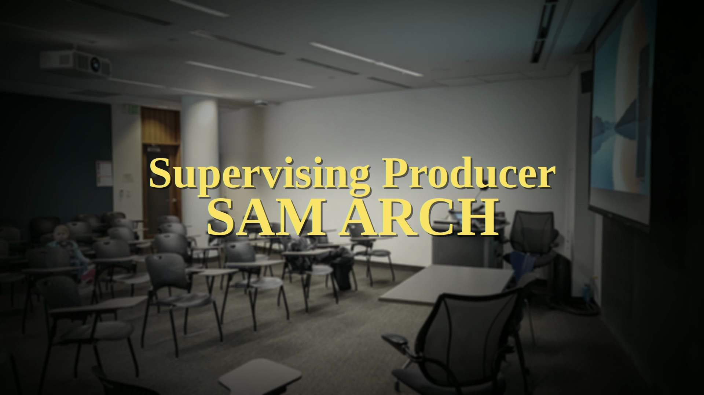
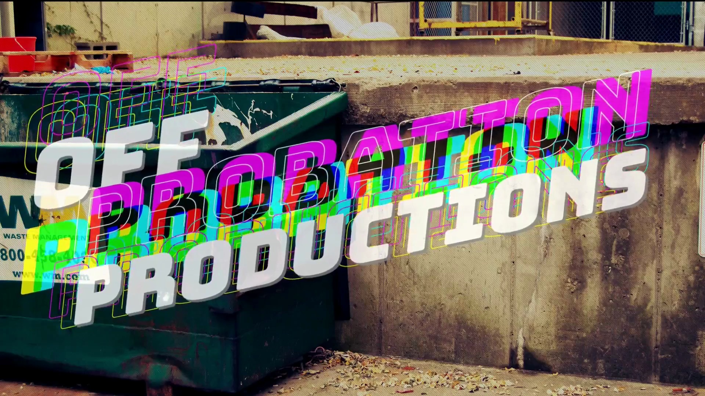

## DuckDB 获得现象级采用的背后因素

DuckDB 的迅速成功，源于其成功将 HyPer(HyPer) 和 Umbra(Umbra) 等学术系统中的前沿研究(Cutting-Edge Academic Research)转化为一款实用、开源的嵌入式分析引擎(Embedded Analytical Engine)。创始团队敏锐地捕捉到市场对轻量级、基于 SQL 的分析库的明确需求，该类引擎需能直接在宿主应用程序(Host Application)进程内运行。通过引入并优化成熟的向量化执行(Vectorized Execution)、预编译查询原语(Pre-compiled Query Primitives)以及基于推送的调度机制(Push-Based Scheduling)，团队交付了一套高性能系统。该系统在开发者(Developers)与数据科学家(Data Scientists)群体中引发强烈共鸣，充分证明了精心设计的嵌入式联机分析处理(OLAP, Online Analytical Processing)引擎正是行业当前的迫切需求。

## 纯内存数据库的衰落
在回顾更广泛的数据库发展趋势时，演讲者将 DuckDB 融合磁盘存储的架构(Hybrid Disk-Memory Architecture)与此前学术界（如卡内基梅隆大学 CMU(Carnegie Mellon University)）曾大力押注的纯内存架构(In-Memory Architecture)进行了对比。随着硬件技术的快速演进，纯内存愿景未能如预期般成为主流：固态硬盘(SSD, Solid State Drive)的性能呈指数级跃升，且成本大幅降低。因此，现代数据库系统已不再单纯依赖内存容量来提升性能。行业重心已转向针对 SSD 特性优化的存储架构，这使得传统的纯内存设计(Pure In-Memory Design)在处理通用工作负载(General-Purpose Workloads)时已基本过时。

## 实际应用与下节课预告：Yellowbrick
在日常数据分析任务中，DuckDB 现已成为业界首选工具。无论是处理 CSV(Comma-Separated Values) 文件还是执行快速数据探索(Exploratory Data Analysis)，它已在现代技术工作流中有效取代了 Microsoft Excel 或 Google Sheets 等传统电子表格软件(Spreadsheet Software)。讲座随后预告了下一讲的主题：Yellowbrick(Yellowbrick) 数据库系统。该学术系统于 2024 年正式发表，引入了商业数据库中较为罕见的高度专业化底层优化(Low-Level System Optimizations)。下一讲将深入探讨硬核性能工程(Hardcore Performance Engineering)，并辅以令人印象深刻的真实世界基准测试(Real-World Benchmarks)数据作为支撑，展现其与现有系统截然不同的设计哲学与性能表现。

## 轻松愉快的音乐尾声

本次课程最终以一段幽默且略带跑题的音乐片段轻松收尾。该片段包含随性的说唱(Freestyle Rap)歌词与轻松的闲聊，为高强度的技术讲解提供了有趣的调剂(Mental Break)。这段非正式(Informal)的结尾为 DuckDB 的系统概览画上了句号，随后课程将自然过渡至下一个数据库系统(Database System)的深入讲解。