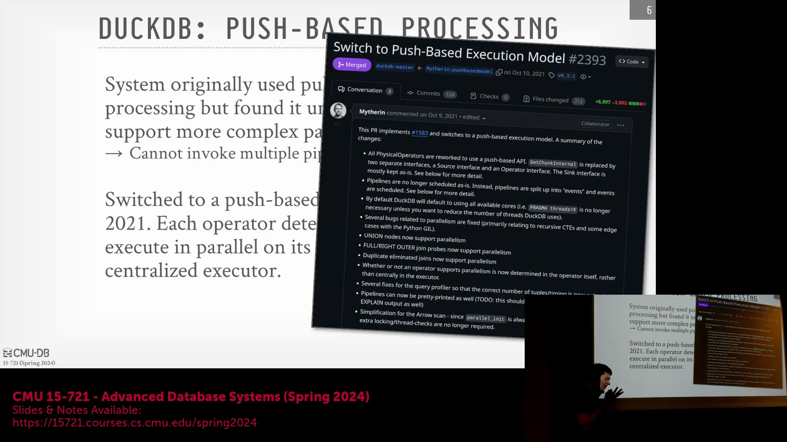
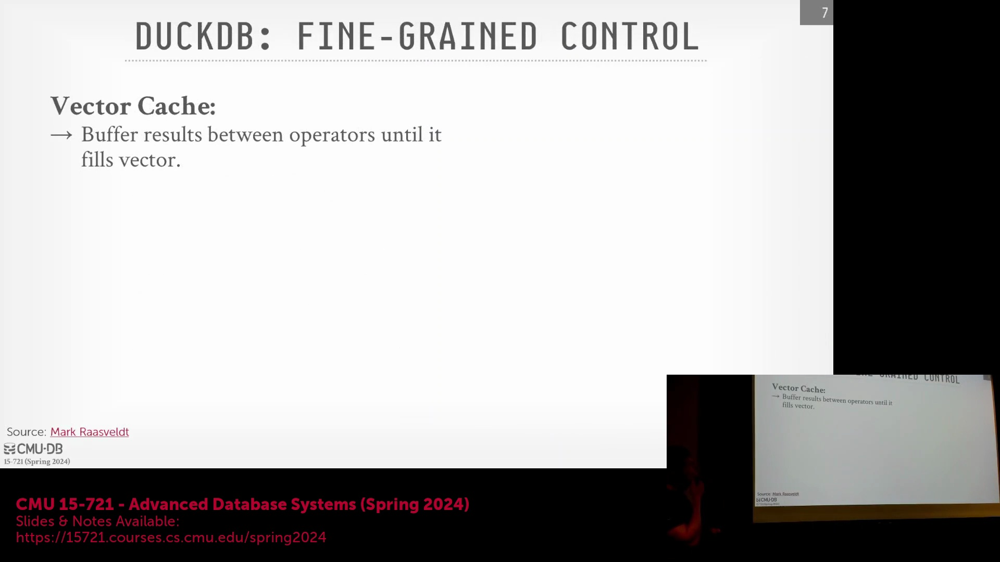
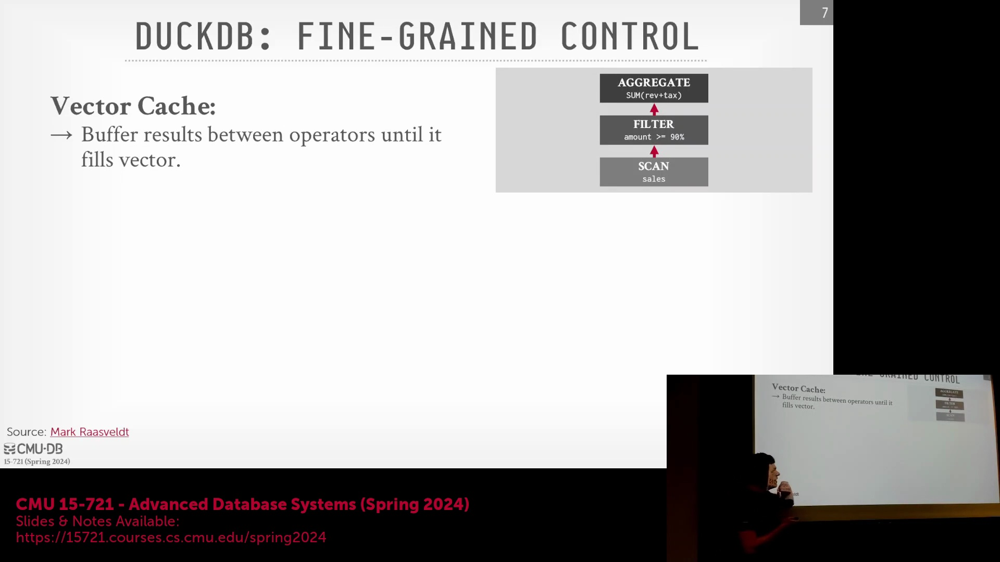
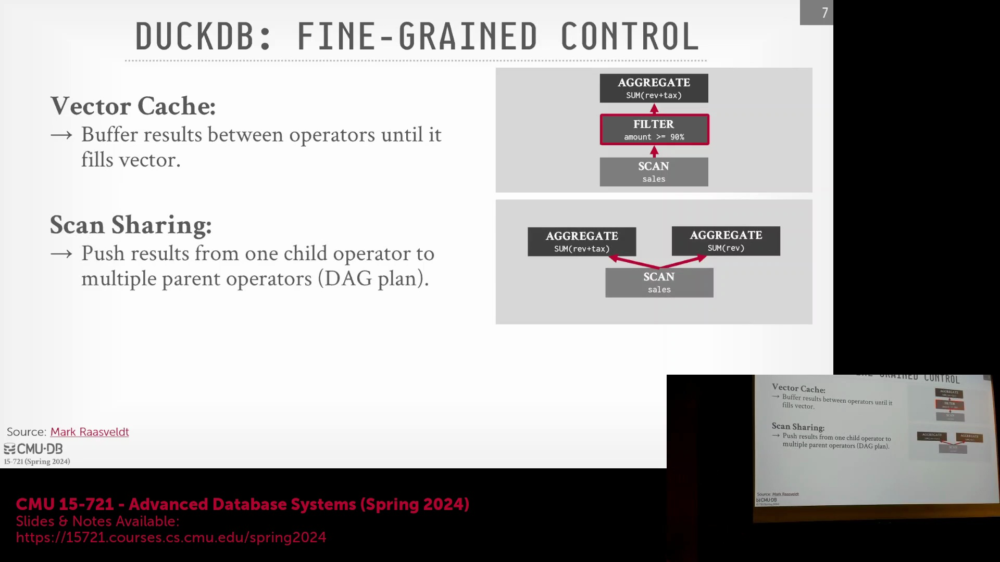
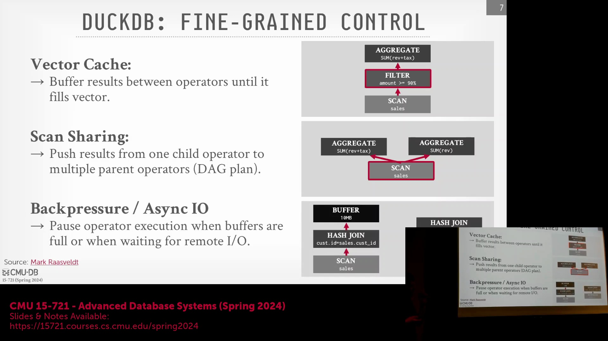
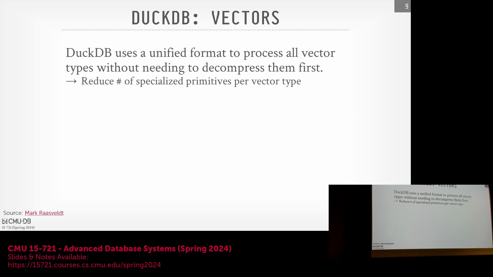
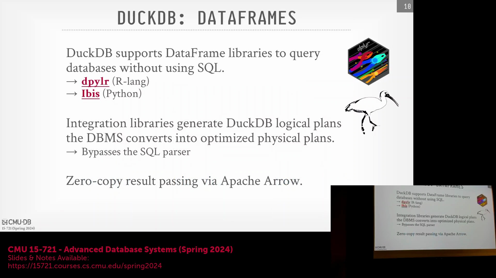

## 课程简介与向单节点系统的转变
卡内基梅隆大学(Carnegie Mellon University)的高级数据库系统(Advanced Database Systems)课程在演播室现场观众面前录制。今天的讨论聚焦于 DuckDB(DuckDB)，这与近几周涵盖的分布式云数据仓库(Distributed Cloud Data Warehouses)形成了鲜明对比。虽然现代系统通常运行在庞大的云基础设施之上，但 DuckDB 主要设计为在单节点(Single-Node)上运行。稍后，我们将探讨 MotherDuck(MotherDuck) 如何利用云端算力来执行查询，而无需将查询分发(Distribute Queries)至分布式集群中。

## 选择云端数据仓库：生态系统契合度与用户体验
上节课我们探讨了 Snowflake 与 Dremel(Dremel)，它们作为经典的云原生 OLAP 引擎(Cloud-Native OLAP Engines)，具备预编译原语(Pre-compiled Primitives)、推送式执行模式(Push-based Execution Model)以及存算分离(Compute-Storage Separation)的特性。在评估 Snowflake、Databricks、BigQuery 和 Redshift 等现代平台时，数据工程(Data Engineering) Reddit 社区给出了一条实用的经验法则：选择与现有基础设施相匹配的平台。若基于 GCP(Google Cloud Platform) 则选用 BigQuery，基于 AWS(Amazon Web Services) 则选用 Redshift，若已深度依赖 Spark(Apache Spark) 则选择 Databricks，若预算充足且优先考虑卓越体验则选择 Snowflake。Snowflake 的关键差异化优势(Key Differentiator)在于其更加简洁直观的用户体验。为维持这种简洁性，Snowflake 向用户暴露的调优参数(Tuning Parameters)极少（通常仅包括计算资源规格和自动扩缩容(Auto-scaling)），而其内部却维护着数百个隐藏参数。数据库工程师在幕后进行即时调优，刻意将用户与复杂的底层配置隔离开来。

## 自适应调优、性能稳定性与工程生态
在大规模场景下管理内部调优需要一种自适应(Adaptive)的设计理念。现代系统不再依赖手动配置参数，而是旨在动态适应工作负载(Workloads)；尽管这会带来更大的工程开销(Engineering Overhead)，但显著提升了系统的稳健性(Robustness)。在探讨为何 Redshift 等某些平台会收到褒贬不一的评价时，问题往往不在于核心架构(Core Architecture)，而在于面向用户的调试与诊断工具(Debugging & Diagnostics Tools)、重复执行时的性能可重复性(Performance Reproducibility)以及整体使用体验。这些观察虽有时带有轶事(Anecdotal)色彩，但在数据工程社区中已被广泛讨论。除了纯粹的系统性能外，与更广泛的数据流水线(Data Pipelines)以及 Apache Airflow(Apache Airflow) 和 dbt(dbt) 等工具的无缝集成，也极大地影响着实际应用中的系统采用率(Adoption Rate)和用户满意度。

## DuckDB 的起源：从 MonetDB Lite 中汲取经验
为了理解 DuckDB 的诞生背景，我们回顾了其先驱论文《*Don’t Hold My Data Hostage*（别把我的数据当人质）》，该研究源于构建 MonetDB(MonetDB) 嵌入式版本 MonetDB Lite(MonetDB Lite) 的尝试。MonetDB 是一款早期的学术型列式数据库(Academic Column-Store Database)，需要传统的安装部署、参数配置以及通过 JDBC(Java Database Connectivity) 进行网络连接。然而，数据科学家(Data Scientists)更倾向于将原始 CSV(CSV) 或 Parquet(Parquet) 文件下载至本地，直接使用 Python 或 R 语言进行处理，从而绕过数据库查询优化器，转而依赖 Pandas(Pandas) 等相对低效的内存处理库。研究团队的目标是创建一个进程内(In-Process)、嵌入式(Embedded)的版本，以彻底消除网络开销(Network Overhead)，并将列式存储的高效性能直接引入数据工作流(Data Workflows)中。然而，MonetDB 积累了十余年的遗留代码(Legacy Code)，架构过于庞杂难以精简，这最终促使荷兰数学与计算机科学研究学会(CWI)的研究人员决定从零开始(From Scratch)构建一个全新的系统。

## DuckDB 的核心理念：“分析领域的 SQLite”愿景
DuckDB 是一款专门从零设计打造的嵌入式、进程内或“无服务端(Serverless)”数据库系统，旨在直接对任意可访问的数据文件执行高效的 SQL 查询。其 SQL 方言(SQL Dialect)基于 PostgreSQL(PostgreSQL) 语法，并在演进过程中融入了许多 DuckDB 专属的易用性优化(Usability Enhancements)，例如简化的查询语法。该项目的核心定位极为明确：致力于成为“分析领域的 SQLite(Analytics SQLite)”。尽管 SQLite(SQLite) 作为无处不在的嵌入式数据库，在消费级设备、物联网(IoT)及航空航天等领域的事务型工作负载(Transactional Workloads)中占据主导地位，但 DuckDB 力求复制其广泛的普及度，并专门针对高性能分析处理(High-Performance Analytical Processing)进行了底层优化。尽管学术界曾探索过多种提升 SQLite 分析查询能力的改进方案，但 DuckDB 仍是目前专为该垂直领域量身打造的最优系统。

---

## 自定义 C++ (C++) 实现与轻量级设计

DuckDB 的一项核心设计决策是全面采用自主编写的 C++ 代码。除加密 (Encryption) 和安全套接字层 (SSL, Secure Sockets Layer) 等关键且难以独立实现的模块外，团队刻意避免引入任何第三方依赖 (Third-Party Dependencies)。这种自包含 (Self-Contained) 的架构显著降低了系统的依赖膨胀问题，简化了工程维护，并使其能够无缝编译为 WebAssembly (WebAssembly/WASM)。与通常需要在浏览器环境中进行复杂适配才能高效运行的 SQLite (SQLite) 或 PostgreSQL (PostgreSQL) 不同，DuckDB 的原生架构使其几乎无需修改即可在 WASM 环境中流畅执行。

## 面向核心功能的扩展生态系统 (Extension Ecosystem)
为了在不损害核心运行时 (Core Runtime) 轻量级特性的前提下扩展系统能力，DuckDB 采用了模块化 (Modular) 的扩展 (Extension) 生态系统。用户可通过安装官方或第三方扩展来添加专项功能。该设计在确保基础引擎精简且易于维护的同时，提供了按需集成附加功能的灵活性。

## 嵌入式 (Embedded) 与无服务器 (Serverless) 架构
DuckDB 作为一个真正的嵌入式数据库运行，采用“全共享 (Shared-Everything)”架构，而非存算分离 (Compute-Storage Separation) 模式。它直接运行于宿主进程的地址空间内，形态更接近进程内库 (In-Process Library) 而非独立服务器。这种类无服务器 (Serverless) 的特性意味着引擎在空闲时会自动缩减资源占用，避免了维持持久化后台进程的开销。与传统嵌入式数据库（通常将执行严格限制在调用线程内）不同，DuckDB 能够在宿主进程的内存空间中独立调度与管理工作线程，从而实现了更高效的资源利用。

## 核心查询处理特性
该系统引入了多项高级执行特性，其中最显著的是基于推送 (Push-Based) 的向量化 (Vectorized) 查询处理模型。该模型利用预编译 (Pre-Compiled) 的查询原语 (Query Primitives)，并结合 SIMD (Single Instruction, Multiple Data) 指令（借助 MOCC）以实现极致性能。DuckDB 采用数据块驱动 (Morsel-Driven) 的并行机制，将工作负载高效分发至多个 CPU 核心，使其即便在核心数众多的单台标准机架服务器（俗称“Pizza Box”服务器）上也能表现卓越。这与通常仅依赖单线程执行查询的 SQLite 形成鲜明对比。此外，DuckDB 支持展开任意子查询以及横向连接 (Lateral Joins) 等高级操作，使其性能与功能足以与 HyPer 和 Umbra 等高度优化的研究型数据库系统比肩。

## 优化、连接 (Join) 与子查询处理
DuckDB 实现了标准的连接算法（涵盖排序合并连接 (Sort-Merge Join) 与哈希连接 (Hash Join)），并由分层查询优化器 (Hierarchical Query Optimizer) 进行统筹指导。在处理缺乏预收集统计信息 (Statistics) 的任意文件时，优化器主要依赖基于规则 (Rule-Based) 的启发式 (Heuristic) 策略来确定高效的连接顺序与执行计划。近期的开发工作已全面集成对各类子查询的支持，显著提升了系统的 SQL (Structured Query Language) 兼容性与数据分析灵活性。

## 向基于推送的执行模型过渡
最初，DuckDB 采用的是基于拉取 (Pull-Based) 的向量化执行模型。然而随着系统演进，该模型被证明难以维护：添加新的并行算子 (Parallel Operators) 需要对控制面 (Control Plane) 进行大量重构。更为关键的是，基于拉取的模型在处理远程数据源 (Remote Data Sources)（如 HTTPS、S3 (Amazon Simple Storage Service)）时面临严峻挑战。由于执行状态 (Execution State) 与调用栈 (Call Stack) 深度绑定，任何阻塞式 I/O (Blocking I/O) 操作都会导致整个线程挂起，使系统无法暂停当前任务并切换至其他就绪的执行管线 (Execution Pipeline)。

转向基于推送的架构彻底突破了这些工程瓶颈。新架构引入了集中式调度器 (Centralized Scheduler) 来统一管理数据块 (Morsels)，使系统能够主动调度就绪任务，同时优雅地挂起等待网络或磁盘 I/O 的任务。这一架构转型大幅提升了系统性能与代码可维护性，在数据源可用性不稳定或存在延迟的场景下，其优势尤为显著。

此次架构过渡由联合创始人 Mark 通过单个 Pull Request (PR) 完整实现。该提交彻底移除了旧版基于拉取的基础设施，并全面替换为全新的基于推送的调度器。

## 开发背景与学术环境
此次重大架构转型之所以能够快速且连贯地落地，得益于 DuckDB 背后荷兰研究机构 CWI (Centrum Wiskunde & Informatica) 独特的组织模式。与传统大学院系中常见的僵化层级结构不同，CWI 作为一个高度协作的研究中心运作，其开发者与研究人员将大量精力直接投入于编写生产级 (Production-Grade) 开源代码。这种独特的产学研环境，促成了前沿数据库研究高效、直接地转化为一个健壮且高性能的数据库系统。

---

## 学术环境与发展速度

DuckDB 快速的开发节奏与宏大的架构演进，与欧洲学术模式密切相关，具体体现在荷兰数学与计算机科学研究所(CWI, Centrum Wiskunde & Informatica)的运作机制上。与美国学术体系中常见的资金限制及高昂人力成本可能制约工程带宽不同，CWI 作为一种独特的研究机构模式，允许博士生全职投入生产级(Production-Grade)系统的开发。得益于这种环境，联合创始人 Mark 能够通过一个内容详实的拉取请求(Pull Request/PR)，独立完成从基于拉取(Pull-Based)到基于推送(Push-Based)执行模型(Execution Model)的完整架构设计与实现。这充分展示了结构化的学术支持如何有效加速开源数据库系统的创新。

## 基于推送的调度所启用的优化

转向基于推送的执行模型，解锁了多项在传统基于拉取(`GetNext()`迭代器)架构下难以实现或存在根本局限的高级优化(Advanced Optimizations)。借助集中式调度器(Centralized Scheduler)，DuckDB 获得了对执行管线(Execution Pipeline)状态的显式控制能力。这不仅实现了动态背压(Backpressure)管理，还支持灵活的算子融合(Operator Fusion)。系统不再强制算子传递尺寸低效（如半满）的数据向量(Data Vectors)，而是可暂停执行、缓冲中间结果，仅在凑齐最优大小的数据块(Morsels)时才恢复处理，从而显著提升了 CPU 缓存命中率与向量化(Vectorized)执行效率。

## DAG 执行与扫描共享

由于查询计划(Query Plan)被组织为有向无环图(DAG, Directed Acyclic Graph)，基于推送的架构天然支持扫描共享(Scan Sharing)与多父算子(Multi-Parent Operator)执行。单个扫描算子(Scan Operator)能够填充共享缓冲区(Shared Buffer)，并同时为多个下游分支提供数据。集中式协调器(Centralized Coordinator)智能管理任务依赖关系，仅在目标缓冲区完全填充后才触发父任务，并无缝切换至其他就绪的执行管线。这彻底摆脱了传统基于拉取的迭代模型(Iterative Model)中固有的“单一父节点绑定单一子节点”的僵化约束。

## 内存管理与异步远程 I/O

该架构还通过强制执行可配置的缓冲区限制(Buffer Limits)，为防止内存膨胀(Memory Bloat)提供了坚实的保护机制。若某条管线生成数据的速度超过下游算子(Downstream Operators)的消费速度，调度器将自动暂停上游任务，直至下游释放可用容量。其核心优势在于，控制流(Control Flow)与数据流(Data Flow)的彻底解耦，极大简化了针对远程数据源（如 HTTP 或 Amazon S3(Simple Storage Service)）的异步 I/O(Asynchronous I/O)处理。DuckDB 无需再在网络数据抓取期间阻塞执行线程（在基于拉取的模型中，这通常需要复杂的状态管理），而是转为在后台异步执行 I/O、填充缓冲区，待数据就绪后自动恢复查询执行。

## 中间结果向量编码

为优化算子间的数据传输(Inter-Operator Data Transfer)，DuckDB 针对内存中的中间结果采用了专门的轻量级编码(Lightweight Encoding)，这与高度压缩的磁盘存储格式(On-Disk Storage Format)截然不同。系统在运行时动态采用四种主要向量类型(Vector Types)：**Flat**（标准未压缩列式布局）、**Constant**（常量向量，仅存储单个值以表示重复数据）、**Dictionary**（字典编码向量，将值映射至索引偏移量）以及 **Sequence**（序列向量，针对主键或时间戳等递增模式进行增量编码）。引擎在执行过程中实时检测数据模式，以最大限度地降低内存带宽(Memory Bandwidth)占用并提升处理吞吐量。

## 统一向量格式与原语编译

若为所有数据类型均支持多种向量编码，将导致预编译执行原语(Pre-compiled Execution Primitives)出现组合爆炸(Combinatorial Explosion)，严重拖慢编译时间并膨胀二进制文件体积。DuckDB 通过将 Flat、Constant 和 Dictionary 向量标准化为**统一向量格式(Unified Vector Format)**来化解这一难题。通过将这些类型抽象为“数据载荷(Data Payload) + 选择向量(Selection Vector)”（实质上将其统一视为字典编码的变体），执行原语可直接处理各类编码，无需承担高昂的解码(Decoding)或内存复制(Memory Copy)开销。尽管序列向量仍可能需要额外的展开(Unpacking)处理，但这种统一方法在维持高性能的同时，确保了代码库(Codebase)的精简与可维护性。其内存布局在设计阶段便有意与 Meta 的 Velox 项目保持对齐，旨在促进跨生态系统的互操作性(Interoperability)。

## 与 Python 和 R 数据科学工作流的集成

DuckDB 无缝衔接了传统关系型数据库(Relational Database)与现代数据科学生态系统(Data Science Ecosystem)。它为 Python 和 R 提供了原生集成库(Native Integration Libraries)，使数据科学家能够直接使用熟悉的 DataFrame API（如 Pandas API）进行开发。这些高层数据操作调用会被透明地转换为优化后的 SQL(Structured Query Language) 查询，并由 DuckDB 直接在宿主进程(Host Process)内存中执行。该方法将 DataFrame 操作直观且富有表现力的语法，与专用分析型数据库引擎(Analytical Database Engine)的高性能、SQL 兼容性及嵌入式(Embedded)特性进行了完美结合。

---

## Python 与 R 生态系统集成

DuckDB 为 Python(Python) 和 R(R) 提供了原生集成库，并深度适配了 dplyr(dplyr) 和 ibis(ibis) 等数据操作框架。这些 API 提供了以 DataFrame(DataFrame) 为核心的编程式数据操作范式，其使用体验与 PySpark(PySpark) 等分布式计算框架高度一致。本质上，这些 DataFrame API 是对表结构与关系代数(Relational Algebra)操作的直观、高层封装，使数据科学家能够在熟悉的编程环境中无缝进行开发。

## 直接逻辑计划转换与零拷贝数据交换

这些集成库并非简单地将 DataFrame 方法调用转译为原始 SQL 字符串，而是直接将操作映射为 DuckDB 内部的逻辑计划(Logical Plan)表示。随后，该计划会被送入优化器以生成物理执行计划(Physical Execution Plan)，其处理流程与解析后的 SQL 查询完全一致。关键在于，该集成基于 Apache Arrow(Apache Arrow) 内存标准构建，实现了真正的零拷贝(Zero-Copy)数据交换。由于 DuckDB 以进程内(In-Process)模式运行，与 Python 或 R 共享同一进程地址空间，数据缓冲区可以直接共享传递，无需承担高昂的序列化(Serialization)、反序列化(Deserialization)或内存拷贝(Memory Copy)开销。这一设计完美契合了“不要扣押我的数据(Don't Hold My Data Hostage)"的核心理念。

## 桥接数据科学工作流与 OLAP 性能

该架构精准解决了数据科学工作流中的一个核心痛点：数据科学家通常更偏爱 Jupyter Notebook(Jupyter Notebook) 与 DataFrame 语法，而非传统 SQL，且重写现有代码库往往不切实际。通过拦截 DataFrame 调用并将其直接路由至 DuckDB 高度优化的联机分析处理(OLAP, Online Analytical Processing)引擎，用户既能保留 Pandas(Pandas) 直观且富有表现力的语法优势，又能获得企业级查询性能。这使得用户能够直接在 Notebook 中高效处理大规模 Parquet(Parquet) 文件，彻底告别通过低效的 JDBC/ODBC(JDBC/ODBC) 驱动提取数据的繁琐过程，也无需再将基于行(Row-Based)的结果集手动转换为列式(Columnar)格式。

## 专有单文件存储架构
与 SQLite(SQLite) 类似，DuckDB 的核心数据库采用专有的单文件数据库格式进行存储。数据更新操作由预写日志(WAL, Write-Ahead Logging)机制严格管理；在执行复杂查询时，若内存不足，中间临时数据会根据需要动态溢出(Spill)至独立磁盘文件中。该存储格式完全围绕列式存储(Columnar Storage)构建，其行组(Row Group)通常包含约 120,000 个元组(Tuples)。需要强调的是，尽管内存中的计算优先采用轻量级向量格式以追求极致的 CPU 执行效率，但磁盘持久化格式则采用了更高压缩比的策略，以最大限度地降低存储开销。

## 自适应列式压缩与基准测试

在数据插入或加载阶段，DuckDB 会执行轻量级扫描以分析各列的数据分布特征。引擎内置的评估算法会自动为每一列匹配最高效的编码方案，并广泛采用位打包(Bit-Packing)与参考帧编码(Frame of Reference, FOR)等技术。随着版本迭代，DuckDB 持续扩展其压缩算法库，引入了专为浮点数优化的先进算法（如 ALPS）。在 TPC-H、NYC Taxi、OnTime 等标准基准数据集(Benchmark Datasets)上的测试对比表明，这种自适应的逐列压缩策略在压缩率与查询性能上，均显著优于 Snappy(Snappy) 或 Zstandard(Zstandard) 等 Parquet(Parquet) 常用基础压缩算法。

## 对外部文件格式的支持

尽管 DuckDB 的自有存储格式针对内部数据管理与极致查询性能进行了深度优化，但系统依然保持了对多种外部数据格式的强兼容读取能力。这种架构灵活性确保了用户无需进行繁琐的数据预转换，即可直接无缝查询以行业标准格式存储的数据集，同时充分享受 DuckDB 基于推送的向量化(Push-Based Vectorized)执行引擎带来的高速分析处理优势。

---

## 外部数据源与数据库附加

DuckDB 原生支持读取 Parquet(Parquet) 和 Apache Arrow(Apache Arrow) 等行业标准的列式格式(Columnar Formats)，但其真正的灵活性体现在能够直接附加(Attach)外部数据库系统。用户可以无缝附加 SQLite(SQLite) 数据库，使其数据目录(Catalog)和模式(Schema)在 DuckDB 环境中完全暴露，且本地与外部数据库的查询体验完全一致。同样，DuckDB 也能通过网络协议连接 PostgreSQL(PostgreSQL) 实例，允许直接对远程表执行分析型查询(Analytical Queries)。该系统会智能管理数据流，通常倾向于将数据摄取(Ingest)至 DuckDB 高度优化的进程内(In-Process)引擎中，而非依赖响应较慢的远程联机事务处理(OLTP, Online Transaction Processing)执行。

## 扩展生态系统与性能关键型库
为保持核心二进制文件(Core Binary)的精简并最大限度减少第三方依赖(Third-Party Dependencies)，DuckDB 采用了模块化(Modular)的扩展(Extension)架构。诸如对国际化(Internationalization)、时区处理(Timezone Handling)和复杂日期格式化至关重要的 ICU 库(International Components for Unicode)等功能，均以官方扩展形式提供，而非直接内置于核心中。HyPer(HyPer) 团队的一则轶事生动说明了高度优化的自定义实现为何关键：该团队曾在客户会议前夕紧急重写 ICU 逻辑，以解决严重的性能瓶颈(Performance Bottleneck)。扩展以共享对象(Shared Objects)形式加载，并实现特定的入口点 API(Entry Point API)。其工作机制类似于 PostgreSQL 的 `contrib` 模块或第三方插件(Plugins)，支持按需动态加载(Load On-Demand)或启用。

## 内存分配与多核可扩展性
内存管理(Memory Management)是 DuckDB 基础设施设计中的关键考量。高性能分析型系统通常避免使用标准的 `libc malloc()`，因其固有的锁开销(Lock Overhead)会严重制约多线程工作负载(Multi-Threaded Workloads)。相反，DuckDB 及同类引擎默认采用 `jemalloc`(jemalloc)（有时亦使用 `tcmalloc`(tcmalloc)）。该类内存分配器(Memory Allocator)利用细粒度闩锁(Fine-Grained Latches)与更小的临界区(Critical Sections)，能够高效扩展(Scalability)至数十个 CPU 核心。尽管 `jemalloc` 会积极预分配(Pre-Allocate)内存，且可能比标准 `libc` 占用更多虚拟内存(Virtual Memory)，但其卓越的可扩展性与更低的资源争用(Resource Contention)已使其成为现代数据库系统的行业标准，确保并行查询(Parallel Queries)能够顺畅执行，且免受操作系统底层机制的干扰。

## MotherDuck 云计划

MotherDuck(MotherDuck) 云服务代表了 DuckDB 进军云分析(Cloud Analytics)领域的战略举措，且并未妥协其原有的嵌入式(Embedded)设计理念。与 Snowflake(Snowflake) 等从零构建完全存算分离(Compute-Storage Separation)架构的数据仓库不同，创始团队将 MotherDuck 作为独立初创公司推出，专门提供“远程计算层(Remote Compute Layer)"。该方案在提供云端托管执行环境(Cloud-Hosted Execution Environment)的同时，完整保留了 DuckDB 轻量级、单节点(Single-Node)的核心哲学。它有效弥合了本地开发(Local Development)与云端大规模数据处理(Cloud-Scale Data Processing)之间的鸿沟，使用户能够充分调用云端资源，而无需放弃熟悉的 DuckDB 客户端。

## 混合查询执行与目录同步

通过安装官方扩展并使用 API 密钥(API Key)进行身份认证，用户可以无缝集成 MotherDuck。连接建立后，MotherDuck 会将其远程目录(Remote Catalog)与文件元数据(File Metadata)直接同步至本地 DuckDB 实例，使用户能够像查询本地文件一样操作云端托管的数据集。该架构智能地拆分了查询执行(Query Execution)流程：本地客户端会根据查询特征智能判定，哪些算子操作应通过网络下推(Push-Down)至 MotherDuck 的远程服务器执行，哪些应在本地处理。这种混合路由模型(Hybrid Routing Model)通过利用云端算力处理计算密集型任务(Compute-Intensive Tasks)来优化整体性能，同时确保用户体验与本地 DuckDB 环境保持无缝衔接。

---

## 无缝云端集成与统一的开发者体验

DuckDB 的云端扩展(Cloud Extension)解决了一个常见的工作流痛点(Workflow Pain Point)：在本地分析型负载(Analytical Workloads)与 Google BigQuery(BigQuery) 等托管型云数据仓库(Managed Cloud Data Warehouse)之间频繁切换。通过保持完全一致的客户端接口(Client Interface)（如 SQL、Python 或通过 `ibis`(Ibis)/`dplyr`(dplyr) 的 R 语言接口），用户在编写查询(Query)时无需关心底层的具体执行位置(Execution Location)。当数据集(Dataset)规模过大时，系统会自动将操作无缝路由(Routing)至云端，使用户在保留熟悉本地开发环境(Local Development Environment)的同时，能够充分利用远程计算能力(Remote Compute Power)。这有效消除了上下文切换(Context Switching)、语法兼容性(Syntax Compatibility)问题，以及在本地与云端联机分析处理(OLAP, Online Analytical Processing)系统间迁移时常见的运维开销(Operational Overhead)。

## 混合查询执行与桥接算子

为实现这一混合执行模式(Hybrid Execution Model)，DuckDB 在其查询计划(Query Plan)中引入了专门的“桥接算子(Bridge Operator)”。在标准查询规划(Standard Query Planning)完成后，系统会触发第二轮优化以评估数据局部性(Data Locality)。引擎采用基于成本(Cost-Based)的启发式策略(Heuristics)，将优化重心放在数据传输量(Data Transfer Volume)而非计算复杂度(Computational Complexity)上，从而智能决策是将远程数据拉取(Pull)至本地，还是将本地执行管线(Execution Pipeline)推送(Push)至云端。例如，在执行小型本地表与海量远程表的连接(Join)操作时，系统会触发本地客户端通过网络上传本地数据，交由远程 DuckDB 实例完成高效的哈希连接(Hash Join)。得益于基于推送(Push-Based)的执行模型，该跨节点交互过程异常流畅。该模型将控制流(Control Flow)与数据流(Data Flow)彻底解耦，使得执行管线能够安全暂停、异步传输数据并自动恢复执行，完全免除了复杂的调用栈(Call Stack)管理负担。

## 架构对比：存储扩展与计算扩展

该架构清晰地凸显了 DuckDB 的云端方案与 Neon(Neon) 或 Amazon Aurora(Amazon Aurora) 等分布式数据库系统之间的显著差异。Neon 和 Aurora 通过解耦存储与计算(Compute-Storage Decoupling)，并将计算资源横向扩展(Horizontally Scale)至主节点与只读副本节点(Read Replicas)来提升性能；而 DuckDB 本质上仍坚守无共享架构(Shared-Nothing Architecture)的单节点(Single-Node)引擎定位。MotherDuck 并未为了分布式计算编排(Distributed Compute Orchestration)而重写核心引擎，而是选择在云端托管的 Docker 容器(Docker Container)中运行标准 DuckDB 实例，以执行完整的查询管线(Query Pipeline)。尽管该系统在理论上具备将单个查询拆分至多个云端节点执行的能力，但其设计优先考虑架构简洁性(Simplicity)：倾向于将完整的执行管线派发至单一云实例处理。这一策略在充分借力云端存储(Cloud Storage)与远程执行能力(Remote Execution Capabilities)的同时，完美保留了嵌入式引擎(Embedded Engine)轻量、敏捷的核心设计哲学。

## 时机、研究与开源的交汇

DuckDB 的快速普及(Rapid Adoption)得益于精准的市场时机(Market Timing)与卓越的工程执行力(Engineering Execution)的完美契合。其诞生恰逢行业技术风向再次转变，SQL(Structured Query Language) 重新确立为数据分析工作流的标准范式；DuckDB 精准契合了市场对高性能嵌入式(Embedded)联机分析处理(OLAP)引擎的迫切需求，而非盲目构建又一个分布式数据仓库(Distributed Data Warehouse)。更为关键的是，研发团队成功将 HyPer(HyPer) 和 Umbra(Umbra) 等学术系统的前沿研究成果(Cutting-Edge Academic Research)转化为实用、开源的工程级实现(Open-Source Engineering Implementation)。通过将先进的向量化执行(Vectorized Execution)、基于推送的调度器(Push-Based Scheduler)以及自适应压缩技术(Adaptive Compression Techniques)高度封装于轻量级库中，DuckDB 为数据科学社区(Data Science Community)提供了一个功能强大且支持本地运行(Local Execution)的 SQL 引擎，有效弥合了传统关系型数据库与现代基于 Python/R 的分析型工作流之间的技术鸿沟。

---

## DuckDB 获得现象级采用的背后因素

DuckDB 的迅速成功，源于其成功将 HyPer(HyPer) 和 Umbra(Umbra) 等学术系统中的前沿研究(Cutting-Edge Academic Research)转化为一款实用、开源的嵌入式分析引擎(Embedded Analytical Engine)。创始团队敏锐地捕捉到市场对轻量级、基于 SQL 的分析库的明确需求，该类引擎需能直接在宿主应用程序(Host Application)进程内运行。通过引入并优化成熟的向量化执行(Vectorized Execution)、预编译查询原语(Pre-compiled Query Primitives)以及基于推送的调度机制(Push-Based Scheduling)，团队交付了一套高性能系统。该系统在开发者(Developers)与数据科学家(Data Scientists)群体中引发强烈共鸣，充分证明了精心设计的嵌入式联机分析处理(OLAP, Online Analytical Processing)引擎正是行业当前的迫切需求。

## 纯内存数据库的衰落
在回顾更广泛的数据库发展趋势时，演讲者将 DuckDB 融合磁盘存储的架构(Hybrid Disk-Memory Architecture)与此前学术界（如卡内基梅隆大学 CMU(Carnegie Mellon University)）曾大力押注的纯内存架构(In-Memory Architecture)进行了对比。随着硬件技术的快速演进，纯内存愿景未能如预期般成为主流：固态硬盘(SSD, Solid State Drive)的性能呈指数级跃升，且成本大幅降低。因此，现代数据库系统已不再单纯依赖内存容量来提升性能。行业重心已转向针对 SSD 特性优化的存储架构，这使得传统的纯内存设计(Pure In-Memory Design)在处理通用工作负载(General-Purpose Workloads)时已基本过时。

## 实际应用与下节课预告：Yellowbrick
在日常数据分析任务中，DuckDB 现已成为业界首选工具。无论是处理 CSV(Comma-Separated Values) 文件还是执行快速数据探索(Exploratory Data Analysis)，它已在现代技术工作流中有效取代了 Microsoft Excel 或 Google Sheets 等传统电子表格软件(Spreadsheet Software)。讲座随后预告了下一讲的主题：Yellowbrick(Yellowbrick) 数据库系统。该学术系统于 2024 年正式发表，引入了商业数据库中较为罕见的高度专业化底层优化(Low-Level System Optimizations)。下一讲将深入探讨硬核性能工程(Hardcore Performance Engineering)，并辅以令人印象深刻的真实世界基准测试(Real-World Benchmarks)数据作为支撑，展现其与现有系统截然不同的设计哲学与性能表现。

## 轻松愉快的音乐尾声

本次课程最终以一段幽默且略带跑题的音乐片段轻松收尾。该片段包含随性的说唱(Freestyle Rap)歌词与轻松的闲聊，为高强度的技术讲解提供了有趣的调剂(Mental Break)。这段非正式(Informal)的结尾为 DuckDB 的系统概览画上了句号，随后课程将自然过渡至下一个数据库系统(Database System)的深入讲解。