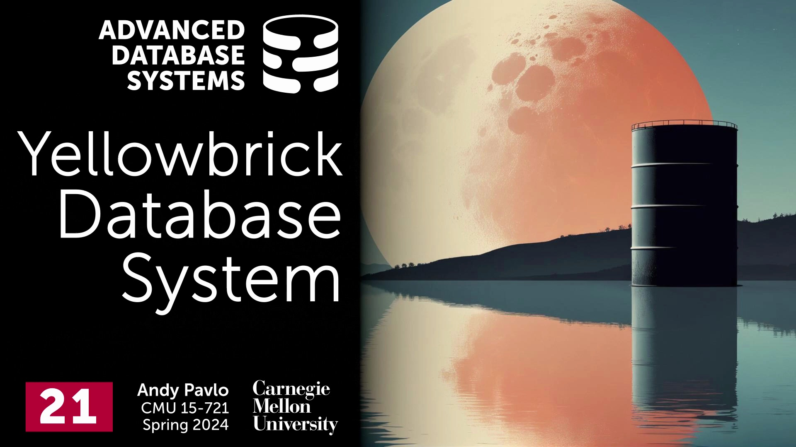
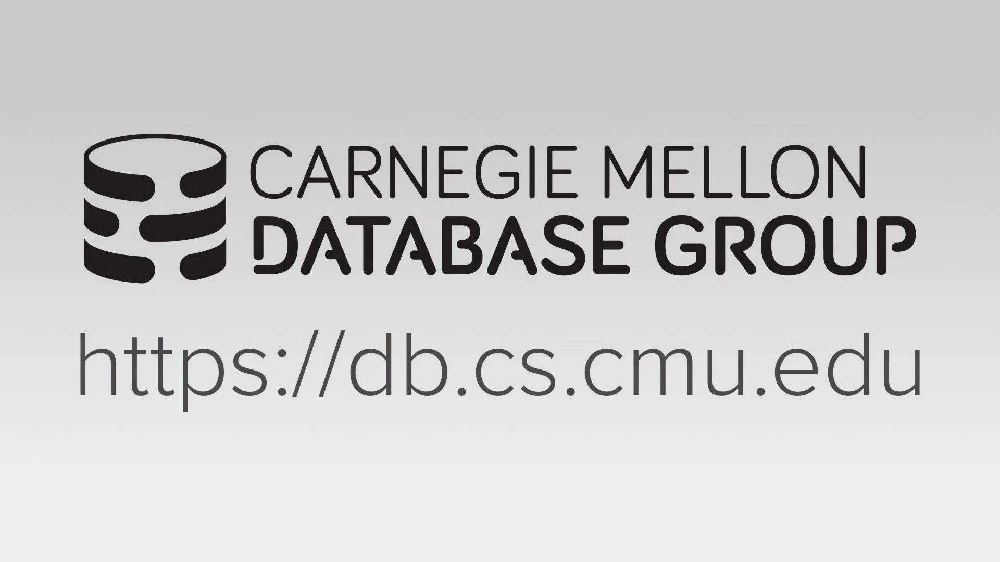
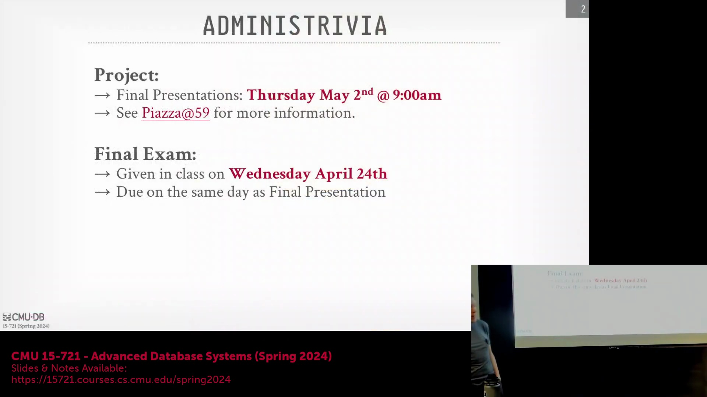
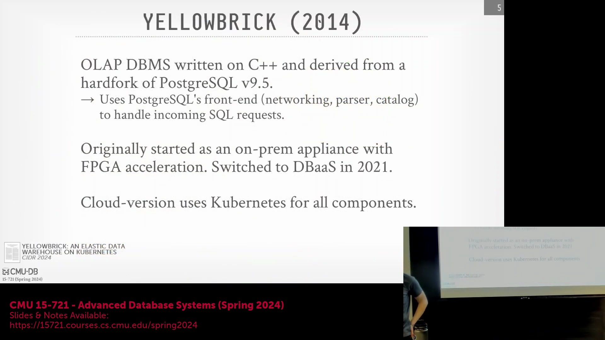

## 课程介绍与 Yellowbrick 概述

欢迎来到卡内基梅隆大学的高级数据库系统课程。今天的讲座将聚焦于 Yellowbrick，这是一个极具创新性且相对低调的数据库系统。该公司的技术方法不断突破工程边界，甚至实现了编写自定义 PCIe 驱动程序(PCIe Driver)等非常规解决方案。这为理解底层系统优化的极限，以及重新审视传统数据库工程的约束条件，提供了绝佳的案例研究。

## 课程通知：期末展示与考试

在深入技术细节之前，先发布几项重要的期末课程通知。期末项目展示定于下周四上午 9 点在本教室进行。请同学们填写已发布的早餐偏好问卷(Breakfast Preference Survey)，并查阅课程网站了解交付物的具体要求。每次展示限时 10 分钟，整体氛围将保持轻松。期末考试试卷将于周三在课堂上发放，截止日期与展示日相同，请以 PDF 格式提交。需要注意的是，本次考试为课后作答考试(Take-Home Exam)，重点考察对核心概念的内化及其在新场景中的应用能力，而非对课程内容的死记硬背(Rote Memorization)。

## 历史背景与数据库中的硬件加速
回顾上节课的内容，DuckDB 依然是一个极具代表性的单节点在线分析处理(OLAP)系统，但其云端版本 MotherDuck 似乎更侧重于垂直扩展(Vertical Scaling)，而非水平分片(Horizontal Sharding)。转向专用硬件领域，数据库利用图形处理器(GPU)和现场可编程门阵列(FPGA)等硬件加速器的历史源远流长，例如亚马逊 Redshift 就采用了定制的 Aqua 芯片。早在 20 世纪 70 年代和 80 年代，厂商们就构建了定制化的数据库一体机(Database Appliance)，以加速查询处理和网络通信。然而，中央处理器(CPU)（如 Intel 和 Motorola 产品）快速的迭代周期往往迅速削弱了这些定制芯片的性能优势，导致数据库专用硬件的研发逐渐式微。

## Yellowbrick 的一体机起源与 FPGA 集成
现代方案通常采用商用加速器或预配置的硬件一体机，例如 Oracle Exadata，这些设备针对特定工作负载对商用现成组件(COTS)进行了深度调优。Yellowbrick 最初正是沿用了这种一体机架构。其物理节点采用标准的固态硬盘(SSD)和中央处理器(CPU)，但集成了现场可编程门阵列(FPGA)加速器，用于卸载布隆过滤器(Bloom Filter)哈希计算、磁盘数据解压缩以及行存储转列存储(Row-to-Column Conversion)等计算密集型任务。Yellowbrick 近期工程实践及相关研究论文的核心动机，是成功将这套高度优化、硬件加速的系统从本地一体机迁移至云环境，同时完整保留其底层的性能优势。

## 底层系统优化与工程风险
Yellowbrick 成立于 2014 年，其云版本于 2020 至 2021 年间正式发布。该系统架构因大量非常规的底层优化，一经推出便常被与 ClickHouse 相提并论。Yellowbrick 实现了内核旁路(Kernel Bypass)技术并开发了自定义设备驱动程序(Custom Device Driver)，这对初创公司而言工程风险极高，但最终取得了成功。尽管微软等大型云提供商已利用网卡(Network Interface Card, NIC)上的 FPGA 进行数据包过滤(Packet Filtering)，但目前尚不清楚其他大型厂商在系统级调优(System-level Tuning)的深度上能否与 Yellowbrick 匹敌。团队勇于攻克此类复杂的基础设施工程挑战，使其在现代数据库领域中独树一帜。

## 云架构与 Kubernetes 部署

Yellowbrick 是一个在线分析处理(OLAP)系统，最初采用无共享架构(Shared-Nothing Architecture)，但在云端转型为共享磁盘架构(Shared-Disk Architecture)，并采用了类似 Snowflake 的客户端缓存(Client-Side Caching)机制。其核心代码库基于 PostgreSQL 9.5 分支开发，并全面采用 C++ 编写。系统保留了 PostgreSQL 的前端模块，用于处理 ODBC/JDBC 网络协议、SQL 解析(SQL Parsing)和目录管理(Catalog Management)；但在将查询计划交由专用编译器处理前，会注入自定义的优化阶段(Optimization Passes)。至关重要的是，其云部署高度依赖 Kubernetes 容器编排平台，所有组件均作为容器化服务(Containerized Services)运行。尽管部署于容器化环境中，Yellowbrick 依然保持着对底层硬件的深度控制能力，这正是支撑前述复杂优化的关键所在。本次讲座的剩余部分将专门聚焦于该云架构。