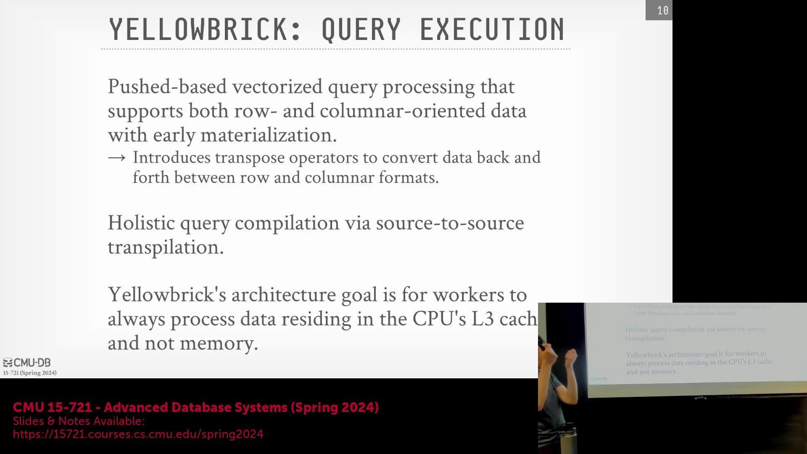
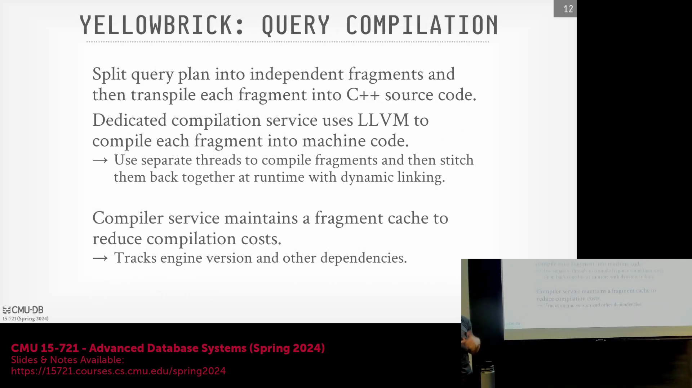
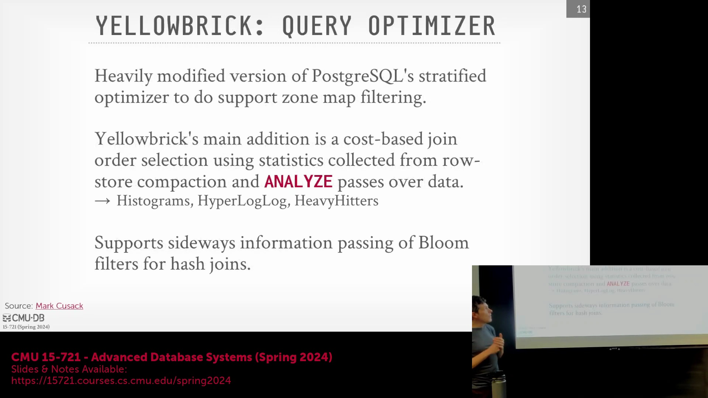
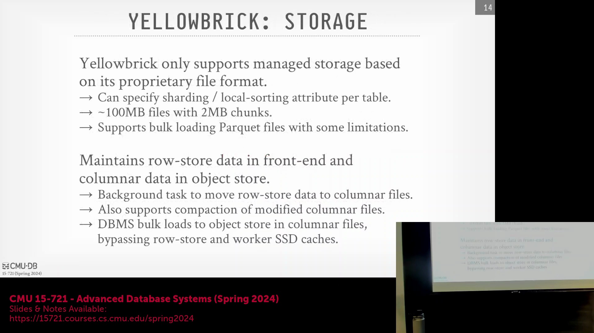

## 转置算子与 L3 缓存优化

Yellowbrick 在查询计划中策略性地注入了转置算子(Transpose Operator)，以便在执行哈希连接(Hash Join)或跨节点数据传输前，将列式数据转换为行式格式(Row Format)。该设计源于一种激进的优化理念，旨在最大化数据在中央处理器三级缓存(CPU L3 Cache)中的驻留率(Cache Residency)。通过将数据切分为较小的行数据块(Row Blocks)，系统确保处理单个元组(Tuple)所需的所有属性列都能完整驻留于 L3 缓存中。这一机制大幅降低了缓存未命中率(Cache Miss Rate)，实现了高效低延迟的数据处理，从而与那些仅依赖主内存(Main Memory)驻留的传统系统显著区分开来。

## 并行查询编译与编译器缓存

系统采用专用的独立编译服务(Compilation Service)执行全局查询编译，利用源到源转换(Source-to-Source Translation)技术将查询计划直接翻译为 C++ 代码。为突破 LLVM 单线程逐文件编译的性能瓶颈，Yellowbrick 主动将查询计划拆分为多个更小、相互独立的代码片段(Code Snippets)。这些代码片段随后在多线程环境下并发编译，最终通过动态链接(Dynamic Linking)重新组合。此外，编译服务内置了缓存层(Compiler Cache Layer)，只要运行时环境版本、硬件依赖(Hardware Dependencies)与查询结构(Query Structure)保持一致，系统即可缓存并复用已编译的二进制文件(Binary Artifacts)，从而大幅降低重复或相似查询的编译开销(Compilation Overhead)。

## 查询优化器扩展与托管统计信息

Yellowbrick 基于 PostgreSQL 的分层优化器(Hierarchical Optimizer)构建，并注入了专为该架构定制的代价模型扩展(Cost Model Extensions)与优化阶段(Optimization Passes)。系统利用区域映射(Zone Maps)进行激进的文件级数据剪枝(Data Pruning)，并维护详尽的元数据(Metadata)，包括列直方图(Histograms)、高频值(Heavy Hitters)列表以及 HyperLogLog 概率数据结构(HyperLogLog Sketches)。与开放式的湖仓一体(Lakehouse)架构不同，Yellowbrick 要求所有数据必须批量导入(Ingest)至其托管的存储环境中，而非直接查询外部的 Amazon S3 文件。这种受控的数据摄入(Data Ingestion)机制使系统能够执行深度的单节点 `ANALYZE` 统计信息收集操作，从而获取高精度的表级与列级统计信息(Table/Column Statistics)。尽管系统不采用运行时自适应查询执行(Runtime Adaptive Query Execution)，但开发团队会针对特定客户场景，偶尔部署硬编码的优化器规则(Hard-coded Optimizer Rules)，以规避 PostgreSQL 原生优化器的局限性，防止生成次优执行计划(Suboptimal Execution Plans)。

## 专有存储格式与后台合并压缩

尽管部署于共享磁盘(Shared-Disk)的云基础设施之上，Yellowbrick 仍对云对象存储(Cloud Object Storage)中的专有存储格式(Proprietary Storage Format)实施严格管控。数据文件被组织为约 100 MB 的段(Segments)，并进一步划分为 2 MB 的数据块(Data Blocks)。该格式支持用户自定义的分区键(Partition Keys)，并维护文件级的局部排序属性(Local Sort Properties)。尽管系统支持从 Parquet 文件批量导入数据，但对数据模式(Schema)实施严格限制，暂不支持嵌套 JSON 展开(Nested JSON Flattening)及复杂数据类型(Complex Data Types)。新插入的数据首先写入一个完全替换原生 PostgreSQL 实现的高性能自定义行式存储(Custom Row Store)中。随后，后台维护进程(Background Maintenance Processes)会持续从该行存中读取数据，执行转置与格式转换，最终将合并压缩(Compacted and Compressed)后的列式文件直接持久化至云存储层。