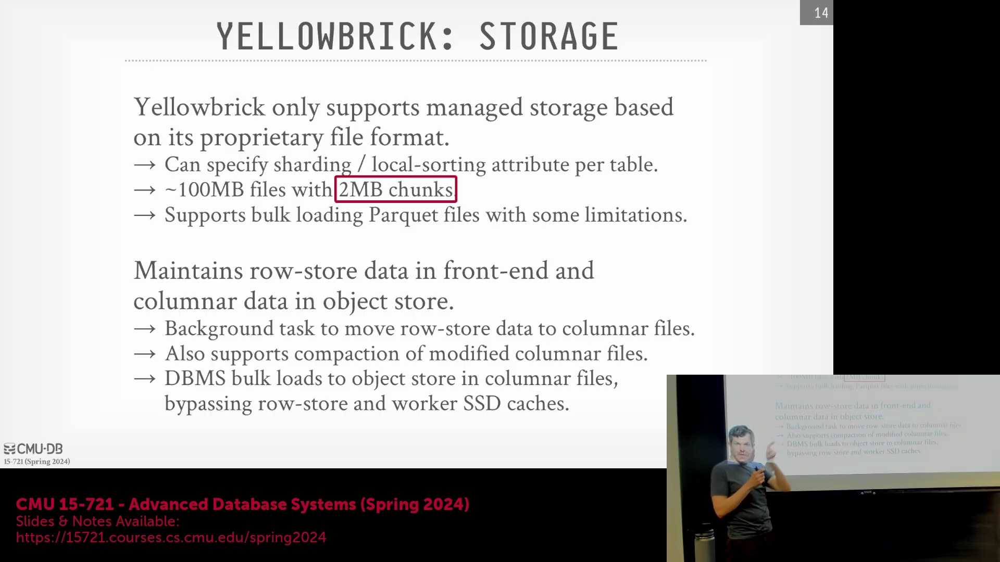
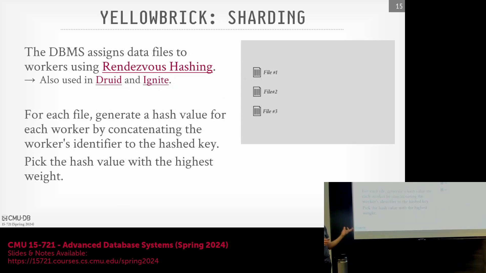
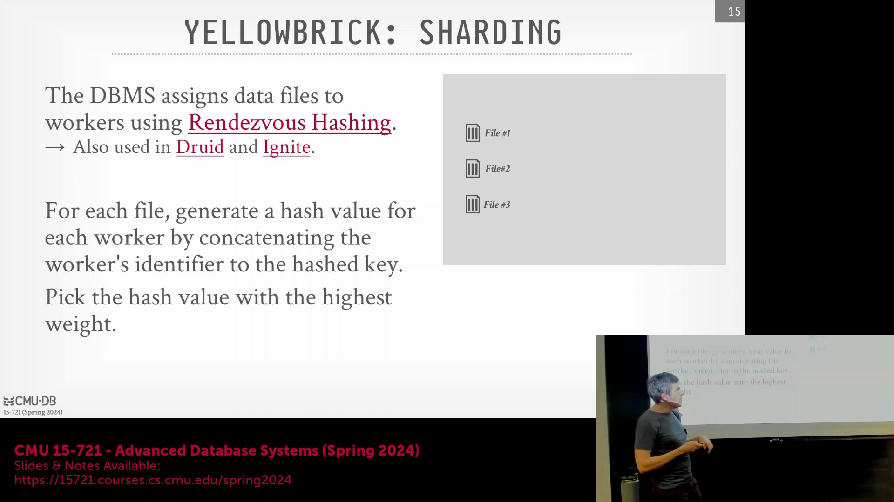
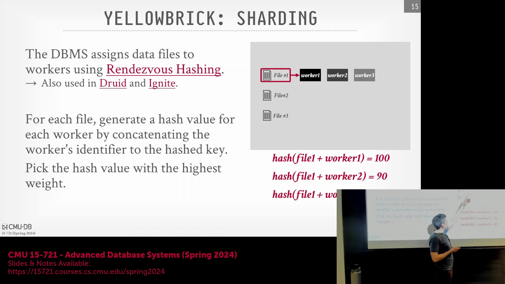
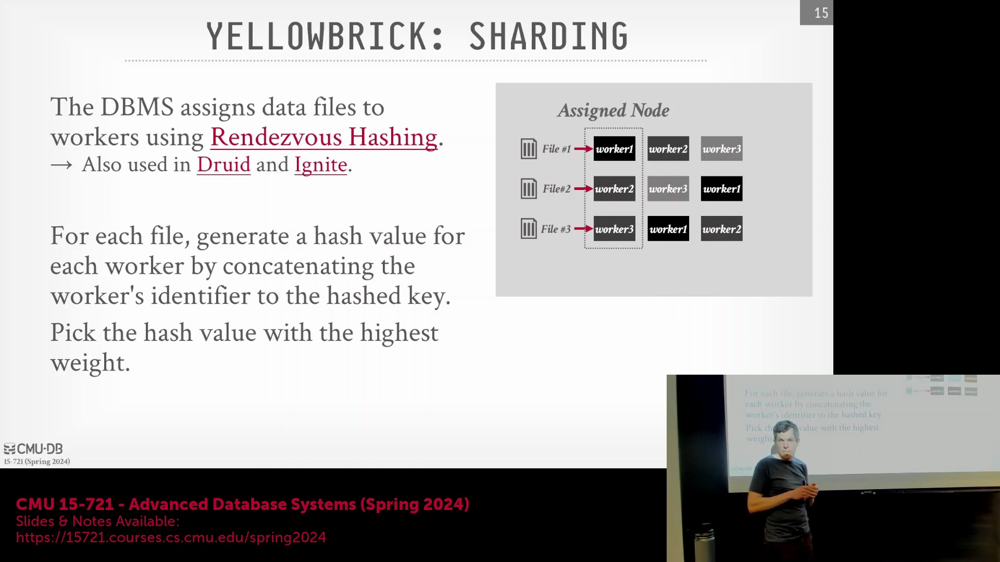
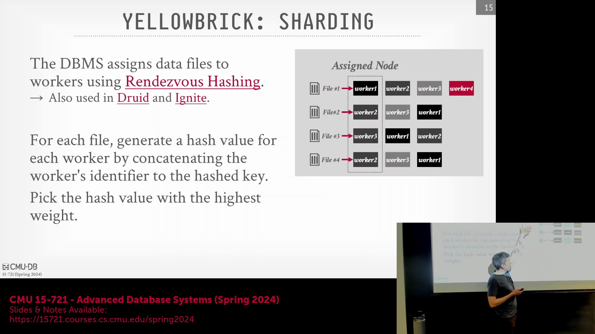
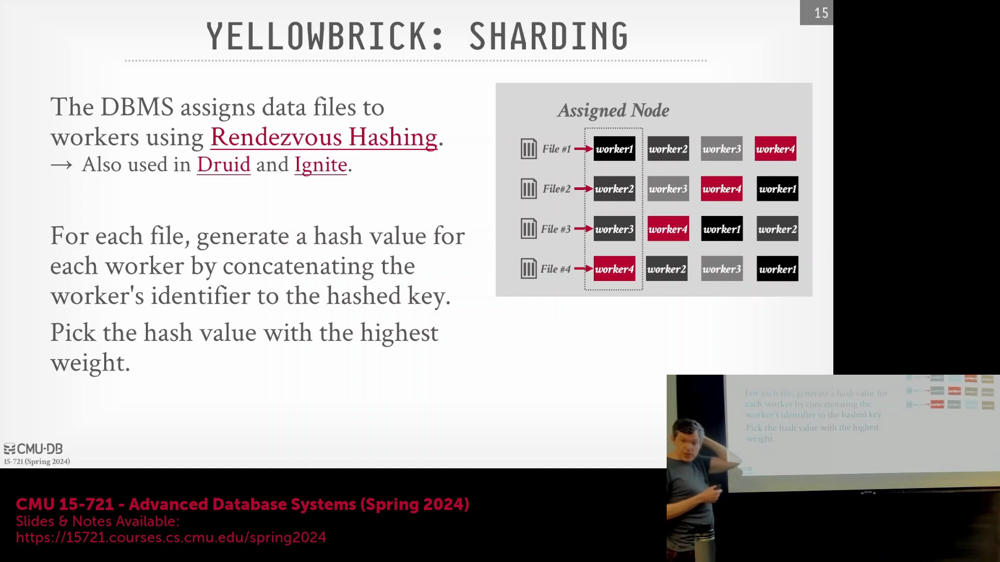
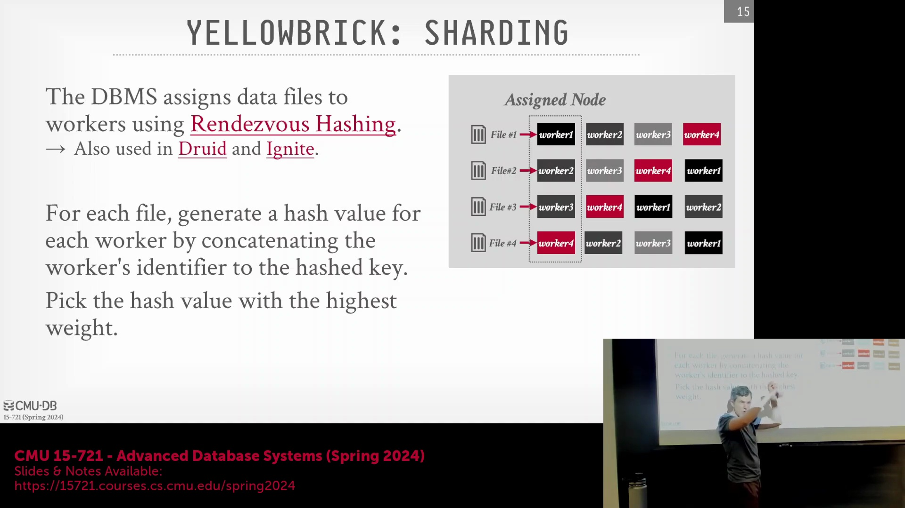
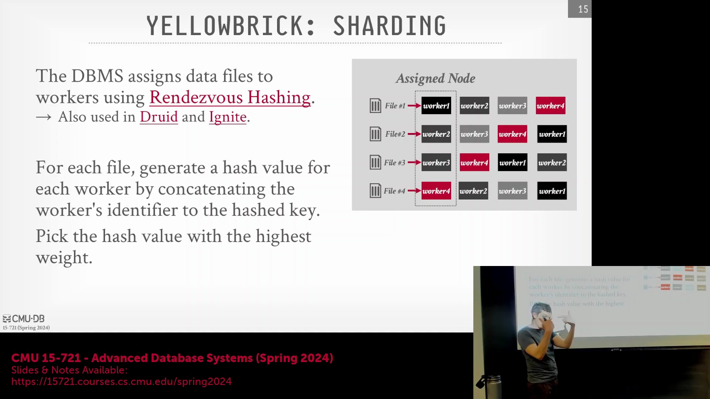

## 原生事务更新与后台合并压缩

与现代数据生态系统中通常依赖 Apache Iceberg、Hudi 或 Delta Lake 等开放表格式(Open Table Formats)处理数据更新的做法不同，Yellowbrick 在其列式存储(Columnar Storage)中原生支持事务性的插入、更新和删除(Transactional Inserts, Updates, and Deletes)操作。系统维护精确的事务日志(Transaction Logs)，用于追踪底层数据文件的变更，使查询引擎在读取时能够高效识别并跳过已失效或已更新的元组(Tuples)。为维持查询性能，后台维护进程(Background Maintenance Processes)会定期执行合并压缩(Compaction)流程，将多个变更文件进行合并，清理历史版本数据，并将活跃数据集(Active Datasets)重新整合为优化的列式数据段(Columnar Segments)，最终持久化至云对象存储中。

## 用于分布式文件分配的 Rendezvous 哈希算法

为将数据文件合理分配至工作节点(Worker Nodes)以填充本地缓存，Yellowbrick 采用了 Rendezvous 哈希算法(Rendezvous Hashing，亦称最高随机权重哈希)，而非 Snowflake 等系统中广泛使用的一致性哈希环(Consistent Hash Ring)拓扑。该算法以确定性(Deterministic)方式运行：将文件标识符(File ID)与每个工作节点的节点 ID 拼接，对组合字符串执行哈希运算(Hashing)，并生成按优先级排序的节点列表。随后，文件将被分配给计算结果哈希值最高的工作节点。该方法无需依赖集中式路由表(Centralized Routing Table)或全局状态同步(Global State Synchronization)，因为集群内每个节点均可基于共享的哈希函数(Shared Hash Function)独立计算出完全一致的文件映射关系(File Mapping)。

当集群拓扑(Cluster Topology)因弹性扩缩容(Elastic Scaling)或节点故障发生改变时，Rendezvous 哈希算法能确保仅有极小部分文件需要重新分配(Reassignment)，从而有效规避了传统取模哈希(Modulo Hashing)导致的大规模数据重分布(Data Rebalancing)开销。尽管该算法单次查找的时间复杂度(Time Complexity)为 $O(n)$（一致性哈希通常为 $O(\log n)$），但在节点变动相对低频的数据库稳定运行环境中，其计算开销微不足道。此外，该算法的工程实现也更为简洁。通过动态调整节点权重(Node Weights)或为高配置机器分配多个虚拟节点(Virtual Nodes)，系统可轻松实现异构硬件环境下的负载均衡(Load Balancing)，从而确保成千上万个约 100 MB 的数据文件在集群中均匀分布。

## 架构融合与容器化背景

Yellowbrick 的云架构是现代数据仓库范式(Data Warehouse Paradigm)的深度融合，它将计算与存储分离(Disaggregated Compute and Storage)、客户端缓存(Client-Side Caching)、基于 LLVM 的全局查询编译(Global Query Compilation)以及推送式向量化执行(Push-Based Vectorized Execution)整合至单一的内聚引擎中。通过借鉴 Snowflake 和 Dremel 等系统的成熟设计模式，该系统充分展现了当代在线分析处理(OLAP)数据库在底层优化技术上的趋同趋势。

尽管该平台在容器化部署(Containerized Deployment)中极度强调对底层硬件的深度控制，且运行着由 Kubernetes 编排(Kubernetes Orchestration)的长期存活微服务(Long-Running Microservices)，但容器化技术本身在分布式数据库领域并非新概念。诸如 Google Dremel 等早期系统，早已利用内部集群管理器（如 Borg）实现计算工作节点(Compute Workers)的大规模编排与管理。

Yellowbrick 的核心差异化优势在于其有效缓解了典型的容器开销(Container Overhead)：通过强制实施工作节点 Pod 与物理服务器之间严格的一对一映射(Strict One-to-One Mapping)、加载自定义 PCIe 驱动程序(Custom PCIe Drivers)以及应用激进的内核旁路技术(Kernel Bypass)。这使得系统在享受云原生编排(Cloud-Native Orchestration)、资源自动供给(Auto-Provisioning)与故障转移自动化(Automated Failover)等便利的同时，依然能够交付媲美裸机(Bare-Metal)的极致性能。
