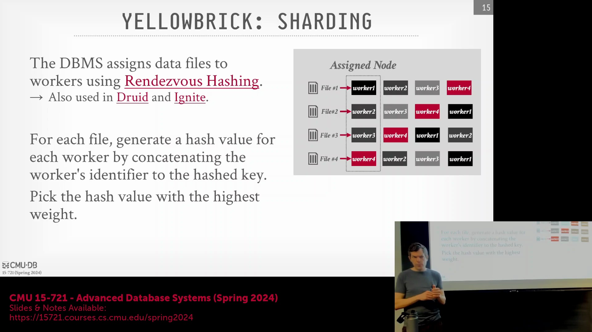
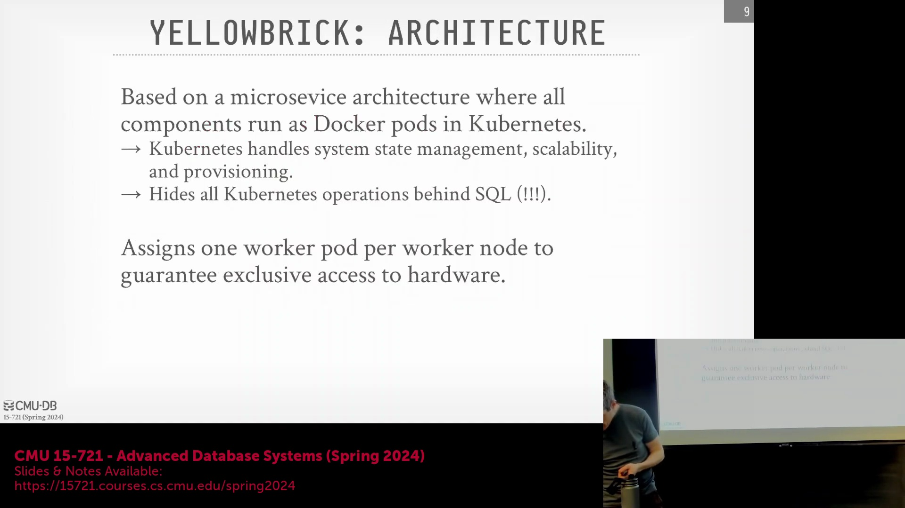
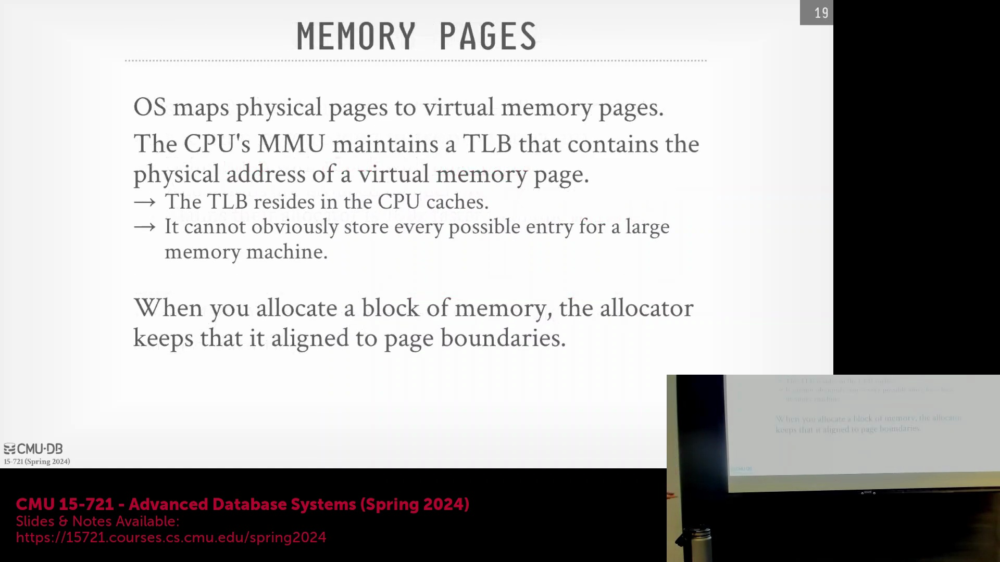

## 容器、Kubernetes 与云基础设施
讨论首先从审视 Snowflake 的底层基础设施开始，具体探讨了其究竟是运行在容器(Container)中还是裸金属服务器(Bare Metal Server)上。尽管并未详细说明 Snowflake 在 AWS(Amazon Web Services) 或其他云平台上的具体部署方式，但对话重点强调了 Kubernetes 的实际优势。Kubernetes 能够原生满足复杂的分布式系统需求，如容错(Fault Tolerance)、资源供给(Resource Provisioning)和系统状态管理(System State Management)（例如其内部运行 `etcd`）。若不借助 Kubernetes，开发者将不得不从零开始手动实现这些功能。值得注意的是，相关研究论文指出，采用容器化部署(Containerized Deployment)并未带来显著的性能损耗(Performance Overhead)，这一发现最初令研究人员颇感意外。

## 最小化操作系统依赖

讲座中提出的一个核心理念是：在高性能数据库(High-Performance Database)设计中，传统操作系统往往被视为性能瓶颈而非助力。为了实现极致的吞吐量(Throughput)，该系统在架构设计上尽可能采用操作系统旁路(OS Bypass)策略。启动时，数据库仅发起极少量的系统调用(System Call)以获取必要的内存和硬件驱动，随后便有效实现“旁路操作系统”，进入用户态独立运行状态。该架构要求在内部重新实现通用的操作系统功能，并针对数据库的特定工作负载(Workload)进行深度定制与调优。其贯穿始终的设计哲学是：通过定向定制来消除操作系统开销(OS Overhead)，从而突破更高的性能上限。

## 异步架构与 CPU 优化
为了最大化硬件利用率(Hardware Utilization)，该系统采用了由协程(Coroutine)驱动的高度异步架构(Asynchronous Architecture)。其主要目标是防止线程阻塞（尤其是在访存(Memory Access)过程中），并确保热数据(Hot Data)紧密驻留在 CPU 缓存(CPU Cache)中。这种设计模式与高频交易(High-Frequency Trading)和量化金融领域的策略高度一致，其中的事件触发与通知机制完全在用户态(User Space)运行，从而有效避开内核延迟(Kernel Latency)。通过将这些华尔街级别的性能优化技术引入数据库场景，该系统实现了持续且高效的执行流水线(Execution Pipeline)，在底层调度与 I/O 操作(I/O Operations)上完全摆脱了对操作系统的依赖。

## 自定义内存分配与缓冲管理
该架构的基石之一是一款定制的、近乎无锁的内存分配器(Lock-free Memory Allocator)。在启动阶段，数据库会向操作系统申请一大块连续的内存空间，而非反复调用标准的 `malloc` 或 `mmap` 系统调用。该内存区域会通过 `mlock`(Memory Lock) 进行锁定，防止其被交换(Swapping)或淘汰至磁盘，从而确保数据永久驻留在物理内存(Random Access Memory, RAM)中。在执行查询时，内存分配采用大块且内存对齐(Memory Alignment)的策略，以最大限度减少内存碎片(Memory Fragmentation)并提升缓存局部性(Cache Locality)。据报道，该定制分配器的性能可达标准 `libc malloc` 的 100 倍。此外，每个工作线程(Worker Thread)都独立管理其专属的缓冲池(Buffer Pool)，并采用简化的双队列 LRU(Least Recently Used) 淘汰策略，在无需操作系统干预的情况下高效完成数据缓存管理。

## 预分配策略与系统韧性
讲座进一步阐明，尽管向操作系统申请内存的初始操作仅在启动时执行一次，但自定义分配器的运行时(Runtime)速度依然至关重要，因为它需要接管并处理后续所有来自应用层的 `new` 或 `malloc` 内存分配请求。这种预分配模型(Pre-allocation Model)与嵌入式及实时系统(Real-time System)（如 ExtremeDB 或 Tiger Beetle）的设计理念高度一致，这些系统严格禁止在启动后进行动态内存分配(Dynamic Memory Allocation)。在关键任务环境(Mission-Critical Environment)中，运行期间若发生 `malloc` 失败可能会引发灾难性后果。通过预先划拨几乎所有可用内存（例如在 100 GB 中预留 99 GB）并在内部进行统一管理，该数据库彻底消除了运行时内存分配失败的风险，显著提升了系统韧性(System Resilience)，并确保了不依赖操作系统内存管理机制的可预测性能(Predictable Performance)。
