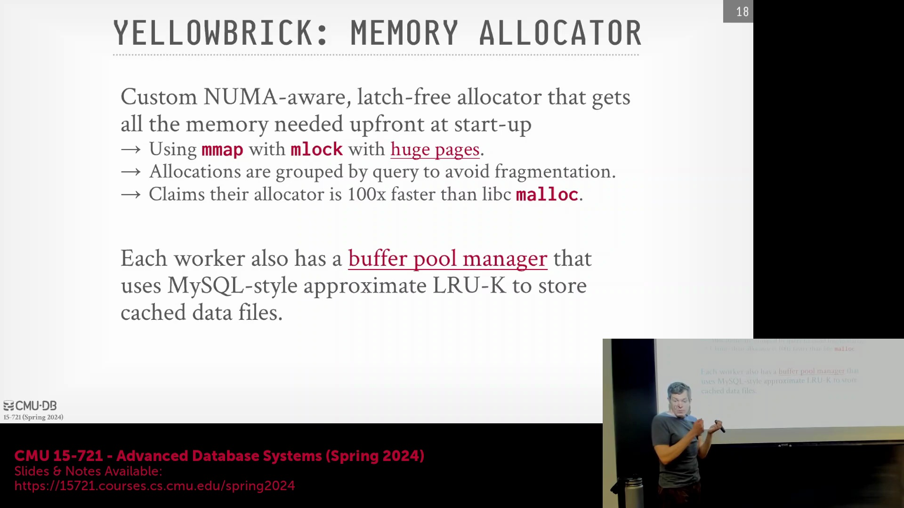
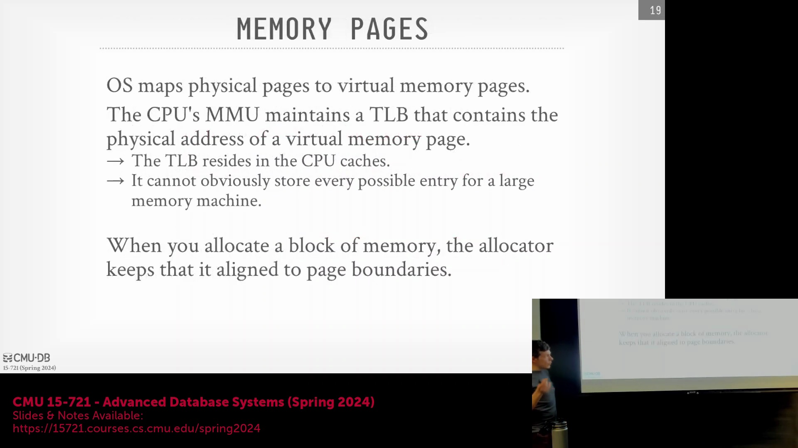
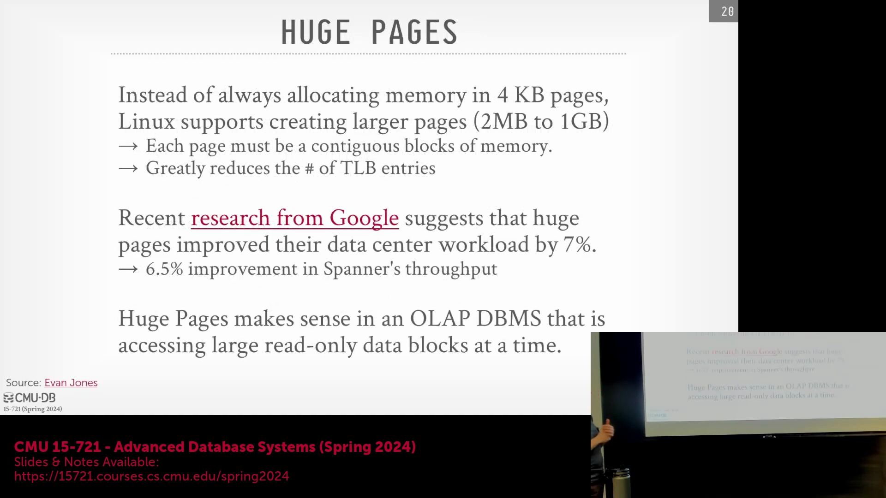
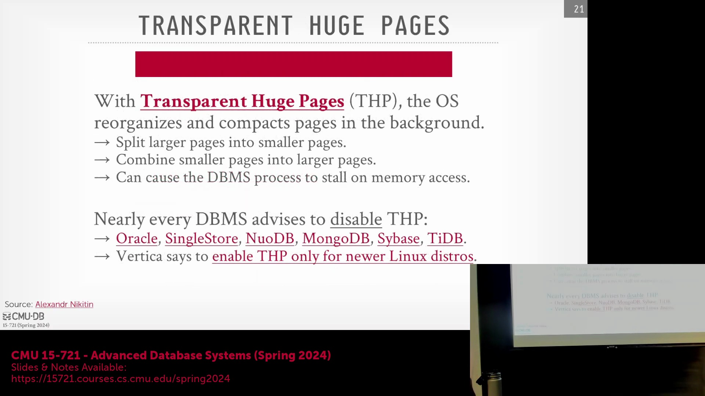
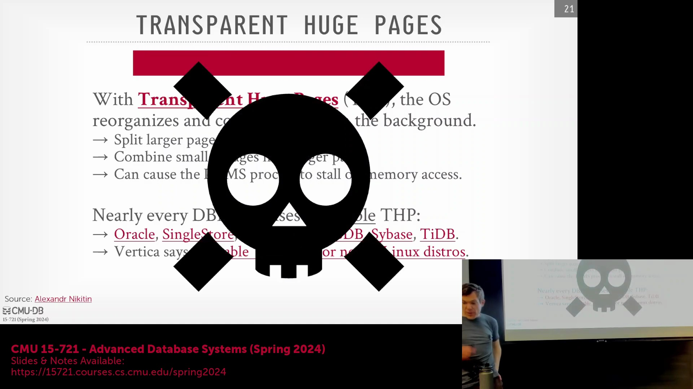
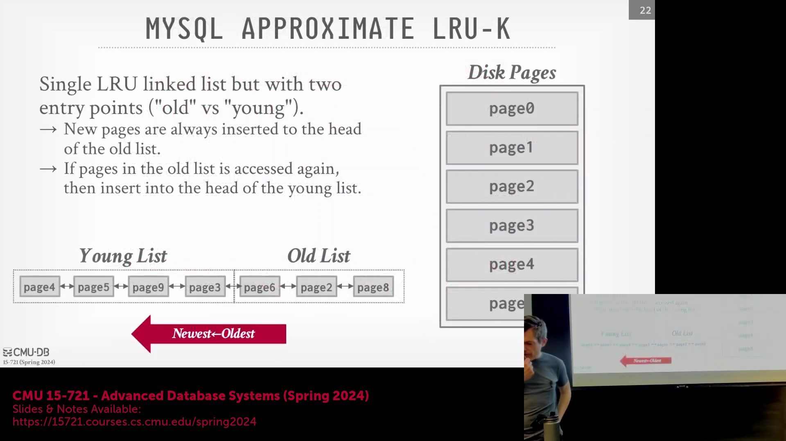

## 内存预分配与运行时故障处理

对于安全关键型(Safety-Critical)与高韧性(High-Resilience)系统（尤其是在嵌入式(Embedded)环境中），强烈不建议在运行时(Runtime)执行动态内存分配(Dynamic Memory Allocation)。正如汽车的控制单元在高速公路上行驶时无法承受内存分配失败一样，现代数据库会在启动阶段预分配(Pre-allocate)所有所需内存，以彻底消除运行时分配失败的风险。这一设计决策同时兼顾了系统安全性与性能的考量。若查询任务耗尽了预分配的内存池，系统将优雅地触发回退机制(Fallback Mechanism)（例如将中间数据溢写(Spill)至磁盘），而非直接崩溃。该策略与 Photon/Spark SQL 等系统的设计如出一辙：通过集中式内存分配器(Centralized Allocator)实时监控内存压力(Memory Pressure)，并主动淘汰或卸载数据以维持系统稳定性，从而摆脱对操作系统不可预测的内存管理机制的依赖。

## 应对 OLAP 工作负载中的 TLB 瓶颈

在传统的联机事务处理(OLTP, Online Transaction Processing)系统中，标准的 4KB 硬件页(Hardware Page)对于原子写入(Atomic Write)和频繁的小规模更新而言是最佳选择。然而，在需要扫描 TB 级数据的读密集型(Read-Intensive)联机分析处理(OLAP, Online Analytical Processing)工作负载(Workload)中，4KB 分页会产生巨大的系统开销(Overhead)。中央处理器(CPU)的转译后备缓冲区(TLB, Translation Lookaside Buffer)负责将虚拟内存地址(Virtual Memory Address)映射至物理内存地址(Physical Memory Address)。当面临海量细粒度映射条目时，TLB 缓存会迅速饱和(Saturate)。当系统执行顺序扫描(Sequential Scan)大规模数据集时，TLB 容量的限制会导致频繁的缓存未命中(Cache Miss)，进而触发代价高昂的硬件页表遍历(Page Table Walk)操作，严重制约系统吞吐量(Throughput)。这种 TLB 压力(TLB Pressure)已成为阻碍分析型数据库(Analytical Database)实现硬件利用率(Hardware Utilization)最大化的核心瓶颈之一。

## 利用大页（Huge Pages）优化缓存

为缓解 TLB 耗尽(Exhaustion)问题，现代数据仓库(Data Warehouse)会显式启用大页(Huge Pages)机制，将操作系统配置为以 2MB 或 1GB 的连续内存块替代传统的 4KB 小块进行内存分配。通过将单个虚拟地址映射至更大的连续物理区域，TLB 能够以极少的页表项覆盖海量内存，从而大幅降低地址转换未命中率(Miss Rate)，并实现更高效的数据遍历(Data Traversal)。Google 的 Spanner 数据库仅通过切换至大页模式，即便在点查询(Point Query)工作负载下也实现了 6.5% 的性能提升(Performance Boost)。对于 Yellowbrick 等系统而言，将其内部数据页对齐为 2MB 可直接契合 Linux 默认的大页尺寸，这种内存对齐策略能显著优化 CPU L3 缓存的访问效率，并配合 TLB 实现更快的数据检索。这种对齐方式最大限度地减少了底层物理内存访问次数，从而显著加速查询执行(Query Execution)。

## 关于透明大页的重要警告

尽管手动配置的大页优势显著，但强烈不建议在生产级数据库部署中启用 Linux 的**透明大页(Transparent Huge Pages, THP)**功能。THP 会在操作系统后台自动将相邻的 4KB 标准页合并为 2MB 或 1GB 的大页块，而应用程序对此通常处于无感知状态。这种后台内存重组操作极易引发进程停顿(Process Stall)，因为操作系统在执行页面压缩(Compaction)与迁移(Migration)时，会同步阻塞应用的内存访问请求。此外，对透明合并的 1GB 内存块执行小规模写入操作，极易触发大范围的页面拆分(Split)与缓存失效(Cache Invalidation)，从而严重拉低系统性能。

事实上，几乎所有主流数据库厂商——包括 Oracle、PingCAP (TiDB)、Splunk 和 Redis——均明确要求在生产环境(Production Environment)中彻底禁用 THP。操作系统“出于好意”的自动优化机制，反而会成为那些追求可预测性(Predictability)与低延迟(Low Latency)内存访问的数据库系统的严重性能瓶颈。相比之下，由数据库显式申请(Explicitly Allocate)的大页则更为安全可靠。数据库能够完全掌控内存页的生命周期(Lifecycle)与分配模式，从而彻底规避操作系统底层不可预见的干预与干扰。

## 双指针 LRU 淘汰策略
为进一步优化内存资源使用，缓冲管理器(Buffer Manager)实现了一种近似 LRU 淘汰策略(Approximate LRU Eviction Policy)，其底层架构与 MySQL 的中途插入点双链表设计高度相似。该系统摒弃了传统的单一队列结构，转而维护一个带有两个逻辑子列表的双端链表：用于驻留频繁访问热数据的“新(Young)”列表，以及用于存放新加载冷数据的“旧(Old)”列表。当数据页首次被加载时，会默认插入“旧(Old)”列表尾部，使其在内存压力下更容易被快速淘汰。这一设计能有效防止全表顺序扫描产生的海量冷数据(Cold Data)将核心热点数据(Hot Data)冲刷出缓存(LRU Cache Pollution)。若“旧(Old)”列表中的数据页在遭遇淘汰前被二次访问，系统将自动将其晋升(Promote)至“新(Young)”列表，标记其具备持续的访问价值。这种双层缓冲架构确保了缓冲池(Buffer Pool)能够高效保留高价值热数据，同时在无需人工干预的情况下，妥善消化大规模的一次性分析型扫描(One-Shot Analytical Scan)任务。