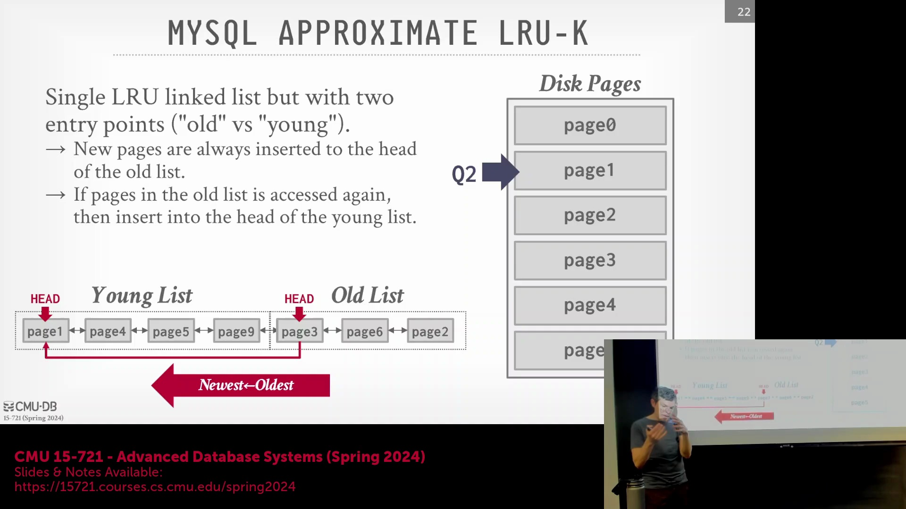
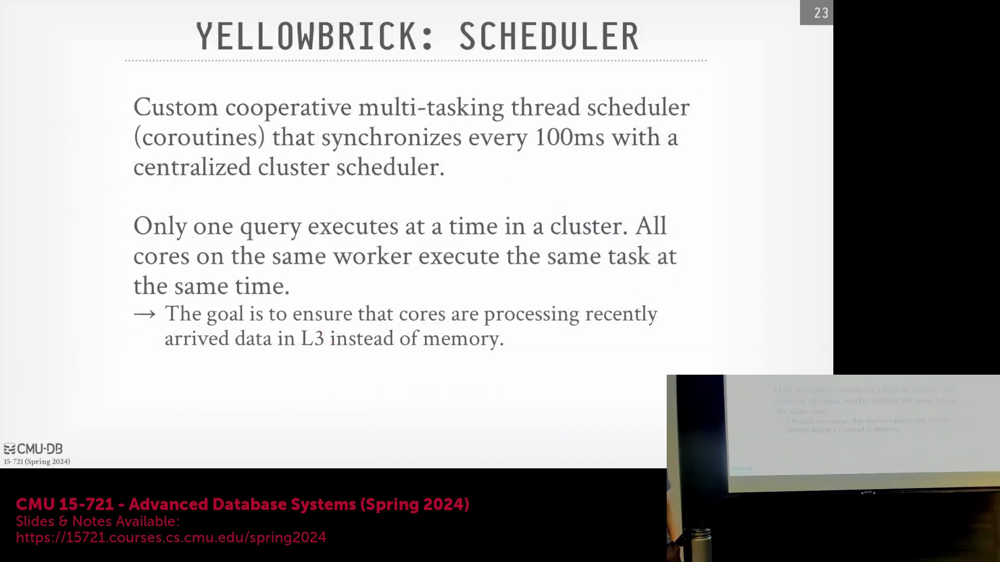
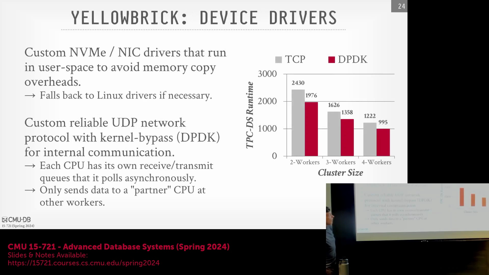

## 缓冲池淘汰策略（续）

基于前文对淘汰策略(Eviction Policy)的讨论，新访问的数据页(Data Page)最初会被置于一个暂存区域(Probationary Area)，此时它们处于极易被快速淘汰的状态。然而，若某数据页在驻留缓存期间被再次访问，它将被晋升(Promote)至标准的主 LRU（Least Recently Used，最近最少使用）列表。这种精简的机制既能有效防止一次性顺序扫描(Sequential Scan)产生的冷数据冲刷出频繁访问的热点数据(Hot Data)，又能保持缓存管理结构的简洁与高效。

## 协作式多任务与集中式调度

为消除操作系统层面的线程调度开销(Thread Scheduling Overhead)，该系统实现了自定义的协作式多任务处理(Cooperative Multitasking)模型。线程采用非抢占式(Non-preemptive)执行机制：当当前任务所需数据未就绪时，线程会主动让出(Yield)控制权，并立即切换至同一查询的下一个待处理任务。集群层面部署了一个集中式全局调度器(Centralized Global Scheduler)，通过心跳机制(Heartbeat Mechanism)以 100 毫秒为周期同步所有节点状态。该设计强制实施一种严格的同步执行模式，即各工作节点(Worker Node)上的所有线程需针对不同的数据分区(Data Partition)执行完全相同的计算算子(Compute Operator)。通过保障执行流的高度一致性，CPU 指令缓存(Instruction Cache)得以高效命中，彻底避免了因在不同查询或任务间频繁切换而引发的缓存颠簸(Cache Thrashing)现象。

## 关于调度器性能声明的澄清
开发团队宣称其自研的用户态线程调度器(User-space Thread Scheduler)在调度效率上较标准 Linux 调度器提升达 500 倍。需要澄清的是，该指标衡量的是调度延迟(Scheduling Latency)的显著降低，而非端到端的整体查询执行时间(End-to-End Query Execution Time)。尽管单次标准的上下文切换(Context Switch)耗时通常在 100-200 纳秒量级，但自定义调度器大幅削减了纯粹用于任务编排(Task Orchestration)与队列协调的管理开销。正如阿姆达尔定律(Amdahl's Law)所揭示，仅优化调度组件并不能使整体查询性能获得 500 倍的线性加速，因为系统的核心瓶颈通常集中于数据计算、内存访问(Memory Access)或 I/O(Input/Output)环节，而非上下文切换本身。

## 用户态驱动程序与 DPDK 网络

为规避内核态与用户态间昂贵且频繁的数据拷贝(Memory Copy)开销，该数据库将其定制的 NVMe(Non-Volatile Memory Express) 存储驱动与网卡(NIC, Network Interface Card) 驱动完全置于用户态(User-space)运行，并直接交由内部内存分配器管理。团队摒弃了标准 TCP 协议栈或昂贵的 InfiniBand/RDMA(Remote Direct Memory Access) 硬件方案，转而设计了一套基于 UDP(User Datagram Protocol) 的定制化网络协议，在应用层内置了可靠的传输校验机制。依托数据平面开发套件(DPDK, Data Plane Development Kit)，每个工作线程均独占专用的硬件收发队列(Hardware TX/RX Queue)并执行高效的异步轮询(Asynchronous Polling)。网络路由层面进一步引入了“对等 CPU 核心映射(Peer CPU Core Mapping / CPU Affinity)”优化：发送线程可将数据报文精准投递至远程节点上预先绑定的特定 CPU 核心。这种严格的 1:1 线程映射消除了传统的通用消息队列(Message Queue)机制，并在节点间数据混洗(Data Shuffle)过程中大幅降低了硬件级闩锁(Latch)与互斥锁(Mutex)的竞争开销。

## 自定义 S3 客户端与基准测试验证
鉴于云厂商提供的标准对象存储 API(Object Storage API)仍无法满足其极低延迟的工作负载需求，团队基于 DPDK 自主构建了一套定制化 S3(Simple Storage Service) 客户端库。实测数据显示，该自研实现的数据传输速率可达 AWS 官方 SDK(Software Development Kit) 的三倍。在多种集群规模下执行 TPC-DS(Transaction Processing Performance Council - Decision Support) 基准测试(Benchmark)的结果表明，将底层网络通信从标准 TCP 协议栈切换至 DPDK 优化的用户态网络栈，可使整体查询吞吐量(Query Throughput)获得约 20% 的稳定提升。这一数据充分验证了绕过传统操作系统网络层(OS Network Stack)、直接在用户态接管并管理硬件队列所投入的巨大工程成本的价值。