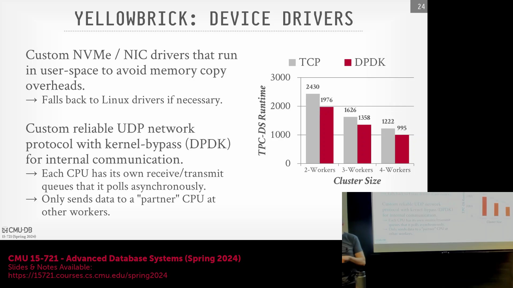
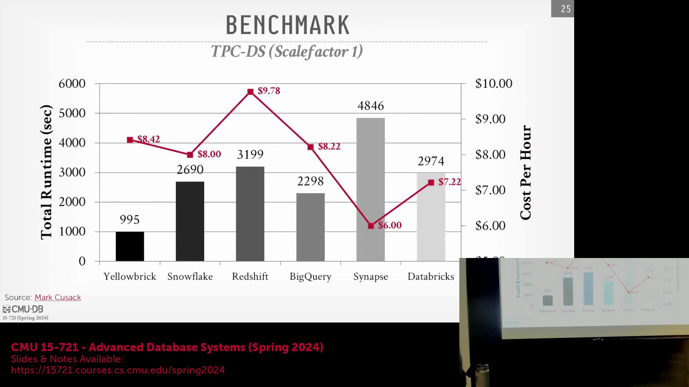
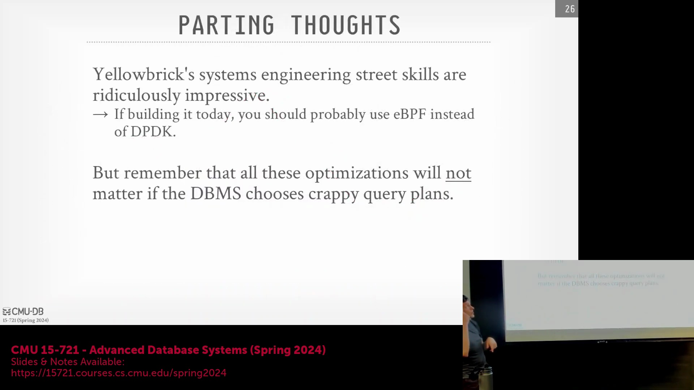

## 自定义网络与 DPDK 带来的性能增益

基于数据平面开发套件(DPDK, Data Plane Development Kit)和专有 UDP(User Datagram Protocol) 协议构建的自定义网络栈(Custom Network Stack)，相较于标准 TCP(Transmission Control Protocol) 协议带来了可量化的性能提升。尽管在 TPC-DS(Transaction Processing Performance Council - Decision Support) 基准测试负载下的平均加速比(Speedup)约为 20%，但特定数据密集型查询(Data-Intensive Query)的性能提升幅度高达 70%–77%。采用该架构的主要目的并非为了降低硬件成本，而是为了突破开箱即用(Out-of-the-Box)的操作系统原生网络栈的性能瓶颈。尽管其绝对性能尚未触及昂贵的 InfiniBand/RDMA(Remote Direct Memory Access) 解决方案的天花板（此类硬件在公有云环境中往往部署受限或成本过高），但通过彻底消除内核级开销(Kernel-Level Overhead)并削减不必要的协议冗余，该方案已显著缩小了与高性能网络硬件的差距。

## 可靠性实现与内核旁路
为在规避 TCP 逐包确认(Packet-by-Packet Acknowledgment)开销的同时保障传输可靠性，该系统设计了一套面向批处理(Batch-Oriented)的可靠性保障层(Reliability Layer)。该机制摒弃了对单个数据包的逐一确认，转而采用批量序列号标记（例如标识为“10 包批次中的第 1 包”、“第 2 包”等），仅在检测到批次内存在丢包时才触发重传请求(Retransmission Request)。结合 DPDK 技术，该架构实现了完整的内核旁路(Kernel Bypass)，彻底规避了传统网络栈中通常耗费高达 50% CPU 算力的繁重内存拷贝(Memory Copy)与上下文切换(Context Switch)操作。需要特别强调的是，该自定义协议专用于集群内部节点间通信(Inter-Node Communication)；诸如 S3(Simple Storage Service) 数据上传等外部交互仍严格依赖标准云 API(Cloud API)，仅在客户端侧借助 DPDK 加速数据向用户态的摄入(Data Ingestion)过程。

## TPC-DS 基准测试与成本效率分析

Yellowbrick 的性能评估基于 TPC-DS 比例因子 1(Scale Factor 1, SF1) 数据集展开，将其整体工作负载运行时间(Execution Time)与每小时计算成本(Cost Per Hour)同 Snowflake、Amazon Redshift、Google BigQuery、Azure Synapse 及 Databricks 等主流云数据仓库(Cloud Data Warehouse)进行了横向对比。测试结果表明，Yellowbrick 不仅在绝对执行时间上表现最优，其综合运行成本亦显著低于竞品。通过将执行耗时与各厂商云定价模型(Cloud Pricing Model)进行标准化折算，该系统展现出极高的成本效益(Cost-Effectiveness)。然而，讲师也客观指出，尽管上述绝对性能指标颇具冲击力，但云厂商的底层硬件配置通常处于高度抽象化(Highly Abstracted)状态，外界很难确切验证竞争对手是否在完全对等的 CPU、内存或存储规格(Specifications)下执行了相同测试。

## 云数据库对比中的关键注意事项
尽管基准测试(Benchmark)数据颇具说服力，但多种潜在变量仍使跨平台直接对比变得复杂。所呈现的成本效益差异可能源于集群规模(Cluster Size)的不同、默认参数配置(Default Configuration)的差异，或是未将数据上传(Data Upload)与系统预热/初始化(Warm-up/Initialization)时间等隐性开销(Hidden Overhead)纳入统计。此外，各系统专有的查询优化器(Query Optimizer)与执行引擎(Execution Engine)亦引入了不可控的隐藏变量：Yellowbrick 与 Redshift 采用了 JIT(Just-In-Time) 即时编译技术，而 Snowflake、BigQuery 及部分 Databricks 架构则依赖于解释执行(Interpreted Execution)或差异化的向量化执行模型(Vectorized Execution Model)。在缺乏对底层执行计划(Execution Plan)、集群硬件规格及预热状态(Warm-up State)完全透明披露的前提下，此类基准测试结果仅宜视为趋势性参考指标，而非证明其在所有类型工作负载(Workload)下均具备绝对优势的定论。

## 查询优化优先于底层微调

尽管 Yellowbrick 在自定义内存分配器(Custom Allocator)、用户态调度器(User-space Scheduler)及 DPDK 驱动层面的底层工程实现令人瞩目，但讲师强烈建议，现代数据库开发不应再盲目复刻此类深度的硬件级定制(Hardware-Level Customization)。诸如 eBPF(extended Berkeley Packet Filter) 和 io_uring 等现代内核技术，已能够以更低的开发与维护成本提供近似内核旁路的性能优势。更为关键的结论在于：若查询优化器生成了低效的执行计划，那么任何底层的操作系统调优与网络层优化都将是徒劳的。即便配备了极速驱动程序与零拷贝网络(Zero-Copy Networking)，错误的表连接顺序(Join Order)或缺陷的查询计划(Query Plan)仍将主导整体执行耗时，并彻底抹杀所有硬件层面的性能增益(Performance Gain)。归根结底，智能化的查询优化(Query Optimization)始终是决定数据库系统性能上限的最核心要素。