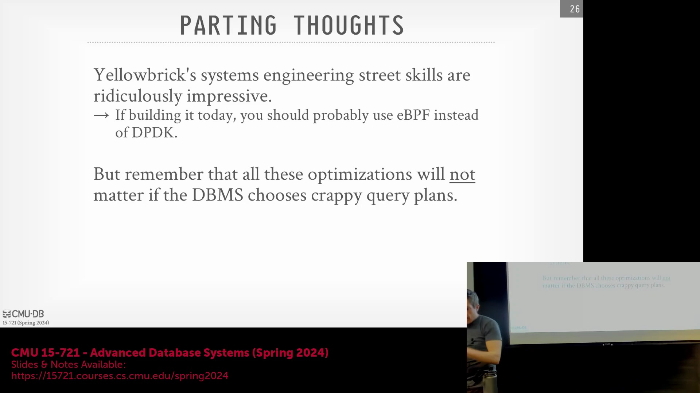
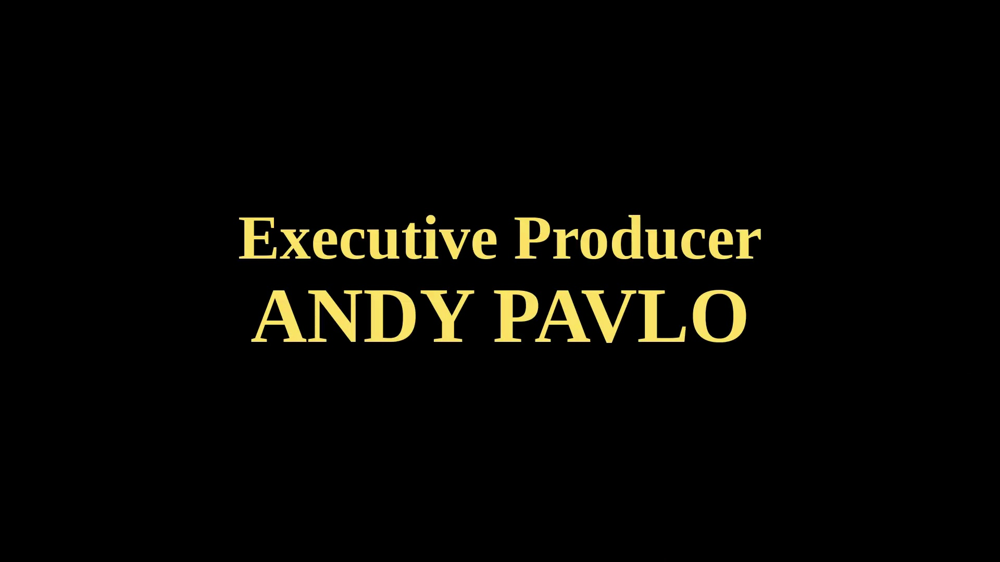
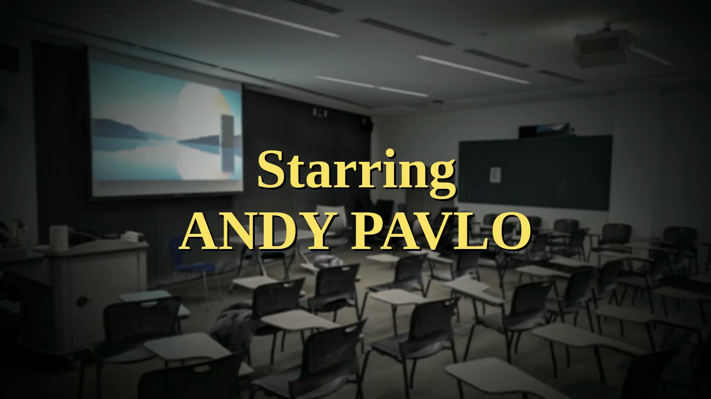
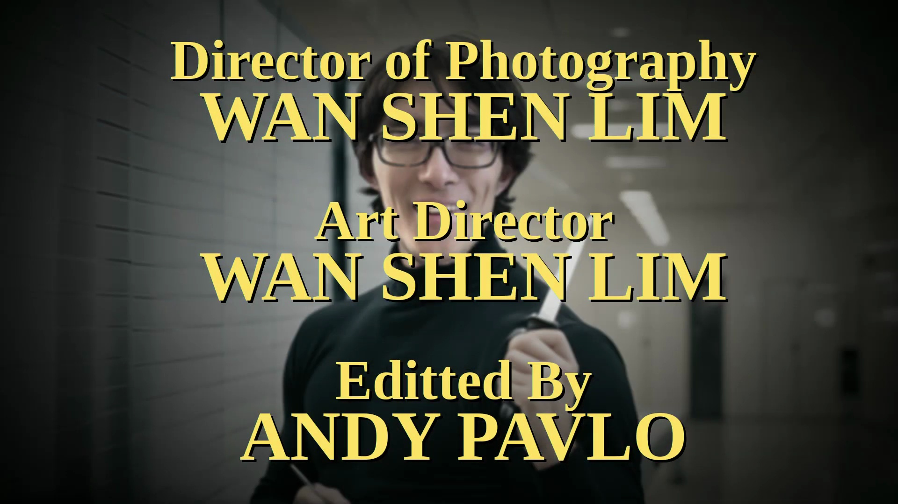
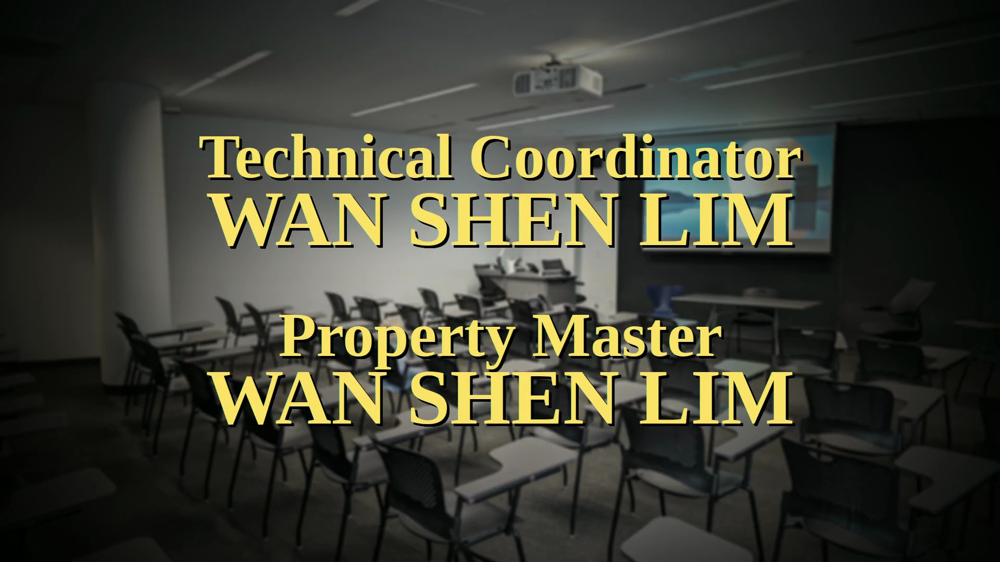
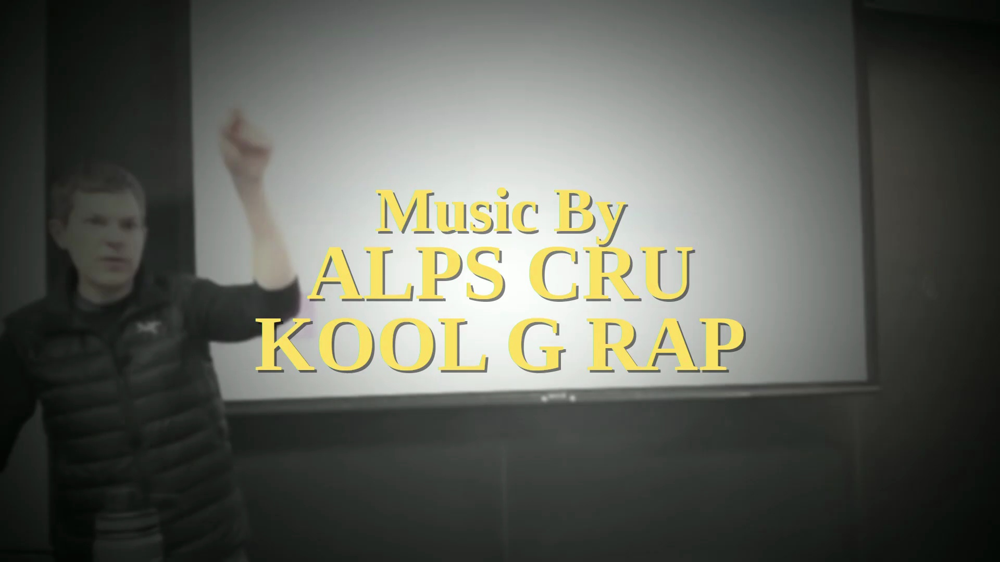
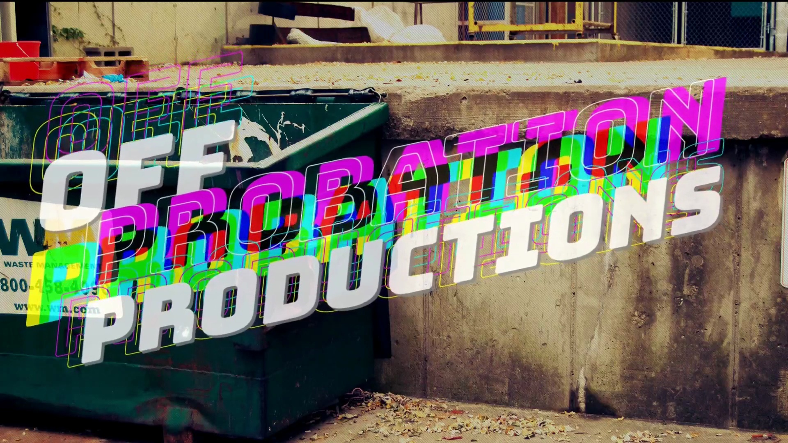

## 最后一讲预告
本节课程以对学期末最后一场讲座的预告作结，该讲座将聚焦于 Amazon Redshift。这也标志着在最终考核开始前，本课程的核心教学内容已全部讲授完毕。

## 期末考试安排
讲师宣布，期末考试将以课后限时考核(Take-home Assignment)的形式发布。学生须独立完成作答，所有答卷须于下周截止日期前提交。

## 办公答疑时间与行程安排
当日常规答疑时间(Office Hours)照常进行，但周三的答疑时段将临时取消。讲师将前往西雅图处理法务相关事宜，在此期间将暂停接受学生咨询。

## 课程结语
视频在最后的教务提醒与环境背景音中落下帷幕。随着本课程正式结课，讲师再次提示学生们为即将到来的课后期末考试以及压轴的 Amazon Redshift 专题讲座做好准备。

